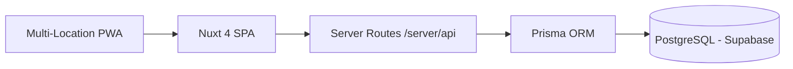

# API Contract - Multi-Location Stock Management System

**Last Updated:** December 2025

**Purpose:** Define the backend API for the multi-location stock management system

## Overview

### Base Configuration

- **Base URL:** `/api` (relative, same origin)
- **Architecture:** Nuxt Server Routes (Nitro/H3)
- **Auth:** JWT in httpOnly cookies via nuxt-auth-utils
- **Content-Type:** `application/json; charset=utf-8`
- **Times:** ISO 8601 UTC
- **Currency:** SAR (Saudi Riyal)
- **Pagination:** `?page=1&limit=50` + `X-Total-Count` header
- **Location Context:** Route parameter or query parameter

### API Architecture



**Key Points:**

- Single monolithic Nuxt 4 application
- Frontend and API in same deployment
- Serverless functions on Vercel
- Direct Prisma connection to Supabase
- No separate backend service
- No Redis or message queue for MVP

---

## Authentication & Authorization

### Authentication Method

- **Cookie-based JWT** (httpOnly, secure)
- **Library:** nuxt-auth-utils
- **Session management:** Server-side via Nuxt middleware
- **No Bearer tokens** - cookies auto-sent by browser

### Session Structure

```typescript
interface UserSession {
  user: {
    id: string;
    username: string;
    email: string;
    full_name: string;
    role: "OPERATOR" | "SUPERVISOR" | "ADMIN";
    default_location_id: string | null;
    default_location: {
      id: string;
      code: string;
      name: string;
      type: string;
    } | null;
    locations: string[]; // Array of location IDs user has access to
  };
  loggedInAt: string; // ISO date string
}
```

### Authentication Endpoints

#### Login

```
POST /api/auth/login
```

**Body:**

```json
{
  "email": "user@example.com",
  "password": "password123"
}
```

**Note:** The `email` field accepts either email or username.

**Response:**

```json
{
  "success": true,
  "message": "Login successful",
  "user": {
    "id": "uuid",
    "username": "admin",
    "email": "admin@example.com",
    "full_name": "Admin User",
    "role": "ADMIN",
    "default_location_id": "uuid",
    "default_location": {
      "id": "uuid",
      "code": "KIT",
      "name": "Kitchen",
      "type": "KITCHEN"
    },
    "locations": ["uuid1", "uuid2"]
  }
}
```

#### Logout

```
POST /api/auth/logout
```

**Response:**

```json
{ "success": true }
```

#### Get Current Session

```
GET /api/auth/session
```

**Response:** `UserSession | null`

#### Register User

```
POST /api/auth/register
```

**Body:**

```json
{
  "username": "newuser",
  "email": "newuser@example.com",
  "password": "password123",
  "full_name": "New User",
  "role": "OPERATOR"
}
```

**Permissions:** ADMIN only

#### Change Password

```
POST /api/auth/change-password
```

**Body:**

```json
{
  "currentPassword": "oldpassword",
  "newPassword": "newpassword"
}
```

#### Update Profile

```
PATCH /api/auth/profile
```

**Body:**

```json
{
  "full_name": "Updated Name",
  "email": "newemail@example.com"
}
```

### Role Permissions

| Role           | Permissions                                       |
| -------------- | ------------------------------------------------- |
| **OPERATOR**   | View/Post at assigned locations only              |
| **SUPERVISOR** | All locations, approve transfers, manage NCRs     |
| **ADMIN**      | Full system access, period close, user management |

### Middleware Protection

All `/api/*` routes automatically protected via server middleware, except:

- `/api/auth/login`
- `/api/auth/logout`
- `/api/auth/session`
- `/api/auth/register`
- `/api/health`

```typescript
// server/middleware/auth.ts
export default defineEventHandler(async (event) => {
  const session = await getUserSession(event);
  if (!session.user) {
    throw createError({ statusCode: 401 });
  }
  event.context.user = session.user;
});
```

---

## Core Endpoints

### 1. Location Management

#### List Locations

```
GET /api/locations
```

**Query Params:**

- `type`: KITCHEN, STORE, CENTRAL, WAREHOUSE
- `active`: true/false

**Response:**

```json
{
  "locations": [
    {
      "id": "uuid",
      "code": "KIT",
      "name": "Kitchen",
      "type": "KITCHEN",
      "is_active": true
    }
  ],
  "total": 4
}
```

#### Get Location Details

```
GET /api/locations/{id}
```

#### Create Location

```
POST /api/locations
```

**Body:**

```json
{
  "code": "STR",
  "name": "Store",
  "type": "STORE"
}
```

**Permissions:** ADMIN only

#### Update Location

```
PATCH /api/locations/{id}
```

#### Delete Location

```
DELETE /api/locations/{id}
```

**Permissions:** ADMIN only

#### Get Location Dashboard

```
GET /api/locations/{id}/dashboard
```

**Response:**

```json
{
  "location": {
    "id": "uuid",
    "code": "KIT",
    "name": "Kitchen"
  },
  "period": {
    "id": "uuid",
    "name": "Jan 2026",
    "start_date": "2026-01-01",
    "end_date": "2026-01-31",
    "status": "OPEN"
  },
  "totals": {
    "total_receipts": 5000.00,
    "total_issues": 3000.00,
    "total_mandays": 500,
    "days_left": 15
  },
  "recent_deliveries": [...],
  "recent_issues": [...]
}
```

#### Manage Location Users

```
POST /api/locations/{id}/users
DELETE /api/locations/{id}/users/{userId}
```

---

### 2. Dashboard

#### Get Consolidated Dashboard

```
GET /api/dashboard/consolidated
```

**Permissions:** SUPERVISOR/ADMIN only

**Response:**

```json
{
  "current_period": {...},
  "locations": [...],
  "totals": {
    "total_receipts": 50000.00,
    "total_issues": 35000.00,
    "total_stock_value": 125000.00
  },
  "pending_approvals": 3
}
```

---

### 3. Period Management

#### List Periods

```
GET /api/periods
```

#### Get Current Period

```
GET /api/periods/current
```

**Response:**

```json
{
  "id": "uuid",
  "name": "Jan 2026",
  "status": "OPEN",
  "start_date": "2026-01-01",
  "end_date": "2026-01-31",
  "locations_ready": 2,
  "locations_total": 4
}
```

#### Get Period Details

```
GET /api/periods/{id}
```

#### Create Period

```
POST /api/periods
```

**Body:**

```json
{
  "name": "Feb 2026",
  "start_date": "2026-02-01",
  "end_date": "2026-02-28"
}
```

**Permissions:** ADMIN only

#### Update Period

```
PATCH /api/periods/{id}
```

#### Get Period Prices

```
GET /api/periods/{periodId}/prices
```

#### Set Period Prices

```
POST /api/periods/{periodId}/prices
```

**Body:**

```json
{
  "prices": [
    { "item_id": "uuid", "price": 25.5 },
    { "item_id": "uuid", "price": 18.75 }
  ]
}
```

**Permissions:** ADMIN only

#### Copy Prices from Previous Period

```
POST /api/periods/{periodId}/prices-copy
```

#### Open Period

```
POST /api/periods/{periodId}/open
```

**Permissions:** ADMIN only

#### Close Period

```
POST /api/periods/{periodId}/close
```

**Body:**

```json
{
  "closing_notes": "All locations reconciled"
}
```

**Permissions:** ADMIN only. All locations must be in READY status.

#### Roll Forward Period

```
POST /api/periods/{periodId}/roll-forward
```

Creates next period and copies closing stock as opening stock.

---

### 4. Period Location Status

#### Mark Location Ready for Close

```
PATCH /api/period-locations/ready
```

**Body:**

```json
{
  "periodId": "uuid",
  "locationId": "uuid"
}
```

#### Mark Location Not Ready

```
PATCH /api/period-locations/unready
```

---

### 5. Stock Operations

#### Get Consolidated Stock

```
GET /api/stock/consolidated
```

**Query Params:**

- `category`: Filter by category
- `lowStock`: "true" to show only low stock items

**Permissions:** SUPERVISOR/ADMIN only

**Response:**

```json
{
  "consolidated_stock": [
    {
      "item_id": "uuid",
      "item_code": "PRO-001",
      "item_name": "Chicken Breast",
      "item_unit": "KG",
      "item_category": "PROTEINS",
      "total_on_hand": 250.5,
      "total_value": 6387.75,
      "locations": [
        {
          "location_id": "uuid",
          "location_code": "KIT",
          "location_name": "Kitchen",
          "on_hand": 150.5,
          "wac": 25.50,
          "value": 3837.75,
          "min_stock": 50,
          "max_stock": 500,
          "is_low_stock": false
        }
      ]
    }
  ],
  "location_totals": [...],
  "grand_total_value": 125430.50,
  "total_items": 45,
  "total_locations": 4
}
```

---

### 6. Items Management

#### List Items

```
GET /api/items
```

**Query Params:**

- `category`: Filter by category
- `active`: true/false
- `search`: Search by name or code
- `locationId`: Include stock levels for specific location

#### Get Item Details

```
GET /api/items/{id}
```

#### Create Item

```
POST /api/items
```

**Body:**

```json
{
  "code": "PRO-001",
  "name": "Chicken Breast",
  "unit": "KG",
  "category": "PROTEINS",
  "sub_category": "Poultry"
}
```

**Permissions:** ADMIN only

#### Update Item

```
PATCH /api/items/{id}
```

#### Delete Item

```
DELETE /api/items/{id}
```

**Permissions:** ADMIN only

#### Update Item Price

```
PATCH /api/items/{itemId}/price
```

**Body:**

```json
{
  "price": 28.5,
  "periodId": "uuid"
}
```

---

### 7. Suppliers Management

#### List Suppliers

```
GET /api/suppliers
```

#### Get Supplier Details

```
GET /api/suppliers/{id}
```

#### Create Supplier

```
POST /api/suppliers
```

**Body:**

```json
{
  "code": "SUP-001",
  "name": "Fresh Foods Co.",
  "contact_person": "John Doe",
  "phone": "+966501234567",
  "email": "contact@freshfoods.com"
}
```

#### Update Supplier

```
PATCH /api/suppliers/{id}
```

#### Delete Supplier

```
DELETE /api/suppliers/{id}
```

---

### 8. Deliveries

#### List Location Deliveries

```
GET /api/locations/{id}/deliveries
```

**Query Params:**

- `status`: DRAFT, POSTED
- `supplierId`: Filter by supplier
- `hasVariance`: true/false
- `startDate`: ISO date
- `endDate`: ISO date

#### Get Delivery Details

```
GET /api/deliveries/{id}
```

#### Create Delivery

```
POST /api/locations/{id}/deliveries
```

**Body:**

```json
{
  "supplier_id": "uuid",
  "invoice_no": "INV-2025-001",
  "delivery_note": "DN-001",
  "delivery_date": "2025-12-25",
  "status": "POSTED",
  "lines": [
    {
      "item_id": "uuid",
      "quantity": 100,
      "unit_price": 26.0
    }
  ]
}
```

**Status Options:**

- `DRAFT`: Saves without affecting stock (invoice_no optional)
- `POSTED`: Immediately updates stock and WAC (invoice_no required)

**Response with Price Variance:**

```json
{
  "id": "uuid",
  "message": "Delivery posted. 1 price variance(s) detected and NCR(s) created automatically.",
  "delivery": {
    "id": "uuid",
    "delivery_no": "DEL-2025-001",
    "delivery_date": "2025-12-25",
    "invoice_no": "INV-2025-001",
    "total_amount": 2600.00,
    "has_variance": true,
    "status": "POSTED"
  },
  "lines": [...],
  "ncrs": [
    {
      "id": "uuid",
      "ncr_no": "NCR-2025-001",
      "type": "PRICE_VARIANCE",
      "item": { "id": "uuid", "code": "PRO-001", "name": "Chicken Breast" },
      "expected_price": 25.00,
      "actual_price": 26.00,
      "variance": 1.00,
      "variance_percent": 4.0
    }
  ]
}
```

#### Update Delivery (Draft Only)

```
PATCH /api/deliveries/{id}
```

#### Delete Delivery (Draft Only)

```
DELETE /api/deliveries/{id}
```

---

### 9. Issues

#### List Location Issues

```
GET /api/locations/{id}/issues
```

#### Get Issue Details

```
GET /api/issues/{id}
```

#### Create Issue

```
POST /api/locations/{id}/issues
```

**Body:**

```json
{
  "issue_date": "2025-12-25",
  "cost_centre": "FOOD",
  "lines": [
    {
      "item_id": "uuid",
      "quantity": 15.5
    }
  ]
}
```

**Response:**

```json
{
  "issue": {
    "id": "uuid",
    "issue_no": "ISS-2025-001",
    "issue_date": "2025-12-25",
    "cost_centre": "FOOD",
    "total_value": 395.25
  },
  "lines": [
    {
      "item": { "id": "uuid", "code": "PRO-001", "name": "Chicken Breast" },
      "quantity": 15.5,
      "wac": 25.5,
      "value": 395.25
    }
  ]
}
```

---

### 10. Transfers

#### List Transfers

```
GET /api/transfers
```

**Query Params:**

- `fromLocationId`: Source location UUID
- `toLocationId`: Destination location UUID
- `status`: PENDING_APPROVAL, APPROVED, COMPLETED, REJECTED
- `startDate`: ISO date
- `endDate`: ISO date

#### Get Transfer Details

```
GET /api/transfers/{id}
```

#### Create Transfer Request

```
POST /api/transfers
```

**Body:**

```json
{
  "from_location_id": "uuid",
  "to_location_id": "uuid",
  "request_date": "2025-12-25",
  "notes": "Stock rebalancing",
  "lines": [
    {
      "item_id": "uuid",
      "quantity": 50
    }
  ]
}
```

**Response:**

```json
{
  "message": "Transfer created successfully and is pending approval",
  "transfer": {
    "id": "uuid",
    "transfer_no": "TRF-2025-001",
    "request_date": "2025-12-25",
    "status": "PENDING_APPROVAL",
    "total_value": 1275.00,
    "from_location": { "id": "uuid", "code": "KIT", "name": "Kitchen" },
    "to_location": { "id": "uuid", "code": "STR", "name": "Store" },
    "lines": [...]
  }
}
```

#### Approve Transfer

```
PATCH /api/transfers/{id}/approve
```

**Permissions:** SUPERVISOR/ADMIN only

**Response:** Transfer with status COMPLETED and stock movements applied.

#### Reject Transfer

```
PATCH /api/transfers/{id}/reject
```

**Body:**

```json
{
  "reason": "Insufficient justification for transfer"
}
```

**Permissions:** SUPERVISOR/ADMIN only

---

### 11. NCR Management

#### List NCRs

```
GET /api/ncrs
```

**Query Params:**

- `locationId`: Filter by location
- `type`: MANUAL, PRICE_VARIANCE
- `status`: OPEN, SENT, CREDITED, CLOSED
- `startDate`: ISO date
- `endDate`: ISO date

#### Get NCR Details

```
GET /api/ncrs/{id}
```

#### Create Manual NCR

```
POST /api/ncrs
```

**Body:**

```json
{
  "location_id": "uuid",
  "delivery_id": "uuid",
  "reason": "Items damaged in transit",
  "lines": [
    {
      "item_id": "uuid",
      "quantity": 5,
      "value": 127.5
    }
  ]
}
```

#### Update NCR Status

```
PATCH /api/ncrs/{id}
```

**Body:**

```json
{
  "status": "SENT",
  "resolution": "Credit note received"
}
```

---

### 12. POB (People on Board)

#### Get Location POB Entries

```
GET /api/locations/{id}/pob
```

**Query Params:**

- `periodId`: Filter by period

**Response:**

```json
{
  "period": { "id": "uuid", "name": "Jan 2026" },
  "location": { "id": "uuid", "name": "Kitchen" },
  "entries": [
    {
      "id": "uuid",
      "date": "2026-01-01",
      "crew_count": 60,
      "extra_count": 15,
      "total": 75
    }
  ],
  "totals": {
    "total_crew": 1800,
    "total_extra": 450,
    "total_mandays": 2250
  }
}
```

#### Create POB Entry

```
POST /api/locations/{id}/pob
```

**Body:**

```json
{
  "periodId": "uuid",
  "date": "2026-01-01",
  "crew_count": 60,
  "extra_count": 15
}
```

#### Update POB Entry

```
PATCH /api/pob/{id}
```

**Body:**

```json
{
  "crew_count": 62,
  "extra_count": 10
}
```

---

### 13. Reconciliations

#### Get Consolidated Reconciliation

```
GET /api/reconciliations/consolidated
```

**Query Params:**

- `periodId`: Required - Period UUID
- `locationId`: Optional - Filter by location

**Response:**

```json
{
  "period": { "id": "uuid", "name": "Jan 2026" },
  "reconciliations": [
    {
      "location": { "id": "uuid", "code": "KIT", "name": "Kitchen" },
      "opening_stock": 125000.00,
      "receipts": 45000.00,
      "transfers_in": 5000.00,
      "transfers_out": 3000.00,
      "issues": 35000.00,
      "closing_stock": 137000.00,
      "back_charges": 1000.00,
      "credits": 500.00,
      "condemnations": 200.00,
      "adjustments": 0.00,
      "consumption": 34500.00,
      "total_mandays": 2100,
      "manday_cost": 16.43,
      "is_confirmed": true
    }
  ],
  "grand_totals": {...}
}
```

#### Save/Update Reconciliation

```
POST /api/reconciliations
```

**Body:**

```json
{
  "periodId": "uuid",
  "locationId": "uuid",
  "back_charges": 1000.0,
  "credits": 500.0,
  "condemnations": 200.0,
  "adjustments": 0.0
}
```

**Permissions:** SUPERVISOR/ADMIN only

**Response:**

```json
{
  "success": true,
  "message": "Reconciliation adjustments saved successfully",
  "reconciliation": {...},
  "calculations": {
    "consumption": 34500.00,
    "total_adjustments": 700.00
  }
}
```

---

### 14. Approvals

#### Get Approval Details

```
GET /api/approvals/{id}
```

**Response:**

```json
{
  "approval": {
    "id": "uuid",
    "entityType": "TRANSFER",
    "entityId": "uuid",
    "status": "PENDING",
    "requester": { "id": "uuid", "username": "operator1", "full_name": "Operator One" },
    "reviewer": null,
    "requestedAt": "2025-12-25T10:00:00Z",
    "reviewedAt": null,
    "comments": null
  },
  "entity": {
    "id": "uuid",
    "transfer_no": "TRF-2025-001",
    "status": "PENDING_APPROVAL",
    ...
  }
}
```

#### Approve

```
PATCH /api/approvals/{id}/approve
```

**Body:**

```json
{
  "comments": "Approved - verified all details"
}
```

**Permissions:** SUPERVISOR/ADMIN (role depends on entity type)

#### Reject

```
PATCH /api/approvals/{id}/reject
```

**Body:**

```json
{
  "comments": "Rejected - insufficient justification"
}
```

**Note:** Approvals are created implicitly when entities requiring approval (transfers, period close requests) are created. There is no standalone `POST /api/approvals` endpoint.

---

### 15. Users Management

#### List Users

```
GET /api/users
```

**Permissions:** ADMIN only

#### Get User Details

```
GET /api/users/{id}
```

#### Update User

```
PATCH /api/users/{id}
```

**Body:**

```json
{
  "full_name": "Updated Name",
  "role": "SUPERVISOR",
  "is_active": true
}
```

**Permissions:** ADMIN only

#### Delete User

```
DELETE /api/users/{id}
```

**Permissions:** ADMIN only

---

### 16. Reports

#### Stock Now Report

```
GET /api/reports/stock-now
```

**Query Params:**

- `locationId`: Required
- `category`: Optional filter

#### Deliveries Report

```
GET /api/reports/deliveries
```

**Query Params:**

- `locationId`: Required
- `periodId`: Required
- `supplierId`: Optional

#### Issues Report

```
GET /api/reports/issues
```

**Query Params:**

- `locationId`: Required
- `periodId`: Required
- `costCentre`: Optional

#### Reconciliation Report

```
GET /api/reports/reconciliation
```

**Query Params:**

- `periodId`: Required
- `locationId`: Optional (all locations if not specified)

---

### 17. System

#### Health Check

```
GET /api/health
```

**Response:**

```json
{
  "status": "ok",
  "timestamp": "2025-12-25T10:00:00Z"
}
```

#### Performance Metrics

```
GET /api/metrics/performance
```

---

## Error Handling

### Standard Error Response (H3 Format)

```typescript
// Nuxt Server Route error
throw createError({
  statusCode: 400,
  statusMessage: "Insufficient Stock",
  data: {
    code: "INSUFFICIENT_STOCK",
    message: "Cannot issue 100 KG of Chicken Breast. Only 75 KG available.",
    details: {
      item: "Chicken Breast",
      requested: 100,
      available: 75,
      location: "KIT"
    }
  }
});

// Client receives:
{
  statusCode: 400,
  statusMessage: "Insufficient Stock",
  data: {
    code: "INSUFFICIENT_STOCK",
    message: "...",
    details: { ... }
  }
}
```

### Error Codes

| Code                       | HTTP Status | Description                         |
| -------------------------- | ----------- | ----------------------------------- |
| `NOT_AUTHENTICATED`        | 401         | User not logged in                  |
| `INSUFFICIENT_PERMISSIONS` | 403         | User role cannot perform action     |
| `LOCATION_ACCESS_DENIED`   | 403         | User lacks access to location       |
| `VALIDATION_ERROR`         | 400         | Zod validation failed               |
| `INSUFFICIENT_STOCK`       | 400         | Not enough stock for issue/transfer |
| `PERIOD_CLOSED`            | 400         | Cannot post to closed period        |
| `NO_OPEN_PERIOD`           | 400         | No open period exists               |
| `INVALID_STATUS`           | 400         | Entity status doesn't allow action  |
| `NOT_FOUND`                | 404         | Resource not found                  |
| `DUPLICATE_ENTRY`          | 409         | Duplicate invoice/document number   |
| `INTERNAL_ERROR`           | 500         | Unexpected server error             |

### Validation Errors (Zod)

```json
{
  "statusCode": 400,
  "statusMessage": "Bad Request",
  "data": {
    "code": "VALIDATION_ERROR",
    "message": "Invalid request data",
    "details": [
      {
        "path": ["lines", 0, "quantity"],
        "message": "Number must be greater than 0"
      }
    ]
  }
}
```

---

## Webhooks (Post-MVP)

**Note:** Webhooks are not included in MVP. Future implementation will support:

### Planned Event Types

- `delivery.posted`
- `price_variance.detected`
- `transfer.requested`
- `transfer.approved`
- `transfer.completed`
- `period.ready_to_close`
- `period.closed`
- `stock.low`

---

## Rate Limiting

**MVP Implementation:**

- Basic rate limiting via Nuxt middleware
- 60 requests/minute per session
- Applied at server route level
- Vercel serverless functions: 10s timeout per request

---

## Performance SLAs

| Operation             | Target Response Time |
| --------------------- | -------------------- |
| GET single record     | < 200ms              |
| GET list (paginated)  | < 500ms              |
| POST delivery/issue   | < 1000ms             |
| Transfer execution    | < 1500ms             |
| Location stock report | < 2000ms             |
| Consolidated reports  | < 5000ms             |

---

## Security

### Authentication Headers

```
Cookie: nuxt-session=<encrypted-jwt>
Content-Type: application/json
Accept: application/json
```

**Note:** No Authorization header needed - JWT in httpOnly cookie

### Security Features

- **HTTPS:** Enforced by Vercel
- **httpOnly cookies:** Cannot be accessed by JavaScript
- **Secure flag:** Cookies only sent over HTTPS
- **SameSite:** CSRF protection
- **Input validation:** Zod schemas on all endpoints
- **SQL injection:** Prevented by Prisma parameterized queries
- **XSS protection:** Vue auto-escaping + Nuxt security headers

### Audit Logging

All mutating API calls are logged with:

- User ID (from session)
- Location context
- Action performed
- Timestamp (UTC)
- Request details

---

**Note:** This API contract reflects the actual implemented endpoints as of December 2025. It supports multi-location operations with automatic price variance detection, transfer management, and comprehensive approval workflows.
