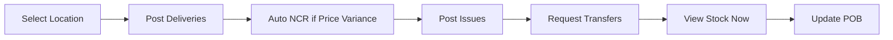
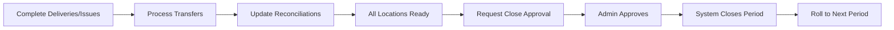
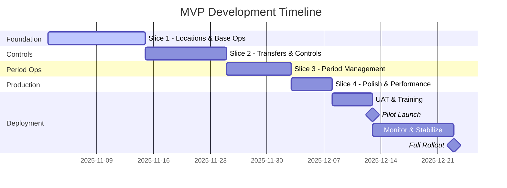

# MVP

# MVP - Multi-Location Food Stock System

**Last Updated:** November 2025

**Purpose:** Define the MVP scope for multi-location deployment with confirmed requirements

## 1) MVP Goals

### Core Objectives

✅ **Fast operations:** Post deliveries and issues quickly at any location

✅ **Accurate costing:** WAC maintained per location with automatic price variance detection

✅ **Multi-location support:** Manage multiple sites with transfers

✅ **Simple month-end:** Coordinated close across all locations with approval

✅ **Modern interface:** Clean, intuitive UI replacing legacy Excel

## 2) What’s Included (MVP Features)

### Location Management

- **Multiple locations** with types (Kitchen, Store, Central)
- **User-location assignment** for access control
- **Location switching** in UI
- **Location-specific operations**

### Core Stock Features

- **Dashboard** — Multi-location view with consolidation
- **POB** — Daily counts per location
- **Items & Prices** — Global master with period price lock
- **Deliveries & Invoices** — Location-specific with auto price variance NCR
- **Issues (Food/Clean)** — Post without approval
- **Transfers** — Move stock between locations (requires approval)
- **Stock Now** — Real-time valuation per location

### Control Features

- **NCR** — Manual + automatic price variance detection
- **Reconciliations** — Per location with consolidation
- **Period Close** — Coordinated close with Admin approval
- **Approvals** — PRF/PO and Period Close only

### Technical Features

- **Audit trail** — Complete tracking with location context
- **Role-based access** — Location-specific permissions
- **Real-time updates** — Live stock levels
- **Modern UI** — Nuxt UI components with Tailwind CSS
- **PWA** – Installable app with offline awareness
- **Type safety** – TypeScript + Prisma + Zod validation
- **Performance** – SPA with < 1s API responses

## 3) What’s NOT Included (Future Phases)

### Deferred Features

- Mobile native apps
- Full offline mode with local database
- Complex transfer routing
- Partial period closes
- Advanced forecasting
- Barcode scanning
- Supplier portal
- Email notifications (except critical)
- Multi-currency support
- FIFO costing option

## 4) MVP User Journeys

### Daily Operations Flow

### Month-End Flow

## 5) Acceptance Criteria

### Must Pass for Go-Live

✅ Users can switch between assigned locations

✅ Deliveries correctly update location WAC and stock

✅ Price variances auto-generate NCRs

✅ Issues prevented when exceeding location stock

✅ Transfers move stock at source WAC with approval

✅ Period prices remain fixed throughout period

✅ All locations close simultaneously with approval

✅ Audit trail captures all transactions with location

✅ Reports show location and consolidated views

✅ Performance meets SLAs (< 1s for transactions)

## 6) Development Slices - Updated for Multi-Location

### Slice 1: Foundation & Locations (12 days)

**Goal:** Multi-location infrastructure and base operations
- Location management and user assignment
- Items & Prices with period price setting
- Deliveries with automatic price variance NCR
- Issues with location stock validation
- Stock Now per location
- Basic dashboard

### Slice 2: Transfers & Controls (10 days)

**Goal:** Inter-location operations and controls
- Transfer creation and approval workflow
- NCR management (manual + auto)
- POB entry per location
- Reconciliations per location
- Consolidated views

### Slice 3: Period Management (8 days)

**Goal:** Complete period lifecycle
- Period close approval workflow
- Location readiness tracking
- Simultaneous close execution
- Snapshot and roll forward
- Reporting and exports

### Slice 4: Polish & Performance (5 days)

**Goal:** Production readiness
- UI/UX refinements
- Performance optimization
- Error handling
- Help documentation
- User training materials

## 7) Release Timeline

### Key Milestones

- **Development Start:** November 3, 2025
- **Development Complete:** December 15, 2025 (35 days)
- **UAT & Training:** December 16-20, 2025
- **Pilot Launch:** December 21, 2025 (2-3 locations)
- **Full Rollout:** January 2, 2026 (all locations)

## 8) Non-Functional Requirements (MVP)

### Performance

- Transaction posting < 1s per operation
- Location dashboard < 2s
- Consolidated reports < 5s
- Transfer approval < 1.5s

### Reliability

- 99% uptime during business hours
- Daily automated backups
- Transaction retry on failure
- Graceful error handling
- PWA offline awareness with clear messaging

### Security

- HTTPS everywhere
- JWT in httpOnly cookies via nuxt-auth-utils
- Role-based access control
- Complete audit logging
- Password complexity requirements

### Usability

- Modern, clean interface
- Keyboard navigation support
- Clear error messages
- Contextual help
- Print-friendly reports

## 9) Success Metrics

### Launch Criteria

- 2+ pilot locations operational
- 50+ transactions processed successfully
- Zero data loss incidents
- All acceptance criteria passed

### Success Indicators (30 days)

- Transaction time reduced by 50% vs Excel
- Month-end close < 2 hours for all locations
- Transfer accuracy > 99%
- User adoption > 85%
- Price variance NCRs < 10% of deliveries
- Support tickets < 5 per day

## 10) Risk Mitigation

### Technical Risks

| Risk | Impact | Mitigation |
| --- | --- | --- |
| Multi-location complexity | High | Start with 2-3 pilots |
| Data migration errors | High | No migration, fresh start |
| Performance at scale | Medium | Load testing, caching |
| Network issues | Medium | Retry logic, queuing |

### Business Risks

| Risk | Impact | Mitigation |
| --- | --- | --- |
| User resistance | High | Training, parallel run |
| Price variance overload | Medium | Bulk resolution tools |
| Transfer errors | Medium | Approval workflow |
| Period close delays | Low | Clear checklist, alerts |

## 11) Pilot Locations Selection

### Criteria for Pilot Sites

- Different location types (1 Kitchen, 1 Store)
- High transaction volume
- Experienced staff available
- Good network connectivity
- Management support

### Pilot Success Criteria

- Complete one full period
- All features utilized
- < 5% error rate
- Positive user feedback
- Accurate reconciliation

## 12) Training Plan

### User Training (per location)

- **Operators:** 30 minutes hands-on
- **Supervisors:** 45 minutes including approvals
- **Admins:** 60 minutes full system

### Materials

- Quick reference cards
- Video tutorials
- Practice environment
- FAQ document
- Support hotline

## 13) Go/No-Go Checklist

### Technical Readiness

- [ ]  All slices deployed
- [ ]  Performance SLAs met
- [ ]  Security scan passed
- [ ]  Backup/restore tested
- [ ]  Monitoring configured

### Business Readiness

- [ ]  Pilot locations selected
- [ ]  Users trained
- [ ]  Period prices set
- [ ]  Item master loaded
- [ ]  Support team ready

### Operational Readiness

- [ ]  Runbooks documented
- [ ]  Escalation process defined
- [ ]  Rollback plan ready
- [ ]  Communication sent
- [ ]  Executive sign-off

## 14) Post-MVP Roadmap

### Phase 2 (Q1 2026)

- Additional locations (up to 10)
- Email notifications
- Basic mobile views
- Excel import/export

### Phase 3 (Q2 2026)

- Full mobile apps
- Advanced reporting
- Predictive analytics
- Supplier integration

### Phase 4 (Q3 2026)

- Barcode scanning
- Full offline mode with local database
- Multi-currency
- API for third parties

---

**Remember:** This MVP delivers a complete multi-location stock control system with the core features needed for daily operations and month-end close. Focus is on reliability, usability, and accurate data management across all locations.