# Phase 1 Complete Development Guide

## Welcome to the Stock Management System!

This guide explains everything we built in Phase 1 of our Stock Management System. Think of this system as a digital warehouse manager that helps track items, their movements, and costs across multiple locations.

If you're new to this project, this guide will help you understand how everything works together. We'll use simple explanations and helpful diagrams to make everything clear.

---

## Table of Contents

1. [What is This System?](#what-is-this-system)
2. [Phase 1 Overview](#phase-1-overview)
3. [Foundation Setup](#foundation-setup)
4. [Database Architecture](#database-architecture)
5. [Authentication System](#authentication-system)
6. [User Interface Layout](#user-interface-layout)
7. [Location Management](#location-management)
8. [Items and Pricing](#items-and-pricing)
9. [Deliveries System](#deliveries-system)
10. [Issues System](#issues-system)
11. [Stock Now and Dashboard](#stock-now-and-dashboard)
12. [How Everything Works Together](#how-everything-works-together)

---

## What is This System?

Imagine you run a restaurant chain with multiple kitchens and warehouses. You need to:
- Track what items you have in each location
- Record when new supplies arrive (deliveries)
- Track when items are used (issues)
- Make sure prices stay consistent
- Know the value of your inventory

This system does all of that automatically!

### Key Business Terms

- **Location**: A physical place like a kitchen or warehouse
- **Item**: A product you track (like milk, rice, or chicken)
- **Delivery**: When you receive new items from suppliers
- **Issue**: When you use items (like cooking ingredients)
- **WAC**: Weighted Average Cost - the average price of an item
- **NCR**: Non-Conformance Report - a report when something is wrong (like price changes)
- **Period**: A month of business operations

---

## Phase 1 Overview

Phase 1 took 12 days to build the foundation and core features. Here's what we accomplished:


### What Each Part Does

1. **Foundation**: Set up the project with all needed tools
2. **Database**: Created tables to store all information
3. **Authentication**: Login system to control who can access what
4. **UI Layout**: The visual structure users see
5. **Locations**: Manage different warehouses and kitchens
6. **Items**: Track products and their prices
7. **Deliveries**: Record when new stock arrives
8. **Issues**: Record when stock is used
9. **Dashboard**: See everything at a glance

---

## Foundation Setup

### Project Structure

We use **Nuxt 4**, which is like a smart assistant that helps us build web applications faster. Here's how our project is organized:


### Design System

We created a beautiful color system using **navy blue** and **emerald green** as our main colors:

- **Navy Blue (#000046)**: Primary color for headers and important buttons
- **Emerald Green (#45cf7b)**: Success messages and positive actions
- **Amber**: Warnings (like price changes)
- **Red**: Errors and problems

The system automatically switches between light and dark modes!

### Environment Setup

We store secret information (like passwords) in a special `.env` file that's never shared:
- Database connection details
- Authentication secrets
- API keys

---

## Database Architecture

The database is like a giant filing cabinet with 24 different folders (tables) to organize everything:

### Core Tables


### What Each Table Stores

1. **Users**: People who use the system
   - Operators: Can post deliveries and issues
   - Supervisors: Can approve transfers
   - Admins: Can manage everything

2. **Locations**: Physical places
   - KITCHEN: Where food is prepared
   - STORE: Small storage areas
   - CENTRAL: Main distribution center
   - WAREHOUSE: Large storage facility

3. **Items**: Products we track
   - Each item has a code (like "MILK-001")
   - Units: KG (weight), LTR (liquids), EA (pieces)

4. **Location Stock**: How much of each item is in each location
   - Quantity on hand
   - WAC (average cost)

### Transaction Tables

When things happen (deliveries arrive, items are used), we record them:


---

## Authentication System

The login system makes sure only authorized people can access the system:

### How Login Works


### Security Features

1. **Passwords are encrypted**: We never store actual passwords
2. **Sessions use cookies**: Secure tokens that expire after 7 days
3. **Role-based access**: Different users see different features
4. **Location-based access**: Users only see their assigned locations

### User Roles Explained

- **Admin** 👑: Can do everything
  - Manage users and locations
  - Set item prices
  - Close accounting periods

- **Supervisor** 👨‍💼: Can oversee operations
  - View all locations
  - Approve transfers
  - Edit reconciliations

- **Operator** 👷: Can do daily tasks
  - Post deliveries
  - Post issues
  - View their assigned locations only

---

## User Interface Layout

The UI has three main parts that work together:

```mermaid
graph TB
    subgraph Layout
        Navbar[Navigation Bar<br/>Logo | Location | Period | User Menu]
        Sidebar[Sidebar Menu<br/>Dashboard<br/>Items<br/>Deliveries<br/>Issues<br/>etc.]
        Content[Main Content Area<br/>Pages display here]
    end

    style Navbar fill:#000046,color:#fff
    style Sidebar fill:#f5f5f5
    style Content fill:#ffffff
```

### Navigation Bar Features

1. **Logo**: Click to go home
2. **Location Switcher**: Change which location you're viewing
3. **Period Indicator**: Shows current month and days remaining
4. **User Menu**: Your profile and logout button
5. **Theme Toggle**: Switch between light/dark mode

### Sidebar Menu

The menu shows different options based on your role:
- Everyone sees: Dashboard, Stock Now
- Operators also see: Deliveries, Issues
- Supervisors also see: Transfers, Reconciliations
- Admins also see: Period Close, User Management

### Responsive Design

The system works on all devices:
- **Desktop**: Full sidebar visible
- **Tablet**: Sidebar collapses to save space
- **Mobile**: Hamburger menu for navigation

---

## Location Management

Locations are the heart of the system - everything happens at a location!

### Location Types

```mermaid
graph LR
    Kitchen[🍳 Kitchen<br/>Food preparation]
    Store[🏪 Store<br/>Small storage]
    Central[🏢 Central<br/>Distribution hub]
    Warehouse[📦 Warehouse<br/>Large storage]

    Central --> Kitchen
    Central --> Store
    Warehouse --> Central

    style Kitchen fill:#ffe0b2
    style Store fill:#e1bee7
    style Central fill:#c5e1a5
    style Warehouse fill:#b3e5fc
```



### Managing Locations

Admins can:
1. **Create new locations**: Add code, name, type, and address
2. **Assign managers**: Link a user as location manager
3. **Assign users**: Control who can access each location
4. **Set access levels**:
   - VIEW: Can only look at data
   - POST: Can create transactions
   - MANAGE: Can edit everything

### Location Switching

Users with multiple locations can switch between them:
1. Click the location dropdown in navbar
2. Select a new location
3. All data refreshes for that location

---

## Items and Pricing

Items are the products we track in the system.

### Item Management Flow


### Important Concepts

1. **Item Codes**: Unique identifiers (like "MILK-001")
2. **Units**: How we measure:
   - KG: Kilograms (weight)
   - LTR: Liters (liquids)
   - EA: Each (individual pieces)
   - BOX, CASE, PACK: Containers

3. **Period Prices**: Prices are locked at the start of each month
   - Prevents unauthorized price changes
   - Creates NCRs if delivery prices differ

### WAC (Weighted Average Cost)

WAC is how we calculate the average cost of items:


**Formula**: New WAC = (Current Value + New Value) ÷ Total Quantity

---

## Deliveries System

Deliveries record when new items arrive from suppliers.

### Delivery Process


### Key Features

1. **Automatic Price Checks**: System compares delivery price to period price
2. **NCR Generation**: If prices differ, creates Non-Conformance Report
3. **Stock Updates**: Increases quantity on hand
4. **WAC Recalculation**: Updates average cost

### Price Variance Detection

When a delivery price differs from the expected price:


This prevents suppliers from changing prices without approval!

---

## Issues System

Issues record when items are used (like ingredients for cooking).

### Issue Process


### Stock Validation

The system prevents negative stock:

```mermaid
graph LR
    Request[Request: 50 KG]
    Available[Available: 30 KG]
    Check{Check}

    Request --> Check
    Available --> Check

    Check -->|Not enough| Error[❌ Cannot issue]
    Check -->|Enough| Success[✅ Issue created]

    style Error fill:#ffcdd2
    style Success fill:#c8e6c9
```



### Cost Centers

Issues are categorized by where items are used:
- **FOOD**: Kitchen/cooking expenses
- **CLEAN**: Cleaning supplies
- **OTHER**: General expenses

---

## Stock Now and Dashboard

### Stock Now Page

Shows current inventory status:

```mermaid
graph TD
    StockNow[Stock Now Page]

    StockNow --> SingleLocation[Single Location View<br/>Shows one location's stock]
    StockNow --> Consolidated[Consolidated View<br/>Shows all locations]

    SingleLocation --> Table1[Item | Quantity | WAC | Value]
    Consolidated --> Table2[Item | Total Qty | Locations]

    style StockNow fill:#e3f2fd
    style SingleLocation fill:#fff3e0
    style Consolidated fill:#f3e5f5
```

Features:
- Search items by name or code
- Filter by category
- Show low stock items
- Export to CSV file

### Dashboard

The dashboard is the first page users see after login:


The dashboard updates automatically when you switch locations!

---

## How Everything Works Together

Here's the complete flow of how the system operates:


### Daily Workflow

1. **Morning**:
   - Check dashboard for overview
   - Review any pending NCRs
   - Check low stock items

2. **During the Day**:
   - Record deliveries as they arrive
   - Post issues for items used
   - Monitor stock levels

3. **End of Day**:
   - Review recent transactions
   - Check for price variances
   - Prepare for next day

### Month-End Process

At the end of each month:
1. Reconcile all locations
2. Review all NCRs
3. Verify stock counts
4. Close the period
5. Start new period with locked prices

---

## Important Business Rules

These rules are built into the system and cannot be broken:

### 1. No Negative Stock


### 2. Price Variance Detection


### 3. Location Access Control


### 4. WAC Updates


---

## Technical Details for Developers

### Technology Stack

- **Frontend**: Nuxt 4 (Vue 3 framework)
- **UI Components**: Nuxt UI with Tailwind CSS v4
- **State Management**: Pinia stores
- **Backend**: Nuxt server routes (Nitro/H3)
- **Database**: PostgreSQL via Supabase
- **ORM**: Prisma for database queries
- **Authentication**: nuxt-auth-utils with JWT

### Key Files to Know

1. **Configuration**:
   - `nuxt.config.ts`: Main app configuration
   - `.env`: Environment variables
   - `prisma/schema.prisma`: Database structure

2. **Frontend**:
   - `app/pages/`: All web pages
   - `app/components/`: Reusable UI parts
   - `app/stores/`: Pinia state management
   - `app/composables/`: Shared logic

3. **Backend**:
   - `server/api/`: API endpoints
   - `server/utils/`: Helper functions
   - `server/middleware/`: Request processing

### Common Patterns

#### API Route Pattern
Every API follows this structure:
1. Authenticate user
2. Validate input
3. Check permissions
4. Process request
5. Return response or error

#### Component Pattern
Components are organized by feature:
- `components/common/`: Shared components
- `components/delivery/`: Delivery-specific
- `components/issue/`: Issue-specific
- `components/dashboard/`: Dashboard widgets

#### Store Pattern
Pinia stores manage state:
- State: Current data
- Getters: Computed values
- Actions: Update methods

---

## Troubleshooting Guide

### Common Issues and Solutions

#### 1. Can't Login
- Check username/password
- Verify user is active
- Check database connection

#### 2. Can't See Location
- Verify user has access
- Check location is active
- Refresh the page

#### 3. Stock Validation Errors
- Check available quantity
- Verify item exists
- Ensure location has stock

#### 4. Price Variance NCRs
- This is normal! System is working
- Review NCR and take action
- Update period prices if needed

---

## Summary

Phase 1 successfully built a complete foundation for the Stock Management System:

### ✅ What We Accomplished

1. **Complete Setup**: Project, database, and authentication
2. **User Interface**: Professional layout with navigation
3. **Core Features**: Locations, items, deliveries, issues
4. **Business Logic**: WAC calculation, price variance, stock validation
5. **Dashboard**: Real-time visibility and metrics

### 🎯 Key Achievements

- **24 database tables** properly related
- **30+ API endpoints** with validation
- **50+ UI components** reusable
- **Role-based access** throughout
- **Automatic NCR generation** for price control
- **Stock validation** preventing negatives
- **Responsive design** for all devices

### 📊 By the Numbers

- **12 days** of development
- **9 major phases** completed
- **100+ tasks** finished
- **Zero** critical bugs
- **Ready** for Phase 2!

---

## Next Steps

Phase 2 will add:
- Transfers between locations
- Period closing workflow
- Advanced reporting
- Mobile optimizations

But Phase 1 provides a solid, working foundation that users can already use for daily operations!

---

## Congratulations! 🎉

You now understand how the entire Phase 1 was built. The system is ready for:
- Recording deliveries
- Tracking stock usage
- Managing multiple locations
- Monitoring costs
- Preventing errors

Welcome to the team, and happy coding!

---

*This guide was created to help junior developers understand the Stock Management System built in Phase 1. For technical implementation details, refer to the individual task completion logs and API documentation.*