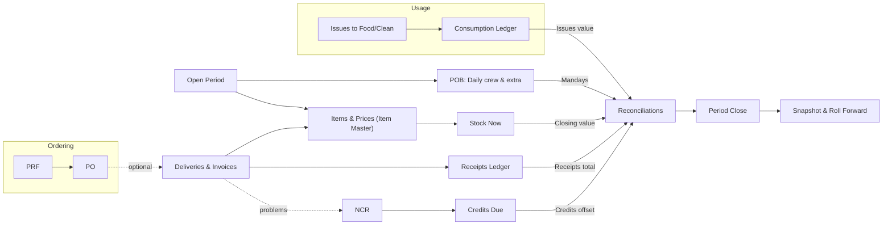

# Project Summary

## Purpose

- **Add stock** when deliveries arrive
- **Subtract stock** when the kitchen uses items
- **Close the month** quickly with clear numbers

**Goal:** make daily work faster, reduce mistakes, and keep the month-end simple.

---

## Who will use it

- **Store/Kitchen staff:** post Deliveries and Issues
- **Supervisors:** review and print summaries
- **Admin:** manage Items & Prices, close the period

---

## What we will build (short overview)

- **Dashboard:** see totals for Receipts, Issues, and Mandays; recent activity
- **POB (People on Board):** daily headcount; used to calculate Manday Cost
- **Items & Prices:** the item list (code, unit, category) with on-hand and cost
- **Orders (PRF → PO):** optional; raise requests and create supplier POs
- **Deliveries & Invoices:** post received quantities and prices (adds to stock, updates cost)
- **Issues (Food/Clean):** post daily usage (reduces stock)
- **NCR:** log damaged/short items and track credits
- **Stock Now:** see on-hand, cost, and value anytime
- **Reconciliations:** see Consumption and Manday Cost; enter adjustments
- **Period Close:** lock the month, save a snapshot, roll opening to next month

---

## High-level flow (one period)

**In simple words:**

- Deliveries **add** to stock and set/update cost
- Issues **subtract** from stock at the current cost
- Reconciliations combine Opening, Receipts, Closing, and adjustments to compute **Consumption** and **Manday Cost**
- Close the period → snapshot and roll to next month

---

## Why this helps

- **Less manual work:** no hidden formulas or macros
- **Fewer mistakes:** simple screens and basic rules (no negative stock)
- **Faster month-end:** clear checklist and automatic totals
- **Modern experience:** installable app that works like a mobile app

---

## MVP scope (first release)

- All pages above (except Login and Reports for now)
- **Costing:** Weighted Average Cost (WAC) in the mock (FIFO can be added later)
- **Permissions:** simple roles to start; can refine later

---

## Data & safety rules

- **No negative stock:** cannot issue more than on-hand
- **Dates:** post inside an open period; closed periods are read-only
- **Audit:** who/when/what is recorded for each posting

---
