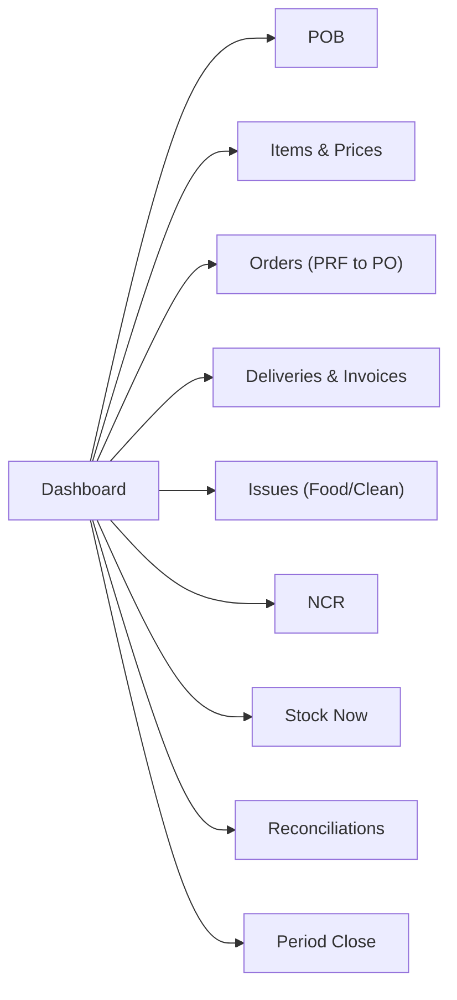
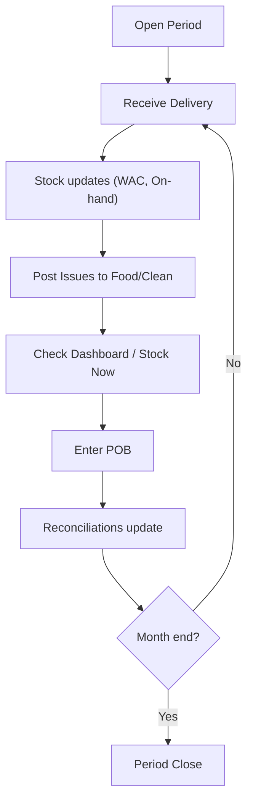

# Screen List & Wireframe (1)

**Purpose:** A detailed but simple guide to all screens we plan to build, with quick wireframes and how users move between them.

> Language kept simple. Mermaid used for maps and flows.
> 

---

## 1) App map (all screens)



---

## 2) Wireflow (how a typical day works)



---

## 3) Screen list with wireframes

### 3.1 Dashboard

**Goal:** quick monthly status.

**Key parts:** tiles (Receipts, Issues, Mandays, Days left), recent deliveries/issues.

**Wireframe (ASCII):**

```
[Receipts]  [Issues]  [Mandays]  [Days left]
--------------------------------------------
Recent Deliveries    |  Recent Issues
R-1007  SAR 3,960    |  I-3041  SAR 720
R-1006  SAR 1,280    |  I-3040  SAR 410
```

**Notes:** read-only. Links jump to detail screens.

---

### 3.2 POB (People on Board)

**Goal:** record daily headcount for manday cost.

**Wireframe:**

```
Date        Crew   Extra   Total
2025-10-20   60     12      72
2025-10-21   62     10      72
[Save]
```

**Validation:** numbers only.

---

### 3.3 Items & Prices (Item Master)

**Goal:** manage item list; view on‑hand & cost.

**Wireframe:**

```
Code      Name                 Unit  Cat   WAC    On‑hand
RICE-5KG  Rice 5kg             KG    DRY   6.40   120
CHK-1KG   Chicken Breast 1kg   KG    CHILL 18.90  55
[Add item]
```

**Rules:** WAC & On‑hand update via Deliveries/Issues; Admin edits the rest.

---

### 3.4 Orders (PRF → PO)  *optional in MVP*

**Goal:** request → approve → create PO.

**Wireframe:**

```
PRF Lines
Item                Qty
Rice 5kg            10
[Add line]  [Approve]  [Create PO]
```

**Status:** PRF Draft → Approved → PO Created.

---

### 3.5 Deliveries & Invoices

**Goal:** add stock + record invoice.

**Wireframe:**

```
Supplier [FreshCo]  PO [ — ]  Invoice [INV-001]  Note [DN-13]  Date [2025‑10‑21]

Item                Price    Qty     Line Value
Rice 5kg            6.40     10      64.00
Chicken 1kg         18.90    5       94.50
---------------------------------------------
Total: 158.50                [Add line]   [Post delivery]
```

**On post:** on‑hand ↑; WAC recalculated; receipt saved.

---

### 3.6 Issues (Food/Clean)

**Goal:** record daily usage.

**Wireframe:**

```
Date [2025‑10‑21]  Cost centre [FOOD]

Item                On‑hand   Qty to issue   Value
Rice 5kg            120       5              32.00
-----------------------------------------------
[Add line]                     [Post Issue]
```

**Rule:** no negative stock.

---

### 3.7 NCR (Non‑Conformance Report)

**Goal:** log damaged/short items and track credit.

**Wireframe:**

```
Receipt [R-1007]  Line # [0]  Reason [Damaged]  Qty [1]  Value [18.90]
[Create NCR]

NCRs
NCR-101  Damaged  Credited  SAR 18.90
```

---

### 3.8 Stock Now

**Goal:** live valuation.

**Wireframe:**

```
Item                Unit   On‑hand  WAC     Value
Rice 5kg            KG     120      6.40    768.00
Chicken 1kg         KG     55       18.90   1,039.50
-----------------------------------------------
Total valuation: SAR 1,807.50
```

---

### 3.9 Reconciliations

**Goal:** compute Consumption and Manday cost.

**Wireframe:**

```
Back-charges [   ]   Condemnations [   ]   Credits Due [   ]   Others [   ]
Closing stock value [   ]

Consumption: SAR  XX,XXX      Manday cost: SAR  XX.XX
[Save]
```

**Formula:** Opening + Receipts − Closing + Back-charges − Credits + Others − Condemnations.

---

### 3.10 Period Close

**Goal:** lock period; snapshot; roll forward.

**Wireframe:**

```
[ ] All deliveries are posted
[ ] All issues are posted
[ ] Reconciliations completed

[ Close Period ]
```

---

## 4) Navigation patterns (micro)

- Keep actions clear: **Post delivery**, **Post Issue**, **Close Period**.
- Show totals near the action buttons.
- Use table inputs with sensible widths; show validation inline.

---

## 5) Components library (lightweight)

### Brand Colors

**Primary - Navy Blue (#000046):**
- Used for: Primary buttons, headings, important text, brand elements
- Shades: Available from `navy-50` to `navy-950`

**Secondary - Emerald Green (#45cf7b):**
- Used for: Success states, secondary actions, accents, positive feedback
- Shades: Available from `emerald-50` to `emerald-950`

### Component Styles

- **Card**: white box with title and short content; navy headings (`text-navy-500`)
- **Pill**: small rounded label (e.g., "R-1007"); emerald for success states (`bg-emerald-400`)
- **Input**: consistent height; numeric right‑aligned; navy focus border (`focus:border-navy-500`)
- **Primary button**: navy filled (`bg-navy-500`); white text; hover state (`hover:bg-navy-600`)
- **Secondary button**: emerald bordered (`border-emerald-400`); emerald text (`text-emerald-600`)
- **Success indicators**: emerald background (`bg-emerald-400`) with white text
- **Status badges**: Navy for active/pending, emerald for completed/approved

**Usage Rules:**
- Always use Tailwind color tokens (e.g., `text-navy-500`, `bg-emerald-400`)
- Never use inline styles with hex colors
- Support dark mode using `dark:` variant (e.g., `dark:text-navy-400`)

---

## 6) Accessibility & simplicity

- Clear labels; no jargon (Food, Clean, Delivery, Issue).
- Keyboard friendly (tab between fields).
- Error messages in plain words (e.g., "Qty exceeds on‑hand").

---

## 7) Open items (to confirm)

- Exact wording on tiles and buttons (EN/AR if needed).
- Whether Orders (PRF→PO) is visible in MVP nav.
- Print layout style (legacy vs modern).