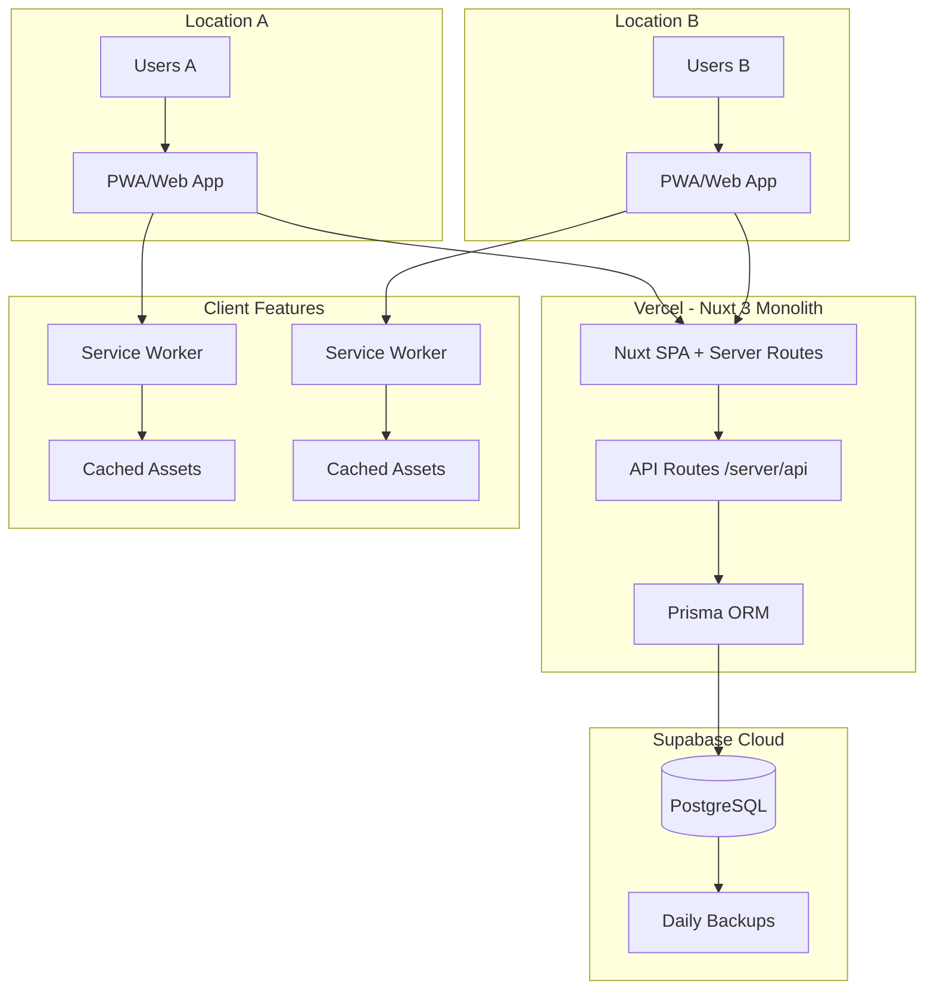
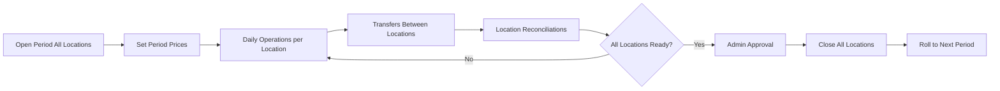
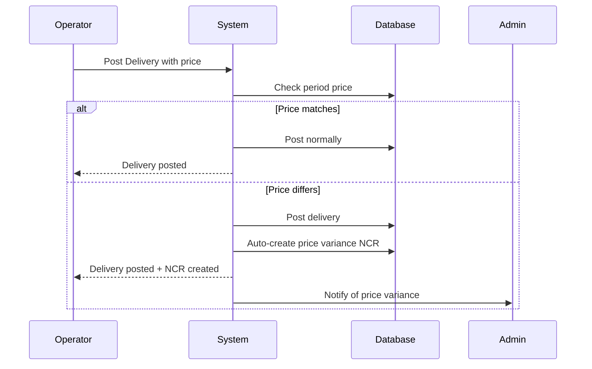
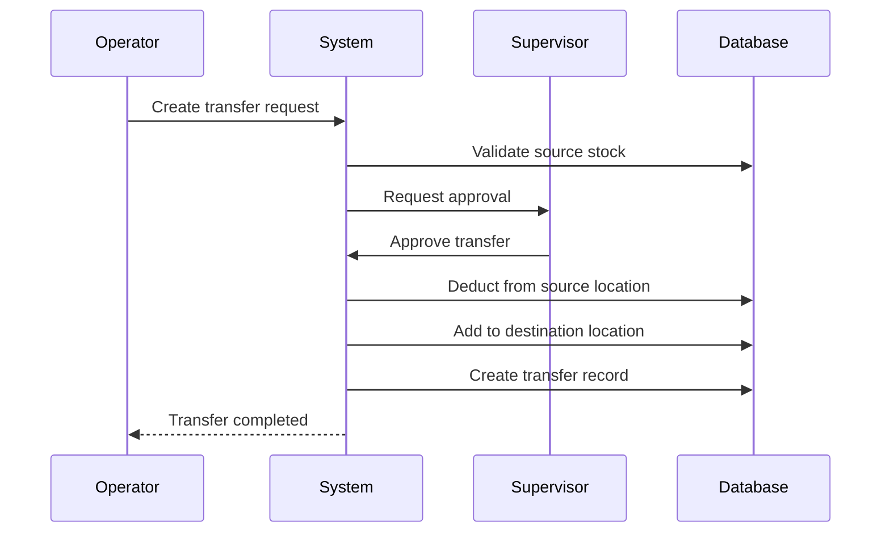
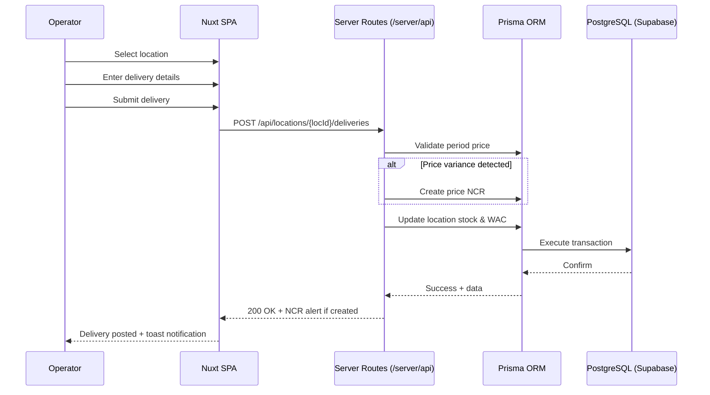
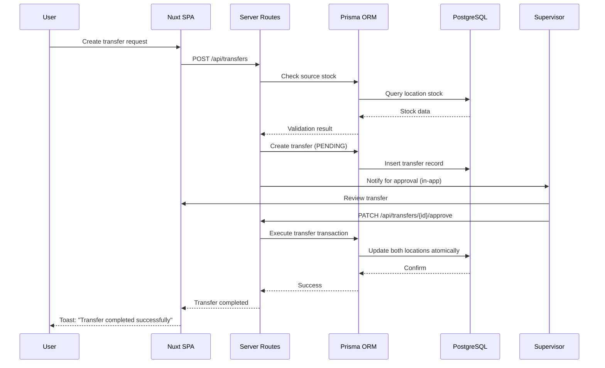
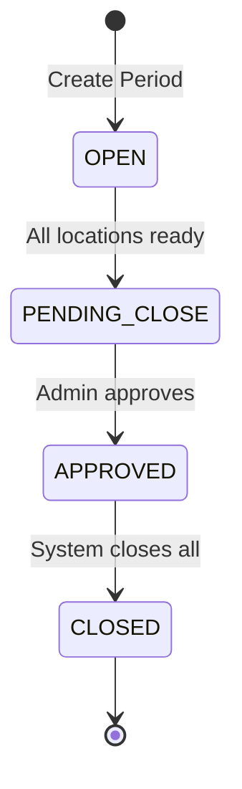
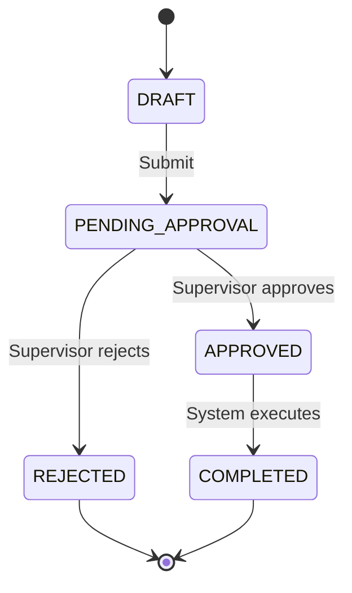
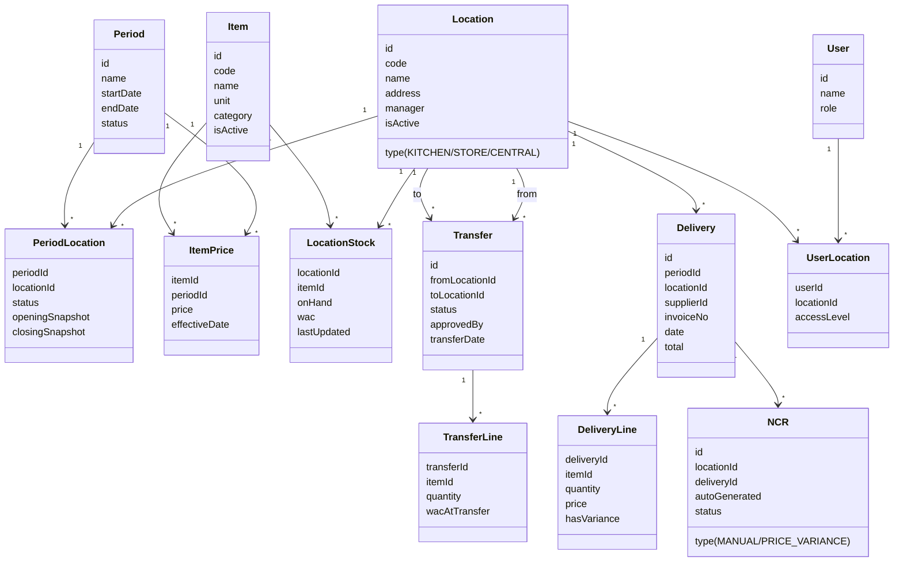
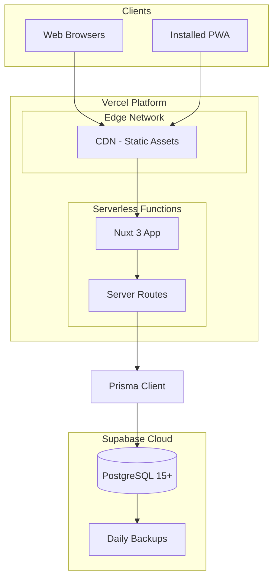

# System_Design

# System Design - Multi-Location Architecture

**Last Updated:** November 2025

**Status:** Updated with confirmed requirements

## 0) Document Purpose

This document explains how the multi-location stock management system will work: its architecture, user flows, data model, interfaces, and rules.

## 1) Summary

A web application managing stock across **multiple locations**. Core operations include deliveries, issues, transfers between locations, and coordinated month-end close.

### Main Goals

- Fast daily operations across all locations
- Inter-location stock transfers with approval
- Automatic price variance detection via NCR
- Simple multi-location month-end close
- Location-based access control

### Key Decisions Confirmed

- ✅ **Multiple locations** with transfers
- ✅ **WAC** costing method
- ✅ **Fixed prices per period** (auto-NCR on variance)
- ✅ **Modern UI** format
- ✅ **Approvals:** PRF/PO and Period Close only

## 2) Actors & Roles

| Role           | Main Actions                                                  | Location Scope          |
| -------------- | ------------------------------------------------------------- | ----------------------- |
| **Operator**   | Post Deliveries & Issues; view Stock Now                      | Assigned locations only |
| **Supervisor** | Approve PRFs & Transfers; manage Reconciliations              | All locations           |
| **Admin**      | Manage Items & Prices; Approve Period Close; configure system | All locations           |
| **System**     | Auto-generate price variance NCRs; enforce rules              | All locations           |

## 3) System Context - Multi-Location Architecture



## 4) Core Workflows

### 4.1 Multi-Location Period Flow



### 4.2 Price Variance Workflow (NEW)



### 4.3 Transfer Workflow (NEW)



## 5) Detailed User Flows

### 5.1 Location-Specific Delivery



### 5.2 Inter-Location Transfer



## 6) State Machines

### 6.1 Period State (Multi-Location)



### 6.2 Transfer State



## 7) Data Model (Multi-Location ERD)



## 8) Key Calculations

### 8.1 Location-Specific WAC

```
newWAC = (currentQty * currentWAC + receivedQty * receiptPrice) / (currentQty + receivedQty)
```

### 8.2 Transfer Pricing

```
Transfer value = quantity * sourceLocation.WAC
Destination receives at: sourceLocation.WAC
```

### 8.3 Price Variance

```
If deliveryPrice != periodPrice:
    Create NCR with variance = quantity * (deliveryPrice - periodPrice)
```

### 8.4 Multi-Location Consumption

```
Location Consumption = Opening + Receipts + Transfers In - Closing - Transfers Out ± Adjustments
Total Consumption = Sum(All Location Consumptions)
```

## 9) API Design (Nuxt Server Routes)

### Base Endpoints

```
# Locations
GET    /api/locations
GET    /api/locations/{id}
POST   /api/locations
PATCH  /api/locations/{id}
```

### Location-Scoped Operations

```
# Stock queries
GET    /api/locations/{locId}/stock
GET    /api/locations/{locId}/deliveries
POST   /api/locations/{locId}/deliveries
GET    /api/locations/{locId}/issues
POST   /api/locations/{locId}/issues
```

### Transfer Endpoints

```
GET    /api/transfers
POST   /api/transfers
GET    /api/transfers/{id}
PATCH  /api/transfers/{id}/approve
PATCH  /api/transfers/{id}/reject
```

### Period Management

```
POST   /api/periods/{id}/close        # Requires approval
GET    /api/periods/{id}/locations    # Status per location
```

### Price Management

```
GET    /api/periods/{id}/prices
POST   /api/periods/{id}/prices       # Bulk set
PATCH  /api/items/{id}/period-price
```

**Implementation Notes:**

- All routes in `/server/api/` directory
- Use Nuxt's `defineEventHandler` for route handlers
- Prisma for all database operations
- Zod for request validation
- Return H3 response with proper status codes

## 10) Non-Functional Requirements (Updated)

### Performance

- Single location operations < 1s
- Cross-location queries < 2s
- Transfer execution < 1.5s
- Consolidated reports < 5s for 50 locations

### Scalability

- Support 50+ locations
- 1000+ items per location
- 100+ concurrent users
- 10,000+ transactions per day

### Security

- Location-based access control
- Transfer approval workflow
- Full audit trail with location context
- HTTPS everywhere
- JWT with location claims

## 11) Deployment Architecture



### Technology Stack (Finalized)

**Frontend:**

- Nuxt 3 (SPA mode, `ssr: false`)
- Nuxt UI (component library)
- Tailwind CSS (styling)
- Pinia (state management)
- Day.js (date/time)
- Zod (validation)

**Backend:**

- Nuxt Server Routes (Nitro/H3)
- Prisma ORM
- PostgreSQL 15+ (Supabase)

**PWA:**

- @vite-pwa/nuxt
- Service Worker (auto-generated)
- Offline-aware UI

**Hosting:**

- Vercel (free tier)
- Supabase (free tier)
- Single monolithic deployment

**Authentication:**

- nuxt-auth-utils
- JWT in httpOnly cookies
- Nuxt middleware for route protection

## 12) Testing Strategy

### Unit Tests (Vitest)

- WAC calculations per location
- Transfer calculations
- Price variance detection
- Multi-location reconciliation
- Validation functions

**Location:** `/tests/unit/`

### API Tests (Vitest + h3)

- Cross-location transfers
- Period close across locations
- Location access control
- Price variance NCR generation
- Critical server routes

**Location:** `/tests/api/`

### Component Tests (Optional for MVP)

- Form validation
- Data table rendering
- Modal interactions

### Manual Testing

- End-to-end flows
- PWA installation
- Offline behavior
- Multi-location scenarios

### Performance Tests (Post-MVP)

- 50 location concurrent operations
- 1000 transfers per hour
- Report generation under load
- Page load times

## 13) Migration & Rollout

### Phase 1: Foundation (Week 1-2)

- Initialize Nuxt 3 project with PWA
- Setup Prisma schema and migrations
- Configure Vercel + Supabase connection
- Implement authentication with nuxt-auth-utils
- Create base layout and navigation
- Deploy to Vercel preview

### Phase 2: Pilot (Week 3-6)

- Deploy to 2-3 pilot locations
- Import item master & period prices
- Train pilot users (45-minute sessions)
- Run complete period at pilot locations
- Test transfers between locations
- Validate price variance detection
- Gather feedback via in-app surveys

### Phase 3: Rollout (Week 7-10)

- Deploy to remaining locations in batches
- Location-specific training sessions
- Monitor performance and errors
- Iterate based on feedback
- No parallel Excel run (fresh start)

### Phase 4: Optimization (Week 11-12)

- Performance tuning based on usage
- UI/UX refinements
- Report optimization
- Process improvements
- Documentation updates

### Deployment Process

```bash
# Development
git push origin feature/my-feature
# â†' Auto-creates Vercel preview deployment

# Production
git push origin main
# â†' Auto-deploys to production

# Database migrations
pnpm db:push  # Development
# Production migrations via Prisma Migrate
```

## 14) Security Considerations

### Location-Based Access (Nuxt Middleware)

```typescript
// server/middleware/auth.ts
export default defineEventHandler(async (event) => {
  const session = await getUserSession(event);

  if (!session.user) {
    throw createError({
      statusCode: 401,
      message: "Unauthorized",
    });
  }

  // Attach user to event context
  event.context.user = session.user;
});

// server/middleware/location-access.ts
export default defineEventHandler(async (event) => {
  const locationId = getRouterParam(event, "locationId");
  const user = event.context.user;

  if (!hasLocationAccess(user, locationId)) {
    throw createError({
      statusCode: 403,
      message: "Location access denied",
    });
  }
});
```

### Transfer Approval

- Only supervisors can approve transfers
- Operators can only create transfer requests
- Full audit trail of approvals via Prisma

### Price Protection

- Prices locked at period start
- Only Admin can set period prices
- Automatic variance detection prevents unauthorized price changes

### Additional Security

- HTTPS enforced by Vercel
- JWT tokens in httpOnly cookies
- CSRF protection via Nuxt
- Rate limiting at API level (60 req/min)
- Input validation via Zod on all endpoints
- SQL injection prevention via Prisma

## 15) Monitoring & Alerts

### Built-in Monitoring (Vercel)

- Function invocation logs
- Error tracking
- Performance metrics
- Build status
- Deployment history

### Database Monitoring (Supabase)

- Query performance
- Connection pool usage
- Database size
- Backup status

### Key Metrics to Track

- Transactions per location per hour
- Transfer approval SLA (< 2 hours)
- Price variance rate by supplier
- Stock discrepancy alerts
- API response times
- PWA installation rate
- Offline/online transitions

### Alerting (Post-MVP)

- Price variance > 10%
- Negative stock attempted
- Transfer pending > 4 hours
- Period close deadline approaching
- Database approaching size limit

### Future Monitoring Tools

- Sentry for error tracking
- LogRocket for session replay
- Custom analytics dashboard

## 16) Future Enhancements (Post-MVP)

### PWA Level 2 Features

- Background sync for queued offline requests
- Push notifications for period reminders
- Web Share API for report exports
- Install prompts optimization

### PWA Level 3 Features

- Full offline mode with IndexedDB
- Conflict resolution for offline edits
- Local-first architecture
- Bidirectional sync engine

### Additional Features

- Advanced reporting with charts
- Predictive stock requirements
- Automated transfer suggestions
- Multi-currency support
- Advanced routing for transfers
- Barcode scanning (via camera API)
- Excel/PDF export
- Supplier portal integration
- Mobile-optimized views

---
