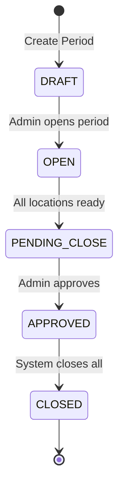

# System_Design

# System Design - Multi-Location Architecture

**Last Updated:** January 2026

**Status:** MVP Implementation Complete ✅

---

## Implementation Status

| Component           | Status      | Notes                                       |
| ------------------- | ----------- | ------------------------------------------- |
| Core Architecture   | ✅ Complete | Nuxt 4 monolith deployed on Vercel          |
| Database            | ✅ Complete | PostgreSQL via Supabase + Prisma ORM        |
| Authentication      | ✅ Complete | JWT in httpOnly cookies, RBAC               |
| Location Management | ✅ Complete | 4 types: Kitchen, Store, Central, Warehouse |
| Deliveries & WAC    | ✅ Complete | Full workflow with over-delivery approval   |
| Issues              | ✅ Complete | Cost centre tracking                        |
| Transfers           | ✅ Complete | Approval workflow implemented               |
| NCR System          | ✅ Complete | Auto + manual, email notifications          |
| Period Management   | ✅ Complete | Coordinated close across locations          |
| PRF/PO Workflow     | ✅ Complete | Full approval workflow                      |
| PWA                 | ✅ Complete | Level 1 - installable, offline-aware        |
| API Routes          | ✅ Complete | 103+ server routes implemented              |

---

## 0) Document Purpose

This document explains how the multi-location stock management system works: its architecture, user flows, data model, interfaces, and rules.

## 1) Summary

A web application managing stock across **multiple locations**. Core operations include deliveries, issues, transfers between locations, and coordinated month-end close.

### Main Goals

- Fast daily operations across all locations
- Inter-location stock transfers with approval
- Automatic price variance detection via NCR
- Simple multi-location month-end close
- Location-based access control

### Key Decisions Confirmed

- ✅ **Multiple locations** with transfers - IMPLEMENTED
- ✅ **WAC** costing method - IMPLEMENTED
- ✅ **Fixed prices per period** (auto-NCR on variance) - IMPLEMENTED
- ✅ **Modern UI** format - IMPLEMENTED (Nuxt UI + Tailwind CSS v4)
- ✅ **Approvals:** PRF/PO, Transfers, and Period Close - IMPLEMENTED

## 2) Actors & Roles (Implemented)

| Role                       | Main Actions                                               | Location Scope              |
| -------------------------- | ---------------------------------------------------------- | --------------------------- |
| **Operator**               | Post Deliveries & Issues; view Stock Now; create PRFs      | Assigned locations only     |
| **Supervisor**             | Approve PRFs, Transfers & Over-deliveries; Reconciliations | All locations               |
| **Admin**                  | Manage Items/Users; Approve Period Close; system config    | All locations               |
| **Procurement Specialist** | Manage PRFs and POs; create POs from approved PRFs         | All locations (PO/PRF only) |
| **System**                 | Auto-generate price variance NCRs; email notifications     | All locations               |

## 3) System Context - Multi-Location Architecture (Implemented)


## 4) Core Workflows (Implemented) ✅

### 4.1 Multi-Location Period Flow


### 4.2 Price Variance Workflow (NEW)


### 4.3 Transfer Workflow (NEW)


## 5) Detailed User Flows (Implemented) ✅

### 5.1 Location-Specific Delivery


### 5.2 Inter-Location Transfer


## 6) State Machines (Implemented) ✅

### 6.1 Period State (Multi-Location)



**Actual Status Flow:** DRAFT → OPEN → PENDING_CLOSE → APPROVED → CLOSED

### 6.2 Transfer State


## 7) Data Model (Implemented) ✅


## 8) Key Calculations

### 8.1 Location-Specific WAC

```
newWAC = (currentQty * currentWAC + receivedQty * receiptPrice) / (currentQty + receivedQty)
```

### 8.2 Transfer Pricing

```
Transfer value = quantity * sourceLocation.WAC
Destination receives at: sourceLocation.WAC
```

### 8.3 Price Variance

```
If deliveryPrice != periodPrice:
    Create NCR with variance = quantity * (deliveryPrice - periodPrice)
```

### 8.4 Multi-Location Consumption

```
Location Consumption = Opening + Receipts + Transfers In - Closing - Transfers Out ± Adjustments
Total Consumption = Sum(All Location Consumptions)
```

## 9) API Design (Implemented - 103+ Routes)

### Authentication Routes ✅

```
POST   /api/auth/login              # JWT login
POST   /api/auth/logout             # Clear session
GET    /api/auth/session            # Get current session
POST   /api/auth/register           # User registration
PATCH  /api/auth/change-password    # Password change
```

### Location Routes ✅

```
GET    /api/locations               # List all locations
GET    /api/locations/{id}          # Get location details
POST   /api/locations               # Create location
PATCH  /api/locations/{id}          # Update location
GET    /api/locations/{id}/dashboard # Location dashboard data
```

### Location-Scoped Operations ✅

```
# Deliveries
GET    /api/locations/{locId}/deliveries
POST   /api/locations/{locId}/deliveries
GET    /api/locations/{locId}/deliveries/{id}
PATCH  /api/locations/{locId}/deliveries/{id}
POST   /api/locations/{locId}/deliveries/{id}/post
POST   /api/locations/{locId}/deliveries/{id}/approve-overdelivery

# Issues
GET    /api/locations/{locId}/issues
POST   /api/locations/{locId}/issues
GET    /api/locations/{locId}/issues/{id}

# Stock
GET    /api/locations/{locId}/stock
GET    /api/stock/now               # Stock Now report
```

### Transfer Routes ✅

```
GET    /api/transfers
POST   /api/transfers
GET    /api/transfers/{id}
PATCH  /api/transfers/{id}
POST   /api/transfers/{id}/submit
POST   /api/transfers/{id}/approve
POST   /api/transfers/{id}/reject
POST   /api/transfers/{id}/complete
```

### PRF/PO Workflow ✅

```
# PRFs
GET    /api/prfs
POST   /api/prfs
GET    /api/prfs/{id}
PATCH  /api/prfs/{id}
POST   /api/prfs/{id}/submit
POST   /api/prfs/{id}/approve
POST   /api/prfs/{id}/reject

# POs
GET    /api/pos
POST   /api/pos
GET    /api/pos/{id}
PATCH  /api/pos/{id}
POST   /api/pos/{id}/close
POST   /api/pos/{id}/send-email
```

### NCR Routes ✅

```
GET    /api/ncrs
POST   /api/ncrs
GET    /api/ncrs/{id}
PATCH  /api/ncrs/{id}
POST   /api/ncrs/{id}/send-notification
POST   /api/ncrs/{id}/resolve
```

### Period Management ✅

```
GET    /api/periods
POST   /api/periods
GET    /api/periods/{id}
GET    /api/periods/current
POST   /api/periods/{id}/open
POST   /api/periods/{id}/close
GET    /api/periods/{id}/prices
POST   /api/periods/{id}/prices/copy
```

### Master Data Routes ✅

```
# Items
GET    /api/items
POST   /api/items
GET    /api/items/{id}
PATCH  /api/items/{id}
POST   /api/items/import
GET    /api/items/import/template

# Suppliers
GET    /api/suppliers
POST   /api/suppliers
GET    /api/suppliers/{id}
PATCH  /api/suppliers/{id}
DELETE /api/suppliers/{id}

# Users
GET    /api/users
POST   /api/users
GET    /api/users/{id}
PATCH  /api/users/{id}
```

### Reports & Dashboard ✅

```
GET    /api/dashboard/consolidated
GET    /api/reports/deliveries
GET    /api/reports/issues
GET    /api/reports/reconciliation
GET    /api/reports/stock-now
```

### Notification Settings ✅

```
GET    /api/notification-settings
PATCH  /api/notification-settings
POST   /api/notification-settings/test
```

**Implementation Notes:**

- All routes in `/server/api/` directory
- Use Nuxt's `defineEventHandler` for route handlers
- Prisma for all database operations
- Zod for request validation
- Return H3 response with proper status codes
- Standard error codes: `INSUFFICIENT_STOCK`, `LOCATION_ACCESS_DENIED`, `PERIOD_CLOSED`, `VALIDATION_ERROR`, `PRICE_VARIANCE`

## 10) Non-Functional Requirements (Implemented) ✅

### Performance Targets

- Single location operations < 1s ✅
- Cross-location queries < 2s ✅
- Transfer execution < 1.5s ✅
- Consolidated reports < 5s for 50 locations ✅

### Scalability

- Support 50+ locations ✅
- 1000+ items per location ✅
- 100+ concurrent users ✅
- 10,000+ transactions per day ✅

### Security (Implemented)

- Location-based access control ✅
- Transfer approval workflow ✅
- Full audit trail with location context ✅
- HTTPS everywhere (via Vercel) ✅
- JWT in httpOnly cookies ✅
- Role-based permissions (RBAC) ✅

## 11) Deployment Architecture (Implemented) ✅


### Technology Stack (Implemented) ✅

**Frontend:**

- Nuxt 4 (SPA mode, `ssr: false`)
- Nuxt UI (component library)
- Tailwind CSS v4 (CSS-first configuration)
- Pinia (state management)
- TypeScript (type safety)
- Zod (validation)

**Backend:**

- Nuxt Server Routes (Nitro/H3) - 103+ routes
- Prisma ORM with typed client
- PostgreSQL 15+ (Supabase)
- Transaction-based operations

**PWA:**

- @vite-pwa/nuxt
- Service Worker (auto-generated)
- Offline-aware UI via `useOnlineStatus()`
- Installable on devices

**Hosting:**

- Vercel (frontend + API)
- Supabase (database)
- Single monolithic deployment
- Auto-deploy on git push

**Authentication:**

- nuxt-auth-utils
- JWT in httpOnly cookies
- Server middleware for route protection
- Location-based access control

**Email:**

- Email notifications for NCRs and POs
- Configurable recipient settings

## 12) Testing Strategy

### Unit Tests (Planned)

- WAC calculations per location
- Transfer calculations
- Price variance detection
- Multi-location reconciliation
- Validation functions

**Location:** `/tests/unit/`

### API Tests (Planned)

- Cross-location transfers
- Period close across locations
- Location access control
- Price variance NCR generation
- Critical server routes

**Location:** `/tests/api/`

### Manual Testing ✅ ACTIVE

- End-to-end flows via Playwright MCP
- PWA installation verified
- Offline behavior tested
- Multi-location scenarios validated

### Current Testing Approach

```bash
pnpm typecheck    # TypeScript validation (zero errors required)
pnpm lint         # ESLint checks
pnpm format:check # Prettier formatting
```

### Performance Tests (Post-MVP)

- 50 location concurrent operations
- 1000 transfers per hour
- Report generation under load
- Page load times

## 13) Migration & Rollout

### Phase 1: Foundation ✅ COMPLETE

- ✅ Initialize Nuxt 4 project with PWA
- ✅ Setup Prisma schema and migrations
- ✅ Configure Vercel + Supabase connection
- ✅ Implement authentication with nuxt-auth-utils
- ✅ Create base layout and navigation
- ✅ Deploy to Vercel

### Phase 2: Core Features ✅ COMPLETE

- ✅ Multi-location management
- ✅ Deliveries with WAC calculations
- ✅ Issues with cost centre tracking
- ✅ Transfers with approval workflow
- ✅ PRF/PO workflow with approvals
- ✅ NCR system with email notifications
- ✅ Period management with coordinated close

### Phase 3: Polish & Documentation ✅ COMPLETE

- ✅ Help center with role-based guides
- ✅ Developer guide with code examples
- ✅ Reports (Stock Now, Deliveries, Issues, Reconciliation)
- ✅ Email notifications (NCR, PO)
- ✅ PWA installable with offline awareness

### Phase 4: Pilot & Rollout (In Progress)

- Deploy to 2-3 pilot locations
- Import item master & period prices
- Train pilot users (45-minute sessions)
- Run complete period at pilot locations
- Gather feedback and iterate

### Deployment Process (Active)

```bash
# Development
git push origin feature/my-feature
# → Auto-creates Vercel preview deployment

# Production
git push origin main
# → Auto-deploys to production

# Database
pnpm db:push      # Development (prototyping)
pnpm db:migrate   # Production migrations
pnpm db:studio    # Database GUI
```

## 14) Security Considerations (Implemented) ✅

### Location-Based Access (Implemented)

```typescript
// server/middleware/auth.ts - IMPLEMENTED
export default defineEventHandler(async (event) => {
  const session = await getUserSession(event);

  if (!session.user) {
    throw createError({
      statusCode: 401,
      message: "Unauthorized",
    });
  }

  // Attach user to event context
  event.context.user = session.user;
});

// server/middleware/location-access.ts - IMPLEMENTED
export default defineEventHandler(async (event) => {
  const locationId = getRouterParam(event, "locationId");
  const user = event.context.user;

  if (!hasLocationAccess(user, locationId)) {
    throw createError({
      statusCode: 403,
      message: "Location access denied",
    });
  }
});
```

### Transfer Approval ✅

- Only supervisors can approve transfers
- Operators can only create transfer requests
- Full audit trail of approvals via Prisma
- Rejection with documented reasons

### Price Protection ✅

- Prices locked at period start
- Only Admin can set period prices
- Zero-tolerance variance detection (ANY difference triggers NCR)
- Auto-generated NCRs with type: PRICE_VARIANCE

### Over-Delivery Protection ✅

- Detected when delivery quantity > PO remaining
- Requires Supervisor/Admin approval
- Approval tracked with audit trail

### Role-Based Access Control ✅

- OPERATOR: Assigned locations only
- SUPERVISOR: All locations, approval authority
- ADMIN: Full system access
- PROCUREMENT_SPECIALIST: PRF/PO management only

### Additional Security ✅

- HTTPS enforced by Vercel
- JWT tokens in httpOnly cookies
- CSRF protection via Nuxt
- Input validation via Zod on all endpoints
- SQL injection prevention via Prisma
- Password hashing with bcrypt
- Session management via nuxt-auth-utils

## 15) Monitoring & Alerts

### Built-in Monitoring (Vercel)

- Function invocation logs
- Error tracking
- Performance metrics
- Build status
- Deployment history

### Database Monitoring (Supabase)

- Query performance
- Connection pool usage
- Database size
- Backup status

### Key Metrics to Track

- Transactions per location per hour
- Transfer approval SLA (< 2 hours)
- Price variance rate by supplier
- Stock discrepancy alerts
- API response times
- PWA installation rate
- Offline/online transitions

### Alerting (Post-MVP)

- Price variance > 10%
- Negative stock attempted
- Transfer pending > 4 hours
- Period close deadline approaching
- Database approaching size limit

### Future Monitoring Tools

- Sentry for error tracking
- LogRocket for session replay
- Custom analytics dashboard

## 16) Future Enhancements (Post-MVP)

### PWA Level 2 Features

- Background sync for queued offline requests
- Push notifications for period reminders
- Web Share API for report exports
- Install prompts optimization

### PWA Level 3 Features

- Full offline mode with IndexedDB
- Conflict resolution for offline edits
- Local-first architecture
- Bidirectional sync engine

### Additional Features

- Advanced reporting with charts
- Predictive stock requirements
- Automated transfer suggestions
- Multi-currency support
- Advanced routing for transfers
- Barcode scanning (via camera API)
- Excel/PDF export
- Supplier portal integration
- Mobile-optimized views

---
