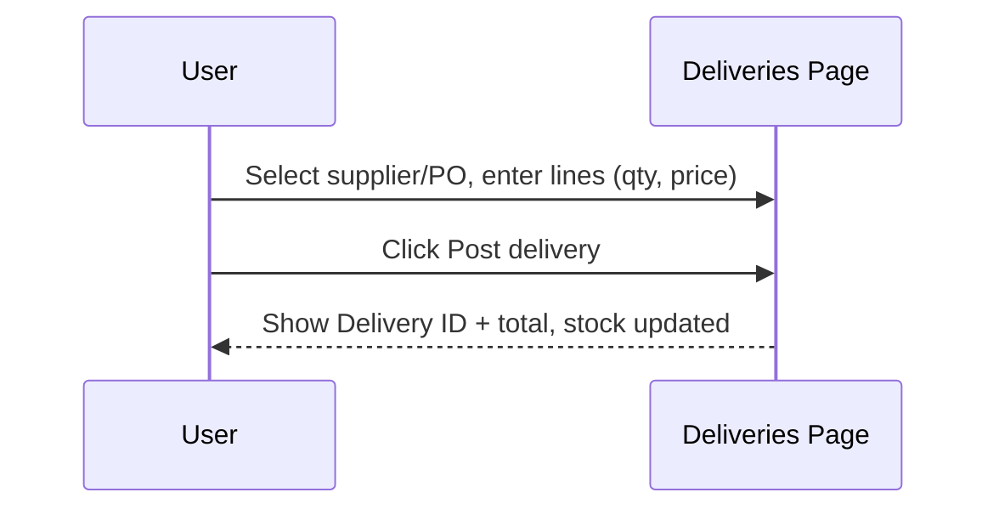

# UX Flow (1)

**Purpose:** Sketch the app screens and explain the UI/UX in simple terms so users understand how to use the system.

> This is a working draft. It follows the MVP scope.
> 

---

## 1) Navigation model

- **Top bar**: shows period name/status (e.g., "October 2025 — OPEN").
- **Nav buttons**: Dashboard · POB · Items & Prices · Orders · Deliveries · Issues · NCR · Stock Now · Reconciliations · Period Close.
- **Rule**: simple words, same order as the daily flow.

---

## 2) Dashboard

**Goal:** give a quick view of the month.

**Main parts:**

- Tiles: **Receipts**, **Issues**, **Total Mandays**, **Days left**.
- Recent activity lists: latest Deliveries and Issues.

**Actions:** none (view only).

**Notes:** numbers update after each posting.

---

## 3) POB (People on Board)

**Goal:** record headcount per day for manday cost.

**Main parts:** a table with Date, Crew, Extra Meals, Total.

**Actions:** type Crew & Extra, totals auto-calc.

**Notes:** these totals are used in **Reconciliations**.

---

## 4) Items & Prices

**Goal:** view & maintain the item catalog.

**Main parts:** table with Code, Name, Unit, Category, **WAC**, **On‑hand**.

**Actions:** Admin edits code/name/unit/category; WAC & On‑hand change via Deliveries/Issues.

**Notes:** pick lists in Orders/Deliveries/Issues come from here.

---

## 5) Orders (PRF → PO) — optional in MVP

**Goal:** request and approve items before delivery.

**Main parts:** PRF draft lines; Approve; Create PO.

**Actions:** add lines, approve PRF, create PO (optional).

**Notes:** Deliveries can reference a PO or be posted without one.

---

## 6) Deliveries & Invoices

**Goal:** add stock and record invoice details.

**Main parts:** header (Supplier, PO?, Invoice #, Note #, Date) + lines (Item, Price, Qty, Line Value, Total).

**Actions:** fill lines and **Post delivery**.

**Result:** On‑hand increases; **WAC** recomputes; a receipt entry is created.



---

## 7) Issues (Food/Clean)

**Goal:** record daily usage and reduce stock.

**Main parts:** header (Date, Cost centre) + lines (Item, On‑hand, Qty to issue, Value).

**Actions:** fill lines and **Post Issue**.

**Result:** On‑hand decreases; value uses current **WAC**.

**Rule:** no negative stock (blocked).

---

## 8) NCR (Non‑Conformance Report)

**Goal:** log damaged/short/expired items and track credits.

**Main parts:** receipt reference, line #, reason, qty, value, status.

**Actions:** create NCR; update status to Credited when supplier confirms.

**Result:** credited values offset **Consumption** in Reconciliations.

---

## 9) Stock Now

**Goal:** see live on‑hand and valuation.

**Main parts:** table with Item, Unit, On‑hand, WAC, Value; total valuation at bottom.

**Actions:** none (view only).

---

## 10) Reconciliations

**Goal:** calculate **Consumption** and **Manday cost**.

**Main parts:** inputs for Back‑charges, Condemnations, Credits Due, Others, and **Closing value**.

**Computation:** Consumption = Opening + Receipts − Closing + Back‑charges − Credits + Others − Condemnations; Manday cost = Consumption ÷ Mandays.

**Actions:** type adjustments; values update live.

---

## 11) Period Close

**Goal:** lock the month and roll to next.

**Main parts:** checklist (Deliveries posted, Issues posted, Recs complete) + Close button.

**Result:** period locks; snapshot saved; opening rolls forward.

---

## 12) UI guidelines

### General Principles
- Use simple words (Food, Clean, Delivery, Issue).
- Always show totals and clear buttons ("Post delivery", "Post Issue").
- Prevent mistakes: block negative stock; confirm on close.
- Keep forms short; remember last choices where helpful.

### Page Header Structure (Unified Design)

**All pages must follow this consistent header pattern:**

**Section 1 - Page Header:**
- **Left side:** Page title with icon, location indicator, and period
  - Page title (e.g., "Dashboard", "Issues", "Items")
  - Icon representing the page
  - Location display: Current location name OR "All Locations" for global pages
  - Period display: Current period name (e.g., "November 2025")
- **Right side:** Action buttons (if applicable)
  - Primary actions (e.g., "New Delivery", "New Issue", "Create Item")
  - Secondary actions (e.g., "Export CSV", "Back", "Print")
- **NO subtitle descriptions** - Keep headers clean and minimal

**Section 2 - Filters/Search (if applicable):**
- Always in a separate card below the header
- Consistent spacing: `space-y-6` between sections
- Filter controls in grid layout
- Active filter badges when filters are applied

**Implementation:**
- Use the `LayoutPageHeader` component for all pages
- Set `location-scope="current"` for location-specific pages (Dashboard, Stock Now, Deliveries, Issues)
- Set `location-scope="all"` for global pages (Items, Locations)
- NO subtitle prop - headers should be title and metadata only

**Example:**
```vue
<LayoutPageHeader
  title="Deliveries & Goods Receipts"
  icon="i-lucide-truck"
  :show-location="true"
  :show-period="true"
  location-scope="current"
>
  <template #actions>
    <UButton color="primary" icon="i-lucide-plus">
      New Delivery
    </UButton>
  </template>
</LayoutPageHeader>
```

### Color Usage

**Brand Colors:**
- **Navy Blue (#000046):** Primary brand color for headings, primary buttons, important text
- **Emerald Green (#45cf7b):** Secondary color for success states, secondary actions, accents

**Application:**
- **Primary actions:** Navy blue buttons (`bg-navy-500` with white text)
- **Success messages:** Emerald green background (`bg-emerald-400`)
- **Status indicators:**
  - Active/Pending: Navy (`navy-500`)
  - Completed/Approved: Emerald (`emerald-400`)
- **Headings:** Navy text (`text-navy-500`)
- **Focus states:** Navy borders (`focus:border-navy-500`)

**Accessibility:**
- Maintain sufficient contrast ratios (WCAG AA minimum)
- Support both light and dark modes
- Use color AND text/icons (don't rely on color alone)

**Implementation Rules:**
- ✅ Use Tailwind color tokens (e.g., `text-navy-500`, `bg-emerald-400`)
- ❌ Never use inline styles with hex colors (e.g., `style="color: #000046"`)
- ✅ Always include dark mode variants (e.g., `dark:text-navy-400`)
- ✅ Use semantic color naming for Nuxt UI components (`color="navy"`, `color="emerald"`)

---

## 13) Example screen outlines (ASCII sketches)

**Deliveries (header)**

Supplier [ FreshCo ▼ ]   PO [  —  ]   Invoice # [ INV-0001 ]   Note # [ DN-13 ]   Date [ 2025-10-21 ]

**Deliveries (lines)**

| Item (code — name) | Price | Qty | Line Value |
| --- | --- | --- | --- |
| RICE-5KG — Rice 5kg | 6.40 | 10 | 64.00 |
| CHK-1KG — Chicken 1kg | 18.90 | 5 | 94.50 |

Total: 158.50   [ Add line ]   [ Post delivery ]

**Issues (header)**

Date [ 2025-10-21 ]   Cost centre [ FOOD â–¼ ]

**Issues (lines)**

| Item (code — name) | On‑hand | Qty to issue | Value |
| --- | --- | --- | --- |
| RICE-5KG — Rice 5kg | 120 | 5 | 32.0 |

[ Add line ]   [ Post Issue ]

---

## 14) Future UX (post‑MVP ideas)

- **Search & filters** on Items & Prices and Stock Now.
- **Keyboard shortcuts** for faster posting.
- **Multi‑location switcher** if we add locations.
- **Print layouts** matching legacy forms (optional).