# Workflow Guide

**Understanding Your New Stock Control System**

---

# High-level map (one period)

```mermaid
flowchart LR
  %% Direction
  %% Left-to-right for a horizontal reading experience
  %% Core stages and data stores are grouped in subgraphs for clarity
  %% Subgraphs (logical areas)
  subgraph S1[Period Setup]
    A[Open Period]
    POB["POB: Daily crew + extra"]
  end
  subgraph S2[Ordering]
    PRF[PRF: Purchase Request]
    PO[PO: Purchase Order]
  end
  subgraph S3[Receiving]
    DEL["Deliveries & Invoices"]
    REC[Receipts Ledger]
  end
  subgraph S4[Usage]
    ISS[Issues: Food / Clean]
    CON[Consumption Ledger]
  end
  subgraph S5[Exceptions]
    NCR["NCR: Non‑Conformance"]
    CR[Credits Due]
  end
  subgraph S6["Stock & Valuation"]
    IM["Items & Prices (Item Master)"]
    WAC[Cost: WAC in mock]
    SN[Stock Now]
  end
  subgraph S7[Month‑End]
    RECS[Reconciliations]
    CLOSE[Period Close]
    SNAP["Snapshot & Roll Forward"]
  end
  %% Connections — main path
  A --> POB
  A --> IM
  PRF --> PO
  PO -. optional .-> DEL
  DEL --> REC
  DEL --> IM
  IM --> WAC
  IM --> SN
  ISS --> CON
  %% Data effects
  DEL -- "add qty & update price" --> IM
  ISS -- "subtract qty @ current cost" --> IM
  NCR --> CR
  %% Feeds to Reconciliations
  POB -- total mandays --> RECS
  REC -- period receipts total --> RECS
  SN -- closing value (count) --> RECS
  CON -- issues value --> RECS
  CR -- credits offset --> RECS
  %% Close
  RECS --> CLOSE
  CLOSE --> SNAP
  SNAP --> A
  %% Notes
  classDef store fill:#F3F4F6,stroke:#CBD5E1,color:#111827;
  class IM,WAC,SN,REC,CON,CR store;
```



## What This System Does

The new Stock Management System helps you:
✅ **Add stock** when deliveries arrive
✅ **Subtract stock** when the kitchen uses items
✅ **Close the month** quickly with clear, accurate numbers

---

## Who Uses What

| Role                               | What You’ll Do                                   |
| ---------------------------------- | --------------------------------------------------- |
| **Operator** (Store/Kitchen Staff) | Post deliveries and issues; check stock levels      |
| **Supervisor**                     | Review numbers, enter adjustments, print reports    |
| **Admin**                          | Manage item catalog, close periods, set permissions |

---

## The Big Picture: How One Month Flows

```
PERIOD OPENS (Day 1)
    ↓
DAILY OPERATIONS (Days 1-28)
• Record deliveries as trucks arrive → Stock goes UP
• Record issues as kitchen uses items → Stock goes DOWN
• Track daily crew meals (POB)
    ↓
MONTH-END (Days 29-31)
• Physical stock count
• Enter adjustments (back-charges, credits, etc.)
• Review Reconciliations
    ↓
CLOSE PERIOD (Day 31)
• Complete checklist
• Lock the month (no more changes)
• System creates snapshot and rolls to next month
```

---

## Page-by-Page: What Each Screen Does

### 1. 📊 Dashboard

**What you see:** Quick snapshot of the month

- Total Receipts (what came in)
- Total Issues (what went out)
- Total Mandays (from POB)
- Recent activity (latest 5 deliveries and issues)

**Why it matters:** See how your month is trending at a glance.

---

### 2. 👥 POB (People on Board)

**What you do:** Enter daily headcount

- **Crew:** Regular staff meals
- **Extra:** Guest or additional meals

**Example:**

- Monday: 45 crew + 3 extra = 48 mandays
- Tuesday: 45 crew + 0 extra = 45 mandays

**Why it matters:** Total mandays become the denominator for calculating **Manday Cost** at month-end.

**Formula:** Manday Cost = Total Consumption ÷ Total Mandays

---

### 3. 📦 Items & Prices (Item Master)

**What you see:** Your complete item catalog

| Column     | What It Shows                                |
| ---------- | -------------------------------------------- |
| Code       | Unique identifier (e.g., “CHK001”)        |
| Name       | Item description (e.g., “Chicken Breast”) |
| Unit       | How it’s measured (KG, EA, LTR)           |
| Category   | Group (Meat, Dairy, Vegetables, etc.)        |
| On-Hand    | Current quantity in stock                    |
| Cost (WAC) | Weighted Average Cost per unit               |

**How it updates automatically:**

- ✅ **Deliveries** → On-hand increases, Cost recalculates
- ✅ **Issues** → On-hand decreases, Cost stays the same

**Why it matters:** This is your source of truth. Every transaction references this catalog.

---

### 4. 📝 Orders (PRF → PO)

**What you do:** Manage purchase requests and orders

**The Flow:**

1. **PRF (Purchase Request Form)** - Draft what you need
2. **Approve** - Supervisor reviews and approves
3. **PO (Purchase Order)** - Create official order for supplier

**Statuses:**

- PRF: Draft → Approved → PO Created
- PO: Open → Closed

**Important:** Deliveries can be posted with or without a PO. The PO is just for planning—what actually arrives gets recorded in Deliveries.

---

### 5. 🚚 Deliveries & Invoices

**What you do:** Record what actually arrived

**Steps:**

1. Select supplier
2. Optionally link to a PO
3. Enter invoice number and delivery note
4. Add lines: Item, Quantity, Price
5. Click “Post Delivery”

**What happens behind the scenes:**

```
Example: You receive 10 KG of chicken at SAR 28.90/KG

BEFORE:
• On-hand: 50 KG @ SAR 27.00 = SAR 1,350
• New delivery: 10 KG @ SAR 28.90 = SAR 289

AFTER:
• On-hand: 60 KG @ WAC SAR 27.32 = SAR 1,639
  (Weighted Average: (1,350 + 289) ÷ 60)
```

**Why it matters:**

- Updates your stock quantity immediately
- Recalculates the average cost (WAC)
- Feeds into Dashboard and Reconciliations

**Tip:** If items arrive damaged or short, create an NCR (next section).

---

### 6. 📤 Issues (Daily Usage)

**What you do:** Record what the kitchen uses

**Steps:**

1. Select date
2. Choose cost center:

- **Food** - Kitchen operations
- **Clean** - Cleaning supplies

3. Add lines: Item, Quantity
4. Click “Post Issue”

**What happens:**

```
Example: Kitchen uses 8 KG of chicken

BEFORE:
• On-hand: 60 KG @ SAR 27.32

AFTER:
• On-hand: 52 KG @ SAR 27.32
• Issue value: 8 × SAR 27.32 = SAR 218.56
  (Uses current cost at time of issue)
```

**Important Rules:**

- â›” **No negative stock** - System blocks issues that exceed on-hand
- 💰 **Current cost** - Uses the WAC at the moment you post
- 🔒 **Cost doesn’t change** - Issues don’t recalculate item costs

---

### 7. ⚠️ NCR (Non-Conformance Report)

**What you do:** Log problems with deliveries

**When to use:**

- Items arrived damaged
- Quantities short
- Items expired or poor quality

**Information to record:**

- Which delivery (reference)
- Which item line
- Reason (damaged/short/expired)
- Quantity affected
- Value of the problem

**Status tracking:**

- Open → Sent to Supplier → Credited → (or Rejected)

**Why it matters:** Credited values reduce your month-end Consumption, so you’re not paying for problems.

---

### 8. 📊 Stock Now

**What you see:** Real-time inventory snapshot

| Item           | On-Hand | Cost (WAC) | Total Value      |
| -------------- | ------- | ---------- | ---------------- |
| Chicken Breast | 52 KG   | SAR 27.32  | SAR 1,420.64     |
| Rice           | 120 KG  | SAR 4.50   | SAR 540.00       |
| **TOTAL**      |         |            | **SAR 1,960.64** |

**Why it matters:**

- Check stock levels anytime
- Compare to physical counts at month-end
- See your total inventory value

**How it stays current:** Every delivery and issue updates this instantly.

---

### 9. 🧮 Reconciliations

**What you do:** Calculate month-end consumption and costs

**The Formula:**

```
CONSUMPTION = Opening Stock
            + Receipts (deliveries)
            - Closing Stock (physical count)
            ± Adjustments
```

**Adjustments you enter:**

- **Back-charges** - Costs charged back (subtract)
- **Condemnations** - Items written off (add)
- **Credits Due** - Supplier credits from NCRs (subtract)
- **Others** - Miscellaneous adjustments

**Key Outputs:**

1. **Total Consumption** - What you actually used this month
2. **Manday Cost** - Consumption ÷ Total Mandays (from POB)

**Example:**

```
Opening Stock:        SAR 12,000
+ Receipts:           SAR 45,000
- Closing Stock:      SAR 11,500
- Credits Due:        SAR   800
+ Back-charges:       SAR   300
= CONSUMPTION:        SAR 45,000

Total Mandays: 1,350 (from POB)
MANDAY COST = SAR 45,000 ÷ 1,350 = SAR 33.33 per person/day
```

**Why it matters:** This is your month-end financial summary—the numbers that matter to management.

---

### 10. 🔒 Period Close

**What you do:** Lock the month and move forward

**The Checklist:**

1. ✅ All deliveries posted
2. ✅ All issues posted
3. ✅ Reconciliations reviewed and complete

**Steps:**

1. Verify checklist is complete
2. Click “Close Period”
3. Confirm your action

**What happens:**

- 🔒 Period locks (no more edits possible)
- 📸 System saves a permanent snapshot
- 🔄 Opening stock for next month is set
- ➡️ You’re ready to start the new period

**Important:** This cannot be undone. Make sure everything is correct before closing.

---

## Daily Workflow (Typical Day)

### Morning

1. **Receive deliveries**
   - Post in Deliveries & Invoices
   - Check any damaged items → create NCR if needed

### Throughout the Day

1. **Kitchen requests items**
   - Post in Issues (Food or Clean)
   - Stock decreases automatically
2. **Update POB**
   - Enter today’s crew and extra meals

### Anytime

1. **Check Stock Now**
   - See what’s on hand
   - Plan tomorrow’s orders

---

## Month-End Workflow (Last 3 Days)

### Days 1-28: Business as Usual

- Post deliveries and issues daily
- Track POB daily

### Day 29: Preparation

- ✅ Ensure all deliveries are posted
- ✅ Ensure all issues are posted
- 🔍 Review NCRs, update credits

### Day 30: Physical Count

- 📦 Count physical stock
- 💻 Compare to Stock Now
- ✏️ Enter Closing Stock value in Reconciliations
- ✏️ Enter any adjustments (back-charges, credits, etc.)

### Day 31: Close the Books

- 📊 Review final Consumption and Manday Cost
- ✅ Complete Period Close checklist
- 🔒 Click “Close Period”
- 🎉 Start fresh next month

---

## Important Rules to Remember

### â›” No Negative Stock

- You cannot issue more than you have on hand
- System will block the transaction
- If you need to, adjust the quantity or check Stock Now first

### 💰 How Costs Work (WAC Method)

- **Deliveries** recalculate the average cost
- **Issues** use the current average cost
- **Issues don’t change** item costs—only deliveries do

### 🔒 Period Locking

- Open period: You can post and edit
- Closed period: Read-only (no changes)
- Always review before closing!

### 📝 Audit Trail

- Every transaction records:
  - Who did it
  - When it was done
  - What was changed
- This keeps everything traceable and accountable

---

## Data Flow: How Everything Connects

```
[DELIVERIES] ──→ Increase Stock ──→ [ITEMS & PRICES]
                 Update WAC              ↓
                                    [STOCK NOW]
                                         ↓
[ISSUES] ──────→ Decrease Stock ───→ [ITEMS & PRICES]
                 (at current WAC)

[POB] ──────────→ Total Mandays
                         ↓
                         ↓
[DELIVERIES] ──→ Receipts Total ──┐
[STOCK NOW] ───→ Closing Value ───┼──→ [RECONCILIATIONS]
[ISSUES] ──────→ Consumption ─────┤         ↓
[NCR] ─────────→ Credits ─────────┘    Consumption &
                                        Manday Cost
                                             ↓
                                      [PERIOD CLOSE]
                                             ↓
                                      Snapshot Saved
                                             ↓
                                      Next Period Opens
```

---

## Quick Reference: Common Questions

### “What if I make a mistake?”

- **Before closing:** Contact your supervisor or admin to help correct it
- **After closing:** Period is locked; adjustments go in the next period

### “What if a delivery is partial?”

- Post what actually arrived
- Create an NCR for the shortage
- Track it until credited

### “What if I don’t have a PO?”

- That’s fine! You can post deliveries without a PO
- Just select the supplier and enter the items

### “Why is my cost different than the invoice?”

- The system uses Weighted Average Cost (WAC)
- Your invoice shows the price you paid for that delivery
- WAC is the average of all deliveries over time

### “Can I see last month’s numbers?”

- Yes! Closed periods are saved as read-only snapshots
- Ask your supervisor or admin to show you

---

## Tips for Success

✅ **Post daily** - Don’t wait until week-end or month-end

✅ **Double-check quantities** - Especially for high-value items

✅ **Use NCRs** - Don’t absorb supplier errors silently

✅ **Count carefully** - Month-end accuracy depends on physical counts

✅ **Ask questions** - Better to clarify than guess

---

## Need Help?

- **Daily operations questions:** Ask your supervisor
- **System access or technical issues:** Contact admin
- **Training or refresher:** Request a quick walkthrough session

---

## Remember the Core Principle

**Add stock when trucks arrive. Subtract stock when the kitchen uses it. Close the month with a simple checklist.**

Everything else in the system supports these three simple actions.

---

_Document Version: 1.0 | Last Updated: October 2025_
