# Phase 1.4: Base Layout & Navigation
## Stock Management System - Development Guide

**For Junior Developers**
**Last Updated:** November 9, 2025
**Phase Status:** ‚úÖ Complete

---

## üìñ Quick Navigation

- [Phase 1.1: Project Foundation](phase-1.1-foundation.md)
- [Phase 1.2: Database Setup](phase-1.2-database.md)
- [Phase 1.3: Authentication & Security](phase-1.3-authentication.md)
- [Phase 1.4: Base Layout & Navigation](phase-1.4-layout-navigation.md) ‚Üê You are here

---

## Phase 1.4: Base Layout & Navigation

### What We Did

In this phase, we built the **user interface structure** - the layout, navigation menu, global components, and state management stores that power the entire application.

Think of this phase as building the **house framework**. We created:
- The **walls and ceiling** (layout structure)
- The **doors** (navigation menu)
- The **furniture** (reusable components)
- The **storage rooms** (global stores for data)
- The **notification system** (toast messages)

### Application Structure Overview

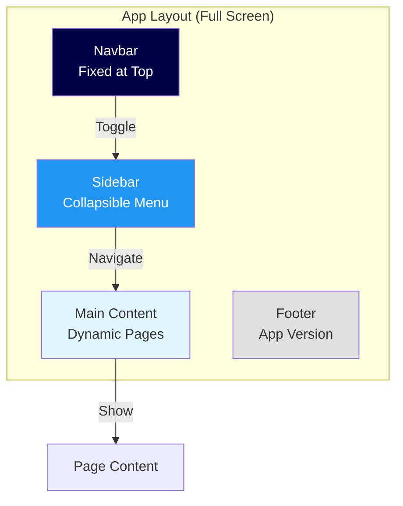
```mermaid
graph TB
    subgraph "App Layout (Full Screen)"
        N[Navbar<br/>Fixed at Top]
        S[Sidebar<br/>Collapsible Menu]
        M[Main Content<br/>Dynamic Pages]
        F[Footer<br/>App Version]
    end

    N -->|Toggle| S
    S -->|Navigate| M
    M -->|Show| P[Page Content]

    style N fill:#000046,color:#fff
    style S fill:#2196f3,color:#fff
    style M fill:#e1f5ff
    style F fill:#e0e0e0
```

---

## Tasks Completed

### 1.4.1: App Layout Structure ‚úÖ

**Simple Explanation:**
We created the **main structure** of the app - like building the frame of a house. Every page uses this layout.

**What Was Done:**
- Created root `app.vue` file
- Created default layout (`layouts/default.vue`)
- Built responsive 3-section layout (navbar + sidebar + main content)
- Made it work on desktop, tablet, and mobile

**Layout Architecture:**

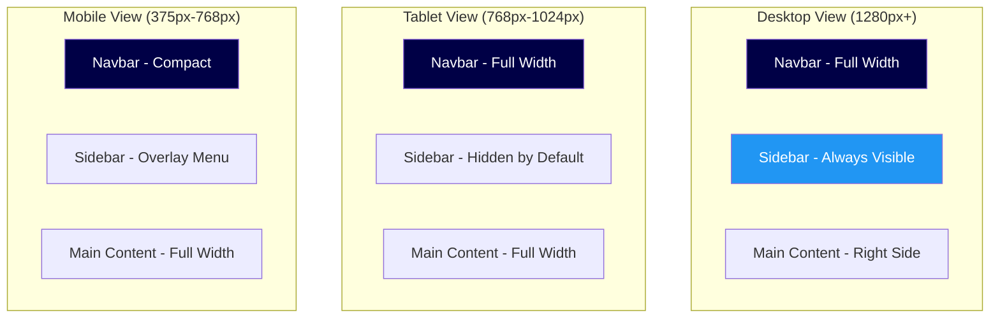
```mermaid
graph TB
    subgraph "Desktop View (1280px+)"
        D1[Navbar - Full Width]
        D2[Sidebar - Always Visible]
        D3[Main Content - Right Side]
    end

    subgraph "Tablet View (768px-1024px)"
        T1[Navbar - Full Width]
        T2[Sidebar - Hidden by Default]
        T3[Main Content - Full Width]
    end

    subgraph "Mobile View (375px-768px)"
        M1[Navbar - Compact]
        M2[Sidebar - Overlay Menu]
        M3[Main Content - Full Width]
    end

    style D1 fill:#000046,color:#fff
    style D2 fill:#2196f3,color:#fff
    style T1 fill:#000046,color:#fff
    style M1 fill:#000046,color:#fff
```

**How the Layout Works:**

The layout uses a **slot system** where pages go into the main content area:

```vue
<!-- layouts/default.vue -->
<template>
  <div class="flex h-screen">
    <!-- Navbar at top -->
    <LayoutAppNavbar />

    <!-- Sidebar on left -->
    <LayoutAppSidebar />

    <!-- Main content area (pages go here) -->
    <main class="flex-1">
      <slot />  <!-- Your page appears here -->
    </main>
  </div>
</template>
```

**Responsive Design:**

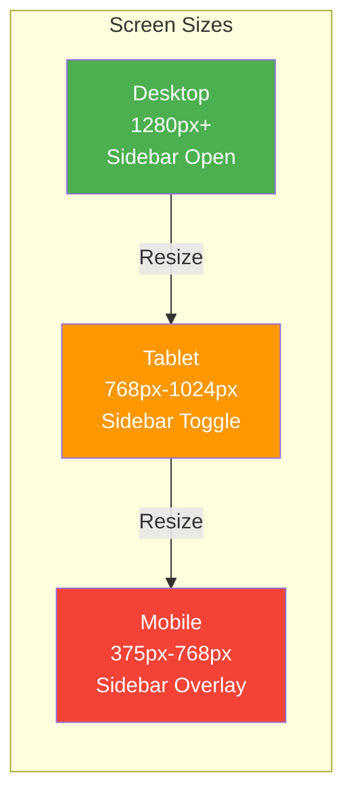
```mermaid
graph LR
    subgraph "Screen Sizes"
        D[Desktop<br/>1280px+<br/>Sidebar Open]
        T[Tablet<br/>768px-1024px<br/>Sidebar Toggle]
        M[Mobile<br/>375px-768px<br/>Sidebar Overlay]
    end

    D -->|Resize| T
    T -->|Resize| M

    style D fill:#4caf50,color:#fff
    style T fill:#ff9800,color:#fff
    style M fill:#f44336,color:#fff
```

**Files Created:**
- `app/app.vue` - Root component
- `app/layouts/default.vue` - Main layout
- `app/components/layout/AppNavbar.vue` - Top navigation bar
- `app/components/layout/AppSidebar.vue` - Side navigation menu

---

### 1.4.2: App Navbar Component ‚úÖ

**Simple Explanation:**
We created the **top bar** you see on every page. It shows the app name, current location, current period, theme toggle, and user menu.

**What Was Done:**
- Created navbar component with brand logo
- Added location selector dropdown
- Added period indicator
- Added theme switcher (light/dark mode)
- Added user dropdown menu with logout
- Made it responsive for mobile

**Navbar Layout:**

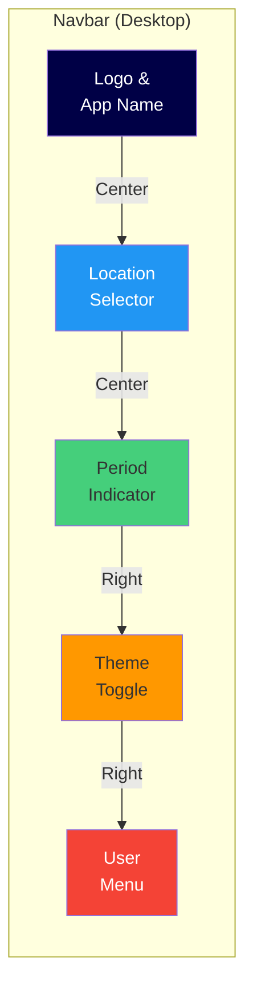
```mermaid
graph LR
    subgraph "Navbar (Desktop)"
        L[Logo &<br/>App Name]
        LC[Location<br/>Selector]
        P[Period<br/>Indicator]
        T[Theme<br/>Toggle]
        U[User<br/>Menu]
    end

    L -->|Center| LC
    LC -->|Center| P
    P -->|Right| T
    T -->|Right| U

    style L fill:#000046,color:#fff
    style LC fill:#2196f3,color:#fff
    style P fill:#45cf7b
    style T fill:#ff9800
    style U fill:#f44336,color:#fff
```

**Key Features:**

1. **Location Selector**
   - Shows current location name
   - Dropdown to switch between locations
   - Updates navbar and entire app when changed
   - Shows only locations user can access

2. **Period Indicator**
   - Shows current period name
   - Shows date range (DD/MM/YYYY format)
   - Shows status badge (OPEN, PENDING_CLOSE, etc.)
   - Shows days remaining in period
   - Auto-refreshes period data

3. **Theme Switcher**
   - Toggle between light and dark mode
   - Saves preference in browser
   - Changes colors across entire app

4. **User Menu**
   - Shows user's full name
   - Shows user's role (ADMIN, SUPERVISOR, OPERATOR)
   - Logout button
   - Avatar icon

**Responsive Behavior:**

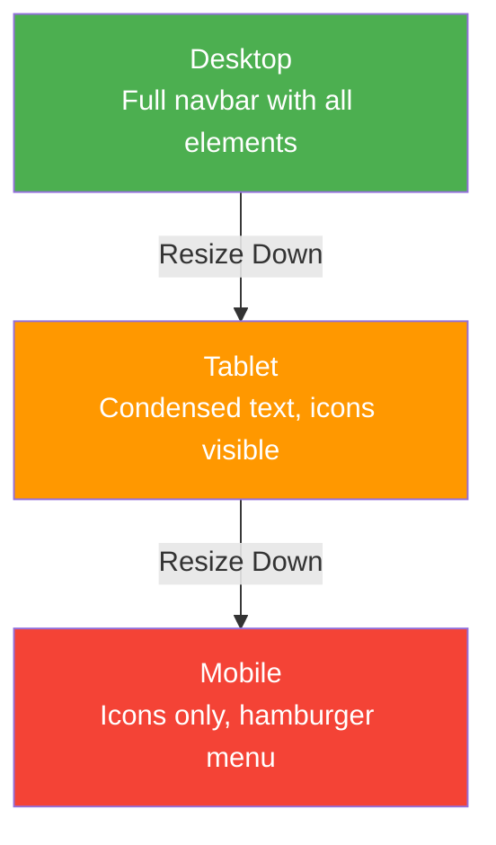
```mermaid
graph TB
    D[Desktop<br/>Full navbar with all elements]
    T[Tablet<br/>Condensed text, icons visible]
    M[Mobile<br/>Icons only, hamburger menu]

    D -->|Resize Down| T
    T -->|Resize Down| M

    style D fill:#4caf50,color:#fff
    style T fill:#ff9800,color:#fff
    style M fill:#f44336,color:#fff
```

**Location Switching Flow:**

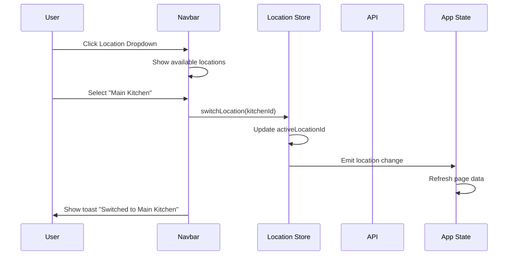
```mermaid
sequenceDiagram
    participant U as User
    participant N as Navbar
    participant LS as Location Store
    participant API as API
    participant App as App State

    U->>N: Click Location Dropdown
    N->>N: Show available locations
    U->>N: Select "Main Kitchen"
    N->>LS: switchLocation(kitchenId)
    LS->>LS: Update activeLocationId
    LS->>App: Emit location change
    App->>App: Refresh page data
    N->>U: Show toast "Switched to Main Kitchen"
```

**Components Created:**
- `app/components/layout/LocationSwitcher.vue` - Location dropdown
- `app/components/layout/PeriodIndicator.vue` - Period display

**API Endpoints Used:**
- `GET /api/user/locations` - Get user's accessible locations
- `GET /api/periods/current` - Get current open period

---

### 1.4.3: App Sidebar Navigation ‚úÖ

**Simple Explanation:**
We created the **side menu** that helps users navigate to different pages. It automatically shows/hides menu items based on user permissions.

**What Was Done:**
- Created sidebar with 10 navigation menu items
- Added role-based filtering (only show what user can access)
- Added active route highlighting
- Made it collapsible on desktop
- Made it an overlay on mobile
- Added icons for each menu item

**Navigation Menu Structure:**

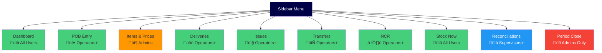
```mermaid
graph TB
    S[Sidebar Menu] --> D[Dashboard<br/>üìä All Users]
    S --> POB[POB Entry<br/>üë• Operators+]
    S --> I[Items & Prices<br/>📦 Admins]
    S --> DL[Deliveries<br/>üöö Operators+]
    S --> IS[Issues<br/>📤 Operators+]
    S --> T[Transfers<br/>🔄 Operators+]
    S --> N[NCR<br/>⚠️ Operators+]
    S --> ST[Stock Now<br/>üìä All Users]
    S --> R[Reconciliations<br/>üìà Supervisors+]
    S --> PC[Period Close<br/>üîí Admins Only]

    style S fill:#000046,color:#fff
    style D fill:#45cf7b
    style POB fill:#45cf7b
    style I fill:#ff9800
    style DL fill:#45cf7b
    style IS fill:#45cf7b
    style T fill:#45cf7b
    style N fill:#45cf7b
    style ST fill:#45cf7b
    style R fill:#2196f3,color:#fff
    style PC fill:#f44336,color:#fff
```

**Role-Based Menu Filtering:**

The sidebar automatically hides menu items based on user role:

```typescript
// Operator sees:
- Dashboard
- POB Entry
- Deliveries
- Issues
- Transfers
- NCR
- Stock Now

// Supervisor sees (Operator +):
- Reconciliations

// Admin sees (Supervisor +):
- Items & Prices
- Period Close
```

**Permission Checks:**

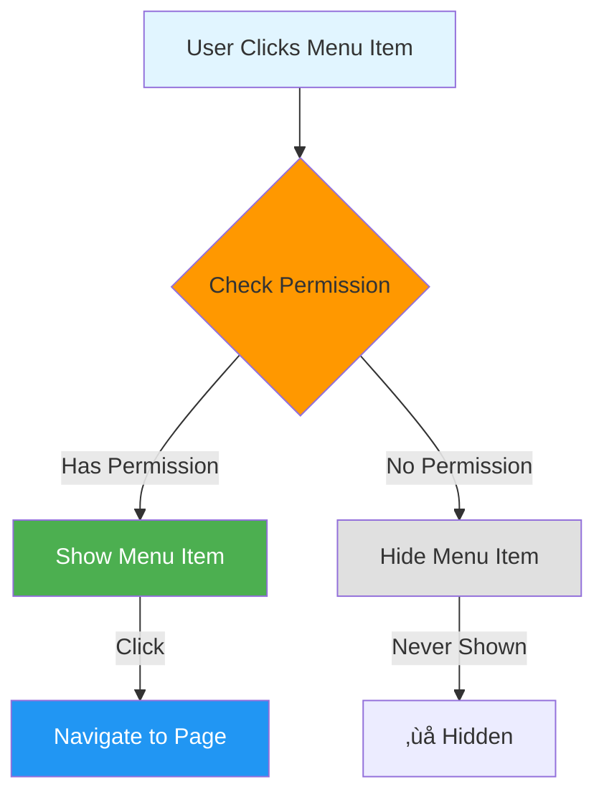
```mermaid
graph TB
    U[User Clicks Menu Item] --> P{Check Permission}
    P -->|Has Permission| S[Show Menu Item]
    P -->|No Permission| H[Hide Menu Item]

    S -->|Click| N[Navigate to Page]
    H -->|Never Shown| X[‚ùå Hidden]

    style U fill:#e1f5ff
    style P fill:#ff9800
    style S fill:#4caf50,color:#fff
    style H fill:#e0e0e0
    style N fill:#2196f3,color:#fff
```

**Active Route Highlighting:**

When you're on a page, the sidebar menu item is highlighted:

```vue
<!-- Active item style -->
<div class="menu-item active">
  <!-- Navy blue background -->
  <!-- Emerald green dot indicator -->
  <!-- Bold text -->
</div>
```

**Mobile Behavior:**

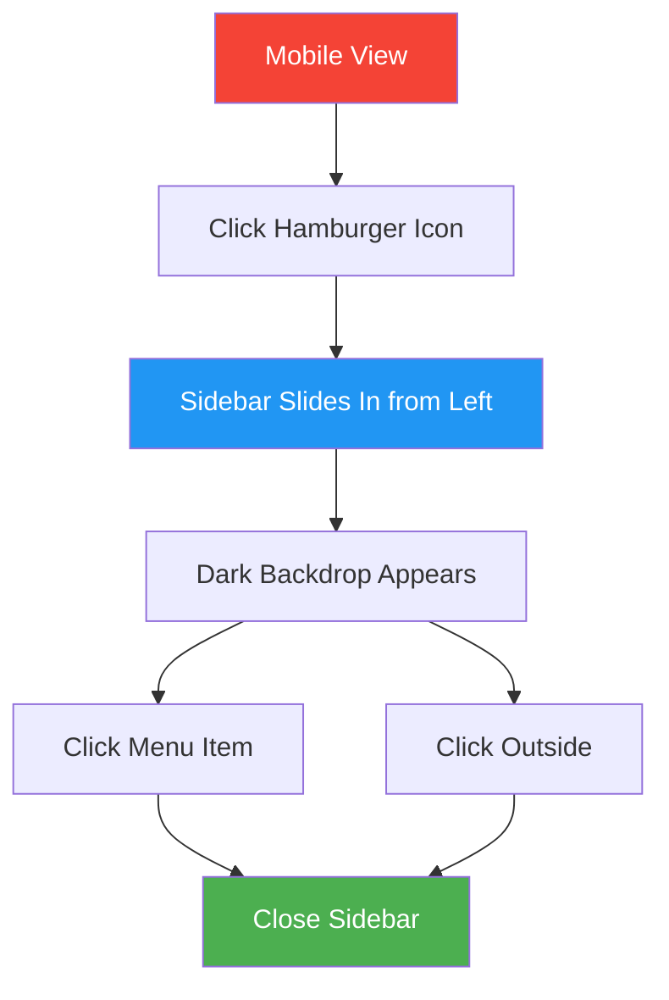
```mermaid
graph TB
    M[Mobile View] --> H[Click Hamburger Icon]
    H --> O[Sidebar Slides In from Left]
    O --> B[Dark Backdrop Appears]
    B --> C1[Click Menu Item]
    B --> C2[Click Outside]
    C1 --> CL[Close Sidebar<br/>Navigate to Page]
    C2 --> CL[Close Sidebar]

    style M fill:#f44336,color:#fff
    style O fill:#2196f3,color:#fff
    style CL fill:#4caf50,color:#fff
```

**Sidebar State Management:**

The sidebar uses the **UI Store** to manage its state:

```typescript
// UI Store controls sidebar
const uiStore = useUIStore()

// Desktop: Toggle collapse
uiStore.toggleSidebar()           // Collapse/expand
uiStore.sidebarCollapsed = true   // Collapse
uiStore.sidebarCollapsed = false  // Expand

// Mobile: Toggle overlay
uiStore.toggleMobileSidebar()     // Open/close
uiStore.closeMobileSidebar()      // Close only
```

---

### 1.4.4: Global UI Components ‚úÖ

**Simple Explanation:**
We created **reusable components** that are used throughout the app. Like LEGO blocks you can use anywhere.

**What Was Done:**
- Created 5 essential components
- Made them customizable with props
- Styled them with design system colors
- Tested them on a test page

**Components Created:**

#### 1. LoadingSpinner

**What it does:** Shows a spinning icon when loading data

```vue
<!-- Usage -->
<LoadingSpinner size="md" color="primary" text="Loading data..." />
```

**Sizes:**
- `sm` - Small (16px)
- `md` - Medium (24px) - default
- `lg` - Large (32px)
- `xl` - Extra large (48px)

**Colors:**
- `primary` - Navy blue
- `secondary` - Emerald green
- `neutral` - Gray

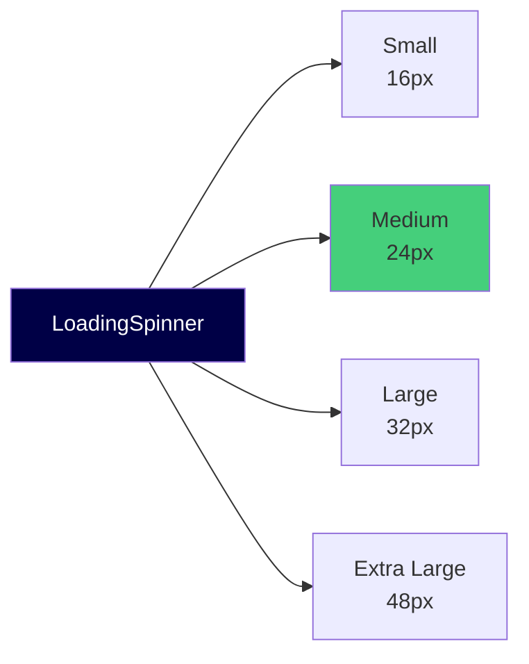
```mermaid
graph LR
    L[LoadingSpinner] --> S[Small<br/>16px]
    L --> M[Medium<br/>24px]
    L --> LG[Large<br/>32px]
    L --> XL[Extra Large<br/>48px]

    style L fill:#000046,color:#fff
    style M fill:#45cf7b
```

#### 2. ErrorAlert

**What it does:** Shows error, warning, info, or success messages

```vue
<!-- Usage -->
<ErrorAlert
  type="error"
  title="Failed to save"
  message="Please try again"
  :dismissible="true"
  @retry="handleRetry"
/>
```

**Types:**
- `error` - Red, for errors
- `warning` - Amber, for warnings
- `info` - Blue, for information
- `success` - Green, for success

**Features:**
- Dismissible (close button)
- Retry button (optional)
- Custom action buttons
- Auto-color based on type

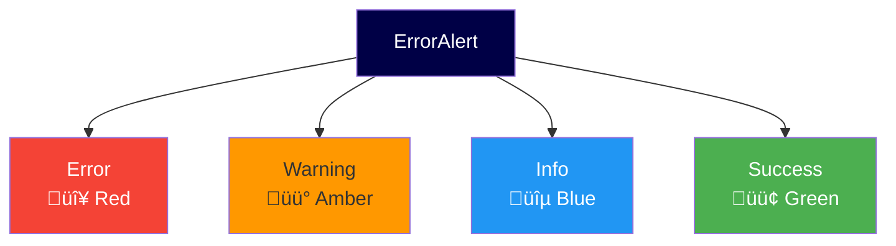
```mermaid
graph TB
    E[ErrorAlert] --> ER[Error<br/>🔴 Red]
    E --> W[Warning<br/>üü° Amber]
    E --> I[Info<br/>üîµ Blue]
    E --> S[Success<br/>🟢 Green]

    style E fill:#000046,color:#fff
    style ER fill:#f44336,color:#fff
    style W fill:#ff9800
    style I fill:#2196f3,color:#fff
    style S fill:#4caf50,color:#fff
```

#### 3. EmptyState

**What it does:** Shows friendly message when a list is empty

```vue
<!-- Usage -->
<EmptyState
  icon="i-lucide-inbox"
  title="No deliveries yet"
  description="Create your first delivery to get started"
  actionText="New Delivery"
  @action="createDelivery"
/>
```

**Features:**
- Custom icon
- Title and description
- Action button (optional)
- Three sizes (sm, md, lg)
- Custom content slot

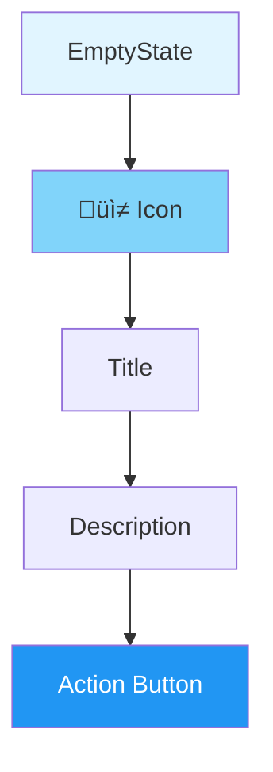
```mermaid
graph TB
    E[EmptyState] --> I[üì≠ Icon]
    I --> T[Title]
    T --> D[Description]
    D --> B[Action Button]

    style E fill:#e1f5ff
    style I fill:#81d4fa
    style B fill:#2196f3,color:#fff
```

#### 4. PageHeader

**What it does:** Shows page title, breadcrumbs, and action buttons

```vue
<!-- Usage -->
<PageHeader
  title="Deliveries"
  icon="i-lucide-truck"
  :breadcrumbs="[
    { label: 'Home', to: '/' },
    { label: 'Deliveries', to: '/deliveries' }
  ]"
>
  <template #actions>
    <UButton color="primary">New Delivery</UButton>
  </template>
</PageHeader>
```

**Features:**
- Page title with optional icon and badge
- Breadcrumb navigation
- Action buttons slot
- Back button option
- Responsive layout
- Sticky header option

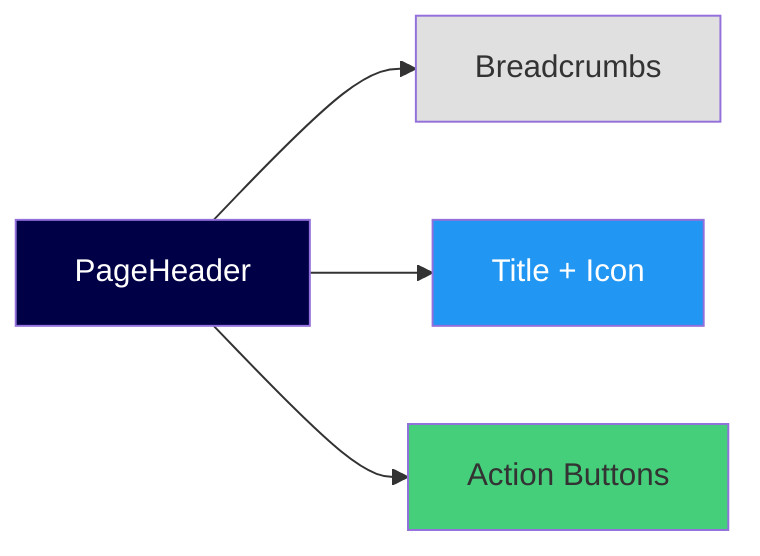
```mermaid
graph LR
    PH[PageHeader] --> B[Breadcrumbs]
    PH --> T[Title + Icon]
    PH --> A[Action Buttons]

    style PH fill:#000046,color:#fff
    style B fill:#e0e0e0
    style T fill:#2196f3,color:#fff
    style A fill:#45cf7b
```

#### 5. DataTable

**What it does:** Shows data in a table with pagination and custom columns

```vue
<!-- Usage -->
<DataTable
  :columns="[
    { key: 'name', label: 'Name' },
    { key: 'role', label: 'Role' },
    { key: 'email', label: 'Email' }
  ]"
  :data="users"
  :loading="isLoading"
  :page-size="10"
/>
```

**Features:**
- Loading state (shows spinner)
- Error state (shows error message)
- Empty state (shows empty message)
- Pagination (automatic)
- Custom column rendering (slots)
- Action column support
- Responsive design

**Data Flow:**

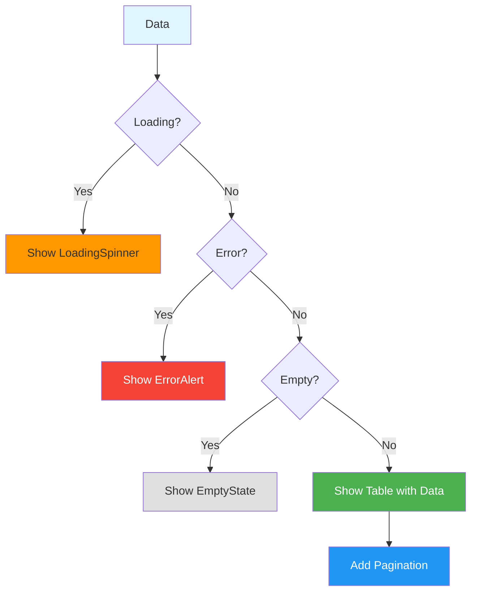
```mermaid
graph TB
    D[Data] --> L{Loading?}
    L -->|Yes| LS[Show LoadingSpinner]
    L -->|No| E{Error?}
    E -->|Yes| EA[Show ErrorAlert]
    E -->|No| EM{Empty?}
    EM -->|Yes| ES[Show EmptyState]
    EM -->|No| T[Show Table with Data]

    T --> P[Add Pagination]

    style D fill:#e1f5ff
    style LS fill:#ff9800
    style EA fill:#f44336,color:#fff
    style ES fill:#e0e0e0
    style T fill:#4caf50,color:#fff
    style P fill:#2196f3,color:#fff
```

**Files Created:**
- `app/components/common/LoadingSpinner.vue`
- `app/components/common/ErrorAlert.vue`
- `app/components/common/EmptyState.vue`
- `app/components/common/PageHeader.vue`
- `app/components/common/DataTable.vue`

---

### 1.4.5: Toast Notifications Setup ‚úÖ

**Simple Explanation:**
We created a **notification system** that shows small messages at the bottom-right of the screen (like phone notifications).

**What Was Done:**
- Configured Nuxt UI toast system
- Created `useAppToast()` composable
- Defined 4 toast types with brand colors
- Made toasts auto-dismiss after a few seconds

**Toast Types:**

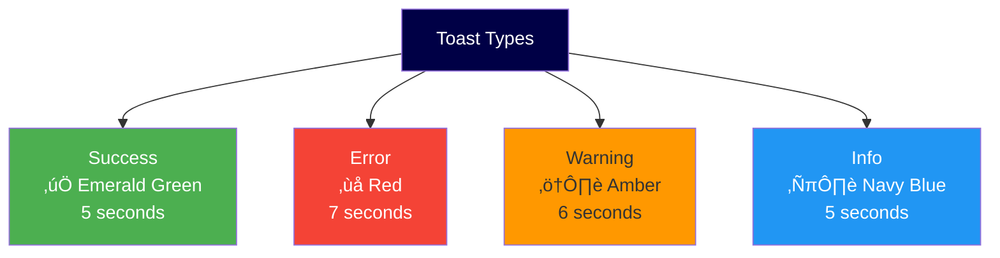
```mermaid
graph TB
    T[Toast Types] --> S[Success<br/>‚úÖ Emerald Green<br/>5 seconds]
    T --> E[Error<br/>‚ùå Red<br/>7 seconds]
    T --> W[Warning<br/>⚠️ Amber<br/>6 seconds]
    T --> I[Info<br/>ℹ️ Navy Blue<br/>5 seconds]

    style T fill:#000046,color:#fff
    style S fill:#4caf50,color:#fff
    style E fill:#f44336,color:#fff
    style W fill:#ff9800
    style I fill:#2196f3,color:#fff
```

**How to Use Toasts:**

```typescript
// Import the composable
const toast = useAppToast()

// Show success message
toast.success('Saved successfully', 'Your changes have been saved')

// Show error message
toast.error('Failed to save', 'Please try again later')

// Show warning message
toast.warning('Low stock', 'Item quantity is below minimum')

// Show info message
toast.info('New period', 'November period has started')

// Clear all toasts
toast.clear()
```

**Toast Lifecycle:**

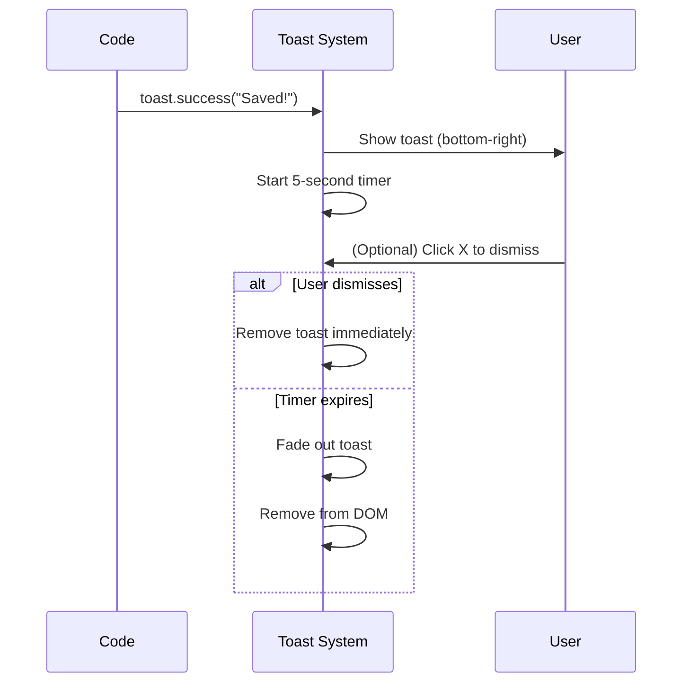
```mermaid
sequenceDiagram
    participant C as Code
    participant T as Toast System
    participant U as User

    C->>T: toast.success("Saved!")
    T->>U: Show toast (bottom-right)
    T->>T: Start 5-second timer
    U->>T: (Optional) Click X to dismiss
    alt User dismisses
        T->>T: Remove toast immediately
    else Timer expires
        T->>T: Fade out toast
        T->>T: Remove from DOM
    end
```

**Toast Position & Animation:**

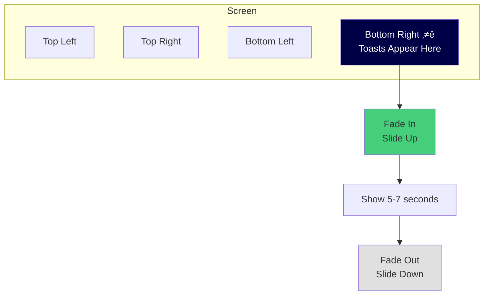
```mermaid
graph TB
    subgraph "Screen"
        TL[Top Left]
        TR[Top Right]
        BL[Bottom Left]
        BR[Bottom Right ⭐<br/>Toasts Appear Here]
    end

    BR --> F[Fade In<br/>Slide Up]
    F --> S[Show 5-7 seconds]
    S --> FO[Fade Out<br/>Slide Down]

    style BR fill:#000046,color:#fff
    style F fill:#45cf7b
    style FO fill:#e0e0e0
```

**Custom Toast Options:**

```typescript
// Custom duration
toast.success('Saved', 'Data saved', 10000) // 10 seconds

// With action button
toast.error(
  'Failed to delete',
  'Item is in use',
  5000,
  {
    actions: [{
      label: 'View Details',
      onClick: () => showDetails()
    }]
  }
)

// Custom icon
toast.info(
  'Update available',
  'New version is ready',
  0, // No auto-dismiss
  {
    icon: 'i-lucide-download'
  }
)
```

**Files Created:**
- `app/composables/useAppToast.ts` - Toast composable

**Configuration:**
- Added `UNotifications` component to `app.vue`
- Configured toast position (bottom-right)
- Set default durations per type

---

### 1.4.6: Global Stores ‚úÖ

**Simple Explanation:**
We created **3 storage boxes** (Pinia stores) that hold important data used across the entire app.

Think of stores like **shared memory** - any page or component can read or change the data, and everyone sees the update.

**What Was Done:**
- Created UI Store (sidebar, modals, toasts)
- Created Period Store (current period data)
- Created Location Store (user locations, active location)
- Tested all stores with comprehensive test page

**The Three Stores:**

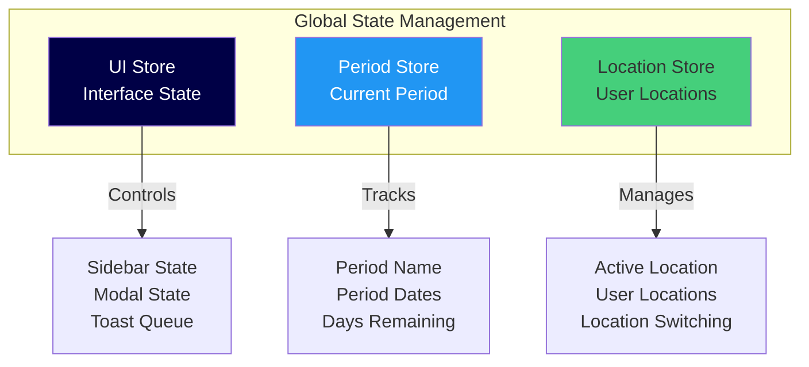
```mermaid
graph TB
    subgraph "Global State Management"
        UI[UI Store<br/>Interface State]
        P[Period Store<br/>Current Period]
        L[Location Store<br/>User Locations]
    end

    UI -->|Controls| S[Sidebar State<br/>Modal State<br/>Toast Queue]
    P -->|Tracks| PD[Period Name<br/>Period Dates<br/>Days Remaining]
    L -->|Manages| LD[Active Location<br/>User Locations<br/>Location Switching]

    style UI fill:#000046,color:#fff
    style P fill:#2196f3,color:#fff
    style L fill:#45cf7b
```

#### Store 1: UI Store

**File:** `app/stores/ui.ts`

**What it stores:**
- Sidebar collapsed state (desktop)
- Mobile sidebar open state
- Modal states (open/closed)
- Toast notification queue

**State:**
```typescript
{
  sidebarCollapsed: false,      // Desktop sidebar collapsed?
  mobileSidebarOpen: false,     // Mobile sidebar open?
  toasts: [],                   // Active toasts
  modals: {}                    // Open modals
}
```

**Actions (Methods):**
```typescript
// Sidebar
toggleSidebar()              // Toggle desktop sidebar
setSidebarCollapsed(value)   // Set sidebar state
toggleMobileSidebar()        // Toggle mobile sidebar
closeMobileSidebar()         // Close mobile sidebar

// Toasts
addToast(toast)              // Add new toast
removeToast(id)              // Remove toast
showSuccess(title, desc)     // Success toast
showError(title, desc)       // Error toast
showWarning(title, desc)     // Warning toast
showInfo(title, desc)        // Info toast

// Modals
openModal(id, component)     // Open modal
closeModal(id)               // Close modal
isModalOpen(id)              // Check if modal open
```

**Usage Example:**
```vue
<script setup>
const uiStore = useUIStore()

// Toggle sidebar
function toggle() {
  uiStore.toggleSidebar()
}

// Show toast
function save() {
  uiStore.showSuccess('Saved!', 'Data saved successfully')
}

// Open modal
function openDialog() {
  uiStore.openModal('confirm-delete', 'ConfirmDialog', {
    title: 'Delete Item?',
    onConfirm: () => deleteItem()
  })
}
</script>
```

#### Store 2: Period Store

**File:** `app/stores/period.ts`

**What it stores:**
- Current active period
- Period status (OPEN, CLOSED, etc.)
- Loading and error states

**State:**
```typescript
{
  currentPeriod: {
    id: '...',
    name: 'November 2025',
    start_date: '2025-11-01',
    end_date: '2025-11-30',
    status: 'OPEN'
  },
  loading: false,
  error: null
}
```

**Computed Getters:**
```typescript
hasPeriod         // Is there a period?
isPeriodOpen      // Is period status OPEN?
periodName        // Period name
periodStatus      // Period status
periodDateRange   // Formatted dates (01/11/2025 - 30/11/2025)
daysRemaining     // Days left in period
```

**Actions:**
```typescript
fetchCurrentPeriod()   // Load current period from API
refresh()              // Reload period data
clearError()           // Clear error message
reset()                // Reset store
```

**Period Data Flow:**

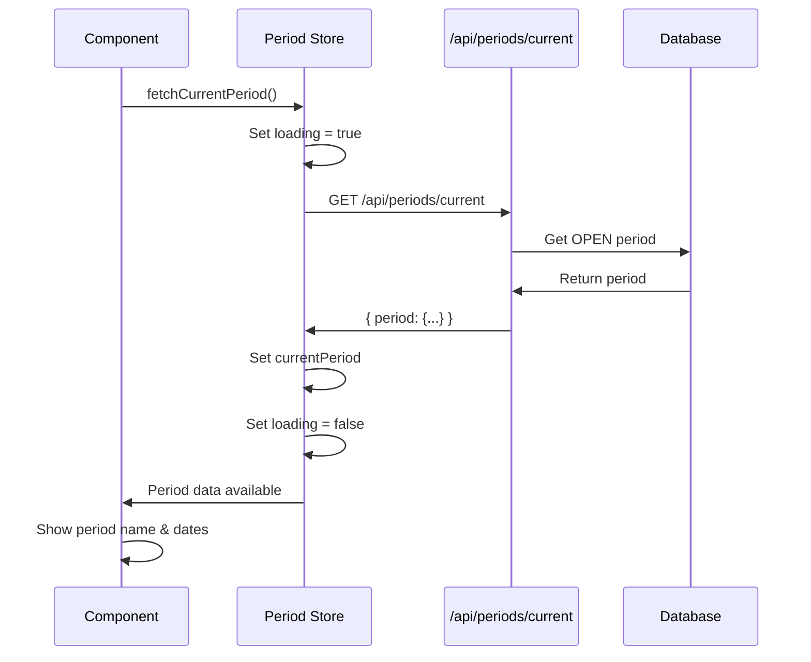
```mermaid
sequenceDiagram
    participant C as Component
    participant PS as Period Store
    participant API as /api/periods/current
    participant DB as Database

    C->>PS: fetchCurrentPeriod()
    PS->>PS: Set loading = true
    PS->>API: GET /api/periods/current
    API->>DB: Get OPEN period
    DB->>API: Return period
    API->>PS: { period: {...} }
    PS->>PS: Set currentPeriod
    PS->>PS: Set loading = false
    PS->>C: Period data available
    C->>C: Show period name & dates
```

**Usage Example:**
```vue
<script setup>
const periodStore = usePeriodStore()

onMounted(() => {
  periodStore.fetchCurrentPeriod()
})
</script>

<template>
  <div>
    <p v-if="periodStore.hasPeriod">
      Period: {{ periodStore.periodName }}
      <br>
      Dates: {{ periodStore.periodDateRange }}
      <br>
      Days Left: {{ periodStore.daysRemaining }}
      <br>
      Status: {{ periodStore.periodStatus }}
    </p>
    <p v-else-if="!periodStore.loading">
      No active period
    </p>
  </div>
</template>
```

#### Store 3: Location Store

**File:** `app/stores/location.ts`

**What it stores:**
- User's accessible locations
- Currently active location
- Loading and error states

**State:**
```typescript
{
  activeLocationId: 'abc-123',
  userLocations: [
    {
      id: 'abc-123',
      code: 'MAIN-KIT',
      name: 'Main Kitchen',
      type: 'KITCHEN',
      access_level: 'MANAGE'
    },
    // ... more locations
  ],
  loading: false,
  error: null
}
```

**Computed Getters:**
```typescript
activeLocation        // Current location object
hasLocations          // Has any locations?
getLocationById(id)   // Get location by ID
```

**Actions:**
```typescript
fetchUserLocations()      // Load user's locations from API
switchLocation(id)        // Switch to different location
clearError()              // Clear error
reset()                   // Reset store
```

**Location Switching Flow:**

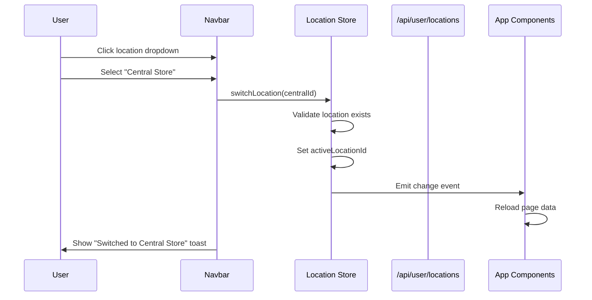
```mermaid
sequenceDiagram
    participant U as User
    participant N as Navbar
    participant LS as Location Store
    participant API as /api/user/locations
    participant App as App Components

    U->>N: Click location dropdown
    U->>N: Select "Central Store"
    N->>LS: switchLocation(centralId)
    LS->>LS: Validate location exists
    LS->>LS: Set activeLocationId
    LS->>App: Emit change event
    App->>App: Reload page data
    N->>U: Show "Switched to Central Store" toast
```

**Auto-Location Selection:**

When the app loads, the location store automatically:
1. Fetches user's accessible locations
2. Checks user's default location
3. If default location is accessible, select it
4. Otherwise, select the first location in the list

```mermaid
graph TB
    A[App Starts] --> F[Fetch User Locations]
    F --> C{Has Default Location?}
    C -->|Yes| D{Default in List?}
    C -->|No| FL[Select First Location]
    D -->|Yes| S[Select Default]
    D -->|No| FL
    S --> E[Location Ready]
    FL --> E

    style A fill:#e1f5ff
    style F fill:#81d4fa
    style S fill:#4caf50,color:#fff
    style FL fill:#ff9800
    style E fill:#2196f3,color:#fff
```

**Usage Example:**
```vue
<script setup>
const locationStore = useLocationStore()

onMounted(() => {
  locationStore.fetchUserLocations()
})

function switchTo(locationId) {
  locationStore.switchLocation(locationId)
}
</script>

<template>
  <div>
    <h2>Active Location</h2>
    <p v-if="locationStore.activeLocation">
      {{ locationStore.activeLocation.name }}
      ({{ locationStore.activeLocation.code }})
    </p>

    <h3>All Locations</h3>
    <div v-for="loc in locationStore.userLocations" :key="loc.id">
      <button @click="switchTo(loc.id)">
        {{ loc.name }}
      </button>
    </div>
  </div>
</template>
```

**Store Integration:**

```mermaid
graph TB
    subgraph "Components Use Stores"
        N[Navbar] -->|Uses| LS[Location Store]
        N -->|Uses| PS[Period Store]
        S[Sidebar] -->|Uses| US[UI Store]
        P[Pages] -->|Uses| LS
        P -->|Uses| PS
        P -->|Uses| US
    end

    subgraph "Stores Call APIs"
        LS -->|GET| API1[/api/user/locations]
        PS -->|GET| API2[/api/periods/current]
    end

    style N fill:#000046,color:#fff
    style LS fill:#45cf7b
    style PS fill:#2196f3,color:#fff
    style US fill:#ff9800
```

**Files Created:**
- `app/stores/ui.ts` - UI state
- `app/stores/period.ts` - Period state
- `app/stores/location.ts` - Location state

---

## How Everything Connects

### Complete Layout Architecture

```mermaid
graph TB
    subgraph "App Structure"
        A[app.vue<br/>Root Component]
        A --> L[layouts/default.vue<br/>Main Layout]
    end

    subgraph "Layout Components"
        L --> N[LayoutAppNavbar<br/>Top Bar]
        L --> S[LayoutAppSidebar<br/>Side Menu]
        L --> M[Main Content<br/>Page Slot]
    end

    subgraph "Navbar Features"
        N --> LS[LocationSwitcher<br/>Dropdown]
        N --> PI[PeriodIndicator<br/>Badge]
        N --> TH[Theme Toggle<br/>Light/Dark]
        N --> UM[UserMenu<br/>Logout]
    end

    subgraph "Sidebar Features"
        S --> NAV[Navigation Menu<br/>10 Items]
        S --> PERM[Permission Filter<br/>Role-based]
        S --> HIGH[Active Highlight<br/>Current Page]
    end

    subgraph "Global Stores"
        UIS[UI Store]
        PES[Period Store]
        LOS[Location Store]
    end

    N --> UIS
    N --> PES
    N --> LOS
    S --> UIS
    M --> ALL[All Stores]

    style A fill:#000046,color:#fff
    style L fill:#2196f3,color:#fff
    style N fill:#45cf7b
    style S fill:#ff9800
    style UIS fill:#f44336,color:#fff
    style PES fill:#9c27b0,color:#fff
    style LOS fill:#4caf50,color:#fff
```

### Component Reusability

```mermaid
graph TB
    subgraph "Reusable Components"
        direction LR
        C[Common Components]
        C --> L[LoadingSpinner]
        C --> E[ErrorAlert]
        C --> EM[EmptyState]
        C --> P[PageHeader]
        C --> D[DataTable]
    end

    subgraph "Used By Pages"
        PAG1[Deliveries Page]
        PAG2[Issues Page]
        PAG3[Items Page]
        PAG4[Transfers Page]
    end

    PAG1 --> L
    PAG1 --> E
    PAG1 --> D
    PAG2 --> L
    PAG2 --> D
    PAG3 --> P
    PAG3 --> D
    PAG4 --> EM
    PAG4 --> D

    style C fill:#000046,color:#fff
    style L fill:#45cf7b
    style E fill:#f44336,color:#fff
    style D fill:#2196f3,color:#fff
```

### State Management Flow

```mermaid
sequenceDiagram
    participant U as User
    participant C as Component
    participant S as Store
    participant API as API
    participant DB as Database

    U->>C: Click "Switch Location"
    C->>S: Call store action
    S->>S: Update state
    S->>API: Fetch new data
    API->>DB: Query database
    DB->>API: Return data
    API->>S: Send response
    S->>S: Update state
    S->>C: Notify change
    C->>C: Re-render UI
    C->>U: Show updated view
```

---

## Responsive Design Strategy

### Breakpoint System

```mermaid
graph LR
    subgraph "Screen Sizes"
        M[Mobile<br/>< 768px]
        T[Tablet<br/>768px - 1024px]
        D[Desktop<br/>> 1024px]
    end

    M -->|Hamburger Menu| MS[Sidebar Overlay]
    T -->|Toggle Button| TS[Sidebar Collapsible]
    D -->|Always Visible| DS[Sidebar Open]

    style M fill:#f44336,color:#fff
    style T fill:#ff9800
    style D fill:#4caf50,color:#fff
```

### Mobile-First Approach

We designed for mobile first, then added features for larger screens:

**Mobile (375px - 768px):**
- Hamburger menu icon
- Overlay sidebar
- Compact navbar (icons only)
- Full-width content
- Bottom navigation (optional)

**Tablet (768px - 1024px):**
- Toggle sidebar button
- Collapsible sidebar
- Mixed icon + text navbar
- Side-by-side layout

**Desktop (1024px+):**
- Always-visible sidebar
- Full navbar with labels
- Wide content area
- Multi-column layouts

```mermaid
graph TB
    subgraph "Mobile Design"
        M1[Stack Vertically]
        M2[Touch-Friendly Buttons]
        M3[Overlay Menus]
        M4[Single Column]
    end

    subgraph "Desktop Enhancements"
        D1[Side-by-Side Layout]
        D2[Hover States]
        D3[Keyboard Shortcuts]
        D4[Multi-Column]
    end

    M1 -.->|Progressive Enhancement| D1
    M2 -.->|Add| D2
    M3 -.->|Expand to| D3
    M4 -.->|Split into| D4

    style M1 fill:#f44336,color:#fff
    style D1 fill:#4caf50,color:#fff
```

---

## Toast Notification System

### Toast Architecture

```mermaid
graph TB
    subgraph "Toast System"
        C[Code Calls toast.success()]
        C --> U[useAppToast]
        U --> NT[Nuxt UI Toast]
        NT --> Q[Toast Queue]
        Q --> R[Render Toasts]
    end

    subgraph "Toast Lifecycle"
        R --> S[Show Toast]
        S --> T[Timer 5s]
        T --> F[Fade Out]
        F --> RM[Remove]
    end

    style C fill:#e1f5ff
    style NT fill:#81d4fa
    style R fill:#4fc3f7,color:#fff
    style S fill:#4caf50,color:#fff
    style RM fill:#e0e0e0
```

### Toast Types & Durations

| Type | Color | Icon | Duration | Use When |
|------|-------|------|----------|----------|
| **Success** | Emerald Green | ‚úÖ Check Circle | 5 seconds | Save success, create success |
| **Error** | Red | ‚ùå Circle X | 7 seconds | Save failed, validation error |
| **Warning** | Amber | ⚠️ Alert Triangle | 6 seconds | Low stock, data warning |
| **Info** | Navy Blue | ℹ️ Info | 5 seconds | General information |

### Toast Best Practices

**DO:**
- ‚úÖ Use success for confirmations
- ‚úÖ Use error for failures
- ‚úÖ Keep messages short (1-2 sentences)
- ‚úÖ Provide action buttons when helpful
- ‚úÖ Auto-dismiss after reading time

**DON'T:**
- ‚ùå Use for critical errors (use modal instead)
- ‚ùå Show multiple toasts at once (queue them)
- ‚ùå Use for long messages (truncate or use modal)
- ‚ùå Disable auto-dismiss for non-critical toasts

---

## Testing Strategy

### What We Tested

We created comprehensive test pages for each component:

1. **Layout Test** - Responsive behavior across screen sizes
2. **Component Test** - All 5 global components with variants
3. **Store Test** - All 3 stores with actions and state

### Test Page Features

```mermaid
graph TB
    T[Test Page] --> C[Component Gallery]
    T --> I[Interactive Controls]
    T --> S[State Display]
    T --> E[Examples]

    C --> V[Visual Variants]
    I --> B[Button Triggers]
    S --> R[Real-time Updates]
    E --> U[Usage Snippets]

    style T fill:#000046,color:#fff
    style C fill:#45cf7b
    style I fill:#2196f3,color:#fff
    style S fill:#ff9800
```

### Browser Testing

We tested the layout on:
- ‚úÖ Desktop Chrome (1280px+)
- ‚úÖ Tablet view (768px - 1024px)
- ‚úÖ Mobile view (375px - 768px)
- ‚úÖ Dark mode
- ‚úÖ Light mode

### Playwright Automation

We used Playwright to automatically test:
- Sidebar toggle functionality
- Location switching
- Theme switching
- Navigation menu
- Responsive breakpoints

---

## Common Patterns & Examples

### Pattern 1: Using Stores in Components

```vue
<script setup lang="ts">
// Import stores
import { useUIStore } from '~/stores/ui'
import { usePeriodStore } from '~/stores/period'
import { useLocationStore } from '~/stores/location'

// Initialize stores
const uiStore = useUIStore()
const periodStore = usePeriodStore()
const locationStore = useLocationStore()

// Load data on mount
onMounted(() => {
  periodStore.fetchCurrentPeriod()
  locationStore.fetchUserLocations()
})

// Use store actions
function toggleSidebar() {
  uiStore.toggleSidebar()
}

function switchLocation(id: string) {
  locationStore.switchLocation(id)
  uiStore.showSuccess('Location switched', 'Now viewing ' + locationStore.activeLocation?.name)
}
</script>

<template>
  <div>
    <!-- Use store state -->
    <p>Sidebar: {{ uiStore.sidebarCollapsed ? 'Collapsed' : 'Expanded' }}</p>
    <p>Period: {{ periodStore.periodName }}</p>
    <p>Location: {{ locationStore.activeLocation?.name }}</p>

    <!-- Trigger store actions -->
    <button @click="toggleSidebar">Toggle Sidebar</button>
  </div>
</template>
```

### Pattern 2: Showing Loading States

```vue
<script setup>
const loading = ref(true)
const error = ref(null)
const data = ref([])

async function fetchData() {
  loading.value = true
  error.value = null

  try {
    const response = await $fetch('/api/items')
    data.value = response.items
  } catch (err) {
    error.value = err.message
  } finally {
    loading.value = false
  }
}

onMounted(() => {
  fetchData()
})
</script>

<template>
  <div>
    <!-- Loading -->
    <LoadingSpinner v-if="loading" size="lg" />

    <!-- Error -->
    <ErrorAlert
      v-else-if="error"
      type="error"
      title="Failed to load"
      :message="error"
      @retry="fetchData"
    />

    <!-- Empty -->
    <EmptyState
      v-else-if="data.length === 0"
      icon="i-lucide-inbox"
      title="No items"
      description="Create your first item"
    />

    <!-- Data -->
    <DataTable
      v-else
      :data="data"
      :columns="columns"
    />
  </div>
</template>
```

### Pattern 3: Page Layout with Header

```vue
<template>
  <div class="p-6">
    <!-- Page Header -->
    <PageHeader
      title="Deliveries"
      icon="i-lucide-truck"
      :breadcrumbs="[
        { label: 'Home', to: '/' },
        { label: 'Deliveries', to: '/deliveries' }
      ]"
    >
      <template #actions>
        <UButton
          v-if="canPostDeliveries"
          color="primary"
          @click="createDelivery"
        >
          New Delivery
        </UButton>
      </template>
    </PageHeader>

    <!-- Page Content -->
    <div class="mt-6">
      <DataTable :data="deliveries" :columns="columns" />
    </div>
  </div>
</template>
```

### Pattern 4: Showing Toast Notifications

```vue
<script setup>
const toast = useAppToast()

async function saveItem() {
  try {
    await $fetch('/api/items', {
      method: 'POST',
      body: formData
    })

    toast.success('Saved!', 'Item created successfully')
    router.push('/items')
  } catch (error) {
    toast.error('Save failed', error.message)
  }
}

async function deleteItem() {
  try {
    await $fetch(`/api/items/${id}`, { method: 'DELETE' })
    toast.success('Deleted', 'Item removed')
  } catch (error) {
    toast.error('Delete failed', 'Item is still in use')
  }
}

function showInfo() {
  toast.info('Period closing soon', 'Only 3 days remaining')
}
</script>
```

---

## Important Files Reference

### Layout Files

| File | Purpose | What It Does |
|------|---------|--------------|
| `app/app.vue` | Root component | Wraps entire app, includes UNotifications |
| `app/layouts/default.vue` | Main layout | Header + Sidebar + Content structure |
| `app/components/layout/AppNavbar.vue` | Top navigation | Logo, location, period, user menu |
| `app/components/layout/AppSidebar.vue` | Side menu | Navigation with role filtering |
| `app/components/layout/LocationSwitcher.vue` | Location dropdown | Switch between locations |
| `app/components/layout/PeriodIndicator.vue` | Period display | Shows current period info |

### Component Files

| File | Purpose | What It Does |
|------|---------|--------------|
| `app/components/common/LoadingSpinner.vue` | Loading state | Spinning icon, customizable size/color |
| `app/components/common/ErrorAlert.vue` | Error display | Shows errors, warnings, info, success |
| `app/components/common/EmptyState.vue` | Empty list | Friendly message when no data |
| `app/components/common/PageHeader.vue` | Page title | Title, breadcrumbs, actions |
| `app/components/common/DataTable.vue` | Data table | Paginated table with states |

### Store Files

| File | Purpose | What It Stores |
|------|---------|----------------|
| `app/stores/ui.ts` | UI state | Sidebar, modals, toasts |
| `app/stores/period.ts` | Period state | Current period, dates, status |
| `app/stores/location.ts` | Location state | User locations, active location |

### Composable Files

| File | Purpose | What It Provides |
|------|---------|------------------|
| `app/composables/useAppToast.ts` | Toast notifications | success(), error(), warning(), info() |

### API Endpoints Used

| Endpoint | Method | Purpose |
|----------|--------|---------|
| `/api/user/locations` | GET | Get user's accessible locations |
| `/api/periods/current` | GET | Get current open period |

---

## What's Next?

We're currently at **Phase 1.4 Complete** (47 tasks done). Here's what comes next:

### Phase 1.5: Location Management (Days 5-6)

```mermaid
graph LR
    A[Current:<br/>Phase 1.4<br/>‚úÖ Complete] --> B[Next:<br/>Phase 1.5<br/>Locations]
    B --> C[Then:<br/>Phase 1.6<br/>Items]
    C --> D[Then:<br/>Phase 1.7<br/>Deliveries]

    style A fill:#4caf50,color:#fff
    style B fill:#ff9800,color:#fff
    style C fill:#e0e0e0
    style D fill:#e0e0e0
```

**What We'll Build:**

1. **Location List Page**
   - View all locations
   - Search and filter
   - Admin-only access

2. **Create Location Page**
   - Form to add new location
   - Validation
   - Type selection

3. **Edit Location Page**
   - Update location details
   - Deactivate location
   - Assign manager

4. **User-Location Assignment**
   - Assign users to locations
   - Set access levels (VIEW/POST/MANAGE)
   - Remove assignments

5. **Location Switcher Enhancement**
   - Already complete!
   - Just need to add location management pages

### Future Phases

- **Phase 1.6:** Items & Prices (Days 6-8)
- **Phase 1.7:** Deliveries with Price Variance (Days 8-10)
- **Phase 1.8:** Issues & Stock Validation (Days 10-12)
- **Phase 1.9:** Stock Now & Dashboard (Day 12)

---

## Common Terms Explained

### UI Terms

| Term | Simple Explanation | Example |
|------|-------------------|---------|
| **Layout** | The structure that wraps all pages | Header + Sidebar + Content |
| **Component** | Reusable UI piece | Button, Table, Alert |
| **Slot** | Place where content goes | `<slot />` in layout |
| **Responsive** | Adapts to different screen sizes | Mobile, Tablet, Desktop |
| **Breakpoint** | Screen size where design changes | 768px, 1024px |
| **Toast** | Small notification message | "Saved successfully!" |
| **Store** | Global state storage (Pinia) | Auth store, UI store |
| **Composable** | Reusable logic function | useAuth(), useAppToast() |

### Layout Terms

| Term | Simple Explanation | Example |
|------|-------------------|---------|
| **Navbar** | Top navigation bar | Logo, menu, user menu |
| **Sidebar** | Side navigation menu | Dashboard, Items, Reports |
| **Main Content** | Page content area | Where pages render |
| **Breadcrumbs** | Navigation trail | Home > Items > Edit |
| **Overlay** | Layer on top of content | Mobile sidebar overlay |
| **Sticky** | Stays in place when scrolling | Sticky header |

### Component Terms

| Term | Simple Explanation | Example |
|------|-------------------|---------|
| **Props** | Input data to component | `size="lg"` |
| **Emit** | Send event to parent | `@click="handler"` |
| **Slot** | Custom content area | `<template #actions>` |
| **Variant** | Different style version | `variant="outline"` |

---

## Learning Path for New Developers

### Week 1: Understanding the Layout

1. **Day 1:** Study the layout structure
   - Open `app/layouts/default.vue`
   - Understand header + sidebar + content
   - See how pages fit into the layout

2. **Day 2:** Explore the navbar
   - Read `app/components/layout/AppNavbar.vue`
   - Understand location switcher
   - Study period indicator

3. **Day 3:** Study the sidebar
   - Read `app/components/layout/AppSidebar.vue`
   - See role-based menu filtering
   - Understand active route highlighting

4. **Day 4:** Test responsive design
   - Resize browser window
   - See mobile/tablet/desktop views
   - Test sidebar collapse

5. **Day 5:** Build a simple page
   - Create a new page file
   - Use the default layout
   - Add content to main area

### Week 2: Components & Stores

1. **Day 1:** Study global components
   - Read all 5 component files
   - See props and usage
   - Try using them on a test page

2. **Day 2:** Learn the UI Store
   - Read `app/stores/ui.ts`
   - Understand state, getters, actions
   - Try toggling sidebar in console

3. **Day 3:** Learn the Period Store
   - Read `app/stores/period.ts`
   - Call `fetchCurrentPeriod()`
   - Display period info

4. **Day 4:** Learn the Location Store
   - Read `app/stores/location.ts`
   - Switch between locations
   - See state updates

5. **Day 5:** Use toast notifications
   - Import `useAppToast()`
   - Show success/error messages
   - Test different toast types

### Week 3: Building Pages

1. **Day 1:** Create a simple list page
   - Use PageHeader
   - Use DataTable
   - Show loading/empty states

2. **Day 2:** Add navigation to sidebar
   - Update sidebar menu
   - Add your page link
   - Test navigation

3. **Day 3:** Add location context
   - Use location store
   - Filter data by location
   - Update when location changes

4. **Day 4:** Add period context
   - Use period store
   - Show period info
   - Check if period is open

5. **Day 5:** Polish and test
   - Add error handling
   - Test responsive design
   - Add loading states

---

## Troubleshooting Guide

### Problem: Sidebar not showing

**Check:**
1. Is layout set to `default` in page?
2. Is sidebar collapsed?
3. Is mobile sidebar closed?

**Solution:**
```vue
<script setup>
definePageMeta({
  layout: 'default'  // Make sure this is set
})
</script>
```

### Problem: Store not updating

**Check:**
1. Did you import the store?
2. Did you call the action?
3. Are you using reactive data?

**Solution:**
```typescript
// Import store
import { useLocationStore } from '~/stores/location'

// Initialize (not just import)
const locationStore = useLocationStore()

// Call action
await locationStore.fetchUserLocations()
```

### Problem: Toast not showing

**Check:**
1. Is `UNotifications` in `app.vue`?
2. Did you import `useAppToast()`?
3. Did you call the toast method?

**Solution:**
```vue
<!-- app.vue should have -->
<template>
  <UApp>
    <NuxtPage />
    <UNotifications />  <!-- Must be here -->
  </UApp>
</template>
```

### Problem: Location not switching

**Check:**
1. Does user have access to location?
2. Is location ID valid?
3. Is location store initialized?

**Solution:**
```typescript
const locationStore = useLocationStore()

// Make sure locations are loaded
await locationStore.fetchUserLocations()

// Then switch
const success = await locationStore.switchLocation(newLocationId)
if (!success) {
  console.error(locationStore.error)
}
```

---

## Summary

We've successfully built the **user interface foundation** of the Stock Management System:

‚úÖ **Layout System** - Responsive header + sidebar + content
‚úÖ **Navigation** - Role-based menu with active highlighting
‚úÖ **Global Components** - 5 reusable UI components
‚úÖ **Toast System** - 4 notification types with auto-dismiss
‚úÖ **State Management** - 3 Pinia stores (UI, Period, Location)
‚úÖ **Responsive Design** - Works on mobile, tablet, desktop
‚úÖ **Dark Mode** - Theme switcher with system preference

**What Works Now:**
- Users see navbar with location and period
- Navigation menu shows based on permissions
- Sidebar toggles on mobile/desktop
- Toast notifications appear for actions
- Stores manage global state
- Components are reusable across pages
- Layout adapts to screen size
- Theme switches between light/dark

**What's Next:**
- Building location management pages (create, edit, list)
- Creating item management pages
- Building transaction pages (deliveries, issues)
- Adding user management
- Implementing period management

---

**Made with ❤️ for Junior Developers**
*Remember: UI development is like building with LEGO blocks. We create the blocks (components) first, then use them to build pages!*

---

**Last Updated:** November 9, 2025
**Phase:** 1.4 Base Layout & Navigation ‚úÖ Complete
**Previous:** [Phase 1.3: Authentication & Security](phase-1.3-authentication.md)
**Status:** Ready for Phase 1.5 (Location Management)
