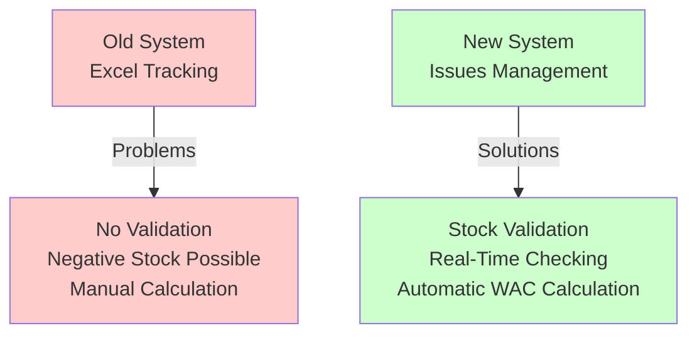
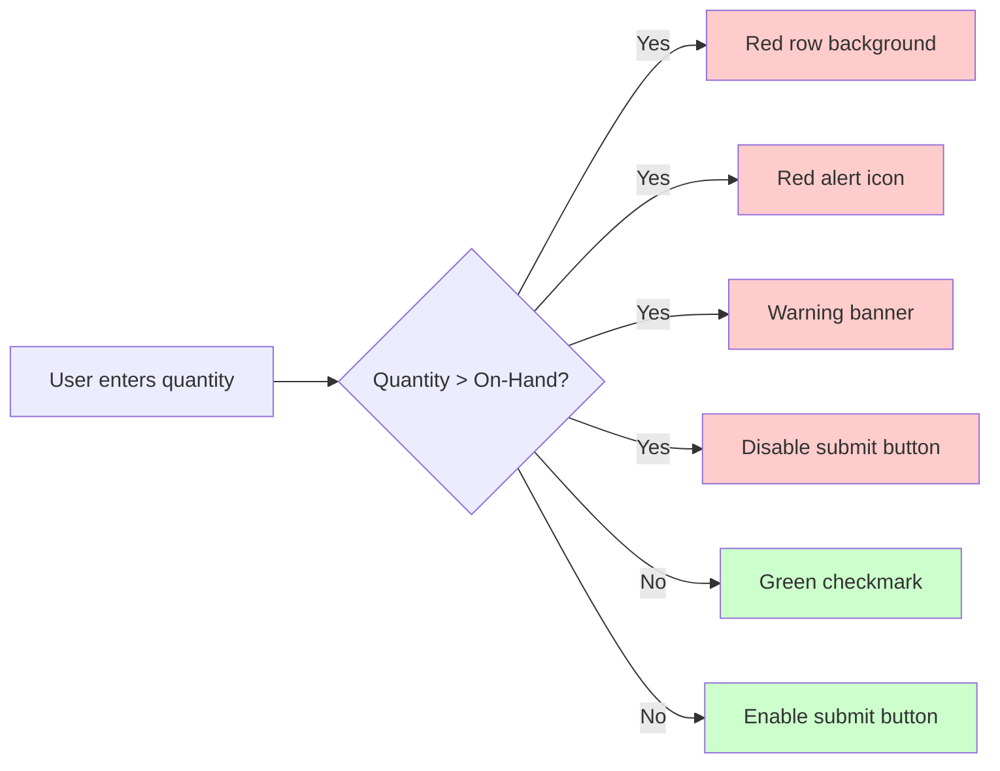
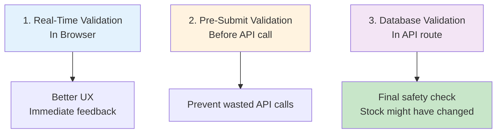

# Phase 1.8: Issues Management
## Stock Management System - Development Guide

**For Junior Developers**
**Last Updated:** November 10, 2025
**Phase Status:** ✅ Complete

---

## 📖 Quick Navigation

- [Phase 1.1: Project Foundation](phase-1.1-foundation.md)
- [Phase 1.2: Database Setup](phase-1.2-database.md)
- [Phase 1.3: Authentication & Security](phase-1.3-authentication.md)
- [Phase 1.4: Base Layout & Navigation](phase-1.4-layout-navigation.md)
- [Phase 1.5: Location Management](phase-1.5-location-management.md)
- [Phase 1.6: Items & Prices](phase-1.6-items-prices.md)
- [Phase 1.7: Deliveries with Price Variance](phase-1.7-deliveries.md)
- [Phase 1.8: Issues Management](phase-1.8-issues-management.md) ← You are here

---

## What is Issues Management?

### The Business Problem

Imagine you're running a restaurant kitchen. Every day, you need to **take items from storage** to use in cooking:

- ❌ **Old way:** Write in Excel when items are used
- ❌ **Problems:** Easy to forget, hard to track, no stock validation
- ❌ **Risk:** You might record using more than you have (negative stock!)

### Our Solution

We built an **Issues Management System** that:

- ✅ Records when items are taken from storage (issued)
- ✅ **Checks stock before allowing** the transaction (prevents negative stock)
- ✅ Automatically calculates the value using WAC (Weighted Average Cost)
- ✅ Shows real-time warnings if you try to issue more than available
- ✅ Tracks which cost center used the items (Food, Cleaning, Other)



---

## What is an "Issue"?

**Simple Explanation:**

An **Issue** = Taking items out of storage to use them

**Examples:**
- Kitchen takes 10 KG of rice to cook meals → **Issue to Food cost center**
- Cleaning staff takes 2 bottles of detergent → **Issue to Cleaning cost center**
- Taking 5 boxes of paper towels for offices → **Issue to Other cost center**

**Important:** Issues **reduce** your stock quantity but **do NOT** change the WAC (cost). They use the current WAC to calculate the value.

---

## How Issues Management Works

### The Complete Workflow

```mermaid
sequenceDiagram
    participant User as Operator/Admin
    participant UI as Create Issue Page
    participant API as Issue API
    participant Validation as Stock Validation
    participant DB as Database

    User->>UI: Fill issue form
    User->>UI: Select items & quantities
    UI->>UI: Check stock in real-time

    alt Insufficient Stock
        UI->>User: Show red warning ⚠️
        UI->>User: Disable submit button
    else Sufficient Stock
        UI->>User: Show green checkmark ✓
        User->>UI: Click "Create Issue"
        UI->>API: POST /api/locations/:id/issues
        API->>Validation: Validate all items

        alt Validation Failed
            Validation->>API: Return error with details
            API->>UI: 400 INSUFFICIENT_STOCK
            UI->>User: Show error message
        else Validation Passed
            API->>DB: Start transaction
            DB->>DB: Create issue record
            DB->>DB: Create issue lines
            DB->>DB: Deduct from stock (on_hand)
            DB->>DB: Commit transaction
            DB->>API: Return created issue
            API->>UI: Success response
            UI->>User: Show success message
            UI->>User: Redirect to issue details
        end
    end
```



### Key Concept: Stock Validation

**What happens:**

1. **Real-time check:** As you type quantities, the system checks available stock
2. **Pre-submission check:** Before saving, validates all items again
3. **Database check:** Final validation in the API before transaction starts
4. **Atomic transaction:** If any item fails, the entire issue is rejected

**Why three checks?**
- Real-time = Better user experience (immediate feedback)
- Pre-submission = Prevents wasted API calls
- Database check = **Final safety** (stock might have changed since page load)

---

## Phase 1.8: What We Built

### Tasks Completed

#### 1.8.1: Issue API Routes ✅

**Simple Explanation:**
We created the backend endpoints (API routes) that handle creating and fetching issues from the database.

**What Was Done:**

1. **GET /api/locations/:locationId/issues** - Fetch all issues for a location
   - Supports filtering by period, date range, cost center
   - Returns list of issues with totals

2. **POST /api/locations/:locationId/issues** - Create new issue
   - Validates stock availability
   - Creates issue record
   - Deducts from stock
   - Uses atomic transaction (all-or-nothing)

3. **GET /api/issues/:id** - Get single issue details
   - Shows all line items
   - Shows total value
   - Shows poster information

**Key Code Pattern:**

```typescript
// Generate sequential issue number
async function generateIssueNumber(): Promise<string> {
  const currentYear = new Date().getFullYear()
  const prefix = `ISS-${currentYear}-`

  // Format: ISS-2025-001, ISS-2025-002, etc.
  const lastIssue = await prisma.issue.findFirst({
    where: { issue_no: { startsWith: prefix } },
    orderBy: { issue_no: 'desc' },
  })

  const nextNumber = lastIssue
    ? parseInt(lastIssue.issue_no.split('-')[2]) + 1
    : 1

  return `${prefix}${nextNumber.toString().padStart(3, '0')}`
}
```

**Stock Validation in API:**

```typescript
// Check each item has sufficient stock
for (const lineData of data.lines) {
  const stock = stockMap.get(lineData.item_id)

  if (!stock || stock.on_hand < lineData.quantity) {
    insufficientStockErrors.push({
      item_name: item.name,
      requested: lineData.quantity,
      available: stock?.on_hand || 0,
    })
  }
}

// If any insufficient, return detailed error
if (insufficientStockErrors.length > 0) {
  throw createError({
    statusCode: 400,
    data: {
      code: 'INSUFFICIENT_STOCK',
      details: { errors: insufficientStockErrors }
    }
  })
}
```

---

#### 1.8.2: Stock Validation Utility ✅

**Simple Explanation:**
We created reusable functions to check if there's enough stock before issuing items.

**What Was Done:**

Created `server/utils/stockValidation.ts` with helper functions:

| Function | What It Does |
|----------|--------------|
| `checkStockSufficiency()` | Pure logic - checks if available >= requested |
| `validateSufficientStock()` | Fetches stock from DB and validates |
| `validateSufficientStockBulk()` | Validates multiple items at once |
| `createInsufficientStockError()` | Creates detailed error message |
| `getCurrentStockLevel()` | Gets current on-hand quantity |
| `hasStock()` | Checks if item has any stock |

**Why separate utility?**
- **Reusability:** Can use in Issues, Transfers, Adjustments
- **Testability:** Easy to write unit tests
- **Maintainability:** All stock logic in one place

**Example Usage:**

```typescript
// In API route
import { validateSufficientStockBulk, hasAllSufficientStock } from '~/server/utils/stockValidation'

// Validate all items
const results = await validateSufficientStockBulk(locationId, [
  { itemId: 'item-1', quantity: 10 },
  { itemId: 'item-2', quantity: 5 },
])

// Check if all passed
if (!hasAllSufficientStock(results)) {
  const insufficientItems = getInsufficientStockItems(results)
  throw createInsufficientStockError(locationId, locationName, insufficientItems)
}
```

**Test Coverage:**

Created 27 unit tests covering:
- Standard validation scenarios
- Edge cases (zero stock, exact quantity, decimals)
- Error handling
- Business workflows

---

#### 1.8.3: Issues List Page ✅

**Simple Explanation:**
We built the page where users can see all issues (like a table of all items that were issued).

**What Was Done:**

**Features:**
- Table showing: Issue No, Date, Cost Centre, Total Value
- Filters: Date range, Cost centre dropdown
- Pagination: Navigate through pages of issues
- Click row to view details
- "New Issue" button (with permission check)

**Responsive Design:**

| Screen Size | What Happens |
|-------------|--------------|
| Desktop | Full table with all columns |
| Tablet | Condensed layout |
| Mobile | Scrollable table |

**Filter System:**

```vue
// Date Range Filter
<UInput v-model="filters.startDate" type="date" />
<UInput v-model="filters.endDate" type="date" />

// Cost Centre Filter
<USelectMenu
  v-model="filters.costCentre"
  :options="['All', 'Food', 'Cleaning', 'Other']"
/>

// Active Filter Chips
<UBadge @click="clearFilter('date')">
  Date: {{ formatDate(filters.startDate) }} - {{ formatDate(filters.endDate) }}
  <UIcon name="i-lucide-x" />
</UBadge>
```

---

#### 1.8.4: Create Issue UI ✅

**Simple Explanation:**
We built the form where users enter new issues - which items and how much they're taking from storage.

**What Was Done:**

**Form Sections:**

1. **Issue Information**
   - Issue Date (date picker, defaults to today)
   - Cost Centre (dropdown: Food/Cleaning/Other)
   - Location (read-only, shows current active location)

2. **Issue Items Table**
   - Dynamic lines (add/remove rows)
   - Item selection (searchable dropdown showing stock levels)
   - Quantity input (4-decimal precision)
   - On-Hand display (shows available stock)
   - WAC display (read-only, shows current cost)
   - Line Value (auto-calculated: quantity × WAC)

**Real-Time Stock Validation:**

```typescript
// As user types, check stock
const updateLineCalculations = (line: any) => {
  const quantity = parseFloat(line.quantity) || 0
  const stockInfo = stockLevels.value[line.item_id]

  if (stockInfo) {
    line.wac = stockInfo.wac
    line.on_hand = stockInfo.on_hand
    line.line_value = quantity * stockInfo.wac

    // Check if quantity exceeds available stock
    line.has_insufficient_stock = quantity > stockInfo.on_hand
  }
}
```

**Visual Feedback:**



**Insufficient Stock Warning:**

```vue
<!-- Shows when any line has insufficient stock -->
<UAlert
  v-if="hasInsufficientStock"
  icon="i-lucide-alert-triangle"
  color="error"
  variant="subtle"
  title="Insufficient Stock"
  :description="`${insufficientStockCount} item(s) have insufficient stock`"
/>
```

**Form Validation:**

```typescript
const isFormValid = computed(() => {
  return (
    formData.value.issue_date &&
    formData.value.cost_centre &&
    lines.value.length > 0 &&
    lines.value.every(line =>
      line.item_id &&
      line.quantity &&
      parseFloat(line.quantity) > 0
    ) &&
    !hasInsufficientStock.value  // ← Key check!
  )
})
```

---

#### 1.8.5: Issue Detail Page ✅

**Simple Explanation:**
We built the page that shows complete information about one specific issue.

**What Was Done:**

**Page Sections:**

1. **Issue Header**
   - Issue Number (ISS-2025-001)
   - Issue Date (formatted: DD/MM/YYYY)
   - Cost Centre (with colored badge)
   - Location information
   - Period name
   - Posted by (user full name)
   - Posted at (timestamp)
   - Total Value (prominent display)

2. **Issue Lines Table**
   - Item details (name, code, unit, category)
   - Quantity (4 decimals)
   - WAC at Issue (historical cost - doesn't change)
   - Line Value (quantity × WAC)

3. **Summary Section**
   - Total items count
   - Total lines count
   - Grand Total value (in SAR)

**Cost Centre Badge Colors:**

```typescript
const costCentreBadgeColor = (costCentre: string) => {
  switch (costCentre) {
    case 'FOOD': return 'success'    // Green
    case 'CLEAN': return 'primary'   // Blue
    case 'OTHER': return 'neutral'   // Gray
    default: return 'neutral'
  }
}
```

**Page Layout:**

```vue
<PageHeader title="Issue Details">
  <template #breadcrumbs>
    Home / Issues / ISS-2025-001
  </template>
  <template #actions>
    <UButton @click="router.back()">Back</UButton>
    <UButton icon="i-lucide-printer">Print</UButton>
  </template>
</PageHeader>

<!-- Issue Info Card -->
<UCard>
  <dl class="grid grid-cols-2 gap-4">
    <div>
      <dt>Issue Number</dt>
      <dd>{{ issue.issue_no }}</dd>
    </div>
    <!-- ... more fields ... -->
  </dl>
</UCard>

<!-- Lines Table Card -->
<UCard>
  <table>
    <!-- ... lines ... -->
  </table>
</UCard>

<!-- Summary Card -->
<UCard>
  <div class="text-2xl font-bold">
    Total: {{ formatCurrency(issue.total_value) }}
  </div>
</UCard>
```

---

#### 1.8.6: Components ✅

**Simple Explanation:**
We created reusable pieces (components) that can be used in multiple places.

**What Was Done:**

Created 3 components:

##### 1. **IssueForm.vue** - Complete Issue Form

**Purpose:** Encapsulates all form logic in one reusable component

**Props:**
- `suppliers` - List of suppliers
- `items` - List of items with stock
- `periodPrices` - Period-locked prices (not used in issues)
- `submitLabel` - Custom submit button text

**Emits:**
- `@submit` - When form is valid and submitted
- `@cancel` - When user clicks cancel

**Usage:**
```vue
<IssueForm
  :items="items"
  :stock-levels="stockLevels"
  submit-label="Create Issue"
  @submit="handleSubmit"
  @cancel="handleCancel"
/>
```

##### 2. **IssueLineInput.vue** - Single Line Row

**Purpose:** Table row for one issue line

**Props:**
- `line` - Line data (item_id, quantity, wac, on_hand)
- `items` - Available items
- `stockLevels` - Stock info map
- `canRemove` - Whether remove button is enabled

**Features:**
- Item dropdown with search
- On-hand quantity display
- Quantity input with validation
- WAC display (read-only)
- Line value calculation
- Visual indicators (red for insufficient stock)

**Example:**
```vue
<tr>
  <IssueLineInput
    :line="line"
    :items="items"
    :stock-levels="stockLevels"
    :can-remove="lines.length > 1"
    @update="updateLine"
    @remove="removeLine"
  />
</tr>
```

##### 3. **StockAlert.vue** - Stock Warning Component

**Purpose:** Display stock-related warnings

**Props:**
- `type` - Alert type (error/warning/info)
- `variant` - Visual style (subtle/solid/outline)
- `title` - Alert title
- `message` - Alert message
- `items` - Insufficient stock items (optional)
- `dismissible` - Whether can close

**Usage:**
```vue
<StockAlert
  type="error"
  variant="subtle"
  title="Insufficient Stock"
  :items="insufficientStockItems"
  dismissible
/>
```

**Component Benefits:**

| Benefit | Explanation |
|---------|-------------|
| **Reusability** | Use same form in create/edit pages |
| **Testability** | Test components in isolation |
| **Maintainability** | Fix bugs in one place |
| **Consistency** | Same UI across all pages |

---

## Important Files Created

### API Routes

| File | Purpose |
|------|---------|
| `server/api/locations/[locationId]/issues/index.get.ts` | Fetch issues list with filters |
| `server/api/locations/[locationId]/issues/index.post.ts` | Create new issue with validation |
| `server/api/issues/[id].get.ts` | Get single issue details |

### Utilities

| File | Purpose |
|------|---------|
| `server/utils/stockValidation.ts` | Stock validation logic (27 tests) |

### Pages

| File | Purpose |
|------|---------|
| `app/pages/issues/index.vue` | Issues list with filters |
| `app/pages/issues/create.vue` | Create new issue form |
| `app/pages/issues/[id].vue` | Issue detail view |

### Components

| File | Purpose |
|------|---------|
| `app/components/issue/IssueForm.vue` | Reusable issue form |
| `app/components/issue/IssueLineInput.vue` | Single line input row |
| `app/components/common/StockAlert.vue` | Stock warning alerts |

---

## Key Concepts Learned

### 1. Atomic Transactions

**What is it?**
A transaction ensures **all database operations succeed or all fail** together.

**Why important?**
When creating an issue:
1. Create issue record
2. Create 5 issue lines
3. Update stock for 5 items

If step 3 fails, we DON'T want steps 1-2 to succeed!

**How we did it:**

```typescript
// Wrap everything in a transaction
const result = await prisma.$transaction(async (tx) => {
  // Create issue
  const issue = await tx.issue.create({...})

  // Create lines
  for (const lineData of data.lines) {
    await tx.issueLine.create({...})

    // Update stock
    await tx.locationStock.update({
      where: { location_id_item_id: {...} },
      data: { on_hand: currentStock - quantity }
    })
  }

  return issue
})
// ↑ If ANY operation fails, ALL are rolled back
```

### 2. WAC vs Issues

**Important Rule:**

| Transaction Type | WAC Calculation |
|------------------|-----------------|
| **Delivery** | ✅ **YES** - Recalculates WAC |
| **Issue** | ❌ **NO** - Uses current WAC but doesn't change it |

**Why?**

- **Deliveries** bring new items at new prices → WAC changes
- **Issues** just use existing stock → WAC stays the same

**Example:**

```typescript
// In Delivery API
const newWAC = calculateWAC(
  currentQty,
  currentWAC,
  receivedQty,
  receiptPrice
)

await tx.locationStock.update({
  data: {
    on_hand: currentQty + receivedQty,
    wac: newWAC  // ← WAC CHANGES
  }
})
```

```typescript
// In Issue API
await tx.locationStock.update({
  data: {
    on_hand: currentQty - issuedQty,
    // wac: wac  ← WAC STAYS THE SAME (no update)
  }
})

// But we record the WAC at time of issue
await tx.issueLine.create({
  data: {
    wac_at_issue: currentWAC,  // Historical record
    line_value: quantity * currentWAC
  }
})
```

### 3. Three-Level Validation

**Why validate multiple times?**



**Real-world scenario:**

1. User loads page at 10:00 AM (Stock: 100 KG)
2. User fills form for 50 KG
3. Real-time check: ✅ 50 <= 100 (PASS)
4. **Another user issues 60 KG at 10:05 AM** (Stock now: 40 KG)
5. First user submits at 10:10 AM
6. API validation: ❌ 50 > 40 (FAIL - prevents negative stock!)

### 4. Error Handling with Details

**Bad error message:**
```
❌ "Insufficient stock"
```

**Good error message:**
```
✅ "Insufficient stock for 2 item(s):
   - Rice (RICE-001): requested 50 KG, available 40 KG
   - Oil (OIL-001): requested 10 LTR, available 5 LTR"
```

**How we did it:**

```typescript
// Build detailed error message
const insufficientStockErrors = lines
  .filter(line => line.quantity > stockMap.get(line.item_id).on_hand)
  .map(line => ({
    item_name: line.item.name,
    item_code: line.item.code,
    requested: line.quantity,
    available: stockMap.get(line.item_id).on_hand
  }))

// Return with details
throw createError({
  statusCode: 400,
  data: {
    code: 'INSUFFICIENT_STOCK',
    message: `Insufficient stock for ${insufficientStockErrors.length} item(s)`,
    details: {
      errors: insufficientStockErrors,
      messages: insufficientStockErrors.map(e =>
        `${e.item_name} (${e.item_code}): requested ${e.requested}, available ${e.available}`
      )
    }
  }
})
```

### 5. Cost Centers

**What are they?**

Cost centers = Different departments/categories that consume stock

**Why important?**

Helps business understand:
- How much is spent on food vs cleaning?
- Which department uses the most stock?
- Where to optimize costs?

**Our implementation:**

```typescript
enum CostCentre {
  FOOD = 'FOOD',      // Kitchen/Restaurant use
  CLEAN = 'CLEAN',    // Cleaning supplies
  OTHER = 'OTHER'     // Everything else
}
```

**Reporting benefit:**

```sql
-- Get total issues by cost center for a period
SELECT
  cost_centre,
  COUNT(*) as issue_count,
  SUM(total_value) as total_value
FROM issues
WHERE period_id = 'current-period'
GROUP BY cost_centre

-- Result:
-- FOOD:  1,245,000 SAR (80%)
-- CLEAN:   245,000 SAR (15%)
-- OTHER:    75,000 SAR (5%)
```

---

## Database Operations Explained

### Issue Creation Flow

```mermaid
sequenceDiagram
    participant API
    participant TX as Transaction
    participant Issue
    participant IssueLine
    participant Stock

    API->>TX: Start transaction

    TX->>Issue: 1. Create issue record
    Note right of Issue: issue_no: ISS-2025-001<br/>total_value: 0 (updated later)

    loop For each line
        TX->>IssueLine: 2. Create issue line
        Note right of IssueLine: quantity: 10<br/>wac_at_issue: 15.50<br/>line_value: 155.00

        TX->>Stock: 3. Deduct from stock
        Note right of Stock: on_hand: 100 → 90<br/>wac: 15.50 (unchanged)
    end

    TX->>Issue: 4. Update total_value
    Note right of Issue: total_value: sum of all lines

    TX->>API: Commit transaction
    API->>User: Return created issue
```



### Before Transaction:

```
LocationStock Table:
┌──────────┬──────────┬─────────┬──────┐
│ location │ item     │ on_hand │ wac  │
├──────────┼──────────┼─────────┼──────┤
│ KITCHEN  │ RICE-001 │ 100.00  │ 15.50│
│ KITCHEN  │ OIL-001  │  50.00  │ 25.00│
└──────────┴──────────┴─────────┴──────┘
```

### After Issue (10 KG Rice, 5 LTR Oil):

```
Issues Table:
┌─────────────┬──────────┬──────────┬─────────────┐
│ issue_no    │ location │ cost_ctr │ total_value │
├─────────────┼──────────┼──────────┼─────────────┤
│ ISS-2025-001│ KITCHEN  │ FOOD     │ 280.00      │
└─────────────┴──────────┴──────────┴─────────────┘

IssueLines Table:
┌──────────┬──────────┬──────────┬──────────────┬────────────┐
│ issue_no │ item     │ quantity │ wac_at_issue │ line_value │
├──────────┼──────────┼──────────┼──────────────┼────────────┤
│ ISS-001  │ RICE-001 │   10.00  │    15.50     │   155.00   │
│ ISS-001  │ OIL-001  │    5.00  │    25.00     │   125.00   │
└──────────┴──────────┴──────────┴──────────────┴────────────┘

LocationStock Table:
┌──────────┬──────────┬─────────┬──────┐
│ location │ item     │ on_hand │ wac  │
├──────────┼──────────┼─────────┼──────┤
│ KITCHEN  │ RICE-001 │  90.00  │ 15.50│ ← Quantity reduced
│ KITCHEN  │ OIL-001  │  45.00  │ 25.00│ ← Quantity reduced
└──────────┴──────────┴─────────┴──────┘
                                 ↑ WAC unchanged!
```

---

## Common Pitfalls to Avoid

### ❌ Don't: Allow negative stock

```typescript
// Bad - no validation
await prisma.locationStock.update({
  data: { on_hand: currentStock - quantity }
  // ← What if quantity > currentStock? Negative stock!
})
```

```typescript
// Good - validate first
if (currentStock < quantity) {
  throw createError({
    statusCode: 400,
    data: { code: 'INSUFFICIENT_STOCK' }
  })
}

await prisma.locationStock.update({
  data: { on_hand: currentStock - quantity }
})
```

### ❌ Don't: Recalculate WAC on issues

```typescript
// Bad - issues should NOT change WAC
const newWAC = calculateWAC(...)  // ← Wrong!
await prisma.locationStock.update({
  data: {
    on_hand: currentStock - quantity,
    wac: newWAC  // ← Should not update WAC
  }
})
```

```typescript
// Good - keep WAC unchanged
await prisma.locationStock.update({
  data: {
    on_hand: currentStock - quantity
    // No WAC update - it stays the same
  }
})
```

### ❌ Don't: Forget atomic transactions

```typescript
// Bad - not in transaction
const issue = await prisma.issue.create({...})
const line1 = await prisma.issueLine.create({...})
const line2 = await prisma.issueLine.create({...})
// ← If line2 fails, issue and line1 are still created!
```

```typescript
// Good - use transaction
await prisma.$transaction(async (tx) => {
  const issue = await tx.issue.create({...})
  const line1 = await tx.issueLine.create({...})
  const line2 = await tx.issueLine.create({...})
  // ← If any fails, all are rolled back
})
```

### ❌ Don't: Show generic errors

```typescript
// Bad
catch (error) {
  toast.error('Failed to create issue')
  // ← User has no idea what went wrong
}
```

```typescript
// Good
catch (error) {
  if (error.data?.code === 'INSUFFICIENT_STOCK') {
    const items = error.data.details.errors
    const itemList = items.map(i =>
      `${i.item_name}: requested ${i.requested}, available ${i.available}`
    ).join('; ')

    toast.error('Insufficient Stock', itemList)
    // ← Clear, actionable error message
  } else {
    toast.error('Failed to create issue', error.message)
  }
}
```

### ❌ Don't: Trust client-side validation only

```typescript
// Bad - only validate in UI
if (quantity > onHand) {
  alert('Insufficient stock')
  return
}

await createIssue(...)  // ← API has no validation!
```

```typescript
// Good - validate on BOTH sides
// 1. Client-side (UX)
if (quantity > onHand) {
  showError('Insufficient stock')
  return
}

// 2. Server-side (Security)
await createIssue(...)  // ← API also validates
```

---

## Testing the Features

### Manual Testing Checklist

**Issues List Page:**
- [ ] Page loads without errors
- [ ] Shows all issues for active location
- [ ] Date filter works
- [ ] Cost center filter works
- [ ] Pagination works
- [ ] Click row navigates to details
- [ ] "New Issue" button shows for authorized users

**Create Issue Page:**
- [ ] Page loads without errors
- [ ] Can select items from dropdown
- [ ] Shows current stock level
- [ ] Quantity input accepts decimals
- [ ] WAC displays correctly
- [ ] Line value calculates automatically
- [ ] Can add/remove lines
- [ ] Red warning shows when insufficient stock
- [ ] Submit button disabled when insufficient stock
- [ ] Success message shows on submit
- [ ] Redirects to issue details after creation

**Issue Detail Page:**
- [ ] Page loads without errors
- [ ] Shows all issue information
- [ ] Shows all line items
- [ ] Calculates total correctly
- [ ] Displays cost center badge
- [ ] Shows poster information

**Stock Validation:**
- [ ] Real-time validation works in UI
- [ ] API rejects when insufficient stock
- [ ] Error message includes item details
- [ ] Transaction rolls back on error

---

## Performance Considerations

### Optimization Strategies

**1. Fetch stock data once:**

```typescript
// ✅ Good - fetch all items with stock in one query
const items = await $fetch('/api/items', {
  query: {
    locationId: activeLocationId,
    limit: 500
  }
})

// Build stock map
const stockLevels = {}
items.forEach(item => {
  if (item.location_stock?.length > 0) {
    stockLevels[item.id] = item.location_stock[0]
  }
})
```

```typescript
// ❌ Bad - fetch stock for each item separately
for (const item of items) {
  const stock = await $fetch(`/api/items/${item.id}/stock`)
  // ← N queries instead of 1!
}
```

**2. Use indexes for queries:**

```prisma
// In Prisma schema
model Issue {
  // Indexes for common queries
  @@index([location_id, issue_date])
  @@index([period_id, cost_centre])
  @@index([issue_no])
}
```

**3. Limit data in list view:**

```typescript
// Only fetch what's needed for the list
const issues = await prisma.issue.findMany({
  select: {
    id: true,
    issue_no: true,
    issue_date: true,
    cost_centre: true,
    total_value: true,
    // Don't include lines in list view
  },
  take: 50,  // Pagination
  skip: (page - 1) * 50,
})
```

---

## Common Terms Explained

| Term | Simple Explanation | Example |
|------|-------------------|---------|
| **Issue** | Taking items from storage to use | Kitchen takes 10 KG rice |
| **Cost Center** | Department/category using the items | Food, Cleaning, Other |
| **WAC** | Weighted Average Cost (average price per unit) | 15.50 SAR per KG |
| **On-Hand** | Quantity currently in stock | 100.00 KG available |
| **Line Value** | Cost of one line (quantity × WAC) | 10 KG × 15.50 = 155.00 SAR |
| **Atomic Transaction** | All operations succeed or all fail | Create issue + deduct stock (both or neither) |
| **Stock Validation** | Checking if enough items are available | Requested 50, available 40 = FAIL |
| **Insufficient Stock** | Not enough items to fulfill request | Want 100, have 40 |
| **Real-time Validation** | Checking as user types | Red warning appears immediately |
| **Sequential Number** | Auto-generated number in order | ISS-2025-001, ISS-2025-002, ... |

---

## What's Next?

After completing Issues Management, we move to:

**→ Phase 1.9: Stock Now & Dashboard**

In the next phase, we will:
- Create Stock Now page showing current inventory levels
- Build consolidated stock view across all locations
- Create dashboard with key metrics and recent activity
- Add quick action shortcuts
- Implement export to CSV functionality

---

## Summary

### What We Accomplished

✅ **Backend (API):**
- Created 3 API endpoints for issues
- Implemented stock validation utility with 27 tests
- Added atomic transactions for data integrity
- Built sequential numbering system

✅ **Frontend (UI):**
- Created issues list page with filters
- Built create issue form with real-time validation
- Developed issue detail page
- Made 3 reusable components

✅ **Business Logic:**
- Stock validation prevents negative inventory
- WAC-based valuation without recalculation
- Cost center tracking for expenses
- Comprehensive error handling with details

### Key Achievements

🎯 **Zero negative stock:** Impossible to issue more than available

🎯 **Real-time feedback:** Users see warnings before submitting

🎯 **Accurate valuation:** Uses current WAC, preserves historical cost

🎯 **Audit trail:** Complete history of who issued what and when

---

**Made with ❤️ for Junior Developers**

---

**Last Updated:** November 10, 2025
**Phase:** 1.8 Issues Management ✅ Complete
**Next:** [Phase 1.9: Stock Now & Dashboard](phase-1.9-stock-dashboard.md)
