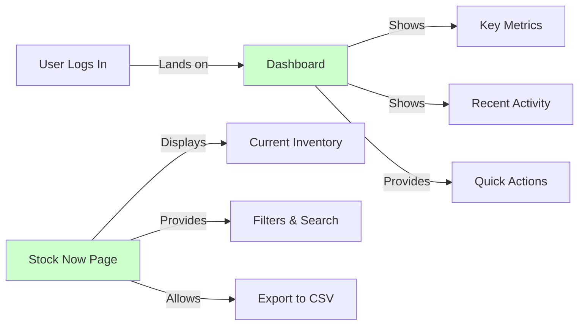
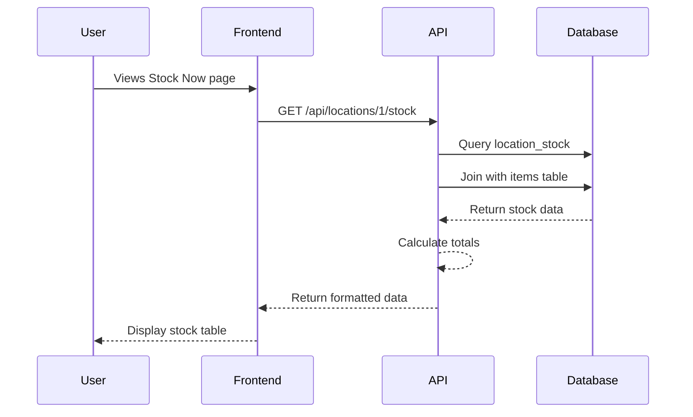
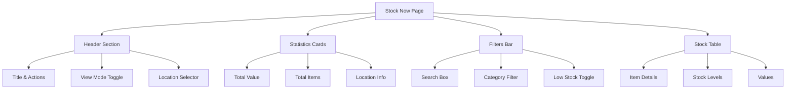
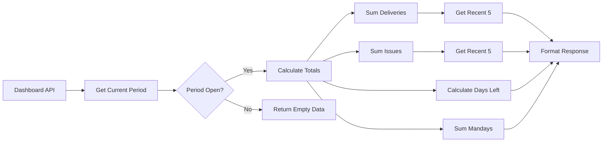
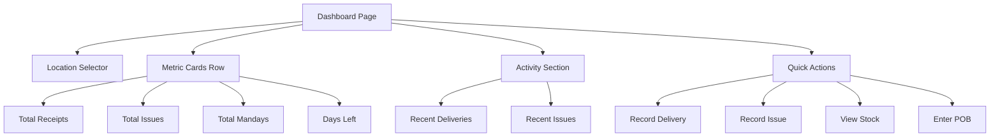
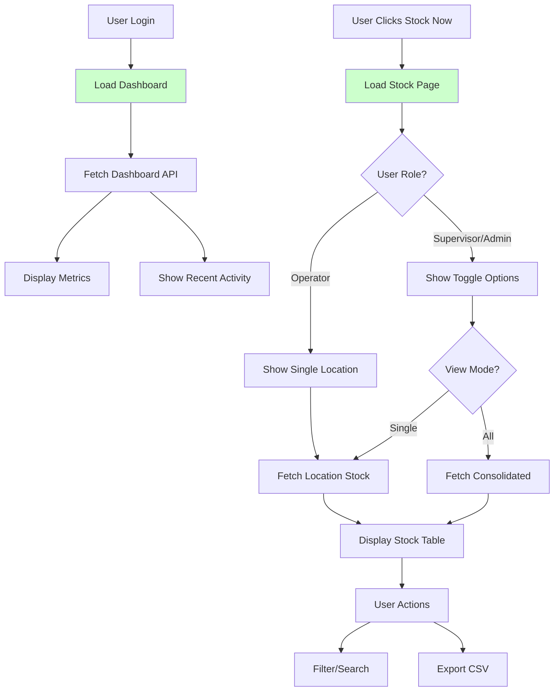

# Phase 1.9: Stock Now & Dashboard
## Stock Management System - Development Guide

**For Junior Developers**
**Last Updated:** November 11, 2025
**Phase Status:** ✅ Complete

---

## 📖 Quick Navigation

- [Phase 1.1: Project Foundation](phase-1.1-foundation.md)
- [Phase 1.2: Database Setup](phase-1.2-database.md)
- [Phase 1.3: Authentication & Security](phase-1.3-authentication.md)
- [Phase 1.4: Layout & Navigation](phase-1.4-layout-navigation.md)
- [Phase 1.5: Location Management](phase-1.5-location-management.md)
- [Phase 1.6: Items Management](phase-1.6-items-management.md)
- [Phase 1.7: Deliveries](phase-1.7-deliveries.md)
- [Phase 1.8: Issues Management](phase-1.8-issues-management.md)
- [Phase 1.9: Stock Now & Dashboard](phase-1.9-stock-dashboard.md) ← You are here

---

## What is This Phase About?

### The Goal

In Phase 1.9, we built the **final key views** that bring everything together:

1. **Stock Now Page** - Real-time view of current inventory levels
2. **Dashboard** - Main landing page with key metrics and recent activity

These pages give users quick insights into their business operations at a glance.

### What Problems Does This Solve?

Before this phase:
- ❌ Users had no way to see current stock levels
- ❌ No overview of daily operations
- ❌ Had to navigate multiple pages to find information
- ❌ No quick access to important metrics

After this phase:
- ✅ Real-time stock visibility
- ✅ Dashboard with key performance indicators (KPIs)
- ✅ Recent activity at a glance
- ✅ Quick action buttons for common tasks



---

## Part 1: Stock Now API (Task 1.9.1)

### What is Stock Now?

**Stock Now** shows the current inventory levels at any point in time. It's like taking a snapshot of what items you have and their values.

### API Endpoints Created

#### 1. Location-Specific Stock: `/api/locations/[locationId]/stock`

**Purpose:** Get current stock for a specific location

**File:** `server/api/locations/[locationId]/stock.get.ts`

```typescript
// Example Response
{
  stock: [
    {
      item_id: "123",
      item_code: "RICE001",
      item_name: "Basmati Rice",
      unit: "KG",
      category: "Rice",
      on_hand: 500,
      wac: 12.50,      // Weighted Average Cost
      total_value: 6250.00
    },
    // ... more items
  ],
  stats: {
    total_value: 125000.00,
    total_items: 42,
    low_stock_items: 5
  }
}
```

**Key Features:**
- Fetches current stock with item details
- Calculates total value (quantity × WAC)
- Supports filters (category, low stock)
- Role-based access control

#### 2. Consolidated Stock: `/api/stock/consolidated`

**Purpose:** Get stock across ALL locations (supervisors/admins only)

**File:** `server/api/stock/consolidated.get.ts`

```typescript
// Example Response
{
  items: [
    {
      item_id: "123",
      item_code: "RICE001",
      item_name: "Basmati Rice",
      unit: "KG",
      category: "Rice",
      locations: {
        "loc1": { on_hand: 300, wac: 12.50, value: 3750 },
        "loc2": { on_hand: 200, wac: 12.75, value: 2550 }
      },
      total_on_hand: 500,
      total_value: 6300
    }
  ],
  summary: {
    total_value: 450000,
    total_items: 42,
    total_locations: 4
  }
}
```

### How Stock API Works



---

## Part 2: Stock Now Page (Task 1.9.2)

### Page Structure

**File:** `app/pages/stock-now.vue`

The Stock Now page has these main sections:



### Key Features Explained

#### 1. View Modes (Supervisors/Admins Only)

```vue
<template>
  <!-- Toggle between Single Location and All Locations -->
  <UButtonGroup>
    <UButton
      :variant="viewMode === 'single' ? 'solid' : 'ghost'"
      @click="viewMode = 'single'"
    >
      Single Location
    </UButton>
    <UButton
      :variant="viewMode === 'all' ? 'solid' : 'ghost'"
      @click="viewMode = 'all'"
    >
      All Locations
    </UButton>
  </UButtonGroup>
</template>
```

#### 2. Filtering System

The page has three types of filters:

1. **Search** - Find items by name or code
2. **Category** - Filter by item category
3. **Low Stock** - Show only items below minimum level

```typescript
// How filters work together
const filteredStock = computed(() => {
  let items = stock.value

  // Apply search filter
  if (searchQuery.value) {
    items = items.filter(item =>
      item.name.includes(searchQuery) ||
      item.code.includes(searchQuery)
    )
  }

  // Apply category filter
  if (selectedCategory.value) {
    items = items.filter(item =>
      item.category === selectedCategory.value
    )
  }

  // Apply low stock filter
  if (showLowStock.value) {
    items = items.filter(item =>
      item.on_hand < item.min_stock
    )
  }

  return items
})
```

#### 3. Export to CSV

Users can download stock data as a CSV file:

```typescript
function exportToCSV() {
  // Create CSV header
  const headers = ['Code', 'Name', 'Unit', 'Category', 'On Hand', 'WAC', 'Total Value']

  // Convert data to CSV format
  const rows = filteredStock.value.map(item => [
    item.item_code,
    item.item_name,
    item.unit,
    item.category,
    item.on_hand,
    item.wac,
    item.total_value
  ])

  // Create downloadable file
  const csvContent = [headers, ...rows]
    .map(row => row.join(','))
    .join('\n')

  // Trigger download
  downloadFile(csvContent, 'stock-now.csv')
}
```

### Visual Design

The page uses our brand colors consistently:

- **Navy (#000046)** - Primary actions and headers
- **Emerald (#45cf7b)** - Success states and positive values
- **Amber** - Low stock warnings
- **Red** - Critical stock alerts

```css
/* Example of color usage */
.metric-card {
  background: var(--ui-bg-elevated);
  border: 1px solid var(--ui-border);
}

.low-stock-badge {
  background: var(--ui-warning);
  color: var(--ui-warning-foreground);
}

.value-positive {
  color: var(--ui-success);
}
```

---

## Part 3: Dashboard API (Task 1.9.3)

### Dashboard Data Requirements

The dashboard needs to show:

1. **Period Totals** - Summary of current period activity
2. **Recent Deliveries** - Last 5 deliveries
3. **Recent Issues** - Last 5 issues
4. **Period Information** - Current period status

### API Endpoint: `/api/locations/[locationId]/dashboard`

**File:** `server/api/locations/[locationId]/dashboard.get.ts`

```typescript
// Example Response
{
  location: {
    id: "loc1",
    code: "KITCHEN-01",
    name: "Main Kitchen"
  },
  period: {
    id: "period1",
    name: "Nov 2025",
    start_date: "2025-11-01",
    end_date: "2025-11-30",
    status: "OPEN",
    days_left: 19
  },
  totals: {
    total_receipts: 125000.50,  // Sum of all deliveries
    total_issues: 85000.25,      // Sum of all issues
    total_mandays: 450,          // Sum of POB crew counts
    days_left: 19                // Days until period ends
  },
  recent_deliveries: [
    {
      id: "del1",
      delivery_no: "DEL-2025-0145",
      delivery_date: "2025-11-10",
      supplier_name: "ABC Foods",
      total_amount: 5250.75,
      has_price_variance: false
    }
    // ... 4 more
  ],
  recent_issues: [
    {
      id: "iss1",
      issue_no: "ISS-2025-0089",
      issue_date: "2025-11-10",
      cost_centre_name: "Restaurant",
      total_value: 1250.50
    }
    // ... 4 more
  ]
}
```

### How Dashboard Calculations Work



### Key Calculations Explained

#### Days Left in Period

```typescript
function calculateDaysLeft(endDate: Date): number {
  const today = new Date()
  const end = new Date(endDate)

  // Set time to midnight for accurate day calculation
  today.setHours(0, 0, 0, 0)
  end.setHours(23, 59, 59, 999)

  // Calculate difference in milliseconds
  const diff = end.getTime() - today.getTime()

  // Convert to days and round up
  const daysLeft = Math.ceil(diff / (1000 * 60 * 60 * 24))

  // Return 0 if period has ended
  return Math.max(0, daysLeft)
}
```

#### Total Mandays from POB

```typescript
// POB (Personnel On Board) tracks daily crew counts
const totalMandays = await prisma.pOB.aggregate({
  where: {
    location_id: locationId,
    period_id: currentPeriod.id
  },
  _sum: {
    crew_count: true,
    extra_count: true
  }
})

// Total = crew + extra personnel
const mandays = (totalMandays._sum.crew_count || 0) +
                (totalMandays._sum.extra_count || 0)
```

---

## Part 4: Dashboard Page & Components (Tasks 1.9.4 & 1.9.5)

### Dashboard Layout

**File:** `app/pages/index.vue`

The dashboard is organized into distinct sections:



### Component 1: MetricCard

**File:** `app/components/dashboard/MetricCard.vue`

A reusable card component for displaying key metrics:

```vue
<template>
  <div class="metric-card" :class="`metric-card--${color}`">
    <!-- Icon -->
    <div class="metric-card__icon">
      <UIcon :name="icon" />
    </div>

    <!-- Content -->
    <div class="metric-card__content">
      <p class="metric-card__label">{{ label }}</p>
      <p class="metric-card__value">
        <span v-if="loading">
          <UIcon name="i-heroicons-arrow-path" class="animate-spin" />
        </span>
        <span v-else>{{ formattedValue }}</span>
      </p>

      <!-- Optional trend indicator -->
      <p v-if="trend" class="metric-card__trend">
        <UIcon :name="trendIcon" />
        {{ Math.abs(trend) }}%
      </p>
    </div>
  </div>
</template>

<script setup lang="ts">
interface Props {
  label: string
  value: number | string
  icon: string
  color?: 'primary' | 'secondary' | 'success' | 'error' | 'neutral'
  format?: 'currency' | 'number' | 'text'
  trend?: number
  loading?: boolean
}

const props = withDefaults(defineProps<Props>(), {
  color: 'neutral',
  format: 'number',
  loading: false
})

// Format value based on type
const formattedValue = computed(() => {
  if (props.format === 'currency') {
    return formatCurrency(props.value as number)
  }
  if (props.format === 'number') {
    return props.value.toLocaleString()
  }
  return props.value
})

// Determine trend icon
const trendIcon = computed(() => {
  if (!props.trend) return ''
  return props.trend > 0
    ? 'i-heroicons-arrow-trending-up'
    : 'i-heroicons-arrow-trending-down'
})
</script>
```

### Component 2: RecentActivity

**File:** `app/components/dashboard/RecentActivity.vue`

Displays a list of recent transactions:

```vue
<template>
  <div class="recent-activity">
    <!-- Header -->
    <div class="recent-activity__header">
      <h3>{{ title }}</h3>
      <UButton
        v-if="viewAllLink"
        variant="link"
        size="sm"
        :to="viewAllLink"
      >
        View All →
      </UButton>
    </div>

    <!-- Items List -->
    <div class="recent-activity__list">
      <template v-if="loading">
        <USkeleton v-for="i in 3" :key="i" class="h-16 mb-2" />
      </template>

      <template v-else-if="items.length > 0">
        <div
          v-for="item in items"
          :key="item.id"
          class="recent-activity__item"
          @click="handleItemClick(item)"
        >
          <div class="item-info">
            <p class="item-number">{{ item.number }}</p>
            <p class="item-date">{{ formatDate(item.date) }}</p>
            <p class="item-party">{{ item.party }}</p>
          </div>

          <div class="item-amount">
            <UBadge v-if="item.badge" :color="item.badge.color">
              {{ item.badge.text }}
            </UBadge>
            <p class="amount">{{ formatCurrency(item.amount) }}</p>
          </div>
        </div>
      </template>

      <template v-else>
        <div class="empty-state">
          <UIcon name="i-heroicons-inbox" class="text-4xl" />
          <p>{{ emptyMessage || 'No recent activity' }}</p>
        </div>
      </template>
    </div>
  </div>
</template>
```

### Dashboard Page Implementation

The main dashboard page brings everything together:

```typescript
// app/pages/index.vue
<script setup lang="ts">
// Stores
const locationStore = useLocationStore()
const periodStore = usePeriodStore()

// Data fetching
const { data, pending, error, refresh } = await useFetch(
  `/api/locations/${locationStore.currentLocationId}/dashboard`
)

// Watch for location changes
watch(() => locationStore.currentLocationId, () => {
  refresh()
})

// Format recent deliveries for display
const recentDeliveries = computed(() => {
  return data.value?.recent_deliveries.map(del => ({
    id: del.id,
    number: del.delivery_no,
    date: del.delivery_date,
    party: del.supplier_name,
    amount: del.total_amount,
    badge: del.has_price_variance ? {
      text: 'Price Variance',
      color: 'warning'
    } : undefined
  })) || []
})

// Navigation handlers
function goToDeliveryDetail(id: string) {
  navigateTo(`/deliveries/${id}`)
}

function goToIssueDetail(id: string) {
  navigateTo(`/issues/${id}`)
}
</script>
```

---

## How Everything Works Together

### Complete Flow Diagram



### State Management

Both pages use Pinia stores for state management:

```typescript
// Location Store - Tracks current location
const locationStore = useLocationStore()
locationStore.currentLocationId // Currently selected location

// Period Store - Tracks current period
const periodStore = usePeriodStore()
periodStore.currentPeriod // Active period information

// User Store - Tracks user permissions
const userStore = useUserStore()
userStore.hasRole(['supervisor', 'admin']) // Check permissions
```

---

## Testing Phase 1.9

### API Testing

Created test scripts to validate all endpoints:

**File:** `test-stock-api.mjs`

```javascript
// Test location-specific stock
const locationStock = await fetch('/api/locations/loc1/stock')
assert(locationStock.stock.length > 0, 'Should return stock items')
assert(locationStock.stats.total_value > 0, 'Should calculate total value')

// Test consolidated stock (admin only)
const consolidated = await fetch('/api/stock/consolidated')
assert(consolidated.items.length > 0, 'Should return consolidated items')
assert(consolidated.summary.total_locations > 0, 'Should count locations')

// Test filters
const filtered = await fetch('/api/locations/loc1/stock?category=Rice')
assert(filtered.stock.every(i => i.category === 'Rice'), 'Should filter by category')
```

### UI Testing with Playwright

Automated browser testing for user interactions:

```javascript
// Test dashboard loading
await page.goto('http://localhost:3000')
await expect(page.locator('.metric-card')).toHaveCount(4)
await expect(page.getByText('Total Receipts')).toBeVisible()

// Test navigation to Stock Now
await page.click('text=View Stock')
await expect(page).toHaveURL('/stock-now')
await expect(page.locator('.stock-table')).toBeVisible()

// Test filtering
await page.fill('input[placeholder="Search items..."]', 'Rice')
await expect(page.locator('.stock-row')).toContainText('Rice')
```

---

## Common Issues and Solutions

### Issue 1: Slow Stock Page Loading

**Problem:** Page takes too long with many items

**Solution:** Implement pagination and virtual scrolling:

```typescript
// Use pagination
const { data } = await useFetch('/api/stock', {
  query: {
    page: currentPage.value,
    limit: 50
  }
})

// Or use virtual scrolling for large lists
<VirtualList
  :items="stock"
  :item-height="60"
  :visible-items="10"
/>
```

### Issue 2: Dashboard Not Updating

**Problem:** Dashboard shows old data after changes

**Solution:** Implement refresh mechanism:

```typescript
// Auto-refresh every 30 seconds
const refreshInterval = setInterval(() => {
  refresh()
}, 30000)

// Clean up on unmount
onUnmounted(() => {
  clearInterval(refreshInterval)
})

// Manual refresh button
<UButton @click="refresh" icon="i-heroicons-arrow-path">
  Refresh
</UButton>
```

### Issue 3: CSV Export Memory Issues

**Problem:** Large exports crash browser

**Solution:** Stream data or paginate export:

```typescript
// Export in chunks
async function exportLargeCSV() {
  const chunks = []
  let page = 1
  let hasMore = true

  while (hasMore) {
    const data = await fetchStockPage(page)
    chunks.push(data.items)
    hasMore = data.hasNextPage
    page++
  }

  // Combine and download
  const allData = chunks.flat()
  downloadCSV(allData)
}
```

---

## Key Learnings

### 1. Performance Optimization

- **Use computed properties** for filtered data instead of methods
- **Debounce search input** to reduce API calls
- **Cache dashboard data** for quick navigation

### 2. User Experience

- **Show loading states** while fetching data
- **Provide empty states** with helpful messages
- **Add error boundaries** to handle failures gracefully

### 3. Data Consistency

- **Always validate** data from API before displaying
- **Handle edge cases** like no period, no stock, etc.
- **Format consistently** using utility functions

### 4. Security Considerations

- **Check permissions** on both frontend and backend
- **Validate location access** for every request
- **Sanitize exports** to prevent injection attacks

---

## Next Steps

After Phase 1.9, the application has:

✅ Complete inventory management (deliveries, issues)
✅ Real-time stock visibility
✅ Comprehensive dashboard
✅ Multi-location support
✅ Role-based access control

**Next phases will add:**
- Transfer management between locations
- Period closing and reconciliation
- Advanced reporting and analytics
- Mobile app enhancements

---

## Summary

Phase 1.9 completes the core user experience by providing:

1. **Stock Now** - Real-time inventory visibility with filtering and export
2. **Dashboard** - Central hub for daily operations with KPIs and quick actions

These features transform raw data into actionable insights, helping users make informed decisions about their inventory management.

The modular component architecture ensures these features are maintainable and can be easily enhanced in future phases.

---

## Resources

- [Nuxt 4 Documentation](https://nuxt.com/docs)
- [Nuxt UI Components](https://ui.nuxt.com)
- [Pinia State Management](https://pinia.vuejs.org)
- [Tailwind CSS](https://tailwindcss.com/docs)
- [Project Documentation](../README.md)

---

**Remember:** Good code is not just working code - it's code that others can understand, maintain, and build upon. Keep it simple, document well, and test thoroughly! 🚀