# Phase 1 Development Guide - Complete System Overview

**For Junior Developers**

This guide explains everything we built in Phase 1 of the Stock Management System. The explanations use simple English and many diagrams to help you understand how everything works together.

---

## Table of Contents

1. [What We Built - The Big Picture](#1-what-we-built---the-big-picture)
2. [Core Concepts You Need to Know](#2-core-concepts-you-need-to-know)
3. [Technology Stack Explained](#3-technology-stack-explained)
4. [Database Design - How We Store Data](#4-database-design---how-we-store-data)
5. [Authentication - How Users Login](#5-authentication---how-users-login)
6. [Application Structure - How Pages Work](#6-application-structure---how-pages-work)
7. [Features We Built](#7-features-we-built)
8. [Important Business Rules](#8-important-business-rules)
9. [Data Flow Patterns](#9-data-flow-patterns)
10. [Key Learnings and Best Practices](#10-key-learnings-and-best-practices)

---

## 1. What We Built - The Big Picture

### Overview

We built a **web application** for managing inventory (stock) across multiple locations like kitchens, stores, and warehouses. Think of it like a smart notebook that tracks:

- What items you have
- How many of each item
- Where items are located
- When items arrive (deliveries)
- When items are used (issues)
- Moving items between locations (transfers)

### Why We Built This

Previously, everything was done in Excel spreadsheets. This caused problems:

- Hard to track items across multiple locations
- Easy to make mistakes
- No automatic calculations
- Difficult to see the big picture

Our new system solves these problems with automatic calculations and real-time updates.

### System Overview Diagram

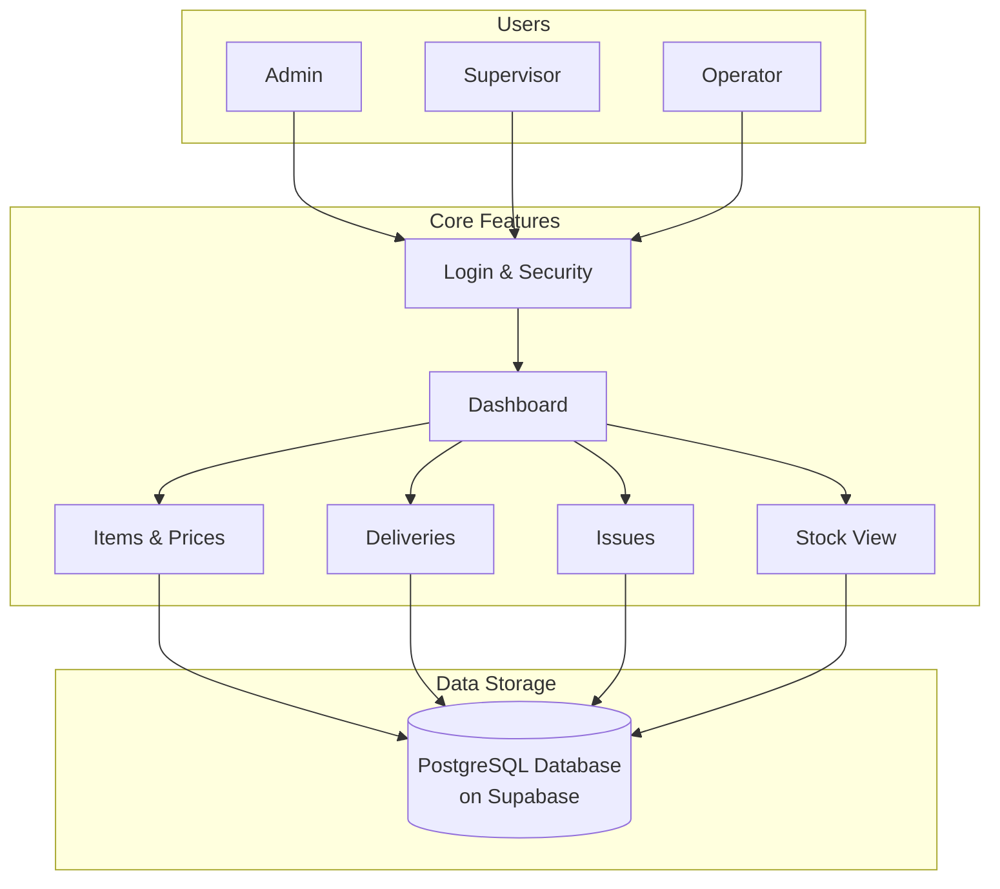
```mermaid
graph TB
    subgraph "Users"
        U1[Admin]
        U2[Supervisor]
        U3[Operator]
    end

    subgraph "Core Features"
        F1[Login & Security]
        F2[Dashboard]
        F3[Items & Prices]
        F4[Deliveries]
        F5[Issues]
        F6[Stock View]
    end

    subgraph "Data Storage"
        DB[(PostgreSQL Database<br/>on Supabase)]
    end

    U1 --> F1
    U2 --> F1
    U3 --> F1

    F1 --> F2
    F2 --> F3
    F2 --> F4
    F2 --> F5
    F2 --> F6

    F3 --> DB
    F4 --> DB
    F5 --> DB
    F6 --> DB
```

---

## 2. Core Concepts You Need to Know

### Multi-Location System

**Simple Explanation:** Imagine you have 4 different storage rooms (locations):

- Main Kitchen
- Central Store
- Main Warehouse
- Store

Each location keeps its own inventory. An item in the Kitchen is separate from the same item in the Warehouse.

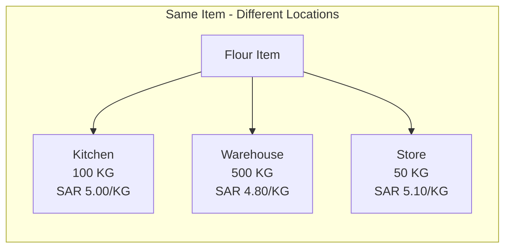
```mermaid
graph LR
    subgraph "Same Item - Different Locations"
        I[Flour Item]

        L1[Kitchen<br/>100 KG<br/>SAR 5.00/KG]
        L2[Warehouse<br/>500 KG<br/>SAR 4.80/KG]
        L3[Store<br/>50 KG<br/>SAR 5.10/KG]

        I --> L1
        I --> L2
        I --> L3
    end
```

### Weighted Average Cost (WAC)

**Simple Explanation:** This is how we calculate the average price of items when we buy them at different prices.

**Example:**

- You have 100 kg of flour bought at SAR 5.00/kg (Total value: SAR 500)
- You receive 200 kg more at SAR 6.00/kg (Total value: SAR 1,200)
- New average price = (SAR 500 + SAR 1,200) ÷ (100 + 200) = SAR 5.67/kg

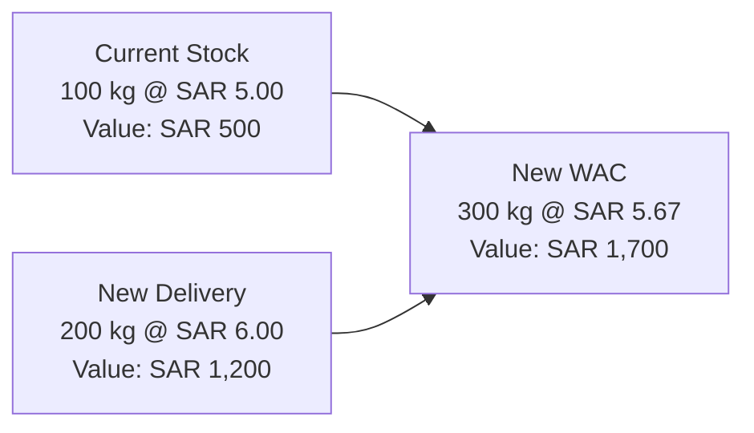
```mermaid
graph LR
    A[Current Stock<br/>100 kg @ SAR 5.00<br/>Value: SAR 500] --> C[New WAC<br/>300 kg @ SAR 5.67<br/>Value: SAR 1,700]
    B[New Delivery<br/>200 kg @ SAR 6.00<br/>Value: SAR 1,200] --> C
```

**Important:** WAC only changes when items arrive (deliveries). When items are used (issues), the WAC stays the same.

### Period-Based Pricing

**Simple Explanation:** Each month is a "period" (like January 2025, February 2025). At the start of each period, an admin sets the expected price for each item. This "locked price" is used to detect price changes.

**Example:**

- Period: January 2025
- Flour locked price: SAR 5.00/kg
- When delivery arrives at SAR 6.00/kg, the system creates an automatic alert (NCR) because the price is different

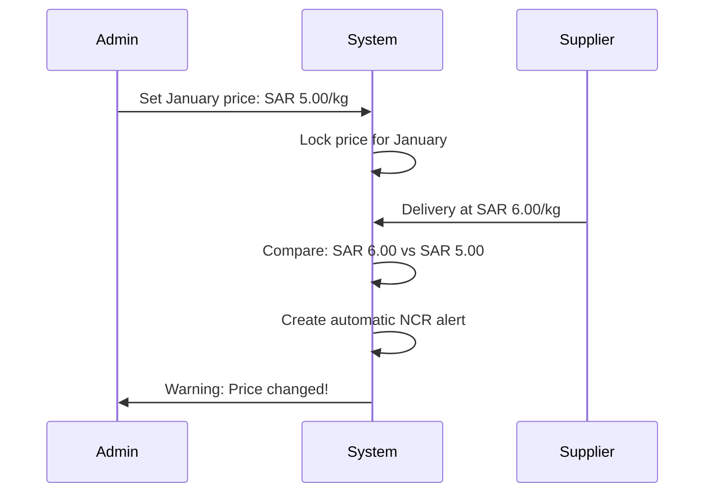
```mermaid
sequenceDiagram
    participant Admin
    participant System
    participant Supplier

    Admin->>System: Set January price: SAR 5.00/kg
    System->>System: Lock price for January
    Supplier->>System: Delivery at SAR 6.00/kg
    System->>System: Compare: SAR 6.00 vs SAR 5.00
    System->>System: Create automatic NCR alert
    System->>Admin: Warning: Price changed!
```

### User Roles and Permissions

**Simple Explanation:** Not everyone can do everything. We have 3 types of users:

1. **Operator** - Basic user
   - Can post deliveries and issues
   - Can only see their assigned locations
   - Cannot change settings

2. **Supervisor** - Manager
   - Can do everything an Operator can
   - Can see ALL locations
   - Can approve transfers between locations
   - Cannot change system settings

3. **Admin** - System manager
   - Can do EVERYTHING
   - Manages items and prices
   - Creates new users
   - Closes accounting periods

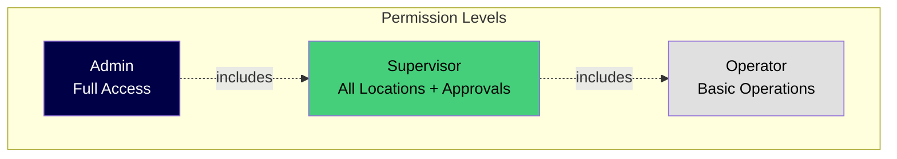
```mermaid
graph TB
    subgraph "Permission Levels"
        A[Admin<br/>Full Access]
        S[Supervisor<br/>All Locations + Approvals]
        O[Operator<br/>Basic Operations]
    end

    A -.includes.-> S
    S -.includes.-> O

    style A fill:#000046,color:#fff
    style S fill:#45cf7b,color:#000
    style O fill:#e0e0e0,color:#000
```

---

## 3. Technology Stack Explained

### What Technologies We Use and Why

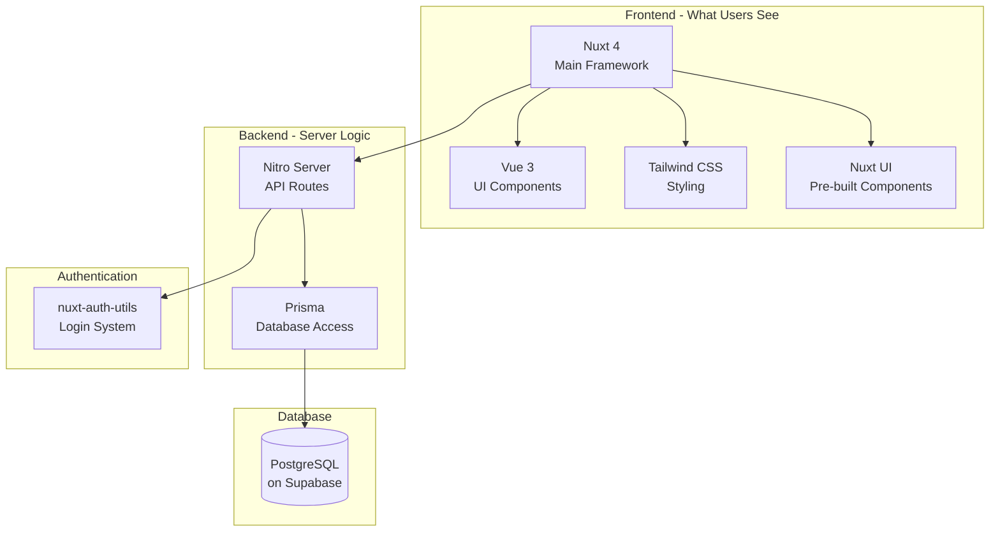
```mermaid
graph TB
    subgraph "Frontend - What Users See"
        N[Nuxt 4<br/>Main Framework]
        V[Vue 3<br/>UI Components]
        T[Tailwind CSS<br/>Styling]
        UI[Nuxt UI<br/>Pre-built Components]
    end

    subgraph "Backend - Server Logic"
        NR[Nitro Server<br/>API Routes]
        P[Prisma<br/>Database Access]
    end

    subgraph "Database"
        PG[(PostgreSQL<br/>on Supabase)]
    end

    subgraph "Authentication"
        AU[nuxt-auth-utils<br/>Login System]
    end

    N --> V
    N --> T
    N --> UI
    N --> NR
    NR --> P
    P --> PG
    NR --> AU
```

### Technology Explanations

**Nuxt 4:** Think of this as the foundation of your house. It provides the structure for everything.

**Vue 3:** This is what makes the web pages interactive. When you click a button, Vue makes something happen.

**Tailwind CSS:** This is how we make things look nice (colors, spacing, fonts). Instead of writing custom styles, we use pre-made utility classes.

**Nuxt UI:** Pre-built components like buttons, tables, and forms that look professional and work well together.

**Prisma:** This is like a translator between our application and the database. We write simple commands in JavaScript, and Prisma converts them to database language (SQL).

**PostgreSQL:** The actual database where all data is stored. Think of it as a very organized filing cabinet.

**Supabase:** A cloud service that hosts our PostgreSQL database. Instead of managing our own database server, Supabase handles it for us.

---

## 4. Database Design - How We Store Data

### Database Structure Overview

Our database has 22 tables organized into 6 main groups:

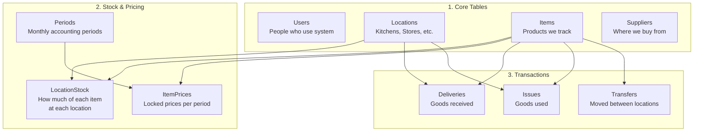
```mermaid
graph TB
    subgraph "1. Core Tables"
        Users[Users<br/>People who use system]
        Locations[Locations<br/>Kitchens, Stores, etc.]
        Items[Items<br/>Products we track]
        Suppliers[Suppliers<br/>Where we buy from]
    end

    subgraph "2. Stock & Pricing"
        LocationStock[LocationStock<br/>How much of each item<br/>at each location]
        ItemPrices[ItemPrices<br/>Locked prices per period]
        Periods[Periods<br/>Monthly accounting periods]
    end

    subgraph "3. Transactions"
        Deliveries[Deliveries<br/>Goods received]
        Issues[Issues<br/>Goods used]
        Transfers[Transfers<br/>Moved between locations]
    end

    Items --> LocationStock
    Locations --> LocationStock
    Items --> ItemPrices
    Periods --> ItemPrices

    Locations --> Deliveries
    Locations --> Issues

    Items --> Deliveries
    Items --> Issues
    Items --> Transfers
```

### Key Tables Explained

#### Users Table

Stores information about people who use the system.

**Important Fields:**

- username, email, password_hash (login info)
- role (ADMIN, SUPERVISOR, OPERATOR)
- default_location_id (which location they usually work at)

#### Locations Table

Represents physical places like kitchens or warehouses.

**Important Fields:**

- code (unique identifier like "MAIN-KIT")
- name (like "Main Kitchen")
- type (KITCHEN, STORE, CENTRAL, WAREHOUSE)
- manager_id (who manages this location)

#### Items Table

The master list of all products we track.

**Important Fields:**

- code (unique identifier like "FLR-001")
- name (like "All Purpose Flour")
- unit (KG, LTR, EA, etc.)
- category (like "Dry Goods")

#### LocationStock Table

This is the MOST IMPORTANT table for inventory. It tracks how much of each item is at each location.

**Important Fields:**

- location_id + item_id (combination is unique)
- on_hand (current quantity available)
- wac (Weighted Average Cost - the average price)

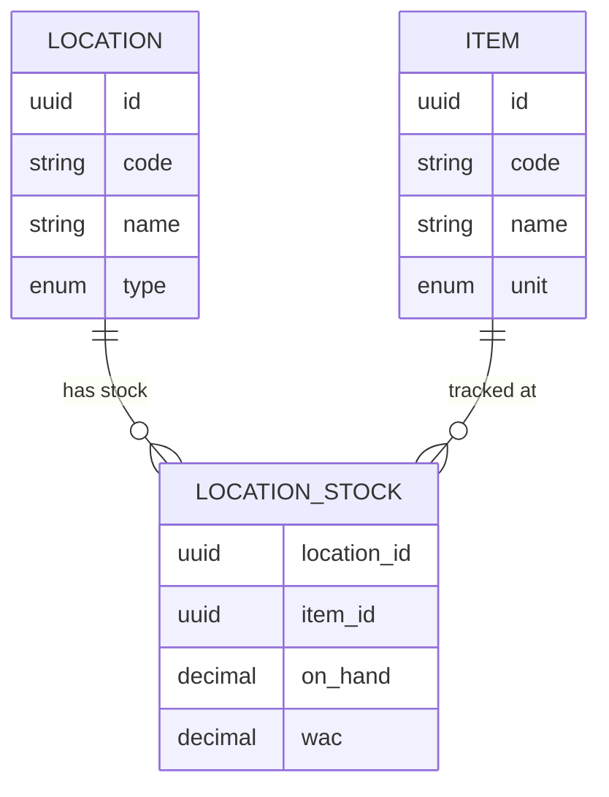
```mermaid
erDiagram
    LOCATION ||--o{ LOCATION_STOCK : "has stock"
    ITEM ||--o{ LOCATION_STOCK : "tracked at"

    LOCATION {
        uuid id
        string code
        string name
        enum type
    }

    ITEM {
        uuid id
        string code
        string name
        enum unit
    }

    LOCATION_STOCK {
        uuid location_id
        uuid item_id
        decimal on_hand
        decimal wac
    }
```

### How Tables Connect - Relationships

**One-to-Many Relationships:**

Example: One Location can have many Deliveries

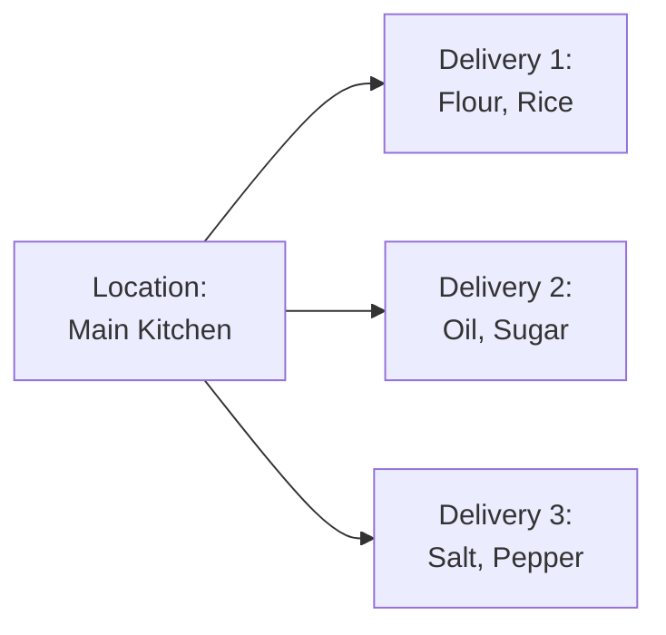
```mermaid
graph LR
    L[Location:<br/>Main Kitchen] --> D1[Delivery 1:<br/>Flour, Rice]
    L --> D2[Delivery 2:<br/>Oil, Sugar]
    L --> D3[Delivery 3:<br/>Salt, Pepper]
```

**Many-to-Many Relationships:**

Example: Users can access multiple Locations, and Locations can be accessed by multiple Users

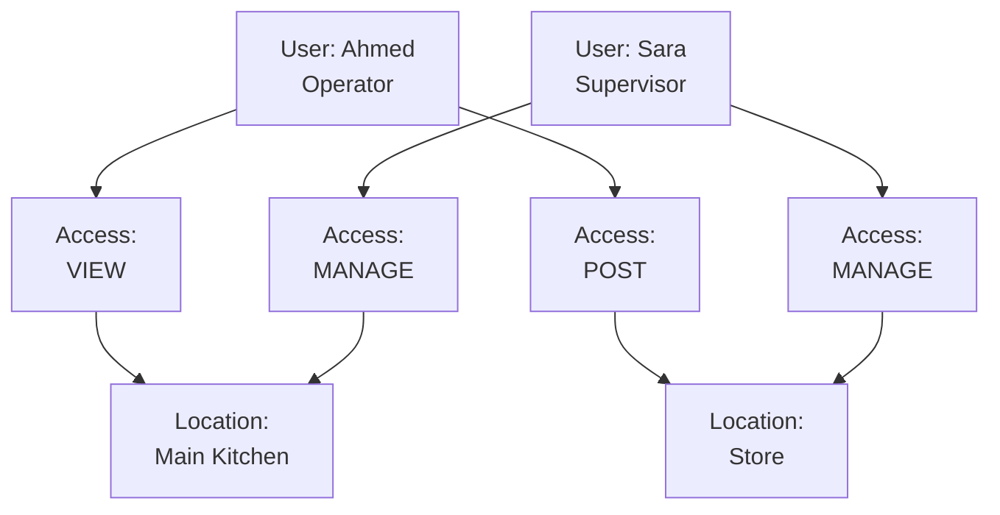
```mermaid
graph TB
    U1[User: Ahmed<br/>Operator] --> UL1[Access:<br/>VIEW]
    U1 --> UL2[Access:<br/>POST]

    U2[User: Sara<br/>Supervisor] --> UL3[Access:<br/>MANAGE]
    U2 --> UL4[Access:<br/>MANAGE]

    UL1 --> L1[Location:<br/>Main Kitchen]
    UL2 --> L2[Location:<br/>Store]
    UL3 --> L1
    UL4 --> L2
```

---

## 5. Authentication - How Users Login

### Authentication Flow

This is how a user logs into the system:

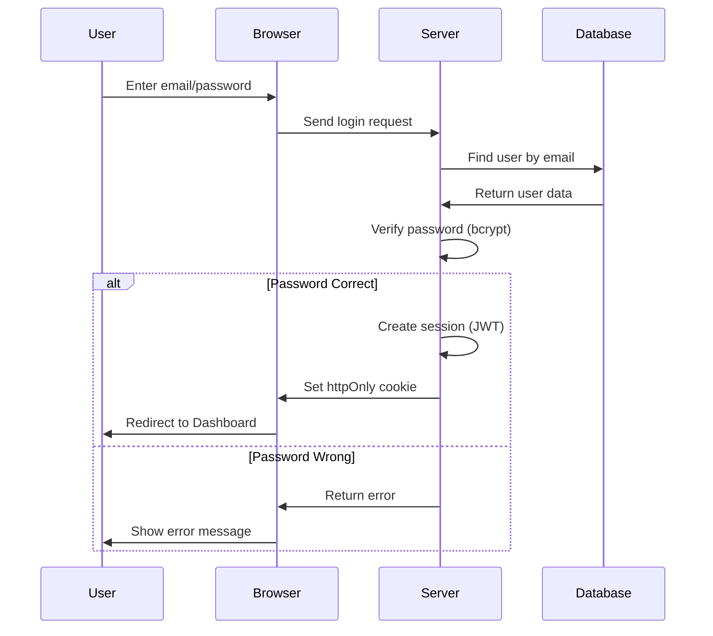
```mermaid
sequenceDiagram
    participant User
    participant Browser
    participant Server
    participant Database

    User->>Browser: Enter email/password
    Browser->>Server: Send login request
    Server->>Database: Find user by email
    Database->>Server: Return user data
    Server->>Server: Verify password (bcrypt)

    alt Password Correct
        Server->>Server: Create session (JWT)
        Server->>Browser: Set httpOnly cookie
        Browser->>User: Redirect to Dashboard
    else Password Wrong
        Server->>Browser: Return error
        Browser->>User: Show error message
    end
```

### Session Management

After login, the system remembers who you are using a "session":

**How Sessions Work:**

1. You login successfully
2. Server creates a special encrypted token (JWT)
3. Token is stored in a secure cookie (httpOnly)
4. Every time you visit a page, the cookie is sent automatically
5. Server reads the cookie to know who you are
6. If cookie is missing or invalid, you're redirected to login

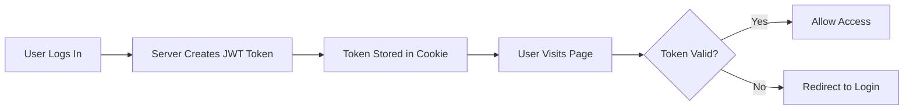
```mermaid
graph LR
    A[User Logs In] --> B[Server Creates JWT Token]
    B --> C[Token Stored in Cookie]
    C --> D[User Visits Page]
    D --> E{Token Valid?}
    E -->|Yes| F[Allow Access]
    E -->|No| G[Redirect to Login]
```

### Password Security

**How We Keep Passwords Safe:**

1. **Never Store Plain Passwords:** We never save passwords as text
2. **Use Hashing:** We convert passwords to random-looking strings using bcrypt
3. **One-Way Process:** You cannot convert the hash back to the original password
4. **Verification:** When logging in, we hash the entered password and compare the hashes

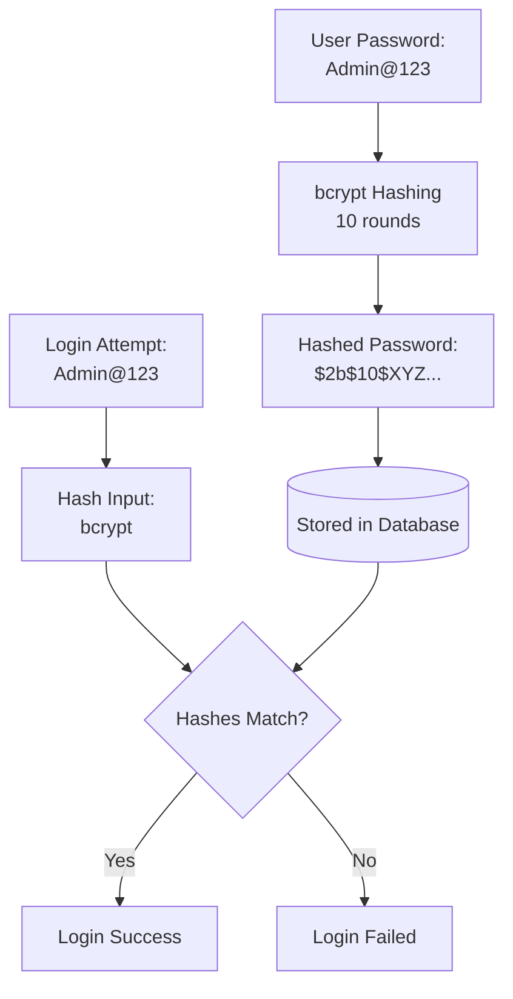
```mermaid
graph TB
    A[User Password:<br/>Admin@123] --> B[bcrypt Hashing<br/>10 rounds]
    B --> C[Hashed Password:<br/>$2b$10$XYZ...]
    C --> D[(Stored in Database)]

    E[Login Attempt:<br/>Admin@123] --> F[Hash Input:<br/>bcrypt]
    F --> G{Hashes Match?}
    D --> G
    G -->|Yes| H[Login Success]
    G -->|No| I[Login Failed]
```

### Route Protection

**How We Prevent Unauthorized Access:**

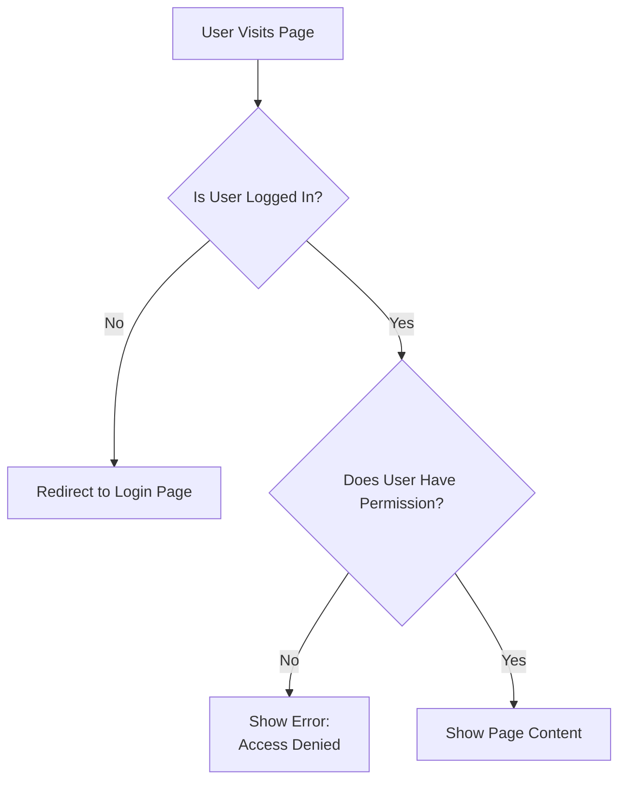
```mermaid
graph TB
    A[User Visits Page] --> B{Is User Logged In?}
    B -->|No| C[Redirect to Login Page]
    B -->|Yes| D{Does User Have Permission?}
    D -->|No| E[Show Error:<br/>Access Denied]
    D -->|Yes| F[Show Page Content]
```

**Protection Layers:**

1. **Global Middleware:** Checks every page - are you logged in?
2. **Role Middleware:** Checks specific pages - do you have the right role?
3. **Server Middleware:** Checks API requests - can you access this data?
4. **UI Permissions:** Hides buttons you're not allowed to use

---

## 6. Application Structure - How Pages Work

### Nuxt 4 Architecture

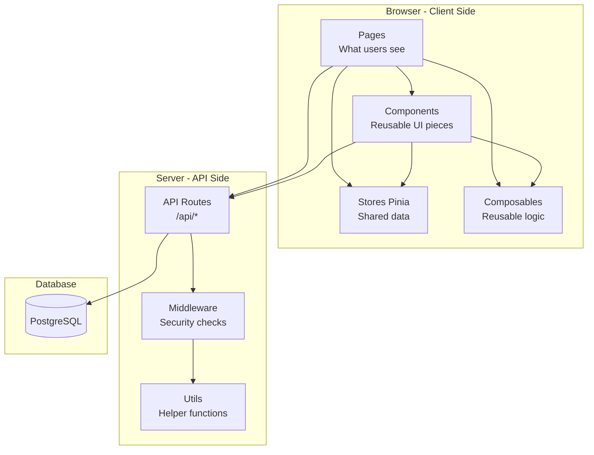
```mermaid
graph TB
    subgraph "Browser - Client Side"
        P[Pages<br/>What users see]
        C[Components<br/>Reusable UI pieces]
        S[Stores Pinia<br/>Shared data]
        CO[Composables<br/>Reusable logic]
    end

    subgraph "Server - API Side"
        API[API Routes<br/>/api/*]
        MW[Middleware<br/>Security checks]
        U[Utils<br/>Helper functions]
    end

    subgraph "Database"
        PG[(PostgreSQL)]
    end

    P --> C
    P --> S
    P --> CO
    C --> S
    C --> CO

    P --> API
    C --> API
    API --> MW
    MW --> U
    API --> PG
```

### Directory Structure

**Important Folders:**

```
/app/                      Client-side code (runs in browser)
  /pages/                  Each file = a page in the app
  /components/             Reusable UI components
  /composables/            Reusable logic (like useAuth)
  /stores/                 Pinia stores (shared state)
  /layouts/                Page layouts (navbar + sidebar)
  /middleware/             Route guards (check permissions)

/server/                   Server-side code (runs on server)
  /api/                    API endpoints (data access)
  /middleware/             Server checks (authentication)
  /utils/                  Helper functions (WAC calculation)

/prisma/                   Database schema and migrations
  schema.prisma            Database table definitions
  /migrations/             Database change history

/shared/types/             Types used by both client and server
```

### How Pages Work

**Example: Loading the Items Page**

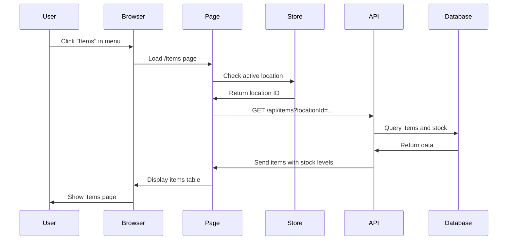
```mermaid
sequenceDiagram
    participant User
    participant Browser
    participant Page
    participant Store
    participant API
    participant Database

    User->>Browser: Click "Items" in menu
    Browser->>Page: Load /items page
    Page->>Store: Check active location
    Store->>Page: Return location ID
    Page->>API: GET /api/items?locationId=...
    API->>Database: Query items and stock
    Database->>API: Return data
    API->>Page: Send items with stock levels
    Page->>Browser: Display items table
    Browser->>User: Show items page
```

### Component Architecture

**How We Build Pages from Components:**

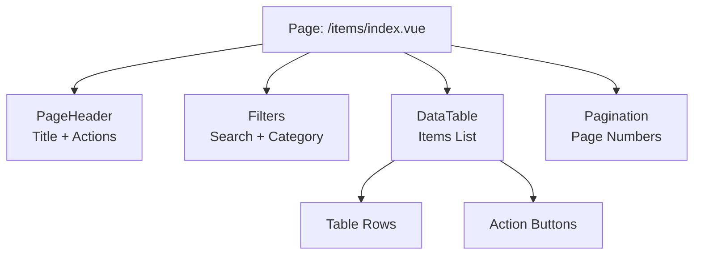
```mermaid
graph TB
    A[Page: /items/index.vue]

    B[PageHeader<br/>Title + Actions]
    C[Filters<br/>Search + Category]
    D[DataTable<br/>Items List]
    E[Pagination<br/>Page Numbers]

    D1[Table Rows]
    D2[Action Buttons]

    A --> B
    A --> C
    A --> D
    A --> E

    D --> D1
    D --> D2
```

**Why Use Components?**

1. **Reusability:** Write once, use everywhere
2. **Maintainability:** Fix bug in one place, fixes everywhere
3. **Consistency:** Same look and behavior across the app
4. **Testing:** Easier to test small pieces

---

## 7. Features We Built

### 7.1 Dashboard

**What It Does:** Shows important information when you first login.

**Key Features:**

- Total receipts this period (how much received)
- Total issues this period (how much used)
- Total mandays (people working)
- Days left in current period
- Recent deliveries (last 5)
- Recent issues (last 5)
- Quick action buttons

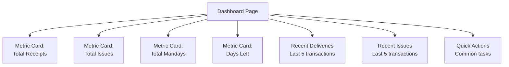
```mermaid
graph TB
    D[Dashboard Page]

    M1[Metric Card:<br/>Total Receipts]
    M2[Metric Card:<br/>Total Issues]
    M3[Metric Card:<br/>Total Mandays]
    M4[Metric Card:<br/>Days Left]

    R1[Recent Deliveries<br/>Last 5 transactions]
    R2[Recent Issues<br/>Last 5 transactions]

    Q[Quick Actions<br/>Common tasks]

    D --> M1
    D --> M2
    D --> M3
    D --> M4
    D --> R1
    D --> R2
    D --> Q
```

**How Dashboard Loads Data:**

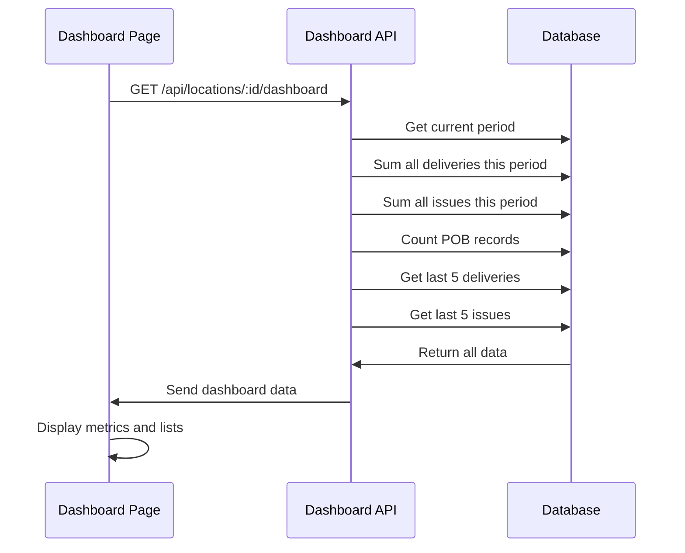
```mermaid
sequenceDiagram
    participant Page as Dashboard Page
    participant API as Dashboard API
    participant DB as Database

    Page->>API: GET /api/locations/:id/dashboard
    API->>DB: Get current period
    API->>DB: Sum all deliveries this period
    API->>DB: Sum all issues this period
    API->>DB: Count POB records
    API->>DB: Get last 5 deliveries
    API->>DB: Get last 5 issues
    DB->>API: Return all data
    API->>Page: Send dashboard data
    Page->>Page: Display metrics and lists
```

### 7.2 Items Management

**What It Does:** Lets admins create and manage inventory items.

**Key Features:**

- View all items with stock levels
- Create new items
- Edit existing items
- Deactivate items (soft delete)
- See stock across all locations

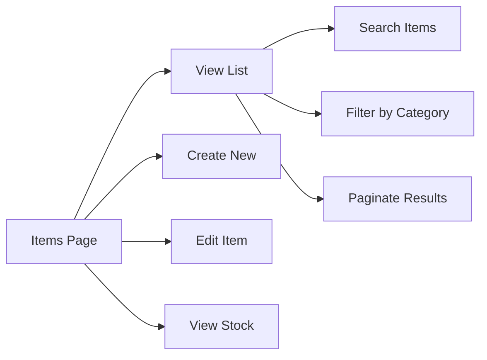
```mermaid
graph LR
    A[Items Page] --> B[View List]
    A --> C[Create New]
    A --> D[Edit Item]
    A --> E[View Stock]

    B --> F[Search Items]
    B --> G[Filter by Category]
    B --> H[Paginate Results]
```

**Item Creation Flow:**

```mermaid
sequenceDiagram
    participant Admin
    participant Form as Create Form
    participant Valid as Validation
    participant API
    participant DB as Database

    Admin->>Form: Fill item details
    Form->>Valid: Check all fields
    Valid->>Valid: Code format (uppercase)
    Valid->>Valid: Name not empty
    Valid->>Valid: Unit selected

    alt Validation Passes
        Valid->>API: POST /api/items
        API->>DB: Check if code exists
        alt Code Exists
            DB->>API: Duplicate found
            API->>Form: Error: Code already used
        else Code Available
            DB->>API: No duplicate
            API->>DB: Create new item
            DB->>API: Success
            API->>Form: Item created
            Form->>Admin: Redirect to items list
        end
    else Validation Fails
        Valid->>Form: Show errors
        Form->>Admin: Display error messages
    end
```

### 7.3 Price Management

**What It Does:** Lets admins set expected prices for each period.

**Why Important:** These "locked prices" are used to detect price changes during deliveries.

```mermaid
graph TB
    A[Admin Opens Price Page] --> B[See All Items]
    B --> C{Has Period Price?}
    C -->|Yes| D[Show Current Price]
    C -->|No| E[Show Missing Price]

    F[Admin Edits Prices] --> G[Click Save All]
    G --> H[System Checks]
    H --> I{Price Differs from WAC by >10%?}
    I -->|Yes| J[Show Warning]
    I -->|No| K[Save Silently]

    J --> L[Admin Confirms]
    L --> M[Save to Database]
    K --> M
```

### 7.4 Deliveries with Price Variance Detection

**What It Does:** Records when goods arrive and automatically detects price changes.

**The Delivery Process:**

```mermaid
sequenceDiagram
    participant User
    participant Form as Delivery Form
    participant API
    participant Stock as LocationStock
    participant NCR as NCR System

    User->>Form: Enter delivery details
    User->>Form: Add line items
    Form->>Form: Check each price vs period price

    alt Price Differs
        Form->>User: Show warning (amber badge)
    end

    User->>Form: Click Submit
    Form->>API: POST /api/locations/:id/deliveries

    API->>API: Start transaction

    loop For Each Line
        API->>API: Get period price
        API->>API: Calculate variance

        alt Variance Detected
            API->>NCR: Create automatic NCR
            NCR->>API: NCR created
        end

        API->>Stock: Get current stock
        API->>API: Calculate new WAC
        API->>Stock: Update quantity and WAC
    end

    API->>API: Commit transaction
    API->>Form: Success + NCR count
    Form->>User: Show success message
```

**WAC Calculation Example:**

Current Stock: 100 kg @ SAR 5.00 = SAR 500
New Delivery: 50 kg @ SAR 6.00 = SAR 300

New WAC = (500 + 300) ÷ (100 + 50) = 800 ÷ 150 = SAR 5.33/kg

**Price Variance Example:**

Period Price: SAR 5.00/kg
Delivery Price: SAR 6.00/kg
Variance: SAR 1.00/kg (20% increase)

Result: System automatically creates an NCR (Non-Conformance Report) to alert about the price change.

### 7.5 Issues with Stock Validation

**What It Does:** Records when goods are used/consumed and prevents using more than available.

**The Issue Process:**

```mermaid
sequenceDiagram
    participant User
    participant Form as Issue Form
    participant Stock as LocationStock
    participant API

    User->>Form: Select item
    Form->>Stock: Get on-hand quantity
    Stock->>Form: Return available: 100 kg
    Form->>User: Show "Available: 100 kg"

    User->>Form: Enter quantity: 150 kg
    Form->>Form: Check 150 > 100?
    Form->>User: Show RED warning:<br/>"Insufficient stock!"

    User->>Form: Change to 80 kg
    Form->>Form: Check 80 ≤ 100?
    Form->>User: Show GREEN status:<br/>"Stock sufficient"

    User->>Form: Click Submit
    Form->>API: POST /api/locations/:id/issues

    API->>API: Start transaction

    loop For Each Line
        API->>Stock: Verify stock sufficient

        alt Stock Sufficient
            API->>Stock: Get current WAC
            API->>Stock: Deduct quantity
            Note over Stock: WAC does NOT change!
        else Insufficient Stock
            API->>API: Rollback transaction
            API->>Form: Error: Not enough stock
            Form->>User: Show detailed error
        end
    end

    API->>API: Commit transaction
    API->>Form: Success
    Form->>User: Redirect to issues list
```

**Important Rule:** When items are issued (used), the WAC does NOT recalculate. It only changes when new deliveries arrive.

### 7.6 Stock Now

**What It Does:** Shows current inventory levels in real-time.

**Two View Modes:**

```mermaid
graph TB
    SN[Stock Now Page]

    subgraph "Operator View"
        O1[Single Location Only]
        O2[See assigned location stock]
        O3[Cannot switch locations]
    end

    subgraph "Supervisor/Admin View"
        S1[Choose View Mode]
        S2[Single Location:<br/>See one location detail]
        S3[All Locations:<br/>See consolidated view]

        S1 --> S2
        S1 --> S3
    end

    SN --> O1
    SN --> S1
```

**Consolidated View:**

Shows the same item across all locations:

| Item  | Kitchen | Store | Warehouse | Total  |
| ----- | ------- | ----- | --------- | ------ |
| Flour | 100 kg  | 50 kg | 500 kg    | 650 kg |
| Sugar | 80 kg   | 30 kg | 200 kg    | 310 kg |

### 7.7 Location Management

**What It Does:** Admins can create and manage physical locations.

**Location Hierarchy:**

```mermaid
graph TB
    A[Company] --> B[Kitchen]
    A --> C[Central Store]
    A --> D[Warehouse]
    A --> E[Store]

    B --> B1[Manager: Ahmed]
    C --> C1[Manager: Sara]
    D --> D1[Manager: Khalid]
    E --> E1[Manager: Fatima]

    B --> B2[Users: 5]
    C --> C2[Users: 3]
    D --> D2[Users: 2]
    E --> E2[Users: 4]
```

**User-Location Assignment:**

Admins can assign users to locations with different access levels:

```mermaid
graph LR
    U[User: Ahmed] --> A1[Kitchen:<br/>MANAGE Access]
    U --> A2[Store:<br/>POST Access]
    U --> A3[Warehouse:<br/>VIEW Access]

    style A1 fill:#45cf7b
    style A2 fill:#fbbf24
    style A3 fill:#e0e0e0
```

- **MANAGE:** Can do everything at this location
- **POST:** Can record deliveries/issues but not change settings
- **VIEW:** Can only see data, cannot make changes

---

## 8. Important Business Rules

### Rule 1: No Negative Stock

**Rule:** You can NEVER have less than zero items.

**How We Enforce:**

- Before creating an issue, system checks available stock
- If requested quantity > available quantity, request is rejected
- Database constraint prevents negative values

```mermaid
graph TB
    A[User Tries to Issue 150 kg] --> B{Is 150 ≤ Available?}
    B -->|Yes| C[Allow Issue]
    B -->|No| D[Block Issue]
    D --> E[Show Error Message]
    E --> F[Tell user available quantity]
```

### Rule 2: Period Must Be Open

**Rule:** You can only record transactions during an OPEN period.

**Period States:**

```mermaid
stateDiagram-v2
    [*] --> DRAFT: Admin creates period
    DRAFT --> OPEN: Admin opens period
    OPEN --> PENDING_CLOSE: All locations ready
    PENDING_CLOSE --> APPROVED: Admin approves
    APPROVED --> CLOSED: System closes
    CLOSED --> [*]

    note right of OPEN
        Transactions allowed here
        Deliveries, Issues, Transfers
    end note

    note right of CLOSED
        No changes allowed
        Period is locked
    end note
```

### Rule 3: WAC Only Changes on Deliveries

**Rule:** WAC (Weighted Average Cost) only recalculates when goods arrive, not when they're used.

**Why?** This maintains accurate historical costs. When you use an item, you use it at the price it was bought at, not a recalculated price.

```mermaid
graph TB
    D[Delivery Arrives] --> C1[Calculate New WAC]
    C1 --> U1[Update LocationStock.wac]

    I[Issue Created] --> C2[Get Current WAC]
    C2 --> U2[Use WAC for Valuation]
    U2 --> K[Keep WAC Unchanged]
```

### Rule 4: Price Variance Auto-NCR

**Rule:** When delivery price differs from period price, system automatically creates an NCR.

**Threshold:** Currently set to 0% (any difference triggers NCR), but can be configured.

```mermaid
graph TB
    A[Delivery Line Created] --> B{Unit Price = Period Price?}
    B -->|Yes| C[No NCR Needed]
    B -->|No| D[Calculate Variance]
    D --> E{Variance > Threshold?}
    E -->|Yes| F[Create Auto NCR]
    E -->|No| C

    F --> G[NCR Details]
    G --> H[Type: PRICE_VARIANCE]
    G --> I[Auto Generated: true]
    G --> J[Link to Delivery Line]
```

### Rule 5: Location-Specific Access

**Rule:** Operators can only access locations they're assigned to.

```mermaid
graph TB
    U[User: Ahmed - Operator] --> L1{Access Kitchen?}
    L1 -->|Assigned| A1[Allow Access]
    L1 -->|Not Assigned| D1[Deny Access]

    U --> L2{Access Warehouse?}
    L2 -->|Assigned| A2[Allow Access]
    L2 -->|Not Assigned| D2[Deny Access]

    S[User: Sara - Supervisor] --> ALL[Access All Locations]
```

**Exception:** Admins and Supervisors can access ALL locations regardless of assignments.

---

## 9. Data Flow Patterns

### Pattern 1: Creating a Delivery

**Complete Flow from User Click to Database Update:**

```mermaid
sequenceDiagram
    participant U as User Browser
    participant P as Page Component
    participant S as Store Pinia
    participant A as API Route
    participant M as Middleware
    participant DB as Database
    participant W as WAC Util
    participant N as NCR Util

    U->>P: Click "Create Delivery"
    P->>P: Show delivery form
    U->>P: Fill form and submit

    P->>P: Validate form locally
    P->>A: POST /api/locations/:id/deliveries

    A->>M: Check authentication
    M->>M: Verify user logged in
    M->>M: Check location access
    M->>A: User authorized

    A->>A: Validate request data (Zod)
    A->>DB: Start transaction

    A->>DB: Create delivery record

    loop Each Delivery Line
        A->>DB: Get period price
        A->>N: Check price variance

        alt Variance Found
            N->>DB: Create NCR
        end

        A->>DB: Get current stock
        A->>W: Calculate new WAC
        W->>A: Return new WAC
        A->>DB: Update LocationStock
    end

    A->>DB: Commit transaction
    A->>P: Return success + NCR count
    P->>S: Refresh location stock
    P->>U: Show success toast
    P->>U: Redirect to delivery detail
```

### Pattern 2: Loading Items Page

```mermaid
sequenceDiagram
    participant U as User
    participant P as Items Page
    participant LS as Location Store
    participant A as Items API
    participant DB as Database

    U->>P: Navigate to /items
    P->>P: onMounted hook runs

    P->>LS: Get active location
    LS->>P: Return location ID

    P->>P: Set loading = true
    P->>A: GET /api/items?locationId=X&page=1

    A->>DB: Query items
    A->>DB: JOIN with LocationStock for this location
    DB->>A: Return items with stock data

    A->>P: Send items array + pagination
    P->>P: Set loading = false
    P->>U: Display items table

    U->>P: Click "Next Page"
    P->>A: GET /api/items?locationId=X&page=2
    A->>DB: Query items page 2
    DB->>A: Return page 2 data
    A->>P: Send items array
    P->>U: Update table display
```

### Pattern 3: Permission Check Flow

```mermaid
graph TB
    A[User Clicks Button] --> B{Frontend Permission Check}
    B -->|No Permission| C[Button Disabled/Hidden]
    B -->|Has Permission| D[Make API Request]

    D --> E{Backend Middleware Check}
    E -->|No Permission| F[Return 403 Forbidden]
    E -->|Has Permission| G{Route-Level Check}

    G -->|No Permission| F
    G -->|Has Permission| H[Execute Action]

    F --> I[Show Error Message]
    H --> J[Return Success]
```

**Why Two Checks?**

1. **Frontend Check:** Makes UI better (hide buttons users can't use)
2. **Backend Check:** Security (users can't bypass by manipulating UI)

### Pattern 4: Real-Time Stock Validation

```mermaid
sequenceDiagram
    participant U as User
    participant F as Form
    participant C as Computed Property
    participant S as Stock Data

    U->>F: Select item "Flour"
    F->>S: Get Flour stock data
    S->>F: Available: 100 kg
    F->>C: Update available quantity
    C->>U: Display "Available: 100 kg"

    U->>F: Type quantity: 150
    F->>C: Trigger reactivity
    C->>C: Check 150 > 100?
    C->>F: Update hasInsufficientStock = true
    F->>U: Show red warning
    F->>F: Disable submit button

    U->>F: Change quantity: 80
    F->>C: Trigger reactivity
    C->>C: Check 80 ≤ 100?
    C->>F: Update hasInsufficientStock = false
    F->>U: Remove warning
    F->>F: Enable submit button
```

---

## 10. Key Learnings and Best Practices

### 10.1 Database Best Practices

**Lesson 1: Use Transactions for Multi-Step Operations**

When an operation involves multiple database changes, wrap them in a transaction:

```mermaid
graph LR
    A[Start Transaction] --> B[Create Delivery]
    B --> C[Create Delivery Lines]
    C --> D[Create NCRs if needed]
    D --> E[Update Stock]
    E --> F[Commit Transaction]

    B -.Error.-> G[Rollback All]
    C -.Error.-> G
    D -.Error.-> G
    E -.Error.-> G
```

**Why Important:** If something fails in the middle, ALL changes are cancelled. This prevents partial data that would cause problems.

**Lesson 2: Use Indexes for Performance**

We added indexes on columns we search frequently:

- location_id (we search by location often)
- period_id (we filter by period often)
- is_active (we filter active/inactive items)
- status (we filter by status frequently)

**Why Important:** Indexes make searches much faster, like having a table of contents in a book.

**Lesson 3: Use Enums for Fixed Options**

Instead of storing status as plain text ("OPEN", "CLOSED"), we use database enums.

**Benefits:**

- Prevents typos ("OPNE" would be rejected)
- Database enforces valid values
- Better performance than text comparison

### 10.2 Security Best Practices

**Lesson 1: Never Trust Client Data**

Even though we validate on the frontend, ALWAYS validate on the backend too.

```mermaid
graph TB
    A[User Input] --> B[Frontend Validation<br/>Better UX]
    B --> C[Send to Server]
    C --> D[Backend Validation<br/>SECURITY]
    D --> E{Valid?}
    E -->|Yes| F[Process Request]
    E -->|No| G[Reject with Error]
```

**Why?** Users can manipulate frontend code. Backend validation is the real security.

**Lesson 2: Use HttpOnly Cookies for Sessions**

Our authentication tokens are stored in httpOnly cookies that JavaScript cannot access.

**Why Important:** Protects against XSS (Cross-Site Scripting) attacks. Even if malicious code runs on the page, it cannot steal the session token.

**Lesson 3: Hash Passwords with bcrypt**

Never store passwords as plain text. Always hash them with bcrypt (10 rounds).

**How Hashing Works:**

Same password → Same hash (verifiable)
Different password → Different hash
Hash → Cannot get original password (one-way)

### 10.3 Frontend Best Practices

**Lesson 1: Use Composables for Reusable Logic**

Instead of copying code between components, we created composables:

- `useAuth()` - Authentication logic
- `usePermissions()` - Permission checks
- `useAppToast()` - Toast notifications

**Benefits:**

- Write once, use everywhere
- Fix bug in one place
- Consistent behavior
- Easier to test

**Lesson 2: Use Stores for Shared State**

We created Pinia stores for data that multiple components need:

- `authStore` - Current user info
- `locationStore` - Active location
- `periodStore` - Current period

```mermaid
graph TB
    S[Store: locationStore]

    C1[Navbar<br/>Shows current location]
    C2[Items Page<br/>Filters by location]
    C3[Deliveries Page<br/>Posts to location]
    C4[Stock Page<br/>Shows location stock]

    S --> C1
    S --> C2
    S --> C3
    S --> C4
```

**Lesson 3: Show Loading States**

Always show users when data is loading:

```mermaid
stateDiagram-v2
    [*] --> Loading: Page loads
    Loading --> Success: Data received
    Loading --> Error: Request failed
    Success --> [*]: Display data
    Error --> Loading: User retries
```

Users need to know:

- Data is loading (spinner)
- Data loaded successfully (show content)
- Error occurred (error message + retry button)

### 10.4 API Design Best Practices

**Lesson 1: RESTful Endpoints**

We follow REST conventions:

- GET /api/items - List all items
- GET /api/items/:id - Get one item
- POST /api/items - Create item
- PATCH /api/items/:id - Update item
- DELETE /api/items/:id - Delete item

**Lesson 2: Consistent Error Responses**

All errors return the same structure:

```
{
  statusCode: 400,
  statusMessage: "Validation Error",
  data: {
    code: "VALIDATION_ERROR",
    message: "Item code is required",
    details: [...]
  }
}
```

**Why Important:** Frontend can handle errors consistently.

**Lesson 3: Return What Frontend Needs**

When returning data, include related data the frontend will need:

Example: When getting a delivery, also include:

- Supplier info (so we can display supplier name)
- Item details (so we can display item names)
- Period info (so we can display period name)

This reduces the number of API calls needed.

### 10.5 Testing Best Practices

**Lesson 1: Test Business Logic Separately**

We created separate utility files for complex logic (WAC calculation, price variance detection) and tested them independently.

**Benefits:**

- Easier to test
- Can test without database
- Faster tests
- More reliable

**Lesson 2: Test Edge Cases**

Don't just test the happy path. Test unusual situations:

- What if stock is exactly zero?
- What if quantity is decimal (5.5)?
- What if price is negative?
- What if dates are in wrong order?

### 10.6 Performance Best Practices

**Lesson 1: Pagination**

Don't load all items at once. Use pagination:

- Default: 50 items per page
- Maximum: 200 items per page
- Include page controls for navigation

**Lesson 2: Debounced Search**

Don't search on every keystroke. Wait until user stops typing:

User types: F-l-o-u-r
Without debounce: 5 API calls (F, Fl, Flo, Flou, Flour)
With debounce (500ms): 1 API call (Flour)

**Lesson 3: Computed Properties**

Use Vue computed properties for calculations that depend on reactive data:

```
computed: {
  totalValue() {
    return quantity * unitPrice
  }
}
```

**Why?** Computed properties only recalculate when dependencies change. Much more efficient than recalculating on every render.

---

## Summary

### What We Accomplished in Phase 1

✅ **Project Setup**

- Nuxt 4 application with Tailwind CSS
- Complete design system with brand colors
- Development environment ready

✅ **Database Layer**

- 22 database tables
- All relationships defined
- Indexes for performance
- Seed data for testing

✅ **Authentication System**

- Secure login/logout
- Role-based permissions
- Session management
- Route protection

✅ **Core Features**

- Dashboard with key metrics
- Items management
- Price management per period
- Deliveries with price variance detection
- Issues with stock validation
- Stock visibility (single/consolidated)
- Location management

✅ **Business Rules Implemented**

- No negative stock
- WAC calculation
- Period-based pricing
- Automatic NCR generation
- Multi-location access control

### Technologies Mastered

- **Nuxt 4** - Modern Vue framework
- **Prisma** - Type-safe database access
- **PostgreSQL** - Relational database
- **Pinia** - State management
- **Tailwind CSS** - Utility-first styling
- **TypeScript** - Type safety
- **Zod** - Data validation
- **Bcrypt** - Password hashing

### Next Steps (Phase 2)

After Phase 1, the next features to build:

1. **Transfers** - Moving stock between locations
2. **NCR Management** - Handle non-conformance reports
3. **POB** - Daily people on board tracking
4. **Reconciliations** - Period-end reconciliation
5. **Period Close** - Coordinated period closing
6. **PRF/PO** - Purchase request workflow

---

## Additional Resources

**For Learning:**

1. **Nuxt 4 Documentation:** https://nuxt.com/docs
2. **Vue 3 Guide:** https://vuejs.org/guide
3. **Prisma Docs:** https://www.prisma.io/docs
4. **Tailwind CSS:** https://tailwindcss.com/docs

**Project Documents:**

1. **PRD (Product Requirements):** Full system requirements
2. **System Design:** Technical architecture details
3. **API Contract:** All API endpoints documented
4. **Database ERD:** Entity relationship diagrams
5. **Workflow Guide:** Business process flows

**Ask Questions:**

If you don't understand something:

1. Check the documentation first
2. Look at similar code in the project
3. Ask your senior developer
4. Document your learning for others

---

**Remember:** This is a complex system, and it's okay not to understand everything at once. Take your time, ask questions, and learn step by step. Every experienced developer started where you are now!
