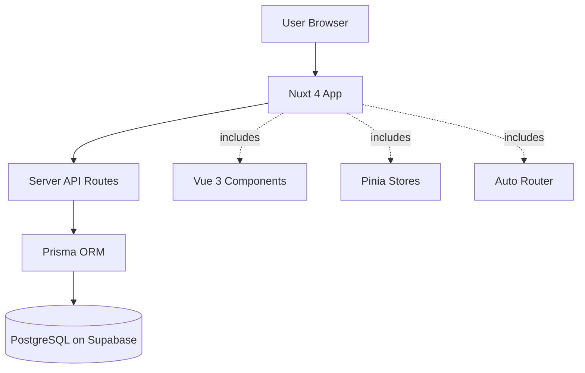
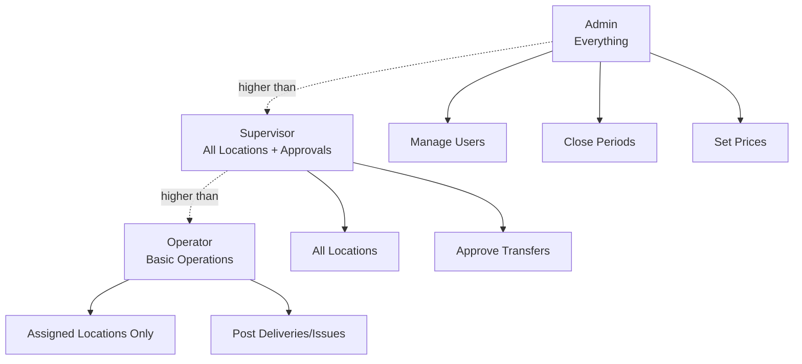
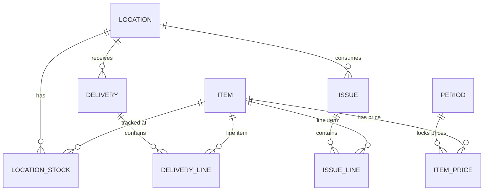
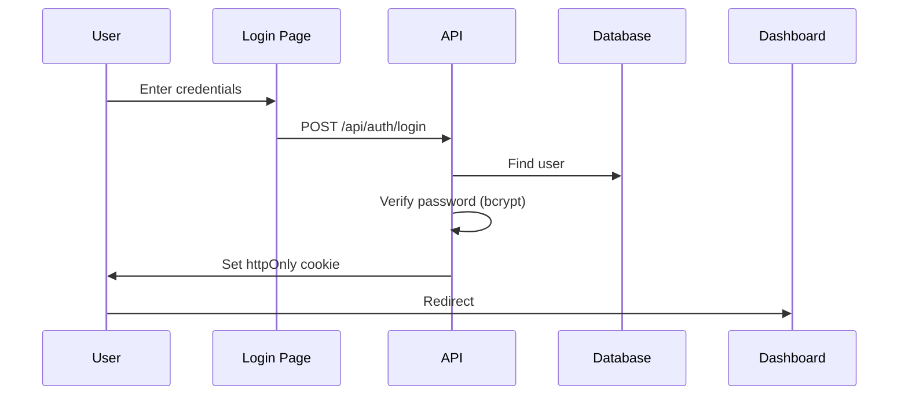
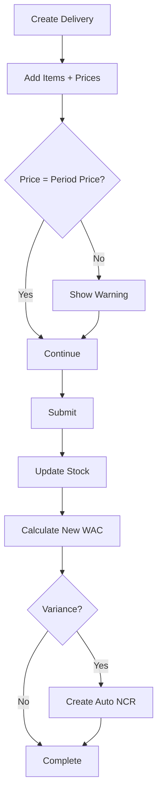
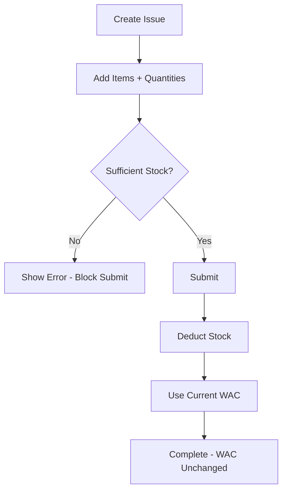

# Phase 1 Quick Reference Guide

**Quick lookup for common concepts, diagrams, and terminology**

---

## Table of Contents

1. [Common Terms Glossary](#common-terms-glossary)
2. [Quick Diagrams](#quick-diagrams)
3. [File Locations](#file-locations)
4. [Common Commands](#common-commands)
5. [API Endpoint Quick Reference](#api-endpoint-quick-reference)
6. [Component Quick Reference](#component-quick-reference)

---

## Common Terms Glossary

### Business Terms

| Term         | Simple Explanation                                   | Example                                             |
| ------------ | ---------------------------------------------------- | --------------------------------------------------- |
| **WAC**      | Weighted Average Cost - The average price of an item | 100 kg @ SAR 5 + 200 kg @ SAR 6 = 300 kg @ SAR 5.67 |
| **Period**   | Monthly accounting period                            | January 2025, February 2025                         |
| **NCR**      | Non-Conformance Report - Alert for problems          | Delivery price different from expected              |
| **POB**      | People on Board - Daily headcount                    | 50 crew + 10 extra = 60 total people                |
| **Location** | Physical place where stock is kept                   | Main Kitchen, Warehouse                             |
| **Delivery** | When goods arrive                                    | Received 100 kg flour from supplier                 |
| **Issue**    | When goods are used                                  | Used 50 kg flour for kitchen                        |
| **Transfer** | Moving stock between locations                       | Move 30 kg from Warehouse to Kitchen                |
| **On-Hand**  | Current quantity available                           | We have 100 kg in stock                             |

### Technical Terms

| Term           | Simple Explanation                                                | Example                             |
| -------------- | ----------------------------------------------------------------- | ----------------------------------- |
| **API**        | Application Programming Interface - How frontend talks to backend | GET /api/items                      |
| **Component**  | Reusable UI piece                                                 | Button, Table, Form                 |
| **Composable** | Reusable logic function                                           | useAuth(), usePermissions()         |
| **Store**      | Shared data storage                                               | authStore, locationStore            |
| **Middleware** | Security check before accessing page/API                          | Check if user is logged in          |
| **Migration**  | Database change record                                            | Add new table, add new column       |
| **Seed**       | Test data for development                                         | Create sample items, users          |
| **JWT**        | JSON Web Token - Encrypted session data                           | Stored in httpOnly cookie           |
| **Zod**        | Data validation library                                           | Check email format, required fields |
| **Prisma**     | Database access tool                                              | Query items, create delivery        |

### File Extensions

| Extension | What It Is              | Example       |
| --------- | ----------------------- | ------------- |
| `.vue`    | Vue component file      | AppNavbar.vue |
| `.ts`     | TypeScript file         | auth.ts       |
| `.prisma` | Prisma database schema  | schema.prisma |
| `.md`     | Markdown documentation  | README.md     |
| `.mjs`    | JavaScript module (ES6) | test-api.mjs  |
| `.json`   | JSON configuration      | package.json  |

---

## Quick Diagrams

### System Architecture Overview



### User Role Hierarchy



### Database Main Relationships



### Authentication Flow



### Delivery Process Flow



### Issue Process Flow



---

## File Locations

### Important Directories

```
Project Root
│
├── app/                          # Frontend (browser) code
│   ├── pages/                    # Pages (auto-routing)
│   │   ├── index.vue            # Dashboard
│   │   ├── login.vue            # Login page
│   │   ├── items/               # Items pages
│   │   ├── deliveries/          # Deliveries pages
│   │   └── issues/              # Issues pages
│   │
│   ├── components/              # Reusable UI components
│   │   ├── common/              # Generic components
│   │   ├── layout/              # Layout components
│   │   ├── dashboard/           # Dashboard-specific
│   │   ├── delivery/            # Delivery-specific
│   │   └── issue/               # Issue-specific
│   │
│   ├── composables/             # Reusable logic
│   │   ├── useAuth.ts           # Authentication
│   │   ├── usePermissions.ts    # Permissions
│   │   └── useAppToast.ts       # Notifications
│   │
│   ├── stores/                  # Pinia state stores
│   │   ├── auth.ts              # User state
│   │   ├── location.ts          # Location state
│   │   ├── period.ts            # Period state
│   │   └── ui.ts                # UI state
│   │
│   └── layouts/                 # Page layouts
│       └── default.vue          # Main layout
│
├── server/                      # Backend (server) code
│   ├── api/                     # API endpoints
│   │   ├── auth/                # Authentication
│   │   ├── items/               # Items CRUD
│   │   ├── deliveries/          # Deliveries
│   │   ├── issues/              # Issues
│   │   └── locations/           # Locations
│   │
│   ├── middleware/              # Server security checks
│   │   ├── auth.ts              # Verify logged in
│   │   └── location-access.ts   # Verify location access
│   │
│   └── utils/                   # Helper functions
│       ├── auth.ts              # Password hashing
│       ├── wac.ts               # WAC calculation
│       ├── priceVariance.ts     # Price variance
│       └── stockValidation.ts   # Stock checks
│
├── prisma/                      # Database
│   ├── schema.prisma            # Database tables
│   ├── migrations/              # Database changes
│   └── seed.ts                  # Test data
│
└── project-docs/                # Documentation
    ├── PRD.md                   # Requirements
    ├── TASK_COMPLETION_LOG.md   # What's done
    └── dev-guide/               # This guide
```

### Where to Find Things

| I want to...                | Look in...                                          |
| --------------------------- | --------------------------------------------------- |
| Create a new page           | `/app/pages/`                                       |
| Create a reusable component | `/app/components/`                                  |
| Add API endpoint            | `/server/api/`                                      |
| Add permission check        | `/app/composables/usePermissions.ts`                |
| Modify database             | `/prisma/schema.prisma`                             |
| Add helper function         | `/server/utils/` (server) or `/app/utils/` (client) |
| Change app layout           | `/app/layouts/default.vue`                          |
| Modify navigation menu      | `/app/components/layout/AppSidebar.vue`             |

---

## Common Commands

### Development

```bash
# Start development server
pnpm dev

# Build for production
pnpm build

# Check TypeScript errors
pnpm typecheck

# Run linter
pnpm lint
```

### Database

```bash
# Generate Prisma Client (after schema changes)
pnpm db:generate

# Create new migration
pnpm db:migrate dev --name migration_name

# Push schema without migration (dev only)
pnpm db:push

# Open Prisma Studio (database GUI)
pnpm db:studio

# Run seed data
pnpm db:seed

# Deploy migrations (production)
pnpm db:migrate deploy
```

### Testing

```bash
# Run all tests
pnpm test

# Run tests in watch mode
pnpm test:watch

# Run unit tests only
pnpm test:unit

# Open test UI
pnpm test:ui
```

---

## API Endpoint Quick Reference

### Authentication

```
POST   /api/auth/login          Login user
POST   /api/auth/logout         Logout user
GET    /api/auth/session        Get current user
POST   /api/auth/register       Create user (admin only)
```

### Items

```
GET    /api/items               List items (with filters)
POST   /api/items               Create item (admin only)
GET    /api/items/:id           Get single item
PATCH  /api/items/:id           Update item (admin only)
DELETE /api/items/:id           Deactivate item (admin only)
```

### Prices

```
GET    /api/periods/:periodId/prices      Get all prices
POST   /api/periods/:periodId/prices      Set/update prices (admin)
PATCH  /api/items/:itemId/price           Update single item price
```

### Deliveries

```
GET    /api/locations/:locationId/deliveries     List deliveries
POST   /api/locations/:locationId/deliveries     Create delivery
GET    /api/deliveries/:id                       Get delivery details
```

### Issues

```
GET    /api/locations/:locationId/issues         List issues
POST   /api/locations/:locationId/issues         Create issue
GET    /api/issues/:id                           Get issue details
```

### Stock

```
GET    /api/locations/:locationId/stock          Get location stock
GET    /api/stock/consolidated                   Get all locations stock
```

### Locations

```
GET    /api/locations                  List locations
POST   /api/locations                  Create location (admin)
GET    /api/locations/:id              Get location details
PATCH  /api/locations/:id              Update location (admin)
GET    /api/locations/:id/users        Get location users
POST   /api/locations/:id/users        Assign user to location
DELETE /api/locations/:id/users/:uid   Remove user assignment
```

### Dashboard

```
GET    /api/locations/:locationId/dashboard      Get dashboard data
```

### Common Query Parameters

```
?page=1              Pagination page number
?limit=50            Items per page
?search=flour        Search term
?category=Dairy      Filter by category
?locationId=xxx      Filter by location
?periodId=xxx        Filter by period
?includeLines=true   Include sub-records
```

---

## Component Quick Reference

### Common Components

```vue
<!-- Loading Spinner -->
<LoadingSpinner size="lg" color="primary" text="Loading..." />

<!-- Error Alert -->
<ErrorAlert
  type="error"
  title="Error Title"
  :message="errorMessage"
  :dismissible="true"
  @retry="handleRetry"
/>

<!-- Empty State -->
<EmptyState
  icon="i-lucide-inbox"
  title="No items found"
  description="Try adjusting your filters"
  action-label="Create New"
  @action="handleCreate"
/>

<!-- Page Header -->
<PageHeader title="Items" icon="i-lucide-package" :breadcrumbs="breadcrumbs">
  <template #actions>
    <UButton>Action Button</UButton>
  </template>
</PageHeader>

<!-- Data Table -->
<DataTable
  :columns="columns"
  :data="items"
  :loading="loading"
  :error="error"
  :page="page"
  :total-items="total"
  @retry="fetchData"
  @page-change="handlePageChange"
/>
```

### Layout Components

```vue
<!-- Use default layout (navbar + sidebar) -->
<script setup>
definePageMeta({
  layout: "default",
});
</script>

<!-- Use blank layout (login page) -->
<script setup>
definePageMeta({
  layout: false,
});
</script>
```

### Nuxt UI Components

```vue
<!-- Button -->
<UButton color="primary" size="md" icon="i-lucide-plus">
  Create New
</UButton>

<!-- Input -->
<UInput v-model="value" type="text" placeholder="Enter value" icon="i-lucide-search" />

<!-- Select -->
<USelectMenu v-model="selected" :options="options" placeholder="Select option" />

<!-- Card -->
<UCard>
  <template #header>Card Title</template>
  Card content here
</UCard>

<!-- Badge -->
<UBadge color="success" variant="subtle">
  Active
</UBadge>
```

---

## Permission Checks Quick Reference

### In Templates

```vue
<template>
  <!-- Show only if user can post deliveries -->
  <UButton v-if="permissions.canPostDeliveries()">New Delivery</UButton>

  <!-- Show only for admins -->
  <UButton v-if="auth.isAdmin">Admin Action</UButton>

  <!-- Show for supervisor or higher -->
  <UButton v-if="auth.isAtLeastSupervisor">Approve</UButton>
</template>

<script setup>
const auth = useAuth();
const permissions = usePermissions();
</script>
```

### In API Routes

```typescript
// Check if user is authenticated
if (!event.context.user) {
  throw createError({
    statusCode: 401,
    message: "Unauthorized",
  });
}

// Check if user is admin
if (event.context.user.role !== "ADMIN") {
  throw createError({
    statusCode: 403,
    message: "Admin access required",
  });
}

// Check location access
if (user.role === "OPERATOR") {
  const hasAccess = user.locations.some((loc) => loc.location_id === locationId);
  if (!hasAccess) {
    throw createError({
      statusCode: 403,
      message: "No access to this location",
    });
  }
}
```

---

## Format Utilities Quick Reference

### Currency Formatting

```typescript
import { formatCurrency } from "~/utils/format";

formatCurrency(1234.56); // "SAR 1,234.56"
formatCurrency(1000); // "SAR 1,000.00"
```

### Date Formatting

```typescript
import { formatDate, formatDateTime } from "~/utils/format";

formatDate("2025-01-15"); // "15/01/2025"
formatDateTime("2025-01-15T14:30:00"); // "15/01/2025 14:30"
```

### Number Formatting

```typescript
import { formatNumber, formatQuantity } from "~/utils/format";

formatNumber(1234.5678); // "1,234.57" (2 decimals)
formatQuantity(123.4567); // "123.4567" (4 decimals)
```

---

## Common Patterns Quick Reference

### Fetching Data in Page

```typescript
const { data: items, pending, error, refresh } = await useFetch("/api/items");
```

### Submitting Form

```typescript
const loading = ref(false);
const error = ref<string | null>(null);

async function handleSubmit() {
  loading.value = true;
  error.value = null;

  try {
    await $fetch("/api/items", {
      method: "POST",
      body: formData,
    });

    toast.success("Item created successfully");
    navigateTo("/items");
  } catch (err) {
    error.value = err.message;
    toast.error("Failed to create item");
  } finally {
    loading.value = false;
  }
}
```

### Watch Store Changes

```typescript
const locationStore = useLocationStore();

watch(
  () => locationStore.activeLocationId,
  () => {
    // Refresh data when location changes
    refresh();
  }
);
```

---

## Troubleshooting Quick Guide

### Common Issues

| Problem                             | Likely Cause              | Solution                                |
| ----------------------------------- | ------------------------- | --------------------------------------- |
| Page shows login instead of content | Not authenticated         | Check if session is valid               |
| API returns 403 Forbidden           | No permission             | Check user role and location access     |
| Items don't show stock              | Missing locationId        | Pass locationId in query                |
| WAC not updating                    | Issue instead of delivery | WAC only changes on deliveries          |
| Form validation fails               | Missing required field    | Check Zod schema requirements           |
| Database error                      | Migration not run         | Run `pnpm db:migrate dev`               |
| TypeScript errors                   | Missing type              | Run `pnpm db:generate` for Prisma types |

### Error Codes Reference

| Code | Meaning        | Common Cause                      |
| ---- | -------------- | --------------------------------- |
| 400  | Bad Request    | Validation failed                 |
| 401  | Unauthorized   | Not logged in                     |
| 403  | Forbidden      | No permission                     |
| 404  | Not Found      | Resource doesn't exist            |
| 409  | Conflict       | Duplicate value (e.g., item code) |
| 500  | Internal Error | Server bug                        |

---

## Keyboard Shortcuts (Development)

| Action               | Shortcut         |
| -------------------- | ---------------- |
| Save file            | Ctrl + S         |
| Open command palette | Ctrl + Shift + P |
| Search files         | Ctrl + P         |
| Find in file         | Ctrl + F         |
| Find in all files    | Ctrl + Shift + F |
| Go to definition     | F12              |
| Show all references  | Shift + F12      |
| Rename symbol        | F2               |
| Format document      | Shift + Alt + F  |

---

**This guide is for quick lookups. For detailed explanations, see the main [Phase 1 Complete Guide](./PHASE_1_COMPLETE_GUIDE.md).**
