# Visual Feature Walkthroughs

**Step-by-step visual guides for key features**

This document shows exactly what happens when users perform common tasks in the system. Each walkthrough includes diagrams showing the flow from user action to database update.

---

## Table of Contents

1. [User Login Journey](#1-user-login-journey)
2. [Creating a New Item](#2-creating-a-new-item)
3. [Setting Period Prices](#3-setting-period-prices)
4. [Recording a Delivery](#4-recording-a-delivery)
5. [Recording an Issue](#5-recording-an-issue)
6. [Viewing Stock Levels](#6-viewing-stock-levels)
7. [Switching Locations](#7-switching-locations)
8. [Price Variance Detection](#8-price-variance-detection)
9. [Stock Validation](#9-stock-validation)

---

## 1. User Login Journey

### What Happens When User Logs In

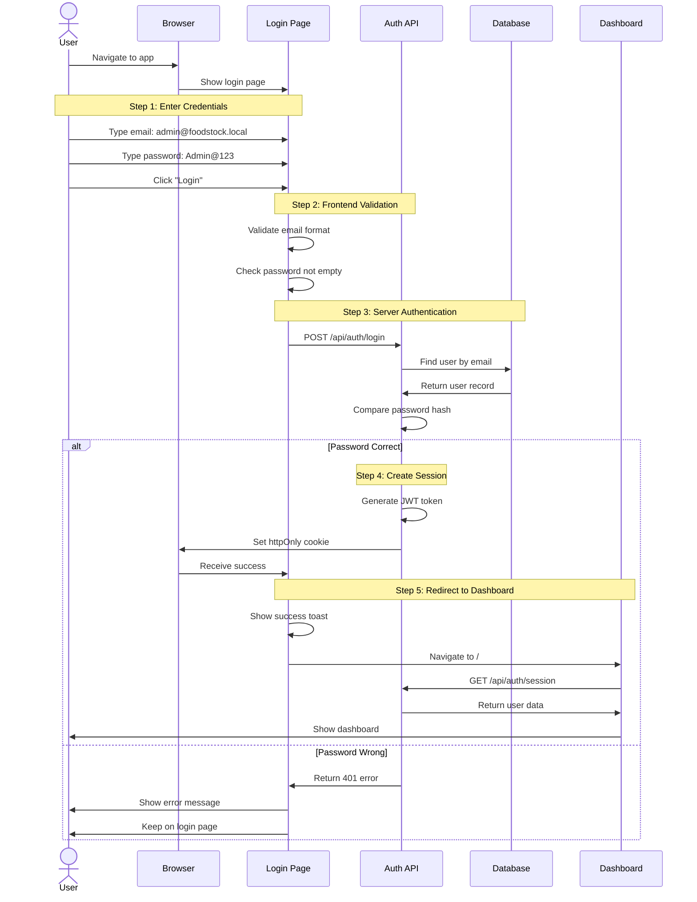

### Visual States

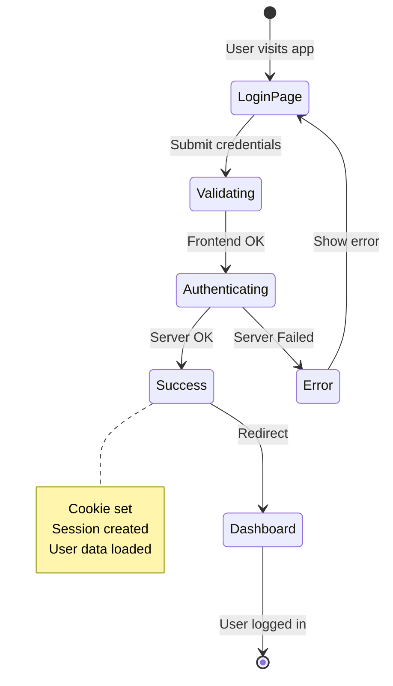

---

## 2. Creating a New Item

### Complete Item Creation Flow

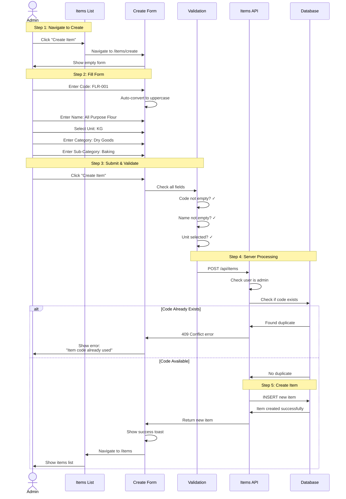

### Form States Diagram

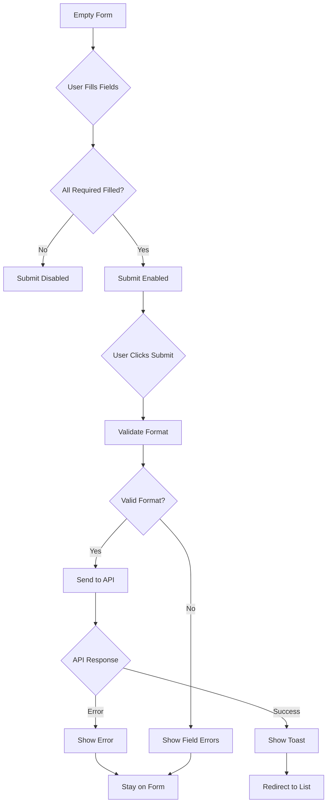

---

## 3. Setting Period Prices

### Price Setting Workflow

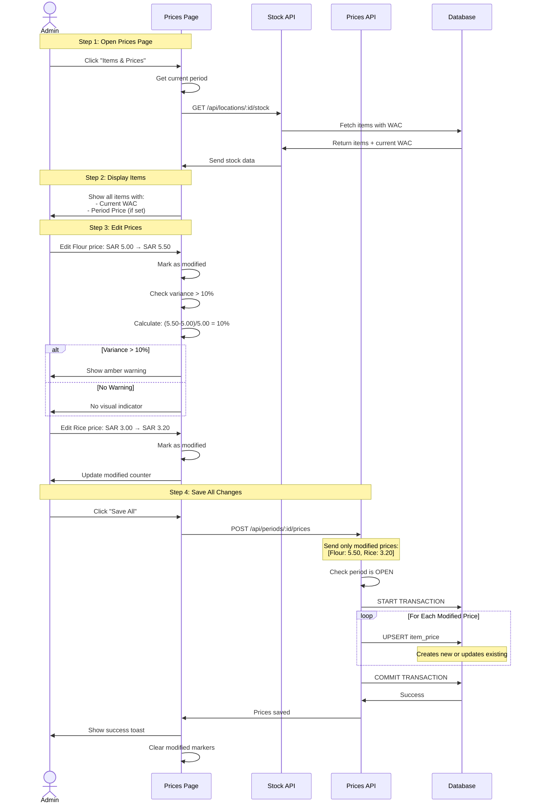

### Price Variance Warning Logic

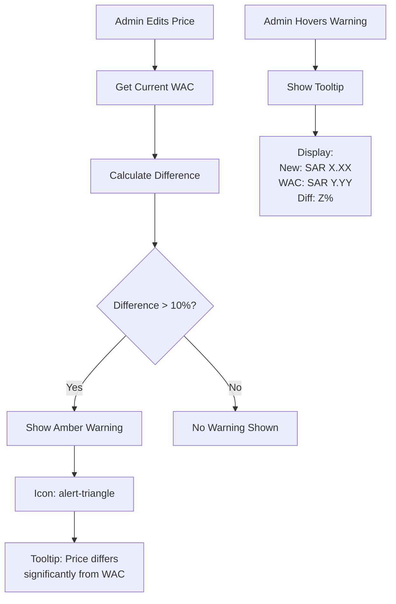

---

## 4. Recording a Delivery

### Complete Delivery Flow with Price Variance

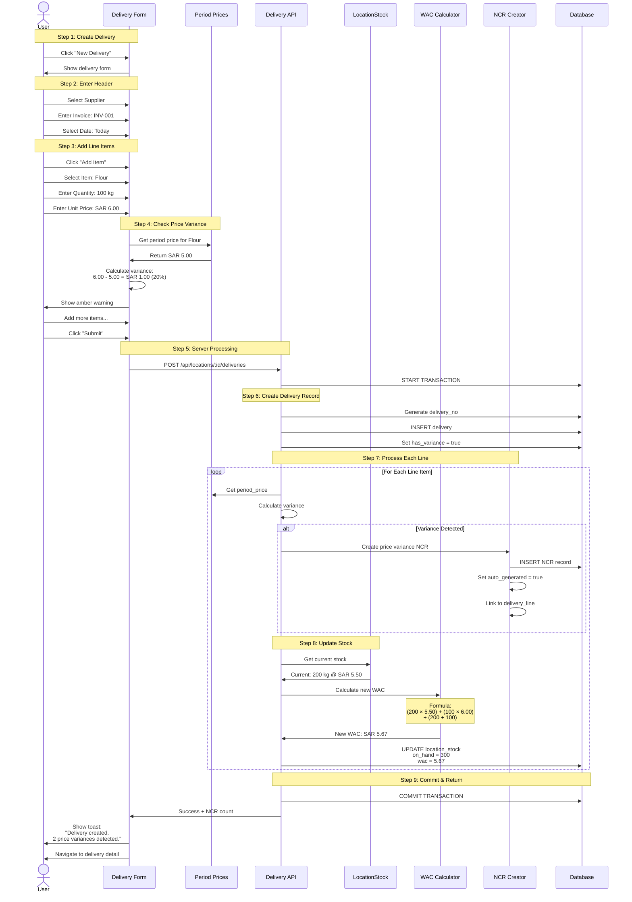

### Stock Update Visualization

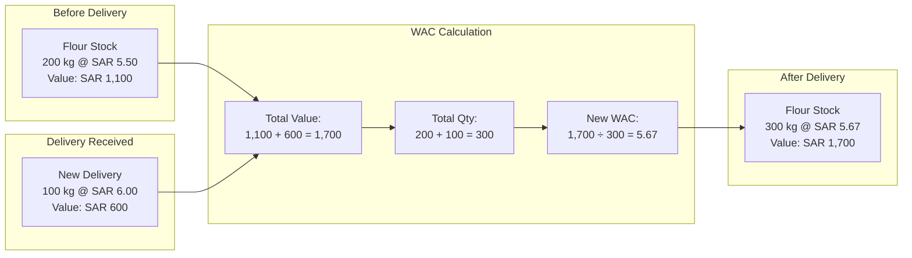

---

## 5. Recording an Issue

### Complete Issue Flow with Stock Validation

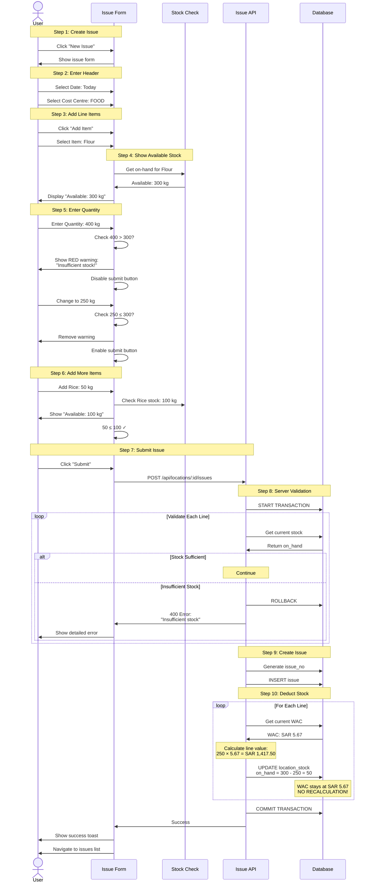

### Stock Validation Visual

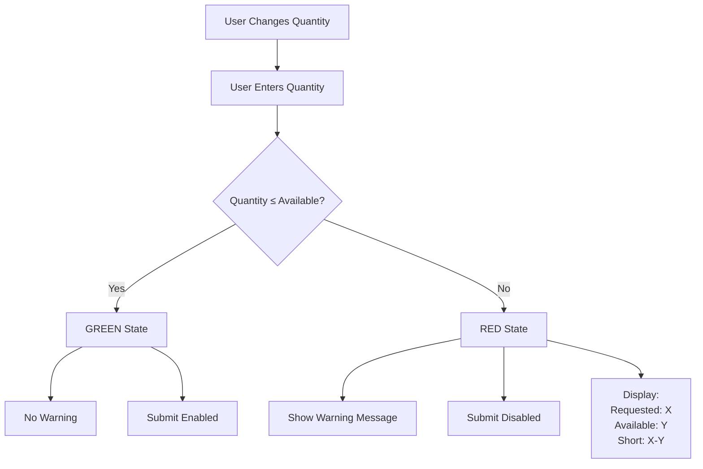

---

## 6. Viewing Stock Levels

### Stock Now Page Flow

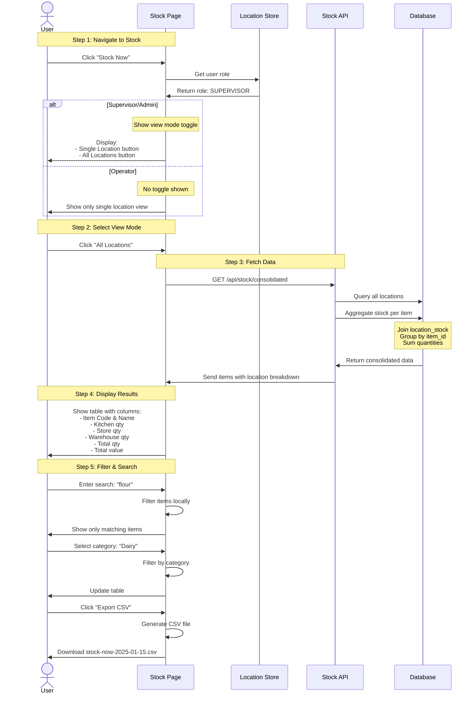

### View Mode Comparison

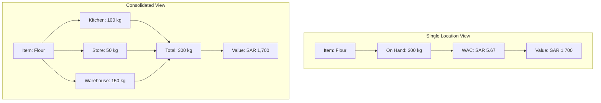

---

## 7. Switching Locations

### Location Switch Flow

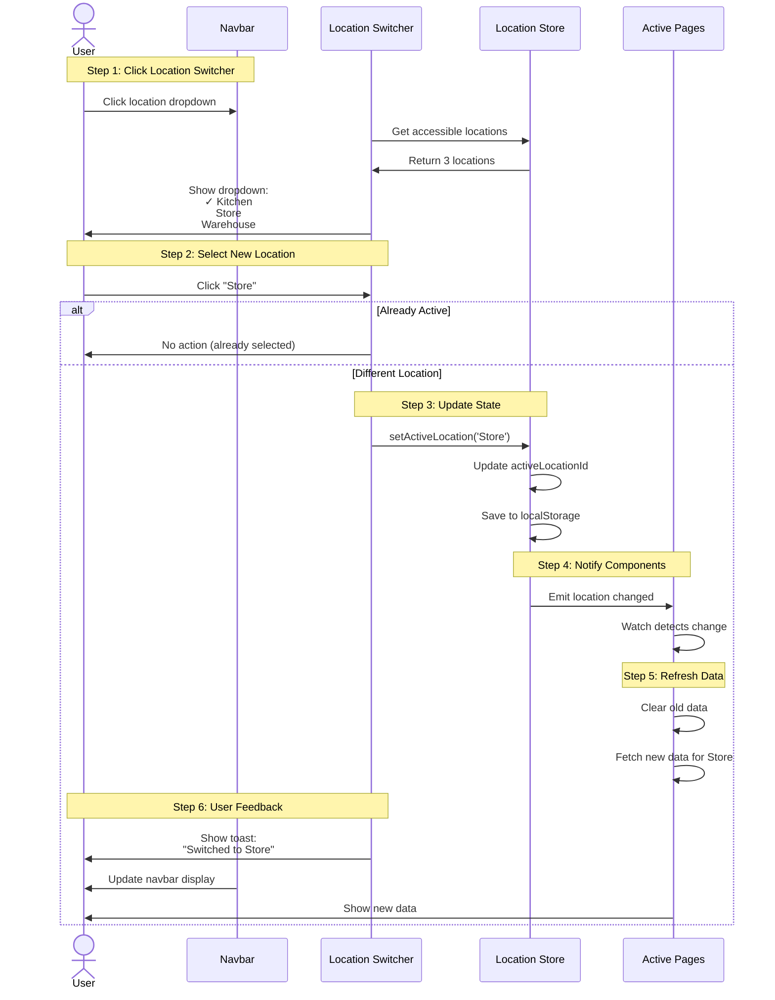

### Component Refresh Chain

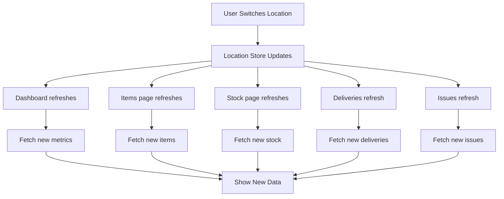

---

## 8. Price Variance Detection

### Detailed Price Variance Flow

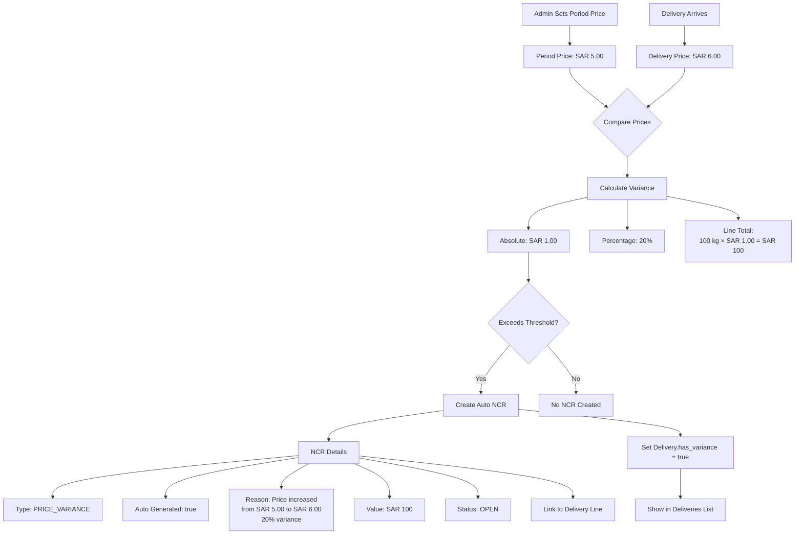

### NCR Auto-Creation Decision Tree

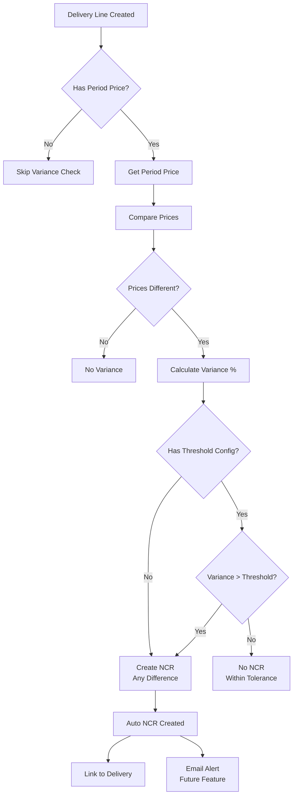

---

## 9. Stock Validation

### Multi-Line Stock Validation

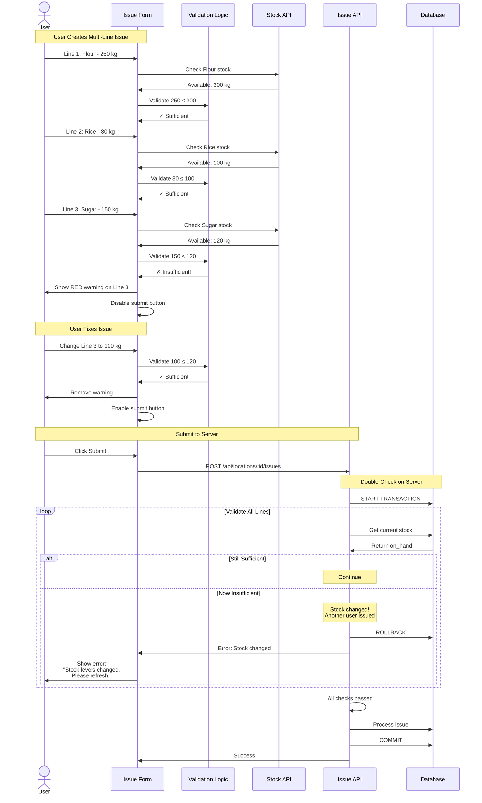

### Validation Timing Diagram

```mermaid
gantt
    title Stock Validation Timeline
    dateFormat X
    axisFormat %s

    section Frontend
    User enters quantity     :a1, 0, 1s
    Real-time check         :a2, 1, 2s
    Show warning            :a3, 2, 3s
    User fixes issue        :a4, 3, 5s
    Submit form             :a5, 5, 6s

    section Backend
    Receive request         :b1, 6, 7s
    Start transaction       :b2, 7, 8s
    Re-validate stock       :b3, 8, 10s
    Process if OK           :b4, 10, 12s
    Commit transaction      :b5, 12, 13s
    Return success          :b6, 13, 14s
```

---

## Summary

### Key Patterns We Use

1. **Optimistic UI with Server Validation**
   - Check on frontend for better UX
   - Re-check on backend for security

2. **Atomic Transactions**
   - All-or-nothing database operations
   - Rollback on any error

3. **Real-time Reactive Updates**
   - Vue's reactivity system
   - Pinia stores for shared state
   - Watch for automatic refreshes

4. **Progressive Enhancement**
   - Basic functionality works first
   - Advanced features layer on top
   - Graceful error handling

5. **Security in Depth**
   - Multiple permission checks
   - Frontend hides unauthorized UI
   - Backend enforces all rules

### Data Flow Summary

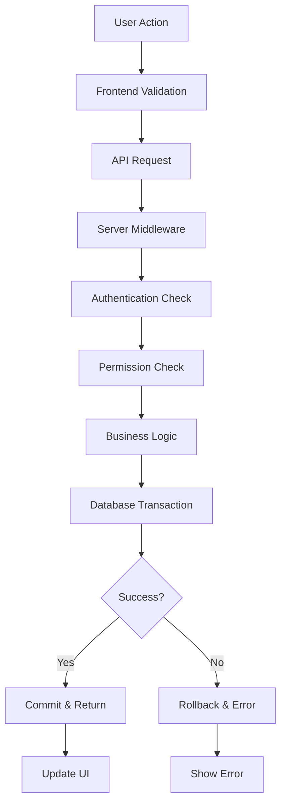

---

**For more details on any feature, refer to the main [Phase 1 Complete Guide](./PHASE_1_COMPLETE_GUIDE.md).**
