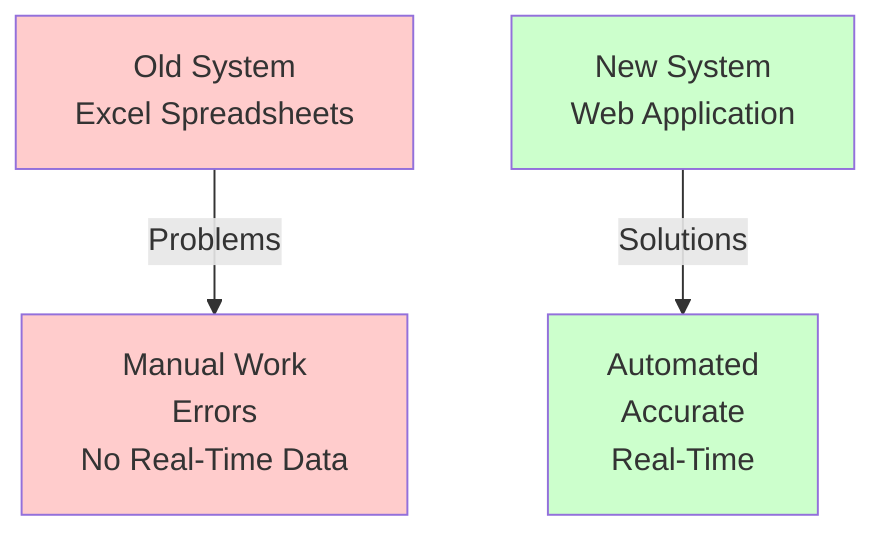
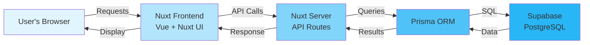
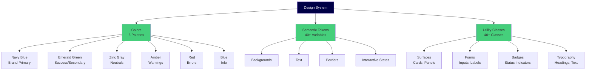

# Phase 1.1: Project Foundation
## Stock Management System - Development Guide

**For Junior Developers**
**Last Updated:** November 8, 2025
**Phase Status:** ✅ Complete

---

## 📖 Quick Navigation

- [Phase 1.1: Project Foundation](phase-1.1-foundation.md) ← You are here
- [Phase 1.2: Database Setup](phase-1.2-database.md)
- [Phase 1.3: Authentication & Security](phase-1.3-authentication.md)

---

## What is This Project?

### The Problem We're Solving

Imagine a restaurant business with **multiple locations** (kitchens, stores, warehouses). They currently track their food inventory using **Excel spreadsheets**. This causes many problems:

- ❌ Hard to know stock levels in real-time
- ❌ Mistakes when moving items between locations
- ❌ Price changes are not tracked properly
- ❌ Difficult to close accounting periods
- ❌ No approval system for important actions

### Our Solution

We're building a **web application** that:

- ✅ Tracks stock in real-time for all locations
- ✅ Manages deliveries, issues, and transfers
- ✅ Detects price changes automatically
- ✅ Coordinates period-end closing across all locations
- ✅ Requires approvals for important operations
- ✅ Works on computers, tablets, and phones (PWA)



---

## Technology Stack - Simple Explanation

### Frontend (What Users See)

| Technology | What It Does | Why We Use It |
|------------|--------------|---------------|
| **Nuxt 4** | Main framework | Builds modern web apps with Vue.js |
| **Vue 3** | UI library | Creates interactive user interfaces |
| **Nuxt UI** | Component library | Ready-made buttons, forms, cards, etc. |
| **Tailwind CSS v4** | Styling | Makes the app look good with utility classes |
| **Pinia** | State management | Stores user data, settings across pages |
| **TypeScript** | Type checking | Catches errors before they happen |

### Backend (Behind the Scenes)

| Technology | What It Does | Why We Use It |
|------------|--------------|---------------|
| **Nuxt Server Routes** | API endpoints | Handles requests from the frontend |
| **Prisma ORM** | Database tool | Talks to the database easily |
| **PostgreSQL** | Database | Stores all our data (users, items, stock) |
| **Supabase** | Database hosting | Cloud service for PostgreSQL |
| **nuxt-auth-utils** | Authentication | Manages user login/logout |
| **Zod** | Validation | Checks if data is correct |

### How They Work Together



---

## Phase 1.1: Project Foundation

### What We Did

In this phase, we **set up the basic structure** of our project - like building the foundation of a house before building the walls.

### Tasks Completed

#### 1.1.1: Project Initialization ✅

**Simple Explanation:**
We created a new Nuxt 4 project and installed all the tools (packages) we need.

**What Was Done:**
- Created the project folder structure
- Installed 289 packages using `pnpm` (like downloading all the tools)
- Set up TypeScript for type checking
- Tested that the development server works

**Result:**
Dev server runs on `http://localhost:3000` ✅

---

#### 1.1.2: Environment Configuration ✅

**Simple Explanation:**
We set up **secret keys** and **configuration** that the app needs to work (like passwords for databases).

**What Was Done:**
- Created `.env.example` (template file)
- Created `.env` (actual secrets file - not in git)
- Set up configuration in `nuxt.config.ts`
- Documented what each environment variable does

**Important Files Created:**
```
.env.example          # Template (safe to share)
.env                  # Real secrets (NEVER share)
nuxt.config.ts        # App configuration
```

**Environment Variables:**
```bash
# Database
DATABASE_URL=postgresql://...

# Supabase
SUPABASE_URL=https://...
SUPABASE_ANON_KEY=...
SUPABASE_SERVICE_KEY=...

# Authentication
AUTH_SECRET=...

# App Settings
NUXT_PUBLIC_SITE_URL=http://localhost:3000
NUXT_PUBLIC_CURRENCY=SAR
```

---

#### 1.1.3: Tailwind CSS v4 Configuration ✅

**Simple Explanation:**
We set up the **design system** - the colors and styles that make the app look good.

**What Was Done:**
- Configured Tailwind CSS v4 using `@theme` directive
- Created color palettes for brand colors:
  - **Navy Blue** (#000046) - primary brand color
  - **Emerald Green** (#45cf7b) - success/secondary color
- Set up light and dark mode support
- Tested all colors work correctly

**Color System:**
```css
/* In app/assets/css/main.css */
@theme {
  --color-navy-500: #000046;     /* Main brand color */
  --color-emerald-500: #45cf7b;  /* Success color */
  /* + 50 more shades from 50-950 */
}
```

**How to Use Colors:**
```vue
<!-- In components -->
<button class="bg-navy-500 text-white">
  Click Me
</button>
```

---

#### 1.1.4: Comprehensive Design System ✅

**Simple Explanation:**
We created a **complete style guide** with colors, buttons, forms, and badges that match our brand.

**What Was Done:**
- Expanded to 6 color palettes (navy, emerald, zinc, amber, red, blue)
- Created 40+ semantic color tokens (like variables for colors)
- Created 40+ utility classes for common styles
- Built business-specific design tokens (stock status, approval badges)
- Documented everything in `DESIGN_SYSTEM.md` (750+ lines)

**Semantic Tokens:**
```css
/* Background Colors */
--ui-bg: var(--color-zinc-50);           /* Page background */
--ui-bg-elevated: var(--color-white);    /* Cards, modals */

/* Text Colors */
--ui-text: var(--color-zinc-900);        /* Main text */
--ui-text-muted: var(--color-zinc-500);  /* Less important text */

/* Status Colors */
--ui-success: var(--color-emerald-500);  /* Success messages */
--ui-error: var(--color-red-500);        /* Error messages */
```

**Utility Classes:**
```vue
<!-- Card with elevation -->
<div class="card-elevated">
  Content here
</div>

<!-- Stock status badges -->
<span class="badge-stock-healthy">In Stock</span>
<span class="badge-stock-low">Low Stock</span>
<span class="badge-stock-critical">Critical</span>
```

**Design System Structure:**



---

## Important Files Created in This Phase

### Configuration Files

| File | What It Does |
|------|--------------|
| `nuxt.config.ts` | Main app configuration |
| `package.json` | Dependencies and scripts |
| `.env` | Environment variables (secrets) |
| `.env.example` | Environment template |
| `tsconfig.json` | TypeScript configuration |

### Styling Files

| File | What It Does |
|------|--------------|
| `app/assets/css/main.css` | Tailwind CSS v4 theme with @theme directive |
| `project-docs/DESIGN_SYSTEM.md` | Complete design system documentation (750+ lines) |

---

## Key Concepts Learned

### 1. Nuxt 4 Project Structure

Nuxt 4 uses `/app/` directory instead of `/src/`:
```
/app/
  /assets/css/     # Styles
  /components/     # Vue components
  /composables/    # Reusable logic
  /layouts/        # Page layouts
  /middleware/     # Route guards
  /pages/          # Auto-routing pages
  /stores/         # Pinia stores
  /utils/          # Client utilities
```

### 2. Environment Variables

**Two types:**

**Private (server-only):**
```typescript
// nuxt.config.ts
export default defineNuxtConfig({
  runtimeConfig: {
    // Private - only available server-side
    databaseUrl: process.env.DATABASE_URL,
    authSecret: process.env.AUTH_SECRET
  }
})
```

**Public (client + server):**
```typescript
// nuxt.config.ts
export default defineNuxtConfig({
  runtimeConfig: {
    public: {
      // Public - available client + server
      siteUrl: process.env.NUXT_PUBLIC_SITE_URL,
      currency: process.env.NUXT_PUBLIC_CURRENCY
    }
  }
})
```

### 3. Tailwind CSS v4 `@theme` Directive

**Old way (Tailwind v3):**
```javascript
// tailwind.config.js
module.exports = {
  theme: {
    extend: {
      colors: {
        navy: '#000046'
      }
    }
  }
}
```

**New way (Tailwind v4):**
```css
/* app/assets/css/main.css */
@theme {
  --color-navy-500: #000046;
}
```

### 4. Design System Best Practices

**✅ Do:**
- Use semantic color tokens: `var(--ui-bg)`
- Use utility classes: `card-elevated`
- Use semantic Nuxt UI colors: `color="primary"`

**❌ Don't:**
- Inline hex colors: `style="color: #000046"`
- Use custom names in Nuxt UI: `color="navy"`
- Use `@apply` with custom classes (Tailwind v4 limitation)

---

## Common Terms Explained

| Term | Simple Explanation |
|------|-------------------|
| **Package Manager** | Tool to install code libraries (we use pnpm) |
| **Environment Variable** | Secret configuration value (like passwords) |
| **TypeScript** | JavaScript with type checking to catch errors |
| **Semantic Token** | Color variable with meaning (--ui-bg, --ui-error) |
| **Utility Class** | Pre-built CSS class (card-elevated, badge-primary) |
| **Design System** | Complete style guide (colors, fonts, components) |

---

## What's Next?

After completing the foundation, we moved to:

**→ [Phase 1.2: Database Setup](phase-1.2-database.md)**

In the next phase, we:
- Set up Supabase cloud database
- Created Prisma schema (22 tables)
- Applied database migrations
- Added seed data for testing

---

**Made with ❤️ for Junior Developers**

---

**Last Updated:** November 8, 2025
**Phase:** 1.1 Foundation ✅ Complete
**Next:** [Phase 1.2: Database Setup](phase-1.2-database.md)
