# Phase 1.3: Authentication & Security

## Stock Management System - Development Guide

**For Junior Developers**
**Last Updated:** November 8, 2025
**Phase Status:** ✅ Complete

---

## 📖 Quick Navigation

- [Phase 1.1: Project Foundation](phase-1.1-foundation.md)
- [Phase 1.2: Database Setup](phase-1.2-database.md)
- [Phase 1.3: Authentication & Security](phase-1.3-authentication.md) ← You are here

---

## Phase 1.3: Authentication & Security

### What We Did

In this phase, we built the **login system** - how users log in, who can access what, and protecting pages.

### Authentication Architecture


### Tasks Completed

#### 1.3.1: Auth Setup with nuxt-auth-utils ✅

**Simple Explanation:**
We installed and configured **nuxt-auth-utils** - a tool that manages login sessions using secure cookies.

**What Was Done:**

- Installed nuxt-auth-utils package (v0.5.25)
- Configured session settings:
  - **httpOnly cookies** (JavaScript can't access them - safer)
  - **Secure flag** (only sent over HTTPS in production)
  - **SameSite: lax** (protects against CSRF attacks)
  - **7-day expiration** (users stay logged in for a week)
- Created test endpoint to verify setup

**Security Features:**

```mermaid
graph TB
    C[Session Cookie] --> H[httpOnly<br/>❌ No JS Access]
    C --> S[Secure<br/>✅ HTTPS Only]
    C --> SS[SameSite: lax<br/>✅ CSRF Protection]
    C --> E[7-day Expiration<br/>✅ Auto Logout]

    style C fill:#000046,color:#fff
    style H fill:#45cf7b
    style S fill:#45cf7b
    style SS fill:#45cf7b
    style E fill:#45cf7b
```



**Configuration:**

```typescript
// nuxt.config.ts
auth: {
  session: {
    cookie: {
      httpOnly: true,      // Can't be read by JavaScript
      secure: true,        // HTTPS only (production)
      sameSite: 'lax',     // CSRF protection
      maxAge: 604800       // 7 days in seconds
    }
  }
}
```

---

#### 1.3.2: Password Hashing Utility ✅

**Simple Explanation:**
We created functions to **safely store passwords**. Never store plain text passwords!

**What Was Done:**

- Created password hashing function (uses bcrypt with 10 salt rounds)
- Created password verification function (checks if password is correct)
- Created password strength validator (checks if password is strong enough)

**How Password Hashing Works:**


**Password Strength Requirements:**

- ✅ Minimum 8 characters
- ✅ At least one uppercase letter (A-Z)
- ✅ At least one lowercase letter (a-z)
- ✅ At least one number (0-9)
- ✅ At least one special character (!@#$%^&\*)

**Functions Created:**

```typescript
// Hash a password
const hashed = await hashUserPassword("Admin@123");
// Result: $2a$10$aB3Xc...

// Verify a password
const isValid = await verifyUserPassword("Admin@123", hashed);
// Result: true

// Check password strength
const validation = validatePasswordStrength("weak");
// Result: { valid: false, message: "...", strength: "weak" }
```

---

#### 1.3.3: Auth API Routes ✅

**Simple Explanation:**
We created **4 API endpoints** for login, logout, session check, and user registration.

**API Endpoints Created:**

##### 1. POST /api/auth/login

**What it does:** Logs in a user

**Request:**

```json
{
  "email": "admin@foodstock.local", // or "admin" (username)
  "password": "Admin@123"
}
```

**Response (Success):**

```json
{
  "user": {
    "id": "...",
    "username": "admin",
    "email": "admin@foodstock.local",
    "full_name": "System Administrator",
    "role": "ADMIN",
    "is_active": true,
    "locations": [
      {
        "location_id": "...",
        "code": "MAIN-KIT",
        "name": "Main Kitchen",
        "access_level": "MANAGE"
      }
    ],
    "default_location": { ... }
  }
}
```

**Response (Error):**

```json
{
  "statusCode": 401,
  "message": "Invalid credentials"
}
```

##### 2. POST /api/auth/logout

**What it does:** Logs out the current user

**Response:**

```json
{
  "message": "Logged out successfully"
}
```

##### 3. GET /api/auth/session

**What it does:** Gets the current user's session

**Response (Logged in):**

```json
{
  "user": { ... }  // Same as login response
}
```

**Response (Not logged in):**

```json
{
  "user": null
}
```

##### 4. POST /api/auth/register

**What it does:** Creates a new user (Admin only)

**Request:**

```json
{
  "username": "operator1",
  "email": "operator1@foodstock.local",
  "password": "StrongPass123!",
  "full_name": "Operator One",
  "role": "OPERATOR",
  "default_location_id": "..."
}
```

**Security:**

- ✅ Only admins can create users
- ✅ Username must be unique
- ✅ Email must be unique
- ✅ Password must be strong

**Login Flow:**


---

#### 1.3.4: Auth Middleware ✅

**Simple Explanation:**
We created **guards** that protect API routes. If you're not logged in, you can't access them.

**What Was Done:**

- Created auth middleware (protects all `/api/*` routes)
- Created location-access middleware (checks if user can access a location)

**Middleware Created:**

##### 1. Auth Middleware

**File:** `server/middleware/auth.ts`

**What it does:**

- ✅ Runs on ALL API routes except `/api/auth/*`
- ✅ Checks if user is logged in
- ✅ If not logged in → Returns 401 error
- ✅ If logged in → Attaches user to `event.context.user`

##### 2. Location Access Middleware

**File:** `server/middleware/location-access.ts`

**What it does:**

- ✅ Extracts `locationId` from URL
- ✅ Checks if user has access to that location
- ✅ Admins/Supervisors → Access to ALL locations
- ✅ Operators → Only locations they're assigned to
- ✅ If no access → Returns 403 error

**How Middleware Works:**

```mermaid
graph TB
    R[API Request] --> AM{Auth Middleware}
    AM -->|Not Logged In| E1[❌ 401 Unauthorized]
    AM -->|Logged In| LAM{Location Access<br/>Middleware}
    LAM -->|No Access| E2[❌ 403 Forbidden]
    LAM -->|Has Access| H[✅ Route Handler<br/>Execute Request]

    style R fill:#e1f5ff
    style AM fill:#81d4fa
    style LAM fill:#4fc3f7,color:#fff
    style E1 fill:#f44336,color:#fff
    style E2 fill:#f44336,color:#fff
    style H fill:#4caf50,color:#fff
```



**Example:**

```typescript
// In API route handlers:
export default defineEventHandler(async (event) => {
  // User is already attached by auth middleware
  const user = event.context.user;

  console.log(user.role); // "ADMIN"
  console.log(user.email); // "admin@foodstock.local"

  // Do your logic here...
});
```

---

#### 1.3.5: Auth Store (Pinia) ✅

**Simple Explanation:**
We created a **state manager** that stores user information across all pages in the app.

**What Was Done:**

- Created Pinia store (`app/stores/auth.ts`)
- Added user state, loading state, error state
- Created 9 computed getters (quick checks)
- Created 3 actions (login, logout, fetchSession)
- Created 5 location helper methods

**Store Structure:**

```typescript
interface AuthState {
  user: SessionUser | null; // Current user data
  loading: boolean; // Is loading?
  error: string | null; // Error message
}
```

**Computed Getters:**

```typescript
isAuthenticated; // Is user logged in?
role; // User's role (ADMIN, SUPERVISOR, OPERATOR)
locations; // User's accessible locations
isAdmin; // Is user an admin?
isSupervisor; // Is user a supervisor?
isOperator; // Is user an operator?
fullName; // User's full name
defaultLocation; // User's default location
```

**Actions:**

```typescript
login(email, password); // Log in
logout(); // Log out
fetchSession(); // Get current session
```

**Location Helpers:**

```typescript
hasLocationAccess(locationId); // Can access this location?
getLocationAccessLevel(locationId); // VIEW, POST, or MANAGE?
canPostAtLocation(locationId); // Can create transactions?
canManageLocation(locationId); // Can manage location?
getAccessibleLocationIds(); // Array of accessible IDs
```

**How the Store Works:**

```mermaid
graph TB
    subgraph Store State
        U[user: SessionUser | null]
        L[loading: boolean]
        E[error: string | null]
    end

    subgraph Computed Getters
        IA[isAuthenticated]
        R[role]
        LOC[locations]
    end

    subgraph Actions
        LI[login()]
        LO[logout()]
        FS[fetchSession()]
    end

    C[Component] -->|Uses| IA
    C -->|Calls| LI
    LI -->|Updates| U
    U -->|Reactive| C

    style U fill:#000046,color:#fff
    style IA fill:#45cf7b
    style LI fill:#45cf7b
```

---

#### 1.3.6: Auth Composable ✅

**Simple Explanation:**
We created a **wrapper function** that makes it easy to use the auth store in any component.

**What Was Done:**

- Created `useAuth()` composable
- Exported all state as reactive refs
- Added role checking helpers
- Added location access methods
- Added permission methods

**How to Use:**

```vue
<script setup lang="ts">
const {
  // State
  user,
  isAuthenticated,
  role,

  // Actions
  login,
  logout,

  // Role Checks
  isAdmin,
  hasRole,

  // Location Checks
  hasLocationAccess,
  canPostAtLocation,

  // Permissions
  canApproveTransfers,
  canClosePeriods,
  canPostDeliveries,
} = useAuth();
</script>

<template>
  <div v-if="isAuthenticated">
    <p>Welcome {{ user.full_name }}!</p>
    <p>Role: {{ role }}</p>

    <button v-if="canPostDeliveries">Post Delivery</button>

    <button v-if="canApproveTransfers">Approve Transfer</button>
  </div>
</template>
```

**Permission Methods:**

```typescript
// Role-based
canApproveTransfers(); // Supervisor or Admin
canClosePeriods(); // Admin only
canManageItems(); // Admin only
canManageUsers(); // Admin only

// Location-based
canPostDeliveries(locId); // Can post at this location
canEditReconciliations(); // Supervisor or Admin
```

---

#### 1.3.7: Login Page ✅

**Simple Explanation:**
We created the **login page** where users enter their email and password.

**What Was Done:**

- Created `/login` page
- Built login form with validation
- Added error handling
- Added success handling with redirect
- Styled with Nuxt UI components

**Login Page Features:**


**Form Fields:**

- **Email/Username** (required, supports both)
- **Password** (required, hidden)
- **Remember Me** (optional checkbox)

**Validation:**

- Email must be valid format
- Password required

**Error Messages:**

- Invalid credentials
- User not found
- Account disabled
- Network errors

---

#### 1.3.8: Route Protection ✅

**Simple Explanation:**
We created **guards** that protect pages. If you're not logged in or don't have permission, you can't access them.

**What Was Done:**

- Created global auth middleware (redirects to login)
- Created role middleware (checks user role)
- Enhanced login page with redirect support

**Middleware Created:**

##### 1. Global Auth Middleware

**File:** `app/middleware/auth.global.ts`

**What it does:**

- ✅ Runs on EVERY page navigation
- ✅ Checks if user is logged in
- ✅ If not logged in → Redirect to `/login?redirect=/intended-page`
- ✅ If logged in → Allow access
- ✅ Fetches session on first load

##### 2. Role Middleware

**File:** `app/middleware/role.ts`

**What it does:**

- ✅ Checks if user has required role
- ✅ Supports single role: `roleRequired: 'ADMIN'`
- ✅ Supports multiple roles: `roleRequired: ['ADMIN', 'SUPERVISOR']`
- ✅ Supports minimum role: `minRole: 'SUPERVISOR'` (SUPERVISOR or ADMIN)
- ✅ If no access → Redirect to dashboard with error toast

**How to Protect a Page:**

```vue
<!-- pages/admin-only.vue -->
<script setup lang="ts">
definePageMeta({
  middleware: "role",
  roleRequired: "ADMIN", // Only admins can access
});
</script>

<template>
  <div>
    <h1>Admin Only Page</h1>
  </div>
</template>
```

```vue
<!-- pages/supervisors.vue -->
<script setup lang="ts">
definePageMeta({
  middleware: "role",
  minRole: "SUPERVISOR", // SUPERVISOR or ADMIN can access
});
</script>

<template>
  <div>
    <h1>Supervisor Dashboard</h1>
  </div>
</template>
```

**Route Protection Flow:**


---

#### 1.3.9: Role-Based UI Elements ✅

**Simple Explanation:**
We created **permission checks** that show/hide buttons and features based on user role.

**What Was Done:**

- Created `usePermissions()` composable
- Added 30+ permission check functions
- Created reusable `PermissionCheck` component

**Permission Categories:**


**Example Usage:**

```vue
<script setup lang="ts">
const { canPostDeliveries, canApproveTransfers, canClosePeriod, canEditItems } = usePermissions();
</script>

<template>
  <div>
    <!-- Show button only if user can post deliveries -->
    <UButton v-if="canPostDeliveries(currentLocationId)" @click="createDelivery">
      New Delivery
    </UButton>

    <!-- Show button only if user can approve transfers -->
    <UButton v-if="canApproveTransfers" @click="approveTransfer">Approve Transfer</UButton>

    <!-- Show button only if user is admin -->
    <UButton v-if="canClosePeriod" @click="closePeriod">Close Period</UButton>
  </div>
</template>
```

**Permission Check Component:**

```vue
<template>
  <PermissionCheck :allowed="canEditItems">
    <!-- This content only shows if user can edit items -->
    <UButton @click="editItem">Edit Item</UButton>
  </PermissionCheck>
</template>
```

**Role Hierarchy:**


---

## How Everything Connects

### Complete System Architecture


### Request Flow Example: Login


---

## What's Next?

We're currently at **Phase 1.3 Complete** (23 tasks done). Here's what comes next:

### Phase 1.4: Base Layout & Navigation (Days 4-5)

```mermaid
graph LR
    A[Current:<br/>Phase 1.3<br/>✅ Complete] --> B[Next:<br/>Phase 1.4<br/>Layout & Nav]
    B --> C[Then:<br/>Phase 1.5<br/>Locations]
    C --> D[Then:<br/>Phase 1.6<br/>Items]

    style A fill:#4caf50,color:#fff
    style B fill:#ff9800,color:#fff
    style C fill:#e0e0e0
    style D fill:#e0e0e0
```



**What We'll Build:**

1. **App Layout** - Header, sidebar, main content area
2. **Navbar** - Logo, location selector, user menu
3. **Sidebar** - Navigation menu with role-based filtering
4. **Global Components** - Loading spinners, error alerts
5. **Toast Notifications** - Success/error messages
6. **Global Stores** - UI state, period state, location state

### Phase 1.5: Location Management (Days 5-6)

**What We'll Build:**

1. Location list page
2. Create location page
3. Edit location page
4. User-location assignment
5. Location switcher component

### Phase 1.6: Items & Prices (Days 6-8)

**What We'll Build:**

1. Items list page
2. Create item page
3. Edit item page
4. Period price setting page
5. Location stock display

### Remaining Slices

- **Slice 2:** Transfers & Controls (10 days)
- **Slice 3:** Period Management (8 days)
- **Slice 4:** Polish & Performance (5 days)

**Total Remaining:** ~30 days of development

---

## Important Files to Know

### Configuration Files

| File             | What It Does                    |
| ---------------- | ------------------------------- |
| `nuxt.config.ts` | Main app configuration          |
| `package.json`   | Dependencies and scripts        |
| `.env`           | Environment variables (secrets) |
| `tsconfig.json`  | TypeScript configuration        |

### Backend Files

| File/Folder            | What It Does                           |
| ---------------------- | -------------------------------------- |
| `prisma/schema.prisma` | Database structure                     |
| `server/api/`          | API endpoints                          |
| `server/middleware/`   | Server middleware (auth, location)     |
| `server/utils/`        | Server utilities (Prisma client, auth) |

### Frontend Files

| File/Folder        | What It Does                             |
| ------------------ | ---------------------------------------- |
| `app/pages/`       | Pages (auto-routing)                     |
| `app/components/`  | Reusable components                      |
| `app/composables/` | Reusable logic (useAuth, usePermissions) |
| `app/stores/`      | Pinia stores (auth.ts)                   |
| `app/middleware/`  | Client middleware (route guards)         |
| `app/layouts/`     | Page layouts                             |
| `app/assets/css/`  | Styles (main.css with design system)     |

### Documentation Files

| File                                    | What It Does                 |
| --------------------------------------- | ---------------------------- |
| `CLAUDE.md`                             | Instructions for Claude Code |
| `README.md`                             | Project overview and setup   |
| `project-docs/MVP_DEVELOPMENT_TASKS.md` | Complete task list           |
| `project-docs/TASK_COMPLETION_LOG.md`   | Completed tasks log          |
| `project-docs/DESIGN_SYSTEM.md`         | Design system documentation  |
| `project-docs/PRD.md`                   | Product requirements         |
| `project-docs/System_Design.md`         | Technical design             |

---

## Common Terms Explained

### Technical Terms

| Term           | Simple Explanation                                                      | Example                      |
| -------------- | ----------------------------------------------------------------------- | ---------------------------- |
| **API**        | Application Programming Interface - how frontend talks to backend       | `/api/auth/login`            |
| **ORM**        | Object-Relational Mapping - talks to database using code instead of SQL | Prisma                       |
| **JWT**        | JSON Web Token - encrypted session token                                | Login token                  |
| **httpOnly**   | Cookie that JavaScript can't access (more secure)                       | Session cookie               |
| **Migration**  | Database version control - applying schema changes                      | Creating tables              |
| **Seed**       | Adding test data to database                                            | Admin user, test items       |
| **Middleware** | Code that runs before route handlers                                    | Auth check, permission check |
| **Composable** | Reusable logic function in Vue                                          | useAuth(), usePermissions()  |
| **Store**      | Global state manager (Pinia)                                            | Auth store                   |
| **Component**  | Reusable UI piece                                                       | Login form, button           |
| **WAC**        | Weighted Average Cost - inventory costing method                        | Stock valuation              |
| **NCR**        | Non-Conformance Report - quality issue report                           | Price variance               |
| **POB**        | People on Board - daily headcount                                       | Manday tracking              |

### Business Terms

| Term               | Simple Explanation                         | Example                     |
| ------------------ | ------------------------------------------ | --------------------------- |
| **Location**       | Physical site where stock is stored        | Kitchen, Warehouse          |
| **Period**         | Monthly accounting cycle                   | November 2025               |
| **Delivery**       | Goods received from supplier               | Food delivery               |
| **Issue**          | Stock taken out for use                    | Kitchen issues flour        |
| **Transfer**       | Moving stock between locations             | Warehouse → Kitchen         |
| **Reconciliation** | Period-end stock calculation               | Monthly stock report        |
| **Cost Centre**    | Department that uses items                 | FOOD, CLEAN, OTHER          |
| **Price Variance** | Delivery price different from locked price | Expected SAR 10, got SAR 12 |
| **Period Close**   | Closing accounting period                  | End of month process        |
| **Approval**       | Manager permission for action              | Approve transfer            |

### Role Terms

| Role           | What They Can Do                                            |
| -------------- | ----------------------------------------------------------- |
| **OPERATOR**   | Post deliveries, issues; view stock                         |
| **SUPERVISOR** | Approve transfers, edit reconciliations, view all locations |
| **ADMIN**      | Full access - manage items, users, close periods            |

---

## Learning Path for New Developers

### Week 1: Understanding the Foundation

1. **Day 1-2:** Read all three phase guides
2. **Day 3:** Explore the file structure
3. **Day 4:** Run the app locally (`pnpm dev`)
4. **Day 5:** Login and test the auth system

### Week 2: Database & Backend

1. **Day 1:** Study the Prisma schema
2. **Day 2:** Open Prisma Studio and explore data
3. **Day 3:** Read API route examples
4. **Day 4:** Understand middleware (auth, location)
5. **Day 5:** Try creating a simple API endpoint

### Week 3: Frontend & UI

1. **Day 1:** Study the design system
2. **Day 2:** Explore components
3. **Day 3:** Understand composables (useAuth, usePermissions)
4. **Day 4:** Study the auth store
5. **Day 5:** Build a simple page

### Week 4: Business Logic

1. **Day 1:** Understand multi-location concept
2. **Day 2:** Learn about WAC calculation
3. **Day 3:** Study period management
4. **Day 4:** Understand price variance detection
5. **Day 5:** Review the complete flow

---

## Summary

We've successfully built the **foundation** of the Stock Management System:

✅ **Project Setup** - Nuxt 4, TypeScript, all dependencies
✅ **Design System** - Colors, styles, components
✅ **Database** - 22 tables, complete schema
✅ **Authentication** - Login, logout, sessions
✅ **Authorization** - Roles, permissions, guards
✅ **Security** - Password hashing, httpOnly cookies, middleware

**What Works Now:**

- Users can log in/out
- Sessions persist for 7 days
- Pages are protected by authentication
- Roles control what users can see/do
- Locations control where users can work
- Database stores all data
- API endpoints are secure

**What's Next:**

- Building the UI (layout, navigation)
- Creating location management pages
- Creating item management pages
- Building transaction pages (deliveries, issues, transfers)
- Implementing period management
- Adding reports

---

**Made with ❤️ for Junior Developers**
_Remember: Every expert was once a beginner. Take your time, ask questions, and keep learning!_

---

**Last Updated:** November 8, 2025
**Phase:** 1.3 Authentication & Security ✅ Complete
**Previous:** [Phase 1.2: Database Setup](phase-1.2-database.md)
**Status:** Ready for Phase 1.4 (Layout & Navigation)
