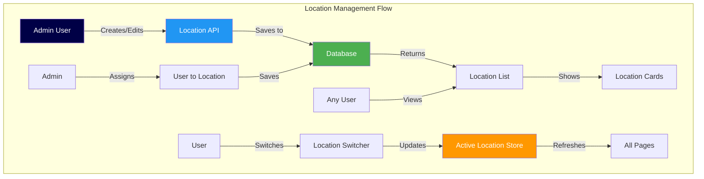
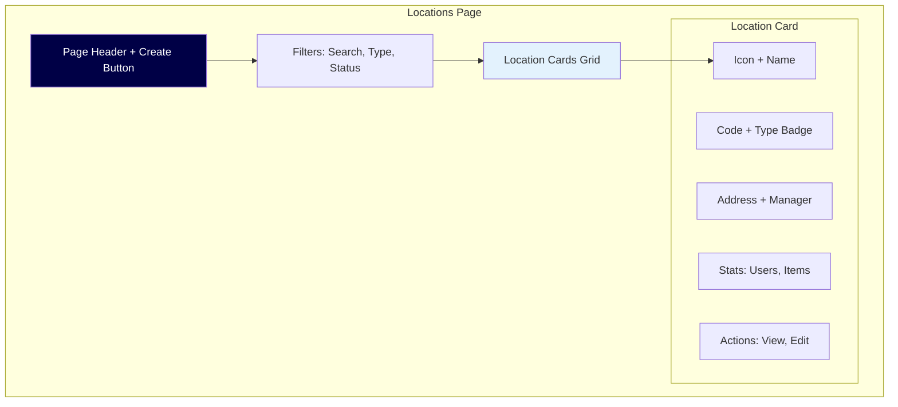
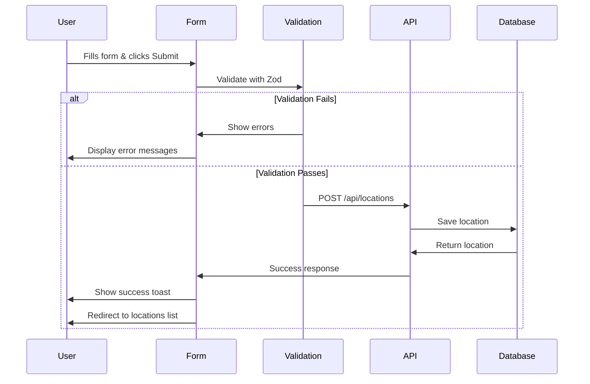
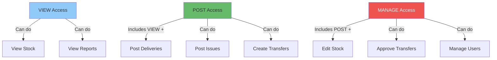
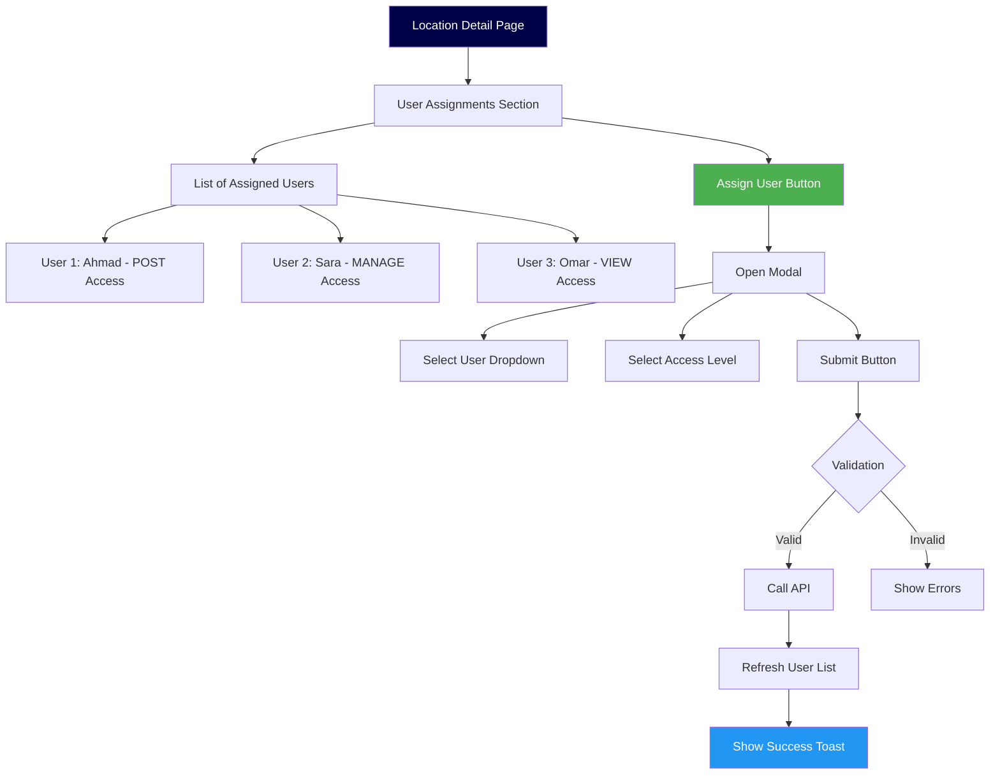
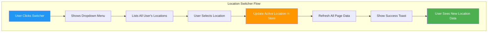
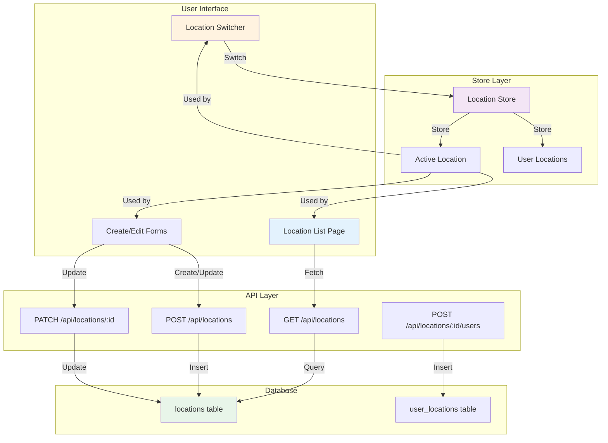

# Phase 1.5: Location Management

## Stock Management System - Development Guide

**For Junior Developers**
**Last Updated:** November 9, 2025
**Phase Status:** ✅ Complete

---

## 📖 Quick Navigation

- [Phase 1.1: Project Foundation](phase-1.1-foundation.md)
- [Phase 1.2: Database Setup](phase-1.2-database.md)
- [Phase 1.3: Authentication & Security](phase-1.3-authentication.md)
- [Phase 1.4: Base Layout & Navigation](phase-1.4-layout-navigation.md)
- [Phase 1.5: Location Management](phase-1.5-location-management.md) ← You are here

---

## What We Did in This Phase

In this phase, we built the **Location Management System** - the feature that allows admins to manage multiple business locations (kitchens, stores, warehouses) and assign users to them.

Think of locations as **different branches** of your business. For example:

- **Main Kitchen** - Where food is prepared
- **Central Store** - Where items are stored
- **Warehouse 1** - Where raw materials are kept

This phase created the tools to:

- ✅ **Add new locations** (create kitchen, store, warehouse)
- ✅ **Edit location details** (change name, address, manager)
- ✅ **View all locations** (see list of all branches)
- ✅ **Assign users to locations** (give employees access to specific branches)
- ✅ **Switch between locations** (quickly move between different branches)

### Why Locations Are Important

In a multi-location business:

- **Different places** have different stock
- **Different users** work at different places
- **Each location** tracks its own inventory separately
- **Managers** need to see only their location's data

---

## System Architecture Overview

Here's how the Location Management system works:



---

## Tasks Completed

### 1.5.1: Location API Routes ✅

**Simple Explanation:**
We created the **backend endpoints** (API routes) that handle all location operations - like creating, reading, updating, and deleting locations.

Think of API routes as **telephone lines** between the user interface and the database. When you click "Create Location" on the screen, an API route receives that request and saves it to the database.

**What Was Done:**

1. **GET /api/locations** - Get list of all locations
2. **POST /api/locations** - Create a new location
3. **GET /api/locations/:id** - Get details of one location
4. **PATCH /api/locations/:id** - Update a location
5. **GET /api/locations/:id/users** - Get users assigned to a location

**File Structure:**

```
server/api/locations/
├── index.get.ts          ← Get all locations
├── index.post.ts         ← Create location
├── [id].get.ts           ← Get one location
├── [id].patch.ts         ← Update location
└── [id]/
    └── users.get.ts      ← Get location users
```

#### How Each API Route Works

##### 1. GET /api/locations (Get All Locations)

This endpoint returns a list of locations based on who is asking:

- **Admins/Supervisors**: See ALL locations
- **Operators**: See only locations they are assigned to

You can also filter locations:

- **By type**: `?type=KITCHEN` (only kitchens)
- **By status**: `?is_active=true` (only active ones)
- **By search**: `?search=Main` (search by name or code)

**Example Code:**

```typescript
// server/api/locations/index.get.ts
export default defineEventHandler(async (event) => {
  // Get the logged-in user
  const session = await getUserSession(event);

  // Get filter parameters from URL
  const { type, is_active, search } = getQuery(event);

  // Build database query
  const where = {};

  if (type) where.type = type;
  if (is_active !== undefined) where.is_active = is_active;
  if (search) {
    where.OR = [
      { name: { contains: search, mode: "insensitive" } },
      { code: { contains: search, mode: "insensitive" } },
    ];
  }

  // If user is Operator, show only their locations
  if (session.user.role === "OPERATOR") {
    const userLocationIds = await getUserLocationIds(session.user.id);
    where.id = { in: userLocationIds };
  }

  // Fetch locations from database
  const locations = await prisma.location.findMany({
    where,
    include: {
      manager: true,
      _count: {
        select: {
          user_locations: true,
          location_stock: true,
        },
      },
    },
    orderBy: { name: "asc" },
  });

  return { locations };
});
```

**What This Does:**

1. Gets the current user from session
2. Gets filter parameters from URL query
3. Builds a database search based on filters
4. Limits results for Operators (they see only their locations)
5. Fetches locations with related data (manager, counts)
6. Returns locations in alphabetical order

##### 2. POST /api/locations (Create Location)

This endpoint creates a new location. **Only admins** can do this.

**Required Fields:**

- `code` - Unique code (e.g., "MAIN-KIT")
- `name` - Location name (e.g., "Main Kitchen")
- `type` - KITCHEN, STORE, CENTRAL, or WAREHOUSE

**Optional Fields:**

- `address` - Physical address
- `manager_id` - User ID of the manager
- `timezone` - Defaults to "Asia/Riyadh"

**Example Code:**

```typescript
// server/api/locations/index.post.ts
const createLocationSchema = z.object({
  code: z.string().min(1).max(10),
  name: z.string().min(1).max(100),
  type: z.enum(["KITCHEN", "STORE", "CENTRAL", "WAREHOUSE"]),
  address: z.string().optional(),
  manager_id: z.string().uuid().optional(),
  timezone: z.string().default("Asia/Riyadh"),
});

export default defineEventHandler(async (event) => {
  // Check if user is admin
  if (session.user.role !== "ADMIN") {
    throw createError({
      statusCode: 403,
      message: "Only admins can create locations",
    });
  }

  // Get and validate data from request
  const body = await readBody(event);
  const data = createLocationSchema.parse(body);

  // Make code uppercase
  data.code = data.code.toUpperCase();

  // Create location in database
  const location = await prisma.location.create({
    data: {
      code: data.code,
      name: data.name,
      type: data.type,
      address: data.address,
      manager_id: data.manager_id,
      timezone: data.timezone,
      is_active: true,
    },
  });

  return { location };
});
```

**Validation with Zod:**
Zod is a library that checks if the data is correct. It's like a **security guard** that checks if the data coming in is valid before saving it.

For example:

- `z.string().min(1)` - Must be a text with at least 1 character
- `z.enum([...])` - Must be one of the specific values listed
- `.optional()` - This field is not required

##### 3. GET /api/locations/:id (Get One Location)

This endpoint gets detailed information about a single location.

It returns:

- Basic location info (code, name, type, address)
- Manager information
- Count of users assigned
- Count of stock items
- Count of transactions (deliveries, issues, transfers)

**Example Response:**

```json
{
  "location": {
    "id": "abc-123",
    "code": "MAIN-KIT",
    "name": "Main Kitchen",
    "type": "KITCHEN",
    "address": "Building A, Floor 2, Riyadh",
    "manager": {
      "id": "user-123",
      "full_name": "Ahmad Ali",
      "email": "ahmad@example.com"
    },
    "_count": {
      "user_locations": 5, // 5 users assigned
      "location_stock": 120, // 120 items in stock
      "deliveries": 45, // 45 deliveries received
      "issues": 30, // 30 issues created
      "transfers_from": 10, // 10 transfers sent
      "transfers_to": 8 // 8 transfers received
    }
  }
}
```

##### 4. PATCH /api/locations/:id (Update Location)

This endpoint updates an existing location. **Only admins** can do this.

**Important:** The `code` field CANNOT be changed after creation (it's like a serial number).

You can update:

- Name
- Type
- Address
- Manager
- Timezone
- Active status (turn location on/off)

**Example Code:**

```typescript
// server/api/locations/[id].patch.ts
const updateLocationSchema = z.object({
  name: z.string().min(1).max(100).optional(),
  type: z.enum(["KITCHEN", "STORE", "CENTRAL", "WAREHOUSE"]).optional(),
  address: z.string().optional(),
  manager_id: z.string().uuid().optional().nullable(),
  timezone: z.string().optional(),
  is_active: z.boolean().optional(),
});

export default defineEventHandler(async (event) => {
  const locationId = event.context.params.id;
  const body = await readBody(event);
  const data = updateLocationSchema.parse(body);

  // Update in database
  const location = await prisma.location.update({
    where: { id: locationId },
    data: data,
  });

  return { location };
});
```

**Partial Updates:**
Notice how all fields are `.optional()` in the schema? This means you can update just ONE field without sending all fields. This is called a **partial update**.

Example: To change just the name:

```json
{
  "name": "New Kitchen Name"
}
```

##### 5. GET /api/locations/:id/users (Get Location Users)

This endpoint returns all users assigned to a specific location.

For each user, it shows:

- User details (name, email, role)
- Access level (VIEW, POST, or MANAGE)
- When they were assigned
- Who assigned them

**Example Response:**

```json
{
  "users": [
    {
      "user_id": "user-123",
      "location_id": "loc-456",
      "access_level": "MANAGE",
      "assigned_at": "2025-11-01T10:00:00Z",
      "user": {
        "full_name": "Ahmad Ali",
        "email": "ahmad@example.com",
        "role": "SUPERVISOR"
      },
      "assigner": {
        "full_name": "Admin User"
      }
    }
  ]
}
```

#### Error Handling in API Routes

All API routes handle errors properly:

| Error Code | Meaning      | Example                      |
| ---------- | ------------ | ---------------------------- |
| **400**    | Bad Request  | Missing required field       |
| **401**    | Unauthorized | User not logged in           |
| **403**    | Forbidden    | User doesn't have permission |
| **404**    | Not Found    | Location doesn't exist       |
| **409**    | Conflict     | Location code already exists |
| **500**    | Server Error | Database error               |

**Example Error Response:**

```json
{
  "statusCode": 409,
  "statusMessage": "Conflict",
  "data": {
    "code": "DUPLICATE_CODE",
    "message": "Location code MAIN-KIT already exists",
    "details": {...}
  }
}
```

---

### 1.5.2: Location Management UI ✅

**Simple Explanation:**
We created the **user interface** (screens) that allow users to see and manage locations.

Think of this as the **control panel** where admins can:

- See all locations in a nice grid
- Search for specific locations
- Filter by type or status
- Create new locations
- Edit existing locations

**Pages Created:**

```
app/pages/locations/
├── index.vue             ← List all locations
├── create.vue            ← Create new location form
└── [id]/
    ├── index.vue         ← Location details
    └── edit.vue          ← Edit location form
```

**Components Created:**

```
app/components/location/
└── LocationCard.vue      ← Reusable location card
```

#### Locations List Page (index.vue)

This is the main page that shows all locations in a grid.

**Features:**

1. **Search Bar** - Search by name or code
2. **Type Filter** - Show only Kitchens, Stores, etc.
3. **Status Filter** - Show only Active or Inactive
4. **Create Button** - Add new location (admins only)
5. **Location Cards** - Visual cards for each location

**Visual Layout:**



**How Search Works:**

```vue
<!-- pages/locations/index.vue -->
<template>
  <div>
    <!-- Search Input -->
    <UInput
      v-model="filters.search"
      placeholder="Search by name or code..."
      @input="debouncedFetch"
    />

    <!-- Location Grid -->
    <div class="grid grid-cols-1 md:grid-cols-2 lg:grid-cols-3 gap-6">
      <LocationCard
        v-for="location in locations"
        :key="location.id"
        :location="location"
        @view-details="handleViewDetails"
        @edit="handleEdit"
      />
    </div>
  </div>
</template>

<script setup>
const filters = reactive({
  search: "",
  type: null,
  is_active: null,
});

// Debounce means "wait a bit before searching"
// If user types fast, don't search after every letter
// Wait until they stop typing for 500ms
const debouncedFetch = useDebounceFn(() => {
  fetchLocations();
}, 500);

const fetchLocations = async () => {
  const query = {};

  if (filters.search) query.search = filters.search;
  if (filters.type) query.type = filters.type;
  if (filters.is_active !== null) query.is_active = filters.is_active;

  const response = await $fetch("/api/locations", { query });
  locations.value = response.locations;
};
</script>
```

**What is Debouncing?**

Imagine typing "Main Kitchen" in the search box:

- Without debounce: Searches after M, Ma, Mai, Main, Main\_, ... (11 searches!)
- With debounce: Waits until you stop typing, then searches ONCE

This saves server resources and makes the app faster.

#### LocationCard Component

This is a **reusable card** that displays one location's information.

**Features:**

- Type-specific icon (chef hat for kitchen, store icon for store)
- Color coding by type
- Status badge (Active/Inactive)
- Manager information
- Statistics (number of users, number of items)
- Action buttons (View Details, Edit)

**Type-Specific Styling:**

```vue
<!-- components/location/LocationCard.vue -->
<script setup>
const locationIcon = computed(() => {
  const icons = {
    KITCHEN: "i-lucide-chef-hat", // Chef hat icon
    STORE: "i-lucide-store", // Store icon
    CENTRAL: "i-lucide-warehouse", // Warehouse icon
    WAREHOUSE: "i-lucide-package-2", // Package icon
  };
  return icons[props.location.type];
});

const locationTypeClass = computed(() => {
  const classes = {
    KITCHEN: "bg-amber-100 text-amber-700", // Amber for kitchen
    STORE: "bg-emerald-100 text-emerald-700", // Emerald for store
    CENTRAL: "bg-navy-100 text-navy-700", // Navy for central
    WAREHOUSE: "bg-zinc-100 text-zinc-700", // Zinc for warehouse
  };
  return classes[props.location.type];
});
</script>
```

**Color Coding:**

- **Kitchen**: Amber (orange-yellow) - represents cooking fire
- **Store**: Emerald (green) - represents sales/money
- **Central**: Navy (blue) - represents headquarters
- **Warehouse**: Zinc (gray) - represents storage

#### Create Location Page (create.vue)

This page has a form to create a new location.

**Form Fields:**

1. **Code** (required) - Unique identifier, auto-uppercase
2. **Name** (required) - Location name
3. **Type** (required) - Dropdown: Kitchen, Store, Central, Warehouse
4. **Address** (optional) - Physical address
5. **Manager** (optional) - Select from active users
6. **Timezone** (optional) - Defaults to "Asia/Riyadh"

**Form Validation with Zod:**

```typescript
// Validation rules
const schema = z.object({
  code: z.string().min(1, "Code is required").max(10, "Code must be 10 characters or less"),
  name: z.string().min(1, "Name is required").max(100, "Name must be 100 characters or less"),
  type: z.enum(["KITCHEN", "STORE", "CENTRAL", "WAREHOUSE"], {
    required_error: "Please select a location type",
  }),
  address: z.string().optional(),
  manager_id: z.string().uuid().optional(),
  timezone: z.string().default("Asia/Riyadh"),
});
```

**Submit Flow:**



**Code Example:**

```vue
<script setup>
const formData = reactive({
  code: "",
  name: "",
  type: null,
  address: "",
  manager_id: null,
  timezone: "Asia/Riyadh",
});

const onSubmit = async () => {
  try {
    // Make code uppercase before sending
    const payload = {
      ...formData,
      code: formData.code.toUpperCase(),
    };

    // Send to API
    await $fetch("/api/locations", {
      method: "POST",
      body: payload,
    });

    // Show success message
    toast.success("Success", "Location created successfully");

    // Go back to locations list
    navigateTo("/locations");
  } catch (error) {
    // Show error message
    toast.error("Error", error.data?.message || "Failed to create location");
  }
};
</script>
```

#### Edit Location Page ([id]/edit.vue)

This page allows editing an existing location.

**Key Differences from Create Page:**

1. **Pre-filled data** - Form shows current values
2. **Code is read-only** - Cannot change code after creation
3. **Active status toggle** - Can activate/deactivate location

**Loading Existing Data:**

```vue
<script setup>
const route = useRoute();

onMounted(async () => {
  // Get location ID from URL
  const locationId = route.params.id;

  // Fetch location data
  const response = await $fetch(`/api/locations/${locationId}`);
  const location = response.location;

  // Pre-fill form
  formData.code = location.code;
  formData.name = location.name;
  formData.type = location.type;
  formData.address = location.address || "";
  formData.manager_id = location.manager_id || null;
  formData.timezone = location.timezone || "Asia/Riyadh";
  formData.is_active = location.is_active;
});
</script>
```

**Update Request:**

```typescript
const onSubmit = async () => {
  const locationId = route.params.id;

  const payload = {
    name: formData.name,
    type: formData.type,
    address: formData.address || null,
    manager_id: formData.manager_id || null,
    timezone: formData.timezone,
    is_active: formData.is_active,
  };

  await $fetch(`/api/locations/${locationId}`, {
    method: "PATCH",
    body: payload,
  });
};
```

**Why PATCH instead of PUT?**

- **PUT** - Replace entire object (must send ALL fields)
- **PATCH** - Update specific fields (send only changed fields)

We use PATCH because it's more flexible - you can update just the name without sending all other fields.

---

### 1.5.3: User-Location Assignment ✅

**Simple Explanation:**
We created a system that allows admins to **assign users to locations** and control what they can do at each location.

Think of this like **giving employees badges** to enter different buildings:

- **VIEW badge** - Can see what's inside but can't touch
- **POST badge** - Can use equipment and record work
- **MANAGE badge** - Has full control and keys to everything

**What Was Done:**

1. Created API to assign users to locations
2. Created API to remove users from locations
3. Created UI to manage user assignments
4. Added safety features to prevent lockout

#### Access Levels Explained

Each user can be assigned to a location with one of three access levels:

| Access Level | What They Can Do     | Example                                  |
| ------------ | -------------------- | ---------------------------------------- |
| **VIEW**     | Only see information | Auditor who checks records               |
| **POST**     | Create transactions  | Warehouse worker who receives deliveries |
| **MANAGE**   | Full control         | Location manager                         |

**Access Level Hierarchy:**



#### API Routes for User Assignment

**1. POST /api/locations/:id/users** - Assign User

This endpoint assigns a user to a location with a specific access level.

**Request Example:**

```json
{
  "user_id": "user-123",
  "access_level": "POST"
}
```

**What Happens:**

1. Checks if location exists
2. Checks if user exists and is active
3. Checks if user is already assigned
4. If already assigned → updates access level
5. If not assigned → creates new assignment
6. Records who made the assignment and when

**Code Example:**

```typescript
// server/api/locations/[id]/users.post.ts
export default defineEventHandler(async (event) => {
  const locationId = event.context.params.id;
  const { user_id, access_level } = await readBody(event);

  // Check if user already assigned
  const existingAssignment = await prisma.userLocation.findUnique({
    where: {
      user_id_location_id: {
        user_id: user_id,
        location_id: locationId,
      },
    },
  });

  if (existingAssignment) {
    // Update existing assignment
    const updated = await prisma.userLocation.update({
      where: {
        user_id_location_id: {
          user_id: user_id,
          location_id: locationId,
        },
      },
      data: {
        access_level: access_level,
        assigned_by: session.user.id,
        assigned_at: new Date(),
      },
    });

    return { assignment: updated, updated: true };
  } else {
    // Create new assignment
    const assignment = await prisma.userLocation.create({
      data: {
        user_id: user_id,
        location_id: locationId,
        access_level: access_level,
        assigned_by: session.user.id,
      },
    });

    return { assignment, updated: false };
  }
});
```

**2. DELETE /api/locations/:id/users/:userId** - Remove User

This endpoint removes a user's assignment from a location.

**Safety Check:**
Before removing, it checks if the user is an admin and if this is their last location. If YES, it prevents removal to avoid **locking out** the admin.

**Why This Safety?**
Imagine the last admin removes themselves from all locations - they would be locked out and unable to access anything!

**Code Example:**

```typescript
// server/api/locations/[id]/users/[userId].delete.ts
export default defineEventHandler(async (event) => {
  const locationId = event.context.params.id;
  const userId = event.context.params.userId;

  // Check if user is admin
  const user = await prisma.user.findUnique({
    where: { id: userId },
  });

  if (user.role === "ADMIN") {
    // Count how many locations this admin has
    const locationCount = await prisma.userLocation.count({
      where: { user_id: userId },
    });

    // If this is their last location, prevent removal
    if (locationCount === 1) {
      throw createError({
        statusCode: 400,
        message: "Cannot remove last location from admin. Admins must have at least one location.",
      });
    }
  }

  // Delete assignment
  await prisma.userLocation.delete({
    where: {
      user_id_location_id: {
        user_id: userId,
        location_id: locationId,
      },
    },
  });

  return { success: true };
});
```

#### User Assignment UI

We added a **User Assignments section** to the location detail page.

**Features:**

1. **List of assigned users** - Shows all users with their access levels
2. **Assign User button** - Opens a modal to add new users
3. **Remove button** - Remove user from location (with confirmation)
4. **User details** - Shows name, email, role, and access level

**Visual Flow:**



**Assignment Modal:**

```vue
<template>
  <UModal v-model="isOpen">
    <UCard>
      <template #header>
        <h3>Assign User to {{ location.name }}</h3>
      </template>

      <!-- User Selection -->
      <UFormGroup label="User" required>
        <USelectMenu
          v-model="formData.user_id"
          :options="availableUsers"
          placeholder="Select a user"
        />
      </UFormGroup>

      <!-- Access Level Selection -->
      <UFormGroup label="Access Level" required>
        <USelectMenu
          v-model="formData.access_level"
          :options="accessLevelOptions"
          placeholder="Select access level"
        />
      </UFormGroup>

      <!-- Actions -->
      <div class="flex gap-3">
        <UButton @click="isOpen = false">Cancel</UButton>
        <UButton color="primary" @click="submitAssignment">Assign User</UButton>
      </div>
    </UCard>
  </UModal>
</template>

<script setup>
const accessLevelOptions = [
  {
    label: "View Only",
    value: "VIEW",
    description: "Can only view information",
  },
  {
    label: "Post Transactions",
    value: "POST",
    description: "Can create deliveries and issues",
  },
  {
    label: "Full Management",
    value: "MANAGE",
    description: "Has complete control",
  },
];

const submitAssignment = async () => {
  await $fetch(`/api/locations/${locationId}/users`, {
    method: "POST",
    body: {
      user_id: formData.user_id,
      access_level: formData.access_level,
    },
  });

  toast.success("Success", "User assigned to location");
  isOpen.value = false;

  // Refresh the list
  await fetchAssignedUsers();
};
</script>
```

**Displaying Assigned Users:**

```vue
<template>
  <div v-for="assignment in assignedUsers" :key="assignment.user_id">
    <!-- User Info -->
    <div>
      <p>{{ assignment.user.full_name }}</p>
      <p>{{ assignment.user.email }}</p>

      <!-- Role Badge -->
      <UBadge :color="roleColor(assignment.user.role)">
        {{ assignment.user.role }}
      </UBadge>

      <!-- Access Level Badge -->
      <UBadge :color="accessColor(assignment.access_level)">
        {{ assignment.access_level }}
      </UBadge>
    </div>

    <!-- Remove Button -->
    <UButton color="error" @click="removeUser(assignment.user_id)">Remove</UButton>
  </div>
</template>
```

---

### 1.5.4: Location Switcher Component ✅

**Simple Explanation:**
We created a **dropdown menu in the navbar** that allows users to quickly switch between their assigned locations.

Think of it like **changing channels on TV** - you click the dropdown and select which location you want to view.

**Why Is This Important?**

Users who work at multiple locations need to switch between them easily. For example:

- A supervisor manages both Main Kitchen and Central Store
- They need to check stock at Main Kitchen
- Then switch to Central Store to approve a transfer
- They shouldn't have to log out and log in again

**How It Works:**



#### Component Features

**1. Type-Specific Icons**

Each location type has its own icon for easy recognition:

```typescript
const getLocationIcon = (type: string) => {
  const icons = {
    KITCHEN: "i-lucide-chef-hat", // Chef hat for kitchen
    STORE: "i-lucide-store", // Store icon for retail
    CENTRAL: "i-lucide-warehouse", // Warehouse for central
    WAREHOUSE: "i-lucide-package-2", // Package for warehouse
  };
  return icons[type] || "i-lucide-map-pin";
};
```

**2. Color Coding**

Each location type has specific colors:

```typescript
const getLocationIconClass = (type: string) => {
  const classes = {
    KITCHEN: "text-amber-600", // Amber/orange
    STORE: "text-emerald-600", // Emerald/green
    CENTRAL: "text-navy-600", // Navy/blue
    WAREHOUSE: "text-zinc-600", // Zinc/gray
  };
  return classes[type];
};
```

**Visual Example:**

```
┌─────────────────────────────────┐
│ 🍳 Main Kitchen            ▼    │ ← Current location shown
└─────────────────────────────────┘
    │
    ├─ 🍳 Main Kitchen        ✓   ← Active (checkmark)
    ├─ 🏪 Central Store
    ├─ 📦 Warehouse 1
    └─ 📦 Warehouse 2
```

#### How Location Switching Works

**Step-by-Step Process:**

1. **User clicks the dropdown** → Shows list of their locations
2. **User selects a location** → Triggers `handleLocationSwitch`
3. **Check if already active** → If it's already the current location, do nothing
4. **Update store** → Save new location as active
5. **Refresh data** → Call `refreshNuxtData()` to update all pages
6. **Show toast** → Display success message "Switched to [Location Name]"

**Code Example:**

```vue
<script setup>
import { useLocationStore } from "~/stores/location";

const locationStore = useLocationStore();
const toast = useAppToast();

// Build dropdown menu items
const locationItems = computed(() => {
  return [
    locationStore.userLocations.map((location) => ({
      label: location.name,
      description: location.code,
      icon: getLocationIcon(location.type),
      iconClass: getLocationIconClass(location.type),
      active: location.id === locationStore.activeLocationId,
      click: () => handleLocationSwitch(location),
    })),
  ];
});

// Handle switching to different location
const handleLocationSwitch = async (location) => {
  // Don't switch if already active
  if (location.id === locationStore.activeLocationId) {
    return;
  }

  try {
    // Update active location in store
    const success = await locationStore.switchLocation(location.id);

    if (success) {
      // Show success message
      toast.success("Location Changed", `Switched to ${location.name}`);

      // Refresh all page data
      await refreshNuxtData();
    }
  } catch (error) {
    toast.error("Error", "Failed to switch location");
  }
};

// Load user's locations when component mounts
onMounted(async () => {
  if (!locationStore.userLocations.length) {
    await locationStore.fetchUserLocations();
  }
});
</script>
```

#### What is `refreshNuxtData()`?

`refreshNuxtData()` is a Nuxt function that **reloads all data** on the current page.

Think of it like **refreshing your web browser** but without actually reloading the page. It tells all components: "Hey, location changed, please get new data!"

**Why Do We Need It?**

When you switch from Kitchen to Store:

- The **stock levels are different**
- The **transactions are different**
- The **reports are different**

So all components need to fetch new data for the new location.

**Example:**

```typescript
// Before switch: Main Kitchen
- Stock: 50 items
- Deliveries: 10

// After switch: Central Store
- Stock: 200 items  ← Different data!
- Deliveries: 30    ← Different data!
```

#### Location Store (Pinia)

The location switcher uses a Pinia store to manage location state globally.

**Store Structure:**

```typescript
// stores/location.ts
export const useLocationStore = defineStore("location", {
  state: () => ({
    activeLocationId: null, // Currently selected location
    userLocations: [], // All locations user can access
    loading: false, // Loading state
    error: null, // Error message
  }),

  getters: {
    // Get the active location object
    activeLocation(state) {
      return state.userLocations.find((loc) => loc.id === state.activeLocationId);
    },

    // Check if user has any locations
    hasLocations(state) {
      return state.userLocations.length > 0;
    },
  },

  actions: {
    // Fetch user's accessible locations
    async fetchUserLocations() {
      this.loading = true;

      const response = await $fetch("/api/user/locations");
      this.userLocations = response.locations;

      // Set first location as active if none selected
      if (!this.activeLocationId && this.userLocations.length > 0) {
        this.activeLocationId = this.userLocations[0].id;
      }

      this.loading = false;
    },

    // Switch to different location
    async switchLocation(locationId) {
      const location = this.userLocations.find((loc) => loc.id === locationId);

      if (!location) {
        this.error = "Location not found";
        return false;
      }

      this.activeLocationId = locationId;
      this.error = null;
      return true;
    },
  },
});
```

**Why Use a Store?**

The active location needs to be accessible from **many components**:

- Navigation bar (to show current location)
- Pages (to fetch data for current location)
- Forms (to save transactions to current location)

A store provides a **single source of truth** - everyone gets the same location from the same place.

#### Responsive Design

The location switcher adapts to different screen sizes:

**Desktop:**

```
┌────────────────────────────┐
│ 🍳 Main Kitchen        ▼   │  ← Full name shown
└────────────────────────────┘
```

**Mobile:**

```
┌─────┐
│ 🍳  │  ← Just icon shown
└─────┘
```

**Code:**

```vue
<template>
  <UDropdown>
    <!-- Desktop: Full name -->
    <UButton class="hidden sm:flex">
      <UIcon :name="currentLocationIcon" />
      {{ currentLocation.name }}
    </UButton>

    <!-- Mobile: Just icon -->
    <UButton class="sm:hidden">
      <UIcon :name="currentLocationIcon" />
    </UButton>
  </UDropdown>
</template>
```

**Tailwind Classes Explained:**

- `hidden sm:flex` - Hide on mobile, show as flex on small screens and up
- `sm:hidden` - Show on mobile, hide on small screens and up

---

## Data Flow Diagram

Here's how all the pieces work together:



---

## Key Concepts to Remember

### 1. **RESTful API Design**

REST is a way of organizing API endpoints. We follow these patterns:

| Action  | HTTP Method | URL                | Example             |
| ------- | ----------- | ------------------ | ------------------- |
| Get all | GET         | /api/locations     | List all locations  |
| Get one | GET         | /api/locations/:id | Get location ABC    |
| Create  | POST        | /api/locations     | Create new location |
| Update  | PATCH       | /api/locations/:id | Update location ABC |
| Delete  | DELETE      | /api/locations/:id | Delete location ABC |

### 2. **Role-Based Access Control (RBAC)**

Different users have different permissions:

```
ADMIN
  ↓ Can do everything
  ├─ Create locations
  ├─ Edit locations
  ├─ Delete locations
  ├─ Assign users
  └─ View all locations

SUPERVISOR
  ↓ Can manage operations
  ├─ View all locations
  ├─ Approve transfers
  └─ Manage stock

OPERATOR
  ↓ Limited access
  ├─ View assigned locations only
  ├─ Post deliveries
  └─ Post issues
```

### 3. **Form Validation with Zod**

Zod checks if data is correct before saving:

```typescript
// Define rules
const schema = z.object({
  code: z.string().min(1).max(10), // Must be 1-10 characters
  name: z.string().min(1), // Required
  type: z.enum(["KITCHEN", "STORE"]), // Must be one of these
});

// Check data
const result = schema.parse(data); // Throws error if invalid
```

### 4. **Reactive State Management**

Vue's `reactive()` creates reactive data - when it changes, the UI updates automatically:

```typescript
const filters = reactive({
  search: "",
});

// When this changes ↓
filters.search = "kitchen";

// UI updates automatically! ✨
```

### 5. **Debouncing**

Debouncing delays function execution until user stops doing something:

```typescript
// Without debounce: Runs 11 times while typing "Main Kitchen"
// With debounce: Runs 1 time after user stops typing

const debouncedFetch = useDebounceFn(() => {
  fetchLocations();
}, 500); // Wait 500ms after last keystroke
```

---

## Testing Checklist

When testing the Location Management system, check:

### API Routes

- [ ] Can fetch all locations
- [ ] Can create new location
- [ ] Cannot create duplicate location code
- [ ] Can update location name
- [ ] Cannot update location code
- [ ] Admins see all locations
- [ ] Operators see only assigned locations
- [ ] Can filter by type
- [ ] Can search by name/code
- [ ] Can assign user to location
- [ ] Can remove user from location
- [ ] Cannot remove admin's last location

### UI Pages

- [ ] Locations list shows all locations
- [ ] Search works correctly
- [ ] Filters work correctly
- [ ] Create form validates fields
- [ ] Create form saves successfully
- [ ] Edit form loads existing data
- [ ] Edit form updates successfully
- [ ] Code field is read-only in edit
- [ ] Location cards display correctly
- [ ] Icons match location types
- [ ] Colors match location types

### Location Switcher

- [ ] Shows user's assigned locations
- [ ] Shows current location correctly
- [ ] Can switch to different location
- [ ] Switching shows success toast
- [ ] Switching refreshes page data
- [ ] Icons display correctly
- [ ] Active location shows checkmark
- [ ] Responsive on mobile

---

## Common Questions

### Q1: Why can't we change the location code after creation?

**Answer:** The code is like a **serial number** - it's used in many places:

- Transaction records
- Reports
- Historical data

If we change it, all these references would break. It's safer to keep it permanent.

---

### Q2: What's the difference between PUT and PATCH?

**Answer:**

- **PUT** = Replace the entire object (must send ALL fields)
- **PATCH** = Update specific fields (send only what changed)

Example:

```typescript
// PUT - Must send everything
PUT /api/locations/123
{
  name: "New Name",
  type: "KITCHEN",
  address: "...",
  manager_id: "...",
  timezone: "...",
  is_active: true
}

// PATCH - Send only what changed
PATCH /api/locations/123
{
  name: "New Name"  // Just the name!
}
```

---

### Q3: Why do we use Pinia stores?

**Answer:** Stores provide **global state** that multiple components can access.

Without store:

```
Component A has location X
Component B has location Y
Component C has location Z
❌ Everyone has different data!
```

With store:

```
Store has location X
Component A gets from Store → X
Component B gets from Store → X
Component C gets from Store → X
✅ Everyone has same data!
```

---

### Q4: What does `refreshNuxtData()` do?

**Answer:** It tells all components on the page to **reload their data**.

Think of it like hitting the browser refresh button, but:

- Doesn't reload the entire page
- Doesn't lose user's scroll position
- Doesn't reset form inputs
- Just refreshes the data

---

### Q5: Why use debouncing for search?

**Answer:** To avoid too many server requests.

Without debounce:

```
User types: M → API call
User types: a → API call
User types: i → API call
User types: n → API call
Result: 4 API calls! 🚫
```

With debounce (500ms):

```
User types: M (wait)
User types: a (wait)
User types: i (wait)
User types: n (wait)
...500ms pass...
API call with "Main"
Result: 1 API call! ✅
```

---

## Next Steps

Now that you understand Location Management, you can:

1. **Review the code** in these files:
   - `server/api/locations/` - API routes
   - `pages/locations/` - UI pages
   - `stores/location.ts` - Location store
   - `components/location/` - Location components

2. **Practice** by:
   - Creating a test location
   - Assigning yourself to a location
   - Switching between locations
   - Modifying the LocationCard component

3. **Move to next phase**: Phase 1.6 - Items & Prices

---

## Helpful Resources

- [Nuxt 4 Documentation](https://nuxt.com/docs)
- [Pinia Store Guide](https://pinia.vuejs.org/)
- [Zod Validation](https://zod.dev/)
- [Prisma Client API](https://www.prisma.io/docs/reference/api-reference/prisma-client-reference)
- [Tailwind CSS](https://tailwindcss.com/docs)

---

**🎉 Congratulations!** You now understand how the Location Management system works. This is a critical part of the application that enables multi-location inventory tracking.

**Remember:**

- Locations are like **branches** of the business
- Users are **assigned** to locations with different **access levels**
- The **Location Switcher** lets users change between their locations easily
- All data is **filtered** by the active location

Keep this guide handy as you work with locations in the application!
