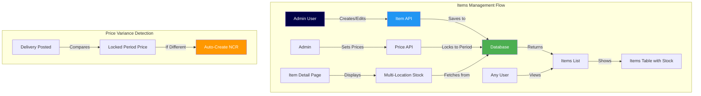
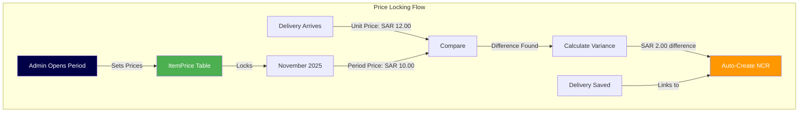
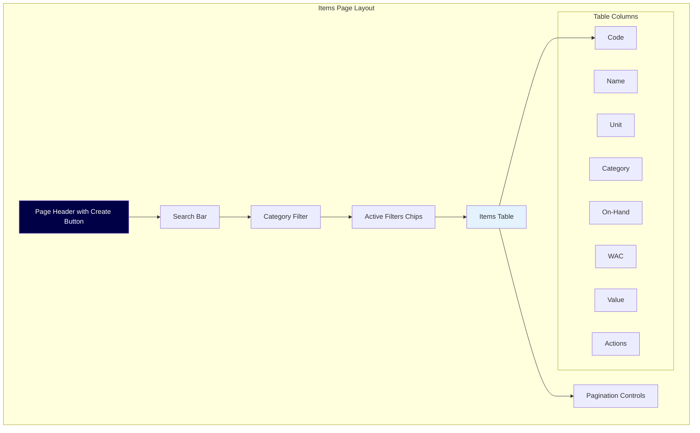
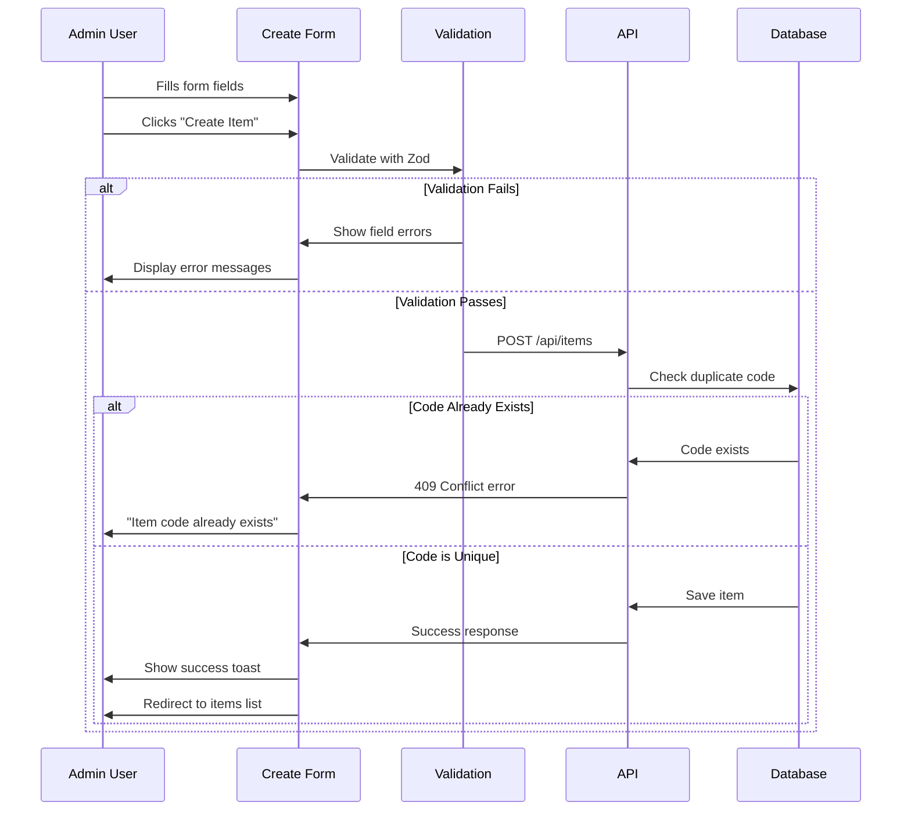
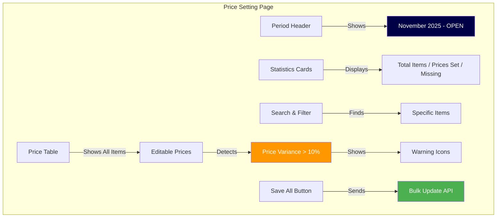
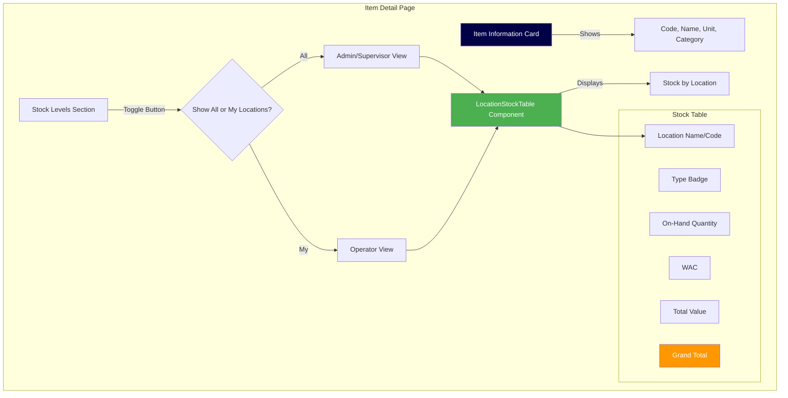
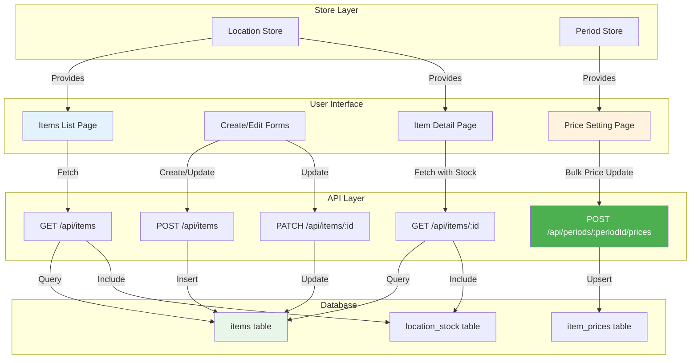

# Phase 1.6: Items Management

## Stock Management System - Development Guide

**For Junior Developers**
**Last Updated:** November 10, 2025
**Phase Status:** ✅ Complete

---

## 📖 Quick Navigation

- [Phase 1.1: Project Foundation](phase-1.1-foundation.md)
- [Phase 1.2: Database Setup](phase-1.2-database.md)
- [Phase 1.3: Authentication & Security](phase-1.3-authentication.md)
- [Phase 1.4: Base Layout & Navigation](phase-1.4-layout-navigation.md)
- [Phase 1.5: Location Management](phase-1.5-location-management.md)
- [Phase 1.6: Items Management](phase-1.6-items-management.md) ← You are here

---

## What We Did in This Phase

In this phase, we built the **Items Management System** - the core feature that allows administrators to manage inventory items, set prices, and track stock levels across multiple locations.

Think of items as **products in your inventory**. For example:

- **Fresh Milk** - Measured in liters (LTR)
- **Tomatoes** - Measured in kilograms (KG)
- **Chicken Breasts** - Measured in kilograms (KG)
- **Boxes of Tissues** - Measured in boxes (BOX)

This phase created the tools to:

- ✅ **Create new items** (add products to the catalog)
- ✅ **Edit item details** (update names, categories, units)
- ✅ **View all items** (see complete inventory list with stock)
- ✅ **Set period prices** (lock prices for accounting periods)
- ✅ **Track stock across locations** (see how much of each item at each location)

### Why Items Management Is Important

In a multi-location inventory system:

- **Each item** needs a unique code and clear description
- **Different items** are measured in different units (KG, LTR, EA, etc.)
- **Prices must be locked** per period to detect price variances
- **Stock levels** vary by location and need tracking
- **Categories** help organize thousands of items

---

## System Architecture Overview

Here's how the Items Management system works:



**How It Works:**

1. **Admin creates items** → Saved to database with unique codes
2. **Admin sets period prices** → Locked for accounting period
3. **Users view items** → See list with stock levels for their location
4. **Users view item details** → See stock across all locations they can access
5. **When deliveries arrive** → System compares actual price to locked period price
6. **If prices differ** → System automatically creates NCR (Non-Conformance Report)

---

## Tasks Completed

### 1.6.1: Item API Routes ✅

**Simple Explanation:**
We created the **backend endpoints** (API routes) that handle all item operations - creating, reading, updating, and deleting items from the database.

Think of these as the **communication channels** between the user interface and the database where item information is stored.

**What Was Done:**

1. **GET /api/items** - Get list of all items with filters
2. **POST /api/items** - Create a new item (admin only)
3. **GET /api/items/:id** - Get details of one item with stock
4. **PATCH /api/items/:id** - Update an item (admin only)
5. **DELETE /api/items/:id** - Soft delete an item (admin only)

**File Structure:**

```
server/api/items/
├── index.get.ts          ← Get all items
├── index.post.ts         ← Create item
├── [id].get.ts           ← Get one item
├── [id].patch.ts         ← Update item
└── [id].delete.ts        ← Soft delete item
```

#### How Each API Route Works

##### 1. GET /api/items (Get All Items)

This endpoint returns a paginated list of items with optional filters and stock data.

**Key Features:**

- **Pagination**: Shows 50 items per page by default (max 200)
- **Search**: Find items by name or code
- **Category filter**: Show only items from specific category
- **Location stock**: Include stock data for a specific location
- **Role-based access**: Operators see only their locations' stock

**Query Parameters:**

| Parameter    | Type    | Description                  | Example               |
| ------------ | ------- | ---------------------------- | --------------------- |
| `page`       | number  | Page number (default: 1)     | `?page=2`             |
| `limit`      | number  | Items per page (default: 50) | `?limit=100`          |
| `search`     | string  | Search by name or code       | `?search=milk`        |
| `category`   | string  | Filter by category           | `?category=Dairy`     |
| `is_active`  | boolean | Show only active items       | `?is_active=true`     |
| `locationId` | string  | Include stock for location   | `?locationId=abc-123` |

**Example Code:**

```typescript
// server/api/items/index.get.ts
export default defineEventHandler(async (event) => {
  // Get logged-in user
  const user = event.context.user;

  // Get query parameters
  const query = getQuery(event);
  const page = Number(query.page) || 1;
  const limit = Math.min(Number(query.limit) || 50, 200);
  const skip = (page - 1) * limit;

  // Build filter conditions
  const where: any = {};

  if (query.is_active !== undefined) {
    where.is_active = query.is_active === "true";
  }

  if (query.category) {
    where.category = query.category;
  }

  if (query.search) {
    where.OR = [
      { name: { contains: query.search, mode: "insensitive" } },
      { code: { contains: query.search, mode: "insensitive" } },
    ];
  }

  // Fetch items from database
  const items = await prisma.item.findMany({
    where,
    skip,
    take: limit,
    orderBy: { name: "asc" },
    include: {
      location_stock: query.locationId
        ? {
            where: { location_id: query.locationId },
            include: { location: true },
          }
        : false,
    },
  });

  // Count total items for pagination
  const total = await prisma.item.count({ where });

  // Calculate pagination metadata
  const totalPages = Math.ceil(total / limit);
  const hasNextPage = page < totalPages;
  const hasPrevPage = page > 1;

  return {
    items,
    pagination: {
      total,
      page,
      limit,
      totalPages,
      hasNextPage,
      hasPrevPage,
    },
  };
});
```

**What This Does:**

1. Gets the current user and query parameters
2. Builds search filters based on provided parameters
3. Fetches items with pagination and optional stock data
4. Counts total items for pagination metadata
5. Returns items array and pagination info

**Example Response:**

```json
{
  "items": [
    {
      "id": "item-123",
      "code": "MILK-001",
      "name": "Fresh Milk",
      "unit": "LTR",
      "category": "Dairy",
      "sub_category": "Milk Products",
      "is_active": true,
      "location_stock": [
        {
          "location_id": "loc-456",
          "item_id": "item-123",
          "on_hand": 100,
          "wac": 10.5,
          "location": {
            "id": "loc-456",
            "code": "MAIN-KIT",
            "name": "Main Kitchen"
          }
        }
      ]
    }
  ],
  "pagination": {
    "total": 150,
    "page": 1,
    "limit": 50,
    "totalPages": 3,
    "hasNextPage": true,
    "hasPrevPage": false
  }
}
```

##### 2. POST /api/items (Create New Item)

This endpoint creates a new inventory item. **Only admins** can do this.

**Required Fields:**

- `code` - Unique identifier (auto-uppercase)
- `name` - Item name
- `unit` - Unit of measure (KG, EA, LTR, BOX, CASE, PACK)

**Optional Fields:**

- `category` - Item category
- `sub_category` - Sub-category for detailed organization

**Example Code:**

```typescript
// server/api/items/index.post.ts
const createItemSchema = z.object({
  code: z.string().min(1).max(20),
  name: z.string().min(1).max(200),
  unit: z.enum(["KG", "EA", "LTR", "BOX", "CASE", "PACK"]),
  category: z.string().max(100).optional(),
  sub_category: z.string().max(100).optional(),
});

export default defineEventHandler(async (event) => {
  const user = event.context.user;

  // Check if user is admin
  if (user.role !== "ADMIN") {
    throw createError({
      statusCode: 403,
      message: "Only admins can create items",
    });
  }

  // Get and validate data
  const body = await readBody(event);
  const data = createItemSchema.parse(body);

  // Make code uppercase
  data.code = data.code.toUpperCase();

  // Check if code already exists
  const existing = await prisma.item.findUnique({
    where: { code: data.code },
  });

  if (existing) {
    throw createError({
      statusCode: 409,
      message: `Item with code ${data.code} already exists`,
    });
  }

  // Create item
  const item = await prisma.item.create({
    data: {
      code: data.code,
      name: data.name,
      unit: data.unit,
      category: data.category,
      sub_category: data.sub_category,
      is_active: true,
    },
  });

  return { item };
});
```

**Why Uppercase Code?**

- Makes codes **consistent** (MILK-001, not Milk-001 or milk-001)
- **Easier to search** (no case sensitivity issues)
- **Professional appearance** in reports

**Duplicate Check:**
The code must be unique. If someone tries to create an item with code "MILK-001" and it already exists, the API returns a **409 Conflict** error.

##### 3. GET /api/items/:id (Get Single Item)

This endpoint gets detailed information about one specific item including stock levels across locations.

**Stock Data Options:**

- **No locationId**: Returns item without stock data
- **With locationId**: Returns stock for that specific location
- **includeAllStock=true**: Returns stock for all locations (admin/supervisor only)

**Example Code:**

```typescript
// server/api/items/[id].get.ts
export default defineEventHandler(async (event) => {
  const user = event.context.user;
  const itemId = event.context.params.id;
  const query = getQuery(event);

  // Build stock include based on permissions
  let stockInclude: any = false;

  if (query.includeAllStock === "true") {
    // Only admins and supervisors can see all locations
    if (user.role === "ADMIN" || user.role === "SUPERVISOR") {
      stockInclude = {
        include: {
          location: {
            select: {
              id: true,
              code: true,
              name: true,
              type: true,
            },
          },
        },
      };
    }
  } else if (query.locationId) {
    // Include stock for specific location
    stockInclude = {
      where: { location_id: query.locationId },
      include: {
        location: {
          select: {
            id: true,
            code: true,
            name: true,
            type: true,
          },
        },
      },
    };
  }

  // Fetch item with stock
  const item = await prisma.item.findUnique({
    where: { id: itemId },
    include: {
      location_stock: stockInclude,
    },
  });

  if (!item) {
    throw createError({
      statusCode: 404,
      message: "Item not found",
    });
  }

  return { item };
});
```

**Access Control:**

- **Admins/Supervisors**: Can view stock at all locations
- **Operators**: Can only view stock at their assigned locations

##### 4. PATCH /api/items/:id (Update Item)

This endpoint updates an existing item. **Only admins** can do this.

**Important:** The `code` field **CANNOT** be changed after creation (like a serial number).

**Updatable Fields:**

- Name
- Unit
- Category
- Sub-category
- Active status

**Example Code:**

```typescript
// server/api/items/[id].patch.ts
const updateItemSchema = z
  .object({
    name: z.string().min(1).max(200).optional(),
    unit: z.enum(["KG", "EA", "LTR", "BOX", "CASE", "PACK"]).optional(),
    category: z.string().max(100).optional(),
    sub_category: z.string().max(100).optional(),
    is_active: z.boolean().optional(),
  })
  .refine((data) => Object.keys(data).length > 0, {
    message: "At least one field must be provided",
  });

export default defineEventHandler(async (event) => {
  const user = event.context.user;
  const itemId = event.context.params.id;

  // Check admin access
  if (user.role !== "ADMIN") {
    throw createError({
      statusCode: 403,
      message: "Only admins can update items",
    });
  }

  // Validate data
  const body = await readBody(event);
  const data = updateItemSchema.parse(body);

  // Update item
  const item = await prisma.item.update({
    where: { id: itemId },
    data: data,
  });

  return { item };
});
```

**Partial Updates:**
You can update just ONE field without sending all fields. For example:

```json
// Just change the name
{
  "name": "Extra Fresh Milk"
}

// Or just change category
{
  "category": "Dairy Products"
}
```

##### 5. DELETE /api/items/:id (Soft Delete)

This endpoint **soft deletes** an item by setting `is_active = false`. It doesn't actually delete the item from the database.

**Why Soft Delete?**

- **Keeps history**: Old transactions still show the item
- **Prevents errors**: Reports from past periods still work
- **Can reactivate**: If you deleted by mistake, you can turn it back on

**Example Code:**

```typescript
// server/api/items/[id].delete.ts
export default defineEventHandler(async (event) => {
  const user = event.context.user;
  const itemId = event.context.params.id;

  // Check admin access
  if (user.role !== "ADMIN") {
    throw createError({
      statusCode: 403,
      message: "Only admins can delete items",
    });
  }

  // Check if item has transaction history
  const item = await prisma.item.findUnique({
    where: { id: itemId },
    include: {
      _count: {
        select: {
          delivery_lines: true,
          issue_lines: true,
          transfer_lines: true,
        },
      },
    },
  });

  if (!item) {
    throw createError({
      statusCode: 404,
      message: "Item not found",
    });
  }

  // Soft delete
  const updatedItem = await prisma.item.update({
    where: { id: itemId },
    data: { is_active: false },
  });

  // Return info about transaction history
  const hasHistory =
    item._count.delivery_lines > 0 || item._count.issue_lines > 0 || item._count.transfer_lines > 0;

  return {
    item: updatedItem,
    message: hasHistory
      ? "Item deactivated. Historical transactions are preserved."
      : "Item deactivated successfully.",
  };
});
```

---

### 1.6.2: Item Price Management API ✅

**Simple Explanation:**
We created API routes to manage **period-based pricing** - the system that locks prices at the start of each accounting period.

This is **critical** for detecting price variances. When a delivery arrives with a different price than expected, the system automatically creates a Non-Conformance Report (NCR).

**Why Lock Prices Per Period?**

Imagine you set the price of milk at SAR 10.00 for November:

- ✅ **Expected**: All November deliveries should be SAR 10.00
- ❌ **Actual**: A delivery arrives with milk at SAR 12.00
- 🚨 **Result**: System automatically creates NCR for SAR 2.00 variance

Without price locking, you couldn't detect when suppliers charge different prices!

**API Endpoints Created:**

1. **GET /api/periods/:periodId/prices** - Get all item prices for a period
2. **POST /api/periods/:periodId/prices** - Bulk create/update prices
3. **PATCH /api/items/:itemId/price** - Update single item price



#### 1. GET /api/periods/:periodId/prices

This endpoint fetches all item prices for a specific period.

**Query Parameters:**

| Parameter  | Description              | Example           |
| ---------- | ------------------------ | ----------------- |
| `search`   | Search by item name/code | `?search=milk`    |
| `category` | Filter by category       | `?category=Dairy` |

**Example Code:**

```typescript
// server/api/periods/[periodId]/prices.get.ts
export default defineEventHandler(async (event) => {
  const periodId = event.context.params.periodId;
  const query = getQuery(event);

  // Build filter for items
  const itemWhere: any = { is_active: true };

  if (query.search) {
    itemWhere.OR = [
      { name: { contains: query.search, mode: "insensitive" } },
      { code: { contains: query.search, mode: "insensitive" } },
    ];
  }

  if (query.category) {
    itemWhere.category = query.category;
  }

  // Fetch all active items
  const items = await prisma.item.findMany({
    where: itemWhere,
    orderBy: { name: "asc" },
    include: {
      item_prices: {
        where: { period_id: periodId },
      },
    },
  });

  // Transform to include has_price flag
  const prices = items.map((item) => ({
    item_id: item.id,
    code: item.code,
    name: item.name,
    unit: item.unit,
    category: item.category,
    price: item.item_prices[0]?.price || null,
    has_price: item.item_prices.length > 0,
    set_at: item.item_prices[0]?.set_at || null,
    set_by: item.item_prices[0]?.set_by || null,
  }));

  return { prices };
});
```

**Response Example:**

```json
{
  "prices": [
    {
      "item_id": "item-123",
      "code": "MILK-001",
      "name": "Fresh Milk",
      "unit": "LTR",
      "category": "Dairy",
      "price": 10.0,
      "has_price": true,
      "set_at": "2025-11-01T10:00:00Z",
      "set_by": "user-admin"
    },
    {
      "item_id": "item-456",
      "code": "TOM-001",
      "name": "Tomatoes",
      "unit": "KG",
      "category": "Vegetables",
      "price": null,
      "has_price": false,
      "set_at": null,
      "set_by": null
    }
  ]
}
```

#### 2. POST /api/periods/:periodId/prices

This endpoint creates or updates prices for multiple items at once (bulk operation).

**Business Rules:**

- **Admin only**: Only admins can set prices
- **Period must be open**: Cannot change prices in closed periods
- **Upsert operation**: If price exists, update it; if not, create it

**Example Code:**

```typescript
// server/api/periods/[periodId]/prices.post.ts
const priceSchema = z.object({
  item_id: z.string().uuid(),
  price: z.number().positive(),
});

const bulkPricesSchema = z.object({
  prices: z.array(priceSchema),
});

export default defineEventHandler(async (event) => {
  const user = event.context.user;
  const periodId = event.context.params.periodId;

  // Check admin access
  if (user.role !== "ADMIN") {
    throw createError({
      statusCode: 403,
      message: "Only admins can set prices",
    });
  }

  // Check period status
  const period = await prisma.period.findUnique({
    where: { id: periodId },
  });

  if (!period) {
    throw createError({
      statusCode: 404,
      message: "Period not found",
    });
  }

  if (period.status === "CLOSED") {
    throw createError({
      statusCode: 400,
      message: "Cannot update prices in closed period",
    });
  }

  // Validate data
  const body = await readBody(event);
  const { prices } = bulkPricesSchema.parse(body);

  // Use transaction for atomic operation
  const results = await prisma.$transaction(
    prices.map(({ item_id, price }) =>
      prisma.itemPrice.upsert({
        where: {
          item_id_period_id: {
            item_id,
            period_id: periodId,
          },
        },
        create: {
          item_id,
          period_id: periodId,
          price,
          currency: "SAR",
          set_by: user.id,
        },
        update: {
          price,
          set_by: user.id,
          set_at: new Date(),
        },
      })
    )
  );

  return {
    updated: results.length,
    prices: results,
  };
});
```

**What is Upsert?**

- **UP**date if exists
- In**SERT** if doesn't exist

It's like a smart "create or update" operation.

**Request Example:**

```json
{
  "prices": [
    {
      "item_id": "item-123",
      "price": 10.5
    },
    {
      "item_id": "item-456",
      "price": 5.25
    }
  ]
}
```

#### 3. PATCH /api/items/:itemId/price

This endpoint updates the price for a single item in the current open period.

**Example Code:**

```typescript
// server/api/items/[itemId]/price.patch.ts
const updatePriceSchema = z.object({
  price: z.number().positive(),
  period_id: z.string().uuid().optional(),
});

export default defineEventHandler(async (event) => {
  const user = event.context.user;
  const itemId = event.context.params.itemId;

  // Check admin access
  if (user.role !== "ADMIN") {
    throw createError({
      statusCode: 403,
      message: "Only admins can update prices",
    });
  }

  // Validate data
  const body = await readBody(event);
  const data = updatePriceSchema.parse(body);

  // Get period (use provided or find current open period)
  let periodId = data.period_id;

  if (!periodId) {
    const currentPeriod = await prisma.period.findFirst({
      where: { status: "OPEN" },
      orderBy: { start_date: "desc" },
    });

    if (!currentPeriod) {
      throw createError({
        statusCode: 400,
        message: "No open period found",
      });
    }

    periodId = currentPeriod.id;
  }

  // Check if item exists and is active
  const item = await prisma.item.findUnique({
    where: { id: itemId },
  });

  if (!item || !item.is_active) {
    throw createError({
      statusCode: 404,
      message: "Item not found or inactive",
    });
  }

  // Upsert price
  const price = await prisma.itemPrice.upsert({
    where: {
      item_id_period_id: {
        item_id: itemId,
        period_id: periodId,
      },
    },
    create: {
      item_id: itemId,
      period_id: periodId,
      price: data.price,
      currency: "SAR",
      set_by: user.id,
    },
    update: {
      price: data.price,
      set_by: user.id,
      set_at: new Date(),
    },
    include: {
      item: true,
      period: true,
    },
  });

  return { price };
});
```

**Automatic Period Selection:**
If you don't provide a `period_id`, the API automatically uses the current open period.

---

### 1.6.3: Items Page UI ✅

**Simple Explanation:**
We created the **main items page** where users can see all inventory items in a table with search, filters, and pagination.

Think of this as the **inventory catalog** where you can:

- **Browse** all items
- **Search** for specific items
- **Filter** by category
- **See stock levels** for your active location
- **Click** to view details or edit

**Page Features:**



#### Items Table Implementation

**File:** `app/pages/items/index.vue`

**Table Columns:**

| Column       | Description                   | Example      |
| ------------ | ----------------------------- | ------------ |
| **Code**     | Unique item code              | MILK-001     |
| **Name**     | Item name with inactive badge | Fresh Milk   |
| **Unit**     | Unit of measure               | LTR          |
| **Category** | Item category                 | Dairy        |
| **On-Hand**  | Current stock quantity        | 100.0000     |
| **WAC**      | Weighted Average Cost         | SAR 10.50    |
| **Value**    | On-Hand × WAC                 | SAR 1,050.00 |
| **Actions**  | Edit button (admin only)      | ✏️ Edit      |

**Key Code Sections:**

```vue
<template>
  <div class="min-h-screen bg-[var(--ui-bg)] p-4 md:p-6">
    <!-- Page Header -->
    <div class="mb-6">
      <div class="flex items-center justify-between">
        <div>
          <h1 class="text-2xl font-bold text-[var(--ui-text)]">Items</h1>
          <p class="text-sm text-[var(--ui-text-muted)]">
            Manage inventory items and view stock levels
          </p>
        </div>

        <!-- Create Button (Admin Only) -->
        <div v-if="canEditItems()">
          <UButton
            color="primary"
            size="lg"
            icon="i-heroicons-plus"
            @click="navigateTo('/items/create')"
          >
            Create Item
          </UButton>
        </div>
      </div>
    </div>

    <!-- Filters Card -->
    <UCard class="mb-6">
      <div class="grid grid-cols-1 md:grid-cols-3 gap-4">
        <!-- Search Input -->
        <div class="md:col-span-2">
          <UInput
            v-model="searchQuery"
            icon="i-heroicons-magnifying-glass"
            placeholder="Search by item name or code..."
            @update:model-value="handleSearch"
          />
        </div>

        <!-- Category Filter -->
        <div>
          <USelectMenu
            v-model="selectedCategory"
            :options="categoryOptions"
            placeholder="All Categories"
            @update:model-value="handleCategoryChange"
          />
        </div>
      </div>

      <!-- Active Filter Chips -->
      <div v-if="searchQuery || selectedCategory" class="mt-4 flex gap-2">
        <UBadge v-if="searchQuery" color="primary" variant="subtle">
          Search: {{ searchQuery }}
          <button @click="clearSearch">
            <UIcon name="i-heroicons-x-mark" />
          </button>
        </UBadge>

        <UBadge v-if="selectedCategory" color="primary" variant="subtle">
          Category: {{ selectedCategory }}
          <button @click="clearCategory">
            <UIcon name="i-heroicons-x-mark" />
          </button>
        </UBadge>
      </div>
    </UCard>

    <!-- Items Table -->
    <UCard>
      <table class="min-w-full">
        <thead>
          <tr class="bg-[var(--ui-bg-elevated)]">
            <th class="px-4 py-3 text-left">Code</th>
            <th class="px-4 py-3 text-left">Name</th>
            <th class="px-4 py-3 text-left">Unit</th>
            <th class="px-4 py-3 text-left">Category</th>
            <th class="px-4 py-3 text-right">On-Hand</th>
            <th class="px-4 py-3 text-right">WAC</th>
            <th class="px-4 py-3 text-right">Value</th>
            <th v-if="canEditItems()" class="px-4 py-3 text-right">Actions</th>
          </tr>
        </thead>
        <tbody>
          <tr
            v-for="item in items"
            :key="item.id"
            class="hover:bg-[var(--ui-bg-elevated)] cursor-pointer"
            @click="navigateTo(`/items/${item.id}`)"
          >
            <td class="px-4 py-4">{{ item.code }}</td>
            <td class="px-4 py-4">
              {{ item.name }}
              <UBadge v-if="!item.is_active" color="neutral">Inactive</UBadge>
            </td>
            <td class="px-4 py-4">{{ item.unit }}</td>
            <td class="px-4 py-4">{{ item.category || "-" }}</td>
            <td class="px-4 py-4 text-right">
              {{ formatQuantity(getStockData(item).onHand) }}
            </td>
            <td class="px-4 py-4 text-right">
              {{ formatCurrency(getStockData(item).wac) }}
            </td>
            <td class="px-4 py-4 text-right">
              {{ formatCurrency(getStockData(item).value) }}
            </td>
            <td v-if="canEditItems()" class="px-4 py-4 text-right">
              <UButton
                size="xs"
                icon="i-heroicons-pencil-square"
                @click.stop="navigateTo(`/items/${item.id}/edit`)"
              >
                Edit
              </UButton>
            </td>
          </tr>
        </tbody>
      </table>

      <!-- Pagination -->
      <div v-if="pagination.totalPages > 1" class="mt-6 pt-4 border-t">
        <!-- Pagination controls here -->
      </div>
    </UCard>
  </div>
</template>
```

#### Search with Debouncing

**What is Debouncing?**

When you type in the search box, we don't search after every single letter. Instead, we **wait** until you stop typing for 500ms (half a second).

**Without Debouncing:**

```
User types: M → Search
User types: I → Search
User types: L → Search
User types: K → Search
Result: 4 API calls! 🚫
```

**With Debouncing:**

```
User types: M (wait)
User types: I (wait)
User types: L (wait)
User types: K (wait)
...500ms pass...
Search for "MILK"
Result: 1 API call! ✅
```

**Implementation:**

```typescript
// Composable from VueUse library
import { useDebounceFn } from "@vueuse/core";

// Debounced search handler
const handleSearch = useDebounceFn(() => {
  pagination.value.page = 1; // Reset to first page
  fetchItems();
}, 500); // Wait 500ms
```

#### Formatting Functions

**Quantity Formatting** (up to 4 decimals):

```typescript
function formatQuantity(value: number): string {
  // Show up to 4 decimal places, remove trailing zeros
  return value.toFixed(4).replace(/\.?0+$/, "");
}

// Examples:
// 100.0000 → "100"
// 10.5000 → "10.5"
// 5.2500 → "5.25"
// 3.1234 → "3.1234"
```

**Currency Formatting** (SAR):

```typescript
function formatCurrency(value: number): string {
  return new Intl.NumberFormat("en-SA", {
    style: "currency",
    currency: "SAR",
    minimumFractionDigits: 2,
    maximumFractionDigits: 2,
  }).format(value);
}

// Example: 1050.50 → "SAR 1,050.50"
```

#### Stock Data Calculation

```typescript
function getStockData(item: ItemWithStock) {
  // If no stock data, return zeros
  if (!item.location_stock || item.location_stock.length === 0) {
    return {
      onHand: 0,
      wac: 0,
      value: 0,
    };
  }

  // Get first location stock (current location)
  const stock = item.location_stock[0];
  const onHand = Number(stock.on_hand || 0);
  const wac = Number(stock.wac || 0);
  const value = onHand * wac;

  return { onHand, wac, value };
}
```

---

### 1.6.4: Create Item UI ✅

**Simple Explanation:**
We created a **form page** where administrators can add new items to the inventory catalog.

Think of this as filling out a **product registration form** with all the necessary details about a new item.

**Form Fields:**

1. **Code** (Required) - Unique identifier
   - Example: MILK-001
   - Auto-converted to uppercase

2. **Name** (Required) - Item description
   - Example: Fresh Milk

3. **Unit** (Required) - How it's measured
   - Dropdown: KG, EA, LTR, BOX, CASE, PACK

4. **Category** (Optional) - Item group
   - Example: Dairy

5. **Sub-Category** (Optional) - Detailed classification
   - Example: Milk Products

**Form Flow:**



**Implementation:**

```vue
<template>
  <div class="min-h-screen bg-[var(--ui-bg)] p-6">
    <div class="max-w-2xl mx-auto">
      <!-- Page Header -->
      <div class="mb-6">
        <h1 class="text-2xl font-bold text-[var(--ui-text)]">Create New Item</h1>
        <p class="text-sm text-[var(--ui-text-muted)]">Add a new item to the inventory catalog</p>
      </div>

      <!-- Form Card -->
      <UCard>
        <UForm :schema="schema" :state="formData" @submit="onSubmit">
          <!-- Item Code -->
          <UFormGroup label="Item Code" required>
            <UInput v-model="formData.code" placeholder="e.g., MILK-001" :disabled="loading" />
          </UFormGroup>

          <!-- Item Name -->
          <UFormGroup label="Item Name" required>
            <UInput v-model="formData.name" placeholder="e.g., Fresh Milk" :disabled="loading" />
          </UFormGroup>

          <!-- Unit of Measure -->
          <UFormGroup label="Unit of Measure" required>
            <USelectMenu
              v-model="formData.unit"
              :options="unitOptions"
              placeholder="Select unit"
              :disabled="loading"
            />
          </UFormGroup>

          <!-- Category -->
          <UFormGroup label="Category">
            <UInput v-model="formData.category" placeholder="e.g., Dairy" :disabled="loading" />
          </UFormGroup>

          <!-- Sub-Category -->
          <UFormGroup label="Sub-Category">
            <UInput
              v-model="formData.sub_category"
              placeholder="e.g., Milk Products"
              :disabled="loading"
            />
          </UFormGroup>

          <!-- Error Alert -->
          <UAlert
            v-if="error"
            color="error"
            icon="i-heroicons-exclamation-circle"
            :title="error"
            :closable="true"
            @close="error = null"
          />

          <!-- Action Buttons -->
          <div class="flex gap-3">
            <UButton
              type="button"
              color="neutral"
              variant="soft"
              @click="handleCancel"
              :disabled="loading"
            >
              Cancel
            </UButton>
            <UButton type="submit" color="primary" :loading="loading">Create Item</UButton>
          </div>
        </UForm>
      </UCard>
    </div>
  </div>
</template>

<script setup lang="ts">
import { z } from "zod";

// Page metadata
definePageMeta({
  middleware: ["auth", "role"],
  roleRequired: "ADMIN",
});

// Validation schema
const schema = z.object({
  code: z.string().min(1, "Item code is required").max(20, "Code must be 20 characters or less"),
  name: z.string().min(1, "Item name is required").max(200, "Name must be 200 characters or less"),
  unit: z.enum(["KG", "EA", "LTR", "BOX", "CASE", "PACK"], {
    required_error: "Please select a unit",
  }),
  category: z.string().max(100).optional(),
  sub_category: z.string().max(100).optional(),
});

// Form data
const formData = reactive({
  code: "",
  name: "",
  unit: null,
  category: "",
  sub_category: "",
});

// Unit options for dropdown
const unitOptions = [
  { label: "Kilograms (KG)", value: "KG" },
  { label: "Each (EA)", value: "EA" },
  { label: "Liters (LTR)", value: "LTR" },
  { label: "Box (BOX)", value: "BOX" },
  { label: "Case (CASE)", value: "CASE" },
  { label: "Pack (PACK)", value: "PACK" },
];

// State
const loading = ref(false);
const error = ref<string | null>(null);
const toast = useAppToast();

// Submit handler
const onSubmit = async () => {
  loading.value = true;
  error.value = null;

  try {
    // Make code uppercase
    const payload = {
      ...formData,
      code: formData.code.toUpperCase(),
    };

    // Call API
    await $fetch("/api/items", {
      method: "POST",
      body: payload,
    });

    // Show success message
    toast.success("Success", "Item created successfully");

    // Redirect to items list
    navigateTo("/items");
  } catch (err: any) {
    // Handle errors
    if (err.statusCode === 409) {
      error.value = "An item with this code already exists";
    } else {
      error.value = err.data?.message || "Failed to create item";
    }
  } finally {
    loading.value = false;
  }
};

// Cancel handler
const handleCancel = () => {
  // Check if form has data
  const hasData = formData.code || formData.name || formData.category;

  if (hasData) {
    // Confirm before leaving
    if (confirm("Are you sure? Unsaved changes will be lost.")) {
      navigateTo("/items");
    }
  } else {
    navigateTo("/items");
  }
};
</script>
```

**Key Features:**

1. **Real-time Validation**: Shows errors as you type
2. **Dropdown Units**: Easy selection with descriptions
3. **Uppercase Code**: Automatically converts code to uppercase
4. **Duplicate Detection**: Shows clear error if code exists
5. **Unsaved Changes Warning**: Asks before canceling with data
6. **Loading States**: Disables form while submitting

---

### 1.6.5: Edit Item UI ✅

**Simple Explanation:**
We created a **form page** where administrators can update existing item details.

This is similar to the create form, but with these differences:

- **Pre-filled data**: Shows current item values
- **Read-only code**: Cannot change the item code
- **Deactivate option**: Can soft-delete the item

**Key Differences from Create:**

| Feature          | Create Form    | Edit Form                   |
| ---------------- | -------------- | --------------------------- |
| Item Code        | Editable input | Read-only display           |
| Submit Button    | "Create Item"  | "Update Item"               |
| Extra Actions    | Cancel only    | Deactivate button           |
| Pre-filled Data  | Empty fields   | Loaded from database        |
| Change Detection | N/A            | Disables save if no changes |

**Implementation:**

```vue
<template>
  <div class="min-h-screen bg-[var(--ui-bg)] p-6">
    <!-- Loading State -->
    <div v-if="loading" class="flex justify-center py-12">
      <UIcon name="i-heroicons-arrow-path" class="w-8 h-8 animate-spin" />
    </div>

    <!-- Form -->
    <div v-else-if="item" class="max-w-2xl mx-auto">
      <div class="mb-6">
        <h1 class="text-2xl font-bold">Edit Item</h1>
        <p class="text-sm text-[var(--ui-text-muted)]">Update item details</p>
      </div>

      <UCard>
        <UForm :schema="schema" :state="formData" @submit="onSubmit">
          <!-- Item Code (Read-Only) -->
          <UFormGroup label="Item Code">
            <UInput :model-value="item.code" disabled class="opacity-60" />
            <template #help>
              <p class="text-xs text-[var(--ui-text-muted)]">
                Item code cannot be changed after creation
              </p>
            </template>
          </UFormGroup>

          <!-- Editable Fields -->
          <UFormGroup label="Item Name" required>
            <UInput v-model="formData.name" />
          </UFormGroup>

          <UFormGroup label="Unit" required>
            <USelectMenu v-model="formData.unit" :options="unitOptions" />
          </UFormGroup>

          <UFormGroup label="Category">
            <UInput v-model="formData.category" />
          </UFormGroup>

          <UFormGroup label="Sub-Category">
            <UInput v-model="formData.sub_category" />
          </UFormGroup>

          <!-- Active Status Toggle -->
          <UFormGroup label="Status">
            <UToggle v-model="formData.is_active" on-label="Active" off-label="Inactive" />
          </UFormGroup>

          <!-- Action Buttons -->
          <div class="flex justify-between">
            <UButton color="error" variant="soft" @click="handleDeactivate">
              Deactivate Item
            </UButton>

            <div class="flex gap-3">
              <UButton color="neutral" variant="soft" @click="navigateTo('/items')">Cancel</UButton>
              <UButton type="submit" color="primary" :disabled="!hasChanges" :loading="updating">
                Update Item
              </UButton>
            </div>
          </div>
        </UForm>
      </UCard>
    </div>
  </div>
</template>

<script setup lang="ts">
const route = useRoute();
const toast = useAppToast();

// Load item data
const item = ref(null);
const loading = ref(true);

onMounted(async () => {
  try {
    const itemId = route.params.id;
    const response = await $fetch(`/api/items/${itemId}`);
    item.value = response.item;

    // Pre-fill form
    formData.name = item.value.name;
    formData.unit = item.value.unit;
    formData.category = item.value.category || "";
    formData.sub_category = item.value.sub_category || "";
    formData.is_active = item.value.is_active;
  } catch (err) {
    toast.error("Error", "Failed to load item");
  } finally {
    loading.value = false;
  }
});

// Form data
const formData = reactive({
  name: "",
  unit: null,
  category: "",
  sub_category: "",
  is_active: true,
});

// Change detection
const hasChanges = computed(() => {
  if (!item.value) return false;

  return (
    formData.name !== item.value.name ||
    formData.unit !== item.value.unit ||
    formData.category !== (item.value.category || "") ||
    formData.sub_category !== (item.value.sub_category || "") ||
    formData.is_active !== item.value.is_active
  );
});

// Update handler
const updating = ref(false);

const onSubmit = async () => {
  updating.value = true;

  try {
    const itemId = route.params.id;

    await $fetch(`/api/items/${itemId}`, {
      method: "PATCH",
      body: formData,
    });

    toast.success("Success", "Item updated successfully");
    navigateTo("/items");
  } catch (err: any) {
    toast.error("Error", err.data?.message || "Failed to update item");
  } finally {
    updating.value = false;
  }
};

// Deactivate handler
const handleDeactivate = async () => {
  const confirmed = confirm(
    "Are you sure you want to deactivate this item? " +
      "It will be hidden from the active items list, but historical " +
      "transactions will be preserved."
  );

  if (!confirmed) return;

  try {
    const itemId = route.params.id;

    await $fetch(`/api/items/${itemId}`, {
      method: "DELETE",
    });

    toast.success("Success", "Item deactivated successfully");
    navigateTo("/items");
  } catch (err: any) {
    toast.error("Error", err.data?.message || "Failed to deactivate item");
  }
};
</script>
```

**Change Detection:**

The "Update Item" button is **disabled** if you haven't changed anything. This prevents unnecessary API calls.

```typescript
const hasChanges = computed(() => {
  return (
    formData.name !== item.value.name ||
    formData.unit !== item.value.unit ||
    // ... other fields
  )
})
```

---

### 1.6.6: Item Price Setting UI ✅

**Simple Explanation:**
We created a **price management page** where admins can set and update prices for all items in a specific accounting period.

This is **critically important** because:

- Prices are **locked per period**
- When deliveries arrive, the system **compares** actual price to locked period price
- **Price differences** automatically create NCRs (Non-Conformance Reports)

**Page Features:**



**Table Columns:**

| Column           | Description           | Example             |
| ---------------- | --------------------- | ------------------- |
| **Item Code**    | Unique identifier     | MILK-001            |
| **Item Name**    | Product name          | Fresh Milk          |
| **Unit**         | Measurement unit      | LTR                 |
| **Category**     | Item group            | Dairy               |
| **Current WAC**  | Weighted Average Cost | SAR 9.50            |
| **Period Price** | Editable price input  | SAR 10.00           |
| **Status**       | Visual indicators     | ✓ Set / ⚠️ Variance |

**Price Variance Warning:**

When you edit a price that differs >10% from the current WAC, you see a **warning**:

```
⚠️ Price differs significantly from current WAC (SAR 9.50)
```

This helps prevent accidentally entering wrong prices (like SAR 100 instead of SAR 10).

**Implementation Highlights:**

```vue
<template>
  <div class="min-h-screen bg-[var(--ui-bg)] p-6">
    <!-- Period Header -->
    <div class="mb-6">
      <h1 class="text-2xl font-bold">Set Item Prices</h1>
      <div class="flex items-center gap-2 mt-2">
        <UBadge color="primary">
          {{ period.name }}
        </UBadge>
        <span class="text-sm text-[var(--ui-text-muted)]">
          {{ formatDateRange(period.start_date, period.end_date) }}
        </span>
        <UBadge :color="period.status === 'OPEN' ? 'success' : 'warning'">
          {{ period.status }}
        </UBadge>
      </div>
    </div>

    <!-- Statistics Cards -->
    <div class="grid grid-cols-3 gap-4 mb-6">
      <UCard>
        <div class="text-center">
          <p class="text-2xl font-bold">{{ statistics.totalItems }}</p>
          <p class="text-sm text-[var(--ui-text-muted)]">Total Items</p>
        </div>
      </UCard>
      <UCard>
        <div class="text-center">
          <p class="text-2xl font-bold text-success">
            {{ statistics.pricesSet }}
          </p>
          <p class="text-sm text-[var(--ui-text-muted)]">Prices Set</p>
        </div>
      </UCard>
      <UCard>
        <div class="text-center">
          <p class="text-2xl font-bold text-warning">
            {{ statistics.pricesMissing }}
          </p>
          <p class="text-sm text-[var(--ui-text-muted)]">Prices Missing</p>
        </div>
      </UCard>
    </div>

    <!-- Price Table -->
    <UCard>
      <table class="min-w-full">
        <thead>
          <tr>
            <th>Item Code</th>
            <th>Item Name</th>
            <th>Unit</th>
            <th>Category</th>
            <th class="text-right">Current WAC</th>
            <th class="text-right">Period Price</th>
            <th class="text-center">Status</th>
          </tr>
        </thead>
        <tbody>
          <tr v-for="item in items" :key="item.item_id">
            <td>{{ item.code }}</td>
            <td>{{ item.name }}</td>
            <td>{{ item.unit }}</td>
            <td>{{ item.category || "-" }}</td>
            <td class="text-right">
              {{ formatCurrency(item.current_wac) }}
            </td>
            <td class="text-right">
              <div class="flex items-center gap-2">
                <UInput
                  v-model="item.edited_price"
                  type="number"
                  step="0.01"
                  placeholder="Enter price"
                  @input="handlePriceChange(item)"
                />
                <!-- Variance Warning Icon -->
                <UIcon
                  v-if="hasSignificantVariance(item)"
                  name="i-heroicons-exclamation-triangle"
                  class="w-5 h-5 text-warning"
                  v-tooltip="'Price differs significantly from current WAC'"
                />
              </div>
            </td>
            <td class="text-center">
              <UIcon
                v-if="item.has_price && !item.is_modified"
                name="i-heroicons-check-circle"
                class="w-5 h-5 text-success"
              />
              <UBadge v-else-if="item.is_modified" color="primary">Modified</UBadge>
              <UIcon
                v-else
                name="i-heroicons-circle-dashed"
                class="w-5 h-5 text-[var(--ui-text-muted)]"
              />
            </td>
          </tr>
        </tbody>
      </table>

      <!-- Footer with Save Button -->
      <div class="mt-6 flex justify-between items-center border-t pt-4">
        <p class="text-sm text-[var(--ui-text-muted)]">{{ modifiedCount }} price(s) modified</p>
        <UButton
          color="primary"
          size="lg"
          :disabled="modifiedCount === 0"
          :loading="saving"
          @click="handleSaveAll"
        >
          Save All Changes
        </UButton>
      </div>
    </UCard>
  </div>
</template>

<script setup lang="ts">
// Price change handler
const handlePriceChange = (item: any) => {
  const edited = Number(item.edited_price);
  const original = Number(item.price);

  // Mark as modified if different from original
  item.is_modified = edited !== original && edited > 0;
};

// Check for significant variance (>10% difference)
const hasSignificantVariance = (item: any) => {
  if (!item.edited_price || !item.current_wac) return false;

  const edited = Number(item.edited_price);
  const wac = Number(item.current_wac);

  const percentDiff = Math.abs((edited - wac) / wac) * 100;

  return percentDiff > 10;
};

// Count modified items
const modifiedCount = computed(() => {
  return items.value.filter((item) => item.is_modified).length;
});

// Save all changes
const saving = ref(false);

const handleSaveAll = async () => {
  saving.value = true;

  try {
    // Get only modified prices
    const modifiedPrices = items.value
      .filter((item) => item.is_modified)
      .map((item) => ({
        item_id: item.item_id,
        price: Number(item.edited_price),
      }));

    // Send to API
    await $fetch(`/api/periods/${periodId}/prices`, {
      method: "POST",
      body: { prices: modifiedPrices },
    });

    toast.success("Success", `Updated ${modifiedPrices.length} price(s)`);

    // Refresh data
    await fetchPrices();
  } catch (err: any) {
    toast.error("Error", err.data?.message || "Failed to update prices");
  } finally {
    saving.value = false;
  }
};
</script>
```

**Key Features:**

1. **Real-time Change Tracking**: Shows "Modified" badge for edited prices
2. **Variance Detection**: Warns if price differs >10% from current WAC
3. **Bulk Save**: Sends only modified prices to API
4. **Statistics**: Shows total items, prices set, and prices missing
5. **Period Info**: Displays period name, dates, and status

---

### 1.6.7: Location Stock Display ✅

**Simple Explanation:**
We created a **component and page** to display stock levels across multiple locations for a single item.

Think of this as a **stock visibility dashboard** showing:

- **Where** the item is stored (which locations)
- **How much** is at each location
- **What value** the stock represents

**Component Architecture:**



#### LocationStockTable Component

**File:** `app/components/item/LocationStockTable.vue`

This is a **reusable component** that displays stock data in a table format.

**Props:**

- `locationStock`: Array of stock data per location
- `showTotals`: Boolean to show/hide grand total (default: true)

**Features:**

1. **Location details**: Name, code, and type badge
2. **Stock quantities**: On-hand with 4-decimal precision
3. **Cost data**: WAC (Weighted Average Cost)
4. **Value calculation**: On-Hand × WAC per location
5. **Grand total**: Sum of all location values
6. **Empty state**: Friendly message when no stock

**Implementation:**

```vue
<template>
  <div class="space-y-4">
    <!-- Header -->
    <div class="flex items-center justify-between">
      <h3 class="text-lg font-semibold">Stock Levels by Location</h3>
      <UBadge v-if="totalLocations > 0" color="primary" variant="subtle">
        {{ totalLocations }} {{ totalLocations === 1 ? "Location" : "Locations" }}
      </UBadge>
    </div>

    <!-- Table -->
    <div v-if="locationStock && locationStock.length > 0">
      <table class="min-w-full divide-y divide-[var(--ui-border)]">
        <thead class="bg-[var(--ui-bg-elevated)]">
          <tr>
            <th class="px-4 py-3 text-left">Location</th>
            <th class="px-4 py-3 text-left">Type</th>
            <th class="px-4 py-3 text-right">On-Hand</th>
            <th class="px-4 py-3 text-right">WAC</th>
            <th class="px-4 py-3 text-right">Total Value</th>
          </tr>
        </thead>
        <tbody class="divide-y divide-[var(--ui-border)]">
          <tr
            v-for="stock in locationStock"
            :key="stock.location_id"
            class="hover:bg-[var(--ui-bg-elevated)]"
          >
            <!-- Location Name/Code -->
            <td class="px-4 py-3">
              <div class="flex flex-col">
                <span class="text-sm font-medium">
                  {{ stock.location.name }}
                </span>
                <span class="text-xs text-[var(--ui-text-muted)]">
                  {{ stock.location.code }}
                </span>
              </div>
            </td>

            <!-- Type Badge -->
            <td class="px-4 py-3">
              <UBadge :color="getLocationTypeColor(stock.location.type)" variant="subtle" size="xs">
                {{ stock.location.type }}
              </UBadge>
            </td>

            <!-- On-Hand Quantity -->
            <td class="px-4 py-3 text-right">
              {{ formatQuantity(stock.on_hand) }}
            </td>

            <!-- WAC -->
            <td class="px-4 py-3 text-right">
              {{ formatCurrency(stock.wac) }}
            </td>

            <!-- Total Value -->
            <td class="px-4 py-3 text-right font-medium">
              {{ formatCurrency(calculateTotalValue(stock.on_hand, stock.wac)) }}
            </td>
          </tr>
        </tbody>

        <!-- Grand Total Footer -->
        <tfoot v-if="showTotals" class="bg-[var(--ui-bg-elevated)] border-t-2">
          <tr>
            <td colspan="4" class="px-4 py-3 text-right font-semibold">Grand Total:</td>
            <td class="px-4 py-3 text-right font-bold">
              {{ formatCurrency(grandTotal) }}
            </td>
          </tr>
        </tfoot>
      </table>
    </div>

    <!-- Empty State -->
    <div v-else class="text-center py-12 bg-[var(--ui-bg-elevated)] rounded-lg">
      <UIcon name="i-heroicons-inbox" class="w-12 h-12 mx-auto mb-3 opacity-50" />
      <p class="text-sm font-medium">No stock data available</p>
      <p class="text-xs mt-1">This item has no stock in any location.</p>
    </div>
  </div>
</template>

<script setup lang="ts">
interface Props {
  locationStock?: LocationStock[];
  showTotals?: boolean;
}

const props = withDefaults(defineProps<Props>(), {
  locationStock: () => [],
  showTotals: true,
});

// Total locations count
const totalLocations = computed(() => props.locationStock?.length || 0);

// Grand total calculation
const grandTotal = computed(() => {
  if (!props.locationStock || props.locationStock.length === 0) return 0;

  return props.locationStock.reduce((total, stock) => {
    return total + calculateTotalValue(stock.on_hand, stock.wac);
  }, 0);
});

// Helper: Calculate total value
function calculateTotalValue(onHand: number | string, wac: number | string): number {
  const quantity = typeof onHand === "string" ? parseFloat(onHand) : onHand;
  const cost = typeof wac === "string" ? parseFloat(wac) : wac;
  return quantity * cost;
}

// Helper: Format quantity (up to 4 decimals)
function formatQuantity(value: number | string): string {
  const num = typeof value === "string" ? parseFloat(value) : value;
  return new Intl.NumberFormat("en-US", {
    minimumFractionDigits: 0,
    maximumFractionDigits: 4,
  }).format(num);
}

// Helper: Format currency (SAR)
function formatCurrency(value: number | string): string {
  const num = typeof value === "string" ? parseFloat(value) : value;
  return new Intl.NumberFormat("en-US", {
    style: "currency",
    currency: "SAR",
    minimumFractionDigits: 2,
    maximumFractionDigits: 2,
  })
    .format(num)
    .replace("SAR", "SAR ");
}

// Helper: Get location type color
function getLocationTypeColor(type: string): string {
  const colorMap: Record<string, string> = {
    KITCHEN: "orange",
    STORE: "blue",
    CENTRAL: "purple",
    WAREHOUSE: "gray",
  };
  return colorMap[type] || "gray";
}
</script>
```

#### Item Detail Page

**File:** `app/pages/items/[id]/index.vue`

This page displays complete item information including stock across locations.

**Page Sections:**

1. **Breadcrumb Navigation**: Items → Item Code
2. **Item Information Card**: All metadata (code, name, unit, category, etc.)
3. **Stock Levels Section**: LocationStockTable with toggle for all/my locations
4. **Quick Actions Card**: Shortcuts to Record Delivery and Record Issue

**Toggle Feature (Admin/Supervisor Only):**

Admins and supervisors can toggle between:

- **My Locations**: Only locations they're assigned to
- **All Locations**: Every location in the system

**Implementation:**

```vue
<template>
  <div class="min-h-screen bg-[var(--ui-bg)] p-6">
    <!-- Breadcrumb -->
    <nav class="flex mb-4">
      <ol class="inline-flex items-center space-x-1">
        <li>
          <button @click="navigateTo('/items')">
            <UIcon name="i-heroicons-cube" />
            Items
          </button>
        </li>
        <li>
          <UIcon name="i-heroicons-chevron-right" />
          <span class="ml-1 font-medium">{{ item.code }}</span>
        </li>
      </ol>
    </nav>

    <!-- Page Header -->
    <div class="flex items-center justify-between mb-6">
      <div class="flex items-center gap-3">
        <h1 class="text-3xl font-bold">{{ item.name }}</h1>
        <UBadge v-if="!item.is_active" color="neutral">Inactive</UBadge>
      </div>

      <!-- Edit Button (Admin Only) -->
      <div v-if="canEditItems()">
        <UButton
          color="primary"
          variant="outline"
          icon="i-heroicons-pencil-square"
          @click="navigateTo(`/items/${item.id}/edit`)"
        >
          Edit Item
        </UButton>
      </div>
    </div>

    <!-- Item Information Card -->
    <UCard class="mb-6">
      <template #header>
        <h2 class="text-lg font-semibold">Item Information</h2>
      </template>

      <div class="grid grid-cols-3 gap-6">
        <div>
          <label class="block text-sm font-medium text-[var(--ui-text-muted)]">Item Code</label>
          <p class="text-base font-semibold">{{ item.code }}</p>
        </div>

        <div>
          <label class="block text-sm font-medium text-[var(--ui-text-muted)]">Item Name</label>
          <p class="text-base font-semibold">{{ item.name }}</p>
        </div>

        <div>
          <label class="block text-sm font-medium text-[var(--ui-text-muted)]">
            Unit of Measure
          </label>
          <UBadge color="primary" variant="subtle">{{ item.unit }}</UBadge>
        </div>

        <div>
          <label class="block text-sm font-medium text-[var(--ui-text-muted)]">Category</label>
          <p class="text-base">{{ item.category || "-" }}</p>
        </div>

        <div>
          <label class="block text-sm font-medium text-[var(--ui-text-muted)]">Sub-Category</label>
          <p class="text-base">{{ item.sub_category || "-" }}</p>
        </div>

        <div>
          <label class="block text-sm font-medium text-[var(--ui-text-muted)]">Status</label>
          <UBadge :color="item.is_active ? 'success' : 'neutral'">
            {{ item.is_active ? "Active" : "Inactive" }}
          </UBadge>
        </div>
      </div>
    </UCard>

    <!-- Stock Levels Card -->
    <UCard class="mb-6">
      <template #header>
        <div class="flex items-center justify-between">
          <h2 class="text-lg font-semibold">Stock Levels</h2>

          <!-- Toggle Button (Admin/Supervisor Only) -->
          <UButton
            v-if="!showAllLocations && (isAdmin || isSupervisor)"
            color="primary"
            variant="ghost"
            size="xs"
            icon="i-heroicons-arrow-path"
            @click="toggleShowAllLocations"
          >
            {{ loadingStock ? "Loading..." : "Show All Locations" }}
          </UButton>
          <UButton
            v-else-if="showAllLocations"
            color="primary"
            variant="ghost"
            size="xs"
            icon="i-heroicons-funnel"
            @click="toggleShowAllLocations"
          >
            Show My Locations
          </UButton>
        </div>
      </template>

      <!-- Stock Table Component -->
      <ItemLocationStockTable :location-stock="item.location_stock" :show-totals="true" />
    </UCard>

    <!-- Quick Actions Card -->
    <UCard v-if="canPostDeliveries() || canPostIssues()">
      <template #header>
        <h2 class="text-lg font-semibold">Quick Actions</h2>
      </template>

      <div class="flex gap-3">
        <UButton
          v-if="canPostDeliveries()"
          color="success"
          variant="soft"
          icon="i-heroicons-arrow-down-tray"
          @click="navigateTo('/deliveries/create')"
        >
          Record Delivery
        </UButton>
        <UButton
          v-if="canPostIssues()"
          color="warning"
          variant="soft"
          icon="i-heroicons-arrow-up-tray"
          @click="navigateTo('/issues/create')"
        >
          Record Issue
        </UButton>
      </div>
    </UCard>
  </div>
</template>

<script setup lang="ts">
const route = useRoute();
const { canEditItems, canPostDeliveries, canPostIssues } = usePermissions();
const authStore = useAuthStore();

// Computed role checks
const isAdmin = computed(() => authStore.user?.role === "ADMIN");
const isSupervisor = computed(() => authStore.user?.role === "SUPERVISOR");

// State
const item = ref(null);
const loading = ref(false);
const loadingStock = ref(false);
const showAllLocations = ref(false);

// Fetch item data
async function fetchItem() {
  loading.value = true;

  try {
    const itemId = route.params.id;
    const params: Record<string, string> = {};

    // Include all stock if toggle is on and user is admin/supervisor
    if (showAllLocations.value && (isAdmin.value || isSupervisor.value)) {
      params.includeAllStock = "true";
    }

    const response = await $fetch(`/api/items/${itemId}`, {
      query: params,
    });

    item.value = response.item;
  } catch (err: any) {
    toast.error("Error", err.data?.message || "Failed to load item");
  } finally {
    loading.value = false;
  }
}

// Toggle all locations view
async function toggleShowAllLocations() {
  showAllLocations.value = !showAllLocations.value;
  loadingStock.value = true;

  try {
    await fetchItem();
  } catch (err: any) {
    toast.error("Error", "Failed to load stock data");
  } finally {
    loadingStock.value = false;
  }
}

// Load item on mount
onMounted(() => {
  fetchItem();
});
</script>
```

**Toggle Behavior:**

```
Default State (Operator):
┌────────────────────────────┐
│ Stock Levels               │
│ ─────────────────────      │
│ Main Kitchen    100 KG     │
│ (Their assigned location)  │
└────────────────────────────┘

Admin Clicks "Show All":
┌────────────────────────────────────┐
│ Stock Levels   [Show My Locations] │
│ ──────────────────────────────     │
│ Main Kitchen       100 KG          │
│ Central Store      250 KG          │
│ Main Warehouse     500 KG          │
│ ─────────────────────────────      │
│ Grand Total:       850 KG          │
└────────────────────────────────────┘
```

---

## Data Flow Diagram

Here's how all the pieces work together:



---

## Key Concepts to Remember

### 1. **Item Master Data**

Items are **global** - they exist across all locations. But **stock** is **per-location**.

```
Item: Fresh Milk (MILK-001)
├── Main Kitchen: 100 LTR @ SAR 10.00
├── Central Store: 250 LTR @ SAR 9.50
└── Warehouse: 500 LTR @ SAR 10.50

Same item, different stock levels and WAC per location
```

### 2. **Price Locking Per Period**

Each accounting period has **locked prices** for all items:

```
November 2025 Period:
├── Fresh Milk: SAR 10.00 (locked)
├── Tomatoes: SAR 5.00 (locked)
└── Chicken: SAR 15.00 (locked)

When delivery arrives with different price:
→ Automatic NCR created
```

### 3. **WAC (Weighted Average Cost)**

WAC is calculated **per location**:

```
Formula: (CurrentQty × CurrentWAC + ReceivedQty × ReceiptPrice) / (CurrentQty + ReceivedQty)

Example:
Current: 100 KG @ SAR 10.00
Receive: 50 KG @ SAR 12.00
New WAC = (100×10 + 50×12) / (100+50) = 1600 / 150 = SAR 10.67
```

### 4. **Soft Delete**

When you "delete" an item, it's not actually deleted. It's **deactivated**:

```
Before Delete:
Item: MILK-001, is_active: true

After "Delete":
Item: MILK-001, is_active: false

Result:
✓ Old transactions still work
✓ Reports still show the item
✗ Item hidden from active items list
✓ Can be reactivated if needed
```

### 5. **Pagination**

Large datasets are split into pages:

```
Total Items: 150
Page Size: 50

Page 1: Items 1-50
Page 2: Items 51-100
Page 3: Items 101-150

Response includes:
{
  items: [...],
  pagination: {
    total: 150,
    page: 1,
    totalPages: 3,
    hasNextPage: true,
    hasPrevPage: false
  }
}
```

---

## Common Questions

### Q1: Why can't I change the item code after creation?

**Answer:** The code is like a **serial number** - it's used everywhere:

- Transaction records (deliveries, issues, transfers)
- Reports and exports
- Historical data
- Price locking tables

If you change it, all these references would break!

---

### Q2: What happens if I set a wrong price?

**Answer:** You can update it **before the period closes**:

- While period is OPEN → Can change prices freely
- After period closes → Prices are locked forever

That's why there's a **variance warning** if your price differs >10% from WAC.

---

### Q3: Why do I see different stock at different locations?

**Answer:** Each location maintains **independent stock**:

- Main Kitchen uses milk for cooking → Stock goes down
- Central Store receives milk deliveries → Stock goes up
- Warehouse stores bulk → Stock stays high

They're the **same item** but **different physical locations**.

---

### Q4: What's the difference between price and WAC?

**Answer:**

|              | Period Price              | WAC                  |
| ------------ | ------------------------- | -------------------- |
| **Set by**   | Admin manually            | System automatically |
| **Purpose**  | Expected price for period | Actual average cost  |
| **Changes**  | Only when admin updates   | After every delivery |
| **Used for** | Price variance detection  | Stock valuation      |

**Example:**

- Period Price: SAR 10.00 (what we expect to pay)
- Current WAC: SAR 9.50 (average of what we actually paid)
- New delivery: SAR 12.00 (actual price today)
- Variance: SAR 2.00 → NCR created!

---

### Q5: Why do we need categories and sub-categories?

**Answer:** For **organization** and **reporting**:

```
Category: Dairy
├── Sub-Category: Milk Products
│   ├── Fresh Milk
│   ├── Powdered Milk
│   └── Flavored Milk
├── Sub-Category: Cheese
│   ├── Cheddar
│   ├── Mozzarella
│   └── Feta
└── Sub-Category: Yogurt
    ├── Plain Yogurt
    └── Greek Yogurt

Benefits:
✓ Easy filtering in lists
✓ Category-based reports
✓ Organized inventory catalog
✓ Better analytics
```

---

## Testing Checklist

When testing the Items Management system, check:

### API Routes

- [ ] Can fetch all items with pagination
- [ ] Can search items by name/code
- [ ] Can filter items by category
- [ ] Can create new item with unique code
- [ ] Cannot create duplicate item code (409 error)
- [ ] Can update item name, unit, category
- [ ] Cannot update item code
- [ ] Can soft delete item (is_active = false)
- [ ] Can fetch single item with stock data
- [ ] Can set period prices (bulk update)
- [ ] Cannot update prices in closed period
- [ ] Admins see all locations' stock
- [ ] Operators see only assigned locations' stock

### UI Pages

- [ ] Items list shows all items correctly
- [ ] Search finds items by name and code
- [ ] Category filter works
- [ ] Pagination shows correct pages
- [ ] Click row navigates to item details
- [ ] Create form validates all fields
- [ ] Create form shows duplicate code error
- [ ] Edit form pre-fills existing data
- [ ] Edit form has read-only code field
- [ ] Edit detects changes (disables save if no changes)
- [ ] Deactivate button shows confirmation
- [ ] Price setting page shows all items
- [ ] Price inputs are editable
- [ ] Variance warning shows for >10% difference
- [ ] Save only sends modified prices
- [ ] Stock table shows all locations correctly
- [ ] Toggle "Show All Locations" works (admin/supervisor)

### Components

- [ ] LocationStockTable displays stock correctly
- [ ] Grand total calculates correctly
- [ ] Empty state shows when no stock
- [ ] Currency formats as SAR with 2 decimals
- [ ] Quantities show up to 4 decimals
- [ ] Location type badges have correct colors

---

## Next Steps

Now that you understand Items Management, you can:

1. **Review the code** in these files:
   - `server/api/items/` - Item API routes
   - `server/api/periods/[periodId]/prices.ts` - Price API
   - `pages/items/` - Item UI pages
   - `components/item/` - Item components

2. **Practice** by:
   - Creating a test item
   - Setting prices for a period
   - Viewing stock across locations
   - Editing item details

3. **Move to next phase**: Phase 1.7 - Deliveries with Price Variance

---

## Helpful Resources

- [Prisma Decimal Type](https://www.prisma.io/docs/concepts/components/prisma-client/working-with-fields/decimal)
- [Zod Validation](https://zod.dev/)
- [Nuxt UI Form Components](https://ui.nuxt.com/components/form)
- [VueUse Debounce](https://vueuse.org/shared/useDebounceFn/)
- [Intl.NumberFormat](https://developer.mozilla.org/en-US/docs/Web/JavaScript/Reference/Global_Objects/Intl/NumberFormat)

---

**🎉 Congratulations!** You now understand how the Items Management system works. This is the **foundation** of the inventory system - without items, you can't track stock, deliveries, or issues!

**Remember:**

- **Items are global** but **stock is per-location**
- **Prices are locked per period** for variance detection
- **WAC is calculated automatically** on deliveries
- **Soft delete preserves history** while hiding items
- **Categories organize thousands of items** efficiently

Keep this guide handy as you work with items and stock in the application!
