# Phase 1.7: Deliveries with Price Variance Detection

## Stock Management System - Development Guide

**For Junior Developers**
**Last Updated:** November 10, 2025
**Phase Status:** ✅ Complete

---

## 📖 Quick Navigation

- [Phase 1.1: Project Foundation](phase-1.1-foundation.md)
- [Phase 1.2: Database Setup](phase-1.2-database.md)
- [Phase 1.3: Authentication & Security](phase-1.3-authentication.md)
- [Phase 1.4: Base Layout & Navigation](phase-1.4-layout.md)
- [Phase 1.5: Location Management](phase-1.5-locations.md)
- [Phase 1.6: Items & Prices](phase-1.6-items.md)
- [Phase 1.7: Deliveries with Price Variance](phase-1.7-deliveries.md) ← You are here

---

## What is Phase 1.7 About?

### The Business Problem

In a restaurant business, when you receive goods (like vegetables, meat, dairy products) from suppliers, you need to:

1. **Record what you received** - items, quantities, prices
2. **Update your inventory** - add items to your stock
3. **Calculate the cost** - what's the average price per item?
4. **Detect price changes** - did the supplier charge a different price than expected?
5. **Create alerts** - if price changed, create a report (NCR) automatically

**Example Scenario:**

Imagine you ordered 100 KG of chicken. Last month you paid SAR 10.00 per KG. Today, the supplier delivers 100 KG but charges SAR 12.00 per KG (20% more expensive!).

**Without our system:** Someone might not notice, and you lose money.

**With our system:** The system automatically:

- Detects the SAR 2.00 price increase
- Calculates it's a 20% variance
- Creates an NCR (Non-Conformance Report) automatically
- Alerts the manager to check with the supplier

---

## Key Business Concepts

### 1. WAC (Weighted Average Cost)

**Simple Explanation:**
WAC is the **average price** you paid for an item, considering all your purchases.

**Why it matters:**
When you receive goods at different prices, WAC helps you know the true average cost of your inventory.

**Formula:**

```
New WAC = (Current Stock Value + New Delivery Value) / Total Quantity
```

**Example:**

You have:

- 100 KG chicken @ SAR 10.00/KG = SAR 1,000 (current stock)

You receive:

- 50 KG chicken @ SAR 12.00/KG = SAR 600 (new delivery)

New WAC calculation:

```
New WAC = (1,000 + 600) / (100 + 50)
        = 1,600 / 150
        = SAR 10.67/KG
```

**Visual Explanation:**


---

### 2. Price Variance Detection

**Simple Explanation:**
Price variance happens when the **actual delivery price** is different from the **expected price** (the price locked at the start of the accounting period).

**Why it matters:**

- Prevents unauthorized price changes
- Detects supplier price increases
- Creates audit trail for accounting
- Helps you catch billing errors

**How it works:**


**Example:**

| Item    | Period Price | Delivery Price | Variance  | Action        |
| ------- | ------------ | -------------- | --------- | ------------- |
| Chicken | SAR 10.00    | SAR 10.00      | SAR 0.00  | ✅ No action  |
| Beef    | SAR 50.00    | SAR 55.00      | SAR 5.00  | ⚠️ Create NCR |
| Milk    | SAR 5.00     | SAR 4.50       | -SAR 0.50 | ⚠️ Create NCR |

---

### 3. NCR (Non-Conformance Report)

**Simple Explanation:**
An NCR is a **quality alert** that says "something didn't match what we expected."

**Types of NCRs:**

1. **PRICE_VARIANCE** (automatic)
   - Created by the system automatically
   - When delivery price ≠ period price

2. **MANUAL** (created by users)
   - Damaged goods
   - Wrong quantity
   - Quality issues

**NCR Status Flow:**


---

## Phase 1.7: Tasks Overview

### What We Built

In this phase, we built the complete **Deliveries Module** with 7 major components:

1. **WAC Calculation Utility** - Math logic for average cost
2. **Price Variance Detection** - Automatic price checking
3. **Delivery API Routes** - Backend endpoints
4. **Deliveries List Page** - View all deliveries
5. **Create Delivery UI** - Form to post new deliveries
6. **Delivery Detail Page** - View single delivery with NCRs
7. **Reusable Components** - Building blocks for forms

---

## Task 1.7.1: WAC Calculation Utility ✅

### Simple Explanation

We created a **calculator** that computes the new average cost when you receive goods at a new price.

### What We Did

**File Created:** `server/utils/wac.ts`

**Main Function:**

```typescript
calculateWAC(
  currentQty: number,      // 100 KG
  currentWAC: number,      // SAR 10.00
  receivedQty: number,     // 50 KG
  receiptPrice: number     // SAR 12.00
)
```

**Returns:**

```typescript
{
  newWAC: 10.67,           // New average cost
  newQuantity: 150,        // Total quantity now
  newValue: 1600,          // Total value
  currentValue: 1000,      // Old value
  receiptValue: 600        // New delivery value
}
```

**Input Validation:**

- ✅ No negative values
- ✅ No zero quantities
- ✅ No infinity or NaN values

**Why This Matters:**

Without accurate WAC:

- You don't know your true inventory cost
- Your profit calculations are wrong
- Period-end reports are incorrect

**Testing:**

We created **38 test cases** using Vitest:

- Standard calculations
- Edge cases (zero stock, price changes)
- Decimal precision (4 decimals)
- Error handling

**Running Tests:**

```bash
pnpm test:unit
```

---

## Task 1.7.2: Price Variance Detection ✅

### Simple Explanation

We created a **price checker** that compares delivery prices to expected prices and automatically creates NCRs when they don't match.

### What We Did

**File Created:** `server/utils/priceVariance.ts`

**Main Functions:**

#### 1. Check Price Variance

```typescript
checkPriceVariance(
  unitPrice: 12.00,        // What supplier charged
  periodPrice: 10.00,      // What we expected
  quantity: 100            // How many
)
```

**Returns:**

```typescript
{
  hasVariance: true,
  absoluteVariance: 2.00,      // SAR 2.00 more
  percentageVariance: 20.00,   // 20% increase
  totalVarianceAmount: 200.00  // Total: 100 × 2.00
}
```

#### 2. Create Auto-NCR

```typescript
createPriceVarianceNCR({
  locationId: "location-id",
  deliveryId: "delivery-id",
  deliveryLineId: "line-id",
  itemName: "Chicken",
  quantity: 100,
  unitPrice: 12.0,
  periodPrice: 10.0,
  variance: 2.0,
  totalVariance: 200.0,
});
```

**Creates NCR with:**

- Type: `PRICE_VARIANCE`
- Auto-generated: `true`
- Status: `OPEN`
- Reason: "Price variance detected for Chicken: Delivered at SAR 12.00 but period price is SAR 10.00 (variance: SAR 2.00 or 20.00% per unit, total: SAR 200.00)"

### Price Variance Flow


**Testing:**

We created **45 test cases** covering:

- Standard variance calculations
- Threshold checks (only create NCR if variance > 5%)
- Decimal precision
- NCR number generation (NCR-2025-001, NCR-2025-002, etc.)
- Integration with Prisma database

---

## Task 1.7.3: Delivery API Routes ✅

### Simple Explanation

We built **3 API endpoints** that let the frontend:

1. Get all deliveries for a location
2. Post a new delivery (with automatic price check)
3. Get details of one delivery

### What We Did

#### Endpoint 1: Get All Deliveries

**Route:** `GET /api/locations/:locationId/deliveries`

**What it does:**

- Fetches all deliveries for a location
- Supports filtering (period, supplier, date range, has variance)
- Returns delivery list with supplier info

**Query Parameters:**

```typescript
?periodId=xxx          // Filter by period
&supplierId=xxx        // Filter by supplier
&startDate=2025-01-01  // Start date
&endDate=2025-01-31    // End date
&hasVariance=true      // Only show price variances
&includeLines=true     // Include delivery items
```

**Example Response:**

```json
{
  "deliveries": [
    {
      "id": "xxx",
      "delivery_no": "DEL-2025-001",
      "delivery_date": "2025-01-15",
      "supplier": {
        "name": "Al-Safi Danone",
        "code": "SUP-001"
      },
      "invoice_no": "INV-12345",
      "total_amount": 5000.0,
      "has_variance": true
    }
  ]
}
```

---

#### Endpoint 2: Create Delivery (Complex!)

**Route:** `POST /api/locations/:locationId/deliveries`

**What it does:**
This is the **most complex endpoint** in the system! It performs 10 steps in one transaction:


**Step-by-Step Explanation:**

**Step 1-5: Validation**

```typescript
// 1. Validate input data
const validatedData = deliverySchema.parse(body);

// 2. Check period is OPEN
if (period.status !== "OPEN") {
  throw createError({ statusCode: 400, message: "Period is closed" });
}

// 3. Check user has access to location
if (!hasLocationAccess(user, locationId)) {
  throw createError({ statusCode: 403, message: "Access denied" });
}

// 4. Generate delivery number
const deliveryNo = await generateDeliveryNumber(periodId);
// Result: "DEL-2025-001"
```

**Step 6-9: Process Each Line**

```typescript
for (const line of validatedData.lines) {
  // Get the expected price for this period
  const periodPrice = await prisma.itemPrice.findUnique({
    where: {
      item_id_period_id: {
        item_id: line.item_id,
        period_id: periodId,
      },
    },
  });

  // Check if prices match
  const variance = checkPriceVariance(
    line.unit_price, // SAR 12.00
    periodPrice.price, // SAR 10.00
    line.quantity // 100
  );

  // Create NCR if variance found
  if (variance.hasVariance) {
    await createPriceVarianceNCR({
      locationId,
      deliveryId,
      deliveryLineId: line.id,
      itemName: item.name,
      quantity: line.quantity,
      unitPrice: line.unit_price,
      periodPrice: periodPrice.price,
      variance: variance.absoluteVariance,
      totalVariance: variance.totalVarianceAmount,
    });
  }

  // Update stock
  const currentStock = await prisma.locationStock.findUnique({
    where: {
      location_id_item_id: {
        location_id: locationId,
        item_id: line.item_id,
      },
    },
  });

  // Recalculate WAC
  const newWAC = calculateWAC(
    currentStock.on_hand, // 100 KG
    currentStock.wac, // SAR 10.00
    line.quantity, // 50 KG
    line.unit_price // SAR 12.00
  );
  // New WAC: SAR 10.67

  // Update location stock
  await prisma.locationStock.upsert({
    where: {
      /* ... */
    },
    update: {
      on_hand: newWAC.newQuantity, // 150 KG
      wac: newWAC.newWAC, // SAR 10.67
    },
  });
}
```

**Input Example:**

```json
{
  "supplier_id": "sup-1",
  "po_id": null,
  "invoice_no": "INV-12345",
  "delivery_note": "Fresh vegetables",
  "delivery_date": "2025-01-15",
  "lines": [
    {
      "item_id": "item-1",
      "quantity": 100,
      "unit_price": 12.0
    },
    {
      "item_id": "item-2",
      "quantity": 50,
      "unit_price": 25.0
    }
  ]
}
```

**Why Use Transaction?**

If ANY step fails (e.g., stock update fails), ALL changes are rolled back:

- Delivery not created
- NCRs not created
- Stock not updated

This keeps your database **consistent** - no partial deliveries!

---

#### Endpoint 3: Get Delivery Details

**Route:** `GET /api/deliveries/:id`

**What it does:**

- Fetches one delivery with all lines
- Includes all linked NCRs
- Shows variance summary

**Response:**

```json
{
  "delivery": {
    "id": "xxx",
    "delivery_no": "DEL-2025-001",
    "delivery_date": "2025-01-15",
    "supplier": { "name": "Al-Safi", "code": "SUP-001" },
    "invoice_no": "INV-12345",
    "total_amount": 5000.0,
    "has_variance": true,
    "lines": [
      {
        "item": { "name": "Chicken", "code": "CHK-001" },
        "quantity": 100,
        "unit_price": 12.0,
        "period_price": 10.0,
        "price_variance": 2.0,
        "line_value": 1200.0,
        "ncr": {
          "ncr_no": "NCR-2025-001",
          "status": "OPEN"
        }
      }
    ],
    "summary": {
      "total_lines": 5,
      "total_items": 5,
      "variance_lines": 2,
      "total_variance_amount": 300.0,
      "ncr_count": 2
    }
  }
}
```

---

## Task 1.7.4: Deliveries List Page ✅

### Simple Explanation

We created a **table page** that shows all deliveries for the current location with filters and search.

### What We Did

**File Created:** `app/pages/deliveries/index.vue`

**Features:**

#### 1. Deliveries Table

Displays 6 columns:

- **Delivery No** - DEL-2025-001
- **Date** - 15/01/2025
- **Supplier** - Al-Safi Danone (SUP-001)
- **Invoice No** - INV-12345
- **Total Amount** - SAR 5,000.00
- **Price Variance** - Badge showing if variance exists

#### 2. Filters

Three filters with "Apply" button:

```vue
<template>
  <!-- Date Range -->
  <UInput type="date" v-model="filters.startDate" label="From Date" />
  <UInput type="date" v-model="filters.endDate" label="To Date" />

  <!-- Supplier Dropdown -->
  <USelectMenu v-model="filters.supplierId" :options="suppliers" label="Supplier" />

  <!-- Has Variance Checkbox -->
  <UCheckbox v-model="filters.hasVariance" label="Show only price variances" />
</template>
```

#### 3. Active Filter Chips

Shows active filters with remove buttons:

```
[📅 01/01/2025 - 31/01/2025 ✕] [👤 Al-Safi Danone ✕] [⚠️ Has Variance ✕]
```

#### 4. Pagination

Smart pagination showing:

```
[1] [2] [3] ... [10] [Next]
Showing 1-20 of 157 deliveries
```

#### 5. Location Integration

Automatically switches deliveries when you change location:

```typescript
watch(
  () => locationStore.activeLocation?.id,
  () => {
    fetchDeliveries();
  }
);
```

#### 6. Permission-Based Actions

**"New Delivery" button** only shows if:

```typescript
const canCreate = permissions.canPostDeliveries();
```

**Row Click** - Navigate to delivery details:

```typescript
function onRowClick(row) {
  router.push(`/deliveries/${row.id}`);
}
```

### Visual Layout

```
┌────────────────────────────────────────────────────────┐
│ Deliveries & Invoices                  [New Delivery] │
├────────────────────────────────────────────────────────┤
│ Filters                                                │
│ [From Date] [To Date] [Supplier ▼] [☐ Variance] [Apply]│
│                                                        │
│ Active: [📅 Jan 2025 ✕] [⚠️ Has Variance ✕]          │
├────────────────────────────────────────────────────────┤
│ No   Date       Supplier    Invoice     Total   Var   │
│ 001  15/01/25   Al-Safi     INV-123     5,000   ⚠️    │
│ 002  14/01/25   Danone      INV-124     3,200   ✓     │
│ 003  13/01/25   Al-Safi     INV-125     7,500   ⚠️    │
├────────────────────────────────────────────────────────┤
│ [1] [2] [3] ... [10] [Next]     Showing 1-20 of 157  │
└────────────────────────────────────────────────────────┘
```

---

## Task 1.7.5: Create Delivery UI ✅

### Simple Explanation

We created a **form page** where operators can post new deliveries with automatic price variance warnings.

### What We Did

**File Created:** `app/pages/deliveries/create.vue`

**Form Sections:**

#### Section 1: Delivery Information

```vue
<UCard>
  <template #header>Delivery Information</template>

  <!-- Supplier (required) -->
  <USelectMenu
    v-model="form.supplier_id"
    :options="suppliers"
    searchable
    label="Supplier *"
  />

  <!-- PO Number (optional) -->
  <UInput
    v-model="form.po_id"
    label="PO Number"
  />

  <!-- Invoice Number (required) -->
  <UInput
    v-model="form.invoice_no"
    label="Invoice Number *"
  />

  <!-- Delivery Date (required) -->
  <UInput
    type="date"
    v-model="form.delivery_date"
    label="Delivery Date *"
  />

  <!-- Delivery Note (optional) -->
  <UTextarea
    v-model="form.delivery_note"
    label="Delivery Note"
  />
</UCard>
```

#### Section 2: Delivery Items (Dynamic Lines)

**Price Variance Warning:**

```vue
<!-- Show warning if any line has variance -->
<UAlert
  v-if="hasVarianceLines"
  color="warning"
  title="Price Variance Detected"
  icon="i-heroicons-exclamation-triangle"
>
  {{ varianceCount }} item(s) have price differences from period prices.
  NCRs will be created automatically.
</UAlert>
```

**Items Table:**

```vue
<table>
  <thead>
    <tr>
      <th>Item</th>
      <th>Quantity</th>
      <th>Unit Price</th>
      <th>Line Value</th>
      <th>Actions</th>
    </tr>
  </thead>
  <tbody>
    <tr
      v-for="(line, index) in form.lines"
      :key="index"
      :class="{ 'bg-amber-50': line.hasVariance }"
    >
      <!-- Item Selection -->
      <td>
        <USelectMenu
          v-model="line.item_id"
          :options="items"
          searchable
        />
        <!-- Show period price for comparison -->
        <span v-if="line.periodPrice" class="text-sm text-gray-500">
          Period: SAR {{ line.periodPrice }}
        </span>
      </td>

      <!-- Quantity Input -->
      <td>
        <UInput
          v-model.number="line.quantity"
          type="number"
          step="0.0001"
        />
      </td>

      <!-- Unit Price Input -->
      <td>
        <UInput
          v-model.number="line.unit_price"
          type="number"
          step="0.01"
        />
        <!-- Show variance warning -->
        <span v-if="line.hasVariance" class="text-amber-600">
          ⚠️ Variance: SAR {{ line.variance }}
        </span>
      </td>

      <!-- Line Value (auto-calculated) -->
      <td>
        SAR {{ (line.quantity * line.unit_price).toFixed(2) }}
      </td>

      <!-- Remove Button -->
      <td>
        <UButton
          icon="i-heroicons-trash"
          color="error"
          @click="removeLine(index)"
          :disabled="form.lines.length === 1"
        />
      </td>
    </tr>
  </tbody>
  <tfoot>
    <tr>
      <td colspan="3">
        <UButton
          label="Add Item"
          icon="i-heroicons-plus"
          @click="addLine"
        />
      </td>
      <td colspan="2">
        <strong>Total: SAR {{ totalAmount.toFixed(2) }}</strong>
      </td>
    </tr>
  </tfoot>
</table>
```

#### Real-Time Price Variance Detection

**How it works:**

```typescript
// Watch for changes to item, quantity, or price
watchEffect(() => {
  form.lines.forEach((line) => {
    if (line.item_id && line.unit_price) {
      // Get period price for this item
      const periodPrice = periodPrices.find((p) => p.item_id === line.item_id)?.price;

      if (periodPrice) {
        // Check if prices match
        const variance = line.unit_price - periodPrice;

        // Flag variance if difference exists
        line.hasVariance = variance !== 0;
        line.variance = variance;
        line.periodPrice = periodPrice;
      }
    }
  });
});
```

**Visual Feedback:**

When variance detected:

1. Row background turns **amber** (light yellow)
2. Shows ⚠️ **warning icon**
3. Displays **variance amount**: "Variance: SAR 2.00"
4. Shows **period price** below item: "Period: SAR 10.00"

#### Form Validation

**Submit button disabled if:**

```typescript
const isFormValid = computed(() => {
  return (
    form.supplier_id && // Supplier selected
    form.invoice_no && // Invoice entered
    form.delivery_date && // Date selected
    form.lines.length > 0 && // At least one line
    form.lines.every(
      (
        line // All lines complete
      ) => line.item_id && line.quantity > 0 && line.unit_price > 0
    )
  );
});
```

#### Submit Handler

```typescript
async function submitDelivery() {
  try {
    loading.value = true;

    // Call API
    const result = await $fetch(`/api/locations/${locationId}/deliveries`, {
      method: "POST",
      body: form,
    });

    // Show success message
    if (result.ncrCount > 0) {
      toast.warning("Delivery Created", `${result.ncrCount} NCR(s) created for price variances`);
    } else {
      toast.success("Delivery Created", "Stock updated successfully");
    }

    // Navigate to delivery details
    router.push(`/deliveries/${result.delivery.id}`);
  } catch (error) {
    toast.error("Failed to create delivery", error.message);
  }
}
```

### User Flow


---

## Task 1.7.6: Delivery Detail Page ✅

### Simple Explanation

We created a **view page** that shows complete delivery details including all items, prices, variances, and auto-generated NCRs.

### What We Did

**File Created:** `app/pages/deliveries/[id].vue`

**Page Sections:**

#### Section 1: Delivery Header

```vue
<UCard>
  <template #header>
    <div class="flex justify-between">
      <div>
        <h2>{{ delivery.delivery_no }}</h2>
        <p class="text-gray-500">{{ formatDate(delivery.delivery_date) }}</p>
      </div>
      <UButton label="Print" icon="i-heroicons-printer" />
    </div>
  </template>

  <div class="grid grid-cols-2 gap-4">
    <!-- Supplier Info -->
    <div>
      <label>Supplier</label>
      <p>{{ delivery.supplier.name }} ({{ delivery.supplier.code }})</p>
      <p class="text-sm">{{ delivery.supplier.contact }}</p>
    </div>

    <!-- Invoice Info -->
    <div>
      <label>Invoice Number</label>
      <p>{{ delivery.invoice_no }}</p>
    </div>

    <!-- PO Number -->
    <div v-if="delivery.po_id">
      <label>PO Number</label>
      <p>{{ delivery.po.po_no }}</p>
    </div>

    <!-- Location & Period -->
    <div>
      <label>Location</label>
      <p>{{ delivery.location.name }}</p>
    </div>
    <div>
      <label>Period</label>
      <p>{{ delivery.period.name }}</p>
    </div>

    <!-- Posted By -->
    <div>
      <label>Posted By</label>
      <p>{{ delivery.posted_by.full_name }}</p>
      <p class="text-sm">{{ formatDateTime(delivery.posted_at) }}</p>
    </div>

    <!-- Delivery Note -->
    <div v-if="delivery.delivery_note" class="col-span-2">
      <label>Delivery Note</label>
      <p>{{ delivery.delivery_note }}</p>
    </div>
  </div>
</UCard>
```

#### Section 2: Delivery Lines Table

```vue
<UCard>
  <template #header>Delivery Items</template>

  <table>
    <thead>
      <tr>
        <th>Item</th>
        <th>Quantity</th>
        <th>Unit Price</th>
        <th>Period Price</th>
        <th>Variance</th>
        <th>Line Value</th>
      </tr>
    </thead>
    <tbody>
      <tr
        v-for="line in delivery.lines"
        :key="line.id"
        :class="{ 'bg-amber-50': line.price_variance !== 0 }"
      >
        <!-- Item Info -->
        <td>
          <div>{{ line.item.name }}</div>
          <div class="text-sm text-gray-500">
            {{ line.item.code }} | {{ line.item.unit }} | {{ line.item.category }}
          </div>
        </td>

        <!-- Quantity -->
        <td>{{ formatQuantity(line.quantity) }}</td>

        <!-- Unit Price -->
        <td>{{ formatCurrency(line.unit_price) }}</td>

        <!-- Period Price -->
        <td>{{ formatCurrency(line.period_price) }}</td>

        <!-- Variance -->
        <td>
          <span
            v-if="line.price_variance !== 0"
            :class="{
              'text-red-600': line.price_variance > 0,
              'text-emerald-600': line.price_variance < 0
            }"
          >
            ⚠️ {{ formatCurrency(line.price_variance) }}
            ({{ ((line.price_variance / line.period_price) * 100).toFixed(1) }}%)
          </span>
          <span v-else class="text-gray-500">-</span>
        </td>

        <!-- Line Value -->
        <td>{{ formatCurrency(line.line_value) }}</td>
      </tr>
    </tbody>
    <tfoot>
      <tr class="font-bold">
        <td colspan="5">Grand Total</td>
        <td>{{ formatCurrency(delivery.total_amount) }}</td>
      </tr>
    </tfoot>
  </table>

  <!-- Summary Stats -->
  <div class="mt-4 grid grid-cols-4 gap-4">
    <UCard>
      <div class="text-center">
        <div class="text-3xl font-bold">{{ summary.total_items }}</div>
        <div class="text-gray-500">Total Items</div>
      </div>
    </UCard>

    <UCard>
      <div class="text-center">
        <div class="text-3xl font-bold text-amber-600">
          {{ summary.variance_lines }}
        </div>
        <div class="text-gray-500">Price Variances</div>
      </div>
    </UCard>

    <UCard>
      <div class="text-center">
        <div class="text-3xl font-bold text-red-600">
          {{ formatCurrency(summary.total_variance_amount) }}
        </div>
        <div class="text-gray-500">Total Variance</div>
      </div>
    </UCard>

    <UCard>
      <div class="text-center">
        <div class="text-3xl font-bold text-navy-600">
          {{ formatCurrency(delivery.total_amount) }}
        </div>
        <div class="text-gray-500">Grand Total</div>
      </div>
    </UCard>
  </div>
</UCard>
```

#### Section 3: Auto-Generated NCRs

```vue
<UCard v-if="delivery.ncrs.length > 0">
  <template #header>
    <div class="flex items-center gap-2">
      <UIcon name="i-heroicons-exclamation-triangle" class="text-red-500" />
      <span>Auto-Generated NCRs ({{ delivery.ncrs.length }})</span>
    </div>
  </template>

  <div class="grid grid-cols-1 md:grid-cols-2 gap-4">
    <UCard
      v-for="ncr in delivery.ncrs"
      :key="ncr.id"
      class="cursor-pointer hover:shadow-lg"
      @click="router.push(`/ncr/${ncr.id}`)"
    >
      <!-- NCR Number -->
      <div class="flex justify-between items-start mb-2">
        <h3 class="font-bold">{{ ncr.ncr_no }}</h3>
        <UBadge
          :color="getNcrStatusColor(ncr.status)"
          :label="ncr.status"
        />
      </div>

      <!-- NCR Details -->
      <div class="space-y-2 text-sm">
        <div>
          <span class="text-gray-500">Reason:</span>
          <p>{{ ncr.reason }}</p>
        </div>

        <div>
          <span class="text-gray-500">Value:</span>
          <span class="font-bold">{{ formatCurrency(ncr.value) }}</span>
        </div>

        <div>
          <span class="text-gray-500">Created:</span>
          <span>{{ formatDateTime(ncr.created_at) }}</span>
        </div>
      </div>

      <!-- Click indicator -->
      <div class="text-right mt-2">
        <UIcon name="i-heroicons-arrow-right" class="text-gray-400" />
      </div>
    </UCard>
  </div>
</UCard>
```

**NCR Status Colors:**

```typescript
function getNcrStatusColor(status) {
  const colors = {
    OPEN: "warning", // Amber
    SENT: "primary", // Navy
    CREDITED: "success", // Emerald
    REJECTED: "error", // Red
    RESOLVED: "neutral", // Gray
  };
  return colors[status] || "neutral";
}
```

### Visual Layout

```
┌─────────────────────────────────────────────────────────┐
│ ← Back to Deliveries          DEL-2025-001      [Print] │
├─────────────────────────────────────────────────────────┤
│ Delivery Information                                    │
│ Supplier: Al-Safi Danone (SUP-001)    Invoice: INV-123 │
│ Date: 15/01/2025                      PO: PO-2025-001   │
│ Location: Main Kitchen                Period: Jan 2025  │
│ Posted By: Ahmed Ali on 15/01/25 10:30 AM             │
├─────────────────────────────────────────────────────────┤
│ Delivery Items                                          │
│ Item         Qty    Price   Period  Variance   Value   │
│ Chicken      100   12.00   10.00   ⚠️ 2.00    1,200   │
│ Beef         50    55.00   50.00   ⚠️ 5.00    2,750   │
│ Milk         20    5.00    5.00    -          100     │
│                                     Total:     4,050   │
├─────────────────────────────────────────────────────────┤
│ [3 Items] [2 Variances] [SAR 350 Variance] [SAR 4,050] │
├─────────────────────────────────────────────────────────┤
│ ⚠️ Auto-Generated NCRs (2)                             │
│ ┌───────────────────┐  ┌───────────────────┐          │
│ │ NCR-2025-001      │  │ NCR-2025-002      │          │
│ │ [OPEN]            │  │ [OPEN]            │          │
│ │ Chicken variance  │  │ Beef variance     │          │
│ │ SAR 200.00        │  │ SAR 250.00        │          │
│ └───────────────────┘  └───────────────────┘          │
└─────────────────────────────────────────────────────────┘
```

---

## Task 1.7.7: Reusable Components ✅

### Simple Explanation

We created **3 building blocks** that can be reused in different delivery forms (create, edit, view).

### What We Did

#### Component 1: Price Variance Alert

**File:** `app/components/delivery/PriceVarianceAlert.vue`

**Purpose:** Show a warning box when price variances are detected.

**Usage:**

```vue
<DeliveryPriceVarianceAlert :count="2" :totalVariance="350.0" variant="solid" />
```

**Displays:**

```
⚠️ Price Variance Detected
2 item(s) have price differences from period prices.
Total variance: SAR 350.00
NCRs will be created automatically upon submission.
```

**Props:**

- `count` - Number of items with variance
- `totalVariance` - Total variance amount (optional)
- `variant` - Display style: `subtle`, `solid`, `outline`

---

#### Component 2: Delivery Line Input

**File:** `app/components/delivery/DeliveryLineInput.vue`

**Purpose:** A single table row for entering one delivery item.

**Usage:**

```vue
<DeliveryLineInput
  v-model="line"
  :items="itemsList"
  :periodPrices="pricesList"
  :canRemove="lines.length > 1"
  @remove="removeLine(index)"
/>
```

**What it does:**

1. Shows item dropdown
2. Shows quantity input
3. Shows price input
4. Displays period price below
5. Calculates variance automatically
6. Highlights row if variance detected
7. Shows remove button

**Props:**

- `modelValue` - Line data object
- `items` - Array of available items
- `periodPrices` - Array of period prices
- `canRemove` - Enable/disable remove button
- `@remove` - Event when remove clicked

**Emits:**

- `update:modelValue` - When line data changes
- `remove` - When remove button clicked

---

#### Component 3: Delivery Form

**File:** `app/components/delivery/DeliveryForm.vue`

**Purpose:** Complete delivery form (header + lines) that can be reused.

**Usage:**

```vue
<DeliveryForm
  v-model="form"
  :suppliers="suppliersList"
  :items="itemsList"
  :periodPrices="pricesList"
  :loading="isSubmitting"
  submitLabel="Create Delivery"
  @submit="handleSubmit"
  @cancel="handleCancel"
/>
```

**What it includes:**

1. Supplier dropdown
2. PO input
3. Invoice input
4. Date picker
5. Delivery note textarea
6. Dynamic lines table with add/remove
7. Price variance alert
8. Total amount calculation
9. Submit/Cancel buttons

**Props:**

- `modelValue` - Form data
- `suppliers` - Supplier list
- `items` - Item list
- `periodPrices` - Price list
- `loading` - Show spinner on submit button
- `submitLabel` - Button text (default: "Submit")

**Emits:**

- `update:modelValue` - When form changes
- `submit` - When form submitted
- `cancel` - When cancel clicked

**Benefits of Component Approach:**

1. **Reusability** - Use same form for create/edit
2. **Testability** - Test components in isolation
3. **Maintainability** - Fix bugs in one place
4. **Consistency** - Same UI everywhere

---

## Complete Delivery Flow

### From User's Perspective

```mermaid
graph TB
    A[User Opens<br/>Create Delivery Page] --> B[Selects Supplier]
    B --> C[Enters Invoice Details]
    C --> D[Adds First Item]
    D --> E[Enters Quantity & Price]

    E --> F{System Checks<br/>Period Price}
    F -->|Price Matches| G[Green Light ✓]
    F -->|Price Differs| H[Yellow Warning ⚠️]

    H --> I[User Sees Variance]
    I --> J{User Decision}
    J -->|Fix Price| E
    J -->|Accept Variance| K[Add More Items?]

    G --> K
    K -->|Yes| D
    K -->|No| L[Click Submit]

    L --> M[API Processing...]
    M --> N[Create Delivery Record]
    N --> O{Any Variances?}

    O -->|Yes| P[Create NCRs Automatically]
    O -->|No| Q[Skip NCRs]

    P --> R[Update Stock]
    Q --> R
    R --> S[Recalculate WAC]
    S --> T[Success! Show Details]

    style H fill:#fff3cd
    style P fill:#f8d7da
    style T fill:#d4edda
```



### From System's Perspective


---

## Key Files Created in This Phase

### Backend (Server)

| File                                                         | What It Does              | Lines |
| ------------------------------------------------------------ | ------------------------- | ----- |
| `server/utils/wac.ts`                                        | WAC calculation functions | 150   |
| `server/utils/priceVariance.ts`                              | Price variance detection  | 200   |
| `server/api/locations/[locationId]/deliveries/index.get.ts`  | Fetch deliveries          | 80    |
| `server/api/locations/[locationId]/deliveries/index.post.ts` | Create delivery           | 250   |
| `server/api/deliveries/[id].get.ts`                          | Get delivery details      | 100   |

**Total Backend:** ~780 lines

### Frontend (Client)

| File                                             | What It Does             | Lines |
| ------------------------------------------------ | ------------------------ | ----- |
| `app/pages/deliveries/index.vue`                 | Deliveries list page     | 300   |
| `app/pages/deliveries/create.vue`                | Create delivery form     | 400   |
| `app/pages/deliveries/[id].vue`                  | Delivery detail page     | 350   |
| `app/components/delivery/PriceVarianceAlert.vue` | Variance alert component | 80    |
| `app/components/delivery/DeliveryLineInput.vue`  | Line input component     | 200   |
| `app/components/delivery/DeliveryForm.vue`       | Complete form component  | 350   |

**Total Frontend:** ~1,680 lines

### Tests

| File                               | What It Does                     | Lines |
| ---------------------------------- | -------------------------------- | ----- |
| `tests/unit/wac.test.ts`           | WAC calculation tests (38 cases) | 400   |
| `tests/unit/priceVariance.test.ts` | Price variance tests (45 cases)  | 500   |

**Total Tests:** ~900 lines

**Grand Total:** ~3,360 lines of code for complete deliveries module!

---

## Important Concepts to Remember

### 1. Database Transactions

**What it is:**
A way to group multiple database operations that must ALL succeed or ALL fail together.

**Why it matters:**
If creating a delivery involves 10 steps and step 7 fails, we don't want partial data (steps 1-6) saved.

**How we use it:**

```typescript
await prisma.$transaction(async (tx) => {
  // Step 1: Create delivery
  const delivery = await tx.delivery.create({
    /* ... */
  });

  // Step 2: Create lines
  for (const line of lines) {
    await tx.deliveryLine.create({
      /* ... */
    });
  }

  // Step 3: Update stock
  await tx.locationStock.update({
    /* ... */
  });

  // If ANY step fails, ALL changes are rolled back
});
```

---

### 2. Optimistic vs Pessimistic UI

**Optimistic UI:**
Update the UI immediately, assume success, rollback if fails.

**Pessimistic UI:**
Wait for API response before updating UI.

**We use pessimistic** because:

- Stock updates are critical
- NCR creation needs confirmation
- WAC calculations must be accurate

---

### 3. Form Validation Layers

We validate at **3 levels**:

**Level 1: Client-Side (Vue)**

```typescript
const isFormValid = computed(() => {
  return form.supplier_id && form.invoice_no && /* ... */
})
```

**Level 2: Schema (Zod)**

```typescript
const deliverySchema = z.object({
  supplier_id: z.string().uuid(),
  invoice_no: z.string().min(1),
  lines: z.array(/* ... */).min(1),
});
```

**Level 3: Business Logic (Server)**

```typescript
// Check period is open
if (period.status !== "OPEN") {
  throw createError({ statusCode: 400, message: "Period closed" });
}
```

**Why 3 levels?**

- Level 1: Fast feedback to user
- Level 2: Type safety
- Level 3: Security (never trust client)

---

### 4. Decimal Precision

**Critical for money/quantities:**

**Wrong:**

```typescript
const price = 10.123456789; // JavaScript number (loses precision)
```

**Right:**

```typescript
const price = new Prisma.Decimal("10.1234567890"); // Exact precision
```

**Why it matters:**

If you have 10,000 transactions with 0.001 SAR rounding errors each = SAR 10 error!

**Our precision:**

- **Quantities:** 4 decimals (0.0001 KG)
- **Prices:** 4 decimals (SAR 0.0001)
- **Currency:** 2 decimals (SAR 0.01)

---

## Common Mistakes to Avoid

### 1. Forgetting Period Validation

**❌ Wrong:**

```typescript
// Just create the delivery
await prisma.delivery.create({
  data: {
    /* ... */
  },
});
```

**✅ Right:**

```typescript
// Check period is open first
const period = await prisma.period.findUnique({ where: { id: periodId } });
if (period.status !== "OPEN") {
  throw createError({ statusCode: 400, message: "Cannot post to closed period" });
}
```

---

### 2. Not Using Transactions

**❌ Wrong:**

```typescript
// Create delivery
const delivery = await prisma.delivery.create({
  /* ... */
});

// Update stock (if this fails, delivery already created!)
await prisma.locationStock.update({
  /* ... */
});
```

**✅ Right:**

```typescript
await prisma.$transaction(async (tx) => {
  const delivery = await tx.delivery.create({
    /* ... */
  });
  await tx.locationStock.update({
    /* ... */
  });
});
```

---

### 3. Ignoring Decimal Precision

**❌ Wrong:**

```typescript
const newWAC = (100 * 10.5 + 50 * 12.3) / 150; // JavaScript math
// Result: 11.099999999999998 (floating point error!)
```

**✅ Right:**

```typescript
import { Decimal } from "@prisma/client/runtime/library";

const currentValue = new Decimal(100).mul(10.5);
const newValue = new Decimal(50).mul(12.3);
const newWAC = currentValue.add(newValue).div(150);
// Result: 11.10 (exact!)
```

---

### 4. Not Handling NCR Creation Errors

**❌ Wrong:**

```typescript
// If NCR creation fails, whole delivery fails
await createNCR({
  /* ... */
});
```

**✅ Right:**

```typescript
try {
  await createNCR({
    /* ... */
  });
} catch (error) {
  // Log error but don't fail delivery
  console.error("NCR creation failed:", error);
  // Continue with delivery
}
```

---

## Testing Your Work

### Manual Testing Checklist

#### Test 1: Normal Delivery (No Variance)

1. Go to Deliveries > Create
2. Select supplier
3. Add item with price = period price
4. Submit
5. ✅ Check: Delivery created
6. ✅ Check: Stock updated
7. ✅ Check: No NCRs created

---

#### Test 2: Price Variance (High Price)

1. Create delivery
2. Add item with price **> period price**
3. ✅ Check: Row turns amber
4. ✅ Check: Warning icon shows
5. ✅ Check: Variance amount displayed
6. Submit
7. ✅ Check: NCR created with type=PRICE_VARIANCE
8. ✅ Check: NCR reason mentions item and variance

---

#### Test 3: Price Variance (Low Price)

1. Create delivery
2. Add item with price **< period price**
3. ✅ Check: Negative variance shows in emerald
4. Submit
5. ✅ Check: NCR still created (even for lower price)

---

#### Test 4: Multiple Lines with Mixed Variances

1. Create delivery
2. Add 3 lines:
   - Line 1: No variance
   - Line 2: High price variance
   - Line 3: Low price variance
3. ✅ Check: Alert shows "2 items have variance"
4. Submit
5. ✅ Check: 2 NCRs created
6. ✅ Check: Summary shows correct variance count

---

#### Test 5: Location Access

1. Login as **Operator** (limited locations)
2. Try to create delivery at unassigned location
3. ✅ Check: 403 Forbidden error

---

#### Test 6: Closed Period

1. Close the current period (admin)
2. Try to create delivery
3. ✅ Check: Error "Period is closed"

---

## What's Next?

After completing the Deliveries module, we move to:

**→ Phase 1.8: Issues & Stock Validation**

In the next phase, we will:

- Build Issue API routes (stock consumption)
- Implement stock validation (prevent negative stock)
- Create Issues list and create pages
- Build issue detail view
- Add real-time stock checks

---

## Summary

### What We Learned

1. **WAC Calculation** - How to calculate weighted average cost
2. **Price Variance** - How to detect price differences
3. **Auto-NCR Creation** - Automatic quality control
4. **Complex API Endpoint** - Multi-step transaction processing
5. **Form Validation** - 3-layer validation approach
6. **Reusable Components** - Building blocks for UI
7. **Database Transactions** - Ensuring data consistency
8. **Decimal Precision** - Accurate money calculations

### Business Value Delivered

- ✅ **Automatic price monitoring** - No unauthorized price changes
- ✅ **Audit trail** - Every variance logged with NCR
- ✅ **Accurate inventory costing** - WAC updated on every delivery
- ✅ **User-friendly UI** - Real-time warnings and feedback
- ✅ **Data integrity** - Transactions ensure consistency

### Code Quality Metrics

- **Lines of Code:** 3,360
- **Test Cases:** 83 (38 WAC + 45 price variance)
- **Test Coverage:** 95%+ for utilities
- **API Endpoints:** 3 (GET list, POST create, GET detail)
- **UI Pages:** 3 (list, create, detail)
- **Reusable Components:** 3

---

**Made with ❤️ for Junior Developers**

---

**Last Updated:** November 10, 2025
**Phase:** 1.7 Deliveries ✅ Complete
**Next:** [Phase 1.8: Issues & Stock Validation](phase-1.8-issues.md)
