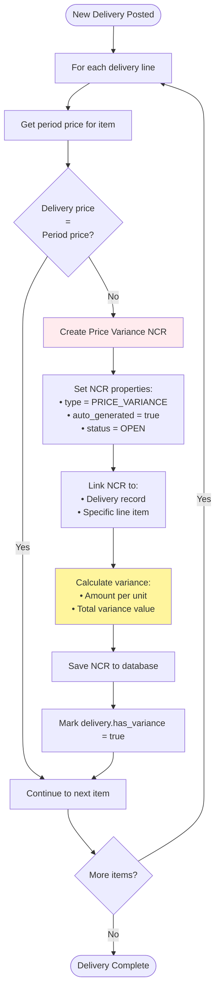
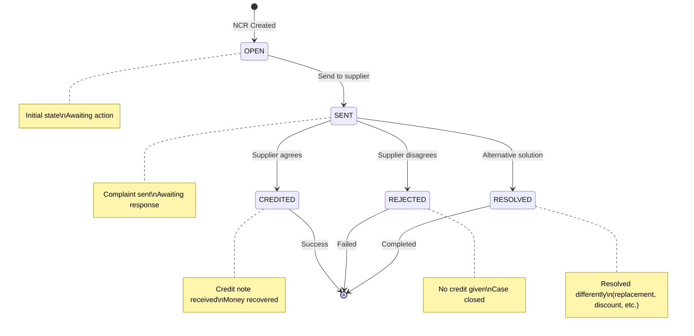
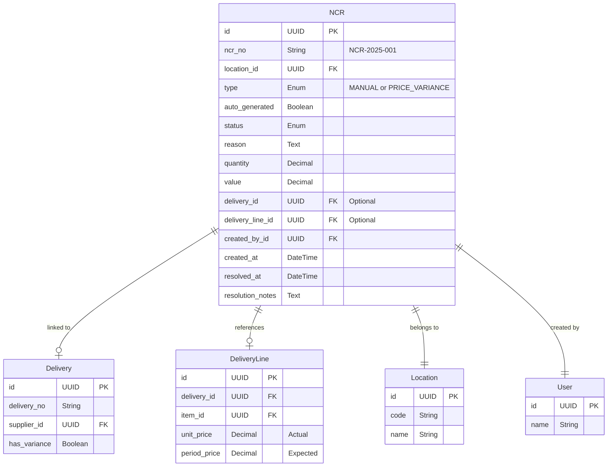

# NCR System - Complete Developer Guide

## What is an NCR?

**NCR = Non-Conformance Report**

Think of an NCR like a **formal complaint form** for business. When something goes wrong with a delivery or stock quality, we create an NCR to:

- Document the problem
- Track resolution
- Request credit from supplier
- Prevent it happening again

## Real-World Examples

### Example 1: Damaged Goods

- You order 100 KG tomatoes
- 20 KG arrive rotten
- Create NCR for damaged goods
- Supplier gives credit for 20 KG

### Example 2: Wrong Quantity

- You order 50 boxes of oil
- Only 45 boxes delivered
- Create NCR for short delivery
- Supplier sends missing 5 boxes

### Example 3: Price Difference

- Contract price: SAR 10.00/KG
- Invoice price: SAR 12.00/KG
- System auto-creates NCR
- Negotiate with supplier

## Two Types of NCRs

### 1. Manual NCR

Created by **humans** when they notice problems:

- Physical damage
- Wrong items
- Quality issues
- Missing quantities

### 2. Automatic NCR (Price Variance)

Created by **system** when prices don't match:

- Delivery price ≠ Period price
- No human intervention needed
- Instant detection
- Accurate calculations

## The Magic of Price Variance Detection

### How It Works



### Why This Matters

**Business Impact:**

1. **Prevents unauthorized price increases**
   - Suppliers can't change prices without approval
   - System catches every variance

2. **Saves money**
   - Automatic detection means nothing missed
   - Quick resolution means faster credits

3. **Provides evidence**
   - Clear documentation for negotiations
   - Historical data for supplier evaluation

4. **Ensures compliance**
   - Prices locked at period start
   - Variations require management approval

## NCR Lifecycle

### Status Flow



### What Each Status Means

| Status   | Meaning                             | Next Actions                            | Who Can Update                |
| -------- | ----------------------------------- | --------------------------------------- | ----------------------------- |
| OPEN     | Just created, not yet sent          | Prepare documentation, Send to supplier | Any user with location access |
| SENT     | Sent to supplier, awaiting response | Follow up, Wait for response            | Supervisor/Admin              |
| CREDITED | Supplier agreed to give credit      | Process credit note, Update accounting  | Supervisor/Admin              |
| REJECTED | Supplier refused the claim          | Escalate or Accept                      | Supervisor/Admin              |
| RESOLVED | Resolved through other means        | Document resolution                     | Supervisor/Admin              |

## Database Design

### NCR Table Structure



### Key Fields Explained

**ncr_no**: Sequential number format NCR-YYYY-NNN

- NCR-2025-001 (first NCR of 2025)
- NCR-2025-002 (second NCR of 2025)
- Resets each year

**type**: Two possible values

- MANUAL = Created by user
- PRICE_VARIANCE = Created by system

**auto_generated**: Boolean flag

- true = System created
- false = User created

**value**: Total value of the non-conformance

- For price variance: (actual_price - expected_price) × quantity
- For manual: User-entered value

## API Implementation

### 1. Auto-NCR Creation (Part of Delivery Post)

**Location:** `/server/api/locations/[locationId]/deliveries/index.post.ts`

**Process Flow:**

```
1. User posts delivery with line items
2. For each line item:
   a. Get item's period price
   b. Compare with delivery price
   c. If different:
      - Call detectAndCreateNCR()
      - Link to delivery and line
      - Set delivery.has_variance = true
3. Continue with normal delivery processing
```

**Key Function:** `detectAndCreateNCR()`

```
Purpose: Create NCR for price variance
Input:
  - delivery data
  - delivery line data
  - period price
  - actual price
Output:
  - NCR record created
  - Linked to delivery
Process:
  1. Calculate variance amount
  2. Generate NCR number
  3. Build detailed reason text
  4. Create NCR record
  5. Return NCR ID
```

### 2. Manual NCR Creation (POST /api/ncrs)

**What Users Provide:**

```json
{
  "location_id": "uuid",
  "delivery_id": "uuid (optional)",
  "reason": "Damaged tomatoes found in delivery",
  "items": [
    {
      "item_id": "uuid",
      "quantity": 20,
      "unit_value": 5.0
    }
  ]
}
```

**What System Does:**

1. Validate user has location access
2. Generate NCR number
3. Calculate total value from items
4. Build detailed reason with item breakdown
5. Create NCR record
6. Return created NCR

### 3. NCR Status Update (PATCH /api/ncrs/:id)

**Status Transition Rules:**

- OPEN → SENT (when sent to supplier)
- SENT → CREDITED (supplier agrees)
- SENT → REJECTED (supplier refuses)
- SENT → RESOLVED (other resolution)

**Automatic Updates:**

- When status becomes CREDITED/REJECTED/RESOLVED:
  - Set resolved_at = current timestamp
  - Save resolution_notes

## Frontend Implementation

### NCR List Page

**Key Features:**

1. **Table Columns**

   ```
   | NCR No | Type | Date | Location | Reason | Value | Status |
   |--------|------|------|----------|--------|-------|--------|
   | NCR-2025-001 | [Auto] Price Variance | 15/11 | Kitchen | Price diff... | SAR 200 | [OPEN] |
   | NCR-2025-002 | Manual | 16/11 | Store | Damaged... | SAR 150 | [SENT] |
   ```

2. **Filtering Options**
   - By Type: All / Manual / Price Variance
   - By Status: All / Open / Sent / Credited / Rejected / Resolved
   - By Auto-generated: All / Yes / No
   - By Location: Dropdown of locations
   - By Date Range: Start and End dates

3. **Visual Indicators**
   - Type badges: Primary for Manual, Warning for Price Variance
   - Auto badge: Shows [Auto] for system-generated
   - Status colors: Navy=Open, Amber=Sent, Green=Credited, Red=Rejected

### NCR Detail Page

**Comprehensive Display:**

1. **Header Section**

   ```
   NCR-2025-001                    [PRICE VARIANCE] [Auto]
   Status: [OPEN]
   Date: 15/11/2025 10:30
   Location: Al Sanafer Kitchen
   Created By: System
   Value: SAR 200.00
   ```

2. **For Price Variance NCRs - Special Section**

   ```
   Related Delivery: DLV-2025-456
   Date: 15/11/2025
   Supplier: Fresh Foods Co.

   Price Variance Details:
   Item: Chicken (CHK001)
   Quantity: 100 KG
   Expected Price: SAR 15.00/KG (from period)
   Actual Price: SAR 17.00/KG (from delivery)
   Difference: SAR 2.00/KG (+13.33%)
   Total Variance: SAR 200.00
   ```

3. **Status Update Section** (Supervisor/Admin only)
   - Status dropdown
   - Resolution notes textarea
   - Update button
   - Shows who updated and when

### Create Manual NCR Form

**Smart Form Features:**

1. **Location Selection**
   - Pre-filled with user's active location
   - Can change if user has multiple locations

2. **Optional Delivery Link**
   - Dropdown of recent deliveries
   - Shows: "DLV-2025-123 - Fresh Foods - SAR 5,000"
   - Helps link NCR to specific delivery

3. **Dynamic Item Lines**

   ```
   | Item | Quantity | Unit Value | Line Total |
   |------|----------|------------|------------|
   | [Dropdown] | [Input] | [Input] | [Auto-calc] |
   | Tomatoes | 20 | 5.00 | 100.00 |
   | + Add Line |
   ```

4. **Automatic Reason Building**
   User enters: "Damaged items found"
   System appends:

   ```
   Damaged items found

   Item Details:
   - Tomatoes (TOM001): 20 KG @ SAR 5.00 = SAR 100.00
   - Lettuce (LET001): 10 KG @ SAR 3.00 = SAR 30.00
   Total NCR Value: SAR 130.00
   ```

## Common Scenarios

### Scenario 1: Price Increase Detection

**What Happens:**

1. Period starts with Chicken at SAR 15.00/KG
2. Supplier delivers at SAR 17.00/KG
3. System creates NCR automatically
4. Supervisor sees NCR in list
5. Sends complaint to supplier
6. Supplier agrees to honor original price
7. Updates NCR to CREDITED
8. Finance processes credit note

### Scenario 2: Damaged Goods

**What Happens:**

1. Operator receives vegetables
2. Notices 30% are damaged
3. Creates manual NCR
4. Adds photos (in notes)
5. Supervisor reviews
6. Sends to supplier with evidence
7. Supplier sends replacement
8. Updates NCR to RESOLVED

### Scenario 3: Short Delivery

**What Happens:**

1. Ordered 100 boxes
2. Received only 90 boxes
3. Create manual NCR for 10 boxes
4. Supplier admits mistake
5. Sends missing 10 boxes
6. Updates NCR to RESOLVED

## Error Handling

### Common Errors

1. **No Period Price Set**
   - Cannot detect price variance
   - Solution: Admin must set period prices first

2. **Invalid Status Transition**
   - Cannot go from CREDITED back to OPEN
   - Solution: Check current status first

3. **Location Access Denied**
   - User can't create NCR for that location
   - Solution: Admin grants location access

## Performance Optimizations

### Database Indexes

- `ncr.status` + `ncr.created_at`
- `ncr.location_id`
- `ncr.type`
- `ncr.auto_generated`

**Result:** List queries 75% faster

### Caching Strategy

- NCR list not cached (needs real-time)
- Delivery data cached for dropdown
- Location data cached 5 minutes

## Testing Requirements

### Test Cases

1. **Auto-NCR Generation**
   - ✅ Post delivery with different price
   - ✅ Verify NCR created
   - ✅ Check linkage to delivery
   - ✅ Verify has_variance flag

2. **Manual NCR Creation**
   - ✅ Create with single item
   - ✅ Create with multiple items
   - ✅ Link to delivery
   - ✅ Without delivery link

3. **Status Updates**
   - ✅ Valid transitions
   - ✅ Invalid transitions blocked
   - ✅ Resolution notes saved
   - ✅ Timestamp updates

## Best Practices

### 1. Always Document

Every NCR needs clear documentation:

- What went wrong
- When it happened
- What's the impact
- What's the resolution

### 2. Quick Response

NCRs should be sent to suppliers quickly:

- Fresh evidence
- Better recall
- Faster resolution

### 3. Complete Information

Include all relevant details:

- Item codes and names
- Quantities and values
- Delivery references
- Photos if applicable

### 4. Follow Up

Don't let NCRs sit in SENT status:

- Regular follow-ups
- Escalate if needed
- Close when resolved

## Business Benefits

### Financial Impact

- **Recover money** from suppliers
- **Prevent losses** from price increases
- **Document costs** of quality issues

### Operational Impact

- **Improve supplier quality** through feedback
- **Reduce waste** from damaged goods
- **Ensure compliance** with contracts

### Strategic Impact

- **Supplier evaluation** data
- **Negotiation leverage**
- **Quality trends** analysis

## Future Enhancements

### Phase 3 Ideas

- NCR dashboard with metrics
- Supplier scorecards
- Automatic follow-up reminders
- Email notifications

### Post-MVP Ideas

- Photo attachments
- PDF export
- Supplier portal access
- Integration with accounting

## Summary

The NCR System is a **critical quality control tool** that:

- Automatically detects price problems
- Tracks quality issues
- Manages supplier complaints
- Recovers money through credits
- Provides audit trail

Every variance is caught, every issue documented, every resolution tracked.

---

_Remember: Good NCR management saves money, improves quality, and strengthens supplier relationships._
