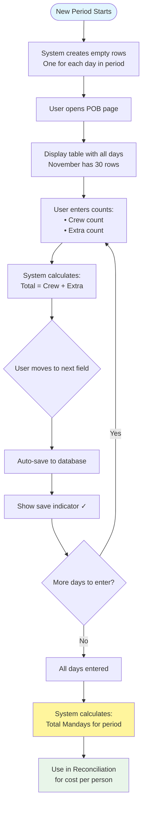
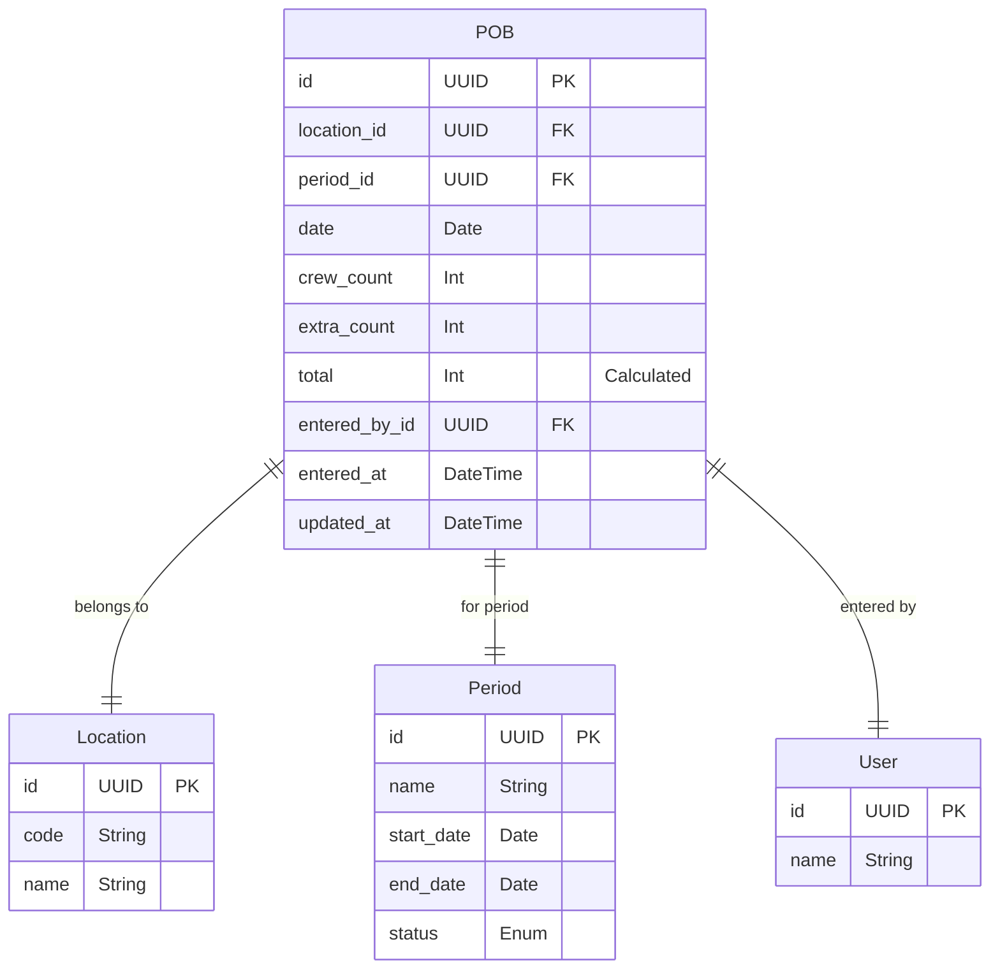
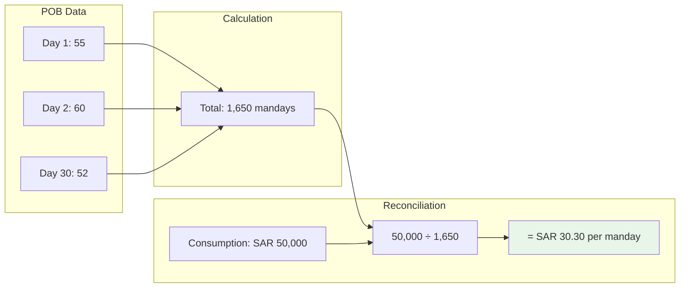

# POB Entry - Complete Developer Guide

## What is POB?

**POB = Personnel On Board**

It answers one simple question: **"How many people did we feed today?"**

Think of it like taking attendance, but for meals. Every day, you count:
- How many regular staff (crew)
- How many visitors/guests (extra)
- Total = Crew + Extra

## Why POB Matters

### The Business Problem

Imagine you run a kitchen that spent SAR 50,000 on food this month. Your boss asks:
- "Is that good or bad?"
- "Are we efficient?"
- "How does it compare to last month?"

Without knowing how many people you fed, you can't answer!

### The Solution

If you know you fed 1,650 people over the month:
- Cost per person = SAR 50,000 ÷ 1,650 = **SAR 30.30 per day**
- Last month was SAR 28.50 per day
- Conclusion: Costs increased by SAR 1.80 per person

Now you can investigate why costs went up!

## How POB Works

### Daily Entry Process



## Key Concepts

### What are Mandays?

**Manday = One person fed for one day**

Examples:
- 50 people for 1 day = 50 mandays
- 1 person for 50 days = 50 mandays
- 50 people for 30 days = 1,500 mandays

### Crew vs Extra

**Crew:** Regular employees who eat every day
- Kitchen staff
- Security guards
- Maintenance team
- Office workers

**Extra:** Temporary or occasional people
- Visitors
- Contractors
- Temporary workers
- Guests

**Why separate them?**
- Different cost allocations
- Crew is predictable, extras vary
- Management wants to know both

### Auto-Save Magic

**Traditional way:**
1. Enter all data
2. Click Save button
3. Hope nothing crashes
4. If error, lose everything

**Our way:**
1. Enter data for one day
2. Move to next field
3. Automatically saves
4. If error, only that row affected
5. Never lose work!

## Database Design

### POB Table Structure



### Important Fields

**date:** The specific day
- Must be within period dates
- Format: YYYY-MM-DD
- Unique per location per day

**crew_count:** Regular staff count
- Non-negative integer
- Can be zero (holiday/closed)
- Usually consistent

**extra_count:** Additional people
- Non-negative integer
- Often zero
- Varies daily

**total:** Calculated field
- Always = crew_count + extra_count
- Used for manday calculations

## API Implementation

### 1. Get POB Entries (GET /api/locations/:locationId/pob)

**What it does:**
- Fetches all POB entries for a location and period
- Returns empty entries for dates without data
- Sorted by date ascending

**Request:**
```
GET /api/locations/abc123/pob?periodId=xyz789
```

**Response:**
```json
{
  "entries": [
    {
      "id": "uuid",
      "date": "2025-11-01",
      "crew_count": 50,
      "extra_count": 5,
      "total": 55
    },
    {
      "id": null,
      "date": "2025-11-02",
      "crew_count": 0,
      "extra_count": 0,
      "total": 0
    }
  ],
  "summary": {
    "total_crew": 1500,
    "total_extra": 150,
    "total_mandays": 1650,
    "days_with_data": 28,
    "total_days": 30
  }
}
```

### 2. Bulk Upsert (POST /api/locations/:locationId/pob)

**What it does:**
- Creates or updates multiple entries at once
- Uses database upsert (insert or update)
- Atomic operation

**Why bulk?**
- More efficient than individual saves
- Can save entire month at once
- Better for imports

**Request:**
```json
{
  "entries": [
    {
      "date": "2025-11-01",
      "crew_count": 50,
      "extra_count": 5
    },
    {
      "date": "2025-11-02",
      "crew_count": 48,
      "extra_count": 8
    }
  ]
}
```

### 3. Update Single Entry (PATCH /api/pob/:id)

**What it does:**
- Updates one specific entry
- Used by auto-save feature
- Returns updated entry

**Request:**
```json
{
  "crew_count": 52,
  "extra_count": 3
}
```

**Validation:**
- Must be non-negative integers
- Period must be OPEN
- User must have location access

## Frontend Implementation

### POB Page Structure

```mermaid
graph TD
    subgraph "Page Layout"
        Header[Page Header: Personnel On Board]
        Summary[Summary Card:<br/>Period: November 2025<br/>Total Mandays: 1,650]
        Instructions[Info Alert:<br/>Enter daily counts - saves automatically]
        Table[POB Entry Table]
    end

    subgraph "Table Structure"
        TableHeader[Date | Crew | Extra | Total]
        Row1[Monday, 01/11/2025 | Input:50 | Input:5 | 55]
        Row2[Tuesday, 02/11/2025 | Input:48 | Input:8 | 56]
        RowN[... more rows ...]
    end

    Header --> Summary
    Summary --> Instructions
    Instructions --> Table
    Table --> TableHeader
    TableHeader --> Row1
    Row1 --> Row2
    Row2 --> RowN
```

### Auto-Save Implementation

**How it works:**

1. **Setup Phase**
   ```
   - Page loads
   - Fetch existing POB data
   - Generate rows for all period dates
   - Merge existing data with empty rows
   ```

2. **User Interaction**
   ```
   User types: 50 in crew field
   → onChange event triggered
   → Update local state
   → Recalculate total
   → Set dirty flag for row
   ```

3. **Auto-Save Trigger**
   ```
   User presses Tab or clicks away
   → onBlur event triggered
   → Check if row is dirty
   → If yes, trigger save
   ```

4. **Save Process**
   ```
   → Show saving indicator (spinner)
   → Call PATCH /api/pob/:id
   → On success: Show check mark
   → On error: Show error, restore value
   → Clear dirty flag
   ```

### Visual Feedback

**States for each row:**

| State | Visual | Meaning |
|-------|--------|---------|
| Clean | Normal | No changes |
| Dirty | Yellow background | Changed, not saved |
| Saving | Spinner icon | Saving in progress |
| Saved | Green check | Successfully saved |
| Error | Red border | Save failed |

### Period State Handling

**When Period is OPEN:**
- All inputs enabled
- Auto-save active
- Can modify any day

**When Period is CLOSED:**
- All inputs disabled
- Gray background
- Warning message shown
- Read-only mode

## User Experience Features

### 1. Smart Date Display

Instead of: "2025-11-01"
We show: "Monday, 01/11/2025"

Why?
- Users think in weekdays
- Easier to spot weekends
- More human-friendly

### 2. Keyboard Navigation

- Tab: Move to next field
- Shift+Tab: Move to previous
- Enter: Move down to same field next row
- Arrow keys: Navigate grid

### 3. Validation Feedback

**Invalid input examples:**
- Negative number: Shows "Must be positive"
- Decimal: Rounds to integer automatically
- Text: Prevents entry, shows error

### 4. Progress Indicator

Shows at top of page:
```
Progress: 28 of 30 days entered (93%)
Missing: November 15, November 20
```

## Common Issues and Solutions

### Issue 1: Missing Days

**Problem:** Some days have no POB data
**Impact:** Manday calculation incorrect
**Solution:**
- System highlights missing days
- Shows warning in reconciliation
- Supervisor must ensure all days entered

### Issue 2: Save Conflicts

**Problem:** Two users editing same day
**Impact:** Last save wins
**Solution:**
- Show who's currently editing
- Refresh data periodically
- Warn before overwriting

### Issue 3: Period Boundary

**Problem:** User tries to enter outside period
**Impact:** Data for wrong period
**Solution:**
- Only show current period dates
- Validate date on server
- Clear error messages

## Performance Considerations

### Efficient Loading

**Challenge:** Loading 30 days of data
**Solution:**
- Single API call for all days
- Virtual scrolling for large tables
- Lazy load historical data

### Auto-Save Throttling

**Challenge:** Too many API calls
**Solution:**
- Debounce saves (wait 500ms after typing)
- Batch multiple changes
- Show pending saves indicator

### Caching Strategy

- Cache period data (10 minutes)
- Don't cache POB entries (need real-time)
- Refresh on focus return

## Integration with Reconciliation

### How POB Affects Reconciliation



### Missing POB Impact

If POB data missing:
- Shows warning in reconciliation
- Displays "N/A" for manday cost
- Can't complete period close
- Must enter POB first

## Testing Requirements

### Unit Tests

- ✅ Validation (non-negative integers)
- ✅ Total calculation
- ✅ Date range validation
- ✅ Auto-save logic

### Integration Tests

- ✅ Load POB page with data
- ✅ Auto-save triggers
- ✅ Period state handling
- ✅ Bulk operations

### E2E Tests

- ✅ Complete month entry
- ✅ Keyboard navigation
- ✅ Error recovery
- ✅ Integration with reconciliation

## Best Practices

### 1. Enter Daily

Don't wait until month-end:
- Fresh memory
- Spot patterns
- Catch errors early

### 2. Verify Totals

Check weekly totals make sense:
- Weekends different?
- Holidays reflected?
- Special events counted?

### 3. Document Variations

If unusual counts, add notes:
- "Company event - 50 extra"
- "Holiday - skeleton crew"
- "Training day - 20 visitors"

### 4. Review Before Period Close

- Ensure all days entered
- Check for obvious errors
- Verify totals reasonable

## Future Enhancements

### Phase 3 Ideas

- POB forecasting
- Automatic reminders
- Comparison with previous periods
- Alerts for unusual counts

### Post-MVP Ideas

- Integration with HR system
- Biometric attendance import
- Mobile app entry
- Predictive entry based on patterns

## Business Value

### Cost Control

- Identify cost per person trends
- Benchmark between locations
- Spot inefficiencies

### Planning

- Forecast food requirements
- Budget more accurately
- Plan staffing needs

### Accountability

- Track who entered data
- When it was entered
- Complete audit trail

## Summary

POB Entry is **simple but critical**:
- Counts people daily
- Enables cost per person calculation
- Uses auto-save for efficiency
- Integrates with reconciliation

Without accurate POB data, you can't calculate true food service costs.

---

*Remember: Every person counts, literally! Accurate POB data drives informed business decisions.*