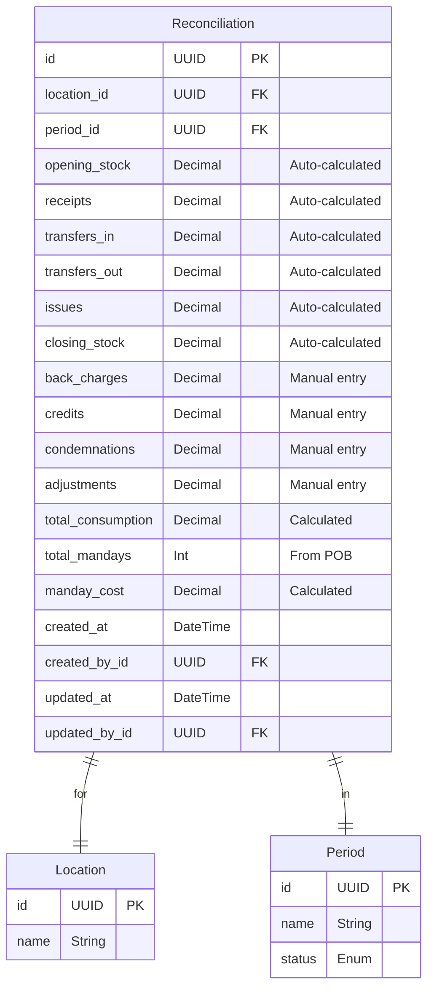
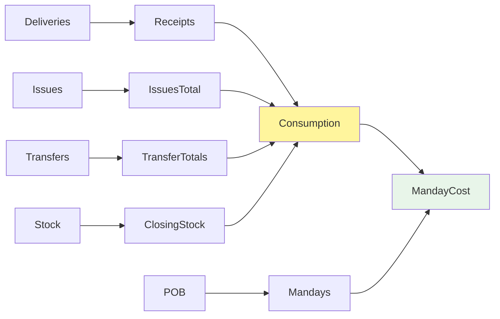

# Reconciliations - Complete Developer Guide

## What is a Reconciliation?

**Reconciliation** is the process of calculating **how much was consumed** during a period (usually a month).

Think of it like balancing your checkbook:

- What you had at the start
- What came in
- What went out
- What you have at the end
- The difference = What you consumed

## The Core Formula

This is the **most important formula** in the entire system:

```
Consumption = Opening Stock + Receipts + Transfers In - Transfers Out - Issues - Closing Stock + Adjustments
```

Let's break it down with a real example:

### Kitchen Example for November 2025

| Component               | Amount (SAR) | Explanation                         |
| ----------------------- | ------------ | ----------------------------------- |
| Opening Stock           | 125,000      | What we had on November 1st         |
| + Receipts              | 45,000       | Deliveries received in November     |
| + Transfers In          | 8,000        | Stock received from other locations |
| - Transfers Out         | 3,500        | Stock sent to other locations       |
| - Issues                | 135,000      | Stock used for cooking              |
| - Closing Stock         | 5,000        | What we have on November 30th       |
| **= Base Consumption**  | **34,500**   | Stock consumed before adjustments   |
| + Adjustments           | 600          | Various adjustments (see below)     |
| **= Final Consumption** | **35,100**   | Total consumption for November      |

## Why Reconciliation Matters

### Business Questions It Answers

1. **How much did we spend on food?**
   - Consumption = SAR 35,100

2. **How efficient are we?**
   - Last month: SAR 32,000
   - This month: SAR 35,100
   - Increased by SAR 3,100

3. **What's the cost per person?**
   - Consumption: SAR 35,100
   - Total people (from POB): 1,650
   - Cost per person: SAR 21.27 per day

4. **Are we within budget?**
   - Budget: SAR 40,000
   - Actual: SAR 35,100
   - Under budget by SAR 4,900

## Understanding Each Component

### Opening Stock

- **What:** Value of stock at period start
- **Source:** Previous period's closing stock
- **First period:** Zero (no previous period)
- **Formula:** Quantity × WAC for each item

### Receipts

- **What:** All deliveries received
- **Source:** Sum of all posted deliveries
- **Includes:** All delivery line values
- **Formula:** Sum(quantity × unit_price) for all deliveries

### Transfers In/Out

- **What:** Stock moved between locations
- **Source:** Approved and completed transfers
- **In:** Stock received from other locations
- **Out:** Stock sent to other locations

### Issues

- **What:** Stock used/consumed
- **Source:** All posted issues
- **Purpose:** Actual usage for operations
- **Formula:** Sum(quantity × WAC) for all issues

### Closing Stock

- **What:** Value of stock at period end
- **Source:** Current LocationStock
- **Timing:** Snapshot at period close
- **Formula:** Current quantity × current WAC

### Adjustments

Four types of adjustments supervisors can add:

1. **Back-charges:** Additional costs charged to location
2. **Credits:** Refunds or discounts (negative value)
3. **Condemnations:** Spoiled/damaged stock written off
4. **Other:** Miscellaneous adjustments

## The Auto-Calculation Magic

### How It Works

```mermaid
flowchart TD
    Start([User Opens Reconciliation])

    Start --> Check{Saved reconciliation<br/>exists?}

    Check -->|Yes| LoadSaved[Load saved data<br/>with adjustments]
    Check -->|No| AutoCalc[Start auto-calculation]

    AutoCalc --> GetOpening[Query: Previous period closing<br/>or 0 if first period]

    GetOpening --> GetReceipts[Query: Sum all deliveries<br/>for current period]

    GetReceipts --> GetTransfers[Query: Sum transfers IN<br/>Query: Sum transfers OUT]

    GetTransfers --> GetIssues[Query: Sum all issues<br/>for current period]

    GetIssues --> GetClosing[Query: Current LocationStock<br/>Calculate: Quantity × WAC]

    GetClosing --> CalcBase[Calculate Base Consumption<br/>using formula]

    CalcBase --> GetPOB[Query: Sum POB entries<br/>for total mandays]

    GetPOB --> CalcCost[Calculate: Consumption ÷ Mandays<br/>= Cost per person]

    CalcCost --> Display[Display with<br/>"Auto-calculated" indicator]

    LoadSaved --> Display2[Display without<br/>auto-calculated indicator]

    style Check fill:#fff3e0
    style AutoCalc fill:#fff59d
    style CalcCost fill:#e8f5e9
```

### Why Auto-Calculate?

**Benefits:**

- No manual data entry
- Always current
- Reduces errors
- Available anytime

**Process:**

1. System queries all transactions
2. Applies the formula
3. Shows result instantly
4. Updates when transactions change

## Database Design

### Reconciliation Table



### Key Design Decisions

**Why store calculated values?**

- Performance (no need to recalculate)
- Historical accuracy (transactions might change)
- Audit trail (who approved these numbers)

**Why allow adjustments?**

- Real-world complexity
- Things happen outside the system
- Supervisor knowledge

## API Implementation

### 1. Get/Calculate Reconciliation

**Endpoint:** `GET /api/locations/:locationId/reconciliations/:periodId`

**Logic Flow:**

```
1. Check if saved reconciliation exists
2. If YES:
   - Return saved data
   - Include adjustments
   - Include who saved and when
3. If NO:
   - Calculate opening (from previous period)
   - Sum all receipts (deliveries)
   - Sum all transfers (in and out)
   - Sum all issues
   - Calculate closing (current stock)
   - Get POB mandays
   - Calculate consumption
   - Calculate manday cost
   - Return with "auto_calculated: true"
```

### 2. Save Adjustments

**Endpoint:** `PATCH /api/locations/:locationId/reconciliations/:periodId`

**Process:**

```
1. Validate user is Supervisor/Admin
2. If no record exists:
   - Create with auto-calculated base values
3. Update adjustment fields:
   - back_charges
   - credits
   - condemnations
   - adjustments
4. Recalculate:
   - total_consumption (with adjustments)
   - manday_cost (new total ÷ mandays)
5. Save with audit trail
6. Return updated reconciliation
```

### 3. Consolidated View

**Endpoint:** `GET /api/reconciliations/consolidated`

**What it does:**

- Gets reconciliations for ALL locations
- Aggregates totals
- Calculates averages
- Supervisor/Admin only

**Response Structure:**

```json
{
  "period": "November 2025",
  "locations": [
    {
      "location": "Kitchen",
      "consumption": 35100,
      "mandays": 1650,
      "manday_cost": 21.27,
      "status": "saved"
    },
    {
      "location": "Store",
      "consumption": 28500,
      "mandays": 1200,
      "manday_cost": 23.75,
      "status": "auto_calculated"
    }
  ],
  "totals": {
    "consumption": 63600,
    "mandays": 2850,
    "average_cost": 22.32
  }
}
```

## Frontend Implementation

### Reconciliation Page Layout

```mermaid
graph TD
    subgraph "Page Structure"
        Header[Location Selector | Period Info]
        Warning[⚠️ Auto-Calculated Warning]
        Stock[Stock Movement Card]
        Adjust[Adjustments Card]
        Analysis[Consumption Analysis Card]
    end

    subgraph "Stock Movement Card"
        Opening[Opening Stock: 125,000]
        Receipts[Receipts: 45,000 ✓]
        TransIn[Transfers In: 8,000 ✓]
        TransOut[Transfers Out: 3,500 ✗]
        Issues[Issues: 135,000 ✗]
        Closing[Closing Stock: 5,000]
    end

    subgraph "Adjustments Card"
        BackCharge[Back-charges: Input]
        Credits[Credits: Input]
        Condemn[Condemnations: Input]
        Other[Other: Input]
        Save[Save Adjustments Button]
    end

    subgraph "Analysis Card"
        Consumption[Total Consumption: 35,100]
        Mandays[Total Mandays: 1,650]
        Cost[Cost per Manday: 21.27]
        Breakdown[Show Calculation ▼]
    end
```

### Visual Design

**Color Coding:**

- Green (emerald): Additions (receipts, transfers in)
- Red: Deductions (transfers out, issues)
- Primary (navy): Key values (consumption)
- Warning (amber): Auto-calculated indicator

**Card Layout:**

- Stock Movement: Read-only, auto-calculated
- Adjustments: Editable for supervisors
- Analysis: Prominent display of results

### Calculation Breakdown

When user clicks "Show Calculation":

```
Opening Stock:           125,000.00
+ Receipts:              +45,000.00
+ Transfers In:           +8,000.00
- Transfers Out:          -3,500.00
- Issues:               -135,000.00
- Closing Stock:          -5,000.00
--------------------------------
Base Consumption:         34,500.00

Adjustments:
+ Back-charges:             +500.00
- Credits:                  -200.00
+ Condemnations:            +300.00
+ Other:                      +0.00
--------------------------------
Total Adjustments:           +600.00

Final Consumption:        35,100.00
÷ Total Mandays:            1,650
--------------------------------
Cost per Manday:         SAR 21.27
```

## Consolidated View Features

### Management Dashboard

**Purpose:** Compare all locations at once

**Table Columns:**
| Location | Opening | Receipts | Transfers | Issues | Closing | Adjustments | Consumption | Mandays | Cost/Day | Status |
|----------|---------|----------|-----------|---------|---------|-------------|-------------|---------|----------|--------|

**Features:**

- Sort by any column
- Color-coded values
- Status indicators (Saved/Auto)
- Grand totals row
- CSV export

### CSV Export

**Generated File Includes:**

```
Stock Management System - Consolidated Reconciliation
Period: November 2025
Generated: 24/11/2025 10:30

Location,Opening,Receipts,Transfers In,Transfers Out,Issues,Closing,Adjustments,Consumption,Mandays,Cost per Day
Kitchen,125000,45000,8000,3500,135000,5000,600,35100,1650,21.27
Store,95000,38000,3500,8000,98000,30000,0,500,1200,0.42
...
TOTAL,220000,83000,11500,11500,233000,35000,600,35600,2850,12.49
```

## Common Scenarios

### Scenario 1: First Time Opening

**User:** Opens reconciliation for first time
**System:**

- No saved record exists
- Auto-calculates everything
- Shows with yellow "Auto-calculated" banner
- All adjustments are zero
- Displays current consumption

### Scenario 2: Supervisor Review

**User:** Supervisor reviews auto-calculated
**Actions:**

1. Reviews auto-calculated values
2. Adds back-charges: SAR 500 (borrowed staff meals)
3. Adds credits: -SAR 200 (supplier refund)
4. Adds condemnations: SAR 300 (spoiled vegetables)
5. Clicks "Save Adjustments"
   **System:**

- Creates permanent record
- Recalculates consumption
- Removes "Auto-calculated" banner
- Shows "Saved by: John Doe at 10:30"

### Scenario 3: Period Close Preparation

**User:** Admin preparing to close period
**Checks:**

1. Opens consolidated view
2. Sees 3 of 4 locations saved
3. One still auto-calculated
4. Contacts that supervisor
5. All saved → Ready to close

## Error Handling

### Common Issues

1. **No POB Data**
   - Shows: "0 mandays"
   - Cost shows: "N/A"
   - Warning message displayed

2. **No Previous Period**
   - Opening stock: 0
   - Normal for first period
   - No error shown

3. **Permissions**
   - Operators: View only
   - Supervisors: Can edit adjustments
   - Admins: Full access

## Performance Optimizations

### Query Optimization

**Challenge:** Calculating for many transactions
**Solution:**

- Aggregate queries at database level
- Single query per component
- Parallel execution where possible
- Indexes on date fields

### Caching Strategy

- Don't cache reconciliations (need real-time)
- Cache period data (10 minutes)
- Refresh on transaction changes

## Business Rules

### Important Rules

1. **Cannot modify after period close**
   - Period status must be OPEN
   - Locked after closing

2. **Adjustments need justification**
   - Should document why
   - Audit trail important

3. **Supervisor approval required**
   - Operators can't save adjustments
   - Two-eyes principle

4. **Auto-calc always available**
   - Even with saved record
   - Can compare versions

## Integration Points

### Dependencies



### What Affects Reconciliation

Any change to:

- Deliveries → Changes receipts
- Issues → Changes issues total
- Transfers → Changes transfer totals
- Stock counts → Changes closing
- POB entries → Changes manday cost

## Testing Requirements

### Test Cases

1. **Auto-Calculation**
   - ✅ Correct formula application
   - ✅ All components included
   - ✅ Handles zero values
   - ✅ First period (no opening)

2. **Adjustments**
   - ✅ Save adjustments
   - ✅ Recalculation
   - ✅ Permission checks
   - ✅ Negative values (credits)

3. **Consolidated View**
   - ✅ All locations shown
   - ✅ Correct aggregation
   - ✅ CSV export
   - ✅ Permission restrictions

## Best Practices

### 1. Review Before Saving

- Check auto-calculated values make sense
- Verify large variances
- Document adjustment reasons

### 2. Save Promptly

- Don't wait until last day
- Save when adjustments known
- Allows management review time

### 3. Use Adjustments Wisely

- Only for real business reasons
- Not to "fix" numbers
- Document everything

### 4. Monitor Trends

- Compare with previous periods
- Investigate anomalies
- Use for improvement

## Future Enhancements

### Phase 3 Features

- Automated adjustment suggestions
- Variance analysis reports
- Budget vs actual comparison
- Predictive consumption

### Post-MVP Ideas

- Graphical dashboards
- Trend analysis charts
- Email reports
- Mobile app access

## Summary

Reconciliation is the **financial heart** of the system:

- Calculates true consumption
- Enables cost per person analysis
- Provides management visibility
- Ensures financial accuracy

Without reconciliation, you're flying blind!

---

_Remember: Accurate reconciliation drives better business decisions and cost control._
