# Phase 2 Visual Workflows - Interactive Diagrams Guide

## Introduction

This guide uses **visual diagrams** to explain how each Phase 2 feature works. Each diagram shows the complete flow from start to finish, making it easy to understand even if English is not your primary language.

---

## 1. Transfer Management Workflows

### 1.1 Complete Transfer Process

```mermaid
flowchart TB
    Start([Operator needs to move stock])

    Start --> CheckStock{Check source<br/>has enough stock?}
    CheckStock -->|No| ShowError[Show error:<br/>"Insufficient stock"]
    CheckStock -->|Yes| CreateTransfer[Create transfer request]

    ShowError --> End1([End - Transfer not created])

    CreateTransfer --> FillForm[Fill transfer form:<br/>• From location<br/>• To location<br/>• Items & quantities]

    FillForm --> Validate{System validates:<br/>Different locations?<br/>Stock available?}

    Validate -->|Invalid| ShowValidationError[Show validation errors]
    ShowValidationError --> FillForm

    Validate -->|Valid| SaveTransfer[Save as PENDING_APPROVAL]
    SaveTransfer --> NotifySupervisor[System notifies supervisor]

    NotifySupervisor --> SupervisorReviews[Supervisor reviews transfer]

    SupervisorReviews --> Decision{Approve or Reject?}

    Decision -->|Reject| RejectTransfer[Status = REJECTED<br/>Add rejection reason]
    RejectTransfer --> End2([End - Transfer rejected])

    Decision -->|Approve| StartTransaction[Start database transaction]

    StartTransaction --> RevalidateStock{Re-check stock<br/>still available?}

    RevalidateStock -->|No| RollbackTransaction[Rollback transaction<br/>Show error to supervisor]
    RollbackTransaction --> End3([End - Approval failed])

    RevalidateStock -->|Yes| ProcessItems[For each item in transfer:]

    ProcessItems --> DeductStock[Deduct from source location]
    DeductStock --> AddStock[Add to destination location<br/>at source WAC]
    AddStock --> UpdateWAC[Recalculate destination WAC]

    UpdateWAC --> MoreItems{More items?}
    MoreItems -->|Yes| ProcessItems
    MoreItems -->|No| CompleteTransfer[Status = COMPLETED<br/>Set transfer_date]

    CompleteTransfer --> CommitTransaction[Commit transaction]
    CommitTransaction --> End4([End - Transfer successful])

    style Start fill:#e1f5fe
    style End1 fill:#ffebee
    style End2 fill:#ffebee
    style End3 fill:#ffebee
    style End4 fill:#e8f5e9
    style Decision fill:#fff3e0
    style RevalidateStock fill:#fff3e0
```

### 1.2 Stock Validation During Transfer

```mermaid
flowchart LR
    subgraph "Source Location (Kitchen)"
        SK[Stock: 100 KG Rice]
        SW[WAC: SAR 5.00/KG]
    end

    subgraph "Transfer Request"
        TR[Request: 30 KG Rice]
        TV[Value: 30 × 5.00 = SAR 150]
    end

    subgraph "Validation Check"
        VC{100 KG >= 30 KG?}
    end

    subgraph "After Approval"
        subgraph "Kitchen (Source)"
            NSK[New Stock: 70 KG]
            NSW[WAC: SAR 5.00/KG unchanged]
        end

        subgraph "Store (Destination)"
            DSB[Before: 50 KG @ SAR 4.00/KG]
            DSA[After: 80 KG @ SAR 4.38/KG]
        end
    end

    SK --> VC
    TR --> VC
    VC -->|Yes| Approve[✓ Allow Transfer]
    VC -->|No| Reject[✗ Block Transfer]

    Approve --> NSK
    Approve --> DSA

    style VC fill:#fff3e0
    style Approve fill:#e8f5e9
    style Reject fill:#ffebee
```



### 1.3 WAC Calculation During Transfer

```mermaid
graph TD
    subgraph "Destination Location BEFORE Transfer"
        B1[Current Stock: 50 KG]
        B2[Current WAC: SAR 4.00/KG]
        B3[Total Value: 50 × 4.00 = SAR 200]
    end

    subgraph "Incoming Transfer"
        T1[Transfer Quantity: 30 KG]
        T2[Source WAC: SAR 5.00/KG]
        T3[Transfer Value: 30 × 5.00 = SAR 150]
    end

    subgraph "WAC Recalculation"
        C1[New Total Quantity: 50 + 30 = 80 KG]
        C2[New Total Value: 200 + 150 = SAR 350]
        C3[New WAC: 350 ÷ 80 = SAR 4.38/KG]
    end

    subgraph "Destination Location AFTER Transfer"
        A1[New Stock: 80 KG]
        A2[New WAC: SAR 4.38/KG]
        A3[New Total Value: SAR 350]
    end

    B1 --> C1
    B3 --> C2
    T1 --> C1
    T3 --> C2
    C1 --> C3
    C2 --> C3
    C3 --> A2
    C1 --> A1
    C2 --> A3

    style C3 fill:#fff59d
```



---

## 2. NCR (Non-Conformance Report) Workflows

### 2.1 Automatic Price Variance NCR Creation

```mermaid
sequenceDiagram
    participant U as User
    participant S as System
    participant PP as Period Prices
    participant NCR as NCR Module
    participant DB as Database

    U->>S: Post Delivery
    Note over S: Delivery Details:<br/>Item: Rice<br/>Quantity: 100 KG<br/>Price: SAR 12.00/KG

    S->>PP: Get Expected Price for Rice
    PP->>S: Period Price: SAR 10.00/KG

    S->>S: Compare Prices
    Note over S: Delivery: SAR 12.00<br/>Expected: SAR 10.00<br/>Variance: SAR 2.00

    alt Price Variance Detected
        S->>NCR: Create Price Variance NCR
        NCR->>NCR: Generate NCR Number<br/>(NCR-2025-001)
        NCR->>NCR: Set Properties:<br/>• type = PRICE_VARIANCE<br/>• auto_generated = true<br/>• status = OPEN
        NCR->>NCR: Calculate Details:<br/>• Item: Rice<br/>• Expected: SAR 10.00<br/>• Actual: SAR 12.00<br/>• Variance: SAR 200.00 total
        NCR->>DB: Save NCR
        DB->>NCR: NCR Created
        NCR->>S: Return NCR ID
        S->>DB: Link NCR to Delivery
        S->>DB: Set delivery.has_variance = true
    else No Price Variance
        S->>S: Continue normally
    end

    S->>U: Delivery Posted Successfully
    Note over U: Sees warning:<br/>"Price variance detected.<br/>NCR created automatically."
```



### 2.2 NCR Lifecycle States


### 2.3 Manual NCR Creation Process

```mermaid
flowchart TD
    Start([User notices quality issue])

    Start --> OpenForm[Open NCR Create Form]
    OpenForm --> SelectLocation[Select Location]
    SelectLocation --> OptionalDelivery{Link to delivery?}

    OptionalDelivery -->|Yes| SelectDelivery[Select delivery from list]
    OptionalDelivery -->|No| SkipDelivery[No delivery linked]

    SelectDelivery --> EnterReason
    SkipDelivery --> EnterReason[Enter reason/description]

    EnterReason --> AddItems[Add item lines:<br/>• Select item<br/>• Enter quantity<br/>• Enter value]

    AddItems --> MoreItems{Add more items?}
    MoreItems -->|Yes| AddItems
    MoreItems -->|No| ValidateForm{Form valid?}

    ValidateForm -->|No| ShowErrors[Show validation errors]
    ShowErrors --> AddItems

    ValidateForm -->|Yes| BuildReason[System builds detailed reason:<br/>User text + item breakdown]

    BuildReason --> SaveNCR[Save NCR to database]
    SaveNCR --> GenerateNumber[Generate NCR Number<br/>(NCR-2025-XXX)]
    GenerateNumber --> SetStatus[Set status = OPEN]
    SetStatus --> Success[NCR created successfully]
    Success --> ViewNCR[Navigate to NCR detail page]
    ViewNCR --> End([End])

    style Start fill:#e1f5fe
    style Success fill:#e8f5e9
    style ShowErrors fill:#ffebee
```

---

## 3. POB (Personnel On Board) Workflows

### 3.1 POB Entry Auto-Save Flow

```mermaid
sequenceDiagram
    participant U as User
    participant UI as POB Table
    participant API as API
    participant DB as Database

    Note over U,DB: User opens POB page for November 2025

    U->>UI: Open POB page
    UI->>API: GET /api/locations/:id/pob?periodId=nov2025
    API->>DB: Fetch existing entries
    DB->>API: Return entries (some days may be empty)
    API->>UI: Return POB data
    UI->>UI: Generate table:<br/>30 rows (one per day)
    UI->>U: Display editable table

    Note over U: User enters data

    U->>UI: Enter Crew: 50 for Nov 1
    UI->>UI: Calculate Total: 50
    U->>UI: Tab to next field
    UI->>UI: Trigger auto-save
    UI->>API: PATCH /api/pob/:id<br/>{crew_count: 50}
    UI->>U: Show saving indicator 🔄
    API->>DB: Update POB entry
    DB->>API: Success
    API->>UI: Return updated entry
    UI->>U: Show saved ✓

    U->>UI: Enter Extra: 5 for Nov 1
    UI->>UI: Calculate Total: 55
    U->>UI: Tab to next field
    UI->>UI: Trigger auto-save
    UI->>API: PATCH /api/pob/:id<br/>{extra_count: 5}
    UI->>U: Show saving indicator 🔄
    API->>DB: Update POB entry
    DB->>API: Success
    API->>UI: Return updated entry
    UI->>U: Show saved ✓

    Note over U: Continue for all days...
```



### 3.2 POB Data Usage in Reconciliation


---

## 4. Reconciliation Workflows

### 4.1 Auto-Calculation Process

```mermaid
flowchart TB
    Start([User opens Reconciliation page])

    Start --> CheckSaved{Reconciliation<br/>already saved?}

    CheckSaved -->|Yes| LoadSaved[Load saved reconciliation<br/>with adjustments]
    LoadSaved --> DisplaySaved[Display without<br/>"Auto-calculated" warning]
    DisplaySaved --> EndSaved([End - Show saved data])

    CheckSaved -->|No| StartCalc[Start auto-calculation]

    StartCalc --> GetOpening[Get Opening Stock:<br/>Previous period's closing<br/>or 0 if first period]

    GetOpening --> GetReceipts[Calculate Receipts:<br/>Sum all deliveries<br/>in current period]

    GetReceipts --> GetTransfersIn[Calculate Transfers In:<br/>Sum all approved transfers<br/>TO this location]

    GetTransfersIn --> GetTransfersOut[Calculate Transfers Out:<br/>Sum all approved transfers<br/>FROM this location]

    GetTransfersOut --> GetIssues[Calculate Issues:<br/>Sum all issues<br/>in current period]

    GetIssues --> GetClosing[Get Closing Stock:<br/>Current LocationStock<br/>quantity × WAC]

    GetClosing --> GetPOB[Get POB Data:<br/>Sum all daily totals<br/>for mandays]

    GetPOB --> Calculate[Apply Formula:<br/>Consumption = Opening + Receipts<br/>+ Transfers In - Transfers Out<br/>- Issues - Closing]

    Calculate --> CalculateCost[Calculate Manday Cost:<br/>Consumption ÷ Total Mandays]

    CalculateCost --> DisplayAuto[Display with<br/>"Auto-calculated" warning]

    DisplayAuto --> EndAuto([End - Show auto data])

    style CheckSaved fill:#fff3e0
    style DisplaySaved fill:#e8f5e9
    style DisplayAuto fill:#fff59d
```

### 4.2 Supervisor Adjustment Workflow


### 4.3 Consumption Formula Breakdown


### 4.4 Consolidated View Data Flow


---

## 5. Integration Flow - Complete Month Cycle

### 5.1 Daily Operations to Month-End


### 5.2 Data Dependencies


---

## 6. Error Handling Flows

### 6.1 Common Error Scenarios


---

## Summary

These visual workflows show:

1. **Transfer Management** - Complete approval workflow with stock validation
2. **NCR System** - Automatic price variance detection and status lifecycle
3. **POB Entry** - Daily headcount tracking with auto-save
4. **Reconciliations** - Auto-calculation and adjustment workflow
5. **Integration** - How all features work together in a monthly cycle
6. **Error Handling** - Common issues and their solutions

Each diagram represents hours of development work simplified into clear, visual flows. Use these diagrams to:

- Understand system behavior
- Debug issues
- Train new team members
- Document processes

Remember: The diagrams show the **happy path** and **error scenarios**. Real-world usage may have edge cases not shown here, but the core flows remain the same.

---

_Last Updated: November 24, 2025_
_Version: 1.0_
