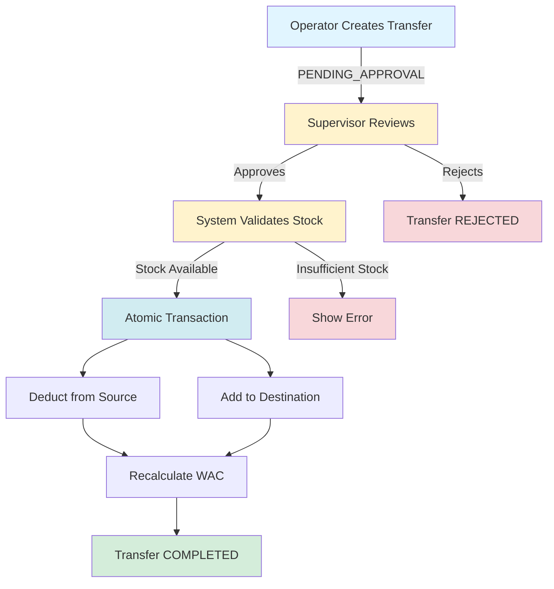
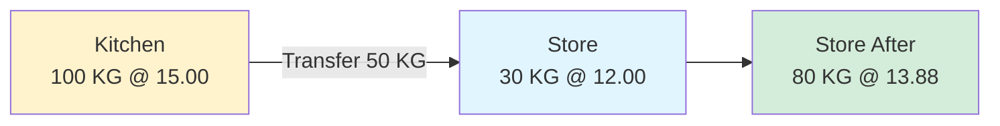
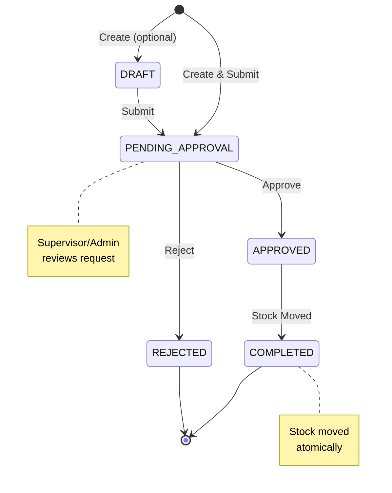
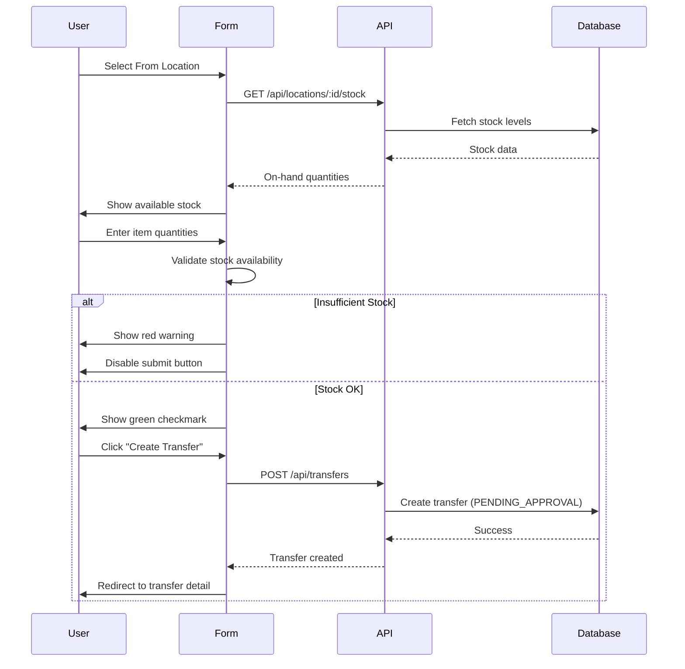
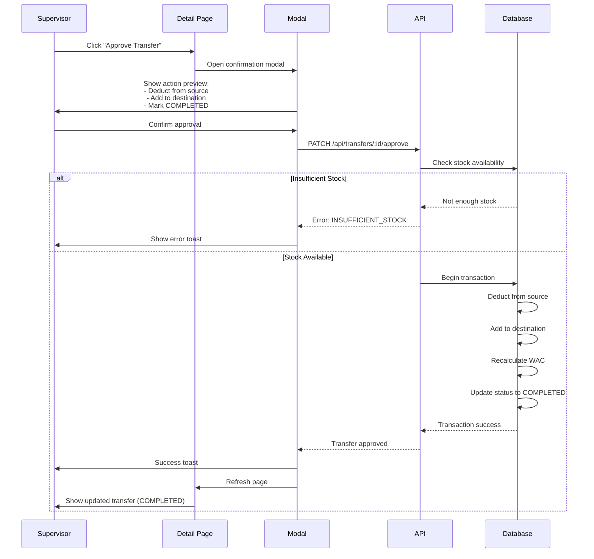
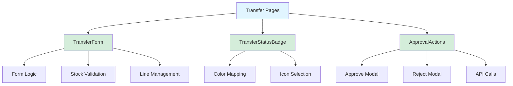
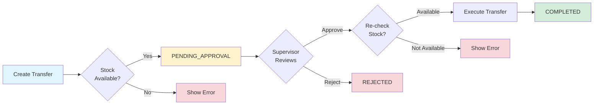

# Phase 2.1: Transfer Management

## Stock Management System - Development Guide

**For Junior Developers**
**Last Updated:** November 17, 2025
**Phase Status:** ✅ Complete

---

## 📖 Quick Navigation

- [Phase 1.1: Project Foundation](phase-1.1-foundation.md)
- [Phase 1.2: Database Setup](phase-1.2-database.md)
- [Phase 1.3: Authentication & Security](phase-1.3-authentication.md)
- [Phase 2.1: Transfer Management](phase-2.1-transfers.md) ← You are here

---

## What is Transfer Management?

### The Problem

In a multi-location business (kitchens, stores, warehouses), items need to move between locations:

- Kitchen runs out of flour → needs transfer from Central Store
- Warehouse has excess vegetables → transfers to Main Kitchen
- Store needs ingredients → requests from Warehouse

**Problems with manual tracking:**

- ❌ No approval process (anyone can move stock)
- ❌ Stock levels incorrect (items moved but not recorded)
- ❌ Cost tracking wrong (each location has different WAC)
- ❌ No audit trail (who moved what, when, why?)

### Our Solution

We built a **Transfer System** that:

- ✅ Requires supervisor/admin approval before moving stock
- ✅ Validates stock availability before transfer
- ✅ Automatically updates stock levels at both locations
- ✅ Maintains accurate WAC (Weighted Average Cost) at each location
- ✅ Creates complete audit trail with timestamps
- ✅ Prevents accidental mistakes with validation checks



---

## Phase 2.1: Transfer Management Overview

### What We Built

In this phase, we created the **complete transfer system** for moving stock between locations with approval workflows and automatic stock updates.

### Key Features

1. **Transfer Creation** - Operators can request stock transfers
2. **Stock Validation** - System checks source location has enough stock
3. **Approval Workflow** - Supervisors/admins approve or reject
4. **Atomic Updates** - Stock moves in one transaction (can't fail halfway)
5. **WAC Maintenance** - Costs transfer correctly between locations

### Tasks Completed

- ✅ 2.1.1: Transfer API Routes
- ✅ 2.1.2: Transfers List Page
- ✅ 2.1.3: Create Transfer UI
- ✅ 2.1.4: Transfer Detail & Approval
- ✅ 2.1.5: Transfer Components

---

## Task 2.1.1: Transfer API Routes

### Simple Explanation

We created **5 API endpoints** that handle all transfer operations on the server side - listing transfers, creating new requests, viewing details, approving, and rejecting.

### What Was Done

#### Endpoint 1: GET /api/transfers

**Purpose:** Get list of all transfers with filters

**What it does:**

- Returns all transfers (or filtered subset)
- Operators see only transfers they can access (their locations)
- Admins/supervisors see all transfers
- Can filter by: from/to location, status, date range

**Example Request:**

```http
GET /api/transfers?fromLocationId=abc123&status=PENDING_APPROVAL
```

**Response:**

```json
{
  "transfers": [
    {
      "id": "xyz789",
      "transfer_no": "TRF-2025-001",
      "from_location": { "name": "Main Kitchen", "code": "MAIN-KIT" },
      "to_location": { "name": "Central Store", "code": "CENTRAL-01" },
      "status": "PENDING_APPROVAL",
      "total_value": 450.5,
      "request_date": "2025-11-17"
    }
  ]
}
```

---

#### Endpoint 2: POST /api/transfers

**Purpose:** Create a new transfer request

**What it does:**

1. Validates all input data (from/to locations, items, quantities)
2. Checks from and to locations are **different** (can't transfer to same location)
3. Generates unique transfer number (TRF-2025-001)
4. **Validates stock availability** at source location
5. Captures current WAC from source location
6. Creates transfer with status = PENDING_APPROVAL
7. Requires supervisor approval before stock moves

**Example Request:**

```json
{
  "from_location_id": "abc123",
  "to_location_id": "def456",
  "request_date": "2025-11-17",
  "notes": "Kitchen needs flour for weekend",
  "lines": [
    {
      "item_id": "item789",
      "quantity": 25.5
    }
  ]
}
```

**Important:** Stock does NOT move yet - transfer just created and waiting for approval.

---

#### Endpoint 3: GET /api/transfers/:id

**Purpose:** Get single transfer details

**What it does:**

- Returns complete transfer information
- Includes all lines with item details
- Shows requester and approver info
- Calculates totals (total quantity, total value)

---

#### Endpoint 4: PATCH /api/transfers/:id/approve

**Purpose:** Approve transfer and move stock

**What it does (in one atomic transaction):**

1. Checks user is supervisor or admin
2. Validates transfer status is PENDING_APPROVAL
3. **Re-checks stock availability** (in case stock was used between request and approval)
4. For each item:
   - Deducts quantity from source location
   - Adds quantity to destination location
   - **Recalculates WAC** at destination if item already exists
5. Updates transfer status to COMPLETED
6. Records approval timestamp and approver

**Critical: Atomic Transaction**

```typescript
// All these operations happen together or none happen
await prisma.$transaction([
  // Deduct from source
  prisma.locationStock.update({
    where: { source location },
    data: { on_hand: { decrement: quantity } }
  }),

  // Add to destination (with WAC recalculation)
  prisma.locationStock.upsert({
    where: { destination location },
    create: { ...newStock },
    update: {
      on_hand: { increment: quantity },
      wac: newWAC  // Recalculated!
    }
  }),

  // Update transfer status
  prisma.transfer.update({
    data: { status: "COMPLETED" }
  })
]);
```

If ANY step fails, ALL steps are cancelled (database rollback).

---

#### Endpoint 5: PATCH /api/transfers/:id/reject

**Purpose:** Reject transfer request

**What it does:**

- Checks user is supervisor or admin
- Updates status to REJECTED
- Adds rejection comment to notes
- Stock does NOT move

---

### Key Technical Concepts

#### 1. Role-Based Access Control

```typescript
// In the API route
const user = event.context.user; // From auth middleware

// Check permission
if (!["ADMIN", "SUPERVISOR"].includes(user.role)) {
  throw createError({
    statusCode: 403,
    message: "Only supervisors and admins can approve transfers",
  });
}
```

**Roles:**

- **Operator:** Can create transfers for their assigned locations
- **Supervisor:** Can approve/reject transfers for all locations
- **Admin:** Can approve/reject transfers for all locations

---

#### 2. Stock Validation

Before creating transfer:

```typescript
// For each transfer line
const locationStock = await prisma.locationStock.findUnique({
  where: {
    location_id_item_id: {
      location_id: fromLocationId,
      item_id: line.item_id,
    },
  },
});

// Check if enough stock
if (!locationStock || locationStock.on_hand < line.quantity) {
  throw createError({
    statusCode: 400,
    statusMessage: "INSUFFICIENT_STOCK",
    data: {
      item_id: line.item_id,
      requested: line.quantity,
      available: locationStock?.on_hand || 0,
    },
  });
}
```

This prevents creating transfers that can't be fulfilled.

---

#### 3. WAC Recalculation on Transfer

**Scenario:** Transfer 50 KG flour from Kitchen to Store

**Source Location (Kitchen):**

- On-hand: 100 KG
- WAC: SAR 15.00

**Destination Location (Store) - Before Transfer:**

- On-hand: 30 KG
- WAC: SAR 12.00

**After Transfer:**

Source (Kitchen):

- On-hand: 100 - 50 = **50 KG**
- WAC: **15.00** (unchanged)

Destination (Store):

- Transferred in: 50 KG @ SAR 15.00 (source WAC)
- New WAC = (30 × 12.00 + 50 × 15.00) / (30 + 50)
- New WAC = (360 + 750) / 80
- New WAC = **SAR 13.88**
- On-hand: 30 + 50 = **80 KG**



**Why this matters:** Each location maintains accurate inventory valuation based on actual cost of stock received.

---

#### 4. Transfer Status Flow



**Note:** In our implementation, we skip DRAFT and go straight to PENDING_APPROVAL.

---

### Files Created

| File                                         | What It Does                    |
| -------------------------------------------- | ------------------------------- |
| `server/api/transfers/index.get.ts`          | List all transfers with filters |
| `server/api/transfers/index.post.ts`         | Create new transfer request     |
| `server/api/transfers/[id].get.ts`           | Get single transfer details     |
| `server/api/transfers/[id]/approve.patch.ts` | Approve and execute transfer    |
| `server/api/transfers/[id]/reject.patch.ts`  | Reject transfer request         |

---

## Task 2.1.2: Transfers List Page

### Simple Explanation

We created a **web page** that displays all transfers in a table with search and filters - like viewing your email inbox with filters for sender, date, etc.

### What Was Done

#### Page Features

**1. Table Display**
Shows all transfers with columns:

- Transfer No (TRF-2025-001)
- Date (DD/MM/YYYY format)
- From Location (Main Kitchen - MAIN-KIT)
- To Location (Central Store - CENTRAL-01)
- Status (badge with colors)
- Total Value (SAR 1,234.56)

**2. Filters**

- **From Location:** Dropdown to filter by source
- **To Location:** Dropdown to filter by destination
- **Status:** Dropdown (All, Pending, Approved, Rejected, Completed)
- **Date Range:** Start date and end date pickers

**3. Active Filter Chips**
When you apply filters, small "chips" appear showing active filters with X buttons to remove them quickly.

**4. Actions**

- **New Transfer** button (for operators/admins)
- **Click row** to view transfer details

**5. Status Badges with Colors**

```mermaid
graph LR
    A[DRAFT] -->|neutral gray| A1[Badge]
    B[PENDING_APPROVAL] -->|navy blue| B1[Badge]
    C[APPROVED] -->|emerald green| C1[Badge]
    D[COMPLETED] -->|emerald green| D1[Badge]
    E[REJECTED] -->|red| E1[Badge]

    style A1 fill:#6b7280
    style B1 fill:#000046
    style C1 fill:#45cf7b
    style D1 fill:#45cf7b
    style E1 fill:#ef4444
```



---

#### Component Structure

```vue
<template>
  <div class="p-4 md:p-6">
    <!-- Page Header -->
    <LayoutPageHeader title="Stock Transfers" icon="arrow-left-right">
      <template #actions>
        <UButton v-if="canRequestTransfer" @click="router.push('/transfers/create')">
          New Transfer
        </UButton>
      </template>
    </LayoutPageHeader>

    <!-- Filters Card -->
    <UCard>
      <!-- Filter dropdowns here -->
      <UButton @click="applyFilters">Apply Filters</UButton>
    </UCard>

    <!-- Transfers Table -->
    <DataTable
      :columns="columns"
      :data="transfers"
      :loading="loading"
      @row-click="navigateToDetail"
    />

    <!-- Pagination -->
    <div class="pagination-controls">
      <!-- Previous/Next buttons -->
    </div>
  </div>
</template>

<script setup lang="ts">
// Fetch transfers from API
const fetchTransfers = async () => {
  const data = await $fetch("/api/transfers", {
    query: {
      fromLocationId: filters.fromLocation,
      toLocationId: filters.toLocation,
      status: filters.status,
      startDate: filters.startDate,
      endDate: filters.endDate,
    },
  });

  transfers.value = data.transfers;
};
</script>
```

---

#### Permission Check

```typescript
// Only show "New Transfer" button if user can create transfers
const canRequestTransfer = computed(() => {
  const authStore = useAuthStore();
  const permissions = usePermissions();

  // User must have permission to post at their default location
  return permissions.canCreateTransfer(authStore.user?.default_location?.id);
});
```

---

### Key UI Concepts

#### 1. Responsive Design

**Desktop (1280px+):**

- Full table with all columns visible
- Filters in single row
- 10 transfers per page

**Tablet (768px - 1279px):**

- Slightly condensed table
- Some columns may wrap
- 10 transfers per page

**Mobile (< 768px):**

- Card view instead of table
- Stacked information
- 5 transfers per page

---

#### 2. Loading States

```vue
<!-- While fetching data -->
<LoadingSpinner v-if="loading" size="lg" />

<!-- If error occurs -->
<ErrorAlert v-else-if="error" :message="error" @retry="fetchTransfers" />

<!-- If no data -->
<EmptyState
  v-else-if="transfers.length === 0"
  title="No Transfers Found"
  description="Try adjusting your filters or create a new transfer"
/>

<!-- Show data -->
<DataTable v-else :data="transfers" />
```

---

#### 3. Filter Chips

When user applies filters, show active filters with remove buttons:

```vue
<div class="flex gap-2 mt-2">
  <UBadge
    v-if="activeFilters.fromLocation"
    color="primary"
    variant="soft"
  >
    From: {{ getLocationName(activeFilters.fromLocation) }}
    <UButton
      icon="x"
      size="xs"
      @click="removeFilter('fromLocation')"
    />
  </UBadge>
</div>
```

---

### Files Created

| File                            | What It Does        |
| ------------------------------- | ------------------- |
| `app/pages/transfers/index.vue` | Transfers list page |

---

## Task 2.1.3: Create Transfer UI

### Simple Explanation

We created a **form page** where operators can request stock transfers from one location to another, with real-time validation checking if source location has enough stock.

### What Was Done

#### Form Structure

The form has **two main sections:**

**Section 1: Transfer Information**

- From Location (dropdown)
- To Location (dropdown - excludes source location)
- Transfer Date (date picker, defaults to today)
- Notes (textarea for explanation)

**Section 2: Transfer Items**

- Dynamic table to add multiple items
- For each line:
  - Item (searchable dropdown)
  - On-Hand (shows source location stock)
  - Quantity (input with 4 decimal precision)
  - WAC (read-only, from source location)
  - Line Value (auto-calculated: quantity × WAC)
- Add Item / Remove Item buttons

---

#### Visual Workflow



---

#### Real-Time Stock Validation

**Example:**

User wants to transfer **100 KG flour** from Kitchen:

- Kitchen has **75 KG** available
- Form shows: ⚠️ **Insufficient stock! Requested: 100, Available: 75**
- Row highlighted in **red**
- Submit button **disabled**

```vue
<template>
  <tr
    :class="{
      'bg-red-50 dark:bg-red-900/20': hasInsufficientStock,
    }"
  >
    <td>{{ item.name }}</td>
    <td>
      {{ formatQuantity(onHand) }}
      <UIcon v-if="hasInsufficientStock" name="alert-triangle" class="text-red-500" />
    </td>
    <td>
      <UInput v-model="quantity" type="number" step="0.0001" />
    </td>
  </tr>
</template>

<script setup lang="ts">
const hasInsufficientStock = computed(() => {
  return quantity.value > onHand.value;
});
</script>
```

---

#### Dynamic Location Filtering

When user selects **From Location**, the **To Location** dropdown automatically excludes it:

```typescript
const toLocationOptions = computed(() => {
  return allLocations.value.filter((loc) => loc.id !== formData.from_location_id);
});
```

**Why?** You can't transfer from Kitchen to Kitchen!

---

#### Form Validation

Before allowing submit:

```typescript
const isFormValid = computed(() => {
  return (
    // Basic fields filled
    formData.from_location_id &&
    formData.to_location_id &&
    formData.request_date &&
    // Locations are different
    formData.from_location_id !== formData.to_location_id &&
    // At least one line
    lines.value.length > 0 &&
    // All lines have item and quantity
    lines.value.every((line) => line.item_id && line.quantity > 0) &&
    // No insufficient stock
    !hasAnyInsufficientStock.value
  );
});
```

---

### Key Concepts

#### 1. Auto-Calculation

When user enters quantity, line value calculates automatically:

```typescript
const lineValue = computed(() => {
  return line.quantity * line.wac_at_transfer;
});
```

**Example:**

- Quantity: 50 KG
- WAC: SAR 15.00
- Line Value: **SAR 750.00** (automatic)

---

#### 2. Location Context

Form uses the **user's default location** as starting point:

```typescript
const authStore = useAuthStore();

onMounted(() => {
  // Pre-fill from location with user's default
  formData.from_location_id = authStore.user?.default_location?.id;
});
```

---

#### 3. Data Fetching on Mount

When page loads, fetch required data:

```typescript
const fetchInitialData = async () => {
  // 1. Get all user locations for dropdowns
  const locationsData = await $fetch("/api/user/locations");
  locations.value = locationsData.locations;

  // 2. Get all items for item selection
  const itemsData = await $fetch("/api/items", {
    query: { limit: 500, is_active: true },
  });
  items.value = itemsData.items;

  // 3. Get stock levels for source location (when selected)
  if (formData.from_location_id) {
    const stockData = await $fetch(`/api/locations/${formData.from_location_id}/stock`);
    stockLevels.value = stockData.stock;
  }
};
```

---

### Files Created

| File                             | What It Does                |
| -------------------------------- | --------------------------- |
| `app/pages/transfers/create.vue` | Transfer creation form page |

---

## Task 2.1.4: Transfer Detail & Approval

### Simple Explanation

We created a **detail page** that shows complete transfer information and allows supervisors/admins to approve or reject the transfer request.

### What Was Done

#### Page Sections

**1. Transfer Header**

- Transfer number (TRF-2025-001)
- Status badge (PENDING_APPROVAL, COMPLETED, etc.)
- Dates (requested, approved, transfer date)
- From/To locations with codes
- Requester information (who created it)
- Approver information (who approved/rejected it)
- Notes

**2. Transfer Lines Table**

- Item code and name
- Unit (KG, EA, LTR, etc.)
- Quantity transferred
- WAC at transfer time
- Line value (quantity × WAC)

**3. Summary**

- Total quantity across all items
- Total value (SAR)

**4. Approval Section** (visible only to supervisors/admins)

- Only shown for PENDING_APPROVAL transfers
- **Approve Transfer** button (emerald green)
- **Reject Transfer** button (red outline)

---

#### Approval Workflow



---

#### Permission Checks

Only supervisors and admins see approval buttons:

```vue
<template>
  <div v-if="canApprove && isPending" class="approval-section">
    <UAlert
      color="warning"
      title="Important"
      description="Approving will immediately move stock between locations. This action cannot be undone."
    />

    <div class="flex gap-3">
      <UButton color="success" @click="openApproveModal">Approve Transfer</UButton>

      <UButton color="error" variant="outline" @click="openRejectModal">Reject Transfer</UButton>
    </div>
  </div>
</template>

<script setup lang="ts">
const permissions = usePermissions();

const canApprove = computed(() => {
  return permissions.canApproveTransfers();
});

const isPending = computed(() => {
  return transfer.value?.status === "PENDING_APPROVAL";
});
</script>
```

---

#### Approve Modal

Shows detailed preview before approval:

```vue
<UModal v-model="showApproveModal">
  <template #header>
    <h3>Approve Transfer?</h3>
  </template>

  <div>
    <p><strong>This will:</strong></p>
    <ul>
      <li>✓ Deduct {{ totalQuantity }} items from {{ fromLocation }}</li>
      <li>✓ Add {{ totalQuantity }} items to {{ toLocation }}</li>
      <li>✓ Recalculate WAC at destination</li>
      <li>✓ Mark transfer as COMPLETED</li>
    </ul>

    <UAlert
      color="warning"
      title="This action cannot be undone"
    />
  </div>

  <template #footer>
    <UButton
      color="success"
      :loading="submitting"
      @click="confirmApprove"
    >
      Yes, Approve Transfer
    </UButton>
    <UButton
      color="gray"
      variant="ghost"
      @click="showApproveModal = false"
    >
      Cancel
    </UButton>
  </template>
</UModal>
```

---

#### Reject Modal

Requires rejection reason:

```vue
<UModal v-model="showRejectModal">
  <template #header>
    <h3>Reject Transfer?</h3>
  </template>

  <div>
    <p>Please provide a reason for rejection:</p>

    <UTextarea
      v-model="rejectReason"
      placeholder="e.g., Items not needed, incorrect quantities..."
      :rows="4"
      required
    />

    <UAlert
      color="info"
      title="Note"
      description="The transfer will be marked as REJECTED and stock will not move."
    />
  </div>

  <template #footer>
    <UButton
      color="error"
      :loading="submitting"
      :disabled="!rejectReason"
      @click="confirmReject"
    >
      Reject Transfer
    </UButton>
    <UButton
      color="gray"
      variant="ghost"
      @click="showRejectModal = false"
    >
      Cancel
    </UButton>
  </template>
</UModal>
```

---

#### Error Handling

Handle specific error scenarios:

```typescript
const handleApprove = async () => {
  try {
    await $fetch(`/api/transfers/${transferId}/approve`, {
      method: "PATCH",
    });

    toast.success("Transfer approved successfully");
    await fetchTransfer(); // Refresh data
  } catch (error: any) {
    // Handle specific error codes
    switch (error.data?.code) {
      case "INSUFFICIENT_STOCK":
        toast.error(
          "Not enough stock at source location. " +
            "Stock may have been used after transfer was created."
        );
        break;

      case "INVALID_STATUS":
        toast.error(
          "This transfer cannot be approved. " + "It may have already been approved or rejected."
        );
        break;

      case "INSUFFICIENT_PERMISSIONS":
        toast.error("You do not have permission to approve this transfer.");
        break;

      default:
        toast.error("Failed to approve transfer. Please try again.");
    }
  }
};
```

---

### Key Concepts

#### 1. Status-Based UI

Different statuses show different information:

**PENDING_APPROVAL:**

- Shows approval buttons
- Shows "Waiting for approval" message
- Highlights status in navy blue

**COMPLETED:**

- Shows completion date
- Shows approver name
- Displays success badge in emerald green
- No action buttons

**REJECTED:**

- Shows rejection reason in notes
- Shows who rejected and when
- Displays error badge in red
- No action buttons

---

#### 2. Read-Only vs Editable

Detail page is **read-only** - you cannot edit a transfer after creation. You can only:

- View details
- Approve (if supervisor/admin and status is PENDING)
- Reject (if supervisor/admin and status is PENDING)

**Why?** Once created, transfer details are locked for audit purposes.

---

#### 3. Breadcrumb Navigation

Help users navigate back:

```vue
<LayoutPageHeader title="Transfer Details" icon="arrow-left-right">
  <template #breadcrumb>
    <UBreadcrumb :items="[
      { label: 'Transfers', to: '/transfers' },
      { label: transfer.transfer_no }
    ]" />
  </template>

  <template #actions>
    <UButton
      icon="arrow-left"
      @click="router.back()"
    >
      Back
    </UButton>
  </template>
</LayoutPageHeader>
```

---

### Files Created

| File                           | What It Does                      |
| ------------------------------ | --------------------------------- |
| `app/pages/transfers/[id].vue` | Transfer detail and approval page |

---

## Task 2.1.5: Transfer Components

### Simple Explanation

We created **reusable components** that can be used anywhere in the app - like building blocks you can combine in different ways.

### What Was Done

We created **3 components:**

1. **TransferForm** - Complete transfer form (for create/edit)
2. **TransferStatusBadge** - Status badge with colors
3. **ApprovalActions** - Approve/Reject buttons with modals

---

#### Component 1: TransferForm

**Purpose:** Reusable transfer form that can be used in create and edit pages.

**Props (Inputs):**

```typescript
interface Props {
  locations: Location[]; // Available locations
  items: Item[]; // Available items
  stockLevels: StockLevel[]; // Current stock at source
  initialData?: Transfer; // For edit mode (optional)
  submitLabel?: string; // Button text (default: "Create Transfer")
}
```

**Events (Outputs):**

```typescript
const emit = defineEmits<{
  submit: [data: TransferFormData]; // When form submitted
  cancel: []; // When user clicks cancel
}>();
```

**Usage Example:**

```vue
<template>
  <TransferForm
    :locations="locations"
    :items="items"
    :stock-levels="stock"
    submit-label="Create Transfer"
    @submit="handleSubmit"
    @cancel="router.back()"
  />
</template>

<script setup lang="ts">
const handleSubmit = async (data: TransferFormData) => {
  // Call API to create transfer
  await $fetch("/api/transfers", {
    method: "POST",
    body: data,
  });

  // Redirect to list page
  router.push("/transfers");
};
</script>
```

**Benefits:**

- Form logic in one place (don't repeat code)
- Can reuse for create and edit pages
- Easy to test
- Consistent validation

---

#### Component 2: TransferStatusBadge

**Purpose:** Display transfer status with correct color and icon.

**Props:**

```typescript
interface Props {
  status: TransferStatus; // DRAFT, PENDING_APPROVAL, etc.
  size?: "sm" | "md" | "lg";
  variant?: "solid" | "soft" | "outline" | "subtle";
}
```

**Usage Example:**

```vue
<template>
  <!-- In a table -->
  <tr>
    <td>{{ transfer.transfer_no }}</td>
    <td>
      <TransferStatusBadge :status="transfer.status" size="sm" />
    </td>
  </tr>
</template>
```

**Status Color Mapping:**

```typescript
const colorMap = {
  DRAFT: "neutral", // Gray
  PENDING_APPROVAL: "primary", // Navy blue
  APPROVED: "success", // Emerald green
  COMPLETED: "success", // Emerald green
  REJECTED: "error", // Red
};
```

**Benefits:**

- Consistent status display everywhere
- Automatic color selection
- Can change colors in one place

---

#### Component 3: ApprovalActions

**Purpose:** Approve/Reject buttons with confirmation modals.

**Props:**

```typescript
interface Props {
  transferId: string;
  transferNo: string;
  fromLocation: string;
  toLocation: string;
  totalQuantity: number;
  totalValue: number;
}
```

**Events:**

```typescript
const emit = defineEmits<{
  approved: []; // When transfer approved successfully
  rejected: []; // When transfer rejected successfully
  error: [error: Error]; // When approval/rejection fails
}>();
```

**Usage Example:**

```vue
<template>
  <div v-if="canApprove && isPending">
    <ApprovalActions
      :transfer-id="transfer.id"
      :transfer-no="transfer.transfer_no"
      :from-location="transfer.from_location.name"
      :to-location="transfer.to_location.name"
      :total-quantity="transfer.total_quantity"
      :total-value="transfer.total_value"
      @approved="onApproved"
      @rejected="onRejected"
      @error="onError"
    />
  </div>
</template>

<script setup lang="ts">
const onApproved = () => {
  toast.success("Transfer approved successfully");
  fetchTransfer(); // Refresh data
};

const onRejected = () => {
  toast.success("Transfer rejected");
  fetchTransfer(); // Refresh data
};

const onError = (error: Error) => {
  toast.error(error.message);
};
</script>
```

**Benefits:**

- Complex approval logic in one component
- Consistent modals and confirmations
- Built-in error handling
- Reusable across different pages

---

### Component Architecture



---

### Key Concepts

#### 1. Props vs Emits

**Props:** Data flowing INTO component (parent → child)

```vue
<MyComponent :title="myTitle" />
<!-- Parent passes data -->
```

**Emits:** Events flowing OUT of component (child → parent)

```vue
<MyComponent @submit="handleSubmit" />
<!-- Parent handles event -->
```

---

#### 2. Reusability

Good component can be used in multiple places:

```vue
<!-- In transfers list page -->
<TransferStatusBadge :status="transfer.status" size="sm" />

<!-- In transfer detail page -->
<TransferStatusBadge :status="transfer.status" size="lg" />

<!-- In dashboard recent activity -->
<TransferStatusBadge :status="transfer.status" size="sm" />
```

Same component, different contexts!

---

#### 3. Separation of Concerns

**Component responsibilities:**

- **UI logic:** How to display data
- **User interaction:** Button clicks, input changes
- **Validation:** Check if data is valid

**Parent page responsibilities:**

- **Data fetching:** Get data from API
- **Business logic:** What to do after approval
- **Navigation:** Where to go next

---

### Files Created

| File                                              | What It Does                     |
| ------------------------------------------------- | -------------------------------- |
| `app/components/transfer/TransferForm.vue`        | Reusable transfer form component |
| `app/components/transfer/TransferStatusBadge.vue` | Status badge component           |
| `app/components/transfer/ApprovalActions.vue`     | Approval buttons with modals     |

---

## Important Files Created in This Phase

### API Routes

| File                                         | Lines | Purpose                      |
| -------------------------------------------- | ----- | ---------------------------- |
| `server/api/transfers/index.get.ts`          | ~150  | List transfers with filters  |
| `server/api/transfers/index.post.ts`         | ~200  | Create new transfer          |
| `server/api/transfers/[id].get.ts`           | ~100  | Get transfer details         |
| `server/api/transfers/[id]/approve.patch.ts` | ~250  | Approve and execute transfer |
| `server/api/transfers/[id]/reject.patch.ts`  | ~80   | Reject transfer              |

### Frontend Pages

| File                             | Lines | Purpose                    |
| -------------------------------- | ----- | -------------------------- |
| `app/pages/transfers/index.vue`  | ~300  | Transfers list page        |
| `app/pages/transfers/create.vue` | ~350  | Create transfer form       |
| `app/pages/transfers/[id].vue`   | ~400  | Transfer detail & approval |

### Components

| File                                              | Lines | Purpose                |
| ------------------------------------------------- | ----- | ---------------------- |
| `app/components/transfer/TransferForm.vue`        | ~400  | Reusable transfer form |
| `app/components/transfer/TransferStatusBadge.vue` | ~60   | Status badge           |
| `app/components/transfer/ApprovalActions.vue`     | ~200  | Approval workflow UI   |

**Total:** ~2,090 lines of code

---

## Key Concepts Learned

### 1. Atomic Transactions

**Simple Explanation:** All operations happen together or none happen.

**Example:** Transfer 50 KG flour from Kitchen to Store

**Without Transaction:**

```typescript
// ❌ BAD: If second operation fails, stock is lost!
await deductFromKitchen(50); // ✓ Success
await addToStore(50); // ✗ Fails - stock disappeared!
```

**With Transaction:**

```typescript
// ✅ GOOD: Both operations or neither
await prisma.$transaction([deductFromKitchen(50), addToStore(50)]);
// If ANY operation fails, ALL are cancelled
```

**Why it matters:** Prevents inventory discrepancies.

---

### 2. Status Workflow Management



**Key Points:**

- Status changes follow strict rules
- Cannot skip steps
- Each status has specific allowed actions

---

### 3. Role-Based Permissions

```typescript
// Different roles, different permissions

// OPERATOR can:
✓ Create transfers (from assigned locations)
✓ View transfers (for assigned locations)
✗ Approve transfers
✗ Reject transfers

// SUPERVISOR can:
✓ Create transfers (from any location)
✓ View all transfers
✓ Approve transfers
✓ Reject transfers
✗ Create new locations (admin only)

// ADMIN can:
✓ Everything supervisors can do
✓ Create/edit/delete locations
✓ Manage users
✓ Override any operation
```

---

### 4. Real-Time Validation

**Two levels of validation:**

**1. Client-Side (Browser):**

- Instant feedback
- Check before sending to server
- Better user experience

```typescript
// In the form component
const hasInsufficientStock = computed(() => {
  return lines.value.some((line) => line.quantity > getStockLevel(line.item_id));
});
```

**2. Server-Side (API):**

- Security
- Final check (data may have changed)
- Required even with client validation

```typescript
// In the API route
const stockLevel = await prisma.locationStock.findUnique({...});
if (quantity > stockLevel.on_hand) {
  throw createError({
    statusCode: 400,
    message: "Insufficient stock"
  });
}
```

**Why both?** Client-side is fast, server-side is secure.

---

### 5. WAC Transfer Logic

**Understanding WAC Transfer:**

When you transfer stock:

1. Source location WAC **does not change** (only quantity decreases)
2. Destination location WAC **recalculates** (weighted average with new stock)

**Example Calculation:**

```
Destination Before Transfer:
- On-hand: 30 KG @ SAR 12.00 per KG
- Total value: 30 × 12 = SAR 360

Transfer In:
- Quantity: 50 KG @ SAR 15.00 per KG
- Transfer value: 50 × 15 = SAR 750

Destination After Transfer:
- Total quantity: 30 + 50 = 80 KG
- Total value: 360 + 750 = SAR 1,110
- New WAC: 1,110 / 80 = SAR 13.88 per KG
```

**Formula:**

```
New WAC = (Current Qty × Current WAC + Transfer Qty × Transfer WAC)
          / (Current Qty + Transfer Qty)
```

---

## Common Terms Explained

| Term                   | Simple Explanation                                             |
| ---------------------- | -------------------------------------------------------------- |
| **Transfer**           | Moving stock from one location to another                      |
| **Atomic Transaction** | All operations complete together or all fail together          |
| **Approval Workflow**  | Process where supervisor must approve before action happens    |
| **Stock Validation**   | Checking if location has enough stock before allowing transfer |
| **WAC Transfer**       | Moving stock with its cost from one location to another        |
| **Status Badge**       | Colored label showing current status (Pending, Approved, etc.) |
| **Modal**              | Popup dialog box requiring user action                         |
| **Confirmation Modal** | Dialog asking user to confirm before dangerous action          |
| **Reusable Component** | Piece of UI that can be used in multiple places                |
| **Props**              | Data passed FROM parent TO child component                     |
| **Emits**              | Events sent FROM child TO parent component                     |

---

## Common Issues and Solutions

### Issue 1: Transfer Created But Stock Not Moving

**Symptoms:**

- Transfer status is COMPLETED
- Source location stock unchanged
- Destination location stock unchanged

**Cause:** Approval endpoint not executed or transaction failed

**Solution:**

```typescript
// Check transaction is working
await prisma.$transaction([
  // All stock operations here
]);

// Add logging
console.log("Before transfer:", sourceStock.on_hand);
await executeTransfer();
console.log("After transfer:", sourceStock.on_hand);
```

---

### Issue 2: Insufficient Stock Error Even When Stock Exists

**Symptoms:**

- Visually showing stock available
- API returns INSUFFICIENT_STOCK

**Causes:**

1. Stock data not refreshed
2. Quantity comparison using wrong units
3. Decimal precision issues

**Solutions:**

```typescript
// 1. Ensure fresh data at approval time
const currentStock = await prisma.locationStock.findUnique({
  where: { location_id_item_id: {...} }
});

// 2. Use proper decimal comparison
import { Decimal } from "@prisma/client/runtime/library";
const available = new Decimal(stockLevel.on_hand);
const requested = new Decimal(line.quantity);
if (requested.greaterThan(available)) {
  throw insufficientStockError();
}
```

---

### Issue 3: WAC Calculation Incorrect

**Symptoms:**

- Destination WAC doesn't match expected value
- Total value incorrect

**Cause:** Using source WAC instead of recalculating

**Solution:**

```typescript
// ✅ CORRECT: Recalculate WAC at destination
const currentQty = destinationStock?.on_hand || 0;
const currentWAC = destinationStock?.wac || 0;
const transferQty = line.quantity;
const transferWAC = line.wac_at_transfer;

const newWAC = calculateWAC({
  currentQuantity: currentQty,
  currentWAC: currentWAC,
  receivedQuantity: transferQty,
  receiptPrice: transferWAC,
});

// Update with new WAC
await prisma.locationStock.update({
  data: {
    on_hand: currentQty + transferQty,
    wac: newWAC, // ← Important!
  },
});
```

---

### Issue 4: Permission Denied for Valid User

**Symptoms:**

- Supervisor user cannot approve transfer
- Error: "INSUFFICIENT_PERMISSIONS"

**Causes:**

1. Role check incorrect
2. User role not properly set in database

**Solution:**

```typescript
// Check user role and status
const user = event.context.user;
console.log("User role:", user.role);
console.log("User is_active:", user.is_active);

// Ensure role check includes both ADMIN and SUPERVISOR
if (!["ADMIN", "SUPERVISOR"].includes(user.role)) {
  throw createError({
    statusCode: 403,
    message: "Only supervisors and admins can approve",
  });
}
```

---

## Testing Checklist

### Manual Testing Steps

**1. Create Transfer**

- [ ] Form loads correctly
- [ ] Location dropdowns populated
- [ ] Cannot select same location for from/to
- [ ] Stock levels display correctly
- [ ] Insufficient stock shows red warning
- [ ] Submit disabled when stock insufficient
- [ ] Success message after creation
- [ ] Redirect to detail page

**2. View Transfer List**

- [ ] All transfers display
- [ ] Filters work correctly
- [ ] Pagination works
- [ ] Status badges show correct colors
- [ ] Row click navigates to detail
- [ ] "New Transfer" button shows for operators

**3. Approve Transfer (Supervisor)**

- [ ] Approval section visible
- [ ] Confirmation modal appears
- [ ] Loading state during approval
- [ ] Stock updates at both locations
- [ ] WAC recalculated correctly
- [ ] Status changes to COMPLETED
- [ ] Approver name recorded
- [ ] Cannot approve again (button hidden)

**4. Reject Transfer (Supervisor)**

- [ ] Reject button visible
- [ ] Reason textarea required
- [ ] Cannot submit without reason
- [ ] Status changes to REJECTED
- [ ] Stock does NOT move
- [ ] Rejection reason saved in notes

**5. Error Scenarios**

- [ ] Insufficient stock error shows detailed message
- [ ] Invalid status error handled
- [ ] Permission denied error displayed
- [ ] Network error shows retry option

---

## What's Next?

After completing Transfer Management (Phase 2.1), the next phases are:

**→ Phase 2.2: NCR Management** (Days 15-17)

- NCR (Non-Conformance Report) list and creation
- Manual NCR entry
- Auto-generated price variance NCRs
- NCR status updates (OPEN → SENT → CREDITED/REJECTED)

**→ Phase 2.3: POB Entry** (Days 17-18)

- POB (Personnel On Board) daily entry
- Calendar view for entering crew and extra counts
- Total mandays calculation for period

**→ Phase 2.4: Reconciliations** (Days 18-20)

- Period-end reconciliation calculations
- Opening stock + Receipts - Issues - Transfers = Closing stock
- Manday cost calculation (consumption / total mandays)
- Adjustments entry (back-charges, credits, condemnations)
- Consolidated reconciliation view for supervisors/admins

---

## Summary

In Phase 2.1, we built a complete inter-location stock transfer system with:

✅ **5 API endpoints** for creating, listing, viewing, approving, and rejecting transfers
✅ **3 pages** (list, create, detail) with responsive design
✅ **3 reusable components** for forms, status badges, and approval actions
✅ **Real-time stock validation** preventing insufficient stock transfers
✅ **Supervisor approval workflow** requiring authorization before stock moves
✅ **Atomic transactions** ensuring data consistency
✅ **WAC recalculation** maintaining accurate inventory valuation
✅ **Comprehensive error handling** with user-friendly messages
✅ **Role-based permissions** restricting access appropriately

The transfer system is now fully functional and ready for production use, supporting the critical business requirement of controlled stock movement between locations with proper authorization and audit trail.

---

**Made with ❤️ for Junior Developers**

---

**Last Updated:** November 17, 2025
**Phase:** 2.1 Transfer Management ✅ Complete
**Next:** Phase 2.2 NCR Management
