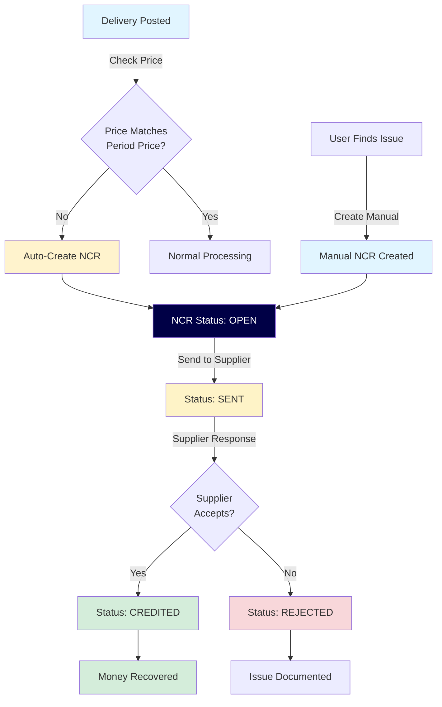
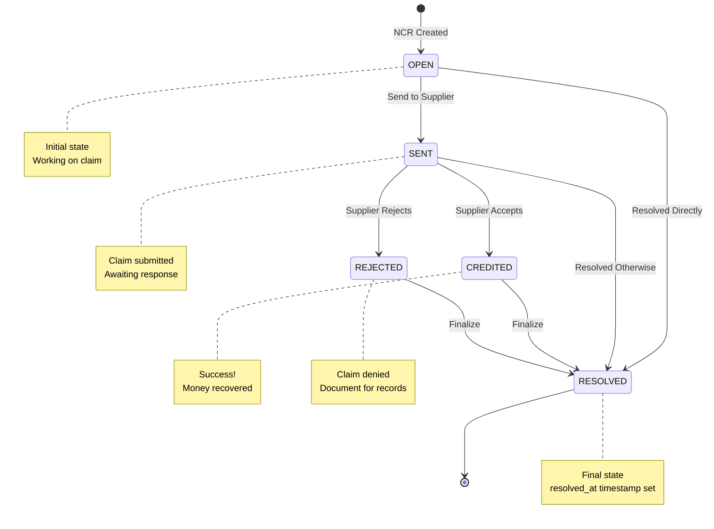
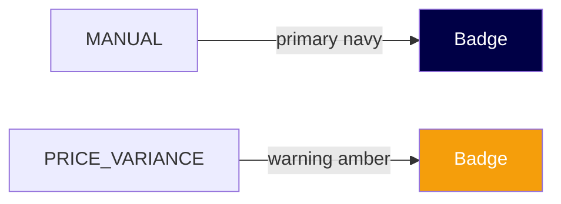
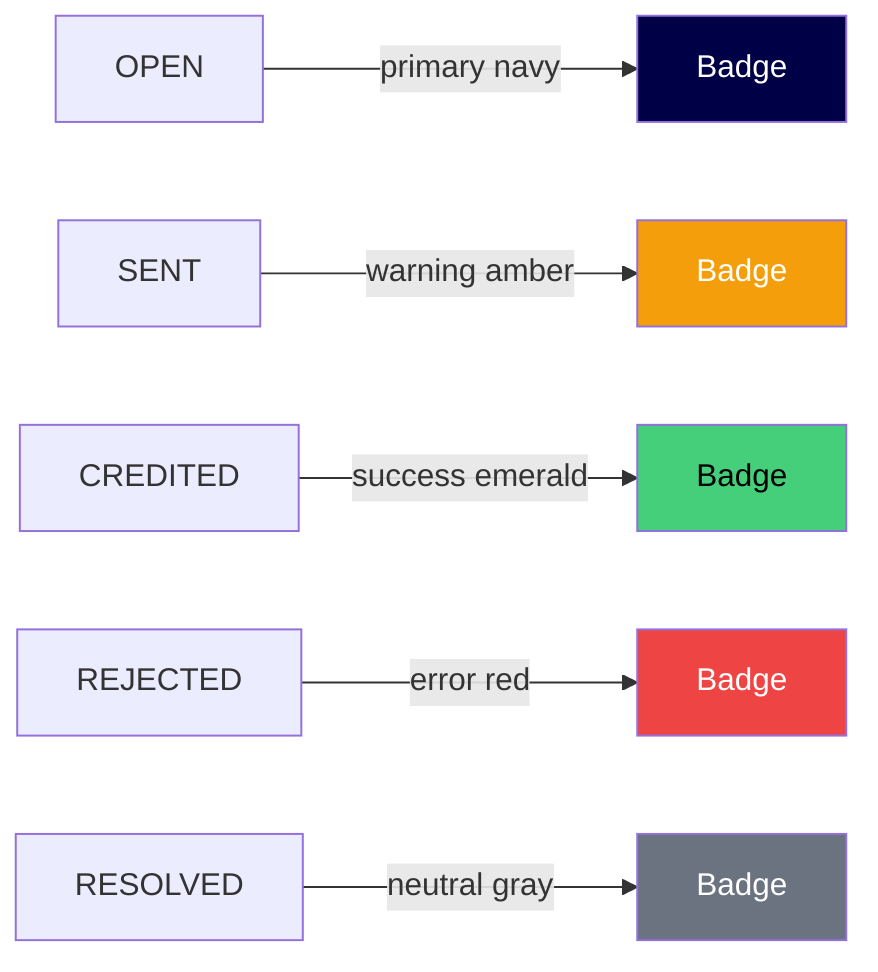
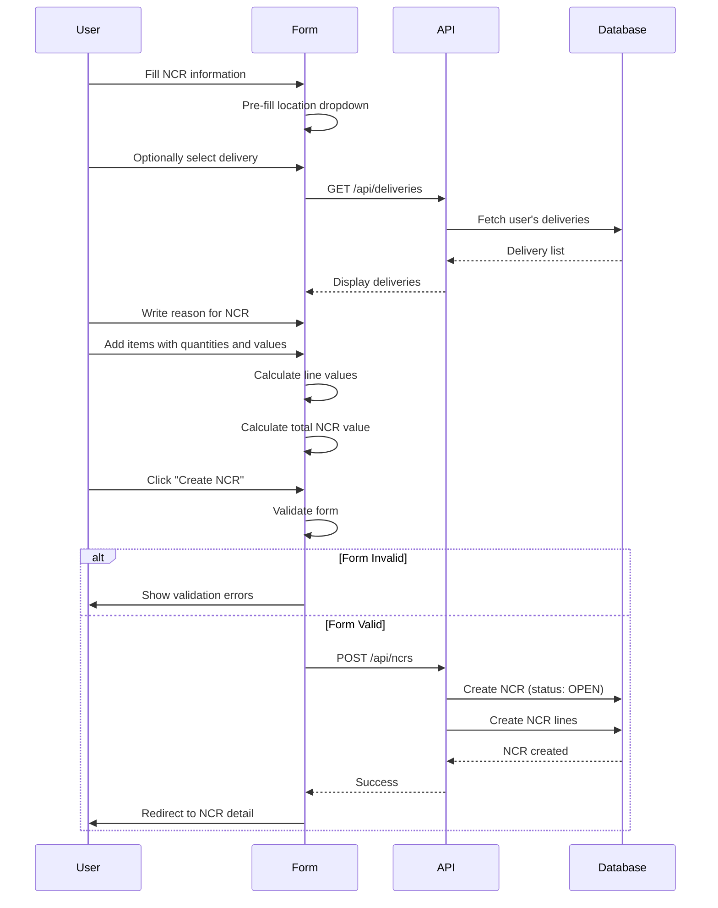
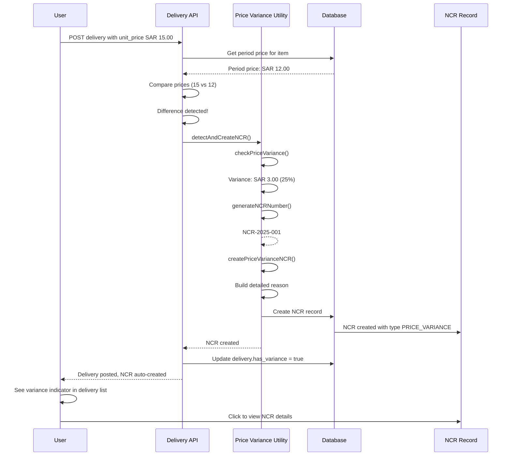
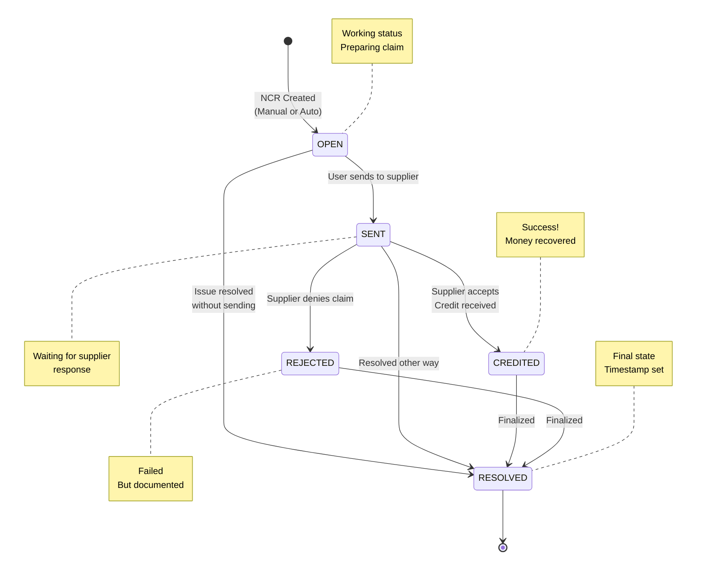
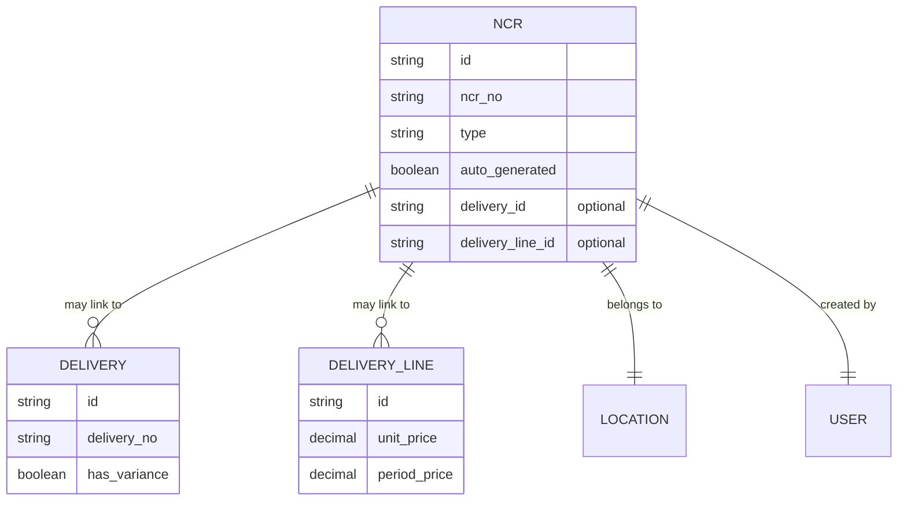

# Phase 2.2: NCR Management
## Stock Management System - Development Guide

**For Junior Developers**
**Last Updated:** November 17, 2025
**Phase Status:** ✅ Complete

---

## 📖 Quick Navigation

- [Phase 1.1: Project Foundation](phase-1.1-foundation.md)
- [Phase 1.2: Database Setup](phase-1.2-database.md)
- [Phase 1.3: Authentication & Security](phase-1.3-authentication.md)
- [Phase 2.1: Transfer Management](phase-2.1-transfers.md)
- [Phase 2.2: NCR Management](phase-2.2-ncr-management.md) ← You are here

---

## What is NCR Management?

### The Problem

In a food service business, suppliers sometimes deliver items that don't match what was ordered:
- Supplier charges **SAR 15.00** per KG but the agreed price was **SAR 12.00**
- Items delivered are damaged or wrong quantity
- Quality issues (expired, spoiled, wrong specifications)
- Wrong items delivered

**Problems with manual tracking:**
- ❌ No record of supplier mistakes (memory-based)
- ❌ Lost money (overcharges not noticed or forgotten)
- ❌ No follow-up process (issues not resolved)
- ❌ No documentation for credit claims
- ❌ Cannot track which suppliers have most issues

### Our Solution

We built an **NCR (Non-Conformance Report) System** that:
- ✅ Automatically detects price differences when deliveries are posted
- ✅ Creates NCR records with complete details
- ✅ Allows manual NCR creation for other issues (damage, quality, etc.)
- ✅ Tracks NCR status from creation to resolution
- ✅ Links NCRs to deliveries for complete audit trail
- ✅ Helps recover money from suppliers through credit tracking



---

## Phase 2.2: NCR Management Overview

### What We Built

In this phase, we created the **complete NCR system** for tracking supplier non-conformances, price variances, and credit claims with automatic detection and manual reporting capabilities.

### Key Features

1. **Automatic Price Variance Detection** - System creates NCR when delivery price differs from period price
2. **Manual NCR Creation** - Users can create NCRs for quality issues, damage, etc.
3. **Status Lifecycle Management** - Track NCR from OPEN → SENT → CREDITED/REJECTED/RESOLVED
4. **Complete Audit Trail** - Link NCRs to deliveries with full price comparison
5. **Value Tracking** - Calculate and track total variance amounts for credit recovery

### Tasks Completed

- ✅ 2.2.1: NCR API Routes
- ✅ 2.2.2: NCRs List Page
- ✅ 2.2.3: Create Manual NCR
- ✅ 2.2.4: NCR Detail Page
- ✅ 2.2.5: Auto-Generated Price Variance NCRs

---

## Task 2.2.1: NCR API Routes

### Simple Explanation

We created **4 API endpoints** that handle all NCR operations on the server side - listing NCRs with filters, creating manual NCRs, viewing NCR details, and updating NCR status.

### What Was Done

#### Endpoint 1: GET /api/ncrs
**Purpose:** Get list of all NCRs with filters

**What it does:**
- Returns all NCRs (or filtered subset)
- Operators see only NCRs for their assigned locations
- Admins/supervisors see all NCRs
- Can filter by: location, type, status, date range, auto-generated flag

**Example Request:**
```http
GET /api/ncrs?locationId=abc123&type=PRICE_VARIANCE&status=OPEN
```

**Response:**
```json
{
  "ncrs": [
    {
      "id": "xyz789",
      "ncr_no": "NCR-2025-001",
      "type": "PRICE_VARIANCE",
      "auto_generated": true,
      "location": { "name": "Main Kitchen", "code": "MAIN-KIT" },
      "status": "OPEN",
      "ncr_value": 150.00,
      "ncr_date": "2025-11-17",
      "reason": "Price variance detected on delivery DEL-2025-045..."
    }
  ]
}
```

**NCR Types:**
- **MANUAL**: Created by users for quality issues, damage, wrong items
- **PRICE_VARIANCE**: Auto-created when delivery price ≠ period price

**NCR Statuses:**
- **OPEN**: NCR created, not yet sent to supplier
- **SENT**: Sent to supplier, waiting for response
- **CREDITED**: Supplier accepted, credit received
- **REJECTED**: Supplier rejected the claim
- **RESOLVED**: Issue resolved (any way)

---

#### Endpoint 2: POST /api/ncrs
**Purpose:** Create a new manual NCR

**What it does:**
1. Validates all input data (location, reason, items, values)
2. Checks user has access to the location
3. Generates unique NCR number (NCR-2025-001)
4. Optional: Links to delivery if provided
5. Creates NCR with status = OPEN
6. Calculates total value from all line items

**Example Request:**
```json
{
  "location_id": "abc123",
  "reason": "Damaged items received - flour bags torn and wet",
  "delivery_id": "del456",
  "lines": [
    {
      "item_id": "item789",
      "quantity": 5.0,
      "unit_value": 15.00
    }
  ]
}
```

**How NCR Number is Generated:**
```typescript
// Format: NCR-YYYY-NNN
// Example: NCR-2025-001, NCR-2025-002, etc.

const year = new Date().getFullYear();
const lastNCR = await prisma.nCR.findFirst({
  where: { ncr_no: { startsWith: `NCR-${year}-` } },
  orderBy: { ncr_no: 'desc' }
});

const nextNumber = lastNCR
  ? parseInt(lastNCR.ncr_no.split('-')[2]) + 1
  : 1;

const ncr_no = `NCR-${year}-${String(nextNumber).padStart(3, '0')}`;
// Result: NCR-2025-001
```

**Important:** Manual NCRs are for issues YOU notice (damage, quality, wrong items). Price variance NCRs are created automatically by the system.

---

#### Endpoint 3: GET /api/ncrs/:id
**Purpose:** Get single NCR details

**What it does:**
- Returns complete NCR information
- For PRICE_VARIANCE type: includes delivery details and price comparison
- Shows creator information
- Shows resolution details if resolved

**Response for Auto-Generated NCR:**
```json
{
  "id": "xyz789",
  "ncr_no": "NCR-2025-001",
  "type": "PRICE_VARIANCE",
  "auto_generated": true,
  "status": "OPEN",
  "ncr_date": "2025-11-17",
  "location": { "name": "Main Kitchen", "code": "MAIN-KIT" },
  "reason": "Price variance detected on delivery DEL-2025-045...",
  "ncr_value": 150.00,

  "delivery": {
    "delivery_no": "DEL-2025-045",
    "delivery_date": "2025-11-17",
    "supplier": { "name": "ABC Foods" }
  },

  "delivery_line": {
    "item": { "name": "All Purpose Flour", "code": "FLR-001" },
    "quantity": 50.0,
    "unit_price": 15.00,     // What supplier charged
    "period_price": 12.00,   // What was agreed
    "price_difference": 3.00 // Overcharge per unit
  },

  "created_by": {
    "name": "John Smith",
    "role": "OPERATOR"
  }
}
```

---

#### Endpoint 4: PATCH /api/ncrs/:id
**Purpose:** Update NCR status and add resolution notes

**What it does:**
- Allows status transitions through NCR lifecycle
- Records resolution notes
- Sets resolved_at timestamp for final statuses
- Validates user has access to location

**Example Request:**
```json
{
  "status": "CREDITED",
  "resolution_notes": "Supplier accepted claim. Credit note CN-2025-123 received for SAR 150.00"
}
```

**Status Lifecycle:**



**Final Statuses (set resolved_at):**
- CREDITED
- REJECTED
- RESOLVED

---

### Key Technical Concepts

#### 1. NCR Types Explained

**MANUAL NCR:**
```typescript
// Created by users when they notice issues
{
  type: "MANUAL",
  auto_generated: false,
  reason: "User-written description",
  // May or may not link to delivery
  delivery_id: null, // or actual delivery ID
  delivery_line_id: null
}
```

**PRICE_VARIANCE NCR:**
```typescript
// Auto-created by system during delivery posting
{
  type: "PRICE_VARIANCE",
  auto_generated: true,
  reason: "Price variance detected on delivery DEL-2025-045...",
  // Always links to specific delivery line
  delivery_id: "del123",
  delivery_line_id: "line456"
}
```

---

#### 2. Role-Based Access Control

```typescript
// In the API route
const user = event.context.user;

// Check if user can access this location
const hasAccess = user.role === "ADMIN" ||
                  user.role === "SUPERVISOR" ||
                  user.locations.some(loc => loc.id === ncr.location_id);

if (!hasAccess) {
  throw createError({
    statusCode: 403,
    statusMessage: "LOCATION_ACCESS_DENIED",
    message: "You cannot access NCRs for this location"
  });
}
```

**Permissions:**
- **Operator:** View/create/update NCRs for assigned locations only
- **Supervisor:** View/create/update NCRs for all locations
- **Admin:** View/create/update NCRs for all locations

---

#### 3. NCR Value Calculation

For **manual NCRs** with multiple items:

```typescript
// Example NCR with 3 items
const lines = [
  { item: "Flour", quantity: 5.0, unit_value: 15.00 },    // Line value: 75.00
  { item: "Sugar", quantity: 10.0, unit_value: 8.00 },    // Line value: 80.00
  { item: "Oil", quantity: 3.0, unit_value: 25.00 }       // Line value: 75.00
];

// Total NCR value
const ncr_value = lines.reduce((sum, line) =>
  sum + (line.quantity * line.unit_value),
  0
);
// Result: 75 + 80 + 75 = SAR 230.00
```

For **price variance NCRs**:

```typescript
// Single item with price difference
const delivery_line = {
  quantity: 50.0,           // KG
  unit_price: 15.00,        // What supplier charged
  period_price: 12.00       // What was agreed
};

const price_difference = 15.00 - 12.00;  // 3.00 SAR overcharge
const ncr_value = 50.0 * 3.00;           // SAR 150.00 total variance
```

---

### Files Created

| File | What It Does |
|------|--------------|
| `server/api/ncrs/index.get.ts` | List all NCRs with filters |
| `server/api/ncrs/index.post.ts` | Create manual NCR |
| `server/api/ncrs/[id].get.ts` | Get single NCR details |
| `server/api/ncrs/[id].patch.ts` | Update NCR status and notes |

---

## Task 2.2.2: NCRs List Page

### Simple Explanation

We created a **web page** that displays all NCRs in a table with filters - like an email inbox showing all quality issues and price problems.

### What Was Done

#### Page Features

**1. Table Display**
Shows all NCRs with columns:
- NCR No (NCR-2025-001) with auto-generated badge
- Type (Manual / Price Variance) with color badges
- Date (DD/MM/YYYY format)
- Location (Main Kitchen - MAIN-KIT)
- Reason (truncated if long)
- Value (SAR 150.00)
- Status (badge with colors)

**2. Filters**
- **Location:** Dropdown to filter by location
- **Type:** All / Manual / Price Variance
- **Status:** All / Open / Sent / Credited / Rejected / Resolved
- **Auto-Generated:** All / Yes / No
- **Date Range:** Start date and end date pickers
- **Apply** and **Clear** buttons

**3. Active Filter Chips**
When filters applied, small chips appear showing active filters with X buttons to remove them.

**4. Actions**
- **New NCR** button (for creating manual NCRs)
- **Click row** to view NCR details

**5. Type Badges with Colors**



**6. Status Badges with Colors**



---

#### Component Structure

```vue
<template>
  <div class="p-4 md:p-6">
    <!-- Page Header -->
    <LayoutPageHeader
      title="Non-Conformance Reports (NCRs)"
      icon="alert-triangle"
    >
      <template #actions>
        <UButton
          v-if="canCreateNCR"
          @click="router.push('/ncrs/create')"
          color="primary"
        >
          New NCR
        </UButton>
      </template>
    </LayoutPageHeader>

    <!-- Filters Card -->
    <UCard class="mb-6">
      <div class="grid grid-cols-1 md:grid-cols-3 gap-4">
        <!-- Location Filter -->
        <UFormGroup label="Location">
          <USelectMenu
            v-model="filters.location"
            :options="locationOptions"
            placeholder="All Locations"
          />
        </UFormGroup>

        <!-- Type Filter -->
        <UFormGroup label="Type">
          <USelectMenu
            v-model="filters.type"
            :options="typeOptions"
            placeholder="All Types"
          />
        </UFormGroup>

        <!-- Status Filter -->
        <UFormGroup label="Status">
          <USelectMenu
            v-model="filters.status"
            :options="statusOptions"
            placeholder="All Statuses"
          />
        </UFormGroup>
      </div>

      <div class="flex gap-2 mt-4">
        <UButton @click="applyFilters" color="primary">
          Apply Filters
        </UButton>
        <UButton @click="clearFilters" variant="outline">
          Clear
        </UButton>
      </div>
    </UCard>

    <!-- NCRs Table -->
    <DataTable
      :columns="columns"
      :data="ncrs"
      :loading="loading"
      @row-click="navigateToDetail"
    />
  </div>
</template>

<script setup lang="ts">
// Fetch NCRs from API
const fetchNCRs = async () => {
  const data = await $fetch("/api/ncrs", {
    query: {
      locationId: filters.location,
      type: filters.type,
      status: filters.status,
      autoGenerated: filters.autoGenerated,
      startDate: filters.startDate,
      endDate: filters.endDate
    }
  });

  ncrs.value = data.ncrs;
};
</script>
```

---

#### Type Badge Component

Shows NCR type with appropriate color:

```vue
<template>
  <UBadge :color="typeColor" variant="soft">
    {{ typeLabel }}
  </UBadge>
</template>

<script setup lang="ts">
const props = defineProps<{
  type: "MANUAL" | "PRICE_VARIANCE";
  autoGenerated: boolean;
}>();

const typeColor = computed(() => {
  return props.type === "MANUAL" ? "primary" : "warning";
});

const typeLabel = computed(() => {
  return props.type === "MANUAL" ? "Manual" : "Price Variance";
});
</script>
```

**Why different colors?**
- **Primary (Navy)** for Manual = User-created, needs attention
- **Warning (Amber)** for Price Variance = System detected, potential money issue

---

### Key UI Concepts

#### 1. Auto-Generated Indicator

Some NCRs are created automatically by the system. We show this clearly:

```vue
<div class="flex items-center gap-2">
  <span>{{ ncr.ncr_no }}</span>
  <UBadge
    v-if="ncr.auto_generated"
    size="xs"
    color="neutral"
    variant="outline"
  >
    Auto
  </UBadge>
</div>
```

**Example Display:**
```
NCR-2025-001 [Auto]
NCR-2025-002
```

---

#### 2. Truncated Reason Display

Reasons can be long. We show preview in table:

```typescript
const truncateReason = (reason: string, maxLength: number = 50) => {
  if (reason.length <= maxLength) return reason;
  return reason.substring(0, maxLength) + "...";
};
```

**Example:**
```
Full reason: "Price variance detected on delivery DEL-2025-045. Item: All Purpose Flour (FLR-001). Period price: SAR 12.00, Delivery price: SAR 15.00, Difference: SAR 3.00 per KG. Total variance: SAR 150.00"

Displayed: "Price variance detected on delivery DEL-2025-045..."
```

User can click to see full details.

---

#### 3. Value Formatting

Always show NCR value in SAR currency:

```typescript
const formatCurrency = (value: number) => {
  return new Intl.NumberFormat("en-SA", {
    style: "currency",
    currency: "SAR",
    minimumFractionDigits: 2,
    maximumFractionDigits: 2
  }).format(value);
};

// Examples:
formatCurrency(150.00);   // "SAR 150.00"
formatCurrency(1234.56);  // "SAR 1,234.56"
```

---

### Files Created

| File | What It Does |
|------|--------------|
| `app/pages/ncrs/index.vue` | NCRs list page |

---

## Task 2.2.3: Create Manual NCR

### Simple Explanation

We created a **form page** where users can manually report quality issues, damage, or other problems with deliveries, with support for multiple item lines and automatic value calculation.

### What Was Done

#### Form Structure

The form has **two main sections:**

**Section 1: NCR Information**
- Location (dropdown, pre-filled with user's current location)
- Related Delivery (optional dropdown - if NCR is about specific delivery)
- Reason (textarea - explain the problem)

**Section 2: NCR Items**
- Dynamic table to add multiple items
- For each line:
  - Item (searchable dropdown)
  - Quantity (input with 4 decimal precision)
  - Unit Value (the value of problem per unit, in SAR)
  - Line Value (auto-calculated: quantity × unit value)
- Add Item / Remove Item buttons

**Total NCR Value:** Auto-calculated sum of all line values

---

#### Visual Workflow



---

#### Intelligent Reason Building

When user adds items to NCR, the system automatically appends item details to the reason:

```typescript
// User writes reason
const userReason = "Damaged flour bags received - torn and wet";

// User adds 2 items
const items = [
  { name: "All Purpose Flour", code: "FLR-001", quantity: 5.0, unit_value: 15.00 },
  { name: "Brown Sugar", code: "SGR-002", quantity: 10.0, unit_value: 8.00 }
];

// System builds detailed reason
const buildDetailedReason = (userReason, items) => {
  let detailed = userReason + "\n\nItems:\n";

  items.forEach((item, index) => {
    const lineValue = item.quantity * item.unit_value;
    detailed += `${index + 1}. ${item.name} (${item.code}): `;
    detailed += `${item.quantity} @ SAR ${item.unit_value} = SAR ${lineValue.toFixed(2)}\n`;
  });

  const totalValue = items.reduce((sum, item) =>
    sum + (item.quantity * item.unit_value), 0
  );
  detailed += `\nTotal NCR Value: SAR ${totalValue.toFixed(2)}`;

  return detailed;
};

// Final reason saved to database:
/*
Damaged flour bags received - torn and wet

Items:
1. All Purpose Flour (FLR-001): 5 @ SAR 15.00 = SAR 75.00
2. Brown Sugar (SGR-002): 10 @ SAR 8.00 = SAR 80.00

Total NCR Value: SAR 155.00
*/
```

---

#### Form Validation

Before allowing submit:

```typescript
const isFormValid = computed(() => {
  return (
    // Location must be selected
    formData.location_id &&

    // Reason must be provided
    formData.reason.trim().length > 0 &&

    // At least one item line
    lines.value.length > 0 &&

    // All lines must have valid data
    lines.value.every(line =>
      line.item_id &&           // Item selected
      line.quantity > 0 &&       // Positive quantity
      line.unit_value > 0        // Positive value
    ) &&

    // Total value must be positive
    totalValue.value > 0
  );
});
```

---

#### Real-Time Calculations

**Line Value:**
```typescript
const lineValue = computed(() => {
  return line.quantity * line.unit_value;
});
```

**Example:**
- Quantity: 5 KG
- Unit Value: SAR 15.00 (value of damage per KG)
- Line Value: **SAR 75.00** (automatic)

**Total NCR Value:**
```typescript
const totalValue = computed(() => {
  return lines.value.reduce((sum, line) => {
    return sum + (line.quantity * line.unit_value);
  }, 0);
});
```

---

### Key Concepts

#### 1. Optional Delivery Link

User can optionally link NCR to a delivery:

```vue
<UFormGroup label="Related Delivery (Optional)">
  <USelectMenu
    v-model="formData.delivery_id"
    :options="deliveryOptions"
    placeholder="Select delivery if applicable"
    value-attribute="id"
    option-attribute="label"
  />
</UFormGroup>

<script setup>
// Delivery options show supplier and date
const deliveryOptions = computed(() => {
  return deliveries.value.map(d => ({
    id: d.id,
    label: `${d.delivery_no} - ${d.supplier.name} (${formatDate(d.delivery_date)})`
  }));
});
</script>
```

**When to link delivery:**
- NCR is about items in that specific delivery
- Makes it easier to track which supplier had issues
- Provides context for the NCR

**When NOT to link delivery:**
- General quality issue not tied to specific delivery
- Stock discrepancy found during counting
- Damage discovered later

---

#### 2. Dynamic Item Lines

Users can add multiple items to one NCR:

```vue
<template>
  <div>
    <!-- Items table -->
    <table>
      <tr v-for="(line, index) in lines" :key="index">
        <td>
          <USelectMenu v-model="line.item_id" :options="items" />
        </td>
        <td>
          <UInput v-model="line.quantity" type="number" step="0.0001" />
        </td>
        <td>
          <UInput v-model="line.unit_value" type="number" step="0.01" />
        </td>
        <td>
          {{ formatCurrency(line.quantity * line.unit_value) }}
        </td>
        <td>
          <UButton
            icon="trash"
            color="error"
            size="sm"
            @click="removeLine(index)"
          />
        </td>
      </tr>
    </table>

    <!-- Add Item button -->
    <UButton
      icon="plus"
      @click="addLine"
      variant="outline"
    >
      Add Item
    </UButton>

    <!-- Total -->
    <div class="text-right">
      <strong>Total NCR Value:</strong>
      {{ formatCurrency(totalValue) }}
    </div>
  </div>
</template>

<script setup>
const addLine = () => {
  lines.value.push({
    item_id: "",
    quantity: 0,
    unit_value: 0
  });
};

const removeLine = (index: number) => {
  if (lines.value.length > 1) {
    lines.value.splice(index, 1);
  } else {
    toast.error("NCR must have at least one item");
  }
};
</script>
```

---

#### 3. Submit Handler

```typescript
const handleSubmit = async () => {
  try {
    // Prepare data
    const ncrData = {
      location_id: formData.location_id,
      delivery_id: formData.delivery_id || null,
      reason: buildDetailedReason(formData.reason, lines.value),
      lines: lines.value.map(line => ({
        item_id: line.item_id,
        quantity: line.quantity,
        unit_value: line.unit_value
      }))
    };

    // Call API
    const response = await $fetch("/api/ncrs", {
      method: "POST",
      body: ncrData
    });

    // Success
    toast.success("NCR created successfully");
    router.push(`/ncrs/${response.ncr.id}`);

  } catch (error: any) {
    // Handle specific errors
    switch (error.data?.code) {
      case "LOCATION_NOT_FOUND":
        toast.error("Selected location not found");
        break;
      case "LOCATION_ACCESS_DENIED":
        toast.error("You don't have access to this location");
        break;
      case "VALIDATION_ERROR":
        toast.error("Please check all fields and try again");
        break;
      default:
        toast.error("Failed to create NCR. Please try again.");
    }
  }
};
```

---

### Common Use Cases

#### Use Case 1: Damaged Goods

**Scenario:** Received 5 bags of flour, all torn and wet

```
Location: Main Kitchen
Related Delivery: DEL-2025-045 (optional)
Reason: "Flour bags damaged during delivery - all torn and wet, unusable"

Items:
- All Purpose Flour (FLR-001)
  - Quantity: 5 bags (25 KG)
  - Unit Value: SAR 15.00 per bag
  - Line Value: SAR 75.00

Total NCR Value: SAR 75.00
```

---

#### Use Case 2: Quality Issue with Multiple Items

**Scenario:** Multiple items expired or near expiry

```
Location: Central Store
Reason: "Items received with short expiry dates - less than 7 days"

Items:
1. Fresh Milk (MLK-001)
   - Quantity: 20 liters
   - Unit Value: SAR 5.00
   - Line Value: SAR 100.00

2. Yogurt (YGT-002)
   - Quantity: 30 cups
   - Unit Value: SAR 2.00
   - Line Value: SAR 60.00

Total NCR Value: SAR 160.00
```

---

### Files Created

| File | What It Does |
|------|--------------|
| `app/pages/ncrs/create.vue` | Manual NCR creation form |

---

## Task 2.2.4: NCR Detail Page

### Simple Explanation

We created a **detail page** that shows complete NCR information and allows supervisors/admins to update the NCR status through its lifecycle from creation to resolution.

### What Was Done

#### Page Sections

**1. NCR Header**
- NCR number (NCR-2025-001)
- Type badge (Manual / Price Variance)
- Auto-generated indicator (if auto-created)
- Status badge with color
- NCR date
- Location information
- Creator details (who created, when)
- Resolved date (if resolved)
- NCR value (prominently displayed)

**2. Related Delivery Card** (for price variance NCRs only)
Shows delivery context:
- Delivery number and date
- Supplier name
- Item details with price comparison table:
  - Item name and code
  - Quantity
  - Period Price (expected) - in emerald green
  - Delivery Price (actual) - in red if higher
  - Price Difference (SAR per unit)
  - Total Variance Value

**3. Reason Card**
Full NCR reason text with proper formatting

**4. Resolution Notes Card** (if status updated)
Notes added when status changed

**5. Status Update Section** (supervisors/admins only)
- Only shown for users with permission
- Update Status button
- Modal with:
  - Status dropdown (lifecycle options)
  - Resolution notes textarea
  - Save button

---

#### Price Variance Display

For auto-generated price variance NCRs, we show detailed comparison:

```vue
<template>
  <UCard v-if="ncr.type === 'PRICE_VARIANCE' && ncr.delivery_line">
    <template #header>
      <h3>Price Variance Details</h3>
    </template>

    <!-- Delivery Info -->
    <div class="mb-4">
      <p><strong>Delivery:</strong> {{ ncr.delivery.delivery_no }}</p>
      <p><strong>Date:</strong> {{ formatDate(ncr.delivery.delivery_date) }}</p>
      <p><strong>Supplier:</strong> {{ ncr.delivery.supplier.name }}</p>
    </div>

    <!-- Price Comparison Table -->
    <table class="w-full">
      <thead>
        <tr>
          <th>Item</th>
          <th>Quantity</th>
          <th>Expected Price</th>
          <th>Actual Price</th>
          <th>Difference</th>
          <th>Total Variance</th>
        </tr>
      </thead>
      <tbody>
        <tr>
          <td>
            {{ ncr.delivery_line.item.name }}
            <span class="text-sm text-gray-500">
              ({{ ncr.delivery_line.item.code }})
            </span>
          </td>
          <td>{{ formatQuantity(ncr.delivery_line.quantity) }}</td>
          <td>
            <span class="text-emerald-600 font-semibold">
              {{ formatCurrency(ncr.delivery_line.period_price) }}
            </span>
          </td>
          <td>
            <span class="text-red-600 font-semibold">
              {{ formatCurrency(ncr.delivery_line.unit_price) }}
            </span>
          </td>
          <td>
            {{ formatCurrency(priceDifference) }}
            <UBadge :color="priceDifferenceColor" size="xs">
              {{ priceDifferenceLabel }}
            </UBadge>
          </td>
          <td>
            <strong>{{ formatCurrency(ncr.ncr_value) }}</strong>
          </td>
        </tr>
      </tbody>
    </table>
  </UCard>
</template>

<script setup lang="ts">
const priceDifference = computed(() => {
  const line = ncr.value.delivery_line;
  return Math.abs(line.unit_price - line.period_price);
});

const priceDifferenceLabel = computed(() => {
  const line = ncr.value.delivery_line;
  if (line.unit_price > line.period_price) {
    return "HIGHER";
  } else {
    return "LOWER";
  }
});

const priceDifferenceColor = computed(() => {
  return priceDifferenceLabel.value === "HIGHER" ? "error" : "success";
});
</script>
```

**Example Display:**

```
┌─────────────────────────────────────────────────────────────────┐
│ Price Variance Details                                          │
├─────────────────────────────────────────────────────────────────┤
│ Delivery: DEL-2025-045                                          │
│ Date: 17/11/2025                                                │
│ Supplier: ABC Foods                                             │
│                                                                 │
│ ┌───────────────────────────────────────────────────────────┐   │
│ │ Item: All Purpose Flour (FLR-001)                         │   │
│ │ Quantity: 50.00 KG                                        │   │
│ │ Expected Price: SAR 12.00 (green)                         │   │
│ │ Actual Price: SAR 15.00 (red)                             │   │
│ │ Difference: SAR 3.00 [HIGHER]                             │   │
│ │ Total Variance: SAR 150.00                                │   │
│ └───────────────────────────────────────────────────────────┘   │
└─────────────────────────────────────────────────────────────────┘
```

---

#### Status Update Modal

Allows authorized users to update NCR status:

```vue
<UModal v-model="showUpdateModal">
  <template #header>
    <h3>Update NCR Status</h3>
  </template>

  <div class="space-y-4">
    <!-- Status Dropdown -->
    <UFormGroup label="Status" required>
      <USelectMenu
        v-model="updateData.status"
        :options="statusOptions"
        placeholder="Select new status"
      />
    </UFormGroup>

    <!-- Resolution Notes -->
    <UFormGroup
      label="Resolution Notes"
      help="Explain the resolution or outcome"
    >
      <UTextarea
        v-model="updateData.resolution_notes"
        :rows="4"
        placeholder="e.g., Supplier accepted claim. Credit note CN-2025-123 received for SAR 150.00"
      />
    </UFormGroup>

    <!-- Info Alert -->
    <UAlert
      color="info"
      title="Note"
      description="For final statuses (CREDITED, REJECTED, RESOLVED), the system will automatically set the resolved_at timestamp."
    />
  </div>

  <template #footer>
    <div class="flex gap-3">
      <UButton
        color="primary"
        :loading="submitting"
        :disabled="!updateData.status"
        @click="confirmUpdate"
      >
        Update Status
      </UButton>
      <UButton
        color="gray"
        variant="ghost"
        @click="showUpdateModal = false"
      >
        Cancel
      </UButton>
    </div>
  </template>
</UModal>
```

---

#### Status Options Based on Current Status

Not all status transitions are allowed. We show only valid next statuses:

```typescript
const statusOptions = computed(() => {
  const currentStatus = ncr.value.status;

  // Available transitions based on current status
  const transitions = {
    OPEN: ["SENT", "RESOLVED"],
    SENT: ["CREDITED", "REJECTED", "RESOLVED"],
    CREDITED: ["RESOLVED"],
    REJECTED: ["RESOLVED"],
    RESOLVED: [] // Final state, no transitions
  };

  const allowedStatuses = transitions[currentStatus] || [];

  return allowedStatuses.map(status => ({
    value: status,
    label: statusLabels[status]
  }));
});

const statusLabels = {
  OPEN: "Open",
  SENT: "Sent to Supplier",
  CREDITED: "Credited",
  REJECTED: "Rejected",
  RESOLVED: "Resolved"
};
```

**Example:**
If NCR status is OPEN, dropdown shows:
- Sent to Supplier
- Resolved

If NCR status is SENT, dropdown shows:
- Credited
- Rejected
- Resolved

If NCR status is RESOLVED, no dropdown shown (final state).

---

#### Update Handler

```typescript
const handleUpdateStatus = async () => {
  try {
    await $fetch(`/api/ncrs/${ncrId}`, {
      method: "PATCH",
      body: {
        status: updateData.status,
        resolution_notes: updateData.resolution_notes || null
      }
    });

    toast.success("NCR status updated successfully");
    showUpdateModal.value = false;

    // Refresh NCR data to show new status
    await fetchNCR();

  } catch (error: any) {
    switch (error.data?.code) {
      case "NCR_NOT_FOUND":
        toast.error("NCR not found");
        break;
      case "LOCATION_ACCESS_DENIED":
        toast.error("You don't have access to this NCR");
        break;
      case "INSUFFICIENT_PERMISSIONS":
        toast.error("You don't have permission to update this NCR");
        break;
      default:
        toast.error("Failed to update NCR status");
    }
  }
};
```

---

### Key Concepts

#### 1. Status-Based UI

Different parts of UI shown based on NCR status:

**All Statuses:**
- NCR header with details
- Reason card
- Related delivery (if price variance)

**OPEN, SENT:**
- Update Status button (if has permission)
- Can transition to next states

**CREDITED, REJECTED, RESOLVED:**
- Resolution notes displayed
- Resolved date shown
- No status update button (final states)

---

#### 2. Permission Checks

Only users with proper permissions can update NCR status:

```typescript
const canUpdateStatus = computed(() => {
  const permissions = usePermissions();
  const locationId = ncr.value?.location_id;

  return permissions.canUpdateNCRStatus(locationId);
});
```

```typescript
// In usePermissions composable
export const usePermissions = () => {
  const authStore = useAuthStore();

  const canUpdateNCRStatus = (locationId: string) => {
    const user = authStore.user;
    if (!user) return false;

    // Admins and supervisors can update any NCR
    if (user.role === "ADMIN" || user.role === "SUPERVISOR") {
      return true;
    }

    // Operators can update NCRs for their assigned locations
    return user.locations?.some(loc => loc.id === locationId) || false;
  };

  return { canUpdateStatus };
};
```

---

#### 3. Resolved Timestamp

When NCR reaches final status, system automatically sets `resolved_at`:

```typescript
// In API endpoint
const isFinalStatus = ["CREDITED", "REJECTED", "RESOLVED"].includes(status);

await prisma.nCR.update({
  where: { id: ncrId },
  data: {
    status,
    resolution_notes,
    resolved_at: isFinalStatus ? new Date() : undefined
  }
});
```

**Display:**
```vue
<div v-if="ncr.resolved_at">
  <p><strong>Resolved:</strong> {{ formatDateTime(ncr.resolved_at) }}</p>
</div>
```

---

### Files Created

| File | What It Does |
|------|--------------|
| `app/pages/ncrs/[id].vue` | NCR detail and status update page |

---

## Task 2.2.5: Auto-Generated Price Variance NCRs

### Simple Explanation

We verified that the **automatic NCR creation system** works correctly - when a delivery is posted with prices different from the period-locked prices, the system automatically creates an NCR to track the price difference.

### What Was Done

#### 1. Verified Delivery API Integration

The delivery posting API already includes price variance NCR creation:

**Location:** `server/api/locations/[locationId]/deliveries/index.post.ts`

```typescript
// Lines 352-372: Auto-NCR creation logic

for (const line of lines) {
  // Get period price for this item
  const periodPrice = await prisma.itemPrice.findUnique({
    where: {
      item_id_period_id: {
        item_id: line.item_id,
        period_id: currentPeriod.id
      }
    }
  });

  // Check if delivery price differs from period price
  if (periodPrice && line.unit_price !== periodPrice.price) {
    // Auto-create NCR for price variance
    await detectAndCreateNCR({
      deliveryId: delivery.id,
      deliveryLineId: deliveryLine.id,
      itemId: line.item_id,
      quantity: line.quantity,
      deliveryPrice: line.unit_price,
      periodPrice: periodPrice.price,
      locationId: locationId,
      createdBy: user.id
    });

    // Mark delivery as having variance
    hasVariance = true;
  }
}

// Update delivery header
await prisma.delivery.update({
  where: { id: delivery.id },
  data: { has_variance: hasVariance }
});
```

---

#### 2. Price Variance Utility Functions

**Location:** `server/utils/priceVariance.ts`

**Function 1: Check Price Variance**
```typescript
export const checkPriceVariance = (
  deliveryPrice: number,
  periodPrice: number,
  threshold: number = 0.01 // 1% tolerance
) => {
  const difference = Math.abs(deliveryPrice - periodPrice);
  const percentageVariance = (difference / periodPrice) * 100;

  return {
    hasVariance: difference > threshold,
    varianceAmount: deliveryPrice - periodPrice,
    variancePercentage: percentageVariance,
    isOvercharge: deliveryPrice > periodPrice
  };
};
```

**Example:**
```typescript
// Period price: SAR 12.00
// Delivery price: SAR 15.00

const result = checkPriceVariance(15.00, 12.00);

// Result:
{
  hasVariance: true,
  varianceAmount: 3.00,          // SAR 3.00 difference
  variancePercentage: 25.00,     // 25% overcharge
  isOvercharge: true             // Delivery price higher
}
```

---

**Function 2: Generate NCR Number**
```typescript
export const generateNCRNumber = async () => {
  const year = new Date().getFullYear();

  // Find last NCR for current year
  const lastNCR = await prisma.nCR.findFirst({
    where: {
      ncr_no: { startsWith: `NCR-${year}-` }
    },
    orderBy: { ncr_no: 'desc' }
  });

  // Calculate next number
  const nextNumber = lastNCR
    ? parseInt(lastNCR.ncr_no.split('-')[2]) + 1
    : 1;

  // Format: NCR-YYYY-NNN
  return `NCR-${year}-${String(nextNumber).padStart(3, '0')}`;
};
```

**Example Sequence:**
```
NCR-2025-001
NCR-2025-002
NCR-2025-003
...
NCR-2025-999
NCR-2026-001  // New year, reset counter
```

---

**Function 3: Create Price Variance NCR**
```typescript
export const createPriceVarianceNCR = async (params: {
  deliveryId: string;
  deliveryLineId: string;
  itemId: string;
  quantity: number;
  deliveryPrice: number;
  periodPrice: number;
  locationId: string;
  createdBy: string;
}) => {
  const {
    deliveryId,
    deliveryLineId,
    itemId,
    quantity,
    deliveryPrice,
    periodPrice,
    locationId,
    createdBy
  } = params;

  // Get item details
  const item = await prisma.item.findUnique({
    where: { id: itemId }
  });

  // Get delivery details
  const delivery = await prisma.delivery.findUnique({
    where: { id: deliveryId },
    include: { supplier: true }
  });

  // Calculate variance
  const variance = checkPriceVariance(deliveryPrice, periodPrice);
  const totalVariance = variance.varianceAmount * quantity;

  // Build NCR reason with details
  const reason = `
Price variance detected on delivery ${delivery.delivery_no}.

Item: ${item.name} (${item.code})
Quantity: ${quantity} ${item.unit}
Period Price (Expected): SAR ${periodPrice.toFixed(2)}
Delivery Price (Actual): SAR ${deliveryPrice.toFixed(2)}
Difference: SAR ${variance.varianceAmount.toFixed(2)} per ${item.unit} (${variance.isOvercharge ? 'HIGHER' : 'LOWER'})

Total Variance: SAR ${Math.abs(totalVariance).toFixed(2)}
Supplier: ${delivery.supplier.name}
Delivery Date: ${delivery.delivery_date}
  `.trim();

  // Generate NCR number
  const ncr_no = await generateNCRNumber();

  // Create NCR
  const ncr = await prisma.nCR.create({
    data: {
      ncr_no,
      location_id: locationId,
      type: "PRICE_VARIANCE",
      auto_generated: true,
      ncr_date: new Date(),
      ncr_value: Math.abs(totalVariance),
      reason,
      status: "OPEN",
      delivery_id: deliveryId,
      delivery_line_id: deliveryLineId,
      created_by: createdBy
    }
  });

  return ncr;
};
```

---

**Function 4: Detect and Create NCR** (Main Function)
```typescript
export const detectAndCreateNCR = async (params) => {
  // Check if variance exists
  const variance = checkPriceVariance(
    params.deliveryPrice,
    params.periodPrice
  );

  if (!variance.hasVariance) {
    return null; // No variance, no NCR needed
  }

  // Create NCR
  const ncr = await createPriceVarianceNCR(params);

  return ncr;
};
```

---

#### 3. Database Seed Updates

Updated seed script to create period prices for testing:

**Location:** `prisma/seed.ts`

```typescript
// Create period prices for all items
const periodPrices = await Promise.all(
  items.map((item) =>
    prisma.itemPrice.create({
      data: {
        item_id: item.id,
        period_id: currentPeriod.id,
        price: 10.0, // SAR 10.00 for all items in testing
        set_by: adminUser.id
      }
    })
  )
);

console.log(`✓ Created ${periodPrices.length} period prices`);
```

**Why this matters:**
- With period prices set to SAR 10.00 for all items
- If we post delivery with price SAR 15.00
- System will detect variance and auto-create NCR

---

#### 4. Complete Flow Example

**Scenario:** Post delivery with price variance



---

### Testing the Auto-NCR System

**Step 1: Check Period Prices**
```sql
-- View period prices
SELECT
  i.name,
  i.code,
  ip.price AS period_price
FROM item_prices ip
JOIN items i ON i.id = ip.item_id
WHERE ip.period_id = 'current-period-id';
```

**Step 2: Post Delivery with Different Price**
```typescript
// In UI: Create delivery
{
  supplier_id: "supplier123",
  delivery_date: "2025-11-17",
  lines: [
    {
      item_id: "flour001",
      quantity: 50.0,
      unit_price: 15.00  // Period price is 12.00 - variance!
    }
  ]
}
```

**Step 3: Verify NCR Created**
```sql
-- Check NCRs table
SELECT
  ncr_no,
  type,
  auto_generated,
  ncr_value,
  status,
  reason
FROM ncrs
WHERE type = 'PRICE_VARIANCE'
ORDER BY ncr_date DESC;
```

**Expected Result:**
```
NCR-2025-001 | PRICE_VARIANCE | true | 150.00 | OPEN | Price variance detected...
```

**Step 4: View in UI**
- Go to deliveries list
- See variance indicator (⚠️) on delivery row
- Click delivery to view details
- See "Price Variance Detected" section
- Click "View NCR" to see full NCR details

---

### Files Verified

| File | What It Contains |
|------|------------------|
| `server/api/locations/[locationId]/deliveries/index.post.ts` | Auto-NCR creation logic (lines 352-372) |
| `server/utils/priceVariance.ts` | All price variance utility functions |
| `prisma/seed.ts` | Period prices creation for testing |

---

## Important Files Created in This Phase

### API Routes

| File | Lines | Purpose |
|------|-------|---------|
| `server/api/ncrs/index.get.ts` | ~180 | List NCRs with advanced filters |
| `server/api/ncrs/index.post.ts` | ~150 | Create manual NCR |
| `server/api/ncrs/[id].get.ts` | ~120 | Get NCR details with delivery context |
| `server/api/ncrs/[id].patch.ts` | ~100 | Update NCR status and resolution |

### Frontend Pages

| File | Lines | Purpose |
|------|-------|---------|
| `app/pages/ncrs/index.vue` | ~350 | NCRs list with filters |
| `app/pages/ncrs/create.vue` | ~400 | Manual NCR creation form |
| `app/pages/ncrs/[id].vue` | ~450 | NCR detail and status management |

### Utilities

| File | Lines | Purpose |
|------|-------|---------|
| `server/utils/priceVariance.ts` | ~200 | Price variance detection and NCR creation |

**Total:** ~1,950 lines of code

---

## Key Concepts Learned

### 1. Automatic vs Manual Data Creation

**Simple Explanation:** Some records are created by the system automatically, others are created by users manually.

**Automatic (System-Created):**
```typescript
// Price variance NCRs
{
  type: "PRICE_VARIANCE",
  auto_generated: true,
  // Created when system detects price difference
  // User doesn't click "Create NCR" - happens automatically
}
```

**Manual (User-Created):**
```typescript
// Quality issue NCRs
{
  type: "MANUAL",
  auto_generated: false,
  // User notices damage, goes to form, fills it, clicks create
}
```

**Why it matters:**
- Automatic = consistent, never missed, but only for specific cases (price variance)
- Manual = flexible, covers any issue, but depends on user remembering to create

---

### 2. Lifecycle State Management

NCRs go through a lifecycle from creation to resolution:



**Real Example:**

```
Day 1: NCR Created (OPEN)
       "Flour price variance detected: SAR 150 overcharge"

Day 2: Sent to Supplier (SENT)
       "Email sent to ABC Foods with NCR-2025-001"

Day 7: Supplier Response (CREDITED)
       "Supplier accepted. Credit note CN-2025-123 received"
       resolution_notes: "Credit note CN-2025-123 for SAR 150.00"
       resolved_at: 2025-11-24 14:30:00

Final: Marked Resolved
       Money recovered, case closed
```

---

### 3. Price Locking and Variance Detection

**How Price Locking Works:**

At period start (e.g., November 1st):
1. Admin sets prices for all items
2. Prices saved in `item_prices` table
3. These become **locked** for the period

**Example:**
```sql
-- Period: November 2025
-- Item: All Purpose Flour (FLR-001)
-- Locked Price: SAR 12.00
```

When delivery posted (e.g., November 17th):
1. User enters delivery with actual supplier price
2. System compares: `delivery_price` vs `period_price`
3. If different → auto-create NCR

**Comparison Logic:**
```typescript
const periodPrice = 12.00;  // Locked at period start
const deliveryPrice = 15.00; // What supplier charged

if (deliveryPrice !== periodPrice) {
  // VARIANCE DETECTED!
  const difference = 15.00 - 12.00;        // SAR 3.00
  const totalVariance = 3.00 * quantity;   // SAR 3.00 × 50 KG = SAR 150.00

  // Create NCR automatically
  await createPriceVarianceNCR({
    variance: totalVariance,
    reason: "Supplier charged SAR 15.00 but agreed price was SAR 12.00"
  });
}
```

**Why This Matters:**

Without price locking:
- ❌ Operators could enter any price
- ❌ No way to catch supplier overcharges
- ❌ Lost money (SAR 150 in this example)

With price locking:
- ✅ System detects all price differences
- ✅ Creates NCR automatically
- ✅ Tracks money owed by supplier
- ✅ Can claim credits/refunds

---

### 4. Linked Data Relationships

NCRs can link to other records:



**Example Relationships:**

**Manual NCR (damage):**
```typescript
{
  id: "ncr001",
  type: "MANUAL",
  delivery_id: "del123",        // Optional link
  delivery_line_id: null,        // Not needed
  reason: "5 bags of flour damaged during delivery"
}
```

**Price Variance NCR:**
```typescript
{
  id: "ncr002",
  type: "PRICE_VARIANCE",
  delivery_id: "del123",        // Required link
  delivery_line_id: "line456",   // Required link (specific item)
  reason: "Price variance detected..."
}
```

**Why Link to Delivery?**
- Shows which supplier caused issue
- Shows when problem occurred
- Provides complete context for claim
- Makes following up easier

---

### 5. Value Tracking and Calculations

Different ways to calculate NCR value:

**Price Variance NCR:**
```typescript
// Variance per unit × quantity
const unitVariance = deliveryPrice - periodPrice;  // 15.00 - 12.00 = 3.00
const quantity = 50.0;
const ncrValue = unitVariance * quantity;          // 3.00 × 50 = 150.00
```

**Manual NCR (single item):**
```typescript
// Unit value × quantity
const unitValue = 15.00;    // Value of problem per unit
const quantity = 5.0;        // 5 damaged bags
const ncrValue = 15.00 * 5.0; // SAR 75.00
```

**Manual NCR (multiple items):**
```typescript
const lines = [
  { quantity: 5.0,  unit_value: 15.00 },  // Line 1: SAR 75.00
  { quantity: 10.0, unit_value: 8.00 },   // Line 2: SAR 80.00
  { quantity: 3.0,  unit_value: 25.00 }   // Line 3: SAR 75.00
];

const ncrValue = lines.reduce((sum, line) =>
  sum + (line.quantity * line.unit_value),
  0
); // Total: SAR 230.00
```

---

## Common Terms Explained

| Term | Simple Explanation |
|------|-------------------|
| **NCR** | Non-Conformance Report - record of something wrong with delivery |
| **Price Variance** | Difference between agreed price and actual charged price |
| **Auto-Generated** | Created automatically by system (not by user) |
| **Period Price** | Price locked at start of accounting period |
| **Delivery Price** | Actual price supplier charged in delivery |
| **Unit Value** | Value of problem per unit (per KG, per piece, etc.) |
| **NCR Value** | Total money amount of the problem |
| **Resolution Notes** | Explanation of how NCR was resolved |
| **Lifecycle** | Journey of NCR from creation to resolution |
| **Final Status** | Status that ends NCR (CREDITED, REJECTED, RESOLVED) |
| **Linked Record** | Another record connected to this NCR (delivery, delivery line) |

---

## Common Issues and Solutions

### Issue 1: NCR Not Created for Price Variance

**Symptoms:**
- Delivery posted with different price
- No NCR created
- No variance indicator on delivery

**Possible Causes:**
1. No period price set for item
2. Prices exactly match (no variance)
3. Auto-NCR code not executing

**Solutions:**
```typescript
// 1. Check period price exists
const periodPrice = await prisma.itemPrice.findUnique({
  where: {
    item_id_period_id: {
      item_id: line.item_id,
      period_id: currentPeriod.id
    }
  }
});

if (!periodPrice) {
  console.log("No period price set for this item!");
  // NCR won't be created - need period price first
}

// 2. Check if prices actually differ
if (line.unit_price === periodPrice.price) {
  console.log("Prices match - no variance");
  // This is correct, no NCR should be created
}

// 3. Add logging to auto-NCR function
console.log("Creating auto-NCR:", {
  item: line.item_id,
  deliveryPrice: line.unit_price,
  periodPrice: periodPrice.price,
  variance: line.unit_price - periodPrice.price
});
```

---

### Issue 2: Cannot Update NCR Status

**Symptoms:**
- Update Status button not showing
- Error: "INSUFFICIENT_PERMISSIONS"

**Causes:**
1. User doesn't have permission for this location
2. Permission check incorrect

**Solutions:**
```typescript
// Check user has access
const hasAccess =
  user.role === "ADMIN" ||
  user.role === "SUPERVISOR" ||
  user.locations.some(loc => loc.id === ncr.location_id);

if (!hasAccess) {
  console.log("User cannot access this location");
}

// Verify permission check in component
const canUpdate = computed(() => {
  const permissions = usePermissions();
  return permissions.canUpdateNCRStatus(ncr.value.location_id);
});
```

---

### Issue 3: Resolved Timestamp Not Setting

**Symptoms:**
- NCR status changed to CREDITED/REJECTED
- `resolved_at` field still null

**Cause:** API not setting timestamp for final statuses

**Solution:**
```typescript
// In PATCH /api/ncrs/:id
const finalStatuses = ["CREDITED", "REJECTED", "RESOLVED"];
const isFinalStatus = finalStatuses.includes(status);

await prisma.nCR.update({
  where: { id: ncrId },
  data: {
    status,
    resolution_notes,
    // Set resolved_at only for final statuses
    ...(isFinalStatus && { resolved_at: new Date() })
  }
});
```

---

### Issue 4: NCR Value Calculation Wrong

**Symptoms:**
- Manual NCR shows incorrect total value
- Line values don't add up

**Cause:** Decimal precision or calculation error

**Solution:**
```typescript
// Ensure proper decimal handling
import { Decimal } from "@prisma/client/runtime/library";

const calculateTotal = (lines) => {
  return lines.reduce((sum, line) => {
    const lineValue = new Decimal(line.quantity)
      .times(new Decimal(line.unit_value));
    return sum.plus(lineValue);
  }, new Decimal(0));
};

// Format for display
const total = calculateTotal(lines).toFixed(2);
```

---

## Testing Checklist

### Manual Testing Steps

**1. View NCRs List**
- [ ] Page loads correctly
- [ ] All NCRs display in table
- [ ] Filters work (location, type, status)
- [ ] Type badges show correct colors
- [ ] Status badges show correct colors
- [ ] Auto-generated indicator shows correctly
- [ ] Row click navigates to detail

**2. Create Manual NCR**
- [ ] Form loads with location pre-filled
- [ ] Can select delivery (optional)
- [ ] Can add multiple item lines
- [ ] Line values calculate automatically
- [ ] Total NCR value calculates correctly
- [ ] Validation prevents empty submission
- [ ] Success message after creation
- [ ] Redirect to NCR detail page

**3. View NCR Details**
- [ ] All NCR information displays correctly
- [ ] For price variance: delivery details show
- [ ] For price variance: price comparison table shows
- [ ] Reason displays with formatting
- [ ] Resolution notes display (if any)
- [ ] Status badge shows correct color
- [ ] Update Status button shows for authorized users
- [ ] Update Status button hidden for unauthorized users

**4. Update NCR Status (Supervisor/Admin)**
- [ ] Update Status button visible
- [ ] Modal opens correctly
- [ ] Status dropdown shows valid options only
- [ ] Can enter resolution notes
- [ ] Cannot submit without selecting status
- [ ] Success message after update
- [ ] NCR refreshes with new status
- [ ] `resolved_at` timestamp sets for final statuses

**5. Auto-Generated Price Variance NCR**
- [ ] Post delivery with different price from period price
- [ ] NCR creates automatically
- [ ] NCR type is PRICE_VARIANCE
- [ ] `auto_generated` flag is true
- [ ] Delivery shows variance indicator
- [ ] NCR links to delivery and delivery line
- [ ] NCR appears in list
- [ ] Can view NCR details with price comparison

---

## What's Next?

After completing NCR Management (Phase 2.2), the next phases are:

**→ Phase 2.3: POB Entry** (Days 17-18)
- POB (Personnel On Board) daily entry
- Calendar view for entering crew and extra counts
- Total mandays calculation for period
- Integration with reconciliation calculations

**→ Phase 2.4: Reconciliations** (Days 18-20)
- Period-end reconciliation calculations
- Opening stock + Receipts - Issues - Transfers = Closing stock
- Manday cost calculation (consumption / total mandays)
- Adjustments entry (back-charges, credits, condemnations)
- Consolidated reconciliation view for supervisors/admins

**→ Phase 3: Period Management** (Days 21-23)
- Period creation and opening
- Period-end close workflow with validations
- Stock snapshots and rollover
- Historical period views

---

## Summary

In Phase 2.2, we built a complete NCR (Non-Conformance Report) system with:

✅ **4 API endpoints** for listing, creating, viewing, and updating NCRs
✅ **3 pages** (list, create, detail) with comprehensive filtering and status management
✅ **Automatic price variance detection** creating NCRs when delivery prices differ from period prices
✅ **Manual NCR creation** supporting quality issues, damage, and other problems
✅ **Complete status lifecycle** from OPEN → SENT → CREDITED/REJECTED → RESOLVED
✅ **Detailed price comparison** display for auto-generated price variance NCRs
✅ **Role-based permissions** restricting access and updates appropriately
✅ **Complete audit trail** linking NCRs to deliveries with timestamps and notes
✅ **Value tracking** calculating total variance amounts for credit recovery
✅ **Production-ready integration** with delivery posting and period price locking

The NCR system is now fully functional and ready for production use, supporting the critical business requirement of tracking supplier non-conformances, preventing unauthorized price changes, and recovering money through documented credit claims. This system provides essential quality control infrastructure ensuring financial accuracy and supplier accountability across all locations.

---

**Made with ❤️ for Junior Developers**

---

**Last Updated:** November 17, 2025
**Phase:** 2.2 NCR Management ✅ Complete
**Next:** Phase 2.3 POB Entry
