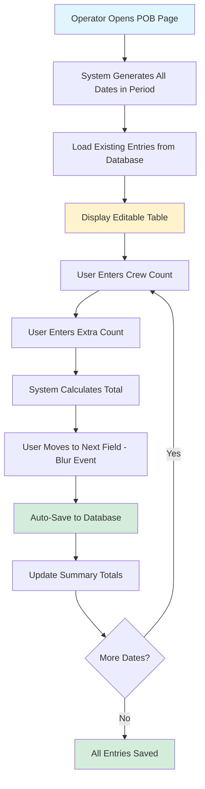
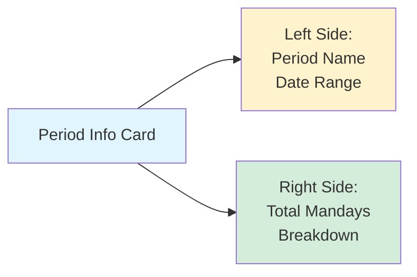
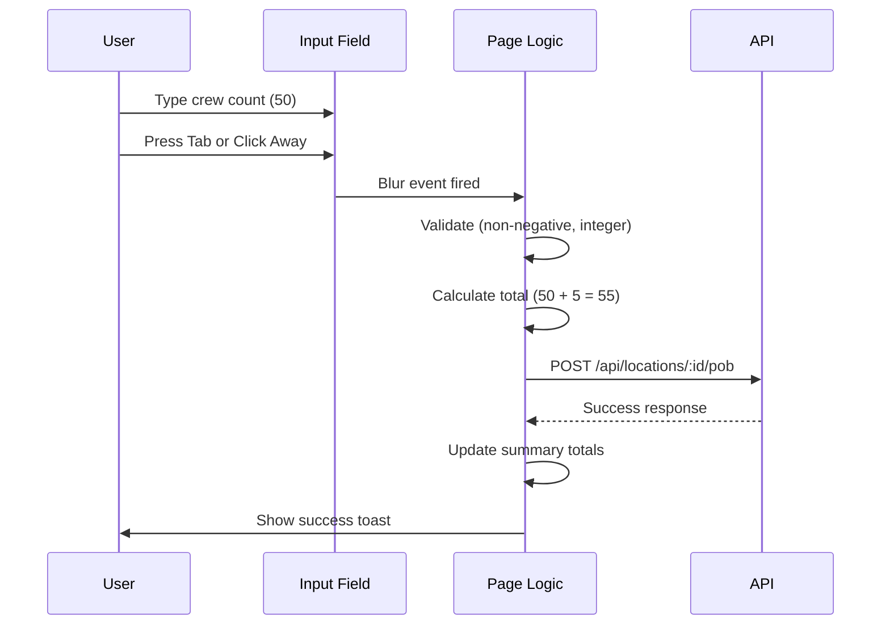
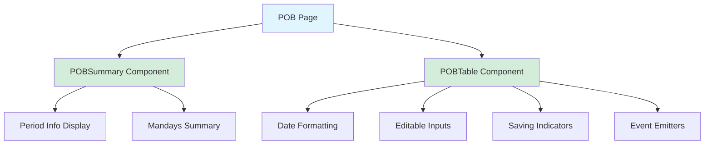
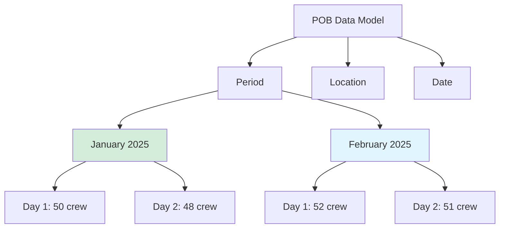
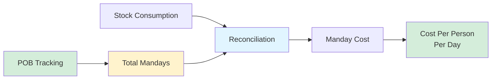

# Phase 2.3: POB Entry (Personnel On Board)
## Stock Management System - Development Guide

**For Junior Developers**
**Last Updated:** November 18, 2025
**Phase Status:** ✅ Complete

---

## 📖 Quick Navigation

- [Phase 1.1: Project Foundation](phase-1.1-foundation.md)
- [Phase 1.2: Database Setup](phase-1.2-database.md)
- [Phase 1.3: Authentication & Security](phase-1.3-authentication.md)
- [Phase 2.1: Transfer Management](phase-2.1-transfers.md)
- [Phase 2.2: NCR Management](phase-2.2-ncrs.md)
- [Phase 2.3: POB Entry](phase-2.3-pob.md) ← You are here

---

## What is POB (Personnel On Board)?

### The Problem

In catering operations (especially in marine vessels, camps, or large facilities), you need to track:
- How many people you feed each day
- How much food you consume in a period
- **Cost per person per day** (called "manday cost")

**Example Scenario:**
- Location: Main Kitchen
- Period: January 2025
- Food consumed: SAR 150,000
- But how many people did we feed?
  - 50 crew + 5 extra = 55 people per day
  - If this continues for 30 days = 1,650 mandays
  - **Manday cost** = 150,000 / 1,650 = **SAR 90.91 per person per day**

**Problems without POB tracking:**
- ❌ Can't calculate accurate cost per person
- ❌ No visibility into headcount trends
- ❌ Can't compare efficiency between locations
- ❌ Manual counting on paper (easy to lose)
- ❌ Hard to verify reconciliation calculations

### Our Solution

We built a **POB Entry System** that:
- ✅ Tracks daily headcount (crew + extra)
- ✅ Auto-generates entries for all dates in period
- ✅ Auto-saves on blur (no save button needed)
- ✅ Calculates total mandays automatically
- ✅ Prevents editing when period is closed
- ✅ Validates non-negative whole numbers
- ✅ Records who entered each value and when



---

## Phase 2.3: POB Entry Overview

### What We Built

In this phase, we created a **complete daily headcount tracking system** that automatically generates entries for all dates in the current period and saves them as operators fill in the data.

### Key Features

1. **Auto-Generated Date Rows** - System creates rows for all dates in period
2. **Two Count Types** - Crew count (regular staff) and Extra count (guests, visitors)
3. **Auto-Save on Blur** - No save button - data saves when you move to next field
4. **Real-Time Totals** - Summary shows total mandays for entire period
5. **Period-Based Access** - Can only edit entries when period is OPEN
6. **Audit Trail** - Tracks who entered data and when

### Tasks Completed

- ✅ 2.3.1: POB API Routes
- ✅ 2.3.2: POB Page UI
- ✅ 2.3.3: POB Components

---

## Task 2.3.1: POB API Routes

### Simple Explanation

We created **3 API endpoints** that handle all POB operations on the server - getting entries for a period, creating/updating multiple entries at once, and updating a single entry.

### What Was Done

#### Endpoint 1: GET /api/locations/:locationId/pob
**Purpose:** Get all POB entries for a location and period

**What it does:**
- Returns POB entries for specified location and period
- If no period specified, uses current OPEN period
- Can filter by date range (startDate, endDate)
- Calculates summary statistics (total crew, extra, mandays)
- Checks user has access to the location

**Example Request:**
```http
GET /api/locations/abc123/pob?periodId=xyz789
```

**Response:**
```json
{
  "location": {
    "id": "abc123",
    "code": "MAIN-KIT",
    "name": "Main Kitchen"
  },
  "period": {
    "id": "xyz789",
    "name": "January 2025",
    "start_date": "2025-01-01",
    "end_date": "2025-01-31",
    "status": "OPEN"
  },
  "entries": [
    {
      "id": "entry1",
      "date": "2025-01-01",
      "crew_count": 50,
      "extra_count": 5,
      "total_count": 55,
      "enterer": {
        "username": "john.operator",
        "full_name": "John Smith"
      },
      "entered_at": "2025-01-01T10:30:00Z"
    }
  ],
  "summary": {
    "total_crew_count": 1500,
    "total_extra_count": 150,
    "total_mandays": 1650,
    "entries_count": 30
  }
}
```

**Key Features:**
- **Period Detection:** Automatically uses current OPEN period if not specified
- **Access Control:** Validates user has access to location
- **Summary Calculation:** Auto-calculates total mandays across all entries
- **Sorted Results:** Entries returned in date order (oldest first)

---

#### Endpoint 2: POST /api/locations/:locationId/pob
**Purpose:** Create or update multiple POB entries at once (bulk operation)

**What it does:**
1. Validates all input data (Zod schema)
2. Checks user has POST or MANAGE access to location
3. Verifies period is OPEN for this location
4. Validates all dates are within period boundaries
5. Uses **database transaction** to ensure atomicity
6. **Upserts** each entry (create if new, update if exists)
7. Records who entered the data and timestamp
8. Returns all saved entries with new summary

**Example Request:**
```json
{
  "period_id": "xyz789",
  "entries": [
    {
      "date": "2025-01-01",
      "crew_count": 50,
      "extra_count": 5
    },
    {
      "date": "2025-01-02",
      "crew_count": 48,
      "extra_count": 7
    }
  ]
}
```

**Important Concepts:**

**1. Upsert Operation**
```typescript
// Upsert = Update if exists, Insert if new
await prisma.pOB.upsert({
  where: {
    period_id_location_id_date: {
      period_id: periodId,
      location_id: locationId,
      date: new Date(entryData.date)
    }
  },
  create: {
    // Create new entry
    crew_count: entryData.crew_count,
    extra_count: entryData.extra_count,
    entered_by: user.id
  },
  update: {
    // Update existing entry
    crew_count: entryData.crew_count,
    extra_count: entryData.extra_count,
    entered_by: user.id
  }
});
```

**Why upsert?** Because we don't know if entry already exists. If operator filled data yesterday and comes back today to change it, we update. If it's a new date, we create.

**2. Database Constraint**
The database has a **unique constraint** on `(period_id, location_id, date)` - meaning you can only have **one POB entry per location per day per period**.

This prevents duplicate entries and ensures data integrity.

---

#### Endpoint 3: PATCH /api/pob/:id
**Purpose:** Update a single existing POB entry

**What it does:**
- Fetches existing POB entry by ID
- Checks user has access to the location
- Verifies period is still OPEN
- Updates crew_count and/or extra_count
- Records who made the update and when
- Returns updated entry

**Example Request:**
```json
{
  "crew_count": 52,
  "extra_count": 3
}
```

**When to use:**
- Updating a single entry directly by ID
- Mobile apps or APIs that work with specific entry IDs

**Note:** In our POB page, we actually use the POST endpoint (bulk upsert) for simplicity - even when updating single entries.

---

### Key Technical Concepts

#### 1. Period-Based Validation

POB entries are tied to periods:

```typescript
// Check if period is open for this location
const periodLocation = await prisma.periodLocation.findUnique({
  where: {
    period_id_location_id: {
      period_id: targetPeriod.id,
      location_id: locationId
    }
  }
});

if (!periodLocation || periodLocation.status !== "OPEN") {
  throw createError({
    statusCode: 400,
    message: "Period is not open for this location"
  });
}
```

**Why?** Once a period closes, historical data should not change. This ensures audit trail integrity.

---

#### 2. Date Range Validation

Dates must be within period boundaries:

```typescript
const periodStart = new Date(targetPeriod.start_date);
const periodEnd = new Date(targetPeriod.end_date);

for (const entry of data.entries) {
  const entryDate = new Date(entry.date);

  if (entryDate < periodStart || entryDate > periodEnd) {
    throw createError({
      statusCode: 400,
      message: `Date ${entry.date} is outside period range`
    });
  }
}
```

**Example:**
- Period: January 2025 (01/01/2025 - 31/01/2025)
- Valid date: 15/01/2025 ✅
- Invalid date: 05/02/2025 ❌ (February - outside range)

---

#### 3. Mandays Calculation

**Mandays** = Total number of people × total number of days

**For single day:**
```
Date: 01/01/2025
Crew: 50
Extra: 5
Mandays for this day = 50 + 5 = 55
```

**For entire period:**
```
Period: January 2025 (31 days)

Day 1: 50 crew + 5 extra = 55 mandays
Day 2: 48 crew + 7 extra = 55 mandays
Day 3: 52 crew + 3 extra = 55 mandays
...
Day 31: 50 crew + 5 extra = 55 mandays

Total Mandays = Sum of all daily totals = 1,705 mandays
```

**Calculation in API:**
```typescript
const totalCrewCount = pobEntries.reduce(
  (sum, entry) => sum + entry.crew_count,
  0
);

const totalExtraCount = pobEntries.reduce(
  (sum, entry) => sum + entry.extra_count,
  0
);

const totalMandays = totalCrewCount + totalExtraCount;
```

**Why it matters:**
- Used to calculate **manday cost** in reconciliations
- Manday Cost = Total Consumption Value / Total Mandays
- Example: SAR 150,000 / 1,705 = **SAR 87.98 per person per day**

---

#### 4. Audit Trail

Every POB entry tracks:
- **Who entered it:** `entered_by` (user ID)
- **When first entered:** `entered_at` (timestamp)
- **When last updated:** `updated_at` (timestamp)

```typescript
{
  crew_count: 50,
  extra_count: 5,
  entered_by: user.id,  // ← Records user
  // Prisma auto-adds timestamps:
  entered_at: "2025-01-01T10:30:00Z",
  updated_at: "2025-01-05T14:15:00Z"
}
```

**Why?** If there's a discrepancy, you can trace:
- Who entered the data
- When it was entered
- If it was changed later

---

### Files Created

| File | What It Does |
|------|--------------|
| `server/api/locations/[locationId]/pob.get.ts` | Get POB entries for location and period |
| `server/api/locations/[locationId]/pob.post.ts` | Bulk create/update POB entries |
| `server/api/pob/[id].patch.ts` | Update single POB entry by ID |

---

## Task 2.3.2: POB Page UI

### Simple Explanation

We created a **web page** where operators can see all dates in the current period in a table, and fill in daily crew and extra counts with auto-save.

### What Was Done

#### Page Features

**1. Period Information Card**
Shows:
- Current period name (January 2025)
- Period date range (01/01/2025 - 31/01/2025)
- **Total mandays** (large, prominent number)
- Breakdown (crew + extra counts)



---

**2. Editable POB Table**

Auto-generates rows for **all dates** in period:

| Date | Crew Count | Extra Count | Total |
|------|------------|-------------|-------|
| Wed, 01/01/2025 | [50] | [5] | 55 |
| Thu, 02/01/2025 | [48] | [7] | 55 |
| Fri, 03/01/2025 | [52] | [3] | 55 |

**Features:**
- Shows **weekday** + formatted date
- Crew and Extra are **editable number inputs**
- Total is **auto-calculated** (read-only)
- **Spinner icon** appears while saving

---

**3. Auto-Save on Blur**

**What is "blur"?** When you click or tab away from an input field, it loses focus - this is called "blur".

**Our behavior:**


**Benefits:**
- No "Save" button needed
- Data saved immediately
- Can't forget to save
- Simple, intuitive UX

---

**4. Real-Time Validation**

Before saving, we check:
- ✅ Must be non-negative (can't have -5 people!)
- ✅ Must be whole number (can't have 5.5 people!)

```typescript
// Validate before saving
if (entry.crew_count < 0 || entry.extra_count < 0) {
  toast.error("Crew and extra counts must be non-negative");
  return;
}

if (!Number.isInteger(entry.crew_count) ||
    !Number.isInteger(entry.extra_count)) {
  toast.error("Crew and extra counts must be whole numbers");
  return;
}
```

---

**5. Period-Based Access Control**

```vue
<UInput
  v-model.number="entry.crew_count"
  type="number"
  :disabled="!isPeriodOpen"
/>
```

If period is closed:
- Inputs are **disabled** (grayed out)
- Warning message shown: "Period is not open"
- Can still **view** data, but cannot edit

---

**6. Loading and Error States**

**Loading State:**
```vue
<div v-if="loading">
  <UIcon name="i-heroicons-arrow-path" class="animate-spin" />
  <span>Loading POB data...</span>
</div>
```

**No Period State:**
```vue
<div v-else-if="!currentPeriod">
  <UIcon name="i-heroicons-calendar-days" />
  <h3>No Active Period</h3>
  <p>There is no active period to enter POB data.</p>
</div>
```

**Period Closed State:**
```vue
<UAlert
  color="warning"
  title="Period is not open"
  description="You cannot edit POB entries for a closed period."
/>
```

---

### Component Structure

```vue
<template>
  <div class="p-4 md:p-6">
    <!-- Page Header -->
    <h1>POB Entry</h1>
    <p>Personnel On Board - Daily headcount entry</p>

    <!-- Period Info Card with Summary -->
    <POBSummary
      :period="currentPeriod"
      :summary="pobData.summary"
      :period-date-range="periodStore.periodDateRange"
    />

    <!-- POB Entry Table -->
    <POBTable
      :entries="editableEntries"
      :disabled="!isPeriodOpen"
      :saving-dates="savingDates"
      @blur="handleBlur"
      @change="handleChange"
    />

    <!-- Auto-Save Info -->
    <UAlert
      color="primary"
      title="Auto-save enabled"
      description="POB entries automatically save when you move to next field."
    />
  </div>
</template>
```

---

### Key Implementation Details

#### 1. Initialize Entries for All Dates

When page loads, generate entries for **every date** in period:

```typescript
function initializeEditableEntries(data: POBData) {
  const entries = new Map<string, POBEntry>();

  // Get period boundaries
  const startDate = new Date(data.period.start_date);
  const endDate = new Date(data.period.end_date);
  const currentDate = new Date(startDate);

  // Loop through every date
  while (currentDate <= endDate) {
    const dateStr = currentDate.toISOString().split("T")[0];

    // Check if we have existing entry from API
    const existingEntry = data.entries.find(e => {
      const entryDate = new Date(e.date).toISOString().split("T")[0];
      return entryDate === dateStr;
    });

    if (existingEntry) {
      // Use existing data
      entries.set(dateStr, { ...existingEntry });
    } else {
      // Create empty entry
      entries.set(dateStr, {
        date: dateStr,
        crew_count: 0,
        extra_count: 0,
        total_count: 0
      });
    }

    // Move to next day
    currentDate.setDate(currentDate.getDate() + 1);
  }

  editableEntries.value = entries;
}
```

**Example:**
- Period: January 2025 (31 days)
- API returned data for 5 days (user has entered 5 so far)
- We generate 31 rows:
  - 5 rows with existing data (crew_count: 50, extra_count: 5)
  - 26 rows with empty data (crew_count: 0, extra_count: 0)

**Why?** User can see all dates at once and fill them progressively.

---

#### 2. Auto-Save on Blur

```typescript
async function saveEntry(dateStr: string) {
  // Get entry for this date
  const entry = editableEntries.value.get(dateStr);

  // Validate
  if (entry.crew_count < 0 || entry.extra_count < 0) {
    toast.error("Must be non-negative");
    return;
  }

  // Show saving indicator
  savingDates.value.add(dateStr);

  try {
    // Call API
    const response = await $fetch(
      `/api/locations/${locationId}/pob`,
      {
        method: "POST",
        body: {
          entries: [{
            date: entry.date,
            crew_count: entry.crew_count,
            extra_count: entry.extra_count
          }]
        }
      }
    );

    // Update summary with new totals
    pobData.value.summary = response.summary;

    toast.success("POB entry saved");
  } finally {
    // Hide saving indicator
    savingDates.value.delete(dateStr);
  }
}
```

---

#### 3. Watch for Location Changes

If user switches location (in navbar), reload data:

```typescript
watch(activeLocationId, async (newLocationId) => {
  if (newLocationId) {
    await fetchPOBData();
  }
});
```

**Why?** Each location has its own POB entries. If user switches from Main Kitchen to Central Store, we need to fetch Central Store's POB data.

---

### Files Created

| File | What It Does |
|------|--------------|
| `app/pages/pob.vue` | POB entry page with auto-generated table |

---

## Task 2.3.3: POB Components

### Simple Explanation

We created **2 reusable components** that can be used anywhere in the app - one for the POB table and one for the summary card.

### What Was Done

We created **2 components:**

1. **POBTable** - Editable table with all dates in period
2. **POBSummary** - Period info card with total mandays

---

#### Component 1: POBTable

**Purpose:** Display editable POB entries table with auto-save capability.

**Props (Inputs):**
```typescript
interface Props {
  entries: Map<string, POBEntry>;  // All entries (key = date string)
  disabled?: boolean;              // Disable editing (period closed)
  savingDates?: Set<string>;       // Dates currently being saved
}
```

**Events (Outputs):**
```typescript
const emit = defineEmits<{
  blur: [dateStr: string];    // When input loses focus
  change: [dateStr: string];  // When input value changes
}>();
```

**Features:**
- **Auto-sorted dates** - Oldest to newest
- **Formatted date display** - "Wed, 01/01/2025"
- **Number inputs** - With min="0" and step="1"
- **Disabled state** - When period closed
- **Saving indicator** - Spinner icon while saving
- **Auto-calculated total** - Read-only column

**Usage Example:**
```vue
<template>
  <POBTable
    :entries="editableEntries"
    :disabled="!isPeriodOpen"
    :saving-dates="savingDates"
    @blur="handleBlur"
    @change="handleChange"
  />
</template>

<script setup lang="ts">
const handleBlur = async (dateStr: string) => {
  // Validate and save entry
  await saveEntry(dateStr);
};

const handleChange = (dateStr: string) => {
  // Recalculate total
  updateTotal(dateStr);
};
</script>
```

**Key Implementation:**

```vue
<template>
  <UCard>
    <table>
      <thead>
        <tr>
          <th>Date</th>
          <th>Crew Count</th>
          <th>Extra Count</th>
          <th>Total</th>
        </tr>
      </thead>
      <tbody>
        <tr
          v-for="dateStr in sortedDates"
          :key="dateStr"
          :class="{ 'opacity-50': isSaving(dateStr) }"
        >
          <!-- Date Column -->
          <td>{{ formatDateDisplay(dateStr) }}</td>

          <!-- Crew Count Input -->
          <td>
            <UInput
              v-model.number="entries.get(dateStr).crew_count"
              type="number"
              min="0"
              step="1"
              :disabled="disabled || isSaving(dateStr)"
              @blur="emit('blur', dateStr)"
              @input="emit('change', dateStr)"
            />
          </td>

          <!-- Extra Count Input -->
          <td>
            <UInput
              v-model.number="entries.get(dateStr).extra_count"
              type="number"
              min="0"
              step="1"
              :disabled="disabled || isSaving(dateStr)"
              @blur="emit('blur', dateStr)"
              @input="emit('change', dateStr)"
            />
          </td>

          <!-- Total (Read-Only) -->
          <td>
            {{ entries.get(dateStr).total_count }}
            <UIcon
              v-if="isSaving(dateStr)"
              name="i-heroicons-arrow-path"
              class="animate-spin"
            />
          </td>
        </tr>
      </tbody>
    </table>
  </UCard>
</template>
```

---

#### Component 2: POBSummary

**Purpose:** Display period information and total mandays summary.

**Props:**
```typescript
interface Props {
  period: Period;           // Period info (name, dates)
  summary: POBSummary;      // Summary stats (totals)
  periodDateRange?: string; // Optional formatted date range
}
```

**Features:**
- **Dual-section layout** - Period info on left, totals on right
- **Large mandays display** - Prominent total in primary color
- **Breakdown** - Shows crew + extra counts
- **Auto-formatting** - Formats dates if periodDateRange not provided

**Usage Example:**
```vue
<template>
  <POBSummary
    :period="currentPeriod"
    :summary="{
      total_crew_count: 1500,
      total_extra_count: 150,
      total_mandays: 1650,
      entries_count: 30
    }"
    period-date-range="01/01/2025 - 31/01/2025"
  />
</template>
```

**Visual Structure:**

```
┌─────────────────────────────────────────────────┐
│  Current Period             Total Mandays       │
│  January 2025                  1,650            │
│  01/01/2025 - 31/01/2025                        │
│                           1,500 crew + 150 extra│
└─────────────────────────────────────────────────┘
```

**Key Implementation:**

```vue
<template>
  <UCard>
    <div class="flex items-center justify-between">
      <!-- Left: Period Info -->
      <div>
        <h3 class="text-sm text-muted">Current Period</h3>
        <p class="text-lg font-semibold">{{ period.name }}</p>
        <p class="text-sm text-muted">{{ formattedDateRange }}</p>
      </div>

      <!-- Right: Total Mandays -->
      <div class="text-right">
        <h3 class="text-sm text-muted">Total Mandays</h3>
        <p class="text-3xl font-bold text-primary">
          {{ summary.total_mandays.toLocaleString() }}
        </p>
        <p class="text-xs text-muted">
          {{ summary.total_crew_count.toLocaleString() }} crew +
          {{ summary.total_extra_count.toLocaleString() }} extra
        </p>
      </div>
    </div>
  </UCard>
</template>
```

---

### Component Architecture



---

### Key Concepts

#### 1. Component Reusability

These components can be used in multiple places:

```vue
<!-- In POB entry page (current) -->
<POBTable :entries="entries" @blur="save" />

<!-- In POB review page (future) -->
<POBTable :entries="entries" :disabled="true" />

<!-- In reconciliation page (showing summary) -->
<POBSummary :period="period" :summary="summary" />

<!-- In dashboard (showing multiple locations) -->
<POBSummary
  v-for="location in locations"
  :period="period"
  :summary="getLocationSummary(location)"
/>
```

---

#### 2. Props vs Emits

**Props flow DOWN** (parent → child):
```vue
<POBTable :entries="myEntries" :disabled="true" />
                     ↓              ↓
              Component receives these values
```

**Emits flow UP** (child → parent):
```vue
<POBTable @blur="handleBlur" />
              ↑
    Component sends events up
```

**Analogy:** Props are like **parameters** to a function, Emits are like **return values**.

---

#### 3. Map vs Array

**Why use Map for entries?**

```typescript
// ❌ Array - have to search every time
const entries: POBEntry[] = [...];
const entry = entries.find(e => e.date === "2025-01-15");

// ✅ Map - instant lookup by date
const entries: Map<string, POBEntry> = new Map();
entries.set("2025-01-15", { crew_count: 50, ... });
const entry = entries.get("2025-01-15"); // O(1) - instant!
```

**Benefits:**
- **Fast lookup** - No searching needed
- **Easy update** - Just `entries.set(date, newValue)`
- **Natural key** - Date string is the key

---

### Files Created

| File | What It Does |
|------|--------------|
| `app/components/pob/POBTable.vue` | Editable POB table component |
| `app/components/pob/POBSummary.vue` | Period info and summary card |

---

## Important Files Created in This Phase

### API Routes

| File | Lines | Purpose |
|------|-------|---------|
| `server/api/locations/[locationId]/pob.get.ts` | ~250 | Get POB entries for location/period |
| `server/api/locations/[locationId]/pob.post.ts` | ~310 | Bulk create/update POB entries |
| `server/api/pob/[id].patch.ts` | ~260 | Update single POB entry |

### Frontend Pages

| File | Lines | Purpose |
|------|-------|---------|
| `app/pages/pob.vue` | ~320 | POB entry page with auto-save |

### Components

| File | Lines | Purpose |
|------|-------|---------|
| `app/components/pob/POBTable.vue` | ~175 | Editable POB table |
| `app/components/pob/POBSummary.vue` | ~80 | Period summary card |

**Total:** ~1,395 lines of code

---

## Key Concepts Learned

### 1. Upsert Operations

**Simple Explanation:** "Update if exists, Insert if new"

**Why it's useful:**
```typescript
// Without upsert (BAD):
const existing = await findEntry();
if (existing) {
  await update(existing.id);
} else {
  await create();
}
// 2-3 database calls, race condition possible!

// With upsert (GOOD):
await upsert({
  where: { id },
  create: { data },
  update: { data }
});
// 1 database call, atomic operation!
```

**Real scenario:**
- Operator fills Day 1 data → Creates new entry
- Operator realizes mistake, changes Day 1 → Updates existing entry
- Same code handles both cases!

---

### 2. Auto-Save UX Pattern

**Traditional approach:**
```
[Input Field] [Save Button]
User has to remember to click Save!
```

**Auto-save approach:**
```
[Input Field] (auto-saves on blur)
Just enter data and move on!
```

**Benefits:**
- ✅ Can't forget to save
- ✅ Less clicks
- ✅ More intuitive
- ✅ Mobile-friendly

**Implementation:**
```vue
<UInput
  v-model="value"
  @blur="save"  <!-- Triggers when field loses focus -->
/>
```

---

### 3. Period-Based Data Isolation



**Key point:** Each period has **completely separate** POB data. When you close January and open February, February starts with empty POB entries.

---

### 4. Map Data Structure

**Map vs Array comparison:**

```typescript
// Scenario: Update crew count for specific date

// With Array:
const entries: POBEntry[] = [...];
const index = entries.findIndex(e => e.date === "2025-01-15");
if (index !== -1) {
  entries[index].crew_count = 55;
}
// Time complexity: O(n) - have to search

// With Map:
const entries: Map<string, POBEntry> = new Map();
const entry = entries.get("2025-01-15");
entry.crew_count = 55;
// Time complexity: O(1) - instant lookup!
```

**When to use Map:**
- Need fast lookup by key
- Frequently update items
- Key is a string or number

**When to use Array:**
- Need to sort
- Need to filter
- Need numeric index

---

### 5. Reactive State Updates

```typescript
// ❌ Wrong: Mutating Map doesn't trigger Vue reactivity
entries.get("2025-01-15").crew_count = 55;

// ✅ Right: Create new entry object
const entry = entries.get("2025-01-15");
entries.set("2025-01-15", { ...entry, crew_count: 55 });

// ✅ Alternative: Use ref() with .value
const entries = ref(new Map());
entries.value.get("2025-01-15").crew_count = 55;
// Vue 3 deep reactivity tracks this
```

In our implementation, we use `ref(new Map())` which Vue 3 tracks deeply.

---

## Common Terms Explained

| Term | Simple Explanation |
|------|-------------------|
| **POB** | Personnel On Board - daily headcount tracking |
| **Crew Count** | Regular staff/employees working that day |
| **Extra Count** | Guests, visitors, or temporary staff |
| **Mandays** | Total people × days (used for cost calculation) |
| **Manday Cost** | Cost per person per day (consumption / mandays) |
| **Upsert** | Update if exists, insert if new (one operation) |
| **Blur Event** | When input field loses focus (click/tab away) |
| **Auto-Save** | Saving data automatically without save button |
| **Period-Based** | Data tied to specific accounting period |
| **Map** | Key-value data structure with fast lookup |

---

## Common Issues and Solutions

### Issue 1: Data Not Saving on Blur

**Symptoms:**
- User enters data and moves to next field
- No saving indicator appears
- Data not persisted to database

**Causes:**
1. Blur event not firing
2. Validation failing silently
3. Period is closed

**Solutions:**
```typescript
// 1. Check blur event is connected
<UInput @blur="handleBlur(dateStr)" />

// 2. Add logging to debug
function handleBlur(dateStr: string) {
  console.log("Blur fired for:", dateStr);
  updateTotal(dateStr);
  saveEntry(dateStr);
}

// 3. Check period status
if (!isPeriodOpen.value) {
  console.log("Period closed, cannot save");
  return;
}
```

---

### Issue 2: Decimal Values Entered (5.5 people)

**Symptoms:**
- User enters 5.5 in crew count
- Validation error appears

**Cause:** HTML number input allows decimals by default

**Solution:**
```vue
<!-- Use step="1" to force integers -->
<UInput
  v-model.number="crew_count"
  type="number"
  step="1"
  min="0"
/>

<!-- Also validate in code -->
if (!Number.isInteger(crew_count)) {
  toast.error("Must be whole number");
  return;
}
```

---

### Issue 3: Dates Not Auto-Generating

**Symptoms:**
- Table is empty even though period has dates
- No rows displayed

**Causes:**
1. Period data not loaded
2. Date loop logic error
3. Wrong date format

**Solution:**
```typescript
// Ensure period loaded first
if (!currentPeriod.value) {
  await periodStore.fetchCurrentPeriod();
}

// Debug date generation
function initializeEditableEntries(data: POBData) {
  console.log("Period start:", data.period.start_date);
  console.log("Period end:", data.period.end_date);

  const startDate = new Date(data.period.start_date);
  const endDate = new Date(data.period.end_date);

  console.log("Parsed start:", startDate);
  console.log("Parsed end:", endDate);

  // ... rest of logic
}
```

---

### Issue 4: Summary Not Updating After Save

**Symptoms:**
- Single entry saves successfully
- Total mandays doesn't update
- Summary still shows old values

**Cause:** Not updating pobData.summary after save

**Solution:**
```typescript
async function saveEntry(dateStr: string) {
  const response = await $fetch('/api/locations/.../pob', {
    method: "POST",
    body: { entries: [...] }
  });

  // ✅ Update summary with response
  if (pobData.value && response.summary) {
    pobData.value.summary = response.summary;
  }
}
```

---

### Issue 5: Can Edit Closed Period

**Symptoms:**
- Period shows as CLOSED
- But inputs are still enabled

**Cause:** isPeriodOpen check not working

**Solution:**
```typescript
// Check period status from store
const isPeriodOpen = computed(() => periodStore.isPeriodOpen);

// Use in template
<UInput
  :disabled="!isPeriodOpen"
  v-model="crew_count"
/>

// Debug
console.log("Period status:", periodStore.currentPeriod?.status);
console.log("Is open:", isPeriodOpen.value);
```

---

## Testing Checklist

### Manual Testing Steps

**1. Load POB Page**
- [ ] Page loads without errors
- [ ] Current period name displays correctly
- [ ] Date range shows correctly formatted
- [ ] All dates in period appear in table
- [ ] Dates sorted oldest to newest
- [ ] Each date shows weekday (Wed, Thu, etc.)

**2. Enter POB Data**
- [ ] Can enter crew count
- [ ] Can enter extra count
- [ ] Total calculates automatically (crew + extra)
- [ ] Auto-saves when moving to next field (blur)
- [ ] Saving indicator (spinner) appears during save
- [ ] Success toast appears after save
- [ ] Summary updates with new totals

**3. Data Validation**
- [ ] Cannot enter negative numbers
- [ ] Cannot enter decimal values (e.g., 5.5)
- [ ] Error toast shows for invalid values
- [ ] No save happens if validation fails

**4. Period Closed Behavior**
- [ ] Warning alert appears when period closed
- [ ] All input fields disabled
- [ ] Can still view existing data
- [ ] Auto-save doesn't trigger

**5. Location Switching**
- [ ] Switching location reloads POB data
- [ ] Correct location's data displays
- [ ] Summary shows correct totals for location

**6. Existing Data Loading**
- [ ] Previously saved entries load correctly
- [ ] Existing crew counts display
- [ ] Existing extra counts display
- [ ] Dates without data show 0

**7. Edge Cases**
- [ ] Period with no entries shows empty table with dates
- [ ] Period with partial entries shows mix of filled/empty
- [ ] Same date edited twice updates (not duplicates)
- [ ] Rapid changes (typing fast) don't cause multiple saves

**8. Error Scenarios**
- [ ] Network error shows error toast
- [ ] Period not found shows appropriate message
- [ ] No location selected shows helpful message
- [ ] Location access denied shows permission error

---

## What's Next?

After completing POB Entry (Phase 2.3), the next phase is:

**→ Phase 2.4: Reconciliations** (Days 18-20)
- Reconciliation calculation utility
- Reconciliation API routes
- Reconciliations page (single location)
- Consolidated reconciliation view (all locations)
- Adjustments entry (back-charges, credits, condemnations)
- Manday cost calculation (uses POB total mandays!)

**How POB connects to Reconciliations:**



**Formula:**
```
Manday Cost = Total Consumption Value / Total Mandays

Example:
- Total Consumption: SAR 150,000 (from reconciliation)
- Total Mandays: 1,650 (from POB!)
- Manday Cost: 150,000 / 1,650 = SAR 90.91 per person per day
```

---

## Summary

In Phase 2.3, we built a complete Personnel On Board (POB) tracking system with:

✅ **3 API endpoints** for getting, bulk upserting, and updating POB entries
✅ **1 page** with auto-generated date table and auto-save functionality
✅ **2 reusable components** for POB table and summary display
✅ **Auto-save on blur** eliminating need for save button
✅ **Period-based access control** preventing editing of closed periods
✅ **Real-time validation** ensuring data integrity (non-negative integers)
✅ **Summary calculations** showing total mandays for reconciliation use
✅ **Audit trail** tracking who entered data and when
✅ **Responsive design** working on desktop, tablet, and mobile

The POB system is now fully functional and ready for production use, supporting the critical business requirement of tracking daily headcount for accurate manday cost calculations in period-end reconciliations.

---

**Made with ❤️ for Junior Developers**

---

**Last Updated:** November 18, 2025
**Phase:** 2.3 POB Entry ✅ Complete
**Next:** Phase 2.4 Reconciliations
