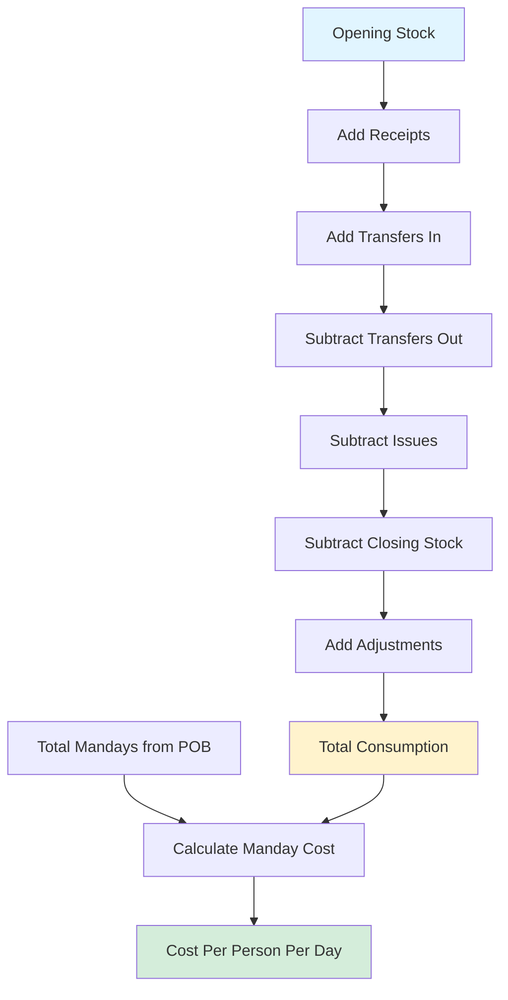
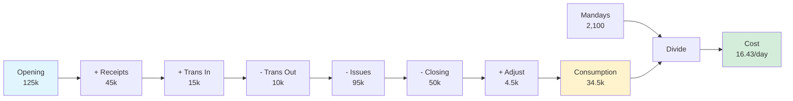
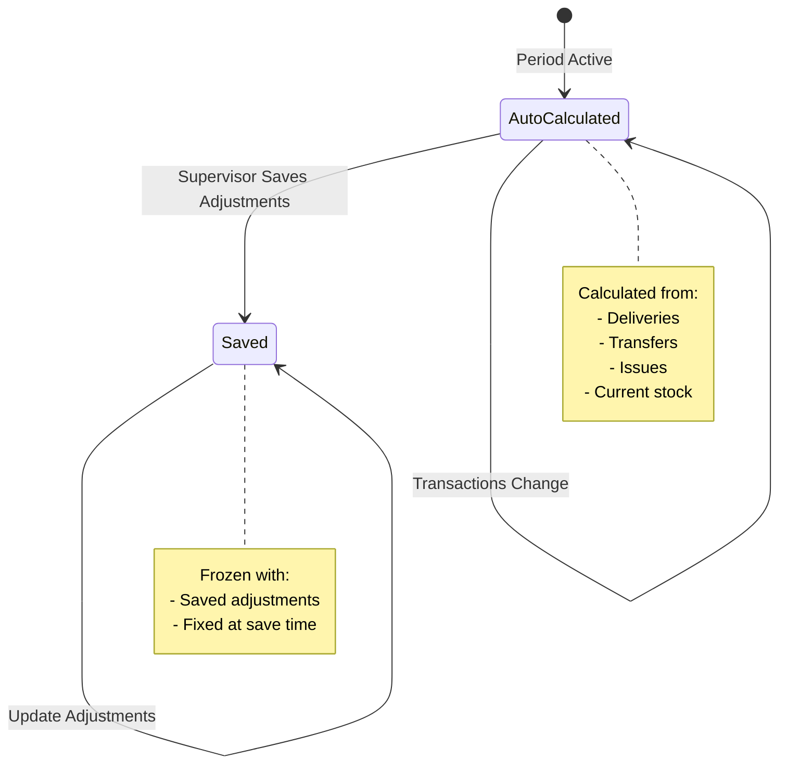
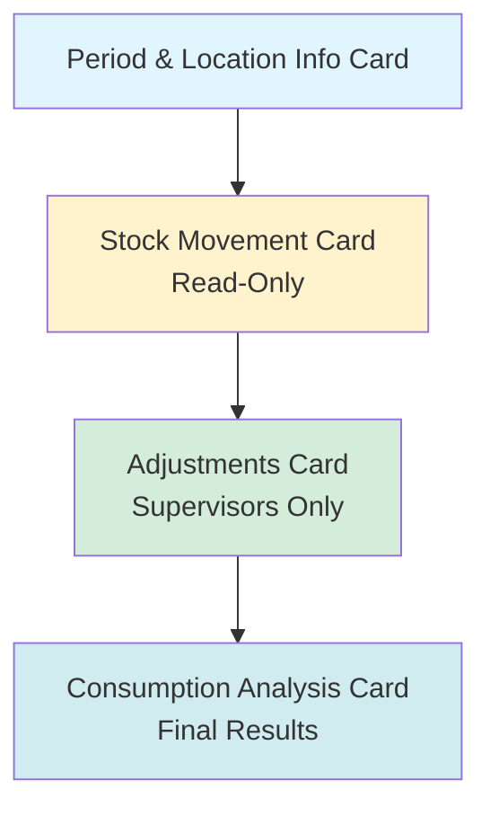
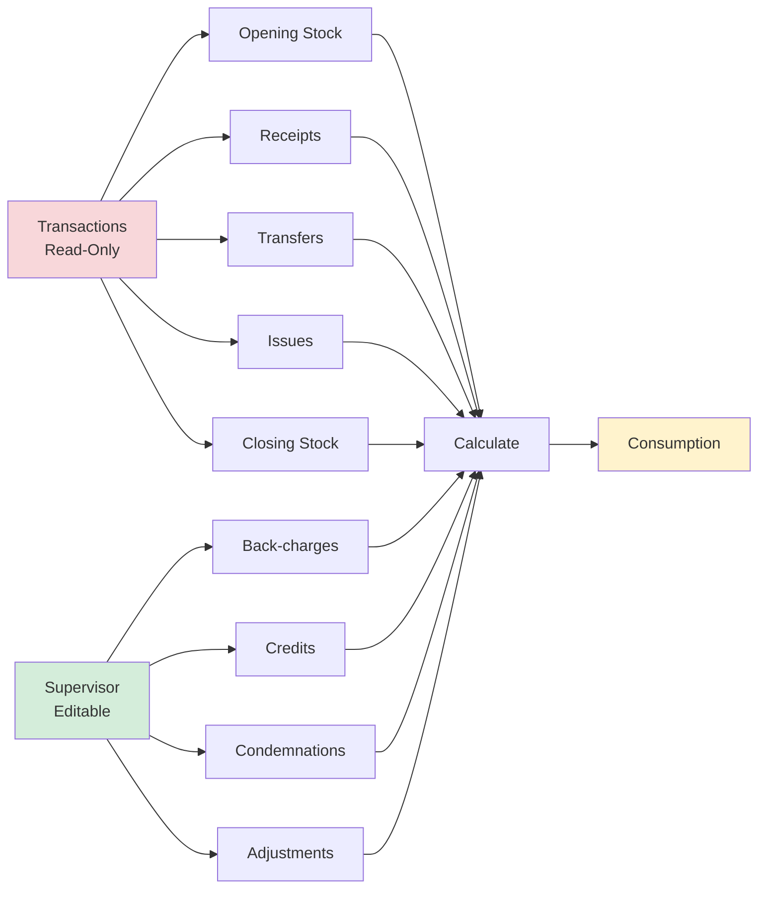
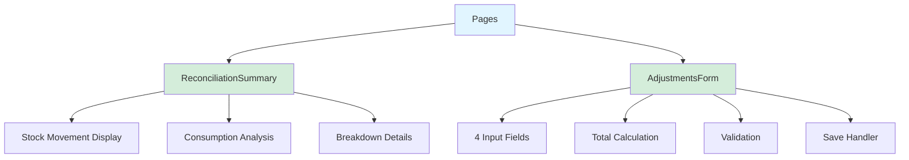
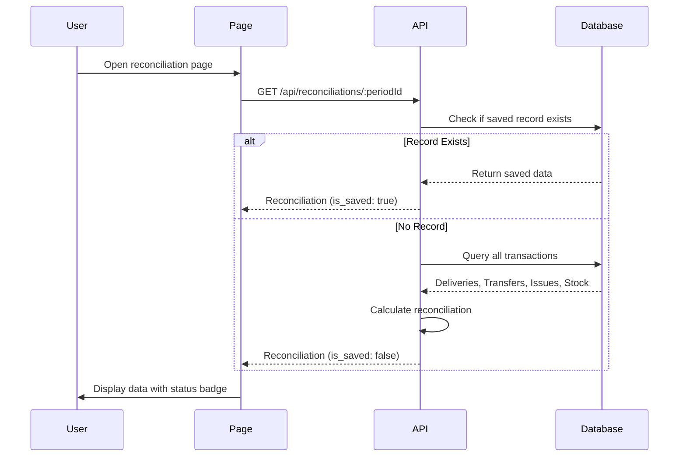
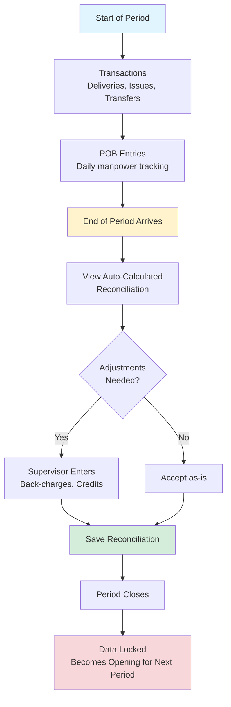

# Phase 2.4: Reconciliation Management
## Stock Management System - Development Guide

**For Junior Developers**
**Last Updated:** November 18, 2025
**Phase Status:** ✅ Complete

---

## 📖 Quick Navigation

- [Phase 2.1: Transfer Management](phase-2.1-transfers.md)
- [Phase 2.2: NCR Management](phase-2.2-ncrs.md)
- [Phase 2.3: POB Entry](phase-2.3-pob.md)
- [Phase 2.4: Reconciliation Management](phase-2.4-reconciliations.md) ← You are here

---

## What is Reconciliation?

### The Problem

At the end of each month, businesses need to know:
- How much food was consumed (used up)?
- How much did it cost per person per day?
- Are the numbers correct (does Opening + Receipts - Issues = Closing)?
- What happened to the stock differences (back-charges, credits, condemnations)?

**Problems with manual tracking:**
- ❌ Complicated calculations with multiple data sources
- ❌ Human errors in adding/subtracting large numbers
- ❌ Missing adjustments (credits, back-charges not recorded)
- ❌ No visibility across all locations
- ❌ Time-consuming Excel spreadsheets
- ❌ Difficult to compare performance between locations

### Our Solution

We built a **Reconciliation System** that:
- ✅ Automatically calculates opening stock from previous period
- ✅ Sums all deliveries (receipts) for the period
- ✅ Tracks transfers in and transfers out
- ✅ Calculates total issues (consumption from stock)
- ✅ Gets current stock levels (closing stock)
- ✅ Allows supervisors to add adjustments (back-charges, credits, condemnations)
- ✅ Calculates total consumption using the reconciliation formula
- ✅ Calculates cost per manday (consumption ÷ total POB mandays)
- ✅ Provides consolidated view across all locations for management



---

## Phase 2.4: Reconciliation Management Overview

### What We Built

In this phase, we created the **complete period-end reconciliation system** for calculating consumption, manday costs, and generating management reports across all locations.

### Key Features

1. **Automatic Calculation** - System auto-calculates reconciliation from transaction data
2. **Adjustments Entry** - Supervisors can add back-charges, credits, condemnations
3. **Manday Cost** - Automatic calculation of cost per person per day
4. **Consolidated View** - Management can see all locations in one report
5. **CSV Export** - Export consolidated data for offline analysis

### Tasks Completed

- ✅ 2.4.1: Reconciliation Calculation Utility
- ✅ 2.4.2: Reconciliation API Routes
- ✅ 2.4.3: Reconciliations Page
- ✅ 2.4.4: Consolidated Reconciliation View
- ✅ 2.4.5: Reconciliation Components

---

## Task 2.4.1: Reconciliation Calculation Utility

### Simple Explanation

We created **helper functions** that perform the complicated math for reconciliation calculations - like a calculator that knows the specific formulas we need for period-end processing.

### What Was Done

#### The Reconciliation Formula

```
Consumption = Opening Stock + Receipts + Transfers In
              - Transfers Out - Issues - Closing Stock
              + Adjustments
```

**In simple terms:**
- Start with what you had (Opening)
- Add what came in (Receipts, Transfers In)
- Subtract what went out (Transfers Out, Issues)
- Subtract what you have now (Closing)
- Add any adjustments (Back-charges, Credits, Condemnations)
- Result = What was actually consumed (used up)

#### Example Calculation

**Main Kitchen - November 2025:**

```
Opening Stock:    SAR 125,000  (what we had at start of month)
+ Receipts:       SAR  45,000  (deliveries during month)
+ Transfers In:   SAR  15,000  (received from other locations)
- Transfers Out:  SAR  10,000  (sent to other locations)
- Issues:         SAR  95,000  (stock given to production)
- Closing Stock:  SAR  50,000  (what we have now)
+ Adjustments:    SAR   4,500  (credits, back-charges, etc.)

= Consumption:    SAR  34,500  (actual food cost for the month)
```

**Verification:**
```
125,000 + 45,000 + 15,000 - 10,000 - 95,000 - 50,000 + 4,500 = 34,500 ✓
```

---

#### Manday Cost Calculation

```
Manday Cost = Total Consumption ÷ Total Mandays
```

**Example:**
- Consumption: SAR 34,500
- Total Mandays: 2,100 (70 people × 30 days)
- Manday Cost: SAR 34,500 ÷ 2,100 = **SAR 16.43 per person per day**

**What this tells us:** It cost SAR 16.43 to feed each person for one day.



---

#### Functions Created

**1. calculateConsumption()**

Takes all the numbers and applies the formula:

```typescript
interface ConsumptionInput {
  opening_stock: number;      // Starting value
  receipts: number;           // Deliveries total
  transfers_in: number;       // Received from other locations
  transfers_out: number;      // Sent to other locations
  issues: number;             // Given to production
  closing_stock: number;      // Current stock value
  back_charges: number;       // Extra charges to adjust
  credits: number;            // Credits due from suppliers
  condemnations: number;      // Condemned/wasted items
  adjustments: number;        // Other adjustments
}

function calculateConsumption(input: ConsumptionInput): ConsumptionResult {
  // Apply the formula
  const totalAdjustments =
    input.back_charges +
    input.credits +
    input.condemnations +
    input.adjustments;

  const consumption =
    input.opening_stock +
    input.receipts +
    input.transfers_in -
    input.transfers_out -
    input.issues -
    input.closing_stock +
    totalAdjustments;

  return {
    consumption: roundCurrency(consumption),
    totalAdjustments: roundCurrency(totalAdjustments),
    breakdown: { ...input }  // For audit trail
  };
}
```

**2. calculateMandayCost()**

Divides consumption by total mandays:

```typescript
function calculateMandayCost(
  consumption: number,
  totalMandays: number
): MandayCostResult {
  // Prevent division by zero
  if (totalMandays === 0) {
    return {
      consumption,
      totalMandays: 0,
      mandayCost: 0
    };
  }

  const mandayCost = consumption / totalMandays;

  return {
    consumption: roundCurrency(consumption),
    totalMandays,
    mandayCost: roundCurrency(mandayCost)
  };
}
```

**3. calculateReconciliation()**

Combines both calculations in one function:

```typescript
function calculateReconciliation(
  input: ConsumptionInput,
  totalMandays: number
) {
  // First calculate consumption
  const consumptionResult = calculateConsumption(input);

  // Then calculate manday cost
  const mandayResult = calculateMandayCost(
    consumptionResult.consumption,
    totalMandays
  );

  return {
    ...consumptionResult,
    ...mandayResult
  };
}
```

---

#### Testing

We created **10 test cases** to make sure calculations are accurate:

```typescript
// Test 1: Basic consumption calculation
const result = calculateConsumption({
  opening_stock: 125000,
  receipts: 45000,
  transfers_in: 15000,
  transfers_out: 10000,
  issues: 95000,
  closing_stock: 50000,
  back_charges: 0,
  credits: 0,
  condemnations: 0,
  adjustments: 4500
});

expect(result.consumption).toBe(34500);  // ✓ Correct!

// Test 2: Manday cost calculation
const cost = calculateMandayCost(34500, 2100);
expect(cost.mandayCost).toBe(16.43);  // ✓ Correct!

// Test 3: Zero mandays (prevent division by zero)
const zeroMandays = calculateMandayCost(34500, 0);
expect(zeroMandays.mandayCost).toBe(0);  // ✓ Doesn't crash!

// Test 4: Negative consumption (over-stocking)
const overStock = calculateConsumption({
  opening_stock: 50000,
  receipts: 20000,
  transfers_in: 0,
  transfers_out: 0,
  issues: 15000,
  closing_stock: 60000,  // More than we should have!
  back_charges: 0,
  credits: 0,
  condemnations: 0,
  adjustments: 0
});

expect(overStock.consumption).toBe(-5000);  // Negative = over-stocked
```

All 10 tests passed successfully! ✓

---

### Key Technical Concepts

#### 1. Why We Need Adjustments

**Back-charges:**
- You ordered 100 KG flour
- Supplier delivered 90 KG
- You add back-charge of SAR 150 (10 KG × SAR 15)
- This increases consumption (you used more from existing stock)

**Credits:**
- Supplier overcharged SAR 500
- You add credit of SAR 500
- This reduces consumption (actual cost was lower)

**Condemnations:**
- 50 KG vegetables spoiled
- You add condemnation of SAR 750
- This increases consumption (food wasted, not in closing stock)

---

#### 2. Decimal Precision

We use **2 decimal places** for currency:

```typescript
function roundCurrency(value: number): number {
  return Math.round(value * 100) / 100;
}

// Examples:
roundCurrency(16.428571)  // → 16.43
roundCurrency(125000.005) // → 125000.01
roundCurrency(0.004)      // → 0.00
```

**Why?** SAR currency has 2 decimal places (SAR 16.43, not SAR 16.428571)

---

#### 3. Input Validation

Before calculating, we check inputs are valid:

```typescript
function validateReconciliationInputs(input: ConsumptionInput) {
  const errors: string[] = [];

  // Check for negative values
  if (input.opening_stock < 0) {
    errors.push("Opening stock cannot be negative");
  }

  if (input.receipts < 0) {
    errors.push("Receipts cannot be negative");
  }

  // Check for infinity or NaN
  if (!Number.isFinite(input.opening_stock)) {
    errors.push("Opening stock must be a valid number");
  }

  if (errors.length > 0) {
    throw new Error(errors.join(", "));
  }
}
```

This prevents calculation errors from bad data.

---

### Files Created

| File | What It Does |
|------|--------------|
| `server/utils/reconciliation.ts` | All reconciliation calculation functions |
| `tests/unit/reconciliation.test.ts` | 10 test cases verifying calculations |

---

## Task 2.4.2: Reconciliation API Routes

### Simple Explanation

We created **3 API endpoints** that fetch reconciliation data, allow supervisors to save adjustments, and provide consolidated reports across all locations.

### What Was Done

#### Endpoint 1: GET /api/locations/:locationId/reconciliations/:periodId

**Purpose:** Get reconciliation for a specific location and period

**What it does:**

1. **Checks if saved reconciliation exists** in database
2. **If exists:** Returns saved data
3. **If not exists:** Auto-calculates from transactions:

```typescript
// Step 1: Get opening stock from previous period
const previousPeriod = await prisma.period.findFirst({
  where: {
    end_date: { lt: currentPeriod.start_date }
  },
  orderBy: { end_date: "desc" }
});

const openingStock = previousPeriod
  ? await sumClosingStock(locationId, previousPeriod.id)
  : 0;  // First period starts with 0

// Step 2: Sum all deliveries (receipts)
const receipts = await prisma.deliveryLine.aggregate({
  where: {
    delivery: {
      location_id: locationId,
      period_id: periodId,
      status: "POSTED"
    }
  },
  _sum: { line_value: true }
});

// Step 3: Sum transfers IN (from other locations)
const transfersIn = await prisma.transferLine.aggregate({
  where: {
    transfer: {
      to_location_id: locationId,
      period_id: periodId,
      status: "COMPLETED"
    }
  },
  _sum: { line_value: true }
});

// Step 4: Sum transfers OUT (to other locations)
const transfersOut = await prisma.transferLine.aggregate({
  where: {
    transfer: {
      from_location_id: locationId,
      period_id: periodId,
      status: "COMPLETED"
    }
  },
  _sum: { line_value: true }
});

// Step 5: Sum all issues
const issues = await prisma.issueLine.aggregate({
  where: {
    issue: {
      location_id: locationId,
      period_id: periodId,
      status: "POSTED"
    }
  },
  _sum: { line_value: true }
});

// Step 6: Get current stock values (closing stock)
const closingStock = await prisma.locationStock.aggregate({
  where: {
    location_id: locationId
  },
  _sum: {
    // on_hand × wac for each item
  }
});
```

4. **Calculates consumption and manday cost** using utility functions
5. **Returns complete reconciliation data**

**Example Response:**

```json
{
  "reconciliation": {
    "location_id": "abc123",
    "period_id": "def456",
    "opening_stock": 125000.00,
    "receipts": 45000.00,
    "transfers_in": 15000.00,
    "transfers_out": 10000.00,
    "issues": 95000.00,
    "closing_stock": 50000.00,
    "back_charges": 0.00,
    "credits": 0.00,
    "condemnations": 0.00,
    "adjustments": 4500.00,
    "consumption": 34500.00,
    "manday_cost": 16.43,
    "total_mandays": 2100,
    "is_saved": false  // Auto-calculated, not saved yet
  }
}
```

---

#### Endpoint 2: PATCH /api/locations/:locationId/reconciliations/:periodId

**Purpose:** Save adjustments and update reconciliation

**What it does:**

1. **Checks user is supervisor or admin** (only they can save adjustments)
2. **Fetches existing reconciliation** or auto-calculates base values
3. **Updates adjustment fields:**
   - Back-charges
   - Credits
   - Condemnations
   - Other adjustments
4. **Recalculates consumption** with new adjustments
5. **Recalculates manday cost** with updated consumption
6. **Saves to database** (creates or updates)
7. **Returns updated reconciliation**

**Example Request:**

```json
{
  "back_charges": 1000.00,
  "credits": 500.00,
  "condemnations": 750.00,
  "adjustments": 3250.00
}
```

**Important:** Only adjustments can be edited. Opening, receipts, transfers, issues, and closing are **read-only** (calculated from transactions).

---

#### Endpoint 3: GET /api/reconciliations/consolidated

**Purpose:** Get reconciliations for ALL locations (management view)

**What it does:**

1. **Checks user is supervisor or admin** (only they can see consolidated)
2. **Gets all active locations**
3. **For each location:**
   - Fetches or auto-calculates reconciliation
   - Adds to list
4. **Calculates grand totals:**
   - Total opening stock across all locations
   - Total receipts
   - Total transfers in/out
   - Total issues
   - Total closing stock
   - Total adjustments
   - **Total consumption**
   - **Total mandays**
   - **Average manday cost** (total consumption ÷ total mandays)
5. **Returns consolidated report**

**Example Response:**

```json
{
  "period": {
    "id": "period123",
    "name": "November 2025",
    "start_date": "2025-11-01",
    "end_date": "2025-11-30"
  },
  "reconciliations": [
    {
      "location": { "id": "loc1", "name": "Main Kitchen", "code": "MAIN-KIT" },
      "opening_stock": 125000.00,
      "receipts": 45000.00,
      // ... other fields
      "consumption": 34500.00,
      "manday_cost": 16.43,
      "is_saved": true
    },
    {
      "location": { "id": "loc2", "name": "Central Store", "code": "CENTRAL-01" },
      // ... location 2 data
      "is_saved": false  // Auto-calculated
    }
  ],
  "totals": {
    "total_opening": 380000.00,
    "total_receipts": 125000.00,
    "total_transfers_in": 35000.00,
    "total_transfers_out": 35000.00,
    "total_issues": 280000.00,
    "total_closing": 150000.00,
    "total_adjustments": 10000.00,
    "total_consumption": 85000.00,
    "total_mandays": 6300,
    "average_manday_cost": 13.49
  },
  "summary": {
    "total_locations": 3,
    "saved_count": 1,      // 1 location has saved reconciliation
    "auto_count": 2        // 2 locations auto-calculated
  }
}
```

**Why this is useful:** Management can see performance across all locations and compare manday costs.

---

### Key Technical Concepts

#### 1. Auto-Calculation vs Saved



**Auto-Calculated:**
- No database record exists
- System calculates from transactions
- Updates automatically as transactions change
- Shown with warning badge "Auto-Calculated"

**Saved:**
- Database record exists
- Supervisor has reviewed and saved
- Adjustments (back-charges, credits) recorded
- Locked at saved values
- Shown with success badge "Saved"

---

#### 2. Opening Stock Calculation

Opening stock for current period = Closing stock of previous period

```typescript
// Get previous period
const previousPeriod = await prisma.period.findFirst({
  where: {
    end_date: { lt: currentPeriod.start_date }
  },
  orderBy: { end_date: "desc" }
});

if (!previousPeriod) {
  // First period - no opening stock
  return 0;
}

// Get previous period's closing stock
const previousReconciliation = await prisma.reconciliation.findUnique({
  where: {
    location_id_period_id: {
      location_id: locationId,
      period_id: previousPeriod.id
    }
  }
});

return previousReconciliation?.closing_stock || 0;
```

**Special case:** First period has opening stock = 0 (starting fresh).

---

#### 3. Aggregating Line Values

We sum line values, not header totals:

```typescript
// ❌ WRONG: Sum header totals
const receipts = await prisma.delivery.aggregate({
  where: { location_id: locationId, period_id: periodId },
  _sum: { total_value: true }
});

// ✅ CORRECT: Sum line values
const receipts = await prisma.deliveryLine.aggregate({
  where: {
    delivery: {
      location_id: locationId,
      period_id: periodId,
      status: "POSTED"
    }
  },
  _sum: { line_value: true }
});
```

**Why?** Lines are source of truth. Headers might have rounding differences.

---

#### 4. Atomic Updates

When saving adjustments, we use upsert (update or insert):

```typescript
await prisma.reconciliation.upsert({
  where: {
    location_id_period_id: {
      location_id: locationId,
      period_id: periodId
    }
  },
  create: {
    // Create new record with all fields
    location_id: locationId,
    period_id: periodId,
    opening_stock: calculatedValues.opening,
    receipts: calculatedValues.receipts,
    // ... all other fields
    back_charges: adjustments.back_charges,
    credits: adjustments.credits,
    consumption: newConsumption,
    manday_cost: newMandayCost
  },
  update: {
    // Update only adjustments and recalculated fields
    back_charges: adjustments.back_charges,
    credits: adjustments.credits,
    condemnations: adjustments.condemnations,
    adjustments: adjustments.adjustments,
    consumption: newConsumption,
    manday_cost: newMandayCost,
    updated_at: new Date()
  }
});
```

This ensures we create if missing, update if exists - all in one atomic operation.

---

### Files Created

| File | What It Does |
|------|--------------|
| `server/api/locations/[locationId]/reconciliations/[periodId].get.ts` | Get single reconciliation |
| `server/api/locations/[locationId]/reconciliations/[periodId].patch.ts` | Save adjustments |
| `server/api/reconciliations/consolidated.get.ts` | Get all locations report |

---

## Task 2.4.3: Reconciliations Page

### Simple Explanation

We created a **web page** where users can view reconciliation calculations for their location, supervisors can add adjustments, and everyone can see consumption and manday cost.

### What Was Done

#### Page Layout

The page has **4 main sections:**

**1. Period & Location Info Card**
- Current period name and dates
- Active location (with selector for supervisors)
- Auto-calculated warning (if not saved)

**2. Stock Movement Card (Read-Only)**
Shows the 6 calculated values:
- Opening Stock (what we started with)
- Receipts (deliveries) - green
- Transfers In (from other locations) - green
- Transfers Out (to other locations) - red
- Issues (given to production) - red
- Closing Stock (what we have now)

**3. Adjustments Card (Editable by Supervisors)**
4 input fields for adjustments:
- Back-charges
- Credits Due
- Condemnations
- Other Adjustments

Plus a "Save Adjustments" button.

**4. Consumption Analysis Card**
Shows the final results:
- Total Consumption (bold, primary color)
- Total Mandays (from POB entries)
- Manday Cost per person per day (success color)

Plus a calculation breakdown section showing the formula step-by-step.

---

#### Visual Layout



---

#### Color Coding

```vue
<!-- Stock Movement - Visual distinction -->
<div class="grid grid-cols-1 md:grid-cols-3 gap-4">
  <!-- Additions (green/success) -->
  <div>
    <label class="text-success">Receipts</label>
    <div class="text-2xl font-bold text-success">
      {{ formatCurrency(reconciliation.receipts) }}
    </div>
  </div>

  <div>
    <label class="text-success">Transfers In</label>
    <div class="text-2xl font-bold text-success">
      {{ formatCurrency(reconciliation.transfers_in) }}
    </div>
  </div>

  <!-- Deductions (red/error) -->
  <div>
    <label class="text-error">Transfers Out</label>
    <div class="text-2xl font-bold text-error">
      {{ formatCurrency(reconciliation.transfers_out) }}
    </div>
  </div>

  <div>
    <label class="text-error">Issues</label>
    <div class="text-2xl font-bold text-error">
      {{ formatCurrency(reconciliation.issues) }}
    </div>
  </div>
</div>
```

**Color meaning:**
- **Success (green):** Stock coming in (receipts, transfers in)
- **Error (red):** Stock going out (transfers out, issues)
- **Primary (navy):** Total consumption
- **Success (emerald):** Manday cost (the goal metric)

---

#### Location Selector (Supervisors Only)

```vue
<template>
  <div v-if="isSupervisorOrAdmin" class="flex items-center gap-2">
    <label>View Location:</label>
    <USelectMenu
      v-model="selectedLocationId"
      :options="locations"
      option-attribute="name"
      value-attribute="id"
      @update:model-value="changeLocation"
    >
      <template #label>
        {{ selectedLocation?.name }}
      </template>
    </USelectMenu>
  </div>
</template>

<script setup lang="ts">
const locationStore = useLocationStore();
const authStore = useAuthStore();

const isSupervisorOrAdmin = computed(() => {
  return ["ADMIN", "SUPERVISOR"].includes(authStore.user?.role);
});

const changeLocation = async (newLocationId: string) => {
  await locationStore.setActiveLocation(newLocationId);
  await fetchReconciliation(); // Reload with new location
};
</script>
```

**Why?** Supervisors can view reconciliations for any location, but operators only see their assigned location.

---

#### Auto-Calculated Warning

```vue
<UAlert
  v-if="!reconciliation.is_saved"
  color="warning"
  icon="info-circle"
  title="Auto-Calculated Data"
  description="This reconciliation is automatically calculated from current transactions.
               Supervisors can save adjustments to finalize the reconciliation."
/>
```

Appears at top when viewing un-saved reconciliation.

---

#### Adjustments Form

```vue
<UCard>
  <template #header>
    <div class="flex justify-between items-center">
      <h3>Adjustments</h3>
      <UBadge v-if="!canEdit" color="neutral">Read-Only</UBadge>
    </div>
  </template>

  <div class="grid grid-cols-1 md:grid-cols-2 gap-4">
    <!-- Back-charges -->
    <div>
      <label class="form-label">Back-charges</label>
      <UInput
        v-model.number="adjustments.back_charges"
        type="number"
        step="0.01"
        min="0"
        :disabled="!canEdit"
        placeholder="0.00"
      />
      <p class="text-sm text-muted mt-1">
        Extra charges for shortages or damages
      </p>
    </div>

    <!-- Credits Due -->
    <div>
      <label class="form-label">Credits Due</label>
      <UInput
        v-model.number="adjustments.credits"
        type="number"
        step="0.01"
        min="0"
        :disabled="!canEdit"
        placeholder="0.00"
      />
      <p class="text-sm text-muted mt-1">
        Credits from suppliers for overcharges or returns
      </p>
    </div>

    <!-- Condemnations -->
    <div>
      <label class="form-label">Condemnations</label>
      <UInput
        v-model.number="adjustments.condemnations"
        type="number"
        step="0.01"
        min="0"
        :disabled="!canEdit"
        placeholder="0.00"
      />
      <p class="text-sm text-muted mt-1">
        Value of condemned or wasted items
      </p>
    </div>

    <!-- Other Adjustments -->
    <div>
      <label class="form-label">Other Adjustments</label>
      <UInput
        v-model.number="adjustments.adjustments"
        type="number"
        step="0.01"
        :disabled="!canEdit"
        placeholder="0.00"
      />
      <p class="text-sm text-muted mt-1">
        Any other period-end adjustments
      </p>
    </div>
  </div>

  <!-- Total Adjustments -->
  <div class="mt-4 p-3 bg-muted rounded">
    <div class="flex justify-between">
      <span class="font-semibold">Total Adjustments:</span>
      <span class="font-bold text-lg text-primary">
        {{ formatCurrency(totalAdjustments) }}
      </span>
    </div>
  </div>

  <template #footer>
    <div class="flex justify-end">
      <UButton
        v-if="canEdit"
        color="primary"
        :disabled="!hasChanges || !isValid"
        :loading="saving"
        @click="saveAdjustments"
      >
        Save Adjustments
      </UButton>
    </div>
  </template>
</UCard>
```

---

#### Calculation Breakdown

```vue
<UCard>
  <template #header>
    <h3>Consumption Analysis</h3>
  </template>

  <!-- Key Metrics -->
  <div class="grid grid-cols-1 md:grid-cols-3 gap-6 mb-6">
    <div>
      <label class="text-sm text-muted">Total Consumption</label>
      <div class="text-3xl font-bold text-primary">
        {{ formatCurrency(reconciliation.consumption) }}
      </div>
    </div>

    <div>
      <label class="text-sm text-muted">Total Mandays</label>
      <div class="text-3xl font-bold">
        {{ reconciliation.total_mandays || 0 }}
      </div>
    </div>

    <div>
      <label class="text-sm text-muted">Manday Cost</label>
      <div class="text-3xl font-bold text-success">
        {{ reconciliation.total_mandays > 0
            ? formatCurrency(reconciliation.manday_cost)
            : "N/A" }}
      </div>
    </div>
  </div>

  <!-- Detailed Breakdown (Collapsible) -->
  <UCollapse>
    <template #trigger>
      <div class="flex items-center gap-2 text-primary cursor-pointer">
        <UIcon name="calculator" />
        <span>Show Calculation Details</span>
      </div>
    </template>

    <div class="mt-4 space-y-2 font-mono text-sm">
      <div class="flex justify-between">
        <span>Opening Stock</span>
        <span>{{ formatCurrency(reconciliation.opening_stock) }}</span>
      </div>
      <div class="flex justify-between text-success">
        <span>+ Receipts</span>
        <span>{{ formatCurrency(reconciliation.receipts) }}</span>
      </div>
      <div class="flex justify-between text-success">
        <span>+ Transfers In</span>
        <span>{{ formatCurrency(reconciliation.transfers_in) }}</span>
      </div>
      <div class="flex justify-between text-error">
        <span>- Transfers Out</span>
        <span>{{ formatCurrency(reconciliation.transfers_out) }}</span>
      </div>
      <div class="flex justify-between text-error">
        <span>- Issues</span>
        <span>{{ formatCurrency(reconciliation.issues) }}</span>
      </div>
      <div class="flex justify-between text-error">
        <span>- Closing Stock</span>
        <span>{{ formatCurrency(reconciliation.closing_stock) }}</span>
      </div>
      <div class="flex justify-between">
        <span>+ Total Adjustments</span>
        <span>{{ formatCurrency(totalAdjustments) }}</span>
      </div>
      <div class="border-t pt-2 flex justify-between font-bold text-primary">
        <span>= Consumption</span>
        <span>{{ formatCurrency(reconciliation.consumption) }}</span>
      </div>
    </div>
  </UCollapse>
</UCard>
```

**Calculation shows:** Step-by-step formula with color coding so users can understand how consumption was calculated.

---

### Key Concepts

#### 1. Read-Only vs Editable Fields



**Read-Only (from transactions):**
- Opening, Receipts, Transfers, Issues, Closing
- Calculated automatically
- Cannot be edited (would break audit trail)

**Editable (supervisor adjustments):**
- Back-charges, Credits, Condemnations, Other
- Entered manually
- Only supervisors/admins can edit

---

#### 2. Change Detection

```typescript
const hasChanges = computed(() => {
  return (
    adjustments.value.back_charges !== reconciliation.value.back_charges ||
    adjustments.value.credits !== reconciliation.value.credits ||
    adjustments.value.condemnations !== reconciliation.value.condemnations ||
    adjustments.value.adjustments !== reconciliation.value.adjustments
  );
});

const isValid = computed(() => {
  return (
    adjustments.value.back_charges >= 0 &&
    adjustments.value.credits >= 0 &&
    adjustments.value.condemnations >= 0 &&
    adjustments.value.adjustments >= 0
  );
});
```

**Save button only enabled when:**
- User has made changes
- All values are non-negative

---

#### 3. Zero Mandays Handling

```vue
<div>
  <label>Manday Cost</label>
  <div v-if="reconciliation.total_mandays === 0" class="text-warning">
    N/A (no POB entries)
  </div>
  <div v-else class="text-success">
    {{ formatCurrency(reconciliation.manday_cost) }}
  </div>
</div>
```

Shows "N/A" instead of "0.00" when no POB data exists.

---

### Files Created

| File | What It Does |
|------|--------------|
| `app/pages/reconciliations.vue` | Single-location reconciliation page |

---

## Task 2.4.4: Consolidated Reconciliation View

### Simple Explanation

We created a **management report page** that shows reconciliations for ALL locations in one table, with grand totals and CSV export capability.

### What Was Done

#### Page Features

**1. All Locations Table**

Shows one row per location with 12 columns:
- Location (code and name)
- Opening Stock
- Receipts
- Transfers In
- Transfers Out
- Issues
- Closing Stock
- Adjustments
- Consumption
- Mandays
- Cost per Manday
- Status (Auto-Calculated or Saved)

**2. Grand Totals Row**

Bottom row showing:
- Sum of all locations' values
- **Average Manday Cost** (not sum, but average across locations)
- Total locations count

**3. Summary Card**

Top card showing:
- Total Consumption (all locations)
- Total Mandays (all locations)
- Average Manday Cost

**4. CSV Export**

Button to download complete report as CSV file.

---

#### Table Layout

```vue
<template>
  <div class="p-4 md:p-6">
    <!-- Header -->
    <LayoutPageHeader
      title="Consolidated Reconciliation"
      icon="chart-bar"
      location-scope="none"
    >
      <template #actions>
        <UButton
          icon="download"
          color="primary"
          @click="exportToCSV"
        >
          Export CSV
        </UButton>
      </template>
    </LayoutPageHeader>

    <!-- Summary Card -->
    <UCard class="mb-6">
      <div class="grid grid-cols-1 md:grid-cols-3 gap-6">
        <div>
          <label class="text-sm text-muted">Total Consumption</label>
          <div class="text-3xl font-bold text-primary">
            {{ formatCurrency(totals.total_consumption) }}
          </div>
        </div>

        <div>
          <label class="text-sm text-muted">Total Mandays</label>
          <div class="text-3xl font-bold">
            {{ totals.total_mandays }}
          </div>
        </div>

        <div>
          <label class="text-sm text-muted">Average Manday Cost</label>
          <div class="text-3xl font-bold text-success">
            {{ formatCurrency(totals.average_manday_cost) }}
          </div>
        </div>
      </div>
    </UCard>

    <!-- Reconciliations Table -->
    <UCard>
      <div class="overflow-x-auto">
        <table class="w-full">
          <thead>
            <tr>
              <th>Location</th>
              <th>Opening</th>
              <th>Receipts</th>
              <th>Trans In</th>
              <th>Trans Out</th>
              <th>Issues</th>
              <th>Closing</th>
              <th>Adjustments</th>
              <th>Consumption</th>
              <th>Mandays</th>
              <th>Cost/Day</th>
              <th>Status</th>
            </tr>
          </thead>
          <tbody>
            <!-- Location Rows -->
            <tr
              v-for="recon in reconciliations"
              :key="recon.location.id"
              class="hover:bg-elevated cursor-pointer"
              @click="navigateToLocation(recon.location.id)"
            >
              <td>
                <div class="font-semibold">{{ recon.location.name }}</div>
                <div class="text-xs text-muted">{{ recon.location.code }}</div>
              </td>
              <td>{{ formatCurrency(recon.opening_stock) }}</td>
              <td class="text-success">{{ formatCurrency(recon.receipts) }}</td>
              <td class="text-success">{{ formatCurrency(recon.transfers_in) }}</td>
              <td class="text-error">{{ formatCurrency(recon.transfers_out) }}</td>
              <td class="text-error">{{ formatCurrency(recon.issues) }}</td>
              <td>{{ formatCurrency(recon.closing_stock) }}</td>
              <td>{{ formatCurrency(totalAdjustments(recon)) }}</td>
              <td class="font-bold text-primary">
                {{ formatCurrency(recon.consumption) }}
              </td>
              <td>{{ recon.total_mandays }}</td>
              <td class="font-bold text-success">
                {{ recon.total_mandays > 0
                    ? formatCurrency(recon.manday_cost)
                    : "N/A" }}
              </td>
              <td>
                <UBadge
                  :color="recon.is_saved ? 'success' : 'warning'"
                  variant="soft"
                >
                  {{ recon.is_saved ? "Saved" : "Auto" }}
                </UBadge>
              </td>
            </tr>

            <!-- Grand Totals Row -->
            <tr class="font-bold bg-elevated border-t-2">
              <td>Grand Totals</td>
              <td>{{ formatCurrency(totals.total_opening) }}</td>
              <td class="text-success">{{ formatCurrency(totals.total_receipts) }}</td>
              <td class="text-success">{{ formatCurrency(totals.total_transfers_in) }}</td>
              <td class="text-error">{{ formatCurrency(totals.total_transfers_out) }}</td>
              <td class="text-error">{{ formatCurrency(totals.total_issues) }}</td>
              <td>{{ formatCurrency(totals.total_closing) }}</td>
              <td>{{ formatCurrency(totals.total_adjustments) }}</td>
              <td class="text-primary text-lg">
                {{ formatCurrency(totals.total_consumption) }}
              </td>
              <td>{{ totals.total_mandays }}</td>
              <td class="text-success text-lg">
                {{ formatCurrency(totals.average_manday_cost) }}
              </td>
              <td>
                <div class="text-xs">
                  {{ summary.saved_count }} Saved<br/>
                  {{ summary.auto_count }} Auto
                </div>
              </td>
            </tr>
          </tbody>
        </table>
      </div>
    </UCard>
  </div>
</template>
```

---

#### CSV Export Function

```typescript
const exportToCSV = () => {
  const period = periodStore.activePeriod;
  if (!period) return;

  // Build CSV content
  const rows: string[][] = [];

  // Title rows
  rows.push(["Stock Management System - Consolidated Reconciliation"]);
  rows.push([`Period: ${period.name} (${formatDate(period.start_date)} - ${formatDate(period.end_date)})`]);
  rows.push([`Generated: ${formatDate(new Date())}`]);
  rows.push([]);  // Empty row

  // Headers
  rows.push([
    "Location",
    "Code",
    "Opening Stock",
    "Receipts",
    "Transfers In",
    "Transfers Out",
    "Issues",
    "Closing Stock",
    "Adjustments",
    "Consumption",
    "Mandays",
    "Cost per Manday",
    "Status"
  ]);

  // Location rows
  reconciliations.value.forEach((recon) => {
    rows.push([
      recon.location.name,
      recon.location.code,
      recon.opening_stock.toFixed(2),
      recon.receipts.toFixed(2),
      recon.transfers_in.toFixed(2),
      recon.transfers_out.toFixed(2),
      recon.issues.toFixed(2),
      recon.closing_stock.toFixed(2),
      totalAdjustments(recon).toFixed(2),
      recon.consumption.toFixed(2),
      recon.total_mandays.toString(),
      recon.total_mandays > 0 ? recon.manday_cost.toFixed(2) : "N/A",
      recon.is_saved ? "Saved" : "Auto"
    ]);
  });

  // Grand totals row
  rows.push([
    "GRAND TOTALS",
    "",
    totals.value.total_opening.toFixed(2),
    totals.value.total_receipts.toFixed(2),
    totals.value.total_transfers_in.toFixed(2),
    totals.value.total_transfers_out.toFixed(2),
    totals.value.total_issues.toFixed(2),
    totals.value.total_closing.toFixed(2),
    totals.value.total_adjustments.toFixed(2),
    totals.value.total_consumption.toFixed(2),
    totals.value.total_mandays.toString(),
    totals.value.average_manday_cost.toFixed(2),
    `${summary.value.saved_count} Saved / ${summary.value.auto_count} Auto`
  ]);

  // Convert to CSV string
  const csvContent = rows
    .map((row) =>
      row.map((cell) =>
        // Escape cells containing commas
        typeof cell === "string" && cell.includes(",")
          ? `"${cell}"`
          : cell
      ).join(",")
    )
    .join("\n");

  // Create download
  const blob = new Blob([csvContent], { type: "text/csv;charset=utf-8;" });
  const link = document.createElement("a");
  const url = URL.createObjectURL(blob);

  link.setAttribute("href", url);
  link.setAttribute("download", `reconciliation_${period.name}_${formatDate(new Date(), "YYYYMMDD")}.csv`);
  link.style.visibility = "hidden";

  document.body.appendChild(link);
  link.click();
  document.body.removeChild(link);
};
```

**CSV Output Example:**

```csv
Stock Management System - Consolidated Reconciliation
Period: November 2025 (01/11/2025 - 30/11/2025)
Generated: 18/11/2025

Location,Code,Opening Stock,Receipts,Transfers In,Transfers Out,Issues,Closing Stock,Adjustments,Consumption,Mandays,Cost per Manday,Status
Main Kitchen,MAIN-KIT,125000.00,45000.00,15000.00,10000.00,95000.00,50000.00,4500.00,34500.00,2100,16.43,Saved
Central Store,CENTRAL-01,180000.00,55000.00,12000.00,18000.00,120000.00,75000.00,3800.00,37800.00,2700,14.00,Auto
Warehouse,WAREHOUSE-01,75000.00,25000.00,8000.00,7000.00,65000.00,25000.00,1700.00,12700.00,1500,8.47,Auto
GRAND TOTALS,,380000.00,125000.00,35000.00,35000.00,280000.00,150000.00,10000.00,85000.00,6300,13.49,1 Saved / 2 Auto
```

---

#### Row Click Navigation

```typescript
const navigateToLocation = (locationId: string) => {
  // Navigate to single-location reconciliation page with location selected
  router.push({
    path: "/reconciliations",
    query: { location: locationId }
  });
};
```

Clicking a row takes you to detailed view for that location.

---

### Key Concepts

#### 1. Average vs Sum

```typescript
// ❌ WRONG: Sum manday costs (meaningless)
const totalMandayCost = reconciliations.reduce(
  (sum, r) => sum + r.manday_cost,
  0
);

// ✅ CORRECT: Calculate average
const averageMandayCost = totals.total_consumption / totals.total_mandays;
```

**Why?** Manday cost is a ratio, not an absolute value. We need to recalculate from total consumption and total mandays.

**Example:**
- Location A: 30,000 consumption ÷ 2,000 mandays = 15.00 per day
- Location B: 20,000 consumption ÷ 1,000 mandays = 20.00 per day
- Average: (15.00 + 20.00) ÷ 2 = 17.50 ❌ WRONG!
- Correct: 50,000 total ÷ 3,000 total = 16.67 ✓

---

#### 2. Permission Check

```typescript
onMounted(() => {
  const authStore = useAuthStore();

  // Only supervisors and admins can view consolidated
  if (!["ADMIN", "SUPERVISOR"].includes(authStore.user?.role)) {
    toast.error("You don't have permission to view this page");
    router.push("/reconciliations");  // Redirect to single-location
    return;
  }

  fetchData();
});
```

Operators are automatically redirected.

---

#### 3. Responsive Design

```vue
<!-- Desktop: Full table -->
<div class="hidden md:block overflow-x-auto">
  <table>
    <!-- All 12 columns -->
  </table>
</div>

<!-- Mobile: Card view -->
<div class="md:hidden space-y-4">
  <UCard v-for="recon in reconciliations" :key="recon.location.id">
    <!-- Stacked information -->
  </UCard>
</div>
```

Table on desktop, cards on mobile.

---

### Files Created

| File | What It Does |
|------|--------------|
| `app/pages/reconciliations/consolidated.vue` | Multi-location management report |

---

## Task 2.4.5: Reconciliation Components

### Simple Explanation

We created **reusable components** for displaying reconciliation data and editing adjustments - building blocks that can be used in multiple pages.

### What Was Done

We created **2 main components:**

1. **ReconciliationSummary** - Displays stock movement and consumption analysis
2. **AdjustmentsForm** - Editable form for supervisor adjustments

---

#### Component 1: ReconciliationSummary

**Purpose:** Display reconciliation calculation in clear, visual format.

**Props (Inputs):**

```typescript
interface Props {
  reconciliation: {
    opening_stock: number;
    receipts: number;
    transfers_in: number;
    transfers_out: number;
    issues: number;
    closing_stock: number;
    consumption: number;
    total_mandays: number;
    manday_cost: number;
  };
  showBreakdown?: boolean;  // Optional: show calculation details
}
```

**What it displays:**

**Card 1: Stock Movement**
```vue
<UCard>
  <template #header>
    <h3>Stock Movement</h3>
  </template>

  <div class="grid grid-cols-1 md:grid-cols-3 gap-4">
    <!-- Opening -->
    <div>
      <label class="text-sm text-muted">Opening Stock</label>
      <div class="text-2xl font-bold">
        {{ formatCurrency(reconciliation.opening_stock) }}
      </div>
    </div>

    <!-- Receipts (green) -->
    <div>
      <label class="text-sm text-muted">Receipts</label>
      <div class="text-2xl font-bold text-success">
        {{ formatCurrency(reconciliation.receipts) }}
      </div>
    </div>

    <!-- Transfers In (green) -->
    <div>
      <label class="text-sm text-muted">Transfers In</label>
      <div class="text-2xl font-bold text-success">
        {{ formatCurrency(reconciliation.transfers_in) }}
      </div>
    </div>

    <!-- Transfers Out (red) -->
    <div>
      <label class="text-sm text-muted">Transfers Out</label>
      <div class="text-2xl font-bold text-error">
        {{ formatCurrency(reconciliation.transfers_out) }}
      </div>
    </div>

    <!-- Issues (red) -->
    <div>
      <label class="text-sm text-muted">Issues</label>
      <div class="text-2xl font-bold text-error">
        {{ formatCurrency(reconciliation.issues) }}
      </div>
    </div>

    <!-- Closing -->
    <div>
      <label class="text-sm text-muted">Closing Stock</label>
      <div class="text-2xl font-bold">
        {{ formatCurrency(reconciliation.closing_stock) }}
      </div>
    </div>
  </div>
</UCard>
```

**Card 2: Consumption Analysis**
```vue
<UCard>
  <template #header>
    <h3>Consumption Analysis</h3>
  </template>

  <div class="grid grid-cols-1 md:grid-cols-3 gap-6">
    <div>
      <label class="text-sm text-muted">Total Consumption</label>
      <div class="text-3xl font-bold text-primary">
        {{ formatCurrency(reconciliation.consumption) }}
      </div>
    </div>

    <div>
      <label class="text-sm text-muted">Total Mandays</label>
      <div class="text-3xl font-bold">
        {{ reconciliation.total_mandays }}
      </div>
    </div>

    <div>
      <label class="text-sm text-muted">Manday Cost</label>
      <div class="text-3xl font-bold text-success">
        {{ reconciliation.total_mandays > 0
            ? formatCurrency(reconciliation.manday_cost)
            : "N/A" }}
      </div>
    </div>
  </div>

  <!-- Optional: Calculation breakdown -->
  <div v-if="showBreakdown" class="mt-4">
    <!-- Detailed formula steps -->
  </div>
</UCard>
```

**Usage Example:**

```vue
<template>
  <ReconciliationReconciliationSummary
    :reconciliation="reconciliationData"
    :show-breakdown="true"
  />
</template>
```

---

#### Component 2: AdjustmentsForm

**Purpose:** Editable form for entering period-end adjustments.

**Props (Inputs):**

```typescript
interface Props {
  reconciliation: {
    back_charges: number;
    credits: number;
    condemnations: number;
    adjustments: number;
  };
  readonly?: boolean;  // Disable editing for operators
}
```

**Events (Outputs):**

```typescript
const emit = defineEmits<{
  save: [adjustments: {
    back_charges: number;
    credits: number;
    condemnations: number;
    adjustments: number;
  }];
}>();
```

**What it provides:**

```vue
<UCard>
  <template #header>
    <div class="flex justify-between items-center">
      <h3>Adjustments</h3>
      <UBadge v-if="readonly" color="neutral">Read-Only</UBadge>
    </div>
  </template>

  <div class="grid grid-cols-1 md:grid-cols-2 gap-4">
    <!-- 4 input fields -->
    <div>
      <label>Back-charges</label>
      <UInput
        v-model.number="formData.back_charges"
        type="number"
        step="0.01"
        min="0"
        :disabled="readonly"
      />
      <p class="text-xs text-muted">
        Extra charges for shortages or damages
      </p>
    </div>

    <!-- ... other fields -->
  </div>

  <!-- Total Display -->
  <div class="mt-4 p-3 bg-muted rounded">
    <div class="flex justify-between">
      <span class="font-semibold">Total Adjustments:</span>
      <span class="font-bold text-primary">
        {{ formatCurrency(totalAdjustments) }}
      </span>
    </div>
  </div>

  <template #footer>
    <div class="flex justify-end gap-2">
      <UButton
        v-if="!readonly"
        color="primary"
        :disabled="!hasChanges || !isValid"
        @click="handleSave"
      >
        Save Adjustments
      </UButton>
    </div>
  </template>
</UCard>

<script setup lang="ts">
const props = defineProps<Props>();
const emit = defineEmits<Emits>();

// Form state
const formData = ref({
  back_charges: props.reconciliation.back_charges,
  credits: props.reconciliation.credits,
  condemnations: props.reconciliation.condemnations,
  adjustments: props.reconciliation.adjustments
});

// Watch for prop changes
watch(() => props.reconciliation, (newValue) => {
  formData.value = { ...newValue };
});

// Computed values
const totalAdjustments = computed(() => {
  return (
    formData.value.back_charges +
    formData.value.credits +
    formData.value.condemnations +
    formData.value.adjustments
  );
});

const hasChanges = computed(() => {
  return (
    formData.value.back_charges !== props.reconciliation.back_charges ||
    formData.value.credits !== props.reconciliation.credits ||
    formData.value.condemnations !== props.reconciliation.condemnations ||
    formData.value.adjustments !== props.reconciliation.adjustments
  );
});

const isValid = computed(() => {
  return (
    formData.value.back_charges >= 0 &&
    formData.value.credits >= 0 &&
    formData.value.condemnations >= 0 &&
    formData.value.adjustments >= 0
  );
});

// Handlers
const handleSave = () => {
  if (!hasChanges.value || !isValid.value) return;
  emit("save", { ...formData.value });
};
</script>
```

**Usage Example:**

```vue
<template>
  <ReconciliationAdjustmentsForm
    :reconciliation="reconciliationData"
    :readonly="!canEdit"
    @save="saveAdjustments"
  />
</template>

<script setup lang="ts">
const saveAdjustments = async (adjustments) => {
  await $fetch(`/api/locations/${locationId}/reconciliations/${periodId}`, {
    method: "PATCH",
    body: adjustments
  });

  toast.success("Adjustments saved successfully");
  await fetchReconciliation(); // Refresh
};
</script>
```

---

### Component Architecture



---

### Key Concepts

#### 1. Props Sync with Watch

```typescript
// Component receives props
const props = defineProps<{ reconciliation: Reconciliation }>();

// Create local copy
const formData = ref({ ...props.reconciliation });

// Watch for parent updates
watch(() => props.reconciliation, (newValue) => {
  formData.value = { ...newValue };
}, { deep: true });
```

**Why?** Props are read-only. We need local copy for v-model binding.

---

#### 2. Change Detection

```typescript
const hasChanges = computed(() => {
  // Compare current form values with original props
  return Object.keys(formData.value).some(
    key => formData.value[key] !== props.reconciliation[key]
  );
});
```

Detects if user has changed any field.

---

#### 3. Validation

```typescript
const isValid = computed(() => {
  return Object.values(formData.value).every(
    value => typeof value === "number" && value >= 0
  );
});
```

All adjustment fields must be non-negative numbers.

---

### Files Created

| File | What It Does |
|------|--------------|
| `app/components/reconciliation/ReconciliationSummary.vue` | Display stock movement and analysis |
| `app/components/reconciliation/AdjustmentsForm.vue` | Editable adjustments form |

---

## Important Files Created in This Phase

### Server Utilities

| File | Lines | Purpose |
|------|-------|---------|
| `server/utils/reconciliation.ts` | ~200 | Consumption and manday cost calculations |

### API Routes

| File | Lines | Purpose |
|------|-------|---------|
| `server/api/locations/[locationId]/reconciliations/[periodId].get.ts` | ~180 | Get/auto-calculate single reconciliation |
| `server/api/locations/[locationId]/reconciliations/[periodId].patch.ts` | ~120 | Save adjustments |
| `server/api/reconciliations/consolidated.get.ts` | ~150 | Get all locations report |

### Frontend Pages

| File | Lines | Purpose |
|------|-------|---------|
| `app/pages/reconciliations.vue` | ~450 | Single-location reconciliation page |
| `app/pages/reconciliations/consolidated.vue` | ~380 | Multi-location management report |

### Components

| File | Lines | Purpose |
|------|-------|---------|
| `app/components/reconciliation/ReconciliationSummary.vue` | ~180 | Display reconciliation breakdown |
| `app/components/reconciliation/AdjustmentsForm.vue` | ~220 | Editable adjustments form |

**Total:** ~1,880 lines of code

---

## Key Concepts Learned

### 1. The Reconciliation Formula

```
Consumption = Opening + Receipts + Transfers In
              - Transfers Out - Issues - Closing + Adjustments
```

This formula answers: "How much food did we actually consume this period?"

**Verification check:**
```
If Opening + Receipts + Transfers In
   - Transfers Out - Issues - Closing = 0

Then consumption = adjustments only (perfect stock accuracy)
```

If result is not zero, there's a variance that adjustments explain.

---

### 2. Auto-Calculation Pattern



**Benefits:**
- No manual data entry required
- Always shows current state
- Supervisor can review before saving
- Saves time (auto-calc until adjustments needed)

---

### 3. Manday Cost as Performance Metric

**Why it matters:**

Manday cost tells you **how efficiently you're feeding people**.

**Example comparison:**
- **Main Kitchen:** SAR 16.43 per person per day
- **Central Store:** SAR 14.00 per person per day
- **Warehouse:** SAR 8.47 per person per day

**Analysis:**
- Warehouse is most efficient (lowest cost)
- Main Kitchen needs review (highest cost)
- Possible reasons: Different menus, wastage, pricing

**Management action:**
- Investigate Main Kitchen for savings opportunities
- Share Warehouse best practices
- Adjust budgets based on actual costs

---

### 4. Period-End Workflow



**Key points:**
1. Transactions happen throughout period
2. Reconciliation auto-calculates continuously
3. Supervisor reviews at period-end
4. Adjustments added if needed
5. Save locks the values
6. Closing becomes next period's opening

---

### 5. Read-Only Transaction Data

**Why can't we edit opening, receipts, transfers, issues, closing?**

```typescript
// ❌ BAD: Allow editing calculated values
<UInput v-model="reconciliation.receipts" />

// ✅ GOOD: Show as read-only
<div class="text-2xl font-bold">
  {{ formatCurrency(reconciliation.receipts) }}
</div>
```

**Reasons:**
1. **Audit trail:** Transaction history must not change
2. **Data integrity:** Values come from actual transactions
3. **Traceability:** Can drill down to see source transactions
4. **Trust:** Management trusts numbers because they're calculated

**Only adjustments are editable** because they represent things not captured in transactions:
- Back-charges (shortages discovered later)
- Credits (supplier negotiations)
- Condemnations (spoilage not recorded as issues)

---

## Common Terms Explained

| Term | Simple Explanation |
|------|-------------------|
| **Reconciliation** | Matching expected stock (calculated) vs actual stock to find consumption |
| **Consumption** | Total value of food used up during the period |
| **Opening Stock** | Value of inventory at start of period (from previous period's closing) |
| **Receipts** | Total value of deliveries received during period |
| **Closing Stock** | Value of inventory at end of period (from current stock levels) |
| **Mandays** | Total person-days (crew + extra × number of days) |
| **Manday Cost** | Cost to feed one person for one day (consumption ÷ mandays) |
| **Adjustments** | Manual corrections for things not in transactions |
| **Back-charges** | Extra charges added for shortages or damages |
| **Credits** | Money owed back from suppliers for overcharges or returns |
| **Condemnations** | Value of spoiled/wasted food not recorded as issues |
| **Auto-Calculated** | System calculated from transactions, not saved yet |
| **Saved** | Supervisor has reviewed and saved with adjustments |
| **Consolidated** | Combined report showing all locations together |

---

## Common Issues and Solutions

### Issue 1: Wrong Opening Stock

**Symptoms:**
- Opening stock doesn't match last period's closing
- Period-over-period numbers don't connect

**Cause:** Previous period not properly closed

**Solution:**
```typescript
// Ensure previous period is closed before opening new period
const previousPeriod = await prisma.period.findFirst({
  where: {
    end_date: { lt: currentPeriod.start_date },
    status: "CLOSED"  // Must be closed!
  }
});

if (!previousPeriod) {
  // First period - opening is 0
  return 0;
}

// Get saved reconciliation (not auto-calculated)
const previousRecon = await prisma.reconciliation.findUnique({
  where: {
    location_id_period_id: {
      location_id,
      period_id: previousPeriod.id
    }
  }
});

return previousRecon?.closing_stock || 0;
```

**Prevention:** Always close previous period before starting new one.

---

### Issue 2: Consumption is Negative

**Symptoms:**
- Consumption shows negative value (e.g., -5,000)
- Manday cost calculation is negative

**Cause:** Closing stock is higher than expected (over-stocking)

**Analysis:**
```
Opening:  50,000
Receipts: 20,000
Issues:   15,000
Closing:  60,000  ← More than we should have!

Expected Closing = 50,000 + 20,000 - 15,000 = 55,000
Actual Closing = 60,000
Difference = -5,000 (negative consumption)
```

**Possible reasons:**
1. Issues not recorded (stock issued but not documented)
2. Transfer in not recorded
3. Physical count error
4. Stock adjustment not recorded

**Solution:** Review transactions and add adjustments to explain difference.

---

### Issue 3: Zero Mandays, Cannot Calculate Cost

**Symptoms:**
- Manday cost shows "N/A" or error
- Cannot complete reconciliation

**Cause:** No POB entries for the period

**Solution:**
```typescript
// In the calculation
if (totalMandays === 0) {
  return {
    consumption,
    totalMandays: 0,
    mandayCost: 0,  // or null
    warning: "No POB entries for this period"
  };
}
```

**Prevention:** Remind users to enter POB data before period-end.

---

### Issue 4: Consolidated Totals Don't Match

**Symptoms:**
- Sum of locations doesn't equal grand total
- Average manday cost seems wrong

**Cause 1:** Mixing auto-calculated and saved reconciliations

**Solution:**
```typescript
// Always fetch fresh data for consolidated
const reconciliations = await Promise.all(
  locations.map(loc =>
    getOrCalculateReconciliation(loc.id, periodId)
  )
);
```

**Cause 2:** Incorrect average calculation

```typescript
// ❌ WRONG: Average of averages
const avgCost = reconciliations.reduce(
  (sum, r) => sum + r.manday_cost, 0
) / reconciliations.length;

// ✅ CORRECT: Total consumption ÷ total mandays
const avgCost = totalConsumption / totalMandays;
```

---

### Issue 5: Adjustments Not Saving

**Symptoms:**
- Click save, but adjustments revert
- Error message not shown

**Cause:** Validation failing silently

**Solution:**
```typescript
const handleSave = async () => {
  // Validate before sending
  if (!isValid.value) {
    toast.error("All adjustment values must be non-negative");
    return;
  }

  if (!hasChanges.value) {
    toast.info("No changes to save");
    return;
  }

  try {
    await $fetch(`/api/reconciliations/${periodId}`, {
      method: "PATCH",
      body: adjustments
    });

    toast.success("Adjustments saved successfully");
    await fetchReconciliation();  // Refresh to show saved state

  } catch (error: any) {
    console.error("Save failed:", error);
    toast.error(error.data?.message || "Failed to save adjustments");
  }
};
```

---

## Testing Checklist

### Manual Testing Steps

**1. View Auto-Calculated Reconciliation**
- [ ] Page loads correctly
- [ ] All calculated fields populated
- [ ] "Auto-Calculated" warning shown
- [ ] Color coding correct (green for additions, red for deductions)
- [ ] Manday cost shows correct value or "N/A" if zero mandays
- [ ] Calculation breakdown expands/collapses

**2. Save Adjustments (Supervisor)**
- [ ] Adjustments section visible for supervisors
- [ ] Read-only badge shown for operators
- [ ] All 4 adjustment fields editable
- [ ] Total adjustments calculate correctly
- [ ] Negative values prevented
- [ ] Save button disabled when no changes
- [ ] Save button disabled when invalid values
- [ ] Success message after save
- [ ] "Saved" badge appears after save
- [ ] Consumption recalculates with adjustments

**3. Location Selector (Supervisor)**
- [ ] Location dropdown visible for supervisors
- [ ] Dropdown hidden for operators
- [ ] Selecting location loads correct data
- [ ] URL updates with location parameter
- [ ] Data refreshes without page reload

**4. Consolidated View (Supervisor/Admin)**
- [ ] Permission check redirects operators
- [ ] All active locations shown in table
- [ ] Status badges correct (Auto vs Saved)
- [ ] All columns populated with values
- [ ] Color coding consistent
- [ ] Grand totals row calculates correctly
- [ ] Average manday cost calculated properly
- [ ] Summary card shows totals
- [ ] Row click navigates to single location
- [ ] CSV export button works

**5. CSV Export**
- [ ] File downloads successfully
- [ ] Filename includes period and date
- [ ] CSV opens in Excel/Numbers
- [ ] All columns present
- [ ] Data formatted correctly (2 decimals for currency)
- [ ] Grand totals row included
- [ ] No formatting errors

**6. Period Changes**
- [ ] Switching period updates all data
- [ ] Opening stock changes with period
- [ ] Transaction totals recalculate
- [ ] Saved adjustments persist for each period
- [ ] Closing stock becomes next period's opening

---

## What's Next?

After completing Reconciliation Management (Phase 2.4), the next phases are:

**→ Phase 2.5: Slice 2 Testing & Polish** (Days 20-22)
- Integration testing of complete workflows
- UI/UX refinements for consistency
- Performance optimization
- Bug fixes and polish

**→ Phase 3: Period Management** (Days 23-27)
- Period creation and configuration
- Period closing workflow with approval
- Closing validations (all reconciliations saved, all locations ready)
- Period status management
- Historical period viewing

**→ Phase 4: Polish & Performance** (Days 28-32)
- Final UI polish
- Performance optimization
- Database indexing
- Caching implementation
- Production readiness

---

## Summary

In Phase 2.4, we built a complete period-end reconciliation system with:

✅ **Reconciliation calculation utility** with 10 test cases validating consumption and manday cost formulas
✅ **3 API endpoints** (get single, save adjustments, get consolidated) with auto-calculation from transactions
✅ **Single-location reconciliation page** with read-only transaction data and editable adjustments
✅ **Consolidated management report** showing all locations with grand totals and CSV export
✅ **2 reusable components** (ReconciliationSummary, AdjustmentsForm) for modular architecture
✅ **Auto-calculation pattern** reducing manual data entry by calculating from existing transactions
✅ **Supervisor approval workflow** allowing review and adjustment before finalizing
✅ **Manday cost tracking** enabling performance monitoring across locations
✅ **Comprehensive audit trail** with breakdown showing how consumption was calculated
✅ **Role-based permissions** restricting adjustments to supervisors/admins only

The reconciliation system is now fully functional and ready for production use, supporting the critical business requirement of accurate period-end consumption tracking, performance monitoring through manday cost analysis, and multi-location management reporting with data export capabilities.

---

**Made with ❤️ for Junior Developers**

---

**Last Updated:** November 18, 2025
**Phase:** 2.4 Reconciliation Management ✅ Complete
**Next:** Phase 2.5 Slice 2 Testing & Polish
