# Phase 3 Development Guide: Period Management & Reporting

**Created:** November 26, 2025
**Target Audience:** Junior developers learning the Stock Management System
**Duration:** 8 days (Phase 3.1 - 3.4)

---

## Table of Contents

1. [Introduction](#introduction)
2. [Understanding Accounting Periods](#understanding-accounting-periods)
3. [Phase 3.1: Period Lifecycle](#phase-31-period-lifecycle)
4. [Phase 3.2: Period Close Workflow](#phase-32-period-close-workflow)
5. [Phase 3.3: Period Close UI](#phase-33-period-close-ui)
6. [Phase 3.4: Reporting & Exports](#phase-34-reporting--exports)
7. [How Everything Connects](#how-everything-connects)
8. [Key Learning Points](#key-learning-points)

---

## Introduction

### What is Phase 3?

Phase 3 is about **closing the books** at the end of each accounting period (usually each month). Think of it like closing your checkbook at month-end to see exactly how much money you spent and how much you have left.

In Phase 1 and Phase 2, we built the system to:
- Track stock movements (deliveries, issues, transfers)
- Manage quality problems (NCRs)
- Count people daily (POB)
- Calculate period costs (reconciliations)

But we were missing the **final step**: How do we **lock the period** so nobody can change old data? How do we **start a new month** with correct opening values? How do we **generate reports** for management?

Phase 3 answers these questions by building **Period Management** and **Reporting** features.

### What Did We Build?


### Why is This Important?

Imagine running a restaurant for a month:
- You receive food deliveries every week
- You use ingredients daily
- You transfer items between kitchen and store
- At **month-end**, you need to:
  - Count what's left (stock reconciliation)
  - Calculate total food cost
  - Generate reports for the owner
  - **Lock the data** so nobody can change it later
  - **Start fresh** for the next month with correct opening stock

This is exactly what Phase 3 does - it creates a **coordinated month-end close** process.

---

## Understanding Accounting Periods

### What is an Accounting Period?

An **Accounting Period** is a time range (usually one month) during which we track all stock movements and costs. Think of it as a "chapter" in a book - each chapter (period) tells the story of one month.

**Example:**
- Period: January 2025
- Start date: 2025-01-01
- End date: 2025-01-31
- Status: OPEN (we can post transactions)

### Period Statuses Explained

A period goes through different stages in its life:


**1. DRAFT**
- Period just created
- **Admins can still change prices**
- No transactions allowed yet
- Like a blank notebook before school starts

**2. OPEN**
- Period is active
- **Operators can post deliveries and issues**
- **Prices are locked** (cannot be changed)
- Like school days when you're taking notes

**3. PENDING_CLOSE**
- Admin requested to close the period
- Waiting for final approval
- Like the last day of school before summer break

**4. CLOSED**
- Period is locked forever
- **Nobody can change anything**
- Stock values are saved in snapshots
- Like a completed school year - the grades are final

### Why Lock Prices?

**Problem without locking:**
Imagine if someone could change January prices in February:
- Your January reports would be wrong
- You can't trust historical data
- Financial audits would fail

**Solution with locking:**
- Prices are set at period start
- When period opens, prices lock
- If delivery price differs, system creates automatic alert (NCR)
- Historical data remains accurate


### Period and Locations

Remember, we have **multiple locations** (Kitchen, Store, Warehouse, Central). Each location must be tracked separately during period close.


Each location has:
- **Opening Value** - Stock value at period start
- **Closing Value** - Stock value at period end
- **Status** - OPEN, READY, or CLOSED
- **Snapshot** - Complete list of all stock items when period closes

---

## Phase 3.1: Period Lifecycle

### What is Period Lifecycle?

The **Period Lifecycle** describes how a period is **born** (created), **grows** (used for transactions), and eventually **dies** (closed and archived). Think of it like the lifecycle of a notebook:

1. **Buy a new notebook** → Create period (DRAFT)
2. **Write your name and start date** → Set period prices
3. **Start using it** → Open period (OPEN)
4. **Fill all pages** → Post transactions all month
5. **Close and archive it** → Close period (CLOSED)

### 3.1.1 Period API Routes

We built **4 API endpoints** to manage periods:


**1. GET /api/periods - List All Periods**

Purpose: See all periods in the system

What it returns:
- All periods sorted by date
- Each period shows: name, dates, status
- Location readiness for each period
- Filter options: status, date range

Example use: Show admin a table of all periods (Jan 2025, Feb 2025, etc.)

**2. GET /api/periods/current - Get Current Open Period**

Purpose: Find which period is currently active

What it returns:
- The one period with status = OPEN
- Location readiness status for that period
- Used everywhere: deliveries, issues, transfers all need to know the current period

Example: When posting a delivery, system asks "which period is open?" and uses this endpoint

**3. POST /api/periods - Create New Period**

Purpose: Create a new accounting period

Who can use: **Admin only** (very important!)

What it does:
- Creates new period record
- Automatically creates **PeriodLocation** entries for ALL locations
- Copies closing values from previous period as opening values (smart!)
- Validates no date overlap with existing periods

Example: Admin creates "February 2025" period on Jan 31st

**4. GET /api/periods/:id - Get Period Details**

Purpose: See complete information about one period

What it returns:
- Period basic info (name, dates, status)
- All location statuses and values
- Transaction counts (deliveries, issues, reconciliations)
- Used for period close page

Example: Show detailed view of January 2025 with all 4 locations and their status

### 3.1.2 Period Opening

**What is Period Opening?**

Period Opening is the process of **starting a new accounting month**. It's like opening a new chapter in a book - you need a clean slate but you also need to carry forward important information from the previous chapter.

**The Challenge:**

When February starts, we need to know:
- What stock did we have at the **end of January**? (closing stock)
- This becomes the **start of February** (opening stock)

**The Solution:**

The system automatically copies closing stock from the previous period:


**What We Built:**

1. **Enhanced Period Creation API**
   - Finds the most recent CLOSED period
   - Copies its closing_value for each location
   - Sets these as opening_value for the new period
   - Creates PeriodLocation entries automatically

2. **Period Management Page** (`/periods`)
   - Admin-only interface
   - Shows table of all periods
   - Search and filter functionality
   - "Create Period" button opens a modal
   - Current period highlighted with badge

3. **Period Creation Modal**
   - Simple form with 3 fields:
     - Period Name (e.g., "February 2025")
     - Start Date
     - End Date
   - Validation checks:
     - End date must be after start date
     - Cannot overlap with existing periods
     - All fields required
   - Option to create as DRAFT or OPEN

**Important Business Rule:**

Opening stock values MUST match the previous period's closing values. Why?

**Example:**
- January ends with Kitchen stock = SAR 12,000
- February MUST start with Kitchen stock = SAR 12,000
- If numbers don't match, financial reports will be wrong!

This automatic copying prevents human errors.

### 3.1.3 Period Price Setting

**What is Period Price Setting?**

At the start of each period, the admin must set the **expected price** for each item. These prices:
- Are used to detect price changes during the month
- Must be set BEFORE the period opens
- Cannot be changed once period is OPEN
- Are copied from the previous period (usually)

**Why Do We Need Period Prices?**

Imagine you're a restaurant owner:
- In January, you bought flour at SAR 5.00/kg
- In February, you expect the same price
- But supplier charges SAR 6.00/kg
- **You need to know about this price increase!**

Period prices help detect these changes automatically.


**What We Built:**

1. **Copy Prices API Endpoint**
   - **POST /api/periods/:periodId/prices/copy**
   - Finds most recent CLOSED period
   - Copies ALL active item prices to target period
   - Only works if target period is DRAFT
   - Uses "upsert" (update if exists, insert if new)

2. **Enhanced Price Management UI**
   - Shows period status at top
   - If DRAFT: Shows "Copy from Previous Period" button
   - If OPEN: Shows warning "Prices Locked - cannot modify"
   - If CLOSED: Shows info "Period closed - view only"
   - Price input fields disabled when period not DRAFT

3. **Strict Price Locking**
   - Prices lock when status changes from DRAFT → OPEN
   - Not just when CLOSED (important difference!)
   - API validates: only DRAFT periods allow price changes
   - UI shows visual warnings

**The Price Locking Workflow:**

```mermaid
stateDiagram-v2
    [*] --> DRAFT: Create period
    state DRAFT {
        [*] --> UnlockedPrices
        UnlockedPrices --> ManualPriceEntry
        UnlockedPrices --> CopyPrices
        ManualPriceEntry --> ReadyToOpen
        CopyPrices --> ReadyToOpen
    }

    DRAFT --> OPEN: Admin opens period

    state OPEN {
        [*] --> LockedPrices
        LockedPrices --> PriceVarianceDetection
    }

    OPEN --> CLOSED: Admin closes period

    note right of DRAFT
        Prices can be changed
        ✓ Manual entry
        ✓ Copy from previous
        ✓ Bulk updates
    end note

    note right of OPEN
        Prices are LOCKED
        ✗ No changes allowed
        ✓ Auto-detect variances
    end note
```



**Important Validation Rules:**

1. **Status Check**: Always check `period.status === "DRAFT"` before allowing price changes
2. **Price Variance**: When posting delivery, compare `delivery_price` vs `period_price`
3. **Auto NCR**: If prices differ, create NCR with `type: PRICE_VARIANCE` and `auto_generated: true`

**Example Scenario:**

**Step 1: Admin creates February period (DRAFT)**
- Status: DRAFT
- All prices blank

**Step 2: Admin clicks "Copy from Previous Period"**
- System finds January 2025 (CLOSED)
- Copies all 150 item prices from January
- February now has same prices as January

**Step 3: Admin adjusts a few prices**
- Flour: Change from SAR 5.00 to SAR 5.20 (expected increase)
- Sugar: Keep at SAR 3.50
- Oil: Change from SAR 12.00 to SAR 11.50 (bulk discount negotiated)

**Step 4: Admin opens period**
- Status changes: DRAFT → OPEN
- All prices LOCK automatically
- Cannot change anymore

**Step 5: Delivery arrives with different price**
- Expected (period price): Flour SAR 5.20
- Actual (delivery price): Flour SAR 5.80
- Variance: SAR 0.60
- System creates automatic NCR to alert management

This workflow ensures price integrity and automatic variance detection.

---

## Phase 3.2: Period Close Workflow

### What is Period Close?

Period Close is the process of **ending an accounting period** and **locking all data**. Think of it like:
- Closing a cash register at end of day
- Submitting your final exam (can't change answers after!)
- Locking a diary so nobody can change old entries

### Why is Period Close Complex?

Because we have **multiple locations**, and they all must close **at the same time**:


**The Problem:**
- Kitchen finishes reconciliation at 2pm
- Store finishes at 4pm
- Warehouse finishes at 6pm
- How do we know when everyone is ready?
- How do we close all locations at exactly the same moment?

**The Solution:**
We built a **coordinated period close workflow** with 4 steps.

### The Period Close Process


### 3.2.1 Location Readiness Tracking

**What is Location Readiness?**

A location is "ready" when:
1. Reconciliation is completed
2. Supervisor verifies all data
3. Supervisor marks location as READY

Think of it like a checklist before a flight:
- ✓ Fuel checked
- ✓ Passengers boarded
- ✓ Doors closed
- ✓ **Ready for takeoff**

**What We Built:**

**API Endpoint: PATCH /api/periods/:periodId/locations/:locationId/ready**

Who can use:
- SUPERVISOR (for their assigned locations)
- ADMIN (for all locations)

What it does:
1. Checks reconciliation exists for this period + location
2. If no reconciliation → Error: "RECONCILIATION_NOT_COMPLETED"
3. If reconciliation exists → Update PeriodLocation:
   - status = READY
   - ready_at = current timestamp
4. Returns updated location status

**Validation Flow:**


**Important Business Rule:**

A location **CANNOT** be marked ready without a completed reconciliation. Why?

Reconciliation ensures:
- All stock is counted
- Variances are explained
- Financial values are accurate

Without reconciliation, we don't know the true closing stock value.

### 3.2.2 Period Close API

**What is the Period Close API?**

This is the "command center" for closing a period. It includes 3 main operations:

1. **Request period close** (create approval)
2. **Approve close** (execute the close)
3. **Reject close** (cancel if needed)

**API Endpoints:**


**1. POST /api/periods/:id/close - Request Period Close**

Who can use: **ADMIN only**

What it does:
- Validates ALL locations are READY
- If any location not ready → Error: "LOCATIONS_NOT_READY"
- Creates an Approval record (type: PERIOD_CLOSE)
- Updates period status: OPEN → PENDING_CLOSE
- Returns approval ID

Why separate request from execution?
- Gives admin time to review
- Prevents accidental close
- Follows approval workflow pattern

**2. PATCH /api/approvals/:id/approve - Execute Period Close**

Who can use: **ADMIN only**

What it does:
- Starts database **transaction** (all-or-nothing)
- For each location:
  - Fetches all stock items
  - Creates snapshot (JSON)
  - Calculates closing_value
  - Updates PeriodLocation: status = CLOSED
- Updates Period: status = CLOSED
- Commits transaction
- If any error → Rollback everything

**The Transaction Concept:**

```mermaid
sequenceDiagram
    participant Admin
    participant API
    participant DB as Database

    Admin->>API: Approve period close
    API->>DB: BEGIN TRANSACTION

    loop For each location
        API->>DB: Create snapshot
        API->>DB: Update PeriodLocation to CLOSED
    end

    API->>DB: Update Period to CLOSED

    alt All operations succeed
        API->>DB: COMMIT ✓
        DB-->>Admin: Success: All closed
    else Any operation fails
        API->>DB: ROLLBACK ✗
        DB-->>Admin: Error: Nothing changed
    end
```



Why use transactions?
- **Atomic**: All locations close together or none do
- **Consistent**: Data always in valid state
- **Isolated**: No other operations interfere
- **Durable**: Once committed, cannot be undone

**3. PATCH /api/approvals/:id/reject - Cancel Period Close**

Who can use: **ADMIN only**

What it does:
- Updates approval: status = REJECTED
- Adds rejection comment
- Reverts period: PENDING_CLOSE → OPEN
- Locations return to READY status (stay ready)

When to use?
- Found an error in reconciliation
- Need to post additional transactions
- Data not ready yet

### 3.2.3 Snapshot Creation

**What is a Snapshot?**

A snapshot is a **complete picture** of stock at a specific moment in time. Think of it like:
- A photograph of all your items
- A backup of all data
- A time capsule that preserves the moment

**Why Do We Need Snapshots?**

After period closes, data keeps changing:
- New deliveries arrive
- Items are used
- Stock levels change

But we need to remember: **What did we have on January 31st at midnight?**

Snapshot preserves this information forever.

**What Data is in a Snapshot?**


**Example Snapshot Structure:**

For Kitchen on January 31, 2025:

**Stock Items:**
- Flour: 100 KG @ SAR 5.00/KG = SAR 500
- Sugar: 50 KG @ SAR 3.50/KG = SAR 175
- Oil: 20 LTR @ SAR 12.00/LTR = SAR 240
- **Total: SAR 915**

**Reconciliation Summary:**
- Opening Stock: SAR 10,000
- Receipts: SAR 5,000
- Transfers In: SAR 500
- Transfers Out: SAR -300
- Issues: SAR -14,000
- Adjustments: SAR -100
- Back Charges: SAR -50
- Credits: SAR 30
- Condemnations: SAR -165
- **Calculated Closing: SAR 915**
- **Actual Closing: SAR 915**
- **Variance: SAR 0** (perfect match!)

This snapshot is saved as JSON in the database:

**Where is it stored?**
- Table: PeriodLocation
- Column: snapshot (JSONB type)
- Indexed for fast queries

**How We Build Snapshots:**


**Important Technical Detail:**

We fetch all reconciliations in ONE query (not one-by-one):
- More efficient (fewer database calls)
- Faster period close
- Uses Map for O(1) lookup by location ID

**Graceful Handling:**

What if a location has no reconciliation?
- Instead of error, we save `reconciliation: null`
- Snapshot still contains stock items
- Admin can see which locations missed reconciliation

### 3.2.4 Roll Forward to Next Period

**What is Roll Forward?**

Roll Forward is creating the **next period automatically** from a closed period. It's like:
- Starting a new semester (carries forward your student info)
- New financial year (carries forward balances)
- Next month's budget (based on last month's closing)

**What We Built:**

**API Endpoint: POST /api/periods/:periodId/roll-forward**

Who can use: **ADMIN only**

What it does:
1. Validates source period is CLOSED
2. Calculates next period dates:
   - Start date = day after source period ends
   - End date = last day of the next month
3. Creates new period in DRAFT status
4. Copies closing values as opening values
5. Optionally copies item prices
6. Returns new period

**The Roll Forward Process:**


**Customization Options:**

The admin can customize:

1. **Period Name**
   - Default: "Month Year" (e.g., "February 2025")
   - Custom: "Q1 2025" or "Week 5"

2. **End Date**
   - Default: Last day of month
   - Custom: Any date (for weekly/quarterly periods)

3. **Copy Prices**
   - Default: Yes (copies all prices)
   - Optional: No (start with blank prices)

**Why Start in DRAFT?**

New period starts in DRAFT status so admin can:
- Review copied prices
- Adjust for known price changes
- Add new items
- Remove discontinued items
- Open period only when ready

**Example Scenario:**

January 31, 2025 - End of month:

**Step 1: Close January**
- All locations reconciled and READY
- Admin approves period close
- January status: CLOSED
- Snapshots created for all locations

**Step 2: Roll Forward**
- Admin clicks "Roll Forward" on January
- System calculates: February 1 - February 28
- System copies:
  - Kitchen closing SAR 12,000 → February opening
  - Store closing SAR 28,000 → February opening
  - Warehouse closing SAR 55,000 → February opening
  - All 150 item prices from January
- Creates February period in DRAFT

**Step 3: Review and Adjust**
- Admin opens February period page
- Reviews prices
- Adjusts 5 items with known price increases
- Adds 2 new items

**Step 4: Open February**
- Admin clicks "Open Period"
- February status: DRAFT → OPEN
- Prices lock automatically
- System ready for February transactions

This workflow ensures smooth month-to-month transitions with accurate opening values.

---

## Phase 3.3: Period Close UI

### What is Period Close UI?

The Period Close UI is the **admin's command center** for managing the month-end close process. Think of it like:
- An airplane cockpit (pilot sees all instruments)
- A control room (engineer monitors all systems)
- A dashboard (driver sees speed, fuel, warnings)

The admin needs to see:
- Which locations are ready?
- What's the checklist status?
- Can we close the period?
- How do we execute the close?

### 3.3.1 Period Close Page

**What is the Period Close Page?**

A dedicated page (`/period-close`) where admins:
- Monitor period close progress
- See location readiness status
- Mark locations as ready
- Execute the period close
- View confirmation and summary

**Page Structure:**


**Section 1: Current Period Info**

Shows at the top:
- Period name: "January 2025"
- Date range: "01/01/2025 - 31/01/2025"
- Status badge: OPEN (green) or PENDING_CLOSE (yellow) or CLOSED (gray)
- Number of locations: "4 locations"

Purpose: Admin knows which period they're closing

**Section 2: Pre-Close Checklist**

Shows 5 items with checkmarks:

```mermaid
graph LR
    A[Pre-Close Checklist] --> B[✓ All deliveries posted<br/>Count: 45]
    A --> C[✓ All issues posted<br/>Count: 120]
    A --> D[✓ All transfers completed<br/>Count: 8]
    A --> E[✓ Reconciliations completed<br/>Count: 4/4]
    A --> F[✓ All locations ready<br/>Count: 4/4]

    style B fill:#45cf7b,color:#000
    style C fill:#45cf7b,color:#000
    style D fill:#45cf7b,color:#000
    style E fill:#45cf7b,color:#000
    style F fill:#45cf7b,color:#000
```



Each item shows:
- Checkmark if complete
- Count badge (e.g., "4/4 locations ready")
- Warning icon if incomplete

Purpose: Admin sees what's done and what's missing

**Section 3: Location Readiness Table**

Interactive table showing each location:

| Location | Status | Ready Date | Action |
|----------|--------|------------|--------|
| Kitchen | READY | 31/01/2025 14:30 | ✓ Ready |
| Store | READY | 31/01/2025 16:15 | ✓ Ready |
| Warehouse | OPEN | - | [Mark Ready] |
| Central | READY | 31/01/2025 18:00 | ✓ Ready |

Features:
- Status badge (OPEN = yellow, READY = green, CLOSED = gray)
- Ready date shows when marked ready
- "Mark Ready" button for locations not ready yet
- Button disabled if reconciliation not complete

Purpose: Admin sees which locations are ready and can mark remaining ones

**Section 4: Close Period Action**

Shows different content based on readiness:

**If locations NOT all ready:**
```
⚠️ Locations Not Ready

Not all locations have been marked as ready for period close.
Please ensure all reconciliations are complete.

Locations pending: Warehouse (1/4)
```

**If all locations READY:**
```
✓ Ready to Close Period

All locations are ready. You can now close the period.

[Close Period] button (primary color, large)
```

When admin clicks "Close Period":

**Confirmation Modal Appears:**

```
⚠️ Confirm Period Close

Are you sure you want to close January 2025?

This action will:
• Lock all transactions for this period
• Create stock snapshots for all locations
• Update closing values
• Prevent any future modifications

This action cannot be undone!

[Cancel]  [Yes, Close Period]
```

Purpose: Prevents accidental close, explains consequences

**After Approval - Success Modal:**

```
✓ Period Closed Successfully

January 2025 has been closed.

Summary:
• Locations closed: 4
• Total closing value: SAR 95,000

The period has been locked and snapshots have been created.

[View Reports]  [Roll Forward to Next Period]  [Close]
```

Purpose: Confirms success, shows summary, offers next actions

**The Complete User Flow:**


**Important UI Features:**

1. **Loading States**
   - Show spinner when marking location ready
   - Show progress when closing period
   - Disable buttons during operations

2. **Error Handling**
   - If reconciliation missing → Show toast: "Complete reconciliation first"
   - If period close fails → Show error details
   - Always give clear, actionable feedback

3. **Responsive Design**
   - Works on desktop and tablet
   - Table scrolls on small screens
   - Uses consistent padding (p-4 md:p-6)

4. **Visual Feedback**
   - Green for success/ready
   - Yellow for pending/warning
   - Red for errors
   - Gray for closed/disabled

### 3.3.2 Approval Components

**Why Do We Need Approval Components?**

Approvals are used in multiple places:
- Period close (admin approval)
- Transfers (supervisor approval)
- PRF/PO (supervisor approval - future feature)

Instead of building approval UI three times, we create **reusable components** that work everywhere.

**What We Built:**

Two components that work together:

1. **ApprovalStatus.vue** - Shows approval status badge
2. **ApprovalRequest.vue** - Shows full approval card with actions

**Component 1: ApprovalStatus.vue**

**Purpose:** Display approval status as a colored badge

**Usage:** Show status in tables, cards, headers

**Visual Examples:**

```
[🕐 PENDING]     (yellow/amber background)
[✓ APPROVED]    (green background)
[✗ REJECTED]    (red background)
```

**Props it accepts:**
- `status` - The approval status (PENDING, APPROVED, REJECTED)

**How it works:**


**Component 2: ApprovalRequest.vue**

**Purpose:** Display complete approval details with approve/reject actions

**Usage:** Period close page, transfer approval page

**What it shows:**

```mermaid
graph TB
    A[ApprovalRequest Card] --> B[Header Section]
    A --> C[Requester Info]
    A --> D[Entity Details]
    A --> E[Status Section]

    B --> B1[Approval type<br/>Period Close / Transfer]
    B --> B2[Created date]

    C --> C1[Requester name]
    C --> C2[Requester role]
    C --> C3[Request date]

    D --> D1[Entity-specific info]
    D --> D2[Period: name + dates]
    D --> D3[Transfer: from/to locations]

    E --> E1[If PENDING: Action buttons]
    E --> E2[If APPROVED: Reviewer info]
    E --> E3[If REJECTED: Rejection reason]
```

**For Period Close approval:**

```
┌─────────────────────────────────────────────┐
│ 📋 Period Close Approval                     │
│ Created: 31/01/2025 18:30                    │
├─────────────────────────────────────────────┤
│ Requested by: Ahmed Hassan (Admin)          │
│ Request date: 31/01/2025 18:30               │
├─────────────────────────────────────────────┤
│ Period: January 2025                         │
│ Date range: 01/01/2025 - 31/01/2025         │
│ Locations: 4                                 │
├─────────────────────────────────────────────┤
│ Status: [🕐 PENDING]                         │
│                                              │
│ [Reject]  [Approve]                         │
└─────────────────────────────────────────────┘
```

**For Transfer approval:**

```
┌─────────────────────────────────────────────┐
│ 🔄 Transfer Approval                         │
│ Created: 25/01/2025 10:15                    │
├─────────────────────────────────────────────┤
│ Requested by: Sarah Ahmed (Operator)        │
│ Request date: 25/01/2025 10:15               │
├─────────────────────────────────────────────┤
│ Transfer: Store → Kitchen                    │
│ Items: 3 items                               │
│ Total value: SAR 1,250.00                    │
├─────────────────────────────────────────────┤
│ Status: [✓ APPROVED]                         │
│                                              │
│ Approved by: Mohammed Ali (Supervisor)      │
│ Approved at: 25/01/2025 11:30               │
└─────────────────────────────────────────────┘
```

**Interactive Features:**

**If status is PENDING:**
- Shows two buttons: [Reject] [Approve]
- Clicking Approve → Shows confirmation → Calls API → Shows success
- Clicking Reject → Shows rejection form → Requires comment → Calls API

**Reject Modal:**

```
┌─────────────────────────────────────────────┐
│ Reject Approval                              │
├─────────────────────────────────────────────┤
│ Please provide a reason for rejection:      │
│                                              │
│ ┌─────────────────────────────────────────┐ │
│ │ [Text area for comment]                 │ │
│ │                                         │ │
│ │                                         │ │
│ └─────────────────────────────────────────┘ │
│                                              │
│ [Cancel]  [Submit Rejection]                │
└─────────────────────────────────────────────┘
```

**If status is APPROVED:**
- Shows reviewer name and date
- No action buttons
- Read-only display

**If status is REJECTED:**
- Shows rejection reason
- Shows who rejected and when
- No action buttons

**Component Props:**

The component accepts:
- `approval` - The full approval object with all details
- Entity details are nested inside approval object

**How Components Work Together:**

```mermaid
graph TB
    A[Period Close Page] --> B[Uses ApprovalRequest]
    C[Transfer Approval Page] --> B

    B --> D[Displays approval details]
    B --> E[Shows ApprovalStatus badge]
    B --> F[Handles approve/reject]

    E --> G[ApprovalStatus Component]

    style A fill:#000046,color:#fff
    style C fill:#000046,color:#fff
    style G fill:#45cf7b,color:#000
```

**Benefits of Reusable Components:**

1. **Consistency** - All approvals look the same
2. **Less Code** - Write once, use everywhere
3. **Easy Updates** - Change one file, fixes all places
4. **Better Testing** - Test once, works everywhere

---

## Phase 3.4: Reporting & Exports

### What is Reporting?

Reporting is the process of **extracting data** from the system and **presenting it** in a useful format for decision-making. Think of it like:
- A school report card (shows your grades)
- A bank statement (shows your transactions)
- A health checkup report (shows test results)

Management needs reports to answer questions like:
- What items do we have in stock right now?
- How much did we spend on food this month?
- Which suppliers did we buy from?
- What was consumed by each department?

### Why Do We Need Reports?

```mermaid
graph TB
    A[Daily Operations] --> B[Data in Database]

    B --> C[Deliveries]
    B --> D[Issues]
    B --> E[Transfers]
    B --> F[Reconciliations]
    B --> G[Stock Levels]

    H[Management Questions] --> I[Need Reports]

    I --> J[Stock Report<br/>What do we have?]
    I --> K[Reconciliation Report<br/>Monthly costs?]
    I --> L[Delivery Report<br/>What did we buy?]
    I --> M[Issue Report<br/>What did we use?]

    C --> J
    C --> L
    D --> M
    E --> J
    F --> K
    G --> J

    style A fill:#000046,color:#fff
    style H fill:#000046,color:#fff
```

Without reports:
- Management can't make decisions
- Can't track spending
- Can't identify problems
- Can't plan for the future

With reports:
- Clear visibility into operations
- Data-driven decisions
- Early problem detection
- Better planning

### 3.4.1 Report API Routes

We built **4 comprehensive report endpoints**, each designed for a specific business need.

**Report 1: GET /api/reports/stock-now**

**Purpose:** Show current stock levels across all locations

**Who uses it:**
- Admin: See stock across all locations
- Supervisor: See stock across all locations
- Operator: See stock for their assigned locations only

**Filters available:**
- Location: Show one or multiple locations
- Category: Filter by item category (Dry Goods, Fresh Produce, etc.)

**What it returns:**

```mermaid
graph TB
    A[Stock Now Report] --> B[Report Metadata]
    A --> C[Location Summaries]
    A --> D[Stock Items Detail]
    A --> E[Grand Totals]

    B --> B1[Generated at timestamp]
    B --> B2[Generated by user]
    B --> B3[Filters applied]

    C --> C1[Kitchen: 45 items<br/>Value: SAR 12,000]
    C --> C2[Store: 87 items<br/>Value: SAR 28,000]
    C --> C3[Warehouse: 120 items<br/>Value: SAR 55,000]

    D --> D1[Item details array]
    D --> D2[Code, name, category]
    D --> D3[Qty, unit, WAC, value]
    D --> D4[Location]
    D --> D5[Low stock indicator]

    E --> E1[Total items: 252]
    E --> E2[Total locations: 3]
    E --> E3[Total value: SAR 95,000]
```

**Example data structure:**

Summary by location:
- Kitchen: 45 items, SAR 12,000
- Store: 87 items, SAR 28,000
- Warehouse: 120 items, SAR 55,000

Item details:
- FLOUR-001 | Flour All Purpose | Dry Goods | Kitchen | 100 KG | SAR 5.00 | SAR 500
- SUGAR-001 | Sugar White | Dry Goods | Kitchen | 50 KG | SAR 3.50 | SAR 175
- OIL-001 | Vegetable Oil | Dry Goods | Store | 20 LTR | SAR 12.00 | SAR 240

Low stock indicators:
- Shows ⚠️ if stock below reorder level
- Helps identify items to reorder

**Report 2: GET /api/reports/reconciliation**

**Purpose:** Show period reconciliation data with consumption and cost analysis

**Who uses it:** Admin, Supervisor

**Filters available:**
- Period: Which month to show (REQUIRED)
- Location: Which location (optional)

**What it returns:**

```mermaid
graph TB
    A[Reconciliation Report] --> B[Report Metadata]
    A --> C[Location Details]
    A --> D[Grand Totals]

    B --> B1[Period name + dates]
    B --> B2[Generated timestamp]
    B --> B3[User who generated]

    C --> C1[Opening Stock SAR 10,000]
    C --> C2[Receipts SAR 5,000]
    C --> C3[Transfers In SAR 500]
    C --> C4[Transfers Out SAR -300]
    C --> C5[Issues SAR -14,000]
    C --> C6[Adjustments SAR -100]
    C --> C7[Back Charges SAR -50]
    C --> C8[Credits SAR 30]
    C --> C9[Condemnations SAR -165]
    C --> C10[Calculated Closing SAR 915]
    C --> C11[Actual Closing SAR 915]
    C --> C12[Variance SAR 0]
    C --> C13[Total Mandays 600]
    C --> C14[Consumption SAR 14,000]
    C --> C15[Cost per Manday SAR 23.33]

    D --> D1[Sum all locations]
    D --> D2[Total consumption]
    D --> D3[Average cost per manday]
```

**Key Calculations:**

**Consumption** = Issues + Adjustments + Condemnations - Credits
- Represents actual food cost for the period

**Cost per Manday** = Consumption ÷ Total Mandays
- Shows how much we spent per person per day
- Critical metric for food cost control

**Example:**
- Kitchen consumption: SAR 14,000
- Total mandays: 600 people × days
- Cost per manday: SAR 14,000 ÷ 600 = SAR 23.33 per person per day

**Report 3: GET /api/reports/deliveries**

**Purpose:** Show all deliveries with supplier analysis and price variance tracking

**Who uses it:** Admin, Supervisor, Operator (limited)

**Filters available:**
- Period: Which month
- Location: Which location received deliveries
- Supplier: Filter by specific supplier
- Date range: Custom date range

**What it returns:**

```mermaid
graph TB
    A[Deliveries Report] --> B[Supplier Summaries]
    A --> C[Location Summaries]
    A --> D[Delivery Details]
    A --> E[Grand Totals]

    B --> B1[Supplier A<br/>10 deliveries<br/>SAR 15,000]
    B --> B2[Supplier B<br/>5 deliveries<br/>SAR 8,000]

    C --> C1[Kitchen<br/>7 deliveries<br/>SAR 5,000]
    C --> C2[Store<br/>8 deliveries<br/>SAR 18,000]

    D --> D1[Delivery lines array]
    D --> D2[Date, invoice, supplier]
    D --> D3[Item, qty, unit price]
    D --> D4[Period price locked]
    D --> D5[Price variance flag]

    E --> E1[Total deliveries: 15]
    E --> E2[Total value: SAR 23,000]
    E --> E3[Price variances: 3]
```

**Price Variance Tracking:**

Each delivery line shows:
- Actual unit price (what we paid)
- Period price (what we expected)
- Variance amount (difference)
- Variance flag (⚠️ if prices differ)

**Example:**
- Item: Flour
- Expected (period price): SAR 5.00/KG
- Actual (delivery price): SAR 5.80/KG
- Variance: +SAR 0.80/KG (16% increase)
- Flag: ⚠️ Price increased

Helps management identify:
- Which suppliers raised prices
- Which items became more expensive
- Budget impact of price changes

**Report 4: GET /api/reports/issues**

**Purpose:** Show stock consumption by location and cost centre

**Who uses it:** Admin, Supervisor

**Filters available:**
- Period: Which month
- Location: Which location issued stock
- Cost Centre: Department filter (Kitchen, Catering, Room Service)
- Date range: Custom range

**What it returns:**

```mermaid
graph TB
    A[Issues Report] --> B[Cost Centre Summary]
    A --> C[Location Summary]
    A --> D[Issue Details]
    A --> E[Top Items Analysis]
    A --> F[Grand Totals]

    B --> B1[Kitchen<br/>120 issues<br/>SAR 8,000]
    B --> B2[Catering<br/>45 issues<br/>SAR 3,500]
    B --> B3[Room Service<br/>30 issues<br/>SAR 2,500]

    C --> C1[Main Kitchen<br/>150 issues<br/>SAR 10,000]
    C --> C2[Store<br/>45 issues<br/>SAR 4,000]

    D --> D1[Issue lines array]
    D --> D2[Date, issue number]
    D --> D3[Item, qty, WAC]
    D --> D4[Cost centre]
    D --> D5[Total value]

    E --> E1[Top 10 items by value]
    E --> E2[Flour: SAR 2,000]
    E --> E3[Oil: SAR 1,500]

    F --> F1[Total issues: 195]
    F --> F2[Total value: SAR 14,000]
    F --> F3[Avg issue value: SAR 71.79]
```

**Cost Centre Analysis:**

Breaks down consumption by department:
- Which department used the most?
- What's the cost distribution?
- Are there any unusual patterns?

**Example:**
- Kitchen: SAR 8,000 (57%)
- Catering: SAR 3,500 (25%)
- Room Service: SAR 2,500 (18%)

**Top Items Analysis:**

Shows top 10 items by total value:
1. Flour: SAR 2,000 (250 KG × SAR 8.00)
2. Oil: SAR 1,500 (125 LTR × SAR 12.00)
3. Sugar: SAR 1,200 (340 KG × SAR 3.53)

Helps identify:
- Most expensive items
- High-usage items
- Opportunities for bulk purchasing

### 3.4.2 Report Pages

**What are Report Pages?**

Report Pages are the **user interface** for viewing and exporting reports. They connect the API endpoints to a user-friendly display.

**Reports Hub Page: /reports**

**Purpose:** Central dashboard linking to all reports

**What it shows:**

```
┌─────────────────────────────────────────────┐
│ 📊 Reports Hub                               │
├─────────────────────────────────────────────┤
│                                              │
│ ┌──────────────────────────────────────┐    │
│ │ 📦 Stock Now Report                   │    │
│ │ View current stock levels across     │    │
│ │ all locations                         │    │
│ │                                       │    │
│ │ Features:                             │    │
│ │ • Filter by location                  │    │
│ │ • Filter by category                  │    │
│ │ • Low stock indicators                │    │
│ │ • CSV export                          │    │
│ │                                       │    │
│ │                    [View Report →]    │    │
│ └──────────────────────────────────────┘    │
│                                              │
│ ┌──────────────────────────────────────┐    │
│ │ 📋 Reconciliation Report              │    │
│ │ Period-end reconciliation with cost   │    │
│ │ analysis                              │    │
│ │                                       │    │
│ │ Features:                             │    │
│ │ • Period selection                    │    │
│ │ • Location breakdown                  │    │
│ │ • Consumption metrics                 │    │
│ │ • Cost per manday                     │    │
│ │                                       │    │
│ │                    [View Report →]    │    │
│ └──────────────────────────────────────┘    │
│                                              │
│ [Deliveries Report]  [Issues Report]        │
└─────────────────────────────────────────────┘
```

**Individual Report Page Structure:**

Every report page follows the same pattern:

```mermaid
graph TB
    A[Report Page Layout] --> B[Page Header]
    A --> C[Filter Panel]
    A --> D[Summary Cards]
    A --> E[Data Table]
    A --> F[Export Section]

    B --> B1[Report title]
    B --> B2[Last generated timestamp]
    B --> B3[Export to CSV button]

    C --> C1[Location selector]
    C --> C2[Period selector]
    C --> C3[Category/Supplier filters]
    C --> C4[Date range picker]
    C --> C5[Apply Filters button]

    D --> D1[Total Items Card]
    D --> D2[Total Value Card]
    D --> D3[Locations Count Card]

    E --> E1[UTable component]
    E --> E2[Sortable columns]
    E --> E3[Formatted values]
    E --> E4[Badges and icons]

    F --> F1[Export to CSV button]
    F --> F2[Filename with timestamp]
    F --> F3[Formatted numbers]
```

**Example: Stock Now Report Page**

**Filter Panel:**

```
┌─────────────────────────────────────────────┐
│ Filters                                      │
├─────────────────────────────────────────────┤
│ Location: [All Locations ▼]                 │
│ Category: [All Categories ▼]                │
│                                              │
│                    [Apply Filters] [Reset]   │
└─────────────────────────────────────────────┘
```

**Summary Cards:**

```
┌─────────────┐ ┌─────────────┐ ┌─────────────┐
│ Total Items │ │ Locations   │ │ Total Value │
│     252     │ │      3      │ │ SAR 95,000  │
└─────────────┘ └─────────────┘ └─────────────┘
```

**Data Table:**

| Code | Item Name | Category | Location | Qty | Unit | WAC | Value | Status |
|------|-----------|----------|----------|-----|------|-----|-------|--------|
| FLOUR-001 | Flour All Purpose | Dry Goods | Kitchen | 100 | KG | SAR 5.00 | SAR 500.00 | ✓ |
| SUGAR-001 | Sugar White | Dry Goods | Kitchen | 50 | KG | SAR 3.50 | SAR 175.00 | ⚠️ Low |
| OIL-001 | Vegetable Oil | Dry Goods | Store | 20 | LTR | SAR 12.00 | SAR 240.00 | ✓ |

**Export Button:**

```
[📥 Export to CSV]
```

Clicking generates: `stock-now-2025-01-31-143000.csv`

**Example: Reconciliation Report Page**

**Filter Panel:**

```
┌─────────────────────────────────────────────┐
│ Filters                                      │
├─────────────────────────────────────────────┤
│ Period: [January 2025 ▼] (REQUIRED)         │
│ Location: [All Locations ▼]                 │
│                                              │
│                    [Generate Report]         │
└─────────────────────────────────────────────┘
```

Note: Period is REQUIRED - can't generate reconciliation without selecting a period

**Summary Cards:**

```
┌──────────────┐ ┌──────────────┐ ┌──────────────┐
│ Consumption  │ │ Mandays      │ │ Cost/Manday  │
│ SAR 14,000   │ │     600      │ │  SAR 23.33   │
└──────────────┘ └──────────────┘ └──────────────┘
```

**Data Table:**

| Location | Opening | Receipts | Issues | Calculated Closing | Actual Closing | Variance | Status |
|----------|---------|----------|--------|-------------------|----------------|----------|--------|
| Kitchen | SAR 10,000 | SAR 5,000 | SAR 14,000 | SAR 915 | SAR 915 | SAR 0 | ✓ Match |
| Store | SAR 25,000 | SAR 8,000 | SAR 5,000 | SAR 28,000 | SAR 28,100 | SAR 100 | ⚠️ Variance |

Status badge:
- ✓ Green if variance = 0 (perfect match)
- ⚠️ Yellow if variance exists (needs investigation)

### 3.4.3 CSV Export Utility

**What is CSV Export?**

CSV (Comma-Separated Values) is a universal file format that:
- Opens in Excel, Google Sheets, Numbers
- Easy to share via email
- Can be imported into other systems
- Simple text format

**Why Do We Need CSV Export?**

Management often needs to:
- Open reports in Excel for further analysis
- Share reports with external auditors
- Create charts and pivot tables
- Archive reports offline

**What We Built:**

A reusable utility file: `app/utils/csvExport.ts`

**5 Main Functions:**

```mermaid
graph TB
    A[CSV Export Utility] --> B[generateCSV]
    A --> C[generateSimpleCSV]
    A --> D[downloadCSV]
    A --> E[exportToCSV]
    A --> F[formatNumberForCSV]
    A --> G[formatCurrencyForCSV]

    B --> B1[Convert objects to CSV]
    C --> C1[Convert arrays to CSV]
    D --> D1[Trigger browser download]
    E --> E1[Generate + Download combined]
    F --> F1[Format 1234.56]
    G --> G1[Format SAR 1,234.56]

    style A fill:#000046,color:#fff
```

**Function 1: generateCSV()**

**Purpose:** Convert array of objects to CSV string

**Example:**

Input (JavaScript array):
- `{ code: "FLOUR-001", name: "Flour", qty: 100, wac: 5.00 }`
- `{ code: "SUGAR-001", name: "Sugar", qty: 50, wac: 3.50 }`

Output (CSV string):
```
Code,Name,Quantity,WAC
FLOUR-001,Flour,100,5.00
SUGAR-001,Sugar,50,3.50
```

**Function 2: generateSimpleCSV()**

**Purpose:** Convert headers and rows matrix to CSV

**Example:**

Input:
- Headers: `["Code", "Name", "Quantity"]`
- Rows: `[["FLOUR-001", "Flour", "100"], ["SUGAR-001", "Sugar", "50"]]`

Output: Same CSV as above

**Function 3: downloadCSV()**

**Purpose:** Trigger browser download of CSV file

**How it works:**

```mermaid
sequenceDiagram
    participant User
    participant Page
    participant Function
    participant Browser

    User->>Page: Click Export CSV
    Page->>Function: Call downloadCSV(csv, filename)
    Function->>Function: Add UTF-8 BOM (for Excel)
    Function->>Function: Create Blob object
    Function->>Function: Create download URL
    Function->>Browser: Create invisible link
    Function->>Browser: Trigger click event
    Browser->>Browser: Show save dialog
    Browser-->>User: File downloaded!
    Function->>Function: Clean up URL
```

**Important:** Adds UTF-8 BOM (Byte Order Mark)
- Ensures Excel displays Arabic characters correctly (if we add Arabic support later)
- Prevents encoding issues

**Function 4: exportToCSV()**

**Purpose:** One-function solution - generate and download in one call

**Usage:**

From report page:
- Prepare data array
- Call `exportToCSV(data, filename)`
- File downloads automatically

**Function 5: formatNumberForCSV() / formatCurrencyForCSV()**

**Purpose:** Format numbers consistently for CSV

**Number formatting:**
- 1234.5678 → "1234.57" (2 decimals)
- 1000000 → "1000000.00"
- null → "0.00"

**Currency formatting:**
- 1234.5678 → "SAR 1,234.57"
- 1000000 → "SAR 1,000,000.00"
- Includes thousands separators for readability

**How Reports Use CSV Export:**

```mermaid
sequenceDiagram
    participant User
    participant ReportPage
    participant API
    participant CSV as CSV Utility
    participant Browser

    User->>ReportPage: View stock report
    ReportPage->>API: GET /api/reports/stock-now
    API-->>ReportPage: Return 252 items
    ReportPage->>ReportPage: Display in table

    User->>ReportPage: Click Export to CSV
    ReportPage->>ReportPage: Prepare data for CSV
    ReportPage->>CSV: Call exportToCSV(items, "stock-now-2025-01-31.csv")
    CSV->>CSV: Generate CSV string
    CSV->>CSV: Add UTF-8 BOM
    CSV->>Browser: Trigger download
    Browser-->>User: File saved!
```

**Example CSV Output - Stock Now Report:**

```
Code,Item Name,Category,Location,Quantity,Unit,WAC,Value,Status
FLOUR-001,Flour All Purpose,Dry Goods,Kitchen,100,KG,5.00,500.00,Normal
SUGAR-001,Sugar White,Dry Goods,Kitchen,50,KG,3.50,175.00,Low Stock
OIL-001,Vegetable Oil,Dry Goods,Store,20,LTR,12.00,240.00,Normal
...
```

**Example CSV Output - Reconciliation Report:**

```
Location,Opening Stock,Receipts,Transfers In,Transfers Out,Issues,Adjustments,Back Charges,Credits,Condemnations,Calculated Closing,Actual Closing,Variance,Consumption,Mandays,Cost per Manday
Kitchen,10000.00,5000.00,500.00,-300.00,-14000.00,-100.00,-50.00,30.00,-165.00,915.00,915.00,0.00,14000.00,600,23.33
Store,25000.00,8000.00,300.00,-500.00,-5000.00,0.00,0.00,0.00,0.00,28000.00,28100.00,100.00,5000.00,200,25.00
...
```

**Benefits of CSV Export:**

1. **Universal compatibility** - Works everywhere
2. **Offline access** - Save reports for later
3. **Further analysis** - Use Excel features
4. **Audit trail** - Archive historical reports
5. **Easy sharing** - Email to stakeholders

---

## How Everything Connects

### The Complete Period Management Flow

Let's see how all Phase 3 features work together in a real-world scenario:

```mermaid
sequenceDiagram
    autonumber
    participant A as Admin
    participant S as Supervisors
    participant Sys as System
    participant UI as UI Components
    participant DB as Database

    Note over A,DB: Month Start - January 1

    A->>Sys: Create January period (DRAFT)
    Sys->>DB: Copy Dec closing → Jan opening
    Sys->>DB: Create PeriodLocation for all locations

    A->>Sys: Copy prices from December
    Sys->>DB: Copy 150 item prices

    A->>Sys: Adjust 5 prices (known increases)
    Sys->>DB: Update ItemPrice records

    A->>Sys: Open January period
    Sys->>DB: Update status to OPEN
    Sys->>Sys: Lock all prices ✓

    Note over A,DB: During January - Daily Operations

    loop Daily transactions
        S->>Sys: Post deliveries
        Sys->>Sys: Check prices vs period prices
        alt Price variance detected
            Sys->>DB: Create automatic NCR
        end

        S->>Sys: Post issues
        S->>Sys: Post transfers
    end

    Note over A,DB: Month End - January 31

    S->>Sys: Enter POB (mandays)
    S->>Sys: Complete reconciliation
    Sys->>DB: Save reconciliation

    S->>Sys: Mark location READY
    Sys->>DB: Update PeriodLocation status

    loop For each location
        S->>Sys: Mark READY
    end

    A->>UI: Open Period Close page
    UI->>Sys: GET current period status
    Sys-->>UI: All locations READY ✓

    A->>UI: Click Close Period
    UI->>Sys: POST period close request
    Sys->>DB: Create approval
    Sys->>DB: Update to PENDING_CLOSE

    A->>UI: Review and approve
    UI->>Sys: PATCH approve

    Sys->>DB: BEGIN TRANSACTION

    loop For each location
        Sys->>DB: Fetch all stock items
        Sys->>DB: Fetch reconciliation
        Sys->>Sys: Build snapshot
        Sys->>DB: Save snapshot as JSON
        Sys->>DB: Update closing_value
        Sys->>DB: Update status to CLOSED
    end

    Sys->>DB: Update Period to CLOSED
    Sys->>DB: COMMIT TRANSACTION ✓

    UI-->>A: Success! Period closed

    Note over A,DB: February Start

    A->>Sys: Roll forward to February
    Sys->>DB: Copy Jan closing → Feb opening
    Sys->>DB: Copy item prices
    Sys->>DB: Create February DRAFT

    A->>Sys: Open February period
    Note over Sys: Cycle repeats
```

### Integration Points

**Phase 3 integrates with all previous phases:**

```mermaid
graph TB
    subgraph "Phase 1 & 2 Features"
        A[Deliveries]
        B[Issues]
        C[Transfers]
        D[Reconciliations]
        E[POB Entry]
    end

    subgraph "Phase 3 Features"
        F[Period Management]
        G[Period Close]
        H[Reporting]
    end

    A -->|Price variance detection| F
    A -->|Delivery data| H
    B -->|Issue data| H
    C -->|Transfer data| H
    D -->|Required for close| G
    D -->|Reconciliation data| H
    E -->|Mandays for cost calc| H

    F -->|Period prices| A
    F -->|Current period| B
    F -->|Current period| C

    G -->|Snapshots| H
    G -->|Closing values| F

    style F fill:#000046,color:#fff
    style G fill:#000046,color:#fff
    style H fill:#000046,color:#fff
```

**Key Integration Points:**

1. **Deliveries → Period Prices**
   - Every delivery compares prices against period prices
   - Creates automatic NCR if variance detected

2. **Reconciliations → Period Close**
   - Cannot mark location ready without reconciliation
   - Reconciliation data included in snapshot

3. **POB → Reconciliations**
   - Total mandays used to calculate cost per manday
   - Critical metric in reconciliation reports

4. **All Transactions → Reports**
   - Deliveries feed delivery reports
   - Issues feed consumption reports
   - Stock levels feed stock reports

5. **Period Close → Next Period**
   - Closing values become next period's opening values
   - Ensures financial continuity

### Data Flow Example

**Scenario: One complete month cycle**

```mermaid
flowchart TD
    A[Create January<br/>DRAFT] --> B[Set/Copy Prices]
    B --> C[Open January<br/>Prices LOCKED]

    C --> D[Daily Transactions]

    D --> E[Deliveries<br/>Auto-detect price variance]
    D --> F[Issues<br/>Track consumption]
    D --> G[Transfers<br/>Move stock between locations]

    E --> H[Month End<br/>January 31]
    F --> H
    G --> H

    H --> I[Enter POB<br/>Count mandays]
    I --> J[Complete Reconciliations<br/>All locations]

    J --> K[Mark Locations READY<br/>Kitchen, Store, Warehouse, Central]

    K --> L[Admin Reviews<br/>Period Close Page]

    L --> M[Request Period Close<br/>Create approval]

    M --> N[Admin Approves<br/>Execute close]

    N --> O[System Creates Snapshots<br/>Locks all data]

    O --> P[Period CLOSED<br/>January complete]

    P --> Q[Generate Reports<br/>Stock, Recon, Deliveries, Issues]

    Q --> R[Export to CSV<br/>Share with management]

    R --> S[Roll Forward<br/>Create February]

    S --> A

    style A fill:#fbbf24,color:#000
    style C fill:#45cf7b,color:#000
    style P fill:#6b7280,color:#fff
    style S fill:#000046,color:#fff
```

---

## Key Learning Points

### Business Concepts

**1. Period Locking is Critical**

Why we lock periods:
- Prevents changing historical data
- Ensures audit compliance
- Maintains financial integrity
- Builds trust in the system

**2. Price Locking Detects Problems**

By locking period prices:
- Automatic detection of supplier price changes
- Early warning of budget impacts
- Helps negotiate better prices
- Prevents unauthorized price changes

**3. Coordinated Close Prevents Errors**

Closing all locations together:
- Ensures consistent cutoff date
- Prevents partial closures
- Uses database transactions for safety
- All-or-nothing approach prevents data corruption

**4. Snapshots Preserve History**

Period close snapshots:
- Create permanent record of month-end stock
- Include both stock items and reconciliation data
- Enable historical reporting
- Support financial audits

**5. Roll Forward Ensures Continuity**

Automatic roll forward:
- Closing values = Next period's opening values
- Prevents manual entry errors
- Ensures financial accuracy
- Saves admin time

### Technical Concepts

**1. Database Transactions**

**What:** A group of operations that all succeed or all fail together

**Why:** Prevents partial updates that corrupt data

**Example:**
Closing 4 locations - if location 3 fails:
- Without transaction: Locations 1 and 2 are closed, 3 and 4 are open (BAD!)
- With transaction: All 4 remain open, try again after fixing error (GOOD!)

**2. JSON Storage for Flexible Data**

**What:** Storing complex data structures as JSON in database

**Why:** Snapshots contain varying amounts of data

**Example:**
```
snapshot: {
  stockItems: [100 items],
  reconciliation: { 15 fields },
  timestamp: "2025-01-31T23:59:59Z"
}
```

**3. Reusable Components**

**What:** Components used in multiple places

**Why:** Write once, use many times

**Example:**
- ApprovalStatus used in: Period close, Transfers, NCRs
- Benefits: Consistency, less code, easier updates

**4. Role-Based Data Filtering**

**What:** Showing different data based on user role

**Why:** Security and relevance

**Example:**
Stock Report:
- Operator sees: Only their assigned locations
- Supervisor/Admin sees: All locations

**5. CSV Export with Proper Encoding**

**What:** Adding UTF-8 BOM to CSV files

**Why:** Ensures Excel displays special characters correctly

**Example:**
Without BOM: Arabic text shows as ????
With BOM: Arabic text displays correctly

### Development Best Practices

**1. Validate at Multiple Levels**

**Client-side (UI):**
- Immediate feedback
- Better user experience
- Prevents unnecessary API calls

**Server-side (API):**
- Cannot be bypassed
- Ensures data integrity
- Security enforcement

**2. Use Descriptive Error Messages**

Bad error: "Error 400"

Good error: "Cannot mark location ready: reconciliation not completed. Please complete reconciliation first."

**3. Provide Loading States**

Always show:
- Spinner when loading data
- Progress when processing
- Disable buttons during operations
- Feedback when complete

**4. Use Consistent Patterns**

**All report pages follow same structure:**
- Filter panel at top
- Summary cards in row
- Data table below
- Export button at top-right

Benefits:
- Users know what to expect
- Faster development
- Easier to maintain

**5. Plan for Scale**

**Good:** Fetch all reconciliations in one query
**Bad:** Fetch reconciliations one-by-one in a loop

For 4 locations:
- Good: 1 database query
- Bad: 4 database queries

For 100 locations (future):
- Good: 1 database query
- Bad: 100 database queries (VERY SLOW!)

### Common Pitfalls to Avoid

**1. Never Allow Period Edits After Close**

**Problem:** If someone changes January data in March, reports are wrong

**Solution:** Check period status before all operations:
```
if (period.status === "CLOSED") {
  throw error("Period is closed - no changes allowed")
}
```

**2. Always Use Transactions for Multi-Step Operations**

**Problem:** Closing locations one-by-one - if system crashes halfway, some locations closed, others not

**Solution:** Wrap all operations in database transaction - all succeed or all rollback

**3. Don't Forget to Validate Reconciliations**

**Problem:** Marking location ready without reconciliation - don't know true closing stock

**Solution:** Check reconciliation exists before allowing READY status

**4. Include Metadata in Reports**

**Problem:** Report shows data but nobody knows when it was generated or what filters were applied

**Solution:** Always include:
- Generation timestamp
- User who generated
- Filters applied
- Period selected

**5. Handle Missing Data Gracefully**

**Problem:** System crashes if reconciliation doesn't exist

**Solution:** Use null checks and show appropriate messages:
```
if (reconciliation exists) {
  Show reconciliation data
} else {
  Show "No reconciliation data available"
}
```

### What We Accomplished in Phase 3

**APIs Built:**
- 4 Period management endpoints
- 4 Report endpoints
- Period close workflow (3 endpoints)
- Roll forward endpoint

**UI Pages Built:**
- Period management page
- Period close page
- Reports hub page
- 4 individual report pages

**Components Built:**
- ApprovalStatus component
- ApprovalRequest component

**Utilities Built:**
- CSV export utility (5 functions)

**Business Rules Implemented:**
- Price locking when period opens
- Location readiness validation
- Coordinated period close
- Automatic snapshot creation
- Roll forward with value carryover
- Price variance auto-detection
- Role-based report filtering

**Technical Features:**
- Database transactions for period close
- JSON snapshots for flexible data storage
- Efficient batch queries
- Reusable components
- Consistent error handling
- Loading states and user feedback

### Next Steps (Post-Phase 3)

**Phase 4 Would Include:**
- Polish and performance optimization
- Additional validations
- Enhanced error handling
- User experience improvements
- Comprehensive testing

**Post-MVP Enhancements:**
- Email notifications for period close
- Automated period rollover
- Advanced report filters
- Chart visualizations
- PDF export option
- Report scheduling
- Multi-currency support

---

## Conclusion

Phase 3 completed the **Period Management** and **Reporting** system, enabling the Stock Management System to:

✅ **Create and manage accounting periods**
✅ **Lock prices at period start**
✅ **Detect price variances automatically**
✅ **Track location readiness for close**
✅ **Execute coordinated period close**
✅ **Create permanent snapshots**
✅ **Roll forward to next period**
✅ **Generate comprehensive reports**
✅ **Export data to CSV**

The system now provides **complete month-end close functionality** with:
- Financial integrity through locked periods
- Audit trail through snapshots
- Price variance detection
- Coordinated multi-location closing
- Management reporting
- Data export capabilities

This phase represents the **final major feature** of the MVP, completing the foundation for a production-ready Stock Management System.

---

**End of Phase 3 Development Guide**
