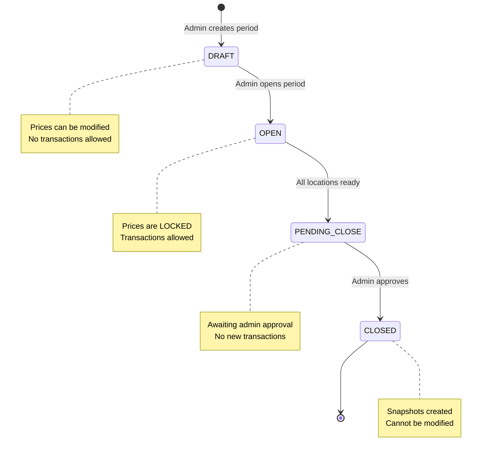
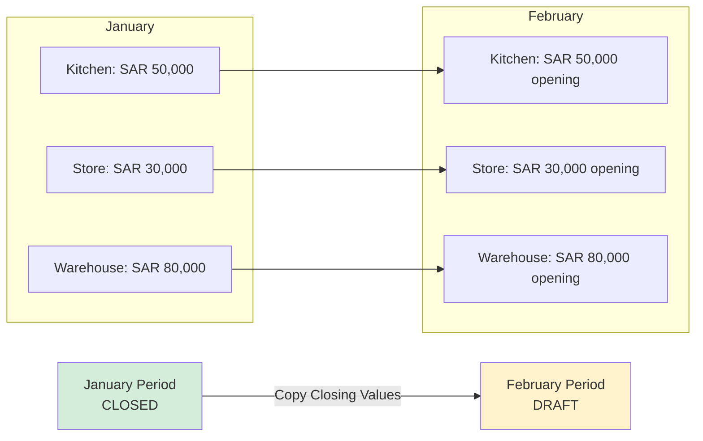
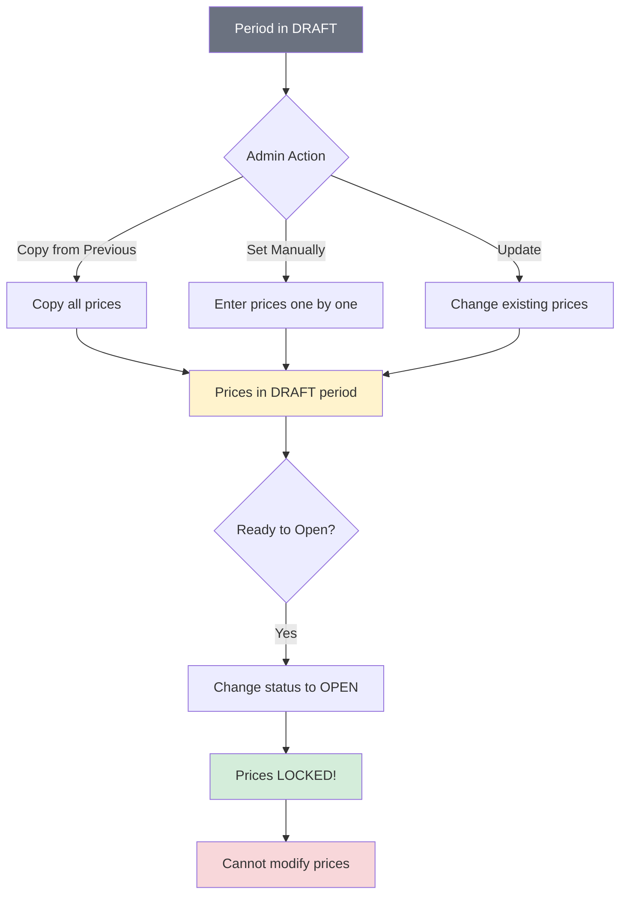
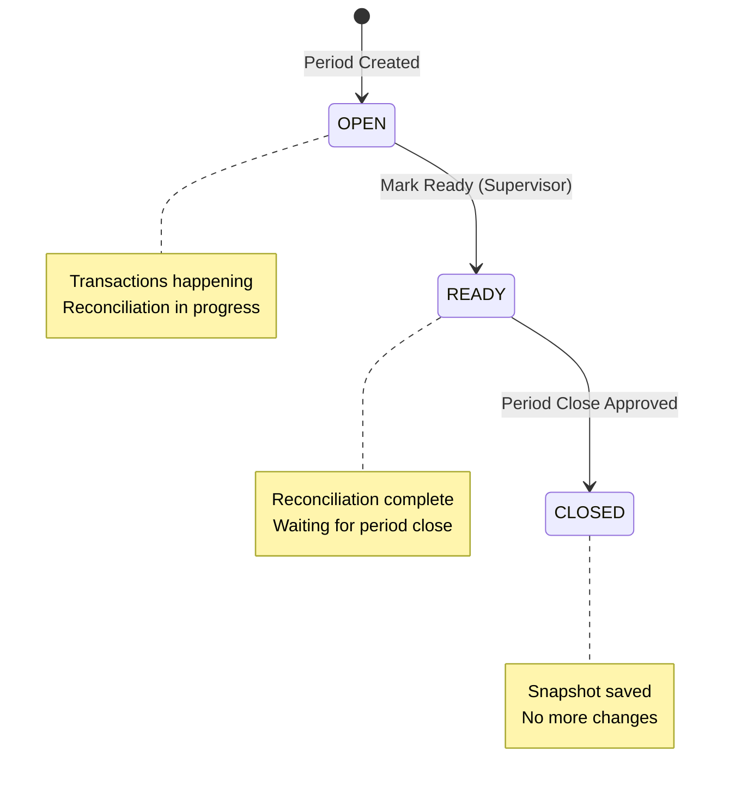
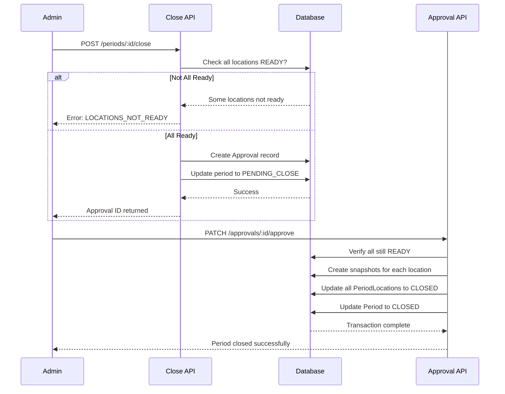
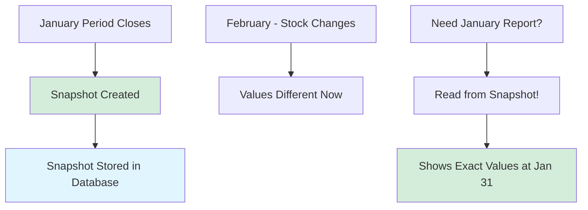
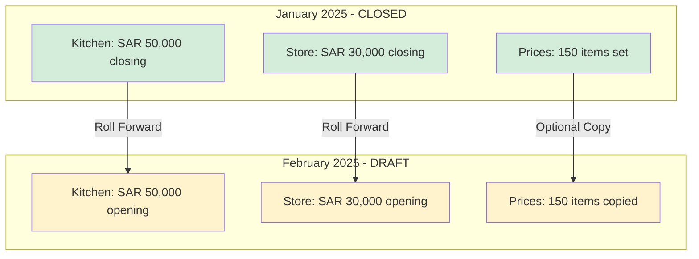
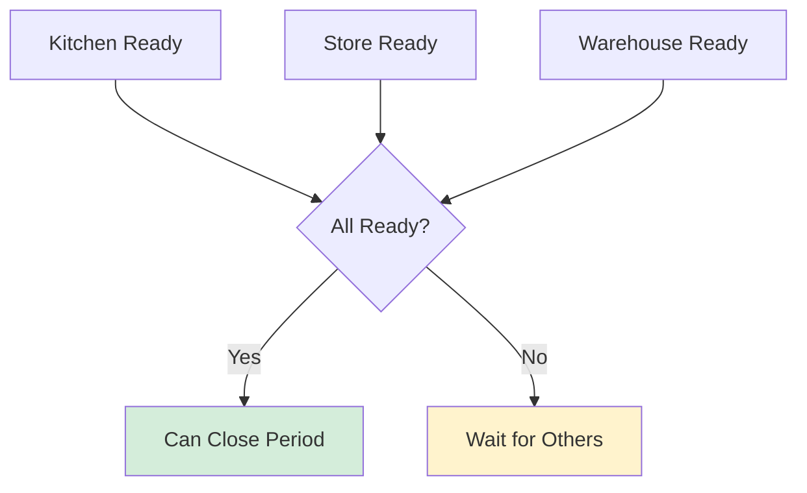

# Phase 3.1: Period Management

## Stock Management System - Development Guide

**For Junior Developers**
**Last Updated:** November 25, 2025
**Phase Status:** ✅ Complete

---

## Quick Navigation

- [Phase 1.1: Project Foundation](../phase1/phase-1.1-foundation.md)
- [Phase 1.2: Database Setup](../phase1/phase-1.2-database.md)
- [Phase 1.3: Authentication & Security](../phase1/phase-1.3-authentication.md)
- [Phase 2.1: Transfer Management](../phase2/phase-2.1-transfers.md)
- [Phase 3.1: Period Management](phase-3.1-period-management.md) ← You are here
- [Phase 3.2: Period Close Workflow](phase-3.2-period-close-workflow.md)
- [Phase 3.3: Period Close UI](phase-3.3-period-close-ui.md)

---

## What is Period Management?

### The Problem

In any business, you need to track finances for specific time periods (usually months). At the end of each period, you need to know:

- How much stock you had at the start of the period?
- How much stock you have at the end of the period?
- What was the total value of your inventory?

**Problems with manual period tracking:**

- ❌ No clear separation between months (data gets mixed)
- ❌ Can't lock previous months (people keep changing old data)
- ❌ No snapshot of stock at period end (values change daily)
- ❌ No coordinated close across all locations
- ❌ Prices can be changed anytime (no control)

### Our Solution

We built a **Period Management System** that:

- ✅ Creates clear boundaries between accounting periods
- ✅ Locks periods after closing (no more changes)
- ✅ Takes snapshots of stock at period end (frozen in time)
- ✅ Coordinates closing across all locations simultaneously
- ✅ Locks prices once period opens (prevents mid-period changes)
- ✅ Rolls forward to next period automatically

### Period Lifecycle



**Key Points:**

- **DRAFT:** Period exists but is not active yet. Prices can be changed.
- **OPEN:** Period is active. Prices are locked. All transactions happen here.
- **PENDING_CLOSE:** All locations are ready. Waiting for admin approval.
- **CLOSED:** Period is finished. Snapshots saved. Cannot change anything.

---

## Phase 3.1 Overview

### What We Built

In this phase, we created the **complete period management system** including API routes, price management, location readiness tracking, period close workflow, and automatic roll forward.

### Key Features

1. **Period Creation** - Admins can create new accounting periods
2. **Price Management** - Set and lock prices per period
3. **Location Readiness** - Track which locations are ready for closing
4. **Period Close** - Close all locations in one atomic transaction
5. **Stock Snapshots** - Capture stock levels at period end
6. **Roll Forward** - Automatically create next period from closed period

### Tasks Completed

**Phase 3.1: Period Lifecycle**

- ✅ 3.1.1: Period API Routes
- ✅ 3.1.2: Period Opening
- ✅ 3.1.3: Period Price Setting

**Phase 3.2: Period Close Workflow**

- ✅ 3.2.1: Location Readiness Tracking
- ✅ 3.2.2: Period Close API
- ✅ 3.2.3: Snapshot Creation
- ✅ 3.2.4: Roll Forward to Next Period

---

## Task 3.1.1: Period API Routes

### Simple Explanation

We created **4 API endpoints** to manage accounting periods - listing all periods, getting the current period, creating new periods, and viewing period details.

### What Was Done

#### Endpoint 1: GET /api/periods

**Purpose:** Get list of all periods with optional filters

**What it does:**

- Returns all periods in the system
- Can filter by status (DRAFT, OPEN, CLOSED, etc.)
- Can filter by date range
- Includes location readiness data

**Example Request:**

```http
GET /api/periods?status=OPEN
```

**Response:**

```json
{
  "periods": [
    {
      "id": "abc123",
      "name": "January 2025",
      "start_date": "2025-01-01",
      "end_date": "2025-01-31",
      "status": "OPEN",
      "period_locations": [
        {
          "location_id": "loc1",
          "status": "OPEN",
          "location": {
            "name": "Main Kitchen",
            "code": "MAIN-KIT"
          }
        }
      ]
    }
  ]
}
```

---

#### Endpoint 2: GET /api/periods/current

**Purpose:** Get the currently active period

**What it does:**

- Finds the period with status = OPEN
- Returns period with all location statuses
- Most frequently used endpoint (needed for all transactions)

---

#### Endpoint 3: POST /api/periods

**Purpose:** Create a new accounting period

**What it does:**

1. Validates input (name, dates)
2. Checks user is ADMIN (only admins can create periods)
3. Checks for overlapping periods
4. Creates PeriodLocation entries for all active locations
5. Copies closing stock values from previous period as opening values

**Example Request:**

```json
{
  "name": "February 2025",
  "start_date": "2025-02-01",
  "end_date": "2025-02-28",
  "status": "DRAFT"
}
```

**Important:** New periods start in DRAFT status so prices can be set before transactions begin.

---

#### Endpoint 4: GET /api/periods/:id

**Purpose:** Get single period details

**What it does:**

- Returns complete period information
- Includes all location statuses with timestamps
- Shows transaction counts (deliveries, issues, etc.)

---

### Key Technical Concepts

#### 1. Overlapping Period Detection

We cannot have two periods that cover the same dates. The system checks for overlaps before creating:

```typescript
// Check for overlapping periods
const overlappingPeriod = await prisma.period.findFirst({
  where: {
    OR: [
      // New period starts during existing period
      {
        AND: [{ start_date: { lte: startDate } }, { end_date: { gte: startDate } }],
      },
      // New period ends during existing period
      {
        AND: [{ start_date: { lte: endDate } }, { end_date: { gte: endDate } }],
      },
      // New period completely contains existing period
      {
        AND: [{ start_date: { gte: startDate } }, { end_date: { lte: endDate } }],
      },
    ],
  },
});

if (overlappingPeriod) {
  throw createError({
    statusCode: 409,
    message: `Period overlaps with '${overlappingPeriod.name}'`,
  });
}
```

**Visual Example:**

```
Existing Period:  |----January----|
                  1st           31st

Case 1: New period starts during existing (OVERLAP!)
                  |--New Period--|
                  15th         15th Feb

Case 2: New period ends during existing (OVERLAP!)
         |--New Period--|
         15th Dec      15th

Case 3: New period contains existing (OVERLAP!)
         |------New Period------|
         15th Dec           15th Feb

Case 4: No overlap (OK!)
                                |--February--|
                                1st Feb    28th
```

---

#### 2. Automatic PeriodLocation Creation

When creating a period, we automatically create tracking records for each active location:

```typescript
// Get all active locations
const activeLocations = await prisma.location.findMany({
  where: { is_active: true },
});

// Create period with PeriodLocation entries
const period = await prisma.period.create({
  data: {
    name: data.name,
    start_date: startDate,
    end_date: endDate,
    status: data.status,
    period_locations: {
      create: activeLocations.map((location) => ({
        location_id: location.id,
        status: "OPEN",
        opening_value: previousClosingValues.get(location.id) || null,
      })),
    },
  },
});
```

This creates a "junction table" that tracks each location's status within each period.

---

#### 3. Stock Value Rollover

When creating a new period, we copy the closing values from the previous period as opening values:



**Why this matters:** Ensures accounting continuity. February's opening stock must equal January's closing stock.

---

### Files Created

| File                                | What It Does                  |
| ----------------------------------- | ----------------------------- |
| `server/api/periods/index.get.ts`   | List all periods with filters |
| `server/api/periods/current.get.ts` | Get current open period       |
| `server/api/periods/index.post.ts`  | Create new period             |
| `server/api/periods/[id].get.ts`    | Get single period details     |

---

## Task 3.1.2: Period Opening

### Simple Explanation

We created a **user interface** where admins can view all periods and create new ones with a simple form.

### What Was Done

#### Period Management Page Features

**1. Period List Display**
Shows all periods in a table with columns:

- Name (January 2025)
- Start Date (01/01/2025)
- End Date (31/01/2025)
- Status (badge with colors)
- Current Period indicator

**2. Create Period Modal**
Form with fields:

- Period Name (text input)
- Start Date (date picker)
- End Date (date picker)
- Initial Status (DRAFT or OPEN)

**3. Status-Based Colors**

| Status        | Color         | Meaning                        |
| ------------- | ------------- | ------------------------------ |
| DRAFT         | Gray          | Period created, not active yet |
| OPEN          | Navy Blue     | Currently active period        |
| PENDING_CLOSE | Amber         | Waiting for admin approval     |
| CLOSED        | Emerald Green | Finished and locked            |

---

#### Stock Value Rollover Logic

When creating a new period, the system:

1. Finds the most recent CLOSED period
2. Gets closing values for each location
3. Sets those values as opening values for the new period

```typescript
// Find the most recent closed period
const previousPeriod = await prisma.period.findFirst({
  where: {
    status: "CLOSED",
    end_date: { lt: startDate },
  },
  orderBy: { end_date: "desc" },
  include: {
    period_locations: {
      select: {
        location_id: true,
        closing_value: true,
      },
    },
  },
});

// Create a map for fast lookup
const previousClosingValues = new Map<string, number>();
if (previousPeriod) {
  previousPeriod.period_locations.forEach((pl) => {
    if (pl.closing_value !== null) {
      previousClosingValues.set(pl.location_id, Number(pl.closing_value));
    }
  });
}
```

---

### Files Created

| File                          | What It Does           |
| ----------------------------- | ---------------------- |
| `app/pages/periods/index.vue` | Period management page |

---

## Task 3.1.3: Period Price Setting

### Simple Explanation

We created a system to **set and lock prices** for each period. Prices can only be changed when the period is in DRAFT status. Once the period is OPEN, prices are locked.

### What Was Done

#### Price Locking Workflow



---

#### API Endpoints for Prices

**1. GET /api/periods/:periodId/prices**
Get all item prices for a period.

**2. POST /api/periods/:periodId/prices**
Set or update prices (only if period is DRAFT).

**3. POST /api/periods/:periodId/prices/copy**
Copy all prices from the previous closed period.

---

#### Copy Prices Feature

**Why we need this:**
Every period needs item prices set. Instead of entering them manually each month, we can copy from the previous period and only change what's different.

**How it works:**

```typescript
// Find the most recent closed period
const previousPeriod = await prisma.period.findFirst({
  where: {
    end_date: { lt: period.start_date },
    status: "CLOSED",
  },
  orderBy: { end_date: "desc" },
  include: {
    item_prices: {
      include: {
        item: { select: { is_active: true } },
      },
    },
  },
});

// Filter only active items
const activePrices = previousPeriod.item_prices.filter((price) => price.item.is_active);

// Copy prices using upsert (insert or update)
const results = await prisma.$transaction(
  activePrices.map((priceData) =>
    prisma.itemPrice.upsert({
      where: {
        item_id_period_id: {
          item_id: priceData.item_id,
          period_id: periodId,
        },
      },
      update: {
        price: priceData.price,
        set_by: user.id,
      },
      create: {
        item_id: priceData.item_id,
        period_id: periodId,
        price: priceData.price,
        currency: priceData.currency,
        set_by: user.id,
      },
    })
  )
);
```

---

#### Price Locking Validation

All price modification endpoints check if the period is in DRAFT status:

```typescript
if (period.status !== "DRAFT") {
  throw createError({
    statusCode: 400,
    data: {
      code: "PERIOD_LOCKED",
      message: "Cannot modify prices - period is not in DRAFT status",
    },
  });
}
```

**Why prices lock when period opens:**

- Prevents unauthorized price changes during active period
- Ensures all deliveries use the same agreed prices
- Creates automatic price variance detection when actual prices differ

---

### Files Created

| File                                                | What It Does              |
| --------------------------------------------------- | ------------------------- |
| `server/api/periods/[periodId]/prices.get.ts`       | Get prices for period     |
| `server/api/periods/[periodId]/prices.post.ts`      | Set/update prices         |
| `server/api/periods/[periodId]/prices/copy.post.ts` | Copy from previous period |
| `app/pages/periods/[periodId]/prices.vue`           | Price management UI       |

---

## Task 3.2.1: Location Readiness Tracking

### Simple Explanation

Before closing a period, each location must be marked as "ready". This ensures all reconciliations are complete and no one is still working on their numbers.

### What Was Done

#### API Endpoint: PATCH /api/periods/:periodId/locations/:locationId/ready

**Purpose:** Mark a location as ready for period close

**What it does:**

1. Checks user is SUPERVISOR or ADMIN
2. Verifies reconciliation exists for this period-location
3. Updates PeriodLocation status to READY
4. Records the ready_at timestamp

**Example Request:**

```http
PATCH /api/periods/abc123/locations/loc456/ready
```

**Business Rule:** Cannot mark ready if reconciliation is not complete!

```typescript
// Check reconciliation exists
const reconciliation = await prisma.reconciliation.findUnique({
  where: {
    period_id_location_id: {
      period_id: periodId,
      location_id: locationId,
    },
  },
});

if (!reconciliation) {
  throw createError({
    statusCode: 400,
    data: {
      code: "RECONCILIATION_NOT_COMPLETED",
      message: "Reconciliation must be completed first",
    },
  });
}
```

---

#### Location Status Flow



---

### Files Created

| File                                                                  | What It Does        |
| --------------------------------------------------------------------- | ------------------- |
| `server/api/periods/[periodId]/locations/[locationId]/ready.patch.ts` | Mark location ready |

---

## Task 3.2.2: Period Close API

### Simple Explanation

We created a **two-step approval process** for closing periods. First, an admin requests the close. Then, another admin (or the same one) approves it. This ensures careful review before finalizing.

### What Was Done

#### Close Request Flow



---

#### Endpoint 1: POST /api/periods/:periodId/close

**Purpose:** Request period close (creates approval request)

**What it does:**

1. Checks user is ADMIN
2. Validates period status is OPEN
3. Checks ALL locations are READY
4. Creates Approval record
5. Updates period status to PENDING_CLOSE

**Validation Example:**

```typescript
// Check all locations are READY
const notReadyLocations = period.period_locations.filter((pl) => pl.status !== "READY");

if (notReadyLocations.length > 0) {
  throw createError({
    statusCode: 400,
    data: {
      code: "LOCATIONS_NOT_READY",
      message: "All locations must be ready",
      notReadyLocations: notReadyLocations.map((pl) => ({
        locationId: pl.location_id,
        locationName: pl.location.name,
        status: pl.status,
      })),
    },
  });
}
```

---

#### Endpoint 2: PATCH /api/approvals/:id/approve

**Purpose:** Approve the close request and execute the period close

**What it does (all in one transaction):**

1. Creates stock snapshots for each location
2. Calculates closing values
3. Updates all PeriodLocation statuses to CLOSED
4. Updates Period status to CLOSED
5. Records approval and close timestamps

---

#### Endpoint 3: PATCH /api/approvals/:id/reject

**Purpose:** Reject the close request

**What it does:**

- Updates approval status to REJECTED
- Reverts period status to OPEN
- Adds rejection comment to notes

---

### Why Two-Step Process?

**Benefits of approval workflow:**

1. **Double-check:** Admin must review before finalizing
2. **Audit trail:** Records who requested and who approved
3. **Cancel option:** Can reject if something is wrong
4. **Time gap:** Allows review between request and approval

---

### Files Created

| File                                          | What It Does              |
| --------------------------------------------- | ------------------------- |
| `server/api/periods/[periodId]/close.post.ts` | Request period close      |
| `server/api/approvals/[id].get.ts`            | Get approval details      |
| `server/api/approvals/[id]/approve.patch.ts`  | Approve and execute close |
| `server/api/approvals/[id]/reject.patch.ts`   | Reject close request      |

---

## Task 3.2.3: Snapshot Creation

### Simple Explanation

When we close a period, we take a "photograph" of all stock levels at that moment. This is called a **snapshot**. It captures exactly what was in each location when the period ended.

### What Was Done

#### What's in a Snapshot?

Each location gets a snapshot containing:

**1. Stock Items:**

- Item code, name, unit
- Quantity on hand
- WAC (Weighted Average Cost)
- Total value (quantity × WAC)

**2. Reconciliation Summary:**

- Opening stock value
- Receipts (deliveries)
- Transfers in/out
- Issues
- Adjustments
- Back charges
- Credits
- Condemnations
- Calculated closing (expected)
- Variance (difference)

---

#### Snapshot Data Structure

```typescript
interface LocationSnapshot {
  location_id: string;
  location_code: string;
  location_name: string;
  total_value: number;
  item_count: number;
  items: StockSnapshot[];
  reconciliation: ReconciliationSnapshot | null;
  snapshot_timestamp: string;
}

interface StockSnapshot {
  item_id: string;
  item_code: string;
  item_name: string;
  item_unit: string;
  quantity: number;
  wac: number;
  value: number;
}

interface ReconciliationSnapshot {
  opening_stock: number;
  receipts: number;
  transfers_in: number;
  transfers_out: number;
  issues: number;
  closing_stock: number;
  adjustments: number;
  back_charges: number;
  credits: number;
  condemnations: number;
  calculated_closing: number;
  variance: number;
}
```

---

#### How Snapshots are Created

```typescript
// Fetch all stock data for all locations
const allLocationStock = await prisma.locationStock.findMany({
  where: {
    location_id: { in: locationIds },
    on_hand: { gt: 0 }, // Only items with stock
  },
  include: {
    item: {
      select: {
        id: true,
        code: true,
        name: true,
        unit: true,
      },
    },
  },
});

// Build snapshot for each location
for (const pl of period.period_locations) {
  const locationStock = allLocationStock.filter((s) => s.location_id === pl.location_id);

  const items = locationStock.map((s) => ({
    item_id: s.item.id,
    item_code: s.item.code,
    item_name: s.item.name,
    item_unit: s.item.unit,
    quantity: Number(s.on_hand),
    wac: Number(s.wac),
    value: Number(s.on_hand) * Number(s.wac),
  }));

  const totalValue = items.reduce((sum, item) => sum + item.value, 0);

  snapshot = {
    location_id: pl.location.id,
    location_code: pl.location.code,
    location_name: pl.location.name,
    total_value: totalValue,
    item_count: items.length,
    items: items,
    reconciliation: reconciliationData,
    snapshot_timestamp: new Date().toISOString(),
  };
}
```

---

#### Why Snapshots Matter



**Without snapshots:** If you look at January's data in March, you see current values (wrong!)

**With snapshots:** You see exactly what was there on January 31st (correct!)

---

### Files Modified

| File                                         | What Changed                          |
| -------------------------------------------- | ------------------------------------- |
| `server/api/approvals/[id]/approve.patch.ts` | Added comprehensive snapshot creation |

---

## Task 3.2.4: Roll Forward to Next Period

### Simple Explanation

After closing a period, admins need to create the next one. The **Roll Forward** feature does this automatically - creating the next period and copying over the important data.

### What Was Done

#### API Endpoint: POST /api/periods/:periodId/roll-forward

**Purpose:** Create the next period from a closed period

**What it does:**

1. Validates source period is CLOSED
2. Calculates next period dates (starts day after source ends)
3. Creates new period in DRAFT status
4. Copies closing values as opening values
5. Optionally copies item prices

---

#### Roll Forward Diagram



---

#### Automatic Date Calculation

```typescript
// Start date is day after source period ends
const sourceEndDate = new Date(sourcePeriod.end_date);
const newStartDate = new Date(sourceEndDate);
newStartDate.setDate(newStartDate.getDate() + 1);

// End date is last day of the month
function getLastDayOfMonth(date: Date): Date {
  const year = date.getFullYear();
  const month = date.getMonth();
  // First day of next month, minus 1 day
  return new Date(year, month + 1, 0);
}

const newEndDate = getLastDayOfMonth(newStartDate);
```

**Example:**

- January ends: 31/01/2025
- February starts: 01/02/2025 (next day)
- February ends: 28/02/2025 (last day of month)

---

#### Request Body (All Optional)

```json
{
  "name": "Custom February Name",
  "end_date": "2025-02-28",
  "copy_prices": true
}
```

If not provided:

- `name`: Auto-generated (e.g., "February 2025")
- `end_date`: Last day of the month
- `copy_prices`: true (copies prices by default)

---

#### Response Example

```json
{
  "message": "Period rolled forward successfully",
  "sourcePeriod": {
    "id": "jan-123",
    "name": "January 2025",
    "status": "CLOSED"
  },
  "newPeriod": {
    "id": "feb-456",
    "name": "February 2025",
    "status": "DRAFT",
    "locations": [
      {
        "locationId": "loc1",
        "locationName": "Kitchen",
        "openingValue": 50000
      }
    ]
  },
  "summary": {
    "locationsCreated": 3,
    "locationsWithOpeningValue": 3,
    "totalOpeningValue": 160000,
    "pricesCopied": 150
  },
  "nextSteps": [
    "Review and adjust item prices if needed",
    "Change period status to OPEN to allow transactions"
  ]
}
```

---

### Files Created

| File                                                 | What It Does                |
| ---------------------------------------------------- | --------------------------- |
| `server/api/periods/[periodId]/roll-forward.post.ts` | Roll forward to next period |

---

## Important Files Created in This Phase

### API Routes

| File                                                                  | Lines | Purpose                   |
| --------------------------------------------------------------------- | ----- | ------------------------- |
| `server/api/periods/index.get.ts`                                     | ~80   | List periods with filters |
| `server/api/periods/current.get.ts`                                   | ~60   | Get current open period   |
| `server/api/periods/index.post.ts`                                    | ~220  | Create new period         |
| `server/api/periods/[id].get.ts`                                      | ~100  | Get period details        |
| `server/api/periods/[periodId]/prices.get.ts`                         | ~80   | Get period prices         |
| `server/api/periods/[periodId]/prices.post.ts`                        | ~150  | Set/update prices         |
| `server/api/periods/[periodId]/prices/copy.post.ts`                   | ~215  | Copy from previous        |
| `server/api/periods/[periodId]/locations/[locationId]/ready.patch.ts` | ~200  | Mark location ready       |
| `server/api/periods/[periodId]/close.post.ts`                         | ~235  | Request period close      |
| `server/api/periods/[periodId]/roll-forward.post.ts`                  | ~365  | Roll forward to next      |
| `server/api/approvals/[id].get.ts`                                    | ~80   | Get approval details      |
| `server/api/approvals/[id]/approve.patch.ts`                          | ~495  | Approve and execute       |
| `server/api/approvals/[id]/reject.patch.ts`                           | ~100  | Reject request            |

### Frontend Pages

| File                                      | Lines | Purpose                |
| ----------------------------------------- | ----- | ---------------------- |
| `app/pages/periods/index.vue`             | ~300  | Period management page |
| `app/pages/periods/[periodId]/prices.vue` | ~400  | Price management page  |

**Total:** ~3,080 lines of code

---

## Key Concepts Learned

### 1. State Machine Pattern

A period goes through specific states in a specific order:

```
DRAFT → OPEN → PENDING_CLOSE → CLOSED
```

**Rules:**

- Cannot skip states (no DRAFT → CLOSED directly)
- Cannot go backwards (no OPEN → DRAFT)
- Each state has specific allowed actions

**Implementation:**

```typescript
// Before any operation, check current state
if (period.status !== "OPEN") {
  throw createError({
    statusCode: 400,
    message: `Cannot perform this action - period is ${period.status}`,
  });
}
```

---

### 2. Multi-Location Coordination

All locations must be ready before closing. This is a "barrier" pattern:



**Why this matters:** Ensures no location is left behind. All close together or none close.

---

### 3. Atomic Transactions

When closing a period, multiple operations must happen together:

```typescript
await prisma.$transaction(async (tx) => {
  // 1. Update approval status
  await tx.approval.update({ ... });

  // 2. Update each PeriodLocation
  for (const location of locations) {
    await tx.periodLocation.update({
      data: {
        status: "CLOSED",
        closing_value: snapshot.total_value,
        snapshot_data: snapshot,
      },
    });
  }

  // 3. Update Period status
  await tx.period.update({
    data: { status: "CLOSED" },
  });
});
```

If ANY operation fails, ALL operations are cancelled. This prevents partial closes.

---

### 4. Data Locking for Integrity

**Price Locking:**

```typescript
// Prices locked when period status is not DRAFT
if (period.status !== "DRAFT") {
  throw createError({
    statusCode: 400,
    message: "Prices are locked for this period",
  });
}
```

**Period Locking:**

```typescript
// Closed periods cannot be modified
if (period.status === "CLOSED") {
  throw createError({
    statusCode: 400,
    message: "Cannot modify a closed period",
  });
}
```

---

### 5. Approval Workflow Pattern

Two-step process for important operations:

**Step 1: Request**

```typescript
const approval = await prisma.approval.create({
  data: {
    entity_type: "PERIOD_CLOSE",
    entity_id: periodId,
    status: "PENDING",
    requested_by: user.id,
  },
});
```

**Step 2: Approve (or Reject)**

```typescript
await prisma.approval.update({
  where: { id: approvalId },
  data: {
    status: "APPROVED",
    reviewed_by: adminId,
    reviewed_at: new Date(),
  },
});
```

---

## Common Terms Explained

| Term                   | Simple Explanation                                      |
| ---------------------- | ------------------------------------------------------- |
| **Period**             | A time range (usually one month) for tracking finances  |
| **PeriodLocation**     | A record tracking one location's status within a period |
| **Snapshot**           | A "photograph" of data at a specific moment in time     |
| **Roll Forward**       | Creating the next period from a closed period           |
| **Price Locking**      | Preventing price changes after period opens             |
| **Location Ready**     | A location has completed its reconciliation             |
| **Period Close**       | The process of finalizing a period                      |
| **Approval**           | A request that needs review before execution            |
| **Opening Value**      | Stock value at the start of a period                    |
| **Closing Value**      | Stock value at the end of a period                      |
| **Overlapping Period** | Two periods covering the same dates (not allowed)       |
| **Atomic Transaction** | Multiple operations that succeed or fail together       |

---

## Common Issues and Solutions

### Issue 1: Cannot Create Period - Overlapping

**Symptoms:**

- Error: "Period overlaps with existing period"
- Cannot create January period

**Cause:** Another period already covers those dates

**Solution:**

```typescript
// Check existing periods first
const existingPeriods = await $fetch("/api/periods");
console.log("Existing periods:", existingPeriods);

// Make sure dates don't overlap
// January 2025 should be: 2025-01-01 to 2025-01-31
// February 2025 should be: 2025-02-01 to 2025-02-28
```

---

### Issue 2: Cannot Close Period - Locations Not Ready

**Symptoms:**

- Error: "All locations must be ready"
- Close button doesn't work

**Cause:** Some locations haven't been marked as ready

**Solution:**

```typescript
// Check which locations are not ready
const period = await $fetch(`/api/periods/${periodId}`);
const notReady = period.period_locations.filter((pl) => pl.status !== "READY");
console.log("Locations not ready:", notReady);

// Each location needs reconciliation first
// Then mark as ready using:
// PATCH /api/periods/:periodId/locations/:locationId/ready
```

---

### Issue 3: Cannot Modify Prices - Period Locked

**Symptoms:**

- Price inputs are disabled
- Error: "Cannot modify prices"

**Cause:** Period is not in DRAFT status

**Solution:**

```typescript
// Check period status
const period = await $fetch(`/api/periods/${periodId}`);
console.log("Period status:", period.status);

// Only DRAFT periods allow price changes
// If period is OPEN, prices are locked
// You would need to create a new period to change prices
```

---

### Issue 4: Roll Forward Failed - Period Not Closed

**Symptoms:**

- Error: "Cannot roll forward a period that is not closed"

**Cause:** Trying to roll forward from an OPEN or DRAFT period

**Solution:**

```typescript
// Can only roll forward from CLOSED periods
const period = await $fetch(`/api/periods/${periodId}`);
if (period.status !== "CLOSED") {
  console.log("Period must be closed first");
  // Complete the close workflow first
}
```

---

### Issue 5: Snapshot Missing Data

**Symptoms:**

- Snapshot shows empty items array
- Total value is 0

**Cause:** LocationStock records don't exist or have 0 quantity

**Solution:**

```typescript
// Check actual stock levels
const stock = await $fetch(`/api/locations/${locationId}/stock`);
console.log("Stock items:", stock);

// Snapshot only includes items where on_hand > 0
// Make sure deliveries have been posted
```

---

## Testing Checklist

### Manual Testing Steps

**1. Period Creation**

- [ ] Form loads correctly
- [ ] Date validation works (end must be after start)
- [ ] Overlapping period error shows correctly
- [ ] Success message after creation
- [ ] Redirect to periods list

**2. Period Opening (DRAFT → OPEN)**

- [ ] Only admins can change status
- [ ] Prices are locked after opening
- [ ] Status badge updates correctly

**3. Price Management**

- [ ] "Copy from Previous" button works
- [ ] Manual price entry works
- [ ] Prices disabled when period not DRAFT
- [ ] Warning message shows for locked periods

**4. Location Readiness**

- [ ] Cannot mark ready without reconciliation
- [ ] Only supervisor/admin can mark ready
- [ ] Ready timestamp recorded
- [ ] Status badge updates

**5. Period Close Request**

- [ ] Error if locations not ready
- [ ] Approval record created
- [ ] Period status changes to PENDING_CLOSE

**6. Period Close Approval**

- [ ] Snapshots created for all locations
- [ ] Closing values calculated correctly
- [ ] All PeriodLocations set to CLOSED
- [ ] Period status set to CLOSED

**7. Roll Forward**

- [ ] Can only roll forward CLOSED periods
- [ ] New period created with correct dates
- [ ] Opening values match closing values
- [ ] Prices copied (if option enabled)
- [ ] New period in DRAFT status

**8. Error Scenarios**

- [ ] Overlapping period error
- [ ] Insufficient permissions error
- [ ] Invalid status transitions error
- [ ] Missing reconciliation error

---

## What's Next?

After completing Period Management (Phase 3.1 and 3.2), the next phases are:

**→ Phase 3.3: Period Close UI** ✅ Complete

- Period close page with checklist
- Visual location readiness tracking
- Close confirmation modal
- Approval workflow UI

**→ Phase 3.4: Reporting & Exports** (Days 28-30)

- Stock reports
- Reconciliation reports
- Delivery/Issue reports
- CSV export functionality

---

## Summary

In Phase 3.1 and 3.2, we built a complete period management system with:

✅ **4 Core API endpoints** for period CRUD operations

✅ **3 Price management endpoints** with copy from previous and locking

✅ **2 Frontend pages** for period and price management

✅ **Location readiness tracking** ensuring all reconciliations complete

✅ **Two-step approval workflow** for period close

✅ **Comprehensive snapshots** capturing stock and reconciliation data

✅ **Automatic roll forward** to create next period from closed one

✅ **State machine validation** preventing invalid status transitions

✅ **Atomic transactions** ensuring data consistency

✅ **Role-based access control** restricting operations to admins

The period management system provides the foundation for proper financial tracking, ensuring clear boundaries between accounting periods, locked historical data, and coordinated closes across all locations.

---

**Made for Junior Developers**

---

**Last Updated:** November 25, 2025
**Phase:** 3.1 & 3.2 Period Management ✅ Complete
**Next:** [Phase 3.3 Period Close UI](phase-3.3-period-close-ui.md) ✅ Complete
