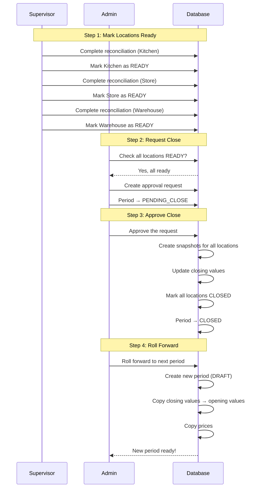
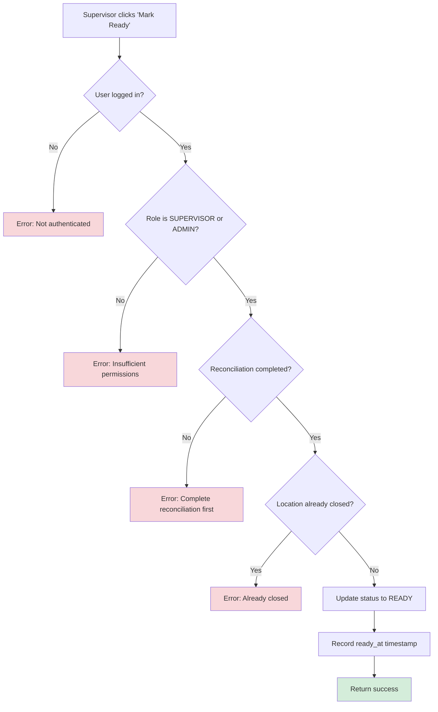
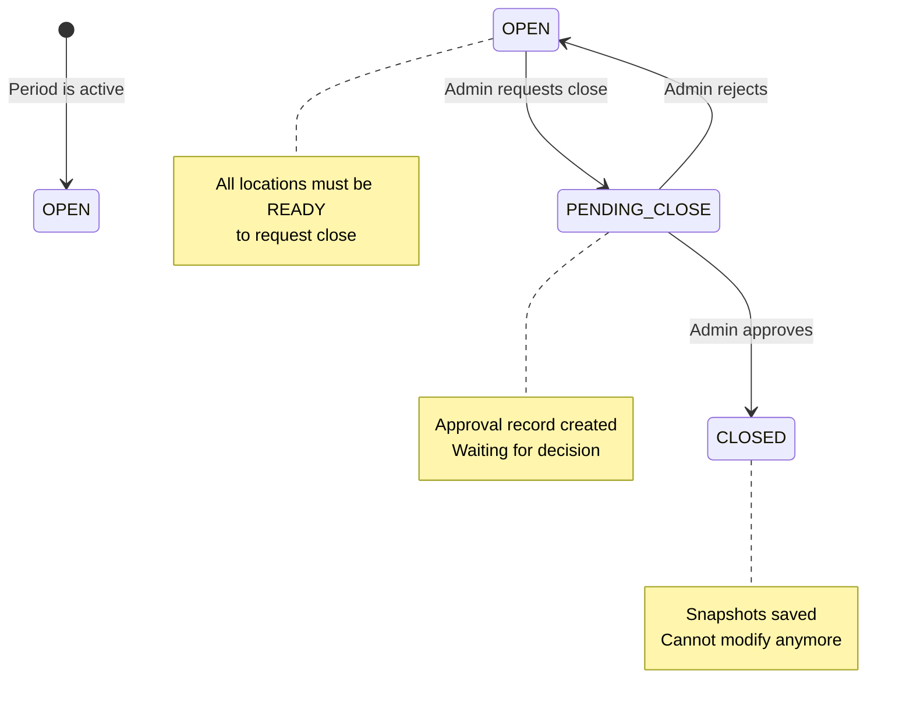

# Phase 3.2: Period Close Workflow

## Stock Management System - Development Guide

**For Junior Developers**
**Last Updated:** November 25, 2025
**Phase Status:** ✅ Complete

---

## Quick Navigation

- [Phase 1.1: Project Foundation](../phase1/phase-1.1-foundation.md)
- [Phase 1.2: Database Setup](../phase1/phase-1.2-database.md)
- [Phase 1.3: Authentication & Security](../phase1/phase-1.3-authentication.md)
- [Phase 2.1: Transfer Management](../phase2/phase-2.1-transfers.md)
- [Phase 3.1: Period Management](phase-3.1-period-management.md)
- [Phase 3.2: Period Close Workflow](phase-3.2-period-close-workflow.md) ← You are here

---

## What is Period Close Workflow?

### The Problem

In a business with multiple locations (Kitchen, Store, Warehouse), closing an accounting period is difficult:

- ❌ How do we know if all locations finished their work?
- ❌ What if one location closes but another is still working?
- ❌ How do we save the stock values at the exact moment of closing?
- ❌ What happens after closing? How do we start the next period?

### Our Solution

We built a **Period Close Workflow** that:

- ✅ Tracks when each location is ready to close
- ✅ Requires all locations to be ready before closing
- ✅ Uses an approval system (request → approve/reject)
- ✅ Takes snapshots of all stock at the moment of closing
- ✅ Automatically creates the next period (roll forward)

### The Complete Flow



---

## Phase 3.2 Overview

### What We Built

In this phase, we created the **complete period close workflow** with location readiness tracking, approval-based closing, comprehensive stock snapshots, and automatic roll forward to the next period.

### Tasks Completed

| Task  | Description                 | Status      |
| ----- | --------------------------- | ----------- |
| 3.2.1 | Location Readiness Tracking | ✅ Complete |
| 3.2.2 | Period Close API            | ✅ Complete |
| 3.2.3 | Snapshot Creation           | ✅ Complete |
| 3.2.4 | Roll Forward to Next Period | ✅ Complete |

---

## Task 3.2.1: Location Readiness Tracking

### Simple Explanation

Before we can close a period, each location must tell us "I am ready". This is like a checklist - we need all items checked before we can proceed.

**Why do we need this?**

- Ensures all reconciliations are complete
- Prevents closing when some location is still working
- Creates a clear handoff point from Supervisors to Admins

### What Was Built

#### API Endpoint

**PATCH /api/periods/:periodId/locations/:locationId/ready**

This endpoint marks a single location as ready for period close.

**Who can use it:** SUPERVISOR or ADMIN only

**What it checks:**

1. User is logged in
2. User has correct role (SUPERVISOR or ADMIN)
3. Period exists
4. Location exists
5. Reconciliation is complete for this period-location
6. Location is not already closed

### How It Works



### Code Explanation

**File:** `server/api/periods/[periodId]/locations/[locationId]/ready.patch.ts`

**Step 1: Check Authentication and Role**

```typescript
// Check user is logged in
if (!user) {
  throw createError({
    statusCode: 401,
    data: {
      code: "NOT_AUTHENTICATED",
      message: "You must be logged in",
    },
  });
}

// Check user role
if (user.role !== "SUPERVISOR" && user.role !== "ADMIN") {
  throw createError({
    statusCode: 403,
    data: {
      code: "INSUFFICIENT_PERMISSIONS",
      message: "Only supervisors or admins can mark locations as ready",
    },
  });
}
```

**What this does:**

- First, we check if `user` exists (user is logged in)
- Then we check if user's role is SUPERVISOR or ADMIN
- If not, we throw an error with status code 403 (Forbidden)

**Step 2: Check Reconciliation is Complete**

```typescript
// Check that reconciliation has been completed
const reconciliation = await prisma.reconciliation.findUnique({
  where: {
    period_id_location_id: {
      period_id: periodId,
      location_id: locationId,
    },
  },
});

if (!reconciliation) {
  throw createError({
    statusCode: 400,
    data: {
      code: "RECONCILIATION_NOT_COMPLETED",
      message: "Reconciliation must be completed first",
    },
  });
}
```

**What this does:**

- Uses Prisma's `findUnique` with a composite key (`period_id_location_id`)
- A composite key is a unique identifier made of two fields together
- If no reconciliation exists, we cannot mark as ready

**Step 3: Update the Status**

```typescript
const updatedPeriodLocation = await prisma.periodLocation.update({
  where: {
    period_id_location_id: {
      period_id: periodId,
      location_id: locationId,
    },
  },
  data: {
    status: "READY",
    ready_at: new Date(),
  },
  include: {
    location: { select: { id: true, code: true, name: true, type: true } },
    period: { select: { id: true, name: true, status: true } },
  },
});
```

**What this does:**

- Updates the `PeriodLocation` record with new status
- Sets `status` to "READY"
- Records `ready_at` timestamp (current date/time)
- Returns the updated record with related location and period info

### Example API Request and Response

**Request:**

```http
PATCH /api/periods/period-123/locations/kitchen-456/ready
Authorization: Bearer <token>
```

**Success Response (200):**

```json
{
  "periodLocation": {
    "period_id": "period-123",
    "location_id": "kitchen-456",
    "status": "READY",
    "ready_at": "2025-11-25T14:30:00.000Z",
    "location": {
      "id": "kitchen-456",
      "code": "KITCHEN",
      "name": "Main Kitchen",
      "type": "KITCHEN"
    },
    "period": {
      "id": "period-123",
      "name": "November 2025",
      "status": "OPEN"
    }
  },
  "message": "Location marked as ready for period close"
}
```

**Error Response (400) - No Reconciliation:**

```json
{
  "statusCode": 400,
  "data": {
    "code": "RECONCILIATION_NOT_COMPLETED",
    "message": "Reconciliation must be completed first"
  }
}
```

---

## Task 3.2.2: Period Close API

### Simple Explanation

Closing a period is a big action that affects all locations. We use a **two-step approval process** to make sure it's done carefully:

1. **Step 1 (Request):** Admin asks to close the period
2. **Step 2 (Approve/Reject):** Admin approves or rejects the request

This is similar to how you need two people to approve a large bank transfer.

### What Was Built

#### 4 API Endpoints

| Endpoint                            | Purpose                   |
| ----------------------------------- | ------------------------- |
| `POST /api/periods/:periodId/close` | Request period close      |
| `GET /api/approvals/:id`            | Get approval details      |
| `PATCH /api/approvals/:id/approve`  | Approve and execute close |
| `PATCH /api/approvals/:id/reject`   | Reject the request        |

### How the Approval Workflow Works



### Part A: Requesting Period Close

**File:** `server/api/periods/[periodId]/close.post.ts`

**What this endpoint does:**

1. Checks user is ADMIN
2. Verifies period status is OPEN
3. Checks ALL locations are READY
4. Creates an Approval record
5. Changes period status to PENDING_CLOSE

**Key Validation - All Locations Must Be Ready:**

```typescript
// Fetch period with all location statuses
const period = await prisma.period.findUnique({
  where: { id: periodId },
  include: {
    period_locations: {
      include: {
        location: { select: { id: true, code: true, name: true } },
      },
    },
  },
});

// Find locations that are NOT ready
const notReadyLocations = period.period_locations.filter((pl) => pl.status !== "READY");

// If any location is not ready, throw error
if (notReadyLocations.length > 0) {
  throw createError({
    statusCode: 400,
    data: {
      code: "LOCATIONS_NOT_READY",
      message: "All locations must be ready",
      notReadyLocations: notReadyLocations.map((pl) => ({
        locationId: pl.location_id,
        locationName: pl.location.name,
        status: pl.status, // Shows current status (OPEN, not READY)
      })),
    },
  });
}
```

**What this code does:**

- Uses `filter()` to find all locations where status is NOT "READY"
- If we find any, we return an error with the list of locations
- This helps the user know exactly which locations need attention

**Creating the Approval Record:**

```typescript
const result = await prisma.$transaction(async (tx) => {
  // Create approval record
  const approval = await tx.approval.create({
    data: {
      entity_type: "PERIOD_CLOSE",
      entity_id: periodId,
      status: "PENDING",
      requested_by: user.id,
    },
  });

  // Update period status and link approval
  const updatedPeriod = await tx.period.update({
    where: { id: periodId },
    data: {
      status: "PENDING_CLOSE",
      approval_id: approval.id,
    },
  });

  return { approval, period: updatedPeriod };
});
```

**What this code does:**

- Uses `$transaction` to run multiple operations together
- Creates an Approval record with entity_type = "PERIOD_CLOSE"
- Updates the Period to PENDING_CLOSE status
- Links the approval to the period
- If anything fails, both operations are cancelled (atomic)

### Part B: Approving Period Close

**File:** `server/api/approvals/[id]/approve.patch.ts`

**What this endpoint does:**

1. Finds the approval record
2. Checks it's still PENDING
3. Routes to the correct handler based on entity_type
4. For PERIOD_CLOSE: Creates snapshots and closes everything

**The Switch Statement:**

```typescript
switch (approval.entity_type) {
  case "PERIOD_CLOSE":
    return await handlePeriodCloseApproval(approval.id, approval.entity_id, user.id);

  case "TRANSFER":
    // Not implemented yet
    throw createError({
      statusCode: 501,
      message: "Transfer approval not yet implemented",
    });

  case "PRF":
  case "PO":
    // Not implemented yet
    throw createError({
      statusCode: 501,
      message: `${approval.entity_type} approval not yet implemented`,
    });

  default:
    throw createError({
      statusCode: 400,
      message: `Unknown entity type: ${approval.entity_type}`,
    });
}
```

**What this code does:**

- Uses a `switch` statement to handle different approval types
- Each approval type (PERIOD_CLOSE, TRANSFER, PRF, PO) has different logic
- Currently only PERIOD_CLOSE is implemented
- Others return 501 (Not Implemented)

### Part C: Rejecting Period Close

**File:** `server/api/approvals/[id]/reject.patch.ts`

**What happens when rejected:**

```typescript
async function handlePeriodCloseRejection(approvalId, periodId, reviewerId, comments, now) {
  const result = await prisma.$transaction(async (tx) => {
    // Update approval to REJECTED
    const updatedApproval = await tx.approval.update({
      where: { id: approvalId },
      data: {
        status: "REJECTED",
        reviewed_by: reviewerId,
        reviewed_at: now,
        comments, // Optional rejection reason
      },
    });

    // Revert period status back to OPEN
    const updatedPeriod = await tx.period.update({
      where: { id: periodId },
      data: {
        status: "OPEN",
        approval_id: null, // Remove the approval link
      },
    });

    return { approval: updatedApproval, period: updatedPeriod };
  });

  return {
    message: "Period close request rejected - period reverted to OPEN status",
  };
}
```

**What this code does:**

- Updates approval status to "REJECTED"
- Records who rejected and when
- Saves the rejection comment (if provided)
- Reverts the period back to "OPEN" status
- Locations stay as "READY" so they don't need to mark ready again

---

## Task 3.2.3: Snapshot Creation

### Simple Explanation

When we close a period, we need to save a "photograph" of all stock at that exact moment. This photograph is called a **snapshot**. Even if stock changes later, we can always look back and see exactly what we had when the period closed.

### Why Snapshots Matter

```
Without Snapshots:                    With Snapshots:
-------------------                   -----------------
January closes with                   January snapshot saved:
Kitchen = SAR 50,000                  Kitchen = SAR 50,000

February: Stock changes               February: Stock changes
Kitchen = SAR 65,000                  Kitchen = SAR 65,000

March: Need January report            March: Need January report
Kitchen shows SAR 65,000 ❌           Kitchen shows SAR 50,000 ✅
(WRONG - shows current!)              (CORRECT - shows Jan value!)
```

### What's Saved in a Snapshot

Each location's snapshot contains two main parts:

**Part 1: Stock Items**

```typescript
interface StockSnapshot {
  item_id: string; // Item identifier
  item_code: string; // e.g., "RICE-001"
  item_name: string; // e.g., "Basmati Rice"
  item_unit: string; // e.g., "KG"
  quantity: number; // e.g., 150 (on hand)
  wac: number; // e.g., 12.50 (weighted average cost)
  value: number; // quantity × wac = 1875.00
}
```

**Part 2: Reconciliation Summary**

```typescript
interface ReconciliationSnapshot {
  opening_stock: number; // Value at period start
  receipts: number; // Deliveries received
  transfers_in: number; // Stock transferred in
  transfers_out: number; // Stock transferred out
  issues: number; // Stock issued to cost centers
  adjustments: number; // Manual adjustments
  back_charges: number; // Charges back to supplier
  credits: number; // Credit notes received
  condemnations: number; // Damaged/spoiled stock
  closing_stock: number; // Actual value at period end
  calculated_closing: number; // Expected value (math)
  variance: number; // Difference (actual - expected)
}
```

### How Variance is Calculated

```typescript
// Calculate expected closing
// Formula: What we started with + what came in - what went out
const calculatedClosing =
  openingStock +
  receipts +
  transfersIn -
  transfersOut -
  issues +
  adjustments -
  backCharges +
  credits -
  condemnations;

// Variance = What we actually have - What we expected
const variance = closingStock - calculatedClosing;
```

**Example:**

```
Opening Stock:     SAR 10,000
+ Receipts:        SAR  5,000
+ Transfers In:    SAR  2,000
- Transfers Out:   SAR  1,000
- Issues:          SAR  3,000
+ Adjustments:     SAR    500
- Back Charges:    SAR    200
+ Credits:         SAR    100
- Condemnations:   SAR    300
= Calculated:      SAR 13,100 (expected)

Actual Closing:    SAR 13,000

Variance:          SAR   -100 (missing SAR 100)
```

### How Snapshots are Created in Code

**File:** `server/api/approvals/[id]/approve.patch.ts` (inside `handlePeriodCloseApproval`)

**Step 1: Fetch All Stock Data**

```typescript
// Get all stock items for all locations in this period
const allLocationStock = await prisma.locationStock.findMany({
  where: {
    location_id: { in: locationIds }, // All location IDs
    on_hand: { gt: 0 }, // Only items with stock > 0
  },
  include: {
    item: {
      select: { id: true, code: true, name: true, unit: true },
    },
  },
});
```

**What this does:**

- Fetches all LocationStock records for the locations
- Only includes items where `on_hand > 0` (has stock)
- Includes related item information (code, name, unit)

**Step 2: Fetch All Reconciliations**

```typescript
// Get all reconciliations for all locations
const allReconciliations = await prisma.reconciliation.findMany({
  where: {
    period_id: periodId,
    location_id: { in: locationIds },
  },
});

// Create a Map for fast lookup
const reconciliationsByLocation = new Map<string, ReconciliationSnapshot>();
for (const recon of allReconciliations) {
  // Process each reconciliation...
  reconciliationsByLocation.set(recon.location_id, {
    // ... snapshot data
  });
}
```

**What this does:**

- Fetches all reconciliations in one query (efficient)
- Creates a JavaScript Map for O(1) lookup by location ID
- O(1) means constant time - very fast regardless of data size

**Step 3: Build Snapshot for Each Location**

```typescript
const snapshotsByLocation = new Map<string, LocationSnapshot>();

for (const pl of period.period_locations) {
  // Filter stock for this specific location
  const locationStock = allLocationStock.filter((s) => s.location_id === pl.location_id);

  // Transform to snapshot format
  const items = locationStock.map((s) => ({
    item_id: s.item.id,
    item_code: s.item.code,
    item_name: s.item.name,
    item_unit: s.item.unit,
    quantity: Number(s.on_hand),
    wac: Number(s.wac),
    value: Math.round(Number(s.on_hand) * Number(s.wac) * 100) / 100,
  }));

  // Calculate total value
  const totalValue = items.reduce((sum, item) => sum + item.value, 0);

  // Get reconciliation for this location
  const reconciliation = reconciliationsByLocation.get(pl.location_id) || null;

  // Store the snapshot
  snapshotsByLocation.set(pl.location_id, {
    location_id: pl.location.id,
    location_code: pl.location.code,
    location_name: pl.location.name,
    total_value: totalValue,
    item_count: items.length,
    items: items,
    reconciliation: reconciliation,
    snapshot_timestamp: now.toISOString(),
  });
}
```

**What this does:**

- Loops through each location in the period
- Filters the stock data for that specific location
- Uses `map()` to transform each stock record into snapshot format
- Uses `reduce()` to calculate total value
- Gets reconciliation from the Map (or null if none)
- Stores the complete snapshot

**Step 4: Save Snapshots to Database**

```typescript
await prisma.$transaction(async (tx) => {
  for (const [locationId, snapshot] of snapshotsByLocation) {
    await tx.periodLocation.update({
      where: {
        period_id_location_id: {
          period_id: periodId,
          location_id: locationId,
        },
      },
      data: {
        status: "CLOSED",
        closing_value: snapshot.total_value,
        snapshot_data: snapshot as Prisma.JsonObject, // JSON column
        closed_at: now,
      },
    });
  }
});
```

**What this does:**

- Uses transaction to update all locations together
- Sets status to "CLOSED"
- Saves total_value as closing_value
- Stores entire snapshot as JSON in `snapshot_data` column
- Records the close timestamp

---

## Task 3.2.4: Roll Forward to Next Period

### Simple Explanation

After closing a period (e.g., November 2025), we need to create the next period (December 2025). The **Roll Forward** feature does this automatically:

1. Creates new period starting the day after the closed one
2. Copies closing stock values as opening values
3. Copies item prices (so you don't enter them again)
4. Creates the new period in DRAFT status

### Why DRAFT Status?

The new period starts in DRAFT so admins can:

- Review the copied prices
- Update any prices that changed
- Only then change to OPEN to start transactions

```
November 2025                December 2025
-------------                -------------
Status: CLOSED        →      Status: DRAFT

Closing Values:              Opening Values:
Kitchen: SAR 50,000   →      Kitchen: SAR 50,000
Store: SAR 30,000     →      Store: SAR 30,000

Prices: 150 items     →      Prices: 150 items (copied)
```

### What Was Built

**API Endpoint:** `POST /api/periods/:periodId/roll-forward`

**File:** `server/api/periods/[periodId]/roll-forward.post.ts`

### How It Works

**Step 1: Validate Source Period**

```typescript
// Fetch the source period
const sourcePeriod = await prisma.period.findUnique({
  where: { id: periodId },
  include: {
    period_locations: {
      select: { location_id: true, closing_value: true },
    },
    item_prices: {
      where: { item: { is_active: true } }, // Only active items
      select: { item_id: true, price: true, currency: true },
    },
  },
});

// Verify it's CLOSED
if (sourcePeriod.status !== "CLOSED") {
  throw createError({
    statusCode: 400,
    data: {
      code: "PERIOD_NOT_CLOSED",
      message: `Cannot roll forward - period is ${sourcePeriod.status}`,
    },
  });
}
```

**What this does:**

- Fetches the source period with its locations and prices
- Only fetches prices for active items
- Checks that the period is CLOSED before rolling forward

**Step 2: Calculate New Period Dates**

```typescript
// Start date: day after source period ends
const sourceEndDate = new Date(sourcePeriod.end_date);
const newStartDate = new Date(sourceEndDate);
newStartDate.setDate(newStartDate.getDate() + 1);

// End date: last day of the month
function getLastDayOfMonth(date: Date): Date {
  const year = date.getFullYear();
  const month = date.getMonth();
  // First day of NEXT month, minus 1 day = last day of THIS month
  return new Date(year, month + 1, 0);
}

const newEndDate = getLastDayOfMonth(newStartDate);
```

**What this does:**

- New period starts the day after old one ends
- Uses JavaScript's `setDate()` to add 1 day
- Calculates last day of month using a date trick
- `new Date(year, month + 1, 0)` gives last day of previous month

**Example:**

```
Source Period:      November 2025 (Nov 1 - Nov 30)
Source End Date:    2025-11-30

New Start Date:     2025-12-01 (Nov 30 + 1 day)
New End Date:       2025-12-31 (last day of December)

New Period:         December 2025 (Dec 1 - Dec 31)
```

**Step 3: Check for Overlapping Periods**

```typescript
const overlappingPeriod = await prisma.period.findFirst({
  where: {
    OR: [
      // New period starts during existing period
      {
        AND: [{ start_date: { lte: newStartDate } }, { end_date: { gte: newStartDate } }],
      },
      // New period ends during existing period
      {
        AND: [{ start_date: { lte: newEndDate } }, { end_date: { gte: newEndDate } }],
      },
      // New period completely contains existing period
      {
        AND: [{ start_date: { gte: newStartDate } }, { end_date: { lte: newEndDate } }],
      },
    ],
  },
});

if (overlappingPeriod) {
  throw createError({
    statusCode: 409, // Conflict
    data: {
      code: "OVERLAPPING_PERIOD",
      message: `Would overlap with '${overlappingPeriod.name}'`,
    },
  });
}
```

**What this does:**

- Checks if new dates would overlap with any existing period
- Uses Prisma's `OR` to check three overlap scenarios
- Returns 409 (Conflict) if overlap found

**Step 4: Create the New Period**

```typescript
const result = await prisma.$transaction(async (tx) => {
  // Create new period with PeriodLocation entries
  const newPeriod = await tx.period.create({
    data: {
      name: periodName, // "December 2025"
      start_date: newStartDate, // 2025-12-01
      end_date: newEndDate, // 2025-12-31
      status: "DRAFT", // Always starts as DRAFT
      period_locations: {
        create: activeLocations.map((location) => ({
          location_id: location.id,
          status: "OPEN",
          // Copy closing value as opening value
          opening_value: closingValuesByLocation.get(location.id) || null,
        })),
      },
    },
  });

  // Copy item prices
  if (options.copy_prices && sourcePeriod.item_prices.length > 0) {
    await tx.itemPrice.createMany({
      data: sourcePeriod.item_prices.map((priceData) => ({
        item_id: priceData.item_id,
        period_id: newPeriod.id,
        price: priceData.price,
        currency: priceData.currency,
        set_by: user.id,
      })),
    });
  }

  return { newPeriod };
});
```

**What this does:**

- Creates the new period in a transaction
- Uses Prisma's nested `create` to make PeriodLocation records
- Copies closing values from source as opening values
- Uses `createMany` to copy all prices at once (efficient)

### Request and Response Example

**Request:**

```http
POST /api/periods/nov-2025-id/roll-forward
Content-Type: application/json

{
  "name": "December 2025",      // Optional - auto-generated if not provided
  "end_date": "2025-12-31",     // Optional - defaults to last day of month
  "copy_prices": true           // Optional - defaults to true
}
```

**Response:**

```json
{
  "message": "Period rolled forward successfully",
  "sourcePeriod": {
    "id": "nov-2025-id",
    "name": "November 2025",
    "status": "CLOSED"
  },
  "newPeriod": {
    "id": "dec-2025-id",
    "name": "December 2025",
    "status": "DRAFT",
    "start_date": "2025-12-01",
    "end_date": "2025-12-31",
    "locations": [
      {
        "locationId": "kitchen-id",
        "locationName": "Main Kitchen",
        "openingValue": 50000
      },
      {
        "locationId": "store-id",
        "locationName": "Store",
        "openingValue": 30000
      }
    ]
  },
  "summary": {
    "locationsCreated": 3,
    "locationsWithOpeningValue": 3,
    "totalOpeningValue": 160000,
    "pricesCopied": 150
  },
  "nextSteps": [
    "Review and adjust item prices if needed",
    "Change period status to OPEN to allow transactions"
  ]
}
```

---

## Files Created in Phase 3.2

### API Routes

| File                                                                  | Lines | Purpose              |
| --------------------------------------------------------------------- | ----- | -------------------- |
| `server/api/periods/[periodId]/locations/[locationId]/ready.patch.ts` | ~197  | Mark location ready  |
| `server/api/periods/[periodId]/close.post.ts`                         | ~233  | Request period close |
| `server/api/periods/[periodId]/roll-forward.post.ts`                  | ~365  | Roll forward         |
| `server/api/approvals/[id].get.ts`                                    | ~214  | Get approval details |
| `server/api/approvals/[id]/approve.patch.ts`                          | ~493  | Approve and execute  |
| `server/api/approvals/[id]/reject.patch.ts`                           | ~257  | Reject request       |

**Total:** ~1,759 lines of API code

---

## Key Programming Concepts Used

### 1. Database Transactions

A transaction is a group of operations that must ALL succeed or ALL fail together.

```typescript
const result = await prisma.$transaction(async (tx) => {
  // Operation 1: Create approval
  const approval = await tx.approval.create({ ... });

  // Operation 2: Update period
  const period = await tx.period.update({ ... });

  // If operation 2 fails, operation 1 is automatically cancelled
  return { approval, period };
});
```

**Why use transactions?**

- Prevents partial updates (half the data changed)
- If error occurs, database stays in a good state
- Critical for financial operations

### 2. Composite Keys in Prisma

A composite key is a unique identifier made from multiple fields.

```typescript
// In Prisma schema:
@@unique([period_id, location_id])

// In code:
await prisma.periodLocation.findUnique({
  where: {
    period_id_location_id: {  // Composite key name
      period_id: periodId,
      location_id: locationId,
    },
  },
});
```

**Why use composite keys?**

- Ensures one record per period-location combination
- More efficient than searching by two separate fields

### 3. JavaScript Map for Fast Lookups

A Map is a key-value data structure with O(1) (constant time) lookups.

```typescript
// Create a Map
const reconciliationsByLocation = new Map<string, ReconciliationSnapshot>();

// Add items
reconciliationsByLocation.set("kitchen-id", { ... });
reconciliationsByLocation.set("store-id", { ... });

// Get item - O(1) lookup
const kitchenRecon = reconciliationsByLocation.get("kitchen-id");
```

**Why use Map instead of Array?**

- Array lookup is O(n) - searches through all items
- Map lookup is O(1) - instantly finds by key
- With 1000 locations, Map is 1000x faster

### 4. Array Methods: filter, map, reduce

**filter()** - Keep items that match a condition:

```typescript
// Get only locations that are NOT ready
const notReady = locations.filter((loc) => loc.status !== "READY");
```

**map()** - Transform each item:

```typescript
// Convert stock records to snapshot format
const items = stockRecords.map((s) => ({
  item_code: s.item.code,
  quantity: Number(s.on_hand),
  value: Number(s.on_hand) * Number(s.wac),
}));
```

**reduce()** - Calculate a single value from array:

```typescript
// Calculate total value of all items
const totalValue = items.reduce((sum, item) => sum + item.value, 0);
// sum starts at 0, adds each item.value
```

### 5. Error Codes for API Responses

We use standard error codes so the frontend knows what went wrong:

| Code                           | Meaning                              |
| ------------------------------ | ------------------------------------ |
| `NOT_AUTHENTICATED`            | User not logged in                   |
| `INSUFFICIENT_PERMISSIONS`     | User lacks required role             |
| `PERIOD_NOT_FOUND`             | Period ID doesn't exist              |
| `RECONCILIATION_NOT_COMPLETED` | Must complete reconciliation first   |
| `LOCATIONS_NOT_READY`          | Some locations not marked ready      |
| `PERIOD_NOT_CLOSED`            | Can only roll forward closed periods |
| `OVERLAPPING_PERIOD`           | New period would overlap existing    |
| `APPROVAL_ALREADY_PROCESSED`   | Already approved or rejected         |

---

## Common Issues and Solutions

### Issue 1: Cannot Mark Location as Ready

**Error:** `RECONCILIATION_NOT_COMPLETED`

**Cause:** No reconciliation record exists for this period-location.

**Solution:**

1. Go to Reconciliation page for this location
2. Complete and save the reconciliation
3. Then mark as ready

### Issue 2: Cannot Request Period Close

**Error:** `LOCATIONS_NOT_READY`

**Cause:** Some locations are still OPEN, not READY.

**Solution:**

1. Check which locations are not ready (error shows the list)
2. Have supervisors mark each one as ready
3. Then request close again

### Issue 3: Roll Forward Failed

**Error:** `PERIOD_NOT_CLOSED`

**Cause:** Trying to roll forward a period that is OPEN or DRAFT.

**Solution:**

1. Complete the period close process first
2. Only CLOSED periods can be rolled forward

### Issue 4: Snapshot Shows Zero Items

**Cause:** No LocationStock records with on_hand > 0.

**Solution:**

1. Check if deliveries were posted
2. Verify stock exists in the location
3. Remember: snapshot only includes items where quantity > 0

---

## Testing Checklist

### Location Readiness (3.2.1)

- [ ] Cannot mark ready without reconciliation
- [ ] Only SUPERVISOR/ADMIN can mark ready
- [ ] ready_at timestamp is recorded
- [ ] Cannot mark already-closed location
- [ ] Error shows correct code

### Period Close Request (3.2.2)

- [ ] Cannot request if any location not ready
- [ ] Error lists which locations not ready
- [ ] Creates approval record
- [ ] Changes period to PENDING_CLOSE
- [ ] Cannot request twice (duplicate check)

### Approval Workflow (3.2.2)

- [ ] Can fetch approval details
- [ ] Only ADMIN can approve/reject
- [ ] Cannot approve already-processed approval
- [ ] Rejection reverts period to OPEN
- [ ] Rejection comment is saved

### Snapshot Creation (3.2.3)

- [ ] Snapshot includes all stock items
- [ ] Values calculated correctly (qty × WAC)
- [ ] Reconciliation data included
- [ ] Variance calculated correctly
- [ ] Snapshot timestamp recorded

### Roll Forward (3.2.4)

- [ ] Can only roll forward CLOSED periods
- [ ] New dates calculated correctly
- [ ] Opening values equal closing values
- [ ] Prices copied correctly
- [ ] Overlap detection works
- [ ] New period is DRAFT status

---

## What's Next?

After completing Phase 3.2, the next phases are:

**→ Phase 3.3: Period Close UI** (Days 27-28)

- Period close page with checklist
- Visual location readiness tracking
- Close confirmation modal
- Approval workflow UI

**→ Phase 3.4: Reporting & Exports** (Days 28-30)

- Stock reports
- Reconciliation reports
- Delivery/Issue reports
- CSV export functionality

---

## Summary

In Phase 3.2, we built a complete period close workflow with:

✅ **Location Readiness API** - Supervisors mark locations ready after reconciliation

✅ **Two-Step Approval Process** - Request → Approve/Reject for safe closing

✅ **Comprehensive Snapshots** - Stock items + reconciliation data frozen in time

✅ **Automatic Roll Forward** - Create next period with values and prices copied

✅ **Atomic Transactions** - All-or-nothing operations prevent partial updates

✅ **Role-Based Security** - Only authorized users can perform actions

✅ **Clear Error Messages** - Specific error codes help diagnose issues

The period close workflow ensures coordinated closing across all locations, with proper audit trails and data preservation for historical reporting.

---

**Made for Junior Developers**

---

**Last Updated:** November 25, 2025
**Phase:** 3.2 Period Close Workflow ✅ Complete
**Next:** Phase 3.3 Period Close UI
