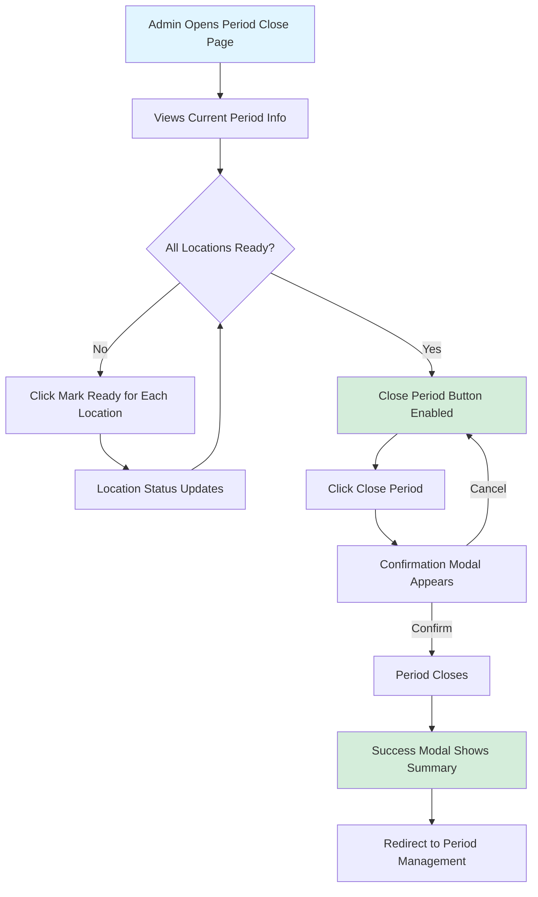
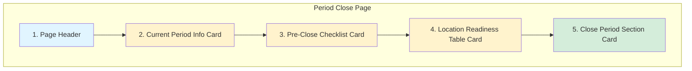
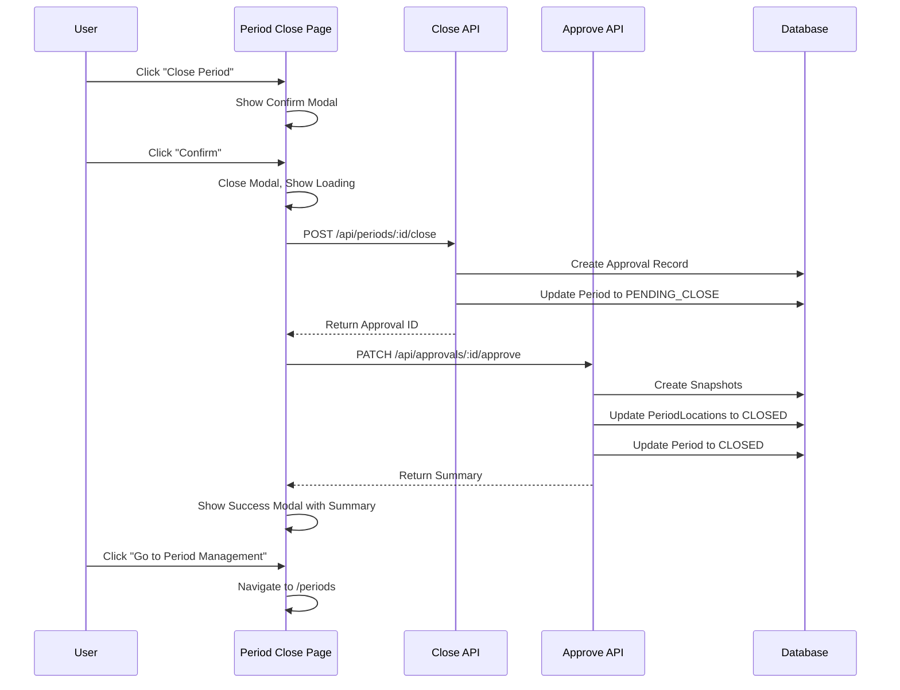
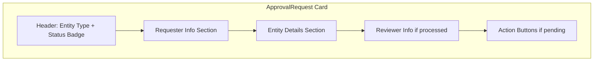
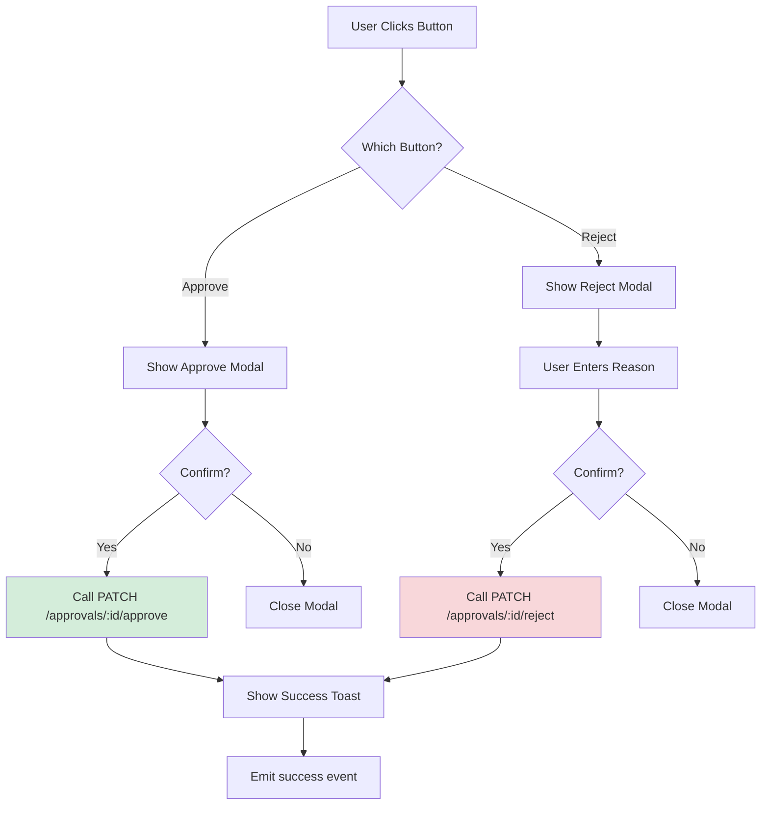

# Phase 3.3: Period Close UI

## Stock Management System - Development Guide

**For Junior Developers**
**Last Updated:** November 25, 2025
**Phase Status:** ✅ Complete

---

## Quick Navigation

- [Phase 1.1: Project Foundation](../phase1/phase-1.1-foundation.md)
- [Phase 1.2: Database Setup](../phase1/phase-1.2-database.md)
- [Phase 1.3: Authentication & Security](../phase1/phase-1.3-authentication.md)
- [Phase 2.1: Transfer Management](../phase2/phase-2.1-transfers.md)
- [Phase 3.1: Period Management](phase-3.1-period-management.md)
- [Phase 3.2: Period Close Workflow](phase-3.2-period-close-workflow.md)
- [Phase 3.3: Period Close UI](phase-3.3-period-close-ui.md) ← You are here

---

## What is Period Close UI?

### The Problem

In Phase 3.1 and 3.2, we built all the **backend API routes** for period management. But users cannot call APIs directly - they need a **user interface** (UI) to:

- See which period is currently active
- Check if all locations are ready to close
- See a checklist of things that need to be done before closing
- Click a button to close the period
- See the result of the close operation

**Without a UI:**

- ❌ Users would need to call APIs manually (technical knowledge required)
- ❌ No visual feedback about what's happening
- ❌ Easy to make mistakes (closing wrong period)
- ❌ No confirmation before irreversible actions

### Our Solution

We built a **Period Close UI** that:

- ✅ Shows current period information at a glance
- ✅ Displays a pre-close checklist (what needs to be done)
- ✅ Shows location readiness status with "Mark Ready" buttons
- ✅ Provides confirmation modal before closing (prevents accidents)
- ✅ Shows success summary after closing (total value, locations closed)

### User Journey



---

## Phase 3.3 Overview

### What We Built

In this phase, we created the **complete Period Close user interface** including the main page and reusable approval components.

### Key Features

1. **Period Close Page** - Centralized interface for closing periods
2. **Pre-Close Checklist** - Visual list of requirements before closing
3. **Location Readiness Table** - Interactive status tracking
4. **Confirmation Modal** - Prevents accidental closes
5. **Approval Components** - Reusable components for approval workflows

### Tasks Completed

**Phase 3.3: Period Close UI**

- ✅ 3.3.1: Period Close Page
- ✅ 3.3.2: Approval Components

---

## Task 3.3.1: Period Close Page

### Simple Explanation

We created a **single page** where admins can manage the entire period close process. This page shows everything they need to know and provides all the controls they need.

### What Was Done

#### Page Access Control

This page is **admin-only**. Regular users (Operators, Supervisors) cannot access it.

**How we do this:**

```typescript
definePageMeta({
  middleware: "role",
  roleRequired: "ADMIN",
});
```

**What this does:**

- When someone tries to visit `/period-close`, the `role` middleware runs
- It checks if the user's role is `ADMIN`
- If not an admin, they get redirected to an error page or login

---

#### Page Structure

The page has **5 main sections**:



Let me explain each section:

---

#### Section 1: Page Header

Uses the reusable `LayoutPageHeader` component:

```vue
<LayoutPageHeader
  title="Period Close"
  subtitle="Close the current accounting period and roll forward to the next"
  icon="i-lucide-lock"
  :show-location="false"
  :show-period="false"
/>
```

**What the props mean:**

- `title`: The main heading text
- `subtitle`: A short description below the title
- `icon`: Lucide icon name (lock icon represents "closing/locking")
- `show-location`: Hide the location selector (not needed here)
- `show-period`: Hide the period selector (we show it differently)

---

#### Section 2: Current Period Info

Shows the active period's basic information:

```vue
<UCard>
  <template #header>
    <div class="flex items-center justify-between">
      <div class="flex items-center gap-3">
        <UIcon name="i-lucide-calendar" class="w-5 h-5 text-primary" />
        <h2 class="text-subheading font-semibold">Current Period</h2>
      </div>
      <UBadge :color="getStatusColor(currentPeriod.status)" variant="subtle" size="md">
        {{ currentPeriod.status }}
      </UBadge>
    </div>
  </template>

  <div class="grid grid-cols-1 md:grid-cols-3 gap-6">
    <div>
      <p class="text-caption text-muted mb-1">Period Name</p>
      <p class="text-body font-semibold">{{ currentPeriod.name }}</p>
    </div>
    <div>
      <p class="text-caption text-muted mb-1">Date Range</p>
      <p class="text-body font-semibold">
        {{ formatDateRange(currentPeriod.start_date, currentPeriod.end_date) }}
      </p>
    </div>
    <div>
      <p class="text-caption text-muted mb-1">Locations</p>
      <p class="text-body font-semibold">
        {{ currentPeriod.period_locations?.length || 0 }} locations
      </p>
    </div>
  </div>
</UCard>
```

**Display example:**

```
┌────────────────────────────────────────────────────────────┐
│ 📅 Current Period                              [OPEN]      │
├────────────────────────────────────────────────────────────┤
│ Period Name          Date Range              Locations     │
│ January 2025         01/01/2025 - 31/01/2025  4 locations  │
└────────────────────────────────────────────────────────────┘
```

---

#### Section 3: Pre-Close Checklist

Shows a list of things that need to be done before closing:

```vue
<div class="space-y-4">
  <div
    v-for="item in checklistItems"
    :key="item.id"
    class="flex items-center gap-3 p-3 rounded-lg border"
  >
    <!-- Circle with check or empty -->
    <div
      :class="[
        'flex items-center justify-center w-6 h-6 rounded-full',
        item.completed ? 'bg-[var(--ui-success)] text-white' : 'bg-[var(--ui-bg-elevated)] text-muted'
      ]"
    >
      <UIcon
        :name="item.completed ? 'i-lucide-check' : 'i-lucide-circle'"
        class="w-4 h-4"
      />
    </div>

    <!-- Label -->
    <div class="flex-1">
      <p :class="['text-body', item.completed ? 'text-[var(--ui-text)]' : 'text-muted']">
        {{ item.label }}
      </p>
    </div>

    <!-- Count badge (optional) -->
    <UBadge
      v-if="item.count !== undefined"
      :color="item.completed ? 'success' : 'warning'"
      variant="subtle"
      size="sm"
    >
      {{ item.count }}
    </UBadge>
  </div>
</div>
```

**The checklist items:**

| Item                       | What It Checks                                  |
| -------------------------- | ----------------------------------------------- |
| All deliveries posted      | Are there any pending deliveries?               |
| All issues posted          | Are there any pending issues?                   |
| All transfers completed    | Are all transfers finalized?                    |
| Reconciliations completed  | Is there a reconciliation for each location?    |
| All locations marked ready | Have supervisors marked each location as ready? |

**Display example:**

```
┌────────────────────────────────────────────────────────────┐
│ ✓ All deliveries have been posted                    [15]  │
│ ✓ All issues have been posted                        [32]  │
│ ✓ All transfers have been completed                        │
│ ✓ Reconciliations completed for all locations      [4/4]   │
│ ○ All locations marked ready                       [2/4]   │
└────────────────────────────────────────────────────────────┘
```

**Generating checklist from data:**

```typescript
const checklistItems = computed(() => {
  const deliveriesCount = currentPeriod.value?._count?.deliveries || 0;
  const issuesCount = currentPeriod.value?._count?.issues || 0;
  const reconciliationsCount = currentPeriod.value?._count?.reconciliations || 0;
  const locationsCount = totalLocationsCount.value;
  const readyCount = readyLocationsCount.value;

  return [
    {
      id: "deliveries",
      label: "All deliveries have been posted",
      count: deliveriesCount,
      completed: true, // Assume done if period is open
    },
    {
      id: "issues",
      label: "All issues have been posted",
      count: issuesCount,
      completed: true,
    },
    {
      id: "transfers",
      label: "All transfers have been completed",
      completed: true,
    },
    {
      id: "reconciliations",
      label: "Reconciliations completed for all locations",
      count: `${reconciliationsCount}/${locationsCount}`,
      completed: reconciliationsCount >= locationsCount,
    },
    {
      id: "locations",
      label: "All locations marked ready",
      count: `${readyCount}/${locationsCount}`,
      completed: allLocationsReady.value,
    },
  ];
});
```

**Key concept: Computed Properties**

A `computed` property automatically recalculates when its dependencies change. Here:

- If `currentPeriod` changes → checklist updates
- If `readyLocationsCount` changes → checklist updates

This means the UI always shows the current state.

---

#### Section 4: Location Readiness Table

Shows all locations with their readiness status:

```vue
<table class="w-full">
  <thead>
    <tr>
      <th>Location</th>
      <th>Type</th>
      <th>Status</th>
      <th>Ready Date</th>
      <th>Actions</th>
    </tr>
  </thead>
  <tbody>
    <tr v-for="pl in periodLocations" :key="pl.location_id">
      <td>
        <div class="font-medium">{{ pl.location.name }}</div>
        <div class="text-caption text-muted">{{ pl.location.code }}</div>
      </td>
      <td>
        <UBadge color="neutral" variant="subtle" size="sm">
          {{ pl.location.type }}
        </UBadge>
      </td>
      <td>
        <UBadge :color="getLocationStatusColor(pl.status)" variant="subtle" size="md">
          {{ pl.status }}
        </UBadge>
      </td>
      <td>
        <span v-if="pl.ready_at">{{ formatDate(pl.ready_at) }}</span>
        <span v-else class="text-muted">—</span>
      </td>
      <td>
        <!-- Mark Ready button (only if not ready) -->
        <UButton
          v-if="pl.status !== 'READY' && pl.status !== 'CLOSED'"
          color="primary"
          variant="soft"
          size="sm"
          icon="i-lucide-check"
          :loading="markingReady === pl.location_id"
          @click="handleMarkReady(pl.location_id)"
        >
          Mark Ready
        </UButton>
      </td>
    </tr>
  </tbody>
</table>
```

**Display example:**

```
┌──────────────────┬──────────┬─────────┬──────────────────┬─────────────┐
│ Location         │ Type     │ Status  │ Ready Date       │ Actions     │
├──────────────────┼──────────┼─────────┼──────────────────┼─────────────┤
│ Main Kitchen     │ KITCHEN  │ READY   │ 25 Nov 2025 14:30│ Ready ✓     │
│ MAIN-KIT         │          │         │                  │             │
├──────────────────┼──────────┼─────────┼──────────────────┼─────────────┤
│ Central Store    │ STORE    │ OPEN    │ —                │ [Mark Ready]│
│ CENT-STORE       │          │         │                  │             │
└──────────────────┴──────────┴─────────┴──────────────────┴─────────────┘
```

**Color coding for status:**

```typescript
function getLocationStatusColor(status: string) {
  switch (status) {
    case "READY":
      return "success"; // Green - ready to close
    case "OPEN":
      return "warning"; // Amber - not ready yet
    case "CLOSED":
      return "neutral"; // Gray - already closed
    default:
      return "warning";
  }
}
```

---

#### Section 5: Close Period Section

This section changes based on the current state:

**State 1: Locations Not Ready**

```vue
<div v-if="!allLocationsReady" class="text-center py-6">
  <UIcon name="i-lucide-alert-circle" class="w-12 h-12 mx-auto text-warning mb-4" />
  <h3 class="text-heading3 font-semibold mb-2">Locations Not Ready</h3>
  <p class="text-body text-muted mb-2">
    All locations must be marked as ready before closing the period.
  </p>
  <p class="text-caption text-muted">
    {{ readyLocationsCount }} of {{ totalLocationsCount }} locations are ready.
  </p>
</div>
```

**State 2: Ready to Close**

```vue
<div v-else class="text-center py-6">
  <UIcon name="i-lucide-check-circle" class="w-12 h-12 mx-auto text-success mb-4" />
  <h3 class="text-heading3 font-semibold mb-2">Ready to Close</h3>
  <p class="text-body text-muted mb-6">
    All locations are ready. You can now close the period.
  </p>
  <UButton
    color="primary"
    icon="i-lucide-lock"
    size="lg"
    @click="showConfirmModal = true"
  >
    Close Period
  </UButton>
</div>
```

**State 3: Pending Close (approval requested)**

```vue
<div v-if="currentPeriod.status === 'PENDING_CLOSE'" class="text-center py-6">
  <UIcon name="i-lucide-clock" class="w-12 h-12 mx-auto text-primary mb-4" />
  <h3 class="text-heading3 font-semibold mb-2">Period Close Pending</h3>
  <p class="text-body text-muted mb-6">
    A period close request has been submitted and is awaiting approval.
  </p>
  <UButton
    color="primary"
    icon="i-lucide-check-circle"
    @click="handleApprovePeriodClose"
  >
    Approve & Execute Close
  </UButton>
</div>
```

---

#### Confirmation Modal

Before closing, we show a warning modal:

```vue
<UModal v-model="showConfirmModal">
  <UCard>
    <template #header>
      <div class="flex items-center gap-3">
        <UIcon name="i-lucide-alert-triangle" class="w-5 h-5 text-warning" />
        <h3>Confirm Period Close</h3>
      </div>
    </template>

    <div class="space-y-4">
      <p>You are about to close the period <strong>{{ currentPeriod?.name }}</strong>.</p>

      <p>This action will:</p>
      <ul class="list-disc list-inside">
        <li>Create a snapshot of all stock levels for each location</li>
        <li>Lock all transactions for this period</li>
        <li>Prevent any further changes to deliveries, issues, or transfers</li>
        <li>Create a new period for the next accounting cycle</li>
      </ul>

      <UAlert
        color="warning"
        icon="i-lucide-alert-triangle"
        title="This action cannot be undone"
        description="Once closed, the period cannot be reopened."
      />
    </div>

    <template #footer>
      <div class="flex items-center justify-end gap-3">
        <UButton color="neutral" variant="ghost" @click="showConfirmModal = false">
          Cancel
        </UButton>
        <UButton color="primary" icon="i-lucide-lock" @click="handleClosePeriod">
          Confirm & Close Period
        </UButton>
      </div>
    </template>
  </UCard>
</UModal>
```

**Why confirmation is important:**

- Period close is **irreversible** (cannot undo)
- Creates permanent snapshots
- Locks all previous transactions
- Gives user a chance to reconsider

---

#### Success Modal

After closing, we show a success summary:

```vue
<UModal v-model="showSuccessModal" :closeable="false">
  <UCard>
    <div class="text-center py-6">
      <UIcon name="i-lucide-check-circle" class="w-16 h-16 mx-auto text-success mb-4" />
      <h3 class="text-heading3 font-semibold mb-2">Period Closed Successfully</h3>
      <p class="text-body text-muted mb-6">
        The period has been closed and a new period has been created.
      </p>

      <!-- Summary Box -->
      <div v-if="closeSummary" class="mb-6 p-4 bg-[var(--ui-bg-elevated)] rounded-lg text-left">
        <h4 class="text-label font-semibold mb-3">Summary</h4>
        <div class="space-y-2 text-sm">
          <div class="flex justify-between">
            <span class="text-muted">Total Locations:</span>
            <span class="font-medium">{{ closeSummary.totalLocations }}</span>
          </div>
          <div class="flex justify-between">
            <span class="text-muted">Total Closing Value:</span>
            <span class="font-medium text-success">
              SAR {{ closeSummary.totalClosingValue?.toLocaleString() }}
            </span>
          </div>
        </div>
      </div>

      <UButton color="primary" icon="i-lucide-arrow-right" @click="handleSuccessClose">
        Go to Period Management
      </UButton>
    </div>
  </UCard>
</UModal>
```

**Note:** `:closeable="false"` means the user cannot close the modal by clicking outside or pressing Escape. They must click the button - this ensures they see the summary.

---

#### The Close Period Flow

Here's the complete flow when user clicks "Close Period":



**Code implementation:**

```typescript
async function handleClosePeriod() {
  if (!currentPeriod.value) return;

  closingPeriod.value = true;

  try {
    // Step 1: Request period close (creates approval)
    const closeResponse = await $fetch<{ approval: { id: string } }>(
      `/api/periods/${currentPeriod.value.id}/close`,
      { method: "POST" }
    );

    // Step 2: Approve and execute the close
    const approvalResponse = await $fetch<{
      summary: { totalLocations: number; totalClosingValue: number };
    }>(`/api/approvals/${closeResponse.approval.id}/approve`, { method: "PATCH" });

    // Store summary for success modal
    closeSummary.value = approvalResponse.summary;

    // Hide confirm modal and show success modal
    showConfirmModal.value = false;
    showSuccessModal.value = true;

    // Refresh period data
    await fetchCurrentPeriod();
  } catch (err: any) {
    console.error("Error closing period:", err);

    toast.add({
      title: "Error",
      description: err?.data?.message || "Failed to close period",
      color: "error",
      icon: "i-lucide-alert-circle",
    });
  } finally {
    closingPeriod.value = false;
  }
}
```

**Why two API calls?**

1. `POST /periods/:id/close` - Creates an approval request
2. `PATCH /approvals/:id/approve` - Approves and executes the close

This is the **two-step approval pattern**. In some systems, different admins might request and approve. In our MVP, the same admin can do both immediately.

---

#### Mark Ready Handler

When a supervisor or admin clicks "Mark Ready" for a location:

```typescript
async function handleMarkReady(locationId: string) {
  if (!currentPeriod.value) return;

  // Show loading state on the specific button
  markingReady.value = locationId;

  try {
    await $fetch(`/api/periods/${currentPeriod.value.id}/locations/${locationId}/ready`, {
      method: "PATCH",
    });

    toast.add({
      title: "Success",
      description: "Location marked as ready",
      color: "success",
      icon: "i-lucide-check",
    });

    // Refresh period data to update the table
    await fetchCurrentPeriod();
  } catch (err: any) {
    console.error("Error marking location ready:", err);

    toast.add({
      title: "Error",
      description: err?.data?.message || "Failed to mark location as ready",
      color: "error",
      icon: "i-lucide-alert-circle",
    });
  } finally {
    markingReady.value = null;
  }
}
```

**Why track `markingReady` separately?**

We need to show a loading spinner on the specific button that was clicked:

```vue
<UButton
  :loading="markingReady === pl.location_id"
  :disabled="!!markingReady"
  @click="handleMarkReady(pl.location_id)"
>
  Mark Ready
</UButton>
```

- `:loading="markingReady === pl.location_id"` - Shows spinner only on the clicked button
- `:disabled="!!markingReady"` - Disables ALL buttons while any one is loading (prevents double-clicking)

---

### Files Created

| File                         | Lines | Purpose                    |
| ---------------------------- | ----- | -------------------------- |
| `app/pages/period-close.vue` | ~680  | Complete period close page |

---

## Task 3.3.2: Approval Components

### Simple Explanation

Approval workflows are used in many places:

- Period Close needs approval
- Transfers need approval
- PRF (Purchase Request Forms) need approval
- PO (Purchase Orders) need approval

Instead of copying the same code in many places, we created **reusable components**:

1. **ApprovalStatus** - A badge showing PENDING/APPROVED/REJECTED
2. **ApprovalRequest** - A card showing full approval details with action buttons

### Component 1: ApprovalStatus

A simple badge component that shows the approval status with correct colors and icons.

#### Props (Inputs)

```typescript
interface ApprovalStatusProps {
  status: "PENDING" | "APPROVED" | "REJECTED"; // Required
  size?: "sm" | "md" | "lg"; // Optional, default "md"
  variant?: "solid" | "soft" | "outline" | "subtle"; // Optional, default "soft"
  showIcon?: boolean; // Optional, default true
}
```

#### Color Mapping

```typescript
const statusColor = computed(() => {
  const colorMap = {
    PENDING: "primary" as const, // Navy Blue - waiting
    APPROVED: "success" as const, // Green - approved
    REJECTED: "error" as const, // Red - rejected
  };
  return colorMap[props.status] || "neutral";
});
```

#### Icon Mapping

```typescript
const statusIcon = computed(() => {
  const iconMap = {
    PENDING: "i-lucide-clock", // Clock - waiting
    APPROVED: "i-lucide-check-circle", // Check - approved
    REJECTED: "i-lucide-x-circle", // X - rejected
  };
  return iconMap[props.status];
});
```

#### Usage Example

```vue
<!-- Simple usage -->
<ApprovalApprovalStatus status="PENDING" />

<!-- With custom options -->
<ApprovalApprovalStatus status="APPROVED" size="lg" variant="solid" :showIcon="false" />
```

**Visual output:**

| Status   | Display                      |
| -------- | ---------------------------- |
| PENDING  | 🕐 Pending (navy blue badge) |
| APPROVED | ✓ Approved (green badge)     |
| REJECTED | ✗ Rejected (red badge)       |

---

### Component 2: ApprovalRequest

A larger component that shows full approval details and allows approve/reject actions.

#### Props (Inputs)

```typescript
interface ApprovalRequestProps {
  approval: Approval; // Required - the approval data
  entity?: Entity; // Optional - related entity details
  canApprove?: boolean; // Optional, default false - show action buttons?
  showEntityDetails?: boolean; // Optional, default true - show entity info?
  loading?: boolean; // Optional, default false - loading state
}
```

#### Approval Data Structure

```typescript
interface Approval {
  id: string;
  entityType: "PERIOD_CLOSE" | "TRANSFER" | "PRF" | "PO";
  entityId: string;
  status: "PENDING" | "APPROVED" | "REJECTED";
  requester: Requester;
  reviewer: Reviewer | null;
  requestedAt: string | Date;
  reviewedAt: string | Date | null;
  comments: string | null;
}
```

#### Component Structure



#### Entity-Specific Displays

The component shows different details based on the entity type:

**Period Close:**

```
Period Name: January 2025
Date Range: 01 Jan 2025 - 31 Jan 2025

Location Status:
┌──────────────────┬─────────┐
│ Main Kitchen     │ READY   │
│ Central Store    │ READY   │
│ Warehouse        │ READY   │
└──────────────────┴─────────┘
```

**Transfer:**

```
Transfer Number: TRF-2025-001
Total Value: SAR 5,000.00
From Location: Main Kitchen (MAIN-KIT)
To Location: Central Store (CENT-STORE)
```

**PRF (Purchase Request Form):**

```
PRF Number: PRF-2025-001
Request Date: 25 Jan 2025
Location: Main Kitchen (MAIN-KIT)
```

**PO (Purchase Order):**

```
PO Number: PO-2025-001
Total Amount: SAR 10,000.00
Supplier: ABC Foods (ABC-001)
```

#### Type Guards

To show the right details, we use "type guards" - functions that check what type of entity we have:

```typescript
const isPeriodEntity = (entity: Entity): entity is PeriodEntity => {
  return props.approval.entityType === "PERIOD_CLOSE" && entity !== null;
};

const isTransferEntity = (entity: Entity): entity is TransferEntity => {
  return props.approval.entityType === "TRANSFER" && entity !== null;
};
```

**Usage in template:**

```vue
<template v-if="isPeriodEntity(entity)">
  <!-- Show period-specific details -->
</template>

<template v-else-if="isTransferEntity(entity)">
  <!-- Show transfer-specific details -->
</template>
```

---

#### Approval Flow

When the user clicks Approve or Reject:



#### Approve Handler

```typescript
const confirmApprove = async () => {
  actionLoading.value = true;

  try {
    await $fetch(`/api/approvals/${props.approval.id}/approve`, {
      method: "PATCH",
    });

    toast.success("Request Approved", {
      description: `${entityTypeLabel.value} request has been approved`,
    });

    emit("approve", props.approval.id);
    emit("success");
    showApproveModal.value = false;
  } catch (err: unknown) {
    console.error("Error approving request:", err);

    const error = err as { data?: { code?: string; message?: string } };
    const message = error.data?.message || "Failed to approve request.";
    toast.error("Approval Failed", { description: message });
    emit("error", message);
  } finally {
    actionLoading.value = false;
  }
};
```

#### Reject Handler (with comment)

```typescript
const confirmReject = async () => {
  // Require a comment
  if (!rejectComment.value.trim()) {
    toast.error("Comment Required", {
      description: "Please provide a reason for rejecting this request",
    });
    return;
  }

  actionLoading.value = true;

  try {
    await $fetch(`/api/approvals/${props.approval.id}/reject`, {
      method: "PATCH",
      body: {
        comments: rejectComment.value,
      },
    });

    toast.success("Request Rejected", {
      description: `${entityTypeLabel.value} request has been rejected`,
    });

    emit("reject", props.approval.id, rejectComment.value);
    emit("success");
    showRejectModal.value = false;
    rejectComment.value = ""; // Clear for next time
  } catch (err: unknown) {
    // ... error handling
  } finally {
    actionLoading.value = false;
  }
};
```

**Why require a comment for rejection?**

- Provides feedback to the requester
- Creates an audit trail
- Prevents accidental rejections

---

#### Emits (Outputs)

```typescript
const emit = defineEmits<{
  approve: [approvalId: string];
  reject: [approvalId: string, comment: string];
  success: [];
  error: [message: string];
}>();
```

**Parent component can listen:**

```vue
<ApprovalApprovalRequest
  :approval="approval"
  :entity="period"
  :can-approve="isAdmin"
  @approve="handleApproved"
  @reject="handleRejected"
  @success="refreshData"
  @error="handleError"
/>
```

---

#### Usage Examples

**Basic usage:**

```vue
<ApprovalApprovalRequest :approval="approval" />
```

**With entity details and approval actions:**

```vue
<ApprovalApprovalRequest
  :approval="periodApproval"
  :entity="period"
  :can-approve="true"
  :show-entity-details="true"
  @success="fetchPeriods"
/>
```

**Read-only (no action buttons):**

```vue
<ApprovalApprovalRequest :approval="approval" :can-approve="false" />
```

---

### Files Created

| File                                          | Lines | Purpose                         |
| --------------------------------------------- | ----- | ------------------------------- |
| `app/components/approval/ApprovalStatus.vue`  | ~62   | Status badge component          |
| `app/components/approval/ApprovalRequest.vue` | ~647  | Full approval request component |

---

## Important Files Created in This Phase

### Frontend Components

| File                                          | Lines | Purpose                            |
| --------------------------------------------- | ----- | ---------------------------------- |
| `app/pages/period-close.vue`                  | ~680  | Period close management page       |
| `app/components/approval/ApprovalStatus.vue`  | ~62   | Approval status badge              |
| `app/components/approval/ApprovalRequest.vue` | ~647  | Approval request card with actions |

**Total:** ~1,389 lines of code

---

## Key Concepts Learned

### 1. Component Naming in Nuxt

In Nuxt 4, components in subdirectories combine folder path + filename:

```
app/components/approval/ApprovalStatus.vue  →  <ApprovalApprovalStatus />
app/components/approval/ApprovalRequest.vue →  <ApprovalApprovalRequest />
```

**Pattern:** `FolderName` + `FileName` (both in PascalCase)

---

### 2. v-model with Modals

`v-model` is a two-way binding. For modals:

```vue
<UModal v-model="showConfirmModal">
  <!-- Modal content -->
</UModal>
```

- Setting `showConfirmModal = true` opens the modal
- User closing the modal sets `showConfirmModal = false`

**Under the hood:**

```vue
<UModal :model-value="showConfirmModal" @update:model-value="showConfirmModal = $event"></UModal>
```

---

### 3. Conditional Rendering with v-if

We show different content based on conditions:

```vue
<div v-if="!allLocationsReady">
  <!-- Show "Not Ready" message -->
</div>

<div v-else>
  <!-- Show "Ready to Close" message -->
</div>
```

**v-if vs v-show:**

- `v-if` removes/adds elements from DOM (use for rarely changing conditions)
- `v-show` just hides with CSS (use for frequently changing conditions)

---

### 4. Loading States

Good UX requires showing loading states:

```vue
<UButton :loading="closingPeriod" :disabled="closingPeriod" @click="handleClose">
  Close Period
</UButton>
```

**Pattern:**

1. Set `loading = true` before API call
2. Call API
3. Set `loading = false` in `finally` block

```typescript
async function handleClose() {
  closingPeriod.value = true; // Start loading

  try {
    await $fetch("/api/...");
    // Handle success
  } catch (err) {
    // Handle error
  } finally {
    closingPeriod.value = false; // Stop loading (always runs)
  }
}
```

---

### 5. TypeScript Type Guards

Type guards help TypeScript understand what type something is:

```typescript
// Type guard function
const isPeriodEntity = (entity: Entity): entity is PeriodEntity => {
  return props.approval.entityType === "PERIOD_CLOSE" && entity !== null;
};

// Usage
if (isPeriodEntity(entity)) {
  // TypeScript knows entity is PeriodEntity here
  console.log(entity.name); // OK
  console.log(entity.period_locations); // OK
}
```

Without the type guard, TypeScript wouldn't know which properties are available.

---

### 6. Emits for Parent-Child Communication

Components emit events to communicate with parents:

```typescript
// Child component defines what it can emit
const emit = defineEmits<{
  success: [];
  error: [message: string];
}>();

// Child emits when something happens
emit("success");
emit("error", "Something went wrong");
```

```vue
<!-- Parent component listens -->
<ChildComponent @success="handleSuccess" @error="handleError" />
```

```typescript
// Parent handlers
function handleSuccess() {
  console.log("Child reported success!");
}

function handleError(message: string) {
  console.log("Child reported error:", message);
}
```

---

## Common Terms Explained

| Term                   | Simple Explanation                                                   |
| ---------------------- | -------------------------------------------------------------------- |
| **Modal**              | A popup dialog that appears on top of the page                       |
| **Toast**              | A small notification that appears briefly (like phone notifications) |
| **v-model**            | Two-way data binding between component and variable                  |
| **computed**           | A value that automatically updates when its dependencies change      |
| **emit**               | How a child component sends events to its parent                     |
| **Type Guard**         | A function that tells TypeScript what type something is              |
| **Loading State**      | Showing a spinner while waiting for something                        |
| **Confirmation Modal** | A dialog asking "Are you sure?" before an action                     |

---

## Common Issues and Solutions

### Issue 1: "Mark Ready" Button Not Working

**Symptoms:**

- Button shows loading but nothing happens
- Error in console about "reconciliation not completed"

**Cause:** Reconciliation must exist before marking location as ready

**Solution:**

```typescript
// Check the API response
const response = await $fetch("/api/periods/:id/locations/:locationId/ready");
console.log(response);

// The API requires reconciliation first
// Create reconciliation for the location before marking ready
```

---

### Issue 2: Close Button Stays Disabled

**Symptoms:**

- "Close Period" button never enables
- Shows "Locations Not Ready" even after marking all ready

**Cause:** The computed property isn't updating properly

**Solution:**

```typescript
// Make sure to refresh data after marking ready
async function handleMarkReady(locationId: string) {
  await $fetch(...);

  // This is important!
  await fetchCurrentPeriod();  // Refresh the data
}
```

---

### Issue 3: Modal Doesn't Close After Action

**Symptoms:**

- Modal stays open after clicking Approve/Reject
- Loading spinner keeps spinning

**Cause:** Error in the API call not being handled

**Solution:**

```typescript
async function confirmApprove() {
  actionLoading.value = true;

  try {
    await $fetch(...);
    showApproveModal.value = false;  // Close modal on success
  } catch (err) {
    // Handle error - modal stays open for user to see the error
    console.error(err);
    toast.error("Failed");
  } finally {
    actionLoading.value = false;  // Always stop loading
  }
}
```

---

### Issue 4: TypeScript Errors with Entity

**Symptoms:**

- "Property 'name' does not exist on type 'Entity'"
- Red squiggly lines in editor

**Cause:** TypeScript doesn't know which entity type you have

**Solution:** Use type guards:

```typescript
// Wrong
if (entity) {
  console.log(entity.name); // Error: 'name' might not exist
}

// Correct
if (isPeriodEntity(entity)) {
  console.log(entity.name); // OK: TypeScript knows it's PeriodEntity
}
```

---

### Issue 5: Component Not Found Error

**Symptoms:**

- "Failed to resolve component: ApprovalStatus"
- Component renders as empty or shows error

**Cause:** Wrong component name

**Solution:**

```vue
<!-- Wrong -->
<ApprovalStatus />

<!-- Correct (folder name + file name) -->
<ApprovalApprovalStatus />
```

---

## Testing Checklist

### Manual Testing Steps

**1. Page Access**

- [ ] Admin can access /period-close
- [ ] Non-admin gets redirected (403 error or redirect)
- [ ] Page shows loading state initially
- [ ] Page shows current period info after loading

**2. Pre-Close Checklist**

- [ ] Checklist items display correctly
- [ ] Completed items show green checkmark
- [ ] Incomplete items show gray circle
- [ ] Count badges show correct numbers

**3. Location Readiness Table**

- [ ] All locations appear in table
- [ ] Status badges show correct colors
- [ ] Ready date shows for ready locations
- [ ] "Mark Ready" button appears for non-ready locations

**4. Mark Ready Flow**

- [ ] Button shows loading spinner when clicked
- [ ] Other buttons are disabled during loading
- [ ] Success toast appears after completion
- [ ] Table updates to show new status
- [ ] Checklist updates automatically

**5. Close Period Flow**

- [ ] Button disabled when not all locations ready
- [ ] Button enabled when all locations ready
- [ ] Confirmation modal shows on click
- [ ] Warning about irreversible action is visible
- [ ] Cancel closes modal without action
- [ ] Confirm triggers close process
- [ ] Success modal shows summary after close
- [ ] "Go to Period Management" navigates correctly

**6. Approval Components**

- [ ] ApprovalStatus shows correct color per status
- [ ] ApprovalStatus shows correct icon per status
- [ ] ApprovalRequest shows requester info
- [ ] ApprovalRequest shows entity details
- [ ] Approve button opens confirm modal
- [ ] Reject button opens modal with textarea
- [ ] Reject requires comment to submit
- [ ] Success/error toasts appear appropriately

**7. Error Scenarios**

- [ ] Error message shows if API fails
- [ ] Loading state clears after error
- [ ] User can retry after error

---

## What's Next?

After completing Period Close UI (Phase 3.3), the next phase is:

**→ Phase 3.4: Reporting & Exports** (Days 28-30)

- Stock report API and page
- Reconciliation report API and page
- Deliveries and Issues reports
- CSV export functionality

---

## Summary

In Phase 3.3, we built the complete Period Close user interface with:

✅ **Period Close Page** with admin-only access

✅ **Current Period Display** showing name, dates, and location count

✅ **Pre-Close Checklist** with visual completion indicators

✅ **Location Readiness Table** with interactive "Mark Ready" buttons

✅ **Close Period Section** with state-based content (not ready / ready / pending)

✅ **Confirmation Modal** preventing accidental period closes

✅ **Success Modal** showing closing summary

✅ **ApprovalStatus Component** reusable status badge

✅ **ApprovalRequest Component** full approval card with approve/reject actions

✅ **Entity-Specific Displays** for Period Close, Transfer, PRF, and PO

✅ **Type-Safe Implementation** using TypeScript interfaces and type guards

The Period Close UI provides admins with a centralized interface to manage the entire period-end close process, from checking location readiness to executing the final close with confirmation and success feedback.

---

**Made for Junior Developers**

---

**Last Updated:** November 25, 2025
**Phase:** 3.3 Period Close UI ✅ Complete
**Next:** Phase 3.4 Reporting & Exports
