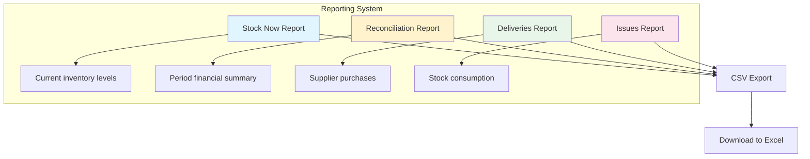
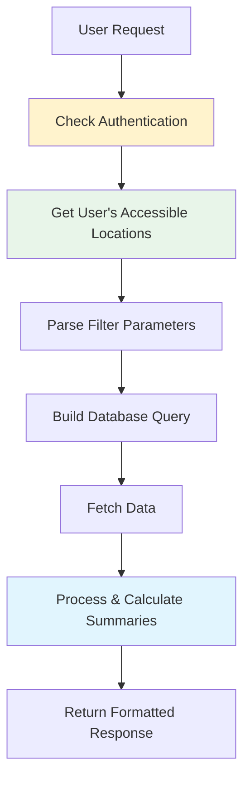
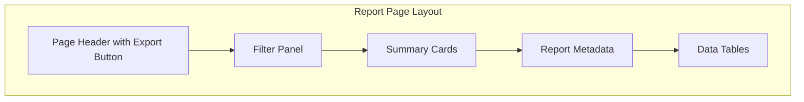
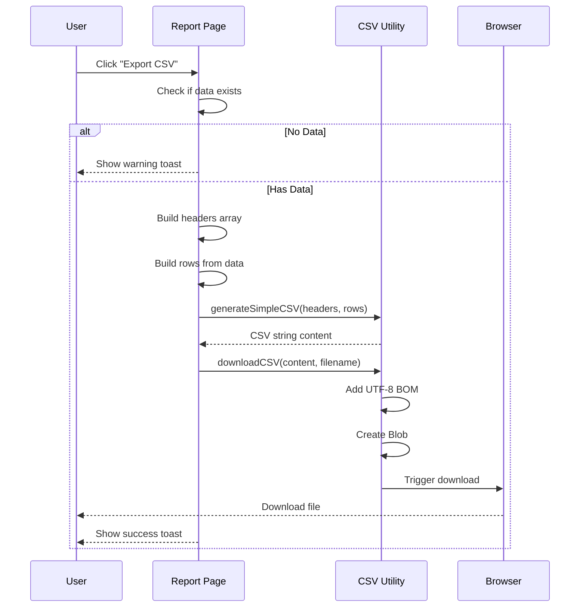
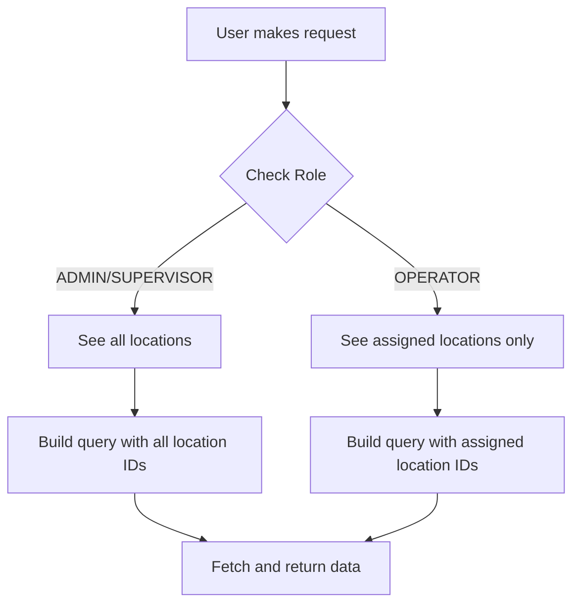

# Phase 3.4: Reporting System

## Stock Management System - Development Guide

**For Junior Developers**
**Last Updated:** November 25, 2025
**Phase Status:** ✅ Complete

---

## Quick Navigation

- [Phase 1.1: Project Foundation](../phase1/phase-1.1-foundation.md)
- [Phase 1.2: Database Setup](../phase1/phase-1.2-database.md)
- [Phase 1.3: Authentication & Security](../phase1/phase-1.3-authentication.md)
- [Phase 2.1: Transfer Management](../phase2/phase-2.1-transfers.md)
- [Phase 3.1: Period Management](phase-3.1-period-management.md)
- [Phase 3.2: Period Close Workflow](phase-3.2-period-close-workflow.md)
- [Phase 3.3: Period Close UI](phase-3.3-period-close-ui.md)
- [Phase 3.4: Reporting System](phase-3.4-reporting-system.md) ← You are here

---

## What is the Reporting System?

### The Problem

In a stock management system, managers need to see data in meaningful ways:

- How much stock do we have right now?
- How much did we spend this month?
- Which suppliers delivered the most?
- Where are we consuming the most stock?

**Problems with accessing raw data:**

- ❌ Database tables are hard to read
- ❌ Need technical skills to write SQL queries
- ❌ No summarized views (must calculate manually)
- ❌ Cannot export data for analysis in Excel
- ❌ No role-based filtering (see everything or nothing)

### Our Solution

We built a **Reporting System** that:

- ✅ Provides clean, formatted reports
- ✅ Summarizes data with totals and calculations
- ✅ Filters data based on user's role and locations
- ✅ Allows export to CSV for analysis in Excel
- ✅ Shows data in real-time from the database
- ✅ Offers multiple report types for different needs

### Report Types Overview



**Four Report Types:**

| Report             | Purpose                    | Key Data                             |
| ------------------ | -------------------------- | ------------------------------------ |
| **Stock Now**      | Current inventory snapshot | Quantities, values, low stock alerts |
| **Reconciliation** | Period financial summary   | Opening, movements, closing values   |
| **Deliveries**     | Purchase history           | Suppliers, amounts, price variances  |
| **Issues**         | Consumption tracking       | Cost centres, top items consumed     |

---

## Phase 3.4 Overview

### What We Built

In this phase, we created a **complete reporting system** with API endpoints for data extraction, user-friendly pages with filters, and CSV export capabilities.

### Key Features

1. **Report API Routes** - Backend endpoints that fetch, filter, and summarize data
2. **Report Pages** - Frontend pages with filters, tables, and summary cards
3. **CSV Export** - Download reports for Excel analysis
4. **Role-Based Access** - Users only see locations they have access to

### Tasks Completed

**Phase 3.4: Reporting & Exports**

- ✅ 3.4.1: Report API Routes (4 endpoints)
- ✅ 3.4.2: Report Pages (5 pages)
- ✅ 3.4.3: CSV Export Utility

---

## Task 3.4.1: Report API Routes

### Simple Explanation

We created **4 API endpoints** that fetch data from the database, apply filters, calculate summaries, and return formatted results. Each endpoint follows a similar pattern but returns different data.

### What Was Done

#### Common Pattern for All Reports

Every report API follows this pattern:



**Key Steps:**

1. **Authentication** - User must be logged in
2. **Location Access** - Based on role, determine which locations user can see
3. **Parse Filters** - Read query parameters (periodId, locationId, etc.)
4. **Build Query** - Create Prisma query with filters
5. **Process Data** - Calculate totals, summaries, breakdowns
6. **Return Response** - Send formatted JSON with data and metadata

---

#### Role-Based Location Access

This is very important! Different users see different data:

```typescript
// Get user's accessible locations
let accessibleLocationIds: string[] = [];

if (user.role === "ADMIN" || user.role === "SUPERVISOR") {
  // Admin and Supervisor can see ALL active locations
  const allLocations = await prisma.location.findMany({
    where: { is_active: true },
    select: { id: true },
  });
  accessibleLocationIds = allLocations.map((l) => l.id);
} else {
  // Operator can only see ASSIGNED locations
  const userLocations = await prisma.userLocation.findMany({
    where: { user_id: user.id },
    select: { location_id: true },
  });
  accessibleLocationIds = userLocations.map((ul) => ul.location_id);
}
```

**Visual Explanation:**

```
Admin/Supervisor sees:     Operator sees:
┌─────────────────────┐   ┌─────────────────────┐
│ All 4 Locations     │   │ Only 2 Assigned     │
│ ✓ Kitchen          │   │ ✓ Kitchen          │
│ ✓ Store            │   │ ✓ Store            │
│ ✓ Warehouse        │   │ ✗ Warehouse        │
│ ✓ Central          │   │ ✗ Central          │
└─────────────────────┘   └─────────────────────┘
```

---

### Endpoint 1: GET /api/reports/stock-now

**Purpose:** Show current stock levels across all locations

**Query Parameters:**

- `locationId` - Filter by specific location (optional)
- `category` - Filter by item category (optional)
- `lowStock` - Show only items below minimum stock (optional)

**What it returns:**

```json
{
  "report_type": "stock-now",
  "generated_at": "2025-11-25T10:30:00Z",
  "generated_by": {
    "id": "user-123",
    "username": "john.doe"
  },
  "filters": {
    "location_id": null,
    "category": null,
    "low_stock_only": false
  },
  "locations": [
    {
      "location_id": "loc-1",
      "location_code": "MAIN-KIT",
      "location_name": "Main Kitchen",
      "location_type": "KITCHEN",
      "total_items": 45,
      "total_value": 50000.0,
      "low_stock_items": 3,
      "items": [
        {
          "item_id": "item-1",
          "item_code": "RICE-01",
          "item_name": "Basmati Rice",
          "item_unit": "KG",
          "item_category": "DRY_GOODS",
          "on_hand": 100,
          "wac": 5.5,
          "stock_value": 550.0,
          "min_stock": 50,
          "max_stock": 200,
          "is_low_stock": false,
          "is_over_stock": false
        }
      ]
    }
  ],
  "grand_totals": {
    "total_locations": 3,
    "total_items": 120,
    "total_value": 130000.0,
    "low_stock_items": 8
  },
  "available_categories": ["DRY_GOODS", "DAIRY", "VEGETABLES"]
}
```

**Key Features:**

- Groups items by location
- Calculates low stock indicators (compares `on_hand` with `min_stock`)
- Includes available categories for filter dropdown
- Rounds values to 2 decimal places for currency

---

### Endpoint 2: GET /api/reports/reconciliation

**Purpose:** Show period financial summary for reconciliation

**Query Parameters:**

- `periodId` - **Required** - Which period to report on
- `locationId` - Filter by specific location (optional)

**What it returns:**

```json
{
  "report_type": "reconciliation",
  "period": {
    "id": "period-1",
    "name": "November 2025",
    "start_date": "2025-11-01",
    "end_date": "2025-11-30",
    "status": "OPEN"
  },
  "locations": [
    {
      "location_id": "loc-1",
      "location_name": "Main Kitchen",
      "reconciliation": {
        "opening_stock": 50000.0,
        "receipts": 15000.0,
        "transfers_in": 3000.0,
        "transfers_out": 2000.0,
        "issues": 12000.0,
        "closing_stock": 54000.0,
        "adjustments": 0,
        "back_charges": 0,
        "credits": 0,
        "condemnations": 0
      },
      "calculations": {
        "consumption": 12000.0,
        "total_adjustments": 0,
        "total_mandays": 900,
        "manday_cost": 13.33
      },
      "is_saved": true
    }
  ],
  "grand_totals": {
    "opening_stock": 150000.0,
    "receipts": 45000.0,
    "closing_stock": 162000.0,
    "consumption": 36000.0,
    "average_manday_cost": 12.5
  }
}
```

**Special Feature - Auto-Calculate:**

If no saved reconciliation exists, the system automatically calculates values from:

- Deliveries (receipts)
- Transfers (in/out)
- Issues
- Current stock levels

This is shown with `is_saved: false` in the response.

---

### Endpoint 3: GET /api/reports/deliveries

**Purpose:** Show delivery history with supplier breakdown

**Query Parameters:**

- `periodId` - Filter by period (optional)
- `locationId` - Filter by location (optional)
- `supplierId` - Filter by supplier (optional)
- `startDate` - Filter from date (optional)
- `endDate` - Filter to date (optional)
- `hasVariance` - Show only deliveries with price variance (optional)

**What it returns:**

```json
{
  "report_type": "deliveries",
  "deliveries": [
    {
      "id": "del-1",
      "delivery_no": "DEL-2025-0001",
      "delivery_date": "2025-11-15",
      "supplier_name": "ABC Foods",
      "location_name": "Main Kitchen",
      "total_amount": 5000.0,
      "has_variance": true,
      "total_variance": 150.0,
      "ncr_count": 1,
      "lines": [
        {
          "item_code": "RICE-01",
          "item_name": "Basmati Rice",
          "quantity": 100,
          "unit_price": 5.5,
          "period_price": 5.0,
          "price_variance": 0.5,
          "line_value": 550.0
        }
      ]
    }
  ],
  "by_location": [
    {
      "location_name": "Main Kitchen",
      "delivery_count": 15,
      "total_value": 25000.0,
      "variance_count": 3,
      "total_variance": 450.0
    }
  ],
  "by_supplier": [
    {
      "supplier_name": "ABC Foods",
      "delivery_count": 20,
      "total_value": 35000.0
    }
  ],
  "grand_totals": {
    "total_deliveries": 45,
    "total_value": 120000.0,
    "deliveries_with_variance": 8,
    "total_variance": 1200.0,
    "total_ncrs": 5
  }
}
```

**Key Features:**

- Tracks price variances (when actual price differs from locked period price)
- Counts NCRs (Non-Conformance Reports) created for price issues
- Groups data by location and supplier
- Sorts suppliers by total value (highest first)

---

### Endpoint 4: GET /api/reports/issues

**Purpose:** Show stock consumption by location and cost centre

**Query Parameters:**

- `periodId` - Filter by period (optional)
- `locationId` - Filter by location (optional)
- `costCentre` - Filter by cost centre: FOOD, CLEAN, OTHER (optional)
- `startDate` - Filter from date (optional)
- `endDate` - Filter to date (optional)

**What it returns:**

```json
{
  "report_type": "issues",
  "issues": [
    {
      "id": "issue-1",
      "issue_no": "ISS-2025-0001",
      "issue_date": "2025-11-15",
      "location_name": "Main Kitchen",
      "cost_centre": "FOOD",
      "total_value": 500.0,
      "line_count": 5,
      "lines": [
        {
          "item_code": "RICE-01",
          "item_name": "Basmati Rice",
          "quantity": 10,
          "wac_at_issue": 5.5,
          "line_value": 55.0
        }
      ]
    }
  ],
  "by_location": [
    {
      "location_name": "Main Kitchen",
      "issue_count": 30,
      "total_value": 15000.0,
      "by_cost_centre": {
        "FOOD": 12000.0,
        "CLEAN": 2000.0,
        "OTHER": 1000.0
      }
    }
  ],
  "by_cost_centre": [
    {
      "cost_centre": "FOOD",
      "issue_count": 25,
      "total_value": 20000.0,
      "top_items": [
        {
          "item_code": "RICE-01",
          "item_name": "Basmati Rice",
          "total_quantity": 500,
          "total_value": 2750.0
        }
      ]
    }
  ],
  "grand_totals": {
    "total_issues": 50,
    "total_value": 30000.0,
    "by_cost_centre": {
      "FOOD": { "count": 40, "value": 25000.0 },
      "CLEAN": { "count": 8, "value": 4000.0 },
      "OTHER": { "count": 2, "value": 1000.0 }
    }
  }
}
```

**Special Feature - Top Items:**

Each cost centre shows the top 10 most consumed items, sorted by value. This helps identify where most money is being spent.

---

### Response Structure Pattern

All reports follow a similar response structure:

```typescript
interface ReportResponse {
  // Report identification
  report_type: string;
  generated_at: string; // When report was created
  generated_by: {
    // Who created it
    id: string;
    username: string;
  };

  // Applied filters (for reference)
  filters: {
    location_id: string | null;
    period_id: string | null;
    // ... other filters
  };

  // Main data
  [dataArrayName]: DataItem[];

  // Summaries
  by_location?: LocationSummary[];
  by_supplier?: SupplierSummary[];
  by_cost_centre?: CostCentreSummary[];

  // Grand totals
  grand_totals: {
    total_count: number;
    total_value: number;
    // ... other totals
  };
}
```

---

### Files Created

| File                                       | Lines | What It Does                             |
| ------------------------------------------ | ----- | ---------------------------------------- |
| `server/api/reports/stock-now.get.ts`      | ~305  | Current stock levels report              |
| `server/api/reports/reconciliation.get.ts` | ~515  | Period reconciliation report             |
| `server/api/reports/deliveries.get.ts`     | ~415  | Deliveries report with variance tracking |
| `server/api/reports/issues.get.ts`         | ~435  | Issues/consumption report                |

---

## Task 3.4.2: Report Pages

### Simple Explanation

We created **5 frontend pages** that display reports with filters, summary cards, data tables, and export buttons. Users can generate reports, apply filters, and download CSV files.

### What Was Done

#### Reports Hub Page

**File:** `app/pages/reports/index.vue`

This is the main entry point for all reports. It shows cards for each report type with:

- Icon and title
- Description
- Feature badges
- Link to the report page

**Visual Layout:**

```
┌───────────────────────────────────────────────────────────┐
│ 📊 Reports                                                │
│ Generate and export various inventory reports             │
├───────────────────────────────────────────────────────────┤
│                                                           │
│ ┌─────────────────────┐ ┌─────────────────────┐          │
│ │ 📦 Stock Now        │ │ 🧮 Reconciliation   │          │
│ │ Current inventory   │ │ Period summary      │          │
│ │ levels...           │ │ analysis...         │          │
│ │ [Real-time] [CSV]   │ │ [Consumption] [CSV] │          │
│ └─────────────────────┘ └─────────────────────┘          │
│                                                           │
│ ┌─────────────────────┐ ┌─────────────────────┐          │
│ │ 🚚 Deliveries       │ │ 📤 Issues           │          │
│ │ Supplier purchases  │ │ Stock consumption   │          │
│ │ and variances...    │ │ by cost centre...   │          │
│ │ [Variance] [NCR]    │ │ [Top Items] [CSV]   │          │
│ └─────────────────────┘ └─────────────────────┘          │
│                                                           │
└───────────────────────────────────────────────────────────┘
```

---

#### Report Page Pattern

All report pages follow the same structure:



**Components:**

1. **Page Header** - Title, description, back button, export button
2. **Filter Panel** - Location, period, date range, other filters
3. **Summary Cards** - Key metrics (total value, item count, etc.)
4. **Report Metadata** - Generated time, user, applied filters
5. **Data Tables** - Main report data organized by location/group

---

#### Stock Now Report Page

**File:** `app/pages/reports/stock-now.vue`

**Features:**

- Filter by location, category, low stock only
- Summary cards: Total Locations, Total Items, Total Value, Low Stock Items
- Tables grouped by location with item details
- Status badges for low stock and over stock items

**Filter Panel Code Example:**

```vue
<template>
  <div class="card-elevated p-6 mb-6">
    <h3 class="text-subheading font-semibold mb-4">Filters</h3>
    <div class="grid grid-cols-1 md:grid-cols-4 gap-4">
      <!-- Location Filter (visible to supervisors only) -->
      <UFormField v-if="isAtLeastSupervisor" label="Location">
        <USelectMenu
          v-model="selectedLocationId"
          :options="locationOptions"
          placeholder="Select location"
        />
      </UFormField>

      <!-- Category Filter -->
      <UFormField label="Category">
        <USelectMenu
          v-model="selectedCategory"
          :options="categoryOptions"
          placeholder="Select category"
        />
      </UFormField>

      <!-- Low Stock Checkbox -->
      <UFormField label="Stock Status">
        <UCheckbox v-model="showLowStockOnly" label="Low stock items only" />
      </UFormField>

      <!-- Action Buttons -->
      <UFormField label="Actions">
        <div class="flex gap-2">
          <UButton color="primary" @click="fetchReport">Generate</UButton>
          <UButton color="neutral" variant="outline" @click="clearFilters">Clear</UButton>
        </div>
      </UFormField>
    </div>
  </div>
</template>
```

---

#### Reconciliation Report Page

**File:** `app/pages/reports/reconciliation.vue`

**Features:**

- Period selector (required)
- Location filter
- Flow diagram: Opening → Receipts → Transfers → Issues → Closing
- Consumption and manday cost calculations
- Indicator for saved vs auto-calculated data

**Reconciliation Flow Visualization:**

```
┌─────────────────────────────────────────────────────────┐
│ RECONCILIATION FLOW                                     │
│                                                         │
│ Opening Stock  + Receipts  + Transfers In               │
│    50,000         15,000       3,000                    │
│                                                         │
│ - Transfers Out - Issues   = Closing Stock              │
│     2,000          12,000       54,000                  │
│                                                         │
│ ─────────────────────────────────────────────────────── │
│ Consumption: 12,000 | Mandays: 900 | Cost/Manday: 13.33 │
└─────────────────────────────────────────────────────────┘
```

---

#### Deliveries Report Page

**File:** `app/pages/reports/deliveries.vue`

**Features:**

- Filter by period, location, supplier, date range
- Checkbox to show only deliveries with price variance
- Summary by supplier (sorted by value)
- Price variance highlighting
- NCR count per delivery

---

#### Issues Report Page

**File:** `app/pages/reports/issues.vue`

**Features:**

- Filter by period, location, cost centre, date range
- Breakdown by cost centre (FOOD, CLEAN, OTHER)
- Top 10 consumed items per cost centre
- Summary by location with cost centre split

---

### Summary Cards Pattern

All pages use a consistent pattern for summary cards:

```vue
<template>
  <div class="grid grid-cols-1 md:grid-cols-4 gap-4 mb-6">
    <!-- Card 1: Count -->
    <div class="card-elevated p-4">
      <p class="text-caption">Total Locations</p>
      <p class="text-heading font-bold text-primary">
        {{ reportData.grand_totals.total_locations }}
      </p>
    </div>

    <!-- Card 2: Items -->
    <div class="card-elevated p-4">
      <p class="text-caption">Total Items</p>
      <p class="text-heading font-bold">
        {{ reportData.grand_totals.total_items.toLocaleString() }}
      </p>
    </div>

    <!-- Card 3: Value (green for positive) -->
    <div class="card-elevated p-4">
      <p class="text-caption">Total Value</p>
      <p class="text-heading font-bold text-emerald-500">
        {{ formatCurrency(reportData.grand_totals.total_value) }}
      </p>
    </div>

    <!-- Card 4: Alert (red for warnings) -->
    <div class="card-elevated p-4">
      <p class="text-caption">Low Stock Items</p>
      <p class="text-heading font-bold text-red-500">
        {{ reportData.grand_totals.low_stock_items }}
      </p>
    </div>
  </div>
</template>
```

---

### Files Created

| File                                   | Lines | What It Does                      |
| -------------------------------------- | ----- | --------------------------------- |
| `app/pages/reports/index.vue`          | ~165  | Reports hub with navigation cards |
| `app/pages/reports/stock-now.vue`      | ~450  | Current stock report page         |
| `app/pages/reports/reconciliation.vue` | ~400  | Reconciliation report page        |
| `app/pages/reports/deliveries.vue`     | ~400  | Deliveries report page            |
| `app/pages/reports/issues.vue`         | ~400  | Issues report page                |

---

## Task 3.4.3: CSV Export Utility

### Simple Explanation

We created a **utility file** with functions to convert data to CSV format and trigger downloads. This allows users to export report data to Excel for further analysis.

### What Was Done

#### CSV Export Utility

**File:** `app/utils/csvExport.ts`

This file provides several functions for CSV generation and download.

---

#### Key Functions

**1. `escapeCSVValue(value)` - Make values safe for CSV**

CSV files use commas to separate columns. If a value contains a comma, it must be wrapped in quotes. This function handles that:

```typescript
function escapeCSVValue(value: unknown): string {
  if (value === null || value === undefined) {
    return "";
  }

  const stringValue = String(value);

  // If value contains special characters, wrap in quotes
  if (
    stringValue.includes(",") || // Commas
    stringValue.includes('"') || // Double quotes
    stringValue.includes("\n") || // New lines
    stringValue.includes("\r") // Carriage returns
  ) {
    // Escape existing quotes by doubling them
    return `"${stringValue.replace(/"/g, '""')}"`;
  }

  return stringValue;
}
```

**Example:**

| Input          | Output           |
| -------------- | ---------------- |
| `Hello`        | `Hello`          |
| `Hello, World` | `"Hello, World"` |
| `Say "Hi"`     | `"Say ""Hi"""`   |
| `null`         | (empty string)   |

---

**2. `generateCSV(data, columns)` - Create CSV from objects**

This is the main function for creating CSV content:

```typescript
export function generateCSV<T extends Record<string, unknown>>(
  data: T[],
  columns: CsvColumn<T>[]
): string {
  // Generate header row
  const headerRow = columns.map((col) => escapeCSVValue(col.header)).join(",");

  // Generate data rows
  const dataRows = data.map((row) => {
    return columns
      .map((col) => {
        // Get value using accessor (can be key or function)
        let value: unknown;
        if (typeof col.accessor === "function") {
          value = col.accessor(row);
        } else {
          value = row[col.accessor];
        }

        // Apply formatter if provided
        if (col.format) {
          value = col.format(value);
        }

        return escapeCSVValue(value);
      })
      .join(",");
  });

  // Combine header and data rows
  return [headerRow, ...dataRows].join("\n");
}
```

---

**3. `generateSimpleCSV(headers, rows)` - Create CSV from arrays**

A simpler version for when you have headers and rows as arrays:

```typescript
export function generateSimpleCSV(
  headers: string[],
  rows: (string | number | null | undefined)[][]
): string {
  const headerRow = headers.map((h) => escapeCSVValue(h)).join(",");

  const dataRows = rows.map((row) => {
    return row.map((cell) => escapeCSVValue(cell)).join(",");
  });

  return [headerRow, ...dataRows].join("\n");
}
```

**Example Usage:**

```typescript
const headers = ["Name", "Age", "City"];
const rows = [
  ["John", 25, "Riyadh"],
  ["Sarah", 30, "Jeddah"],
];

const csv = generateSimpleCSV(headers, rows);
// Result:
// Name,Age,City
// John,25,Riyadh
// Sarah,30,Jeddah
```

---

**4. `downloadCSV(csvContent, filename)` - Trigger file download**

This function creates a blob and triggers a download in the browser:

```typescript
export function downloadCSV(csvContent: string, filename: string): void {
  // Add BOM (Byte Order Mark) for Excel UTF-8 compatibility
  const bom = "\uFEFF";
  const blob = new Blob([bom + csvContent], { type: "text/csv;charset=utf-8;" });

  // Create download link
  const link = document.createElement("a");
  const url = URL.createObjectURL(blob);

  link.setAttribute("href", url);
  link.setAttribute("download", `${filename}.csv`);
  link.style.visibility = "hidden";

  // Trigger download
  document.body.appendChild(link);
  link.click();
  document.body.removeChild(link);

  // Clean up
  URL.revokeObjectURL(url);
}
```

**Important: UTF-8 BOM**

The `\uFEFF` at the beginning is a special character that tells Excel to read the file as UTF-8. Without this, Arabic or special characters may not display correctly.

---

**5. Helper Formatters**

```typescript
// Format date for CSV (YYYY-MM-DD format)
export function formatDateForCSV(date: Date | string | null): string {
  if (!date) return "";
  const d = typeof date === "string" ? new Date(date) : date;
  if (isNaN(d.getTime())) return "";
  return d.toISOString().split("T")[0] || "";
}

// Format number with specific decimal places
export function formatNumberForCSV(num: number | string | null, decimals: number = 2): string {
  if (num === null || num === undefined || num === "") return "";
  const numValue = typeof num === "string" ? parseFloat(num) : num;
  if (isNaN(numValue)) return "";
  return numValue.toFixed(decimals);
}

// Format currency (just number, no symbol)
export function formatCurrencyForCSV(amount: number | string | null): string {
  return formatNumberForCSV(amount, 2);
}
```

---

#### Using CSV Export in Report Pages

Here's how the Stock Now report page uses the CSV export:

```typescript
const exportToCSV = () => {
  if (!reportData.value || !hasData.value) {
    toast.warning("No Data", { description: "No data to export" });
    return;
  }

  // Define headers
  const headers = [
    "Location",
    "Item Code",
    "Item Name",
    "Unit",
    "Category",
    "On Hand",
    "WAC",
    "Stock Value",
    "Min Stock",
    "Max Stock",
    "Low Stock",
    "Over Stock",
  ];

  // Build rows from report data
  const rows: (string | number | null)[][] = [];

  for (const location of reportData.value.locations) {
    for (const item of location.items) {
      rows.push([
        location.location_name,
        item.item_code,
        item.item_name,
        item.item_unit,
        item.item_category || "",
        formatNumberForCSV(item.on_hand, 4),
        formatCurrencyForCSV(item.wac),
        formatCurrencyForCSV(item.stock_value),
        item.min_stock ? formatNumberForCSV(item.min_stock, 4) : "",
        item.max_stock ? formatNumberForCSV(item.max_stock, 4) : "",
        item.is_low_stock ? "Yes" : "No",
        item.is_over_stock ? "Yes" : "No",
      ]);
    }
  }

  // Generate and download
  const csvContent = generateSimpleCSV(headers, rows);
  const filename = `stock-now-report-${new Date().toISOString().split("T")[0]}`;
  downloadCSV(csvContent, filename);

  toast.success("Exported", { description: "Stock report exported to CSV" });
};
```

---

#### CSV Export Flow



---

### Files Created

| File                     | Lines | What It Does                          |
| ------------------------ | ----- | ------------------------------------- |
| `app/utils/csvExport.ts` | ~197  | CSV generation and download utilities |

---

## Important Files Created in This Phase

### API Routes

| File                                       | Lines | Purpose                           |
| ------------------------------------------ | ----- | --------------------------------- |
| `server/api/reports/stock-now.get.ts`      | ~305  | Current stock report              |
| `server/api/reports/reconciliation.get.ts` | ~515  | Period reconciliation report      |
| `server/api/reports/deliveries.get.ts`     | ~415  | Deliveries with variance tracking |
| `server/api/reports/issues.get.ts`         | ~435  | Issues by cost centre             |

### Frontend Pages

| File                                   | Lines | Purpose                    |
| -------------------------------------- | ----- | -------------------------- |
| `app/pages/reports/index.vue`          | ~165  | Reports hub                |
| `app/pages/reports/stock-now.vue`      | ~450  | Stock now report page      |
| `app/pages/reports/reconciliation.vue` | ~400  | Reconciliation report page |
| `app/pages/reports/deliveries.vue`     | ~400  | Deliveries report page     |
| `app/pages/reports/issues.vue`         | ~400  | Issues report page         |

### Utilities

| File                     | Lines | Purpose                  |
| ------------------------ | ----- | ------------------------ |
| `app/utils/csvExport.ts` | ~197  | CSV generation utilities |

**Total:** ~3,680 lines of code

---

## Key Concepts Learned

### 1. Query Parameter Validation with Zod

All API routes validate query parameters using Zod:

```typescript
const querySchema = z.object({
  periodId: z.string().uuid().optional(),
  locationId: z.string().uuid().optional(),
  startDate: z.string().optional(),
  endDate: z.string().optional(),
});

// In the handler:
const query = await getQuery(event);
const { periodId, locationId, startDate, endDate } = querySchema.parse(query);
```

**Why this matters:**

- Ensures parameters are valid before using them
- Provides clear error messages for invalid input
- TypeScript knows the types after parsing

---

### 2. Role-Based Data Filtering

Different users see different data based on their role:



**Implementation Pattern:**

```typescript
// Always start with accessible locations
let accessibleLocationIds: string[] = [];

if (user.role === "ADMIN" || user.role === "SUPERVISOR") {
  // Full access
  accessibleLocationIds = allLocationIds;
} else {
  // Limited access
  accessibleLocationIds = userAssignedLocationIds;
}

// Then check if specific location filter is valid
if (locationId) {
  if (!accessibleLocationIds.includes(locationId)) {
    throw createError({
      statusCode: 403,
      message: "You do not have access to this location",
    });
  }
  // Narrow down to just this location
  accessibleLocationIds = [locationId];
}

// Use accessibleLocationIds in database query
const data = await prisma.someTable.findMany({
  where: {
    location_id: { in: accessibleLocationIds },
  },
});
```

---

### 3. Data Aggregation with Maps

When building summaries by group (location, supplier, cost centre), we use JavaScript Maps:

```typescript
// Initialize maps for summaries
const locationMap = new Map<string, LocationSummary>();
const supplierMap = new Map<string, SupplierSummary>();

// Process each record
for (const delivery of deliveries) {
  // Update location summary
  const locId = delivery.location_id;

  if (!locationMap.has(locId)) {
    // First time seeing this location - create entry
    locationMap.set(locId, {
      location_id: locId,
      location_name: delivery.location.name,
      total_value: 0,
      count: 0,
    });
  }

  // Update the summary
  const summary = locationMap.get(locId)!;
  summary.total_value += delivery.total_amount;
  summary.count += 1;
}

// Convert Map to Array for response
const locationSummaries = Array.from(locationMap.values());
```

**Why use Maps instead of arrays?**

- O(1) lookup by key (constant time)
- Easy to check if item exists
- No duplicate entries
- Can be converted to array when needed

---

### 4. Decimal Handling in Reports

Database stores numbers as `Decimal` type for precision. We must convert them to regular numbers for JSON:

```typescript
// Prisma returns Decimal type
const stock = await prisma.locationStock.findMany({...});

// Convert Decimal to number for each item
const items = stock.map((s) => ({
  on_hand: parseFloat(s.on_hand.toString()),
  wac: parseFloat(s.wac.toString()),
  // Round to appropriate decimal places
  stock_value: Math.round(parseFloat(s.on_hand.toString()) * parseFloat(s.wac.toString()) * 100) / 100,
}));
```

**Common Rounding:**

- Currency: 2 decimal places (`Math.round(value * 100) / 100`)
- Quantities: 4 decimal places (`Math.round(value * 10000) / 10000`)

---

### 5. Blob and URL Object API for Downloads

Browser JavaScript provides APIs for file downloads:

```typescript
// Create a blob (Binary Large Object) from content
const blob = new Blob([content], { type: "text/csv;charset=utf-8;" });

// Create a URL that points to the blob
const url = URL.createObjectURL(blob);

// Create a link element and trigger download
const link = document.createElement("a");
link.href = url;
link.download = "filename.csv";
link.click();

// Clean up (free memory)
URL.revokeObjectURL(url);
```

---

## Common Terms Explained

| Term                | Simple Explanation                                          |
| ------------------- | ----------------------------------------------------------- |
| **Report**          | A formatted view of data with summaries and totals          |
| **CSV**             | Comma-Separated Values - a text format Excel can read       |
| **Query Parameter** | Values passed in URL like `?periodId=abc&locationId=xyz`    |
| **Grand Total**     | Sum of all values across all groups                         |
| **Summary**         | Grouped totals (e.g., total by location)                    |
| **BOM**             | Byte Order Mark - special character for Excel UTF-8 support |
| **Blob**            | Binary Large Object - used for file downloads in browser    |
| **Accessor**        | A key or function to get a value from an object             |
| **Cost Centre**     | Category of expense (FOOD, CLEAN, OTHER)                    |
| **Price Variance**  | Difference between actual price and expected price          |
| **Manday Cost**     | Total consumption divided by number of people-days          |
| **Low Stock**       | When quantity is below minimum stock level                  |

---

## Common Issues and Solutions

### Issue 1: CSV Export Shows Garbled Characters

**Symptoms:**

- Arabic or special characters show as `????` or strange symbols
- Numbers show incorrectly

**Cause:** Excel doesn't recognize UTF-8 encoding

**Solution:** Add BOM (Byte Order Mark) at the beginning of CSV:

```typescript
const bom = "\uFEFF";
const blob = new Blob([bom + csvContent], { type: "text/csv;charset=utf-8;" });
```

---

### Issue 2: Cannot See All Locations

**Symptoms:**

- Report only shows 1-2 locations
- Other locations are missing

**Cause:** User is OPERATOR and only sees assigned locations

**Solution:** Check user role and location assignments:

```typescript
// In browser console:
const user = await $fetch("/api/auth/me");
console.log("Role:", user.role);

// If OPERATOR, check assigned locations
const locations = await $fetch("/api/locations");
console.log("Accessible locations:", locations);
```

---

### Issue 3: Reconciliation Shows "Auto-Calculated"

**Symptoms:**

- Report shows `is_saved: false`
- Values might not match expectations

**Cause:** No reconciliation record saved for that period-location

**Solution:** This is normal behavior. The system auto-calculates from:

- Deliveries (receipts)
- Transfers (in/out)
- Issues
- Current stock

To get "saved" data, user must complete and save reconciliation form.

---

### Issue 4: Empty Report Data

**Symptoms:**

- Report shows no items
- Grand totals are all zero

**Cause:**

1. No data in database matching filters
2. Period might not have any transactions

**Solution:**

```typescript
// Check if data exists
const deliveries = await $fetch("/api/reports/deliveries?periodId=xxx");
console.log("Delivery count:", deliveries.grand_totals.total_deliveries);

// If zero, check if period has data
const period = await $fetch("/api/periods/xxx");
console.log("Period:", period.name, period.status);
```

---

### Issue 5: Date Filter Not Working

**Symptoms:**

- Date range filter doesn't filter correctly
- All data still shows

**Cause:** Date format mismatch or timezone issues

**Solution:** Ensure dates are in ISO format:

```typescript
// Correct format
const startDate = "2025-11-01";
const endDate = "2025-11-30";

// Build URL
const url = `/api/reports/deliveries?startDate=${startDate}&endDate=${endDate}`;
```

---

## Testing Checklist

### Manual Testing Steps

**1. Reports Hub**

- [ ] All report cards display correctly
- [ ] Links navigate to correct report pages
- [ ] Feature badges visible

**2. Stock Now Report**

- [ ] Report loads with current data
- [ ] Location filter works (supervisor only)
- [ ] Category filter populates from data
- [ ] Low stock filter shows only low items
- [ ] Summary cards show correct totals
- [ ] Export CSV downloads file
- [ ] CSV opens correctly in Excel

**3. Reconciliation Report**

- [ ] Period selector required
- [ ] Report shows all locations
- [ ] "Auto-calculated" indicator shows for unsaved
- [ ] Consumption calculated correctly
- [ ] Manday cost shows when POB data exists
- [ ] Grand totals add up correctly

**4. Deliveries Report**

- [ ] Filters by period, location, supplier
- [ ] Date range filter works
- [ ] Variance filter shows only variance deliveries
- [ ] Price variance highlighted in table
- [ ] NCR count shows per delivery
- [ ] Supplier summary sorted by value

**5. Issues Report**

- [ ] Filters by period, location, cost centre
- [ ] Cost centre breakdown shows correct values
- [ ] Top 10 items shows per cost centre
- [ ] Location summary has cost centre split

**6. CSV Export (All Reports)**

- [ ] Export button disabled when no data
- [ ] CSV file downloads with correct name
- [ ] CSV opens in Excel without errors
- [ ] Arabic characters display correctly
- [ ] Numbers formatted properly

**7. Role-Based Access**

- [ ] OPERATOR sees only assigned locations
- [ ] SUPERVISOR sees all locations
- [ ] ADMIN sees all locations
- [ ] Location filter only shows accessible locations

---

## What's Next?

After completing Phase 3.4 (Reporting System), Phase 3 is now **COMPLETE**. The next phases are:

**→ Phase 4: Polish & Performance**

- UI/UX improvements
- Performance optimization
- Error handling improvements
- PWA enhancements

**→ Phase 5: UAT & Launch**

- User Acceptance Testing
- Bug fixes from testing
- Production deployment
- Training and documentation

---

## Summary

In Phase 3.4, we built a complete reporting system with:

✅ **4 Report API Endpoints** for stock, reconciliation, deliveries, and issues

✅ **5 Report Pages** with filters, summaries, tables, and export

✅ **CSV Export Utility** with proper UTF-8 support for Excel

✅ **Role-Based Access Control** ensuring users see only their locations

✅ **Data Aggregation** with summaries by location, supplier, cost centre

✅ **Real-Time Data** generated from live database values

✅ **Consistent UI Pattern** across all report pages

✅ **Error Handling** with validation and user-friendly messages

The reporting system provides managers with the data visibility they need to:

- Monitor current inventory levels
- Track period financial performance
- Analyze supplier purchasing patterns
- Understand consumption by cost centre
- Export data for further analysis

All reports follow consistent patterns for:

- Authentication and authorization
- Query parameter validation
- Role-based location filtering
- Data processing and aggregation
- Response formatting
- Error handling

---

**Made for Junior Developers**

---

**Last Updated:** November 25, 2025
**Phase:** 3.4 Reporting System ✅ Complete
**Previous:** [Phase 3.3 Period Close UI](phase-3.3-period-close-ui.md)
