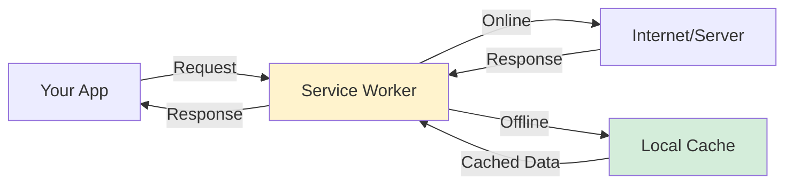
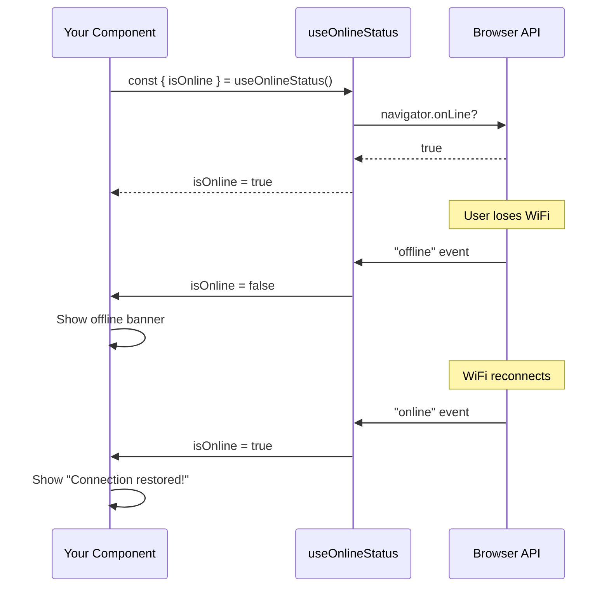
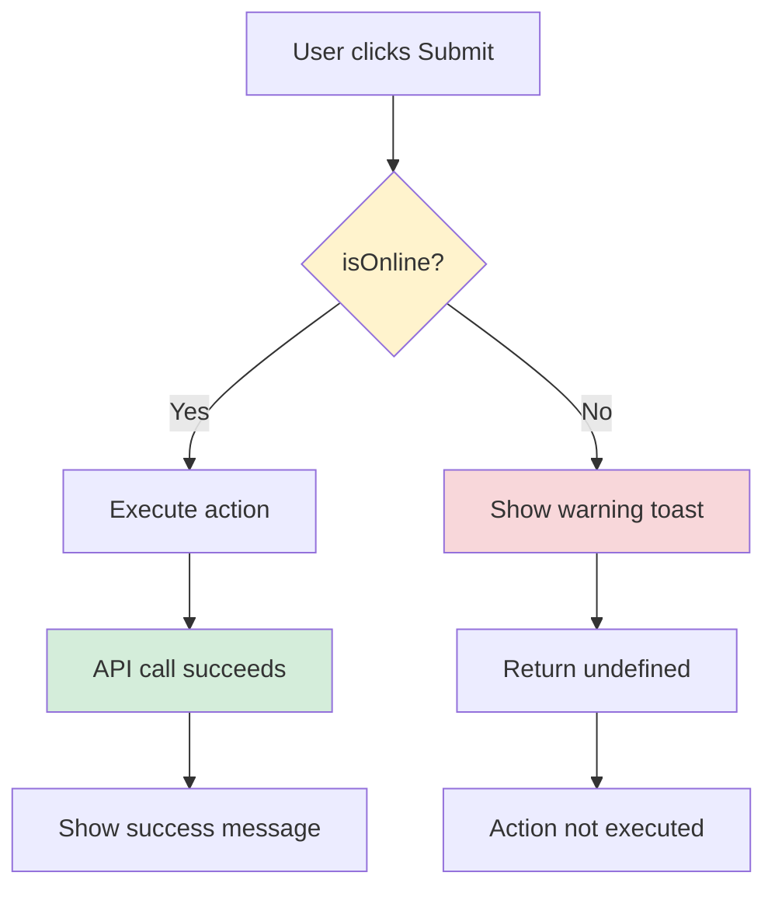
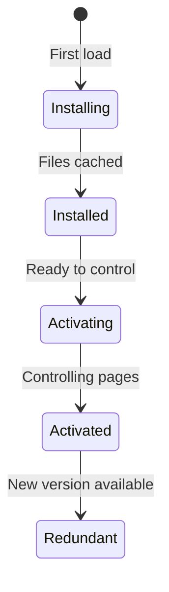

# Phase 4.1: PWA Implementation

## Stock Management System - Development Guide

**For Junior Developers**
**Last Updated:** November 26, 2025
**Phase Status:** ✅ Complete

---

## Quick Navigation

- [Phase 1.1: Project Foundation](../phase1/phase-1.1-foundation.md)
- [Phase 1.2: Database Setup](../phase1/phase-1.2-database.md)
- [Phase 1.3: Authentication & Security](../phase1/phase-1.3-authentication.md)
- [Phase 2.1: Transfer Management](../phase2/phase-2.1-transfers.md)
- [Phase 3.1: Period Management](../phase3/phase-3.1-period-management.md)
- [Phase 3.2: Period Close Workflow](../phase3/phase-3.2-period-close-workflow.md)
- [Phase 3.3: Period Close UI](../phase3/phase-3.3-period-close-ui.md)
- [Phase 4.1: PWA Implementation](phase-4.1-pwa-implementation.md) ← You are here

---

## What is a PWA?

### Simple Explanation

**PWA** stands for **Progressive Web App**. It is a special type of website that can work like a mobile app on your phone or computer.

Think of it like this:

- A normal website lives only in your browser
- A mobile app (like WhatsApp) is installed on your phone
- A **PWA** is in between - it's a website that you can install like an app!

### Why We Need PWA

**Problems with normal websites:**

- ❌ Cannot install on phone's home screen
- ❌ Breaks completely when no internet
- ❌ Looks like a browser tab, not an app
- ❌ No icon on home screen
- ❌ Users forget about it

**Benefits of PWA:**

- ✅ Can be installed like a real app
- ✅ Has an icon on home screen
- ✅ Opens in full screen (no browser bar)
- ✅ Can show messages when offline
- ✅ Loads faster (caches files)

### What Our PWA Does

Our Stock Management System PWA is a **Level 1 PWA**, which means:

| Feature           | Included    | Description                               |
| ----------------- | ----------- | ----------------------------------------- |
| Installable       | ✅ Yes      | Users can install the app on their device |
| App Icon          | ✅ Yes      | Custom navy blue icon with stock symbol   |
| Offline Detection | ✅ Yes      | Shows banner when user goes offline       |
| Offline Guards    | ✅ Yes      | Prevents form submissions when offline    |
| Cached Assets     | ✅ Yes      | Static files load faster                  |
| Full Offline Mode | ❌ No (MVP) | Cannot work completely offline (future)   |

---

## Phase 4.1 Overview

### What We Built

In this phase, we made our web application work like a mobile app. Users can install it on their phones and computers, and it will tell them when they lose internet connection.

### Tasks Completed

- ✅ 4.1.1: PWA Module Setup
- ✅ 4.1.2: App Icons
- ✅ 4.1.3: Offline Detection
- ✅ 4.1.4: Offline Guards
- ✅ 4.1.5: PWA Testing

---

## Task 4.1.1: PWA Module Setup

### Simple Explanation

We told Nuxt (our framework) to add PWA features to our website. This is done by configuring a "module" - a special plugin that adds new capabilities.

### What Was Done

#### The PWA Module

We use a module called `@vite-pwa/nuxt`. This module:

- Creates a **Service Worker** (a background script that handles caching)
- Generates a **Manifest** (a file that tells browsers this is an app)
- Configures **Workbox** (a tool by Google for caching)

#### Configuration in nuxt.config.ts

```typescript
// In nuxt.config.ts
export default defineNuxtConfig({
  modules: [
    "@vite-pwa/nuxt", // The PWA module
  ],

  pwa: {
    // How service worker updates
    registerType: "autoUpdate",

    // App manifest (metadata for browsers)
    manifest: {
      name: "Stock Management System",
      short_name: "FoodStock",
      description: "Multi-Location Inventory Management System",
      theme_color: "#000046", // Navy blue for browser bar
      background_color: "#000046", // Navy blue splash screen
      display: "standalone", // Full screen, no browser bar
      orientation: "portrait",
      icons: [
        {
          src: "/icon-192.png",
          sizes: "192x192",
          type: "image/png",
          purpose: "any maskable",
        },
        {
          src: "/icon-512.png",
          sizes: "512x512",
          type: "image/png",
          purpose: "any maskable",
        },
      ],
    },

    // Workbox caching configuration
    workbox: {
      navigateFallback: "/",
      globPatterns: ["**/*.{js,css,html,png,svg,ico,woff2}"],
      cleanupOutdatedCaches: true,
      runtimeCaching: [
        /* ... */
      ],
    },

    // Development settings
    devOptions: {
      enabled: true, // Enable PWA in dev mode for testing
      type: "module",
    },
  },
});
```

### Key Concepts Explained

#### 1. What is a Service Worker?

A **Service Worker** is like a helper that lives between your app and the internet.



**What it does:**

- Catches all network requests from your app
- If online: sends request to server and caches the response
- If offline: returns data from cache (if available)
- Runs in the background (even when tab is closed)

#### 2. What is the Manifest?

The **Manifest** is a JSON file that tells browsers:

- "This website wants to be an app"
- "Here is the app name and description"
- "Use this icon for the home screen"
- "Show it in full screen mode"

**Example manifest content:**

```json
{
  "name": "Stock Management System",
  "short_name": "FoodStock",
  "theme_color": "#000046",
  "icons": [{ "src": "/icon-192.png", "sizes": "192x192" }],
  "display": "standalone"
}
```

**Where to find it:**

- URL: `http://localhost:3000/manifest.webmanifest`
- Browser DevTools → Application → Manifest

#### 3. What is Workbox?

**Workbox** is a library from Google that makes caching easier. Instead of writing complex caching code, we just configure it.

**Our caching rules:**
| What | How | Why |
|------|-----|-----|
| Navigation | Fallback to `/` | SPA routing works offline |
| Static files | Precache | JS, CSS, images load fast |
| Google Fonts | Cache for 1 year | Fonts don't change often |

```typescript
workbox: {
  // If navigation fails, show the main page
  navigateFallback: "/",

  // Cache these file types
  globPatterns: ["**/*.{js,css,html,png,svg,ico,woff2}"],

  // Remove old cached files
  cleanupOutdatedCaches: true,

  // Special rules for external resources
  runtimeCaching: [
    {
      urlPattern: /^https:\/\/fonts\.googleapis\.com\/.*/i,
      handler: "CacheFirst",  // Use cache first, then network
      options: {
        cacheName: "google-fonts-cache",
        expiration: {
          maxEntries: 10,
          maxAgeSeconds: 60 * 60 * 24 * 365, // 1 year
        },
      },
    },
  ],
}
```

#### 4. Register Types

There are two ways the service worker can update:

| Type         | Behavior                                          |
| ------------ | ------------------------------------------------- |
| `autoUpdate` | Updates automatically in background (what we use) |
| `prompt`     | Shows a button asking user to update              |

We chose `autoUpdate` because:

- Users always get the latest version
- No confusing "Update Available" prompts
- Works automatically in background

---

### Files Modified

| File             | What Changed                     |
| ---------------- | -------------------------------- |
| `nuxt.config.ts` | Added complete PWA configuration |

---

## Task 4.1.2: App Icons

### Simple Explanation

We created custom icons for the app. When users install the app, they will see these icons on their phone's home screen.

### What Was Done

#### Icon Design

Our icon has three parts:

1. **Navy blue background** (#000046) - matches our brand color
2. **White building/warehouse** - represents storage/stock
3. **Emerald green arrow** (#45cf7b) - represents stock movement up

**Visual representation:**

```
┌──────────────────┐
│  ████████████    │  Navy Blue Background
│  █          █   │
│  █  ┌────┐  █   │  White Building
│  █  │    │  █ ▲ │
│  █  │ ██ │  █ │ │  Emerald Green Arrow
│  █  │ ██ │  █ │ │
│  ████████████ ▲ │
└──────────────────┘
```

#### Generated Icons

| File                  | Size       | Purpose                    |
| --------------------- | ---------- | -------------------------- |
| `public/icon-192.png` | 192×192 px | Standard app icon          |
| `public/icon-512.png` | 512×512 px | High-res for splash screen |
| `public/favicon.ico`  | 32×32 px   | Browser tab icon           |

#### How We Generated Icons

We used Node.js and the `sharp` library to create icons programmatically:

```javascript
// scripts/generate-icons.mjs
import sharp from "sharp";

// Create SVG with our design
const svg = `
<svg viewBox="0 0 512 512">
  <!-- Navy blue background -->
  <rect width="512" height="512" rx="64" fill="#000046"/>

  <!-- White building -->
  <rect x="128" y="192" width="192" height="224" fill="white"/>

  <!-- Door -->
  <rect x="192" y="288" width="64" height="128" fill="#000046"/>

  <!-- Window -->
  <rect x="240" y="224" width="48" height="48" fill="#000046"/>

  <!-- Green arrow -->
  <path d="M384 160 L432 240 L336 240 Z" fill="#45cf7b"/>
  <rect x="368" y="240" width="32" height="96" fill="#45cf7b"/>
</svg>
`;

// Generate 512x512
await sharp(Buffer.from(svg)).png().toFile("public/icon-512.png");

// Generate 192x192
await sharp(Buffer.from(svg)).resize(192, 192).png().toFile("public/icon-192.png");
```

#### Icon Requirements for PWA

For a PWA to be installable, it needs:

| Requirement      | Our Implementation           |
| ---------------- | ---------------------------- |
| At least 192×192 | ✅ `icon-192.png`            |
| At least 512×512 | ✅ `icon-512.png`            |
| PNG format       | ✅ Both are PNG              |
| Maskable support | ✅ `purpose: "any maskable"` |

**What is "maskable"?**

Different devices show icons in different shapes:

- Android: circles, rounded squares, squares
- iOS: rounded squares
- Windows: squares

A **maskable** icon has extra padding so it looks good in all shapes:

```
┌─────────────────────┐
│   Safe Zone         │
│  ┌─────────────┐    │
│  │             │    │  Maskable icon has
│  │  Main Icon  │    │  padding around the
│  │             │    │  main content
│  └─────────────┘    │
│                     │
└─────────────────────┘
```

---

### Files Created

| File                         | Purpose                   |
| ---------------------------- | ------------------------- |
| `public/icon-192.png`        | PWA icon for app manifest |
| `public/icon-512.png`        | High-resolution PWA icon  |
| `public/favicon.ico`         | Browser tab favicon       |
| `scripts/generate-icons.mjs` | Script to generate icons  |

---

## Task 4.1.3: Offline Detection

### Simple Explanation

We created a way to know when the user loses their internet connection. When offline, we show a banner at the top of the screen. When they reconnect, we show a "Connection restored!" message.

### What Was Done

#### The useOnlineStatus Composable

A **composable** in Vue/Nuxt is a reusable function that contains reactive state and logic. We created `useOnlineStatus` to track internet connection.

```typescript
// app/composables/useOnlineStatus.ts
export const useOnlineStatus = () => {
  const isOnline = ref(true);

  // Check browser's online status
  if (import.meta.client) {
    isOnline.value = navigator.onLine;
  }

  const handleOnline = () => {
    isOnline.value = true;
  };

  const handleOffline = () => {
    isOnline.value = false;
  };

  onMounted(() => {
    // Set initial value
    isOnline.value = navigator.onLine;

    // Listen for connection changes
    window.addEventListener("online", handleOnline);
    window.addEventListener("offline", handleOffline);
  });

  onUnmounted(() => {
    // Clean up event listeners
    window.removeEventListener("online", handleOnline);
    window.removeEventListener("offline", handleOffline);
  });

  return {
    isOnline: readonly(isOnline),
  };
};
```

**How it works:**



#### Key Concepts

**1. navigator.onLine**

The browser provides a property called `navigator.onLine` that tells us if the device has internet:

- `true` = connected to internet
- `false` = no internet connection

**2. Event Listeners**

The browser fires events when connection changes:

- `"online"` event: fired when connection restored
- `"offline"` event: fired when connection lost

```typescript
// Listen for changes
window.addEventListener("online", handleOnline);
window.addEventListener("offline", handleOffline);
```

**3. Cleanup**

When the component is destroyed, we must remove event listeners to prevent memory leaks:

```typescript
onUnmounted(() => {
  window.removeEventListener("online", handleOnline);
  window.removeEventListener("offline", handleOffline);
});
```

**4. readonly**

We return `readonly(isOnline)` so other components cannot accidentally change the value:

```typescript
return {
  isOnline: readonly(isOnline), // Can read but not write
};
```

---

#### The OfflineBanner Component

This component shows visual feedback when the user is offline:

```vue
<!-- app/components/OfflineBanner.vue -->
<script setup lang="ts">
const { isOnline } = useOnlineStatus();
const wasOffline = ref(false);
const reconnectTimer = ref<ReturnType<typeof setTimeout>>();

watch(isOnline, (online) => {
  if (!online) {
    // User went offline
    wasOffline.value = true;
  } else if (wasOffline.value) {
    // User came back online - show message for 3 seconds
    reconnectTimer.value = setTimeout(() => {
      wasOffline.value = false;
    }, 3000);
  }
});

onUnmounted(() => {
  if (reconnectTimer.value) {
    clearTimeout(reconnectTimer.value);
  }
});
</script>

<template>
  <!-- Offline Banner (Red) -->
  <Transition name="slide-down">
    <div
      v-if="!isOnline"
      class="fixed top-0 left-0 right-0 z-[100] bg-[var(--ui-error)] text-white py-2 px-4 text-center"
    >
      <span class="inline-flex items-center gap-2">
        <UIcon name="i-heroicons-signal-slash" class="w-4 h-4" />
        You're offline. Some features are unavailable.
      </span>
    </div>
  </Transition>

  <!-- Reconnected Banner (Green) -->
  <Transition name="slide-down">
    <div
      v-if="wasOffline && isOnline"
      class="fixed top-0 left-0 right-0 z-[100] bg-[var(--ui-success)] text-white py-2 px-4 text-center"
    >
      <span class="inline-flex items-center gap-2">
        <UIcon name="i-heroicons-signal" class="w-4 h-4" />
        Connection restored!
      </span>
    </div>
  </Transition>
</template>
```

**Banner States:**

| State                             | Banner Shown     | Color | Message                |
| --------------------------------- | ---------------- | ----- | ---------------------- |
| Online (was always online)        | None             | -     | -                      |
| Offline                           | Offline banner   | Red   | "You're offline..."    |
| Back online (after being offline) | Reconnect banner | Green | "Connection restored!" |
| 3 seconds after reconnect         | None             | -     | -                      |

**Animation:**

The banner slides down from the top of the screen using CSS transitions:

```css
.slide-down-enter-active,
.slide-down-leave-active {
  transition: transform 0.3s ease-out;
}

.slide-down-enter-from,
.slide-down-leave-to {
  transform: translateY(-100%); /* Start above the screen */
}
```

---

#### Where is OfflineBanner Used?

The banner is placed in `app.vue` (the root component) so it appears on ALL pages:

```vue
<!-- app/app.vue -->
<template>
  <NuxtLayout>
    <NuxtPage />
  </NuxtLayout>

  <!-- Global offline banner - shows on all pages -->
  <OfflineBanner />

  <!-- Toast notifications -->
  <UNotifications />
</template>
```

**Why in app.vue and not in layouts/default.vue?**

The login page uses `layout: false` to have no layout. If we put the banner in the layout, login users would not see offline warnings. By putting it in `app.vue`, it appears everywhere.

---

### Files Created

| File                                 | Purpose                                  |
| ------------------------------------ | ---------------------------------------- |
| `app/composables/useOnlineStatus.ts` | Composable to track online/offline state |
| `app/components/OfflineBanner.vue`   | Visual banner component                  |

### Files Modified

| File          | Change                        |
| ------------- | ----------------------------- |
| `app/app.vue` | Added OfflineBanner component |

---

## Task 4.1.4: Offline Guards

### Simple Explanation

We created a way to **prevent actions** when the user is offline. For example, if someone tries to submit a delivery while offline, we:

1. Stop the submission
2. Show a warning message
3. Disable the submit button

This prevents confusing error messages and lost data.

### What Was Done

#### The useOfflineGuard Composable

```typescript
// app/composables/useOfflineGuard.ts
export const useOfflineGuard = () => {
  const { isOnline } = useOnlineStatus();
  const toast = useAppToast();

  /**
   * Guard an action against offline state.
   * If offline, shows a warning toast and returns without executing.
   */
  const guardAction = async <T>(
    action: () => Promise<T>,
    options?: {
      offlineMessage?: string;
      offlineDescription?: string;
    }
  ): Promise<T | undefined> => {
    if (!isOnline.value) {
      toast.warning(options?.offlineMessage || "You are offline", {
        description:
          options?.offlineDescription ||
          "This action requires an internet connection. Please check your connection and try again.",
        icon: "i-lucide-wifi-off",
      });
      return undefined;
    }

    return await action();
  };

  /**
   * Synchronous check - useful for quick validation.
   */
  const checkOnline = (options?: {
    offlineMessage?: string;
    offlineDescription?: string;
  }): boolean => {
    if (!isOnline.value) {
      toast.warning(options?.offlineMessage || "You are offline", {
        description: options?.offlineDescription || "This action requires an internet connection.",
        icon: "i-lucide-wifi-off",
      });
      return false;
    }
    return true;
  };

  return {
    isOnline, // Use for disabling buttons
    guardAction, // Use to wrap async actions
    checkOnline, // Use for quick checks
  };
};
```

#### How guardAction Works



**Example usage in a page:**

```typescript
// In a page component
const { isOnline, guardAction } = useOfflineGuard();

const submitDelivery = async () => {
  // guardAction will stop if offline and show warning
  await guardAction(async () => {
    await $fetch("/api/locations/${locationId}/deliveries", {
      method: "POST",
      body: formData,
    });
    // Show success, navigate, etc.
  });
};
```

---

#### Where We Applied Offline Guards

| Page                    | Function                   | What it Protects       |
| ----------------------- | -------------------------- | ---------------------- |
| `deliveries/create.vue` | `submitDelivery`           | Delivery posting       |
| `issues/create.vue`     | `submitIssue`              | Issue posting          |
| `transfers/create.vue`  | `submitTransfer`           | Transfer creation      |
| `period-close.vue`      | `handleMarkReady`          | Marking location ready |
| `period-close.vue`      | `handleClosePeriod`        | Period close request   |
| `period-close.vue`      | `handleApprovePeriodClose` | Close approval         |

---

#### Disabling Buttons When Offline

We also disable submit buttons when offline so users know they can't submit:

```vue
<template>
  <UButton
    type="submit"
    color="primary"
    :disabled="!isOnline || isSubmitting"
    :loading="isSubmitting"
    class="cursor-pointer"
  >
    Submit Delivery
  </UButton>
</template>

<script setup>
const { isOnline } = useOfflineGuard();
const isSubmitting = ref(false);
</script>
```

**Visual feedback:**

| State                  | Button Appearance         |
| ---------------------- | ------------------------- |
| Online, not submitting | Normal, clickable         |
| Online, submitting     | Loading spinner           |
| Offline                | Grayed out, not clickable |

---

### Files Created

| File                                 | Purpose                              |
| ------------------------------------ | ------------------------------------ |
| `app/composables/useOfflineGuard.ts` | Guard composable with toast warnings |

### Files Modified

| File                              | Changes                                   |
| --------------------------------- | ----------------------------------------- |
| `app/pages/deliveries/create.vue` | Added guardAction, disabled button        |
| `app/pages/issues/create.vue`     | Added guardAction, disabled button        |
| `app/pages/transfers/create.vue`  | Added guardAction, disabled button        |
| `app/pages/period-close.vue`      | Added guardAction to all submit functions |

---

## Task 4.1.5: PWA Testing

### Simple Explanation

We tested all PWA features to make sure they work correctly on different devices and browsers. We used Playwright (a browser automation tool) to simulate different scenarios.

### What Was Done

#### Testing Categories

**1. Service Worker Registration**

```javascript
// Check if service worker is registered
const swRegistrations = await page.evaluate(async () => {
  const regs = await navigator.serviceWorker.getRegistrations();
  return regs.map((r) => ({
    scope: r.scope,
    active: r.active?.state,
  }));
});
// Result: { scope: 'http://localhost:3000/', active: 'activated' }
```

**2. Manifest Configuration**

```javascript
// Fetch and verify manifest
const manifest = await page.evaluate(async () => {
  const link = document.querySelector('link[rel="manifest"]');
  const response = await fetch(link.href);
  return response.json();
});
// Verify name, icons, colors, display mode
```

**3. Mobile Viewport Testing**

```javascript
// Test Android viewport (375×812)
await page.setViewportSize({ width: 375, height: 812 });

// Test iOS viewport (393×852)
await page.setViewportSize({ width: 393, height: 852 });
```

**4. Offline Behavior Testing**

```javascript
// Simulate going offline
await page.evaluate(() => {
  window.dispatchEvent(new Event("offline"));
});

// Check if banner appears
const banner = await page.locator(".offline-banner");
await expect(banner).toBeVisible();
```

---

#### Test Results Summary

| Category             | Tests  | Passed    |
| -------------------- | ------ | --------- |
| Service Worker       | 4      | 4 ✅      |
| Desktop Installation | 4      | 4 ✅      |
| Android Installation | 4      | 4 ✅      |
| iOS Installation     | 6      | 6 ✅      |
| Offline Behavior     | 5      | 5 ✅      |
| Cache Updates        | 5      | 5 ✅      |
| **Total**            | **28** | **28 ✅** |

---

#### Browser Compatibility

| Browser | Desktop Support      | Mobile Support        |
| ------- | -------------------- | --------------------- |
| Chrome  | ✅ Full PWA          | ✅ Full PWA           |
| Edge    | ✅ Full PWA          | ✅ Full PWA           |
| Firefox | ⚠️ No install prompt | ⚠️ No install prompt  |
| Safari  | ⚠️ No install prompt | ✅ Add to Home Screen |

**Note:** Firefox does not support PWA installation, but service workers and caching still work.

---

### Files Created

| File                                  | Purpose                             |
| ------------------------------------- | ----------------------------------- |
| `project-docs/pwa-testing-results.md` | Detailed test results documentation |

---

## Important Files Summary

### Composables

| File                                 | Lines | Purpose                            |
| ------------------------------------ | ----- | ---------------------------------- |
| `app/composables/useOnlineStatus.ts` | ~60   | Track browser online/offline state |
| `app/composables/useOfflineGuard.ts` | ~90   | Guard actions and show warnings    |

### Components

| File                               | Lines | Purpose                          |
| ---------------------------------- | ----- | -------------------------------- |
| `app/components/OfflineBanner.vue` | ~70   | Show offline/reconnected banners |

### Configuration

| File             | Lines Changed | Purpose                  |
| ---------------- | ------------- | ------------------------ |
| `nuxt.config.ts` | ~70           | PWA module configuration |

### Assets

| File                  | Size    | Purpose           |
| --------------------- | ------- | ----------------- |
| `public/icon-192.png` | 192×192 | PWA manifest icon |
| `public/icon-512.png` | 512×512 | High-res PWA icon |
| `public/favicon.ico`  | 32×32   | Browser tab icon  |

### Scripts

| File                         | Purpose                       |
| ---------------------------- | ----------------------------- |
| `scripts/generate-icons.mjs` | Generate app icons with Sharp |

---

## Key Concepts Learned

### 1. Progressive Enhancement

Our PWA adds features **progressively**:

- Basic: Works as normal website
- Better: Shows offline warnings
- Best: Installable on device

Users without PWA support still get a working website.

### 2. Service Worker Lifecycle



**States:**

- **Installing:** Downloading and caching files
- **Installed:** All files cached, waiting
- **Activating:** Taking control of pages
- **Activated:** Running and intercepting requests
- **Redundant:** Replaced by newer version

### 3. Caching Strategies

Different content needs different caching:

| Strategy               | Description                        | Good For                   |
| ---------------------- | ---------------------------------- | -------------------------- |
| Cache First            | Check cache, then network          | Fonts, images              |
| Network First          | Check network, fallback to cache   | API data                   |
| Stale While Revalidate | Return cache, update in background | Frequently updated content |

We use **Cache First** for fonts because they rarely change.

### 4. Reactive State Pattern

The composable pattern allows sharing state across components:

```typescript
// Any component can use this
const { isOnline } = useOnlineStatus();

// All components share the SAME reactive state
// When isOnline changes, ALL components update
```

### 5. Event Cleanup

Always clean up event listeners to prevent memory leaks:

```typescript
onMounted(() => {
  window.addEventListener("online", handler);
});

onUnmounted(() => {
  window.removeEventListener("online", handler); // Important!
});
```

---

## Common Terms Explained

| Term               | Simple Explanation                                                |
| ------------------ | ----------------------------------------------------------------- |
| **PWA**            | Progressive Web App - a website that can be installed like an app |
| **Service Worker** | A script that runs in the background and handles caching          |
| **Manifest**       | A JSON file that tells browsers about your app                    |
| **Workbox**        | A Google library that makes caching easier                        |
| **Cache**          | Stored files that load faster next time                           |
| **Offline Guard**  | Code that prevents actions when there's no internet               |
| **Composable**     | A reusable function with reactive state (Vue/Nuxt)                |
| **Precache**       | Files downloaded and stored before they're needed                 |
| **Runtime Cache**  | Files cached when they're first requested                         |
| **Maskable Icon**  | An icon designed to work in different shapes                      |

---

## Common Issues and Solutions

### Issue 1: Service Worker Not Registering

**Symptoms:**

- PWA install prompt doesn't appear
- No service worker in DevTools

**Cause:** Service workers only work on HTTPS or localhost

**Solution:**

```typescript
// Check in browser console
console.log("Is secure context:", window.isSecureContext);
// Must be true for PWA to work

// On localhost, this is always true
// On production, you need HTTPS
```

### Issue 2: Icons Not Showing

**Symptoms:**

- Install prompt has generic icon
- Home screen shows blank

**Cause:** Icons not found or wrong size

**Solution:**

```bash
# Verify icons exist
ls -la public/icon-*.png

# Verify manifest references correct paths
curl http://localhost:3000/manifest.webmanifest | grep icon

# Check DevTools → Application → Manifest for errors
```

### Issue 3: Offline Banner Not Appearing

**Symptoms:**

- Banner doesn't show when offline
- Works in DevTools but not real offline

**Cause:** Component not mounted or events not firing

**Solution:**

```vue
<!-- Make sure OfflineBanner is in app.vue, not just layout -->
<template>
  <NuxtLayout>
    <NuxtPage />
  </NuxtLayout>
  <OfflineBanner />
  <!-- Must be here, at root level -->
</template>
```

### Issue 4: guardAction Not Blocking

**Symptoms:**

- Form submits even when offline
- No warning toast shown

**Cause:** Action not wrapped correctly

**Solution:**

```typescript
// Wrong - action runs immediately
guardAction(submitForm());

// Correct - action is wrapped in function
guardAction(async () => await submitForm());
```

### Issue 5: Cache Not Updating

**Symptoms:**

- Old version of app after deploy
- Changes not visible

**Cause:** Service worker using old cache

**Solution:**

```javascript
// In browser DevTools → Application → Service Workers
// Click "Update" or "Unregister" and reload

// Or clear caches
await caches.delete("workbox-precache-v2");
```

---

## Testing Checklist

### Manual Testing Steps

**1. Service Worker**

- [ ] Open DevTools → Application → Service Workers
- [ ] Verify service worker is "activated"
- [ ] No errors in console

**2. Manifest**

- [ ] Open DevTools → Application → Manifest
- [ ] All fields populated correctly
- [ ] Icons showing with correct sizes
- [ ] No manifest warnings

**3. Installation (Desktop Chrome)**

- [ ] Click install icon in address bar
- [ ] App installs and opens in new window
- [ ] Icon appears in dock/taskbar

**4. Installation (Mobile)**

- [ ] On Android: "Add to Home Screen" option appears
- [ ] On iOS: Share → Add to Home Screen
- [ ] App opens full screen (no browser bar)

**5. Offline Detection**

- [ ] Turn off WiFi/data
- [ ] Red banner appears within 2 seconds
- [ ] Turn on WiFi/data
- [ ] Green "Connection restored!" appears
- [ ] Green banner disappears after 3 seconds

**6. Offline Guards**

- [ ] Go offline
- [ ] Try to submit a delivery
- [ ] Warning toast appears
- [ ] Form does NOT submit
- [ ] Submit button is disabled/grayed

**7. Cached Assets**

- [ ] Turn off WiFi
- [ ] Refresh page
- [ ] Static content still loads (from cache)
- [ ] API calls fail gracefully

---

## What's Next?

After completing PWA Implementation (Phase 4.1), the next phases are:

**→ Phase 4.2: UI/UX Polish** (Pending)

- Consistent styling across all pages
- Loading states and skeleton loaders
- Empty state designs
- Accessibility improvements

**→ Phase 4.3: Performance Optimization** (Pending)

- Database query optimization
- API response time improvements
- Frontend bundle optimization
- Data caching strategies

**→ Phase 4.4: Testing** (Pending)

- Unit tests for business logic
- API endpoint tests
- Integration tests
- Manual testing completion

---

## Summary

In Phase 4.1, we built a complete PWA implementation with:

✅ **PWA Module Configuration** - Service worker, manifest, and Workbox caching

✅ **Custom App Icons** - Navy blue with stock/warehouse design, all required sizes

✅ **Offline Detection** - Real-time tracking of browser online/offline state

✅ **Visual Feedback** - Banner slides down when offline, shows reconnection message

✅ **Offline Guards** - Prevents form submissions when offline with toast warnings

✅ **Disabled Buttons** - Visual indication that actions unavailable offline

✅ **Comprehensive Testing** - 28/28 tests passed across all categories

The PWA implementation transforms our web application into an installable app that users can add to their home screens. It provides clear feedback when offline and prevents data loss by blocking submissions that would fail anyway.

---

**Made for Junior Developers**

---

**Last Updated:** November 26, 2025
**Phase:** 4.1 PWA Implementation ✅ Complete
**Next:** Phase 4.2 UI/UX Polish
